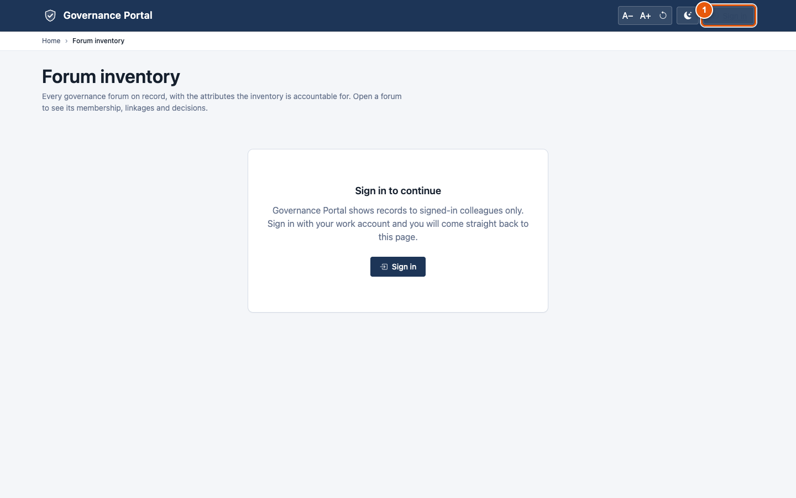
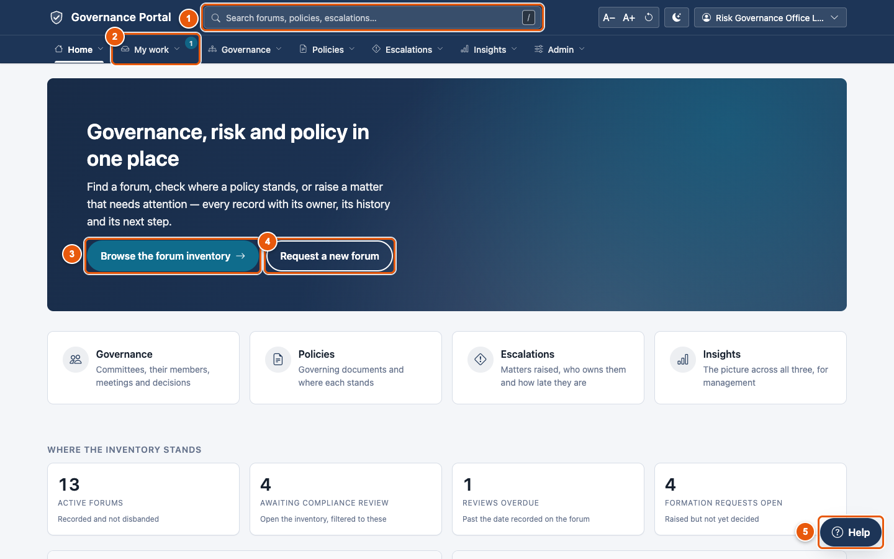
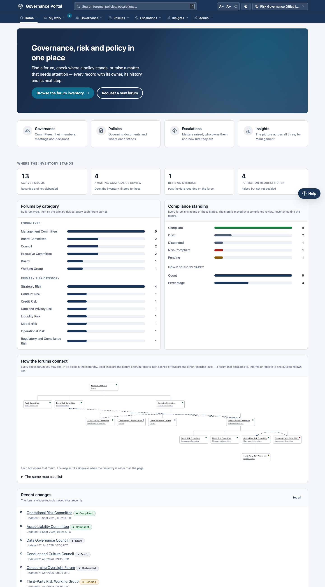
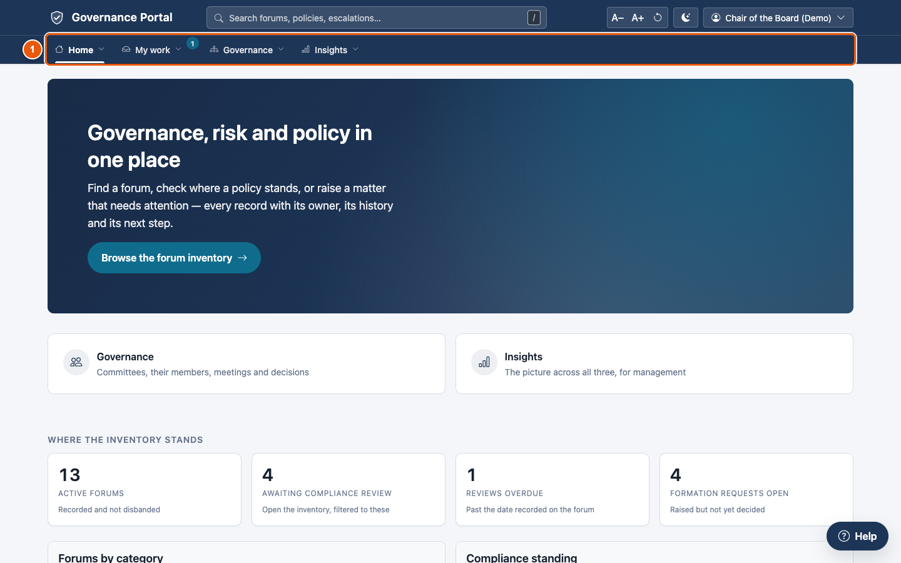

# 0. Welcome

Consilium brings your organisation's **governance, risk and policy** work
into one place. Every committee, every policy and every escalated issue is
there, with its owner, its history and its next step. You no longer chase
spreadsheets, email threads and shared drives.

## What the platform does for you

| Area | What it does for you |
|---|---|
| **Governance** | Keeps an up-to-date inventory of your boards, committees, councils and working groups: what each one is for, who sits on it, how they connect, what they decided, and whether each is properly set up. New committees are requested, evaluated and approved here. Meetings, minutes, motions, votes and charters live here too. |
| **Policies** | Holds every framework, policy, standard and procedure through its whole life: requesting a change, drafting, review, approval in the right order, publication to the right people, periodic review, attestation and retirement. Every version is kept. |
| **Escalations** | Lets anyone raise an issue that needs attention at a higher level. The platform proposes how serious it is and which committees must see it, then tracks the owner, the action plans, the time limit and the closure. |
| **Insights** | Management reporting across all three areas, plus analysis: where coverage is missing, where risk is rising, and what a regulatory change touches. |
| **AI help** | A **Help** button on every screen answers your questions in plain language and shows its sources. Optional AI commentary helps with analysis. AI never sees records it shouldn't. |

Three things make it trustworthy:

- **Nothing is ever deleted.** Committees are disbanded, policies retired,
  seats ended and versions added. You can always see how things stood on any
  date.
- **Everyone sees only what they should.** What you see depends on your role.
  Confidential policies and sensitive escalations are visible only to the
  people cleared for them.
- **Everything is recorded.** Who did what and when, and every time a rule
  stopped something, is kept for audit.

## Who it's for

| You are… | You'll mostly use… |
|---|---|
| A board or committee member | The forum pages, decisions, and your **My work** list for votes and attestations |
| The Chief Risk Officer or a senior executive | **Insights**, escalations, and approvals in **My work** |
| A policy owner | Your policies, their versions and reviews |
| A committee secretary | Your committees' meetings, minutes, motions and membership |
| The risk governance office | The forum inventory, formation requests, compliance and campaigns |
| The enterprise policy office | Policy approvals, publication and attestation |
| A second-line reviewer | Reviews and challenges across forums, policies and escalations |
| An escalation owner | Raising, owning and closing escalations |
| An internal auditor | Reading everything, history and evidence packs |
| A records manager | Retention and legal holds |

[Chapter 8](08-your-first-day.md) has a page for each role.

---

## Signing in

1. Open the platform's address in your browser. Your administrator gives it to
   you.
2. Sign in with your work account. If your organisation uses single sign-on,
   choose that option on the sign-in page.
3. You arrive on the **Home** page.

If you open a link while signed out, the platform asks you to sign in first.

① Click **Sign in**. Afterwards you go straight back to the screen the link
was for, with any filters still applied.

> **Demonstration and training sites.** On a demonstration site your
> administrator gives you a demonstration login (for example the *Committee
> Secretary*) so you can see the platform through that role. Ask them for it.

---

## Your first five minutes

① **Search.** Click the search box, or press **/**, and type part of a name. Forums,
   policies and escalations appear as you type.

② **My work.** The number shows how many things are waiting on you. Click it
   to see them ([chapter 2](02-my-work.md)).

③ **Browse the forum inventory** opens the list of every committee and board.

④ **Request a new forum** starts a guided request for a new committee (if
   your role can raise one).

⑤ **Help.** Ask anything about the screen you're on.

**Try this now:**

1. Click **My work** and see what's waiting for you.
2. Type the name of a committee you sit on into the search box and open it.
3. Click through its tabs: **Details**, **Membership**, **Decisions**.
4. Click **Help** and ask "What can I do here?".
5. Open **Home → How it works** to read your governance office's own guidance.

Below the banner, the home page shows **where the inventory stands** (active
forums, those awaiting a compliance review, overdue reviews and open requests)
with charts by category and compliance standing. Each figure opens the list
behind it. Further down are the **forum map**, recent changes, and **How it
works**, the guidance written by your governance office.

**Everyone's home page is shaped by their role.** A board member, for example,
sees the **Governance** and **Insights** menus but not **Escalations** or
**Admin**:

① The menus you see depend on your role.

**Next:** [chapter 1](01-finding-your-way.md) tours the screen in detail.
