# 1. Finding your way

This chapter tours the screen: the header at the top, the menus, search, **My
work**, **Help**, and the parts every page and every list share. It ends with
each menu opened and every item explained.

---

## 1.1 The header

The header is the same on every screen.

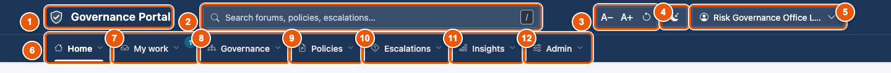

**Top row**

① **Your organisation's name.** Click it to go back to the home page from
anywhere.

② **Search.** Type part of a name, a reference or a word from a mandate.
Press **/** on your keyboard to jump straight here (section 1.2).

③ **Text size.** **A−** and **A+** make all text smaller or larger, one step
at a time. **↺** goes back to the normal size.

④ **Theme.** Switches between the light and dark theme.

⑤ **Your name.** Opens your menu: your profile, and **Sign out**.

**Menus** (section 1.5 opens each one)

⑥ **Home**: the overview, the forum map and your organisation's guidance.

⑦ **My work**: everything waiting on you. The number is how many items.

⑧ **Governance**: forums and committees.

⑨ **Policies**: the policy library and everything that changes it.

⑩ **Escalations**: the escalation register.

⑪ **Insights**: reporting and analysis.

⑫ **Admin**: administration (administrators only).

You see only the menus your role uses. A board member, for example, has no
**Escalations** or **Admin** menu.

---

## 1.2 Search

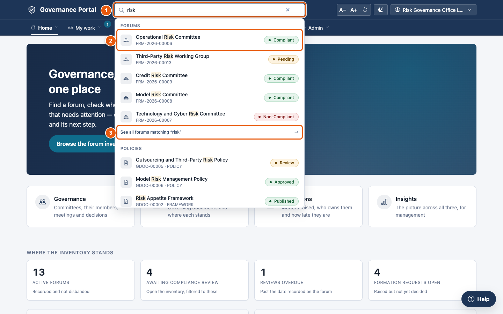

① Click the search box (or press **/**) and type at least two letters.

② Matches appear as you type, grouped into **Forums**, **Policies** and
**Escalations**, each with its standing. Click one to open it, or use the arrow
keys and press Enter.

③ **See all forums matching…** opens the full list, already filtered.

You only ever find records you're allowed to see.

---

## 1.3 Your menu, text size and theme

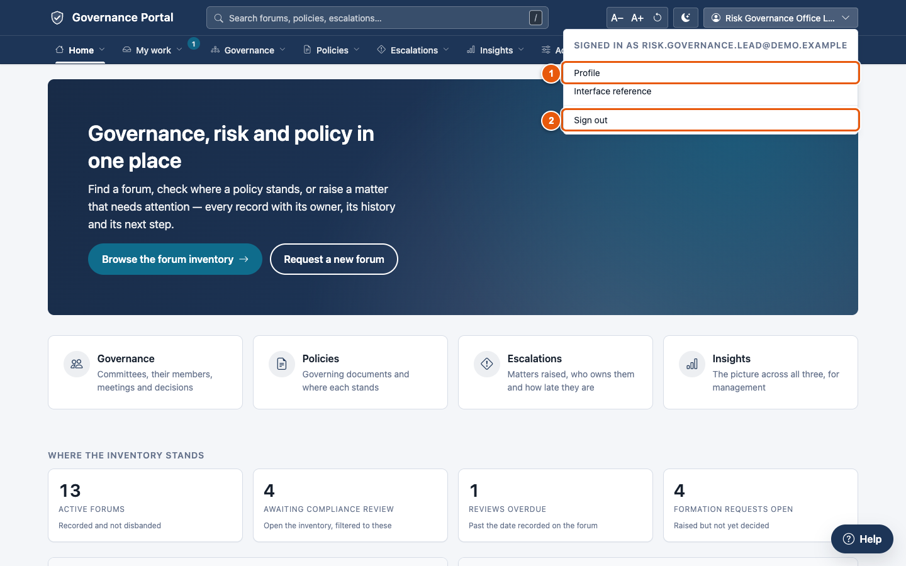

① **Profile**: your account details.

② **Sign out**: always sign out on a shared computer.

**Text size.** Click **A+** to make everything easier to read. The platform
remembers your choice on this computer.

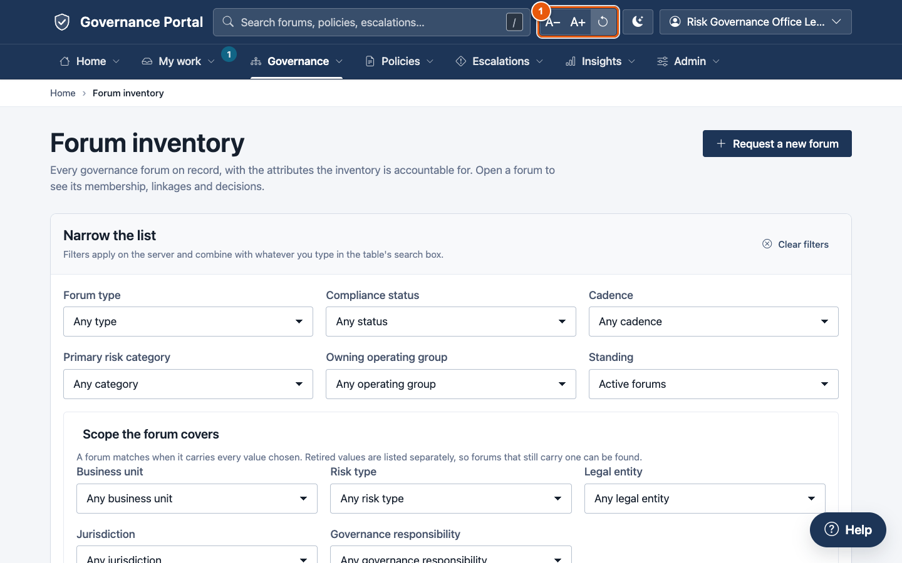

① The text size controls: **A−**, **A+** and **↺** (normal size).

**Dark theme.** Click the moon to switch. Click again to switch back. Until you
choose, the platform follows your computer's setting.

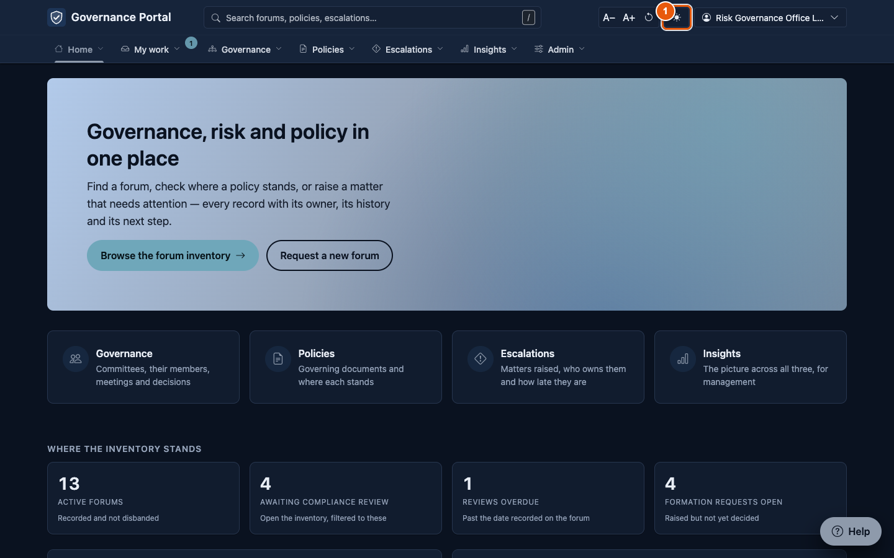

① The theme button.

---

## 1.4 The parts of a page

Every record's page (a forum, a policy, an escalation) is laid out the same
way.

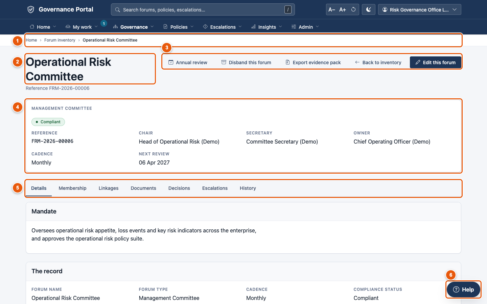

① **Breadcrumbs** show where you are. Click any part to go back up, for example
from a forum back to the **Forum inventory**.

② **The title** is the record's name, with its reference beneath.

③ **Page buttons** act on the whole record, for example **Edit this forum** or
**Back to inventory**. You see only the buttons your role may use.

④ **The summary** shows the record's standing as coloured labels (such as
*Compliant* or *Overdue*) and the key facts: owner, chair, dates.

⑤ **Tabs** divide the record into topics. Click one to open it. The address
changes too, so you can send someone a link straight to a tab.

⑥ **Help** answers questions about this page ([chapter 7](07-help-and-ai.md)).

Many pages also have a **What you can do now** card. It offers only the
actions open to you at the record's current stage, and says why an action is
not available yet.

---

## 1.5 Lists: filters, search, sorting and export

The forum inventory, the policy library and the escalation register all work
the same way.

**Narrowing the list**

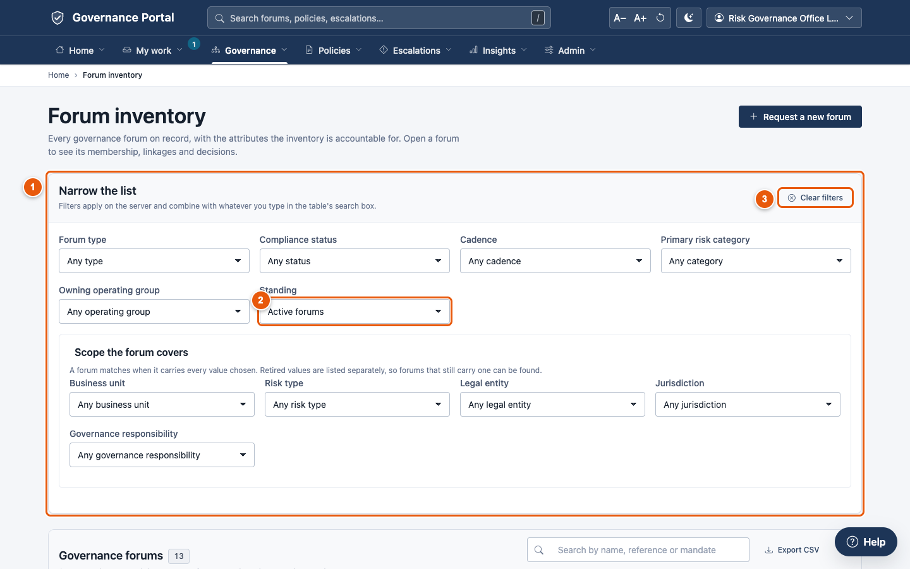

① **Narrow the list** holds the filters. Choose a value in any of them and the
list updates at once.

② **Standing** gives ready-made views, such as *Active forums*, *Awaiting
review* or *Review overdue*.

③ **Clear filters** starts again.

Your filters are kept in the page address. If you reload, go back, bookmark
the page or send the link to a colleague, the same filtered list opens.

**Working with the table**

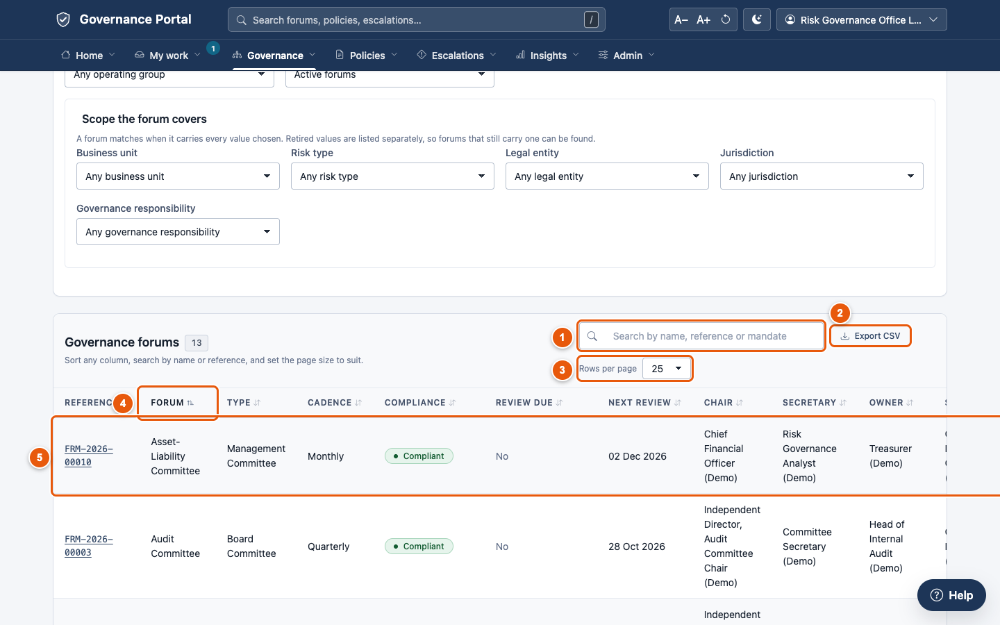

① **Search this table.** Type and press Enter to narrow the rows further.

② **Export CSV** downloads every row that matches your filters and search, as
a spreadsheet file.

③ **Rows per page.** Choose 10, 25, 50 or 100. The platform remembers your
choice.

④ **Column headings.** Click one to sort by it; click again to reverse the
order.

⑤ **A row.** Click it to open the record. Wide tables scroll sideways.

**When nothing matches**

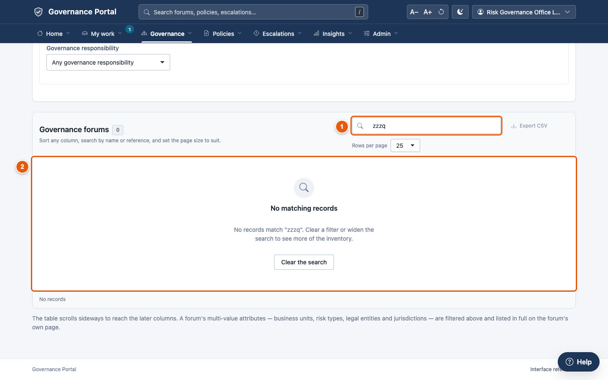

① What you searched for.

② The platform says nothing matches and suggests what to do, for example
**Clear the search**. An empty list is never a fault: it means nothing fits
what you asked for.

---

## 1.6 Every menu, item by item

Click a menu's name to open it; click again, press Esc or click elsewhere to
close it. Each item has a one-line description.

### Home

The home page's four cards (**Governance**, **Policies**, **Escalations** and
**Insights**) match the menus. You see only the cards and sections your role
can read.

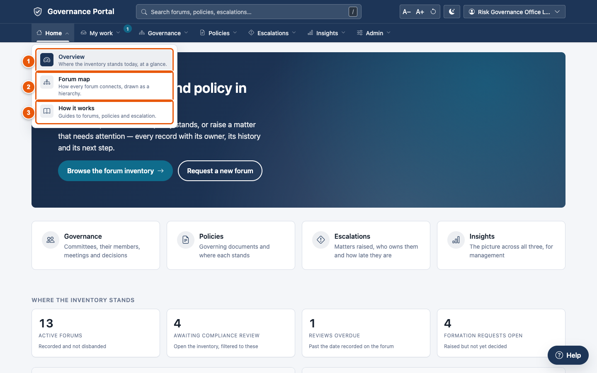

① **Overview**: the home page, showing where the inventory stands today.

② **Forum map**: how every forum connects, drawn as a hierarchy.

③ **How it works**: your governance office's guidance on forums, policies and
escalation.

### My work

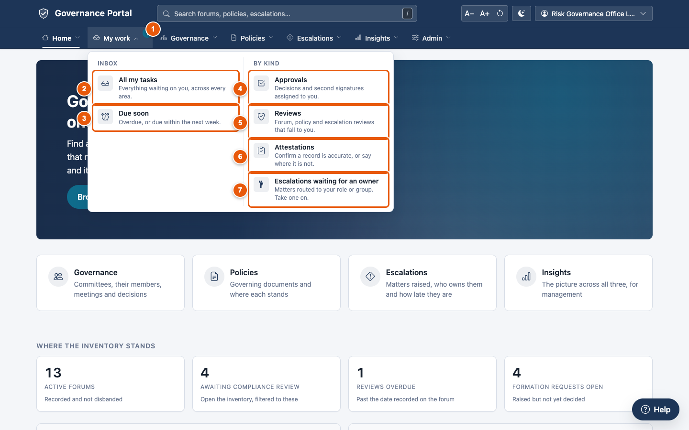

① **The count**: how many items are waiting on you.

② **All my tasks**: everything waiting on you, in every area.

③ **Due soon**: overdue, or due within the next week.

④ **Approvals**: decisions and second signatures assigned to you.

⑤ **Reviews**: forum, policy and escalation reviews that fall to you.

⑥ **Attestations**: confirm a record is accurate, or say where it isn't.

⑦ **Escalations waiting for an owner**: matters routed to your role or team.
Take one on.

[Chapter 2](02-my-work.md) covers each view.

### Governance

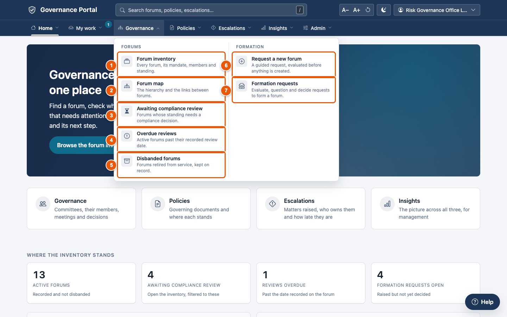

① **Forum inventory**: every forum, its mandate, members and standing.

② **Forum map**: the hierarchy and the links between forums.

③ **Awaiting compliance review**: forums whose standing needs a compliance
decision.

④ **Overdue reviews**: active forums past their review date.

⑤ **Disbanded forums**: forums retired from service, kept on record.

⑥ **Request a new forum**: a guided request, evaluated before anything is
created.

⑦ **Formation requests**: evaluate, question and decide requests to form a
forum (governance office).

[Chapter 3](03-governance.md) covers governance.

### Policies

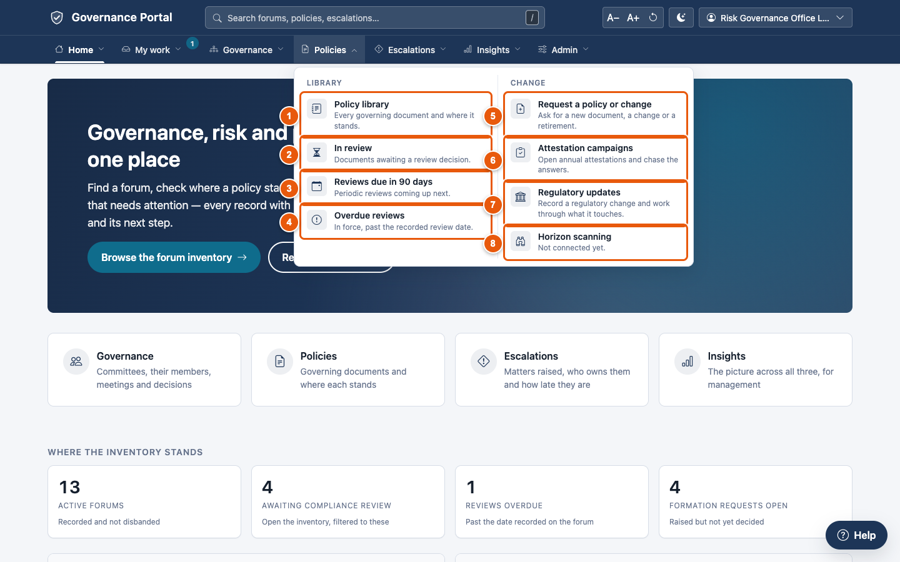

① **Policy library**: every governing document and where it stands.

② **In review**: documents waiting for a review decision.

③ **Reviews due in 90 days**: periodic reviews coming up next.

④ **Overdue reviews**: in force, but past their review date.

⑤ **Request a policy or change**: ask for a new document, a change or a
retirement.

⑥ **Attestation campaigns**: open annual attestations and chase the answers.

⑦ **Regulatory updates**: record a regulatory change and work through what it
touches.

⑧ **Horizon scanning**: opens your organisation's horizon-scanning service,
for upcoming regulatory change, in a new browser tab. Until your administrator
connects it, the item says **Not connected yet.**

[Chapter 4](04-policies.md) covers policies.

### Escalations

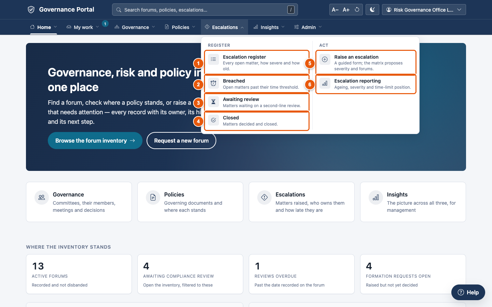

① **Escalation register**: every open matter, how severe and how old.

② **Breached**: open matters past their time limit.

③ **Awaiting review**: matters waiting on a second-line review.

④ **Closed**: matters decided and closed.

⑤ **Raise an escalation**: a guided form; the platform proposes the severity
and the committees.

⑥ **Escalation reporting**: ageing, severity and time-limit position.

[Chapter 5](05-escalations.md) covers escalations.

### Insights

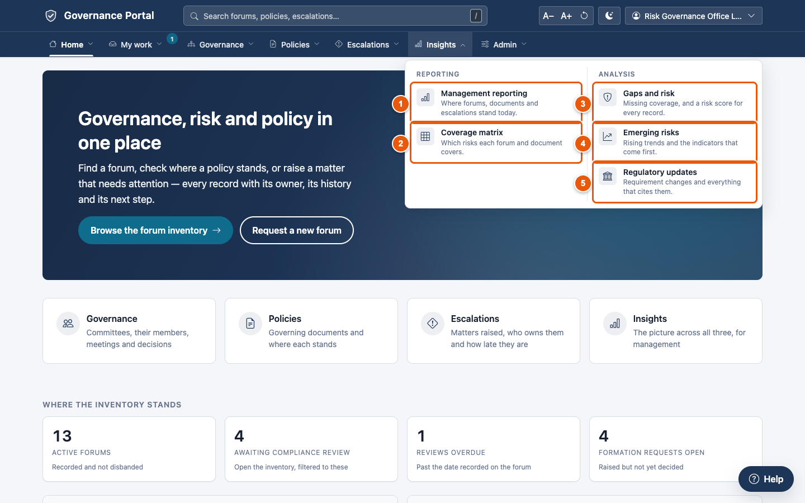

① **Management reporting**: where forums, documents and escalations stand
today.

② **Coverage matrix**: which risks each forum and document covers.

③ **Gaps and risk**: missing coverage, and a risk score for every record.

④ **Emerging risks**: rising trends and the early indicators that come first.

⑤ **Regulatory updates**: requirement changes and everything that cites them.

[Chapter 6](06-insights.md) covers insights.

### Admin

Administrators see the **Admin** menu, in two groups: **People and data**
and **Configuration**. What's in it depends on their permissions. A business
administrator sees:

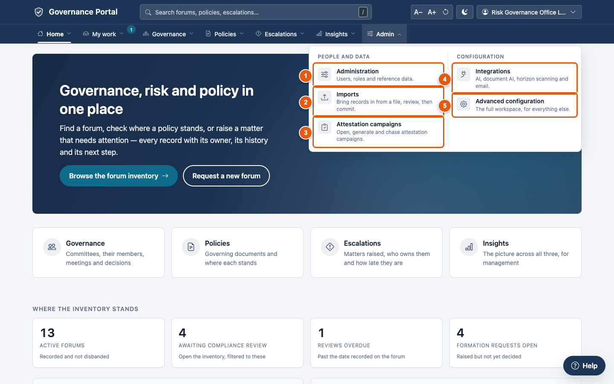

① **Administration**: users, roles and the reference lists.

② **Imports**: bring records in from a spreadsheet, review them, then commit.

③ **Attestation campaigns**: open, generate and chase attestation campaigns.

④ **Integrations**: AI, Doc AI, horizon scanning, email and single sign-on.

⑤ **Advanced configuration**: the full configuration screens, for everything
else.

The platform's system administrator also sees **Branding** (your name, logo,
colours and home-page banner):

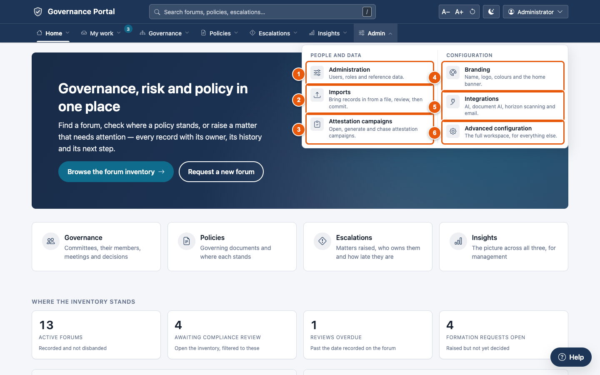

① **Administration**, ② **Imports** and ③ **Attestation campaigns**, as above.

④ **Branding**: your name, logo, colours and home-page banner.

⑤ **Integrations** and ⑥ **Advanced configuration**, as above.

[Chapter 9](09-administration.md) covers administration.

---

## 1.7 On a phone or tablet

On a narrow screen the header shrinks to fit.

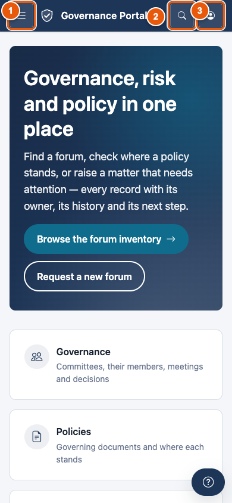

① **The menu button** opens every menu in a slide-out panel.

② **Search.**

③ **Your menu.**

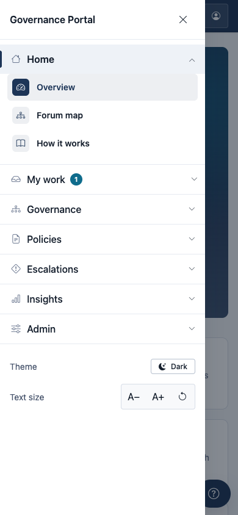

In the slide-out menu, tap a menu's name to show its items. Text size and the
theme are at the bottom. Tables scroll sideways inside their cards.

---

## Tips

- **Press / anywhere** to search.
- **Bookmark the views you use every week**, such as *Overdue reviews* or
  *Awaiting review*. The filters are part of the link.
- **Send links, not screenshots.** A link opens the live record for your
  colleague, who still sees only what they may see.
