# 1. Getting started

**Purpose.** Sign in, find your way round, and understand the two ways into
the system: the **portal** and the **workspace**. This chapter also covers the
settings you can change for yourself and the help assistant.

**Who can do it.** Everyone with an account.

---

## 1.1 Signing in

1. Open the system's address in your browser. Your administrator gives you
   this address.
2. Sign in with your work account. If your organisation uses single sign-on,
   choose that button on the sign-in page.
3. You arrive on the **Home** page.

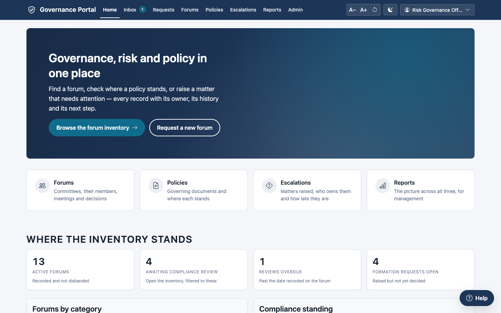

> **Demonstration and training sites.** The demonstration personas
> (`…@demo.example`, such as the Committee Secretary or the Chief Risk
> Officer) are created **without a password**, so nobody can sign in as them
> until an administrator decides they should. On a demonstration or training
> site the administrator runs `deploy/demo_logins.py`:
>
> ```
> cd .bench/sites
> FRAPPE_BENCH_ROOT=<bench> ../../.venv/bin/python ../../deploy/demo_logins.py \
>     --site <site> --url http://<site>:8000 --out ~/demo-logins.md
> ```
>
> It gives every persona a new random password and writes them, with each
> persona's roles and the page to start from, to the file named by `--out`.
> That file must be **outside the repository**: the script refuses to write it
> inside. Running the script again issues new passwords. Nothing is emailed,
> and no password appears in these guides or anywhere in the repository. Ask
> your administrator for the file. The script refuses a site that has real
> (non-demonstration) users unless told otherwise.

**If you open a page while signed out**, it asks you to sign in and returns
you to the page afterwards.

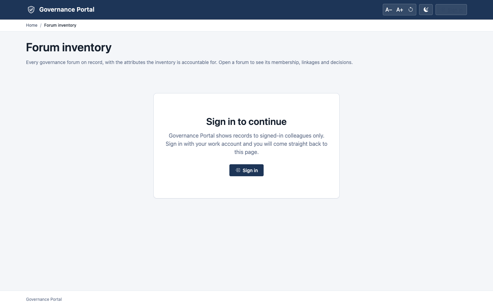

After signing in you return to the page exactly as it was asked for,
including any filter in its address. For example, a link to
`/tasks?show=overdue` brings you back to the overdue items.

**Signing out.** Open the menu under your name (top right) and choose
**Sign out**.

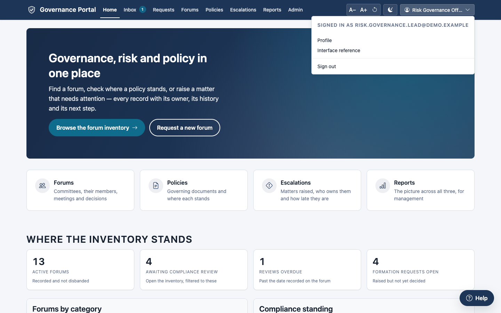

---

## 1.2 Finding your way: the top bar

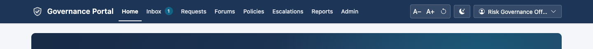

| Item | What it does |
|---|---|
| **Home** | The overview: quick links, where the inventory stands, and guidance written by the governance office. |
| **Inbox** | Everything waiting on you: attestations, approval steps, reviews and actions ([chapter 8](08-tasks-and-attestation.md)). A number shows how many items are waiting. |
| **Requests** | The formation request queue. Shown to the governance office (Risk Governance Office and Head of Risk Governance). |
| **Forums** | The forum inventory ([chapter 2](02-forums.md)). |
| **Policies** | The register of governing documents ([chapter 6](06-policies.md)). Shown if you may read documents. |
| **Escalations** | The escalation register ([chapter 7](07-escalations.md)). Shown if you may read escalations. |
| **Reports** | Management reporting ([chapter 9](09-reports.md)). |
| **Admin** | Administration ([chapter 10](10-administration.md)). Shown to administrators. |
| **A− / A+ / ↺** | Makes all text smaller or larger, or back to the default (section 1.5). |
| **☾** | Switches between the light and dark theme (section 1.5). |
| **Your name** | Your profile, and **Sign out**. Administrators also see **Interface reference**. |

**What you can see depends on your roles.** Tabs, buttons and whole sections
appear only when your roles allow them. Compare the home page of a Governance
Viewer below with the governance office's home page above: the viewer has no
Policies or Escalations tab and no "Request a new forum" button.

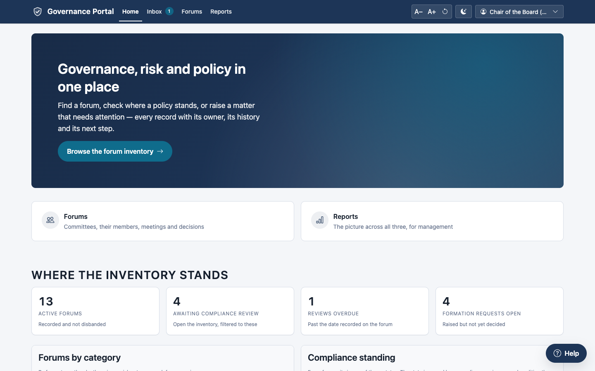

A page you have no access to says so, rather than showing an empty list:

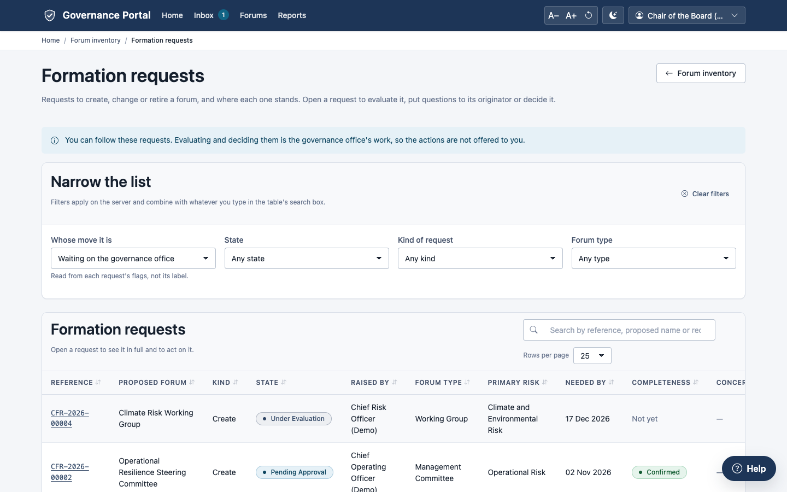

### The home page

Below the banner, the home page shows:

- **Quick links** to Forums, Policies, Escalations and Reports.
- **Where the inventory stands:** active forums, forums awaiting a compliance
  review, reviews overdue, and formation requests still open. Each figure
  except the last opens the matching filtered list.
- **Forums by category** and **Compliance standing:** counts by forum type,
  risk category, compliance status and quorum rule.
- **Recent changes:** the forums whose records changed most recently.
- **Using the system:** guidance written by your governance office. Each
  section says when it was last edited. Chapter 11 (section 11.15) explains how
  to change it.

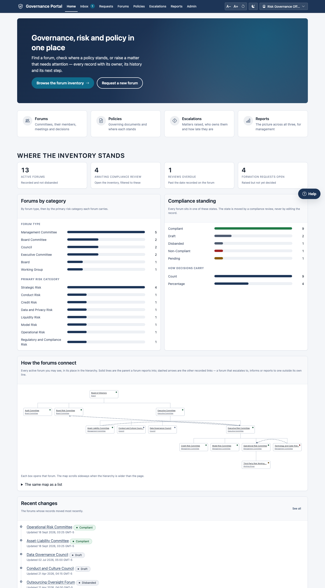

---

## 1.3 The portal and the workspace

There are two ways into the system.

| | **The portal** | **The workspace** |
|---|---|---|
| Address | The system's address, e.g. `/forums`, `/policy?name=…` | `/app`, e.g. `/app/governance-forum` |
| Looks like | The pages in this guide's chapters 1 to 9 | A dense list-and-form interface with a sidebar |
| Used for | Daily work: finding things, guided forms, taking the actions a record's stage allows | Maintaining records the portal only shows, and configuring the platform |
| Who uses it | Everyone | People who maintain records; administrators |

The portal links into the workspace wherever you need it. Examples are
**Edit this forum** on a forum's page and **Open in the workspace** on a
document or an escalation.

**The workspace home** lists the Consilium workspaces in its sidebar:
**Governance**, **Policy**, **Escalation** and **Consilium Administration**.
Each one groups the lists for its area.

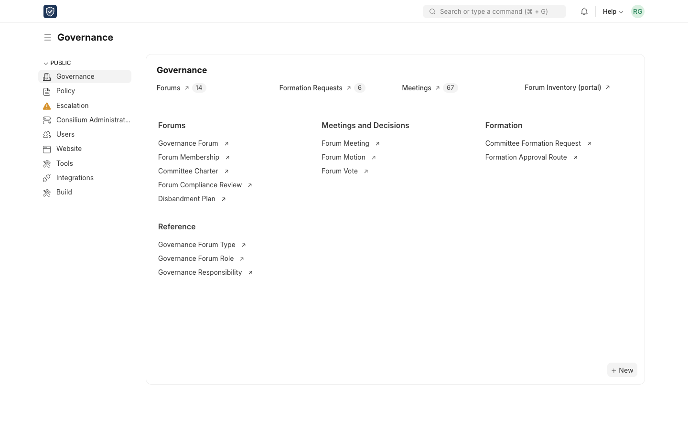

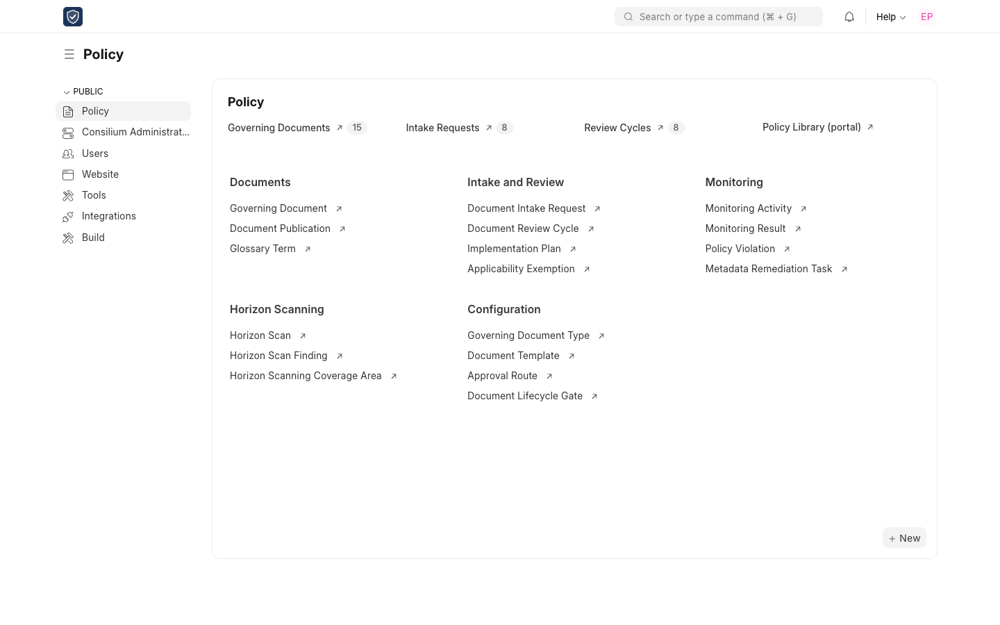

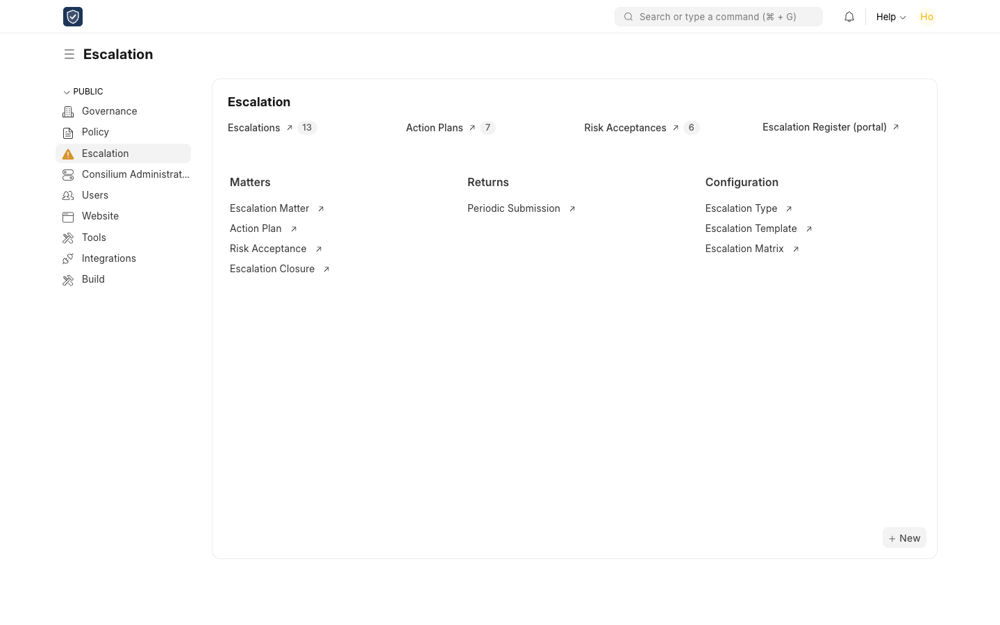

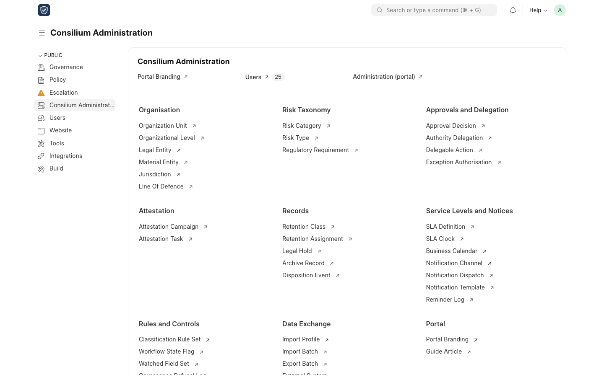

**A list in the workspace.** Every record type has a list. It has filters
(the sidebar and the filter bar), sorting, and a **+ Add** button if you may
create records. Click a row to open the record.

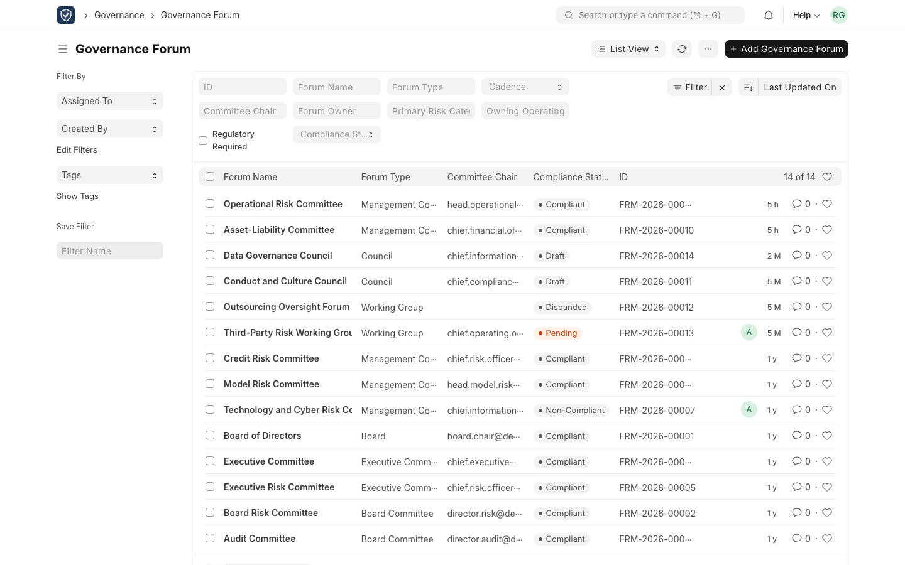

**A form in the workspace.** A record opens as a form. Fields marked with a
red asterisk are required. **Save** (or Ctrl+S) saves the record. The sidebar
shows attachments, tags and the record's history. Records that move through
stages show an **Actions** menu when an action is open to you.

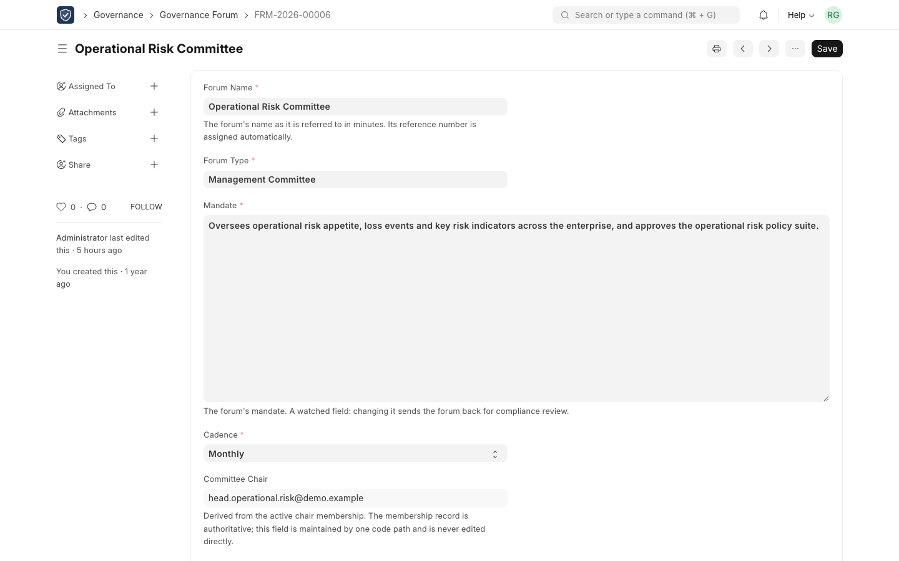

> **Tip.** You rarely need the workspace for daily work. If a portal page
> has a button for what you want to do, use it. The portal checks the
> record's stage and explains what is missing. The workspace simply saves or
> refuses.

---

## 1.4 Roles

Your administrator gives you **roles**. A role decides which kinds of record
you may read, change or create, and which actions you may take. Some actions
also depend on your part in a particular record. For example, only the
person an approval step is assigned to can decide it.

| Role | Can |
|---|---|
| Governance Viewer | Read forums, their membership and decisions. |
| Committee Secretary | Maintain the forums they support: meetings, motions, votes, membership, charters. Raise formation requests. |
| Forum Owner | Maintain the forums they own; attest to them. |
| Risk Governance Office | Run the forum inventory: evaluate formation requests, maintain forums, membership, meetings, charters, disbandment, attestation campaigns. |
| Head of Risk Governance | Everything the office can do, plus resolve exceptions, authorise bypasses and decide risk acceptances. |
| Compliance Reviewer | Record compliance reviews on forums. |
| Policy Owner | Draft and maintain governing documents; raise document requests; review cycles, monitoring, horizon scans, violations. |
| Policy Reviewer | Review documents and return them to drafting; log violations. |
| Enterprise Policy Office | Approve, publish, retire and reinstate documents; publications; bypasses; templates, approval routes and lifecycle gates. |
| Escalation Owner | Raise and work escalations, action plans, risk acceptances and closures. |
| Escalation Reviewer | Challenge and review escalations (the second line). |
| Sensitive Escalation Access | See escalations marked sensitive. Without it, they do not exist for you. |
| Records Manager | Retention classes, legal holds, archiving and disposal. |
| Taxonomy Administrator | Maintain the reference lists. |
| Consilium Audit | Read everything; change nothing. |
| Consilium Administrator | Configure the platform. |

**Record-level restrictions.** Your administrator can also limit you to part
of the organisation, such as one organisation unit or legal entity. The
restriction applies everywhere: lists, counts, reports, search and the help
assistant.

---

## 1.5 Your own settings: text size and theme

Both settings are remembered in this browser, on every page.

**Text size.**

1. Click **A+** to make all text larger, one step at a time (six steps from
   *Extra small* to *Largest*).
2. Click **A−** to make it smaller.
3. Click **↺** to return to the default.

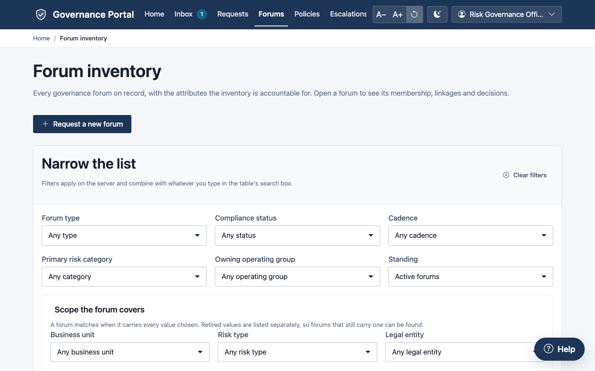

**Light or dark theme.** Click **☾** in the top bar. Click it again to switch
back. Until you choose, the portal follows your computer's setting.

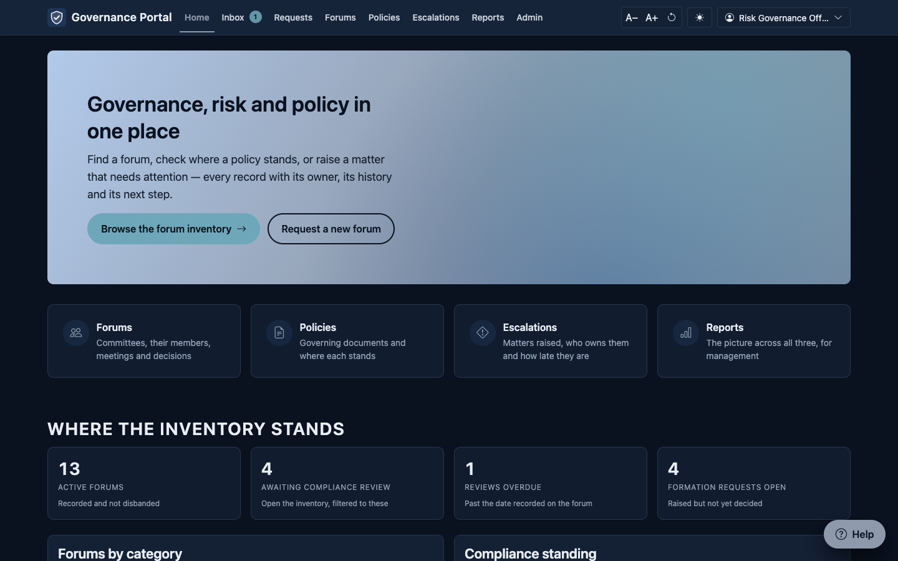

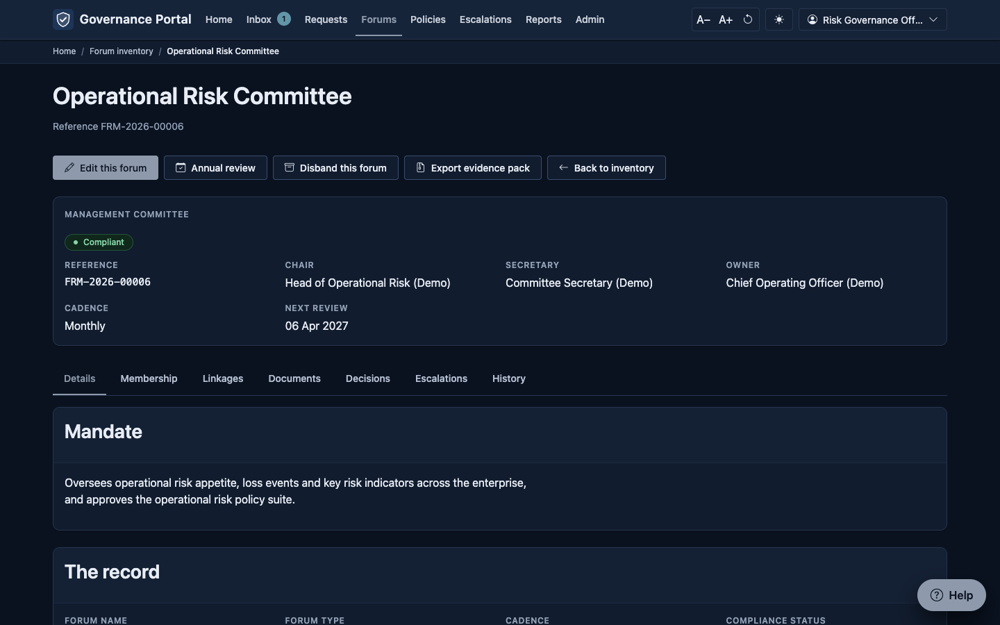

**On a phone or tablet.** The portal adapts to a narrow screen. The tabs in
the top bar scroll sideways, and tables scroll sideways inside their cards.

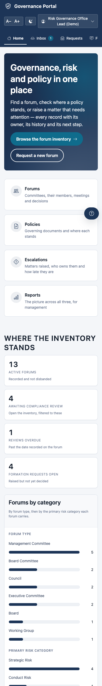

---

## 1.6 Dates and times

- A **date**, such as a due date or a review date, is a calendar day.
- A **time** is shown in your own time zone, with the zone named, for example
  "10:30 GMT-5".
- Dates the server stamps (such as "decided on") use the organisation's time
  zone, set by your administrator ([chapter 10](10-administration.md)).

---

## 1.7 The help assistant

Every portal page has a **Help** button in the bottom-right corner. It opens a
panel where you can ask about the page you are on, in your own words. It knows
your roles, so its answers are about what *you* can do.

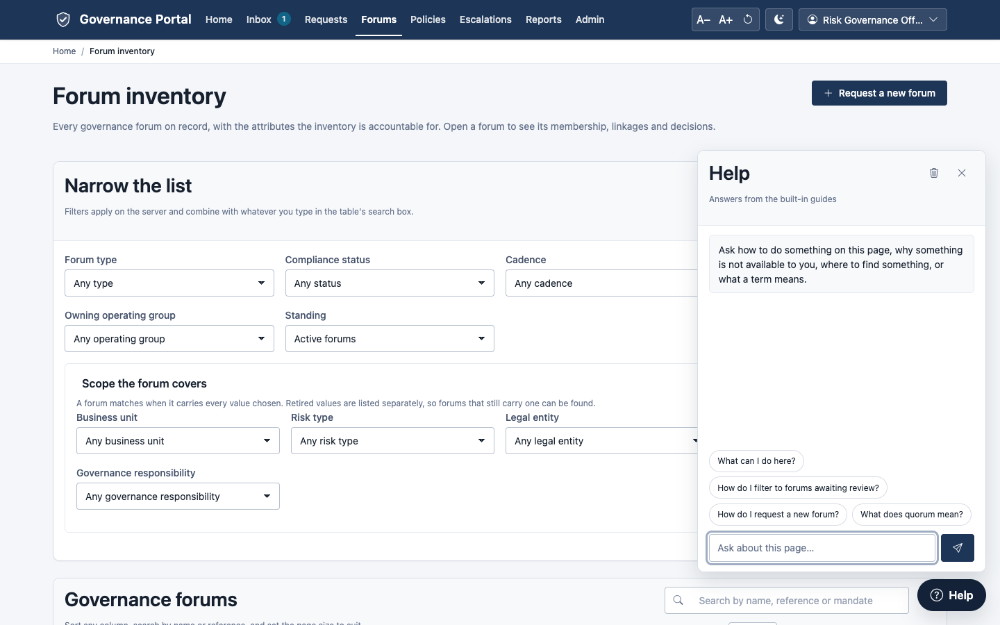

**To ask a question:**

1. Click **Help**.
2. Choose one of the suggested questions, or type your own in
   **Ask about this page…** and press Enter.
3. Read the answer. **From the guides** lists the sections it drew on.
   The buttons under an answer suggest what to ask or open next.

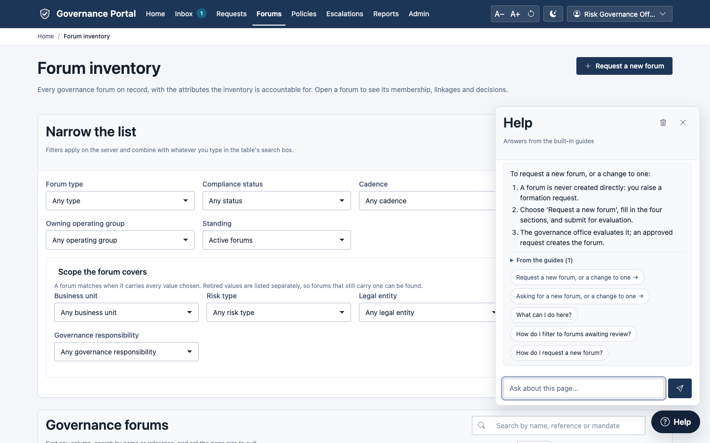

Questions that work well:

- **"What can I do here?"** What the page is for, and what you can and cannot
  do on it. On a record's page it also says where the record stands.
- **"How do I …?"** The steps, and a link to where you do it.
- **"Why can't I …?"** Whether the reason is a role you do not hold, the
  record's stage, or something that has to be done first. The example below
  asks why a secretary cannot approve a formation request.
- **"Where do I find …?"** A link to the right page.
- **"What does … mean?"** The glossary definition.

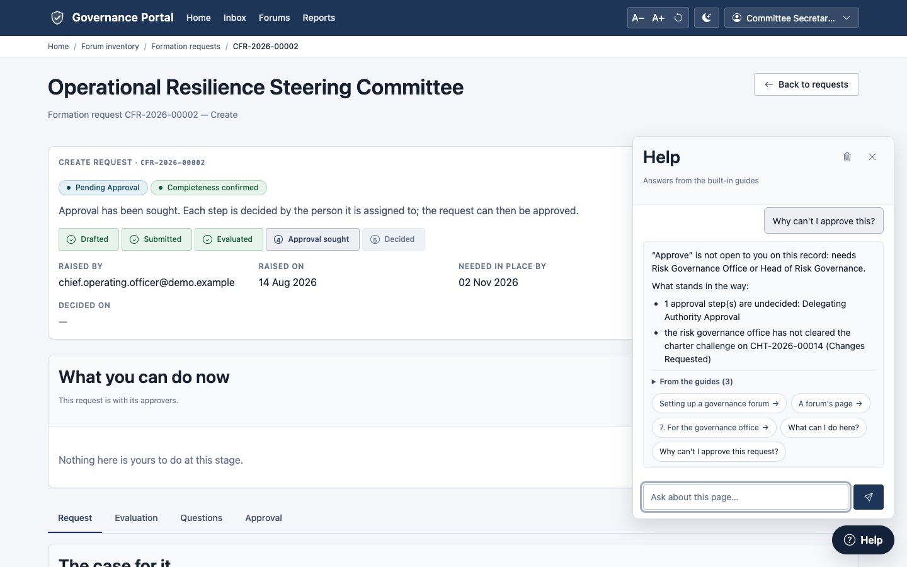

**What it will not do.** It never tells you anything about a record you
cannot open. It does not change anything: every action is taken on the page
itself.

**Your conversation** stays in this browser tab until you close the tab or
click the bin icon. Close the panel with **×** or the Esc key. You can ask up
to 30 questions an hour (your administrator may set a different limit).
Questions are recorded, so the governance office can see what people need
help with.

If your administrator has connected an AI service, the panel says
**AI-assisted**. The answer is still built from the same guides and your
access.

---

## Common problems

| What you see | What it means | What to do |
|---|---|---|
| "Sign in to continue" | Your session ended, or you opened a link while signed out. | Sign in. You return to the page. |
| A tab you expected is missing | Your roles do not include the area. | Ask your administrator. The role table above says which role you need. |
| "… are not open to you" | The page exists, but not for your roles. | As above. |
| A reference "does not exist, or is not available to you" | Either it does not exist, or it is restricted (for example a sensitive escalation). The system deliberately does not say which. | Check the reference. If it is right, ask whoever sent it. |
| A page looks wrong after an upgrade | The browser kept old files. | Reload the page. |
| "You have asked 30 questions in the last hour…" | The help assistant's hourly limit. | Wait, or read the guides directly. |

## Tips

- **Links are shareable.** The filters on Forums, Policies and Escalations are
  kept in the page address, so the link you copy shows the same list to a
  colleague (who still sees only what they may see).
- **Use the Help panel's "Why can't I …?"** before asking a colleague. It
  names the missing role or the step that has to come first.
- **Ask "What does … mean?"** for any term. The full glossary is in
  [`../product/05-glossary.md`](../product/05-glossary.md).
