# 2. Forums

**Purpose.** Find any governance forum and see everything about it: who sits
on it (today, or on any past date), how it connects to other forums, what it
decided, what it approves, which escalations are routed to it, and how its
compliance standing has moved.

**Who can do it.**

| To | You need |
|---|---|
| Read the inventory and a forum's page | Any role that can read forums: Governance Viewer, Committee Secretary, Forum Owner, Risk Governance Office, Compliance Reviewer, Consilium Audit and others |
| Edit a forum's record | Risk Governance Office, Committee Secretary or Forum Owner (edits happen in the workspace) |
| Record a compliance review | Compliance Reviewer ([chapter 4](04-compliance-and-reviews.md)) |
| Ask for a new forum, or a change to one | Committee Secretary or Risk Governance Office ([chapter 3](03-forum-formation.md)) |

> **A forum is never created or deleted directly.** A forum comes into
> existence when a formation request is approved (chapter 3). It leaves service
> through a disbandment (chapter 4). Seats are ended, never deleted. This is
> why a forum's page can show its membership as it stood on any past date.

---

## 2.1 Finding a forum: the inventory

Open **Forums** in the top bar.

The page has two cards: **Narrow the list** (filters) and **Governance forums**
(the table).

### Filters

| Filter | Choices |
|---|---|
| **Forum type** | Board, board committee, executive committee, management committee, council, working group… (from the Forum Type list) |
| **Compliance status** | Draft, Pending, Compliant, Non-Compliant, Not Applicable, Disbanded |
| **Cadence** | Weekly to annually, or ad hoc |
| **Primary risk category** | From the Risk Category list |
| **Owning operating group** | From the organisation units |
| **Standing** | **Active forums** (the default), **Active and disbanded**, **Disbanded only**, **Awaiting review**, **Regulatory-required**, **Review overdue** |
| **Scope the forum covers** | Business unit, risk type, legal entity, jurisdiction, governance responsibility. A forum matches only when it carries **every** value you choose. |

**To filter the list:**

1. Choose a value in one or more filters. The table refreshes at once.
2. To narrow further, type in the table's search box
   (**Search by name, reference or mandate**) and press Enter.
3. To start again, click **Clear filters**.

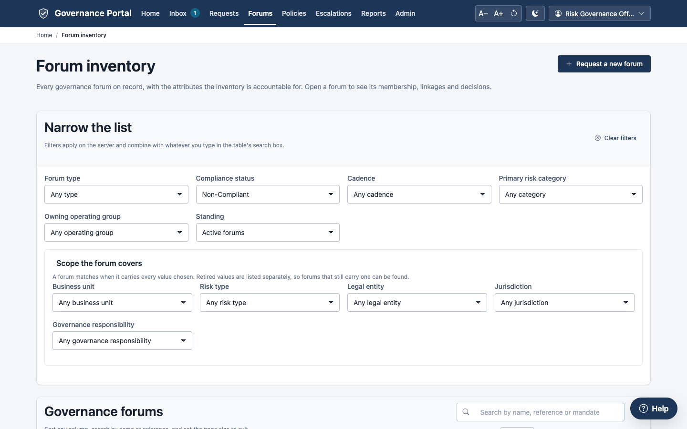

**The filters are kept in the page address.** Reloading the page, going back,
bookmarking the page or sending the link to a colleague shows the same
filtered list. For example, `/forums?standing=overdue` always opens the
overdue forums.

### The table

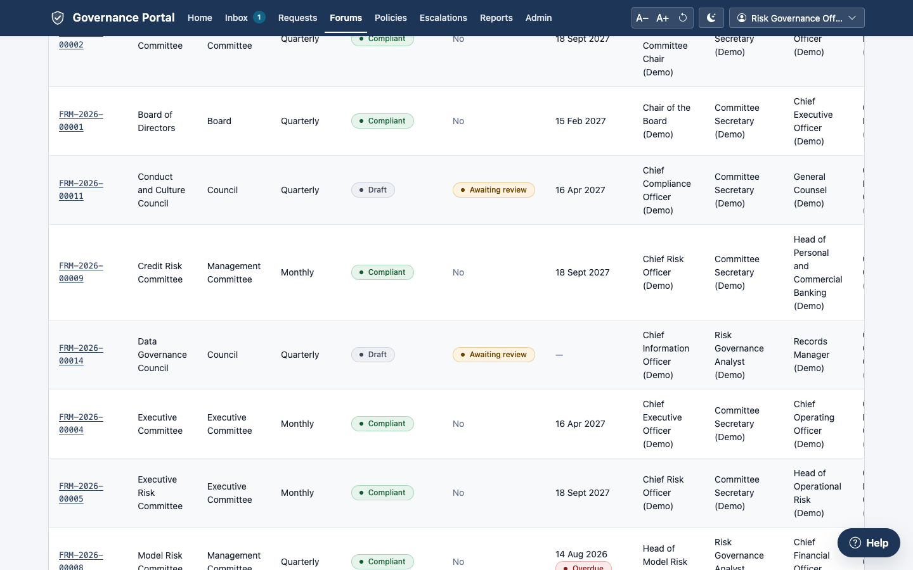

- **Sort** by clicking any column heading. Click again to reverse the order.
- **Rows per page** sets the page size (10, 25, 50 or 100). The portal
  remembers your choice in this browser.
- The table has many columns: reference, name, type, cadence, compliance,
  review due and next review, officers, primary risk, organisation, parent,
  regulatory flag, quorum rule, and more. **Scroll sideways** inside the card
  to see them all.
- A red **Overdue** pill in **Next review** means the review date has passed.
- **Click a row** to open the forum.

---

## 2.2 A forum's page

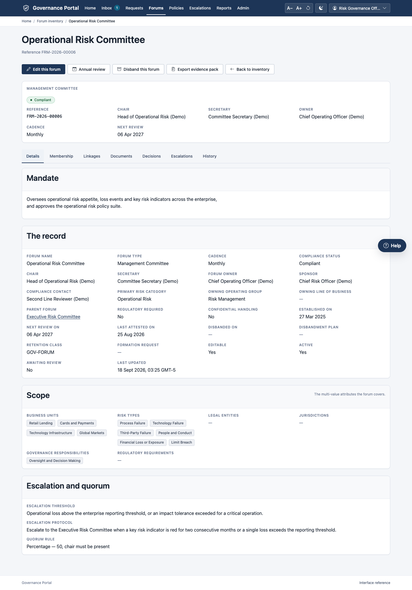

**The header** shows the forum's type, its compliance standing and flags
(**Awaiting review**, **Locked for review**, **Regulatory**, **Disbanded**,
**Confidential**), and the facts people look for first: reference, chair,
secretary, owner, cadence and next review date.

**The buttons at the top right** depend on your roles:

| Button | What it does | Shown to |
|---|---|---|
| **Edit this forum** | Opens the forum's record in the workspace | Anyone who may edit forums |
| **Record a compliance review** | Opens the review form ([chapter 4](04-compliance-and-reviews.md)) | Compliance Reviewers |
| **Annual review** | Opens the forum's annual review panel ([chapter 4](04-compliance-and-reviews.md), section 4.4) | The governance office and Compliance Reviewers |
| **Disband this forum** / **Disbandment** | Opens the forum's disbandment page ([chapter 4](04-compliance-and-reviews.md)) | The governance office, and anyone with a disbandment approval to decide |
| **Export evidence pack** | Downloads the forum's record, history and evidence as one ZIP file ([chapter 6](06-policies.md), section 6.14) | Consilium Audit and administrators |
| **Back to inventory** | Returns to the inventory | Everyone |

If you may only read the forum, a note says so. It also says who makes
changes: the forum's owner, its secretary or the governance office.

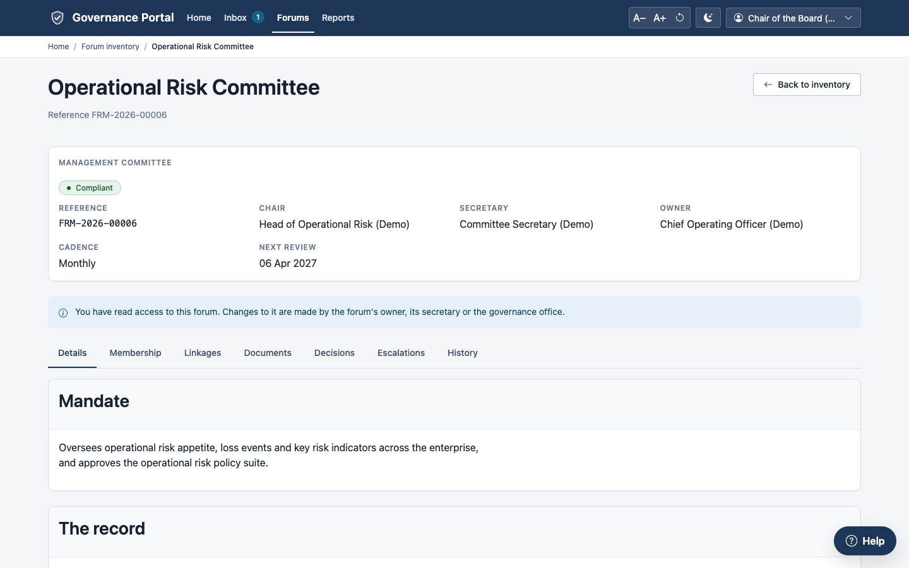

### The tabs

Click a tab to open it. The address changes to match (for example
`…#members`), so you can send a link straight to a tab.

| Tab | What it shows |
|---|---|
| **Details** | The **Mandate**; **The record** (every field, including the formation request that created the forum); **Scope** (business units, risk types, legal entities, jurisdictions); **Escalation and quorum** (the escalation protocol and threshold, and the quorum rule). |
| **Membership** | The seats on the forum, as they stood on the date you choose (section 2.3). |
| **Linkages** | A map of the forum's parent, sub-forums and the forums it escalates to or informs, and the same relationships as a list (section 2.4). |
| **Documents** | The forum's charter, and the governing documents this forum approves. |
| **Decisions** | The motions put to the forum and their outcomes, and its sittings (section 2.5). |
| **Escalations** | Escalations routed to this forum, and the forum's role in each: to decide, to oversee, or to be informed. Restricted matters appear only to people cleared to see them. |
| **History** | Every compliance decision about the forum; the forum's revisions; and its **Record history**. |

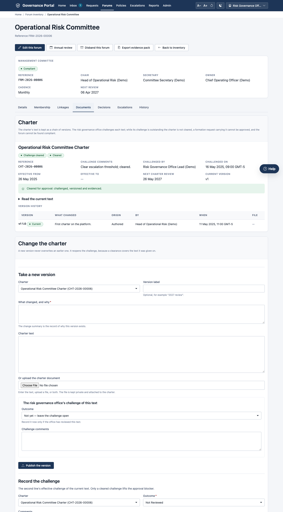

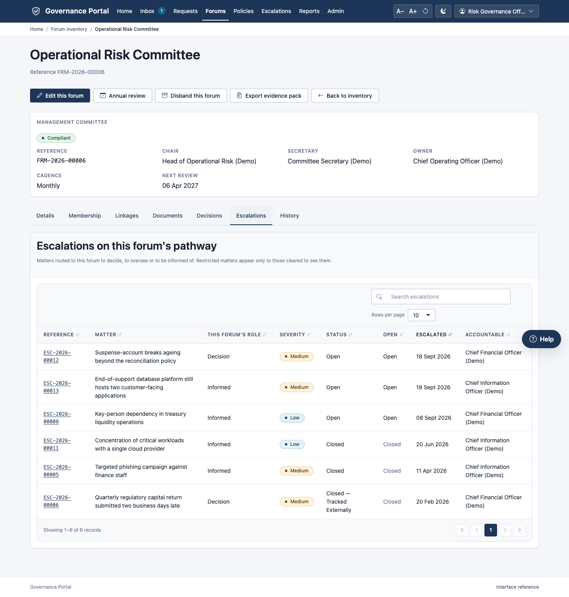

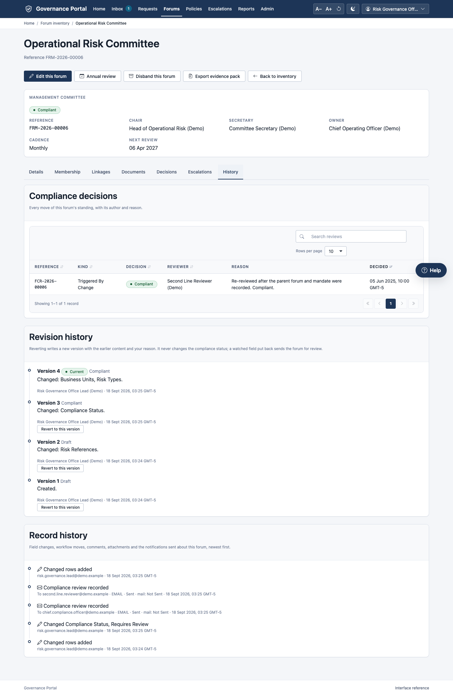

**Record history**, at the foot of the History tab, lists everything recorded
against the forum, newest first:

- field changes and workflow moves;
- comments and attachments;
- every notification sent about it, with its recipient, channel and whether it
  was sent.

Anyone who may read the forum can see it.

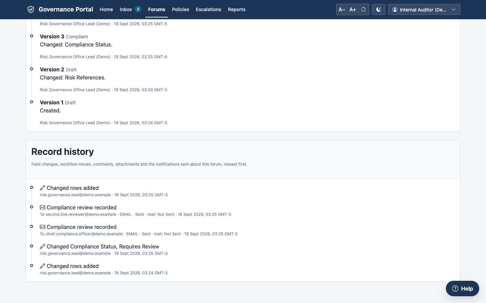

A disbanded forum stays readable, marked **Disbanded**, with its disbandment
on the **Details** tab:

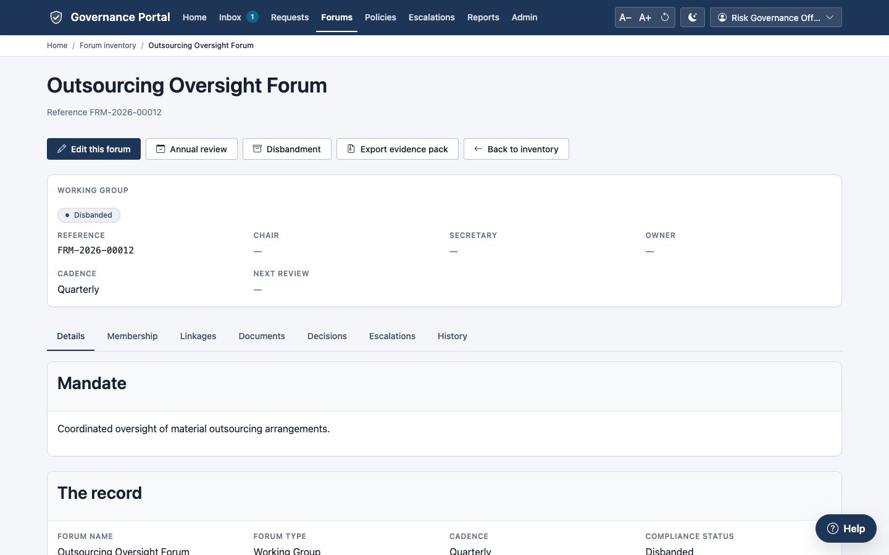

---

## 2.3 Who sat on the forum, on any date

1. Open the forum and click **Membership**.
2. **Membership as at** shows today's date. Leave it for the current seats.
3. To see the seats on a past date, change **Membership as at** to that date.
   The table reloads. You cannot choose a future date.
4. The line above the table sums it up, for example "4 seats on 01 Mar 2026:
   3 voting."

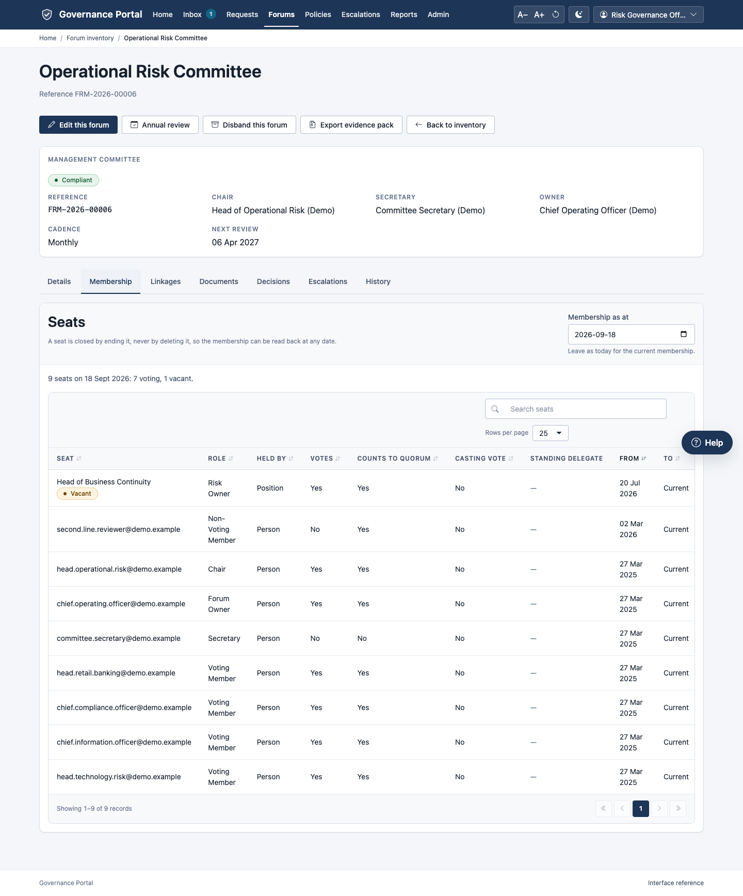

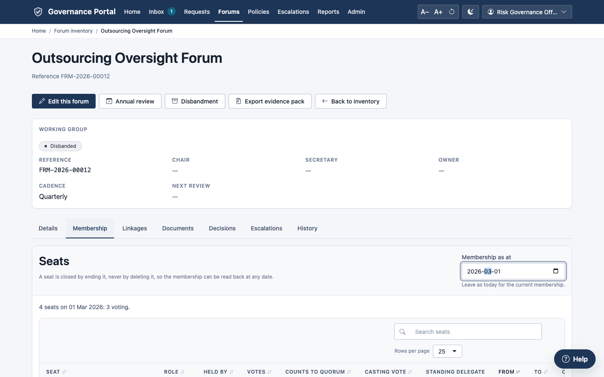

The same forum today has no seats: they were closed with the reason
"Forum Disbanded".

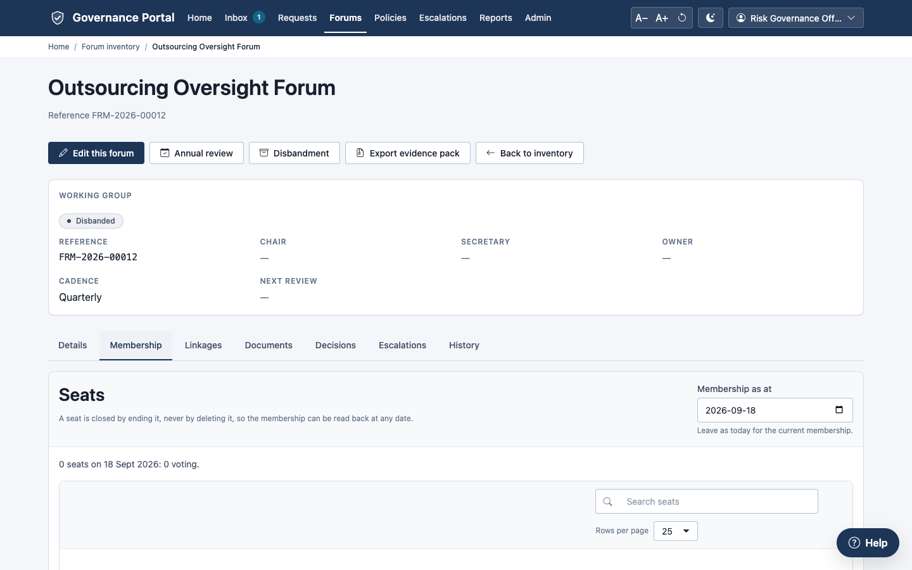

**The columns.**

| Column | Meaning |
|---|---|
| Seat | The person, or the title of a position (a *by-position* seat, which survives the person leaving). A position with nobody in it shows **Vacant**. |
| Role | Chair, secretary, voting member, non-voting member, observer… |
| Votes / Counts to quorum / Casting vote | What the seat is entitled to. |
| Standing delegate | Who may act for the seat holder. |
| From / To | When the seat started and ended. **Current** means it is still open. |
| Closed because | Why the seat ended. |

**Changing membership** (Committee Secretary, Risk Governance Office) is done in
the workspace: *Governance → Forum Membership* ([chapter 5](05-meetings-votes-charters.md)).
The forum's **chair**, **secretary** and **owner** fields follow from the open
seats. You cannot type them on the forum.

---

## 2.4 How the forum connects: linkages

1. Open the forum and click **Linkages**.
2. The **Interconnectivity** map shows:
   - the **parent forum** above ("reports to");
   - **upstream** forums on the left (the forums this one reports or escalates to);
   - **downstream** forums on the right (the forums it informs);
   - **sub-forums** below.
3. Click any box to open that forum.
4. **Related forums** lists the same relationships in full, with their nature
   (Hierarchy, Reports To, Escalates To…) and a note. The map shows up to four
   in each direction; the list shows every one.

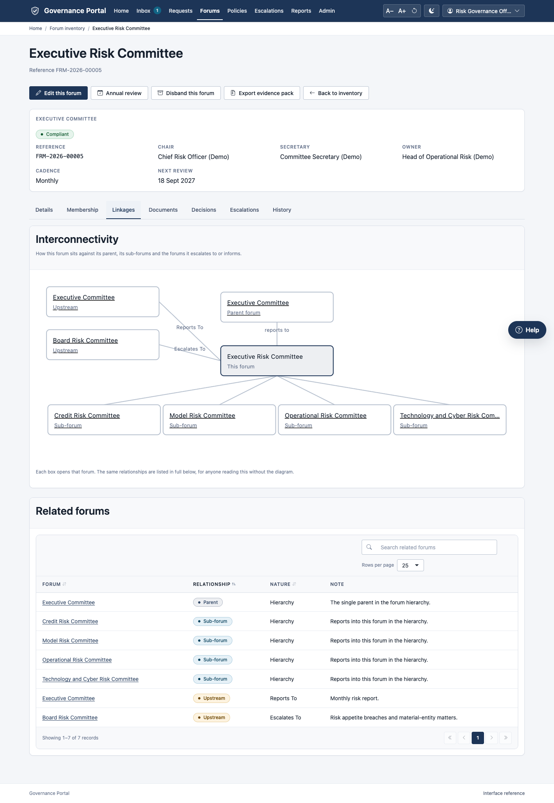

Linkages are changed in the workspace. To change the parent, edit the forum
(**Edit this forum** → *Parent Forum*). To add an upstream or downstream link,
edit the forum's **Forum Link** rows. A forum cannot be its own ancestor, and
cannot link to itself.

---

## 2.5 What the forum decided

Click **Decisions**.

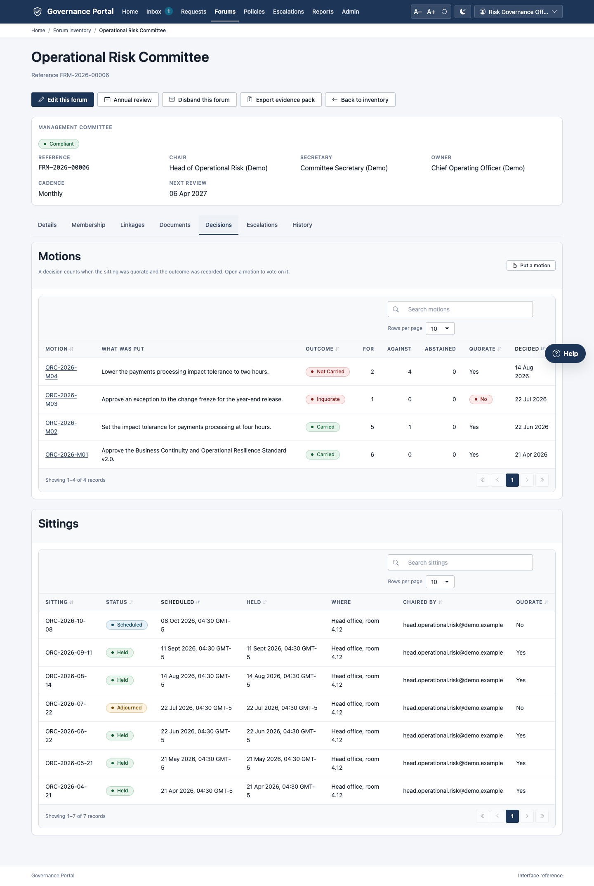

- **Motions:** what was put, the outcome (**Carried**, **Not Carried**,
  **Deferred**, **Withdrawn**, **Inquorate**), the votes for, against and
  abstaining, whether the sitting was quorate, and when it was decided.
- **Sittings:** each meeting, with its status (**Held**, **Scheduled**,
  **Cancelled**, **Adjourned**), when it was scheduled and held, where, who
  chaired it, and whether it was quorate.

A decision counts only if the sitting was quorate and the outcome was
recorded. [Chapter 5](05-meetings-votes-charters.md) explains meetings,
minutes, motions and votes.

---

## 2.6 Editing a forum's record

1. Open the forum and click **Edit this forum**. The workspace form opens.
2. Change the fields you need.
3. Click **Save**.

**Some fields are protected:**

- **Chair, secretary and owner** follow from the membership. Change the seat
  instead.
- **Compliance status** moves only through a compliance review, a
  watched-field change or a disbandment ([chapter 4](04-compliance-and-reviews.md)).
- **Watched fields** (by default: forum type, mandate, chair, primary risk
  category, parent forum, regulatory-required, owning operating group) can be
  changed. But changing one sends the forum back for a compliance review, and
  it is **locked** until the review is recorded.

---

## What happens next

- Changing a watched field sets the forum to **Pending**. Every Compliance
  Reviewer is told, and the forum appears under **Standing: Awaiting review**.
- Every change is kept in the forum's history.

## Common errors

| Message | What it means | What to do |
|---|---|---|
| "… is derived from forum membership and cannot be edited here. Change the seat instead" | You tried to type the chair, secretary or owner. | Change the seat in *Forum Membership*. |
| "compliance_status … cannot be edited directly on forum …" | Standing moves only through a review, a watched field or a disbandment. | Ask a Compliance Reviewer to record a review. |
| "Forum … is not editable while it is under compliance review." | The forum is **Pending** (locked). | Wait for the compliance review, or ask for one. |
| "A forum cannot be its own parent." / "Forum … would become its own ancestor." | The parent you chose would create a loop. | Choose a different parent. |
| "… is not an operating group; organisational ownership is one accountable line." | The owning organisation must be an operating group. | Choose an operating group; put the line of business in its own field. |
| "Line of business … does not sit under …" | The line of business belongs to another operating group. | Choose a matching pair. |
| "A regulatory-required forum must cite the requirement that mandates it." | You ticked **Regulatory Required** without a requirement. | Add the requirement in *Regulatory Requirements*. |
| "The … quorum rule needs a value." / "A percentage quorum sits between 1 and 100." | The quorum rule is incomplete. | Give the count or percentage. |
| "Forum … cannot be deleted. A forum leaves service through a disbandment plan" | Forums are never deleted. | Disband it ([chapter 4](04-compliance-and-reviews.md)). |

## Tips

- **Bookmark useful views**, for example `/forums?standing=review` for the
  forums awaiting review, or `/forums?standing=overdue` for overdue reviews.
- **To answer "who was on the committee when it decided X?"**, open the
  Decisions tab to find the date, then set **Membership as at** to that date.
- **The Escalations tab** is the quickest way for a secretary to see which
  matters the forum must consider.
