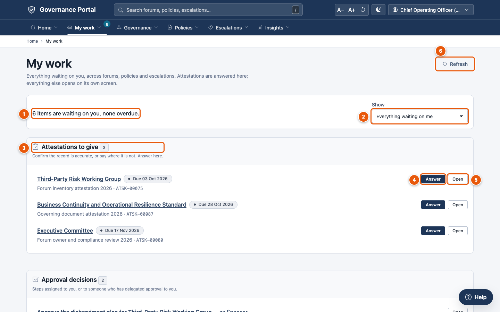
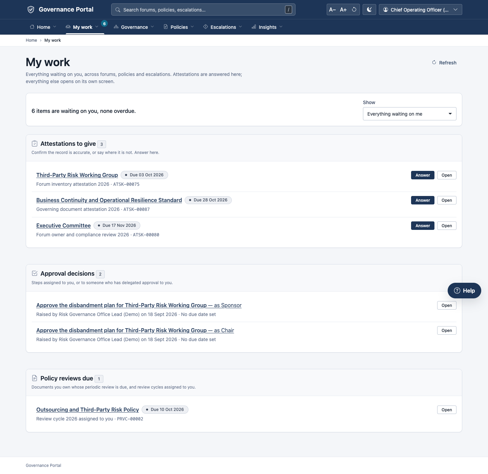
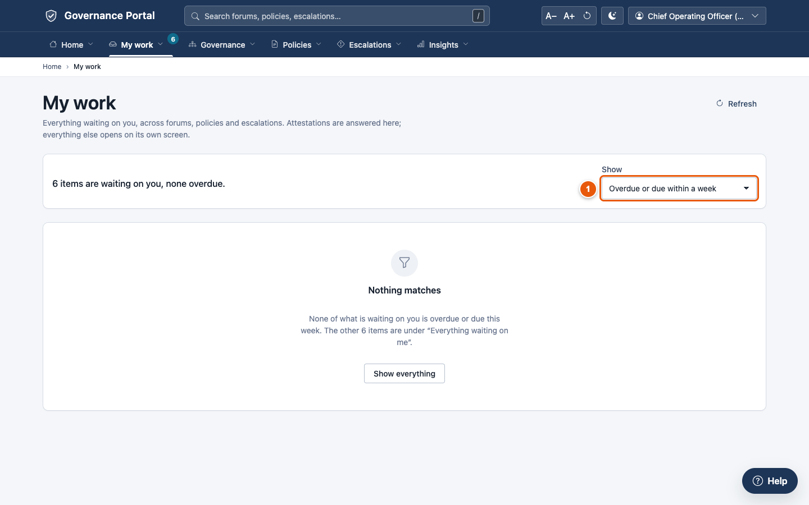
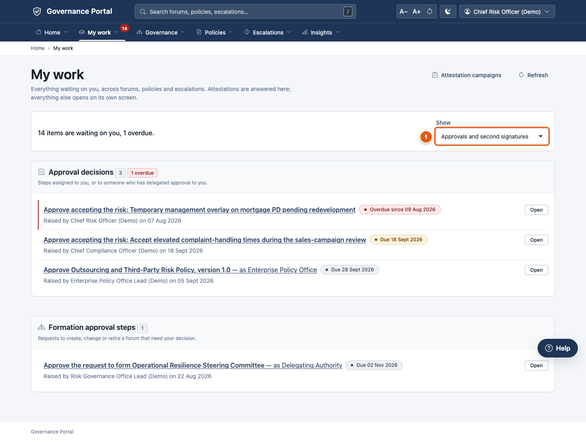
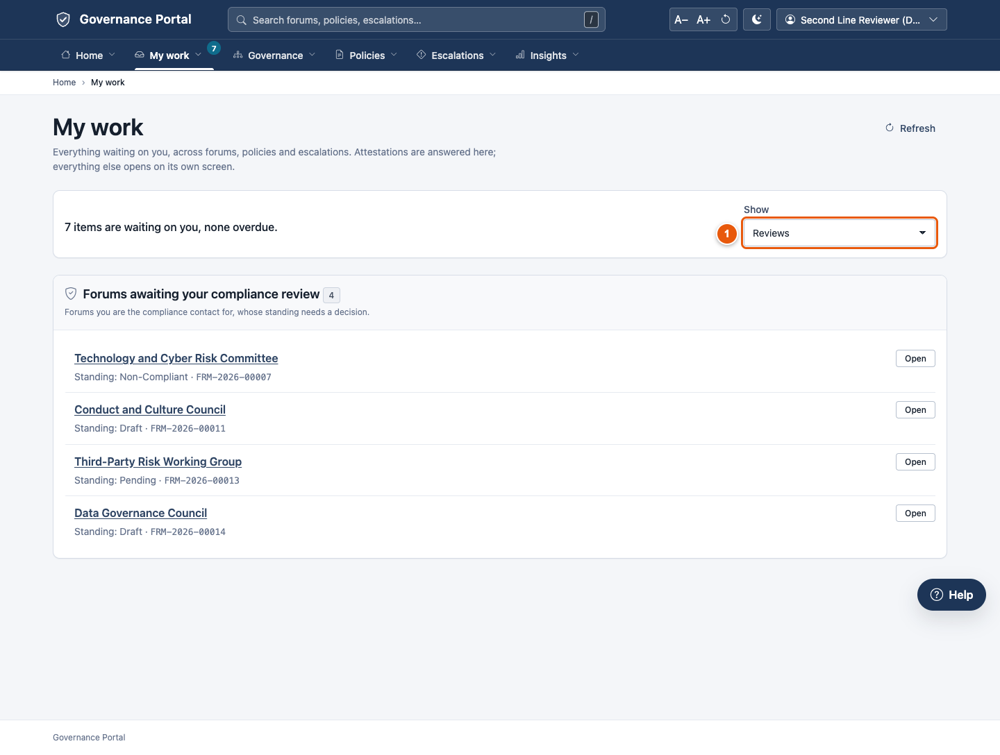
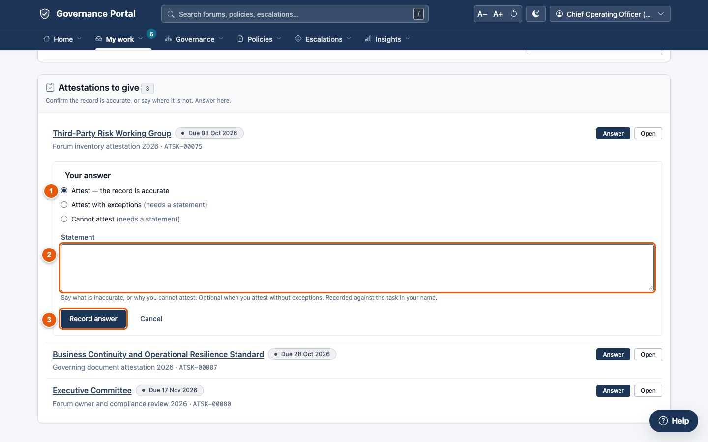
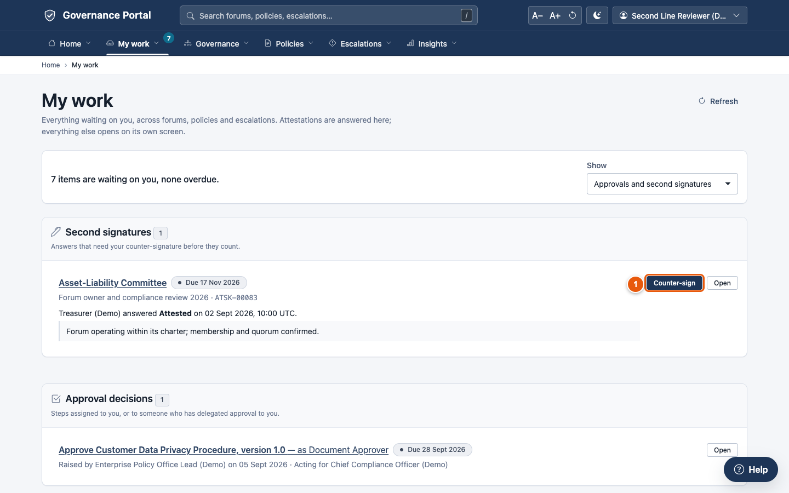
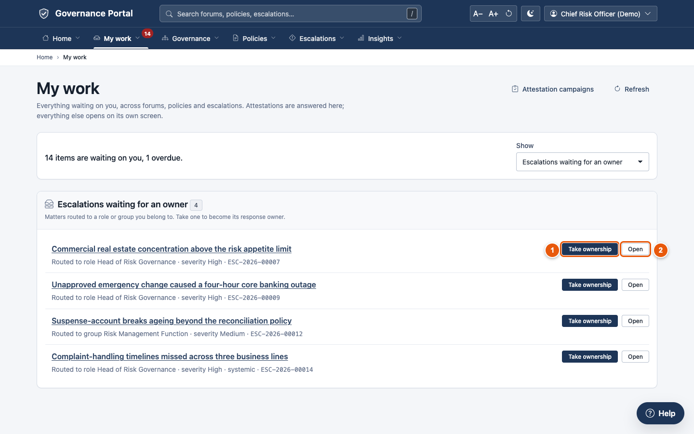

# 2. My work

**My work** is your personal to-do list. It collects everything waiting on
you, from committees, policies and escalations, in one place. Attestations
are answered right here. Everything else opens on its own screen with one
click.

Open it from the **My work** menu. The number on the menu tells you how many
items are waiting.

---

## 2.1 Everything waiting on you

① **The summary** tells you how many items are waiting and how many are
overdue.

② **Show** chooses a view:
- **Everything waiting on me** (the normal view);
- **Only what is overdue**;
- **Overdue or due within a week**;
- **Approvals and second signatures**;
- **Reviews**;
- **Attestations**;
- **Escalations waiting for an owner**.

The same views are in the **My work** menu.

③ **Items are grouped by kind**, each group with a count and a one-line
explanation.

④ **Answer** lets you respond to an attestation without leaving the page
(section 2.3).

⑤ **Open** takes you to the record, where you act.

⑥ **Refresh** reloads the list after you have acted elsewhere. The
governance office also sees **Attestation campaigns** here.

Each item shows its due date: red **Overdue since …**, amber **Due …** within
a week, or grey **Due …**. **Acting for …** means it reached you through a
delegation.

### The groups you may see

| Group | What it is | Where you act |
|---|---|---|
| **Attestations to give** | Confirm a record is accurate, or say where it isn't | Here |
| **Second signatures** | Answers that need your counter-signature | Here |
| **Approval decisions** | Approval steps assigned to you (or to someone who delegated to you) on policies, risk acceptances and disbandments | The record |
| **Formation approval steps** | New-forum requests that need your decision | The request |
| **Formation requests returned to you** | The governance office has questions about a request you raised | The request |
| **Forums awaiting your compliance review** | Forums you're the compliance contact for | The review page |
| **Your forums awaiting review** | Forums you own that are waiting for a compliance decision or a review | The forum |
| **Policy reviews due** | Your policies due for their periodic review | The policy |
| **Escalations waiting for an owner** | Matters routed to your role or team | Here or the matter |
| **Escalations under review** | Matters you're responsible for, now with the second line | The matter |
| **Action plans** | Open action plans you own | The matter |
| **Metadata to correct** | Records left pointing at something retired or disbanded | The record |

---

## 2.2 The views

**Due soon** shows only what is overdue or due within a week. Start your
day here.

① **Show** is set to *Overdue or due within a week*.

**Approvals** shows every decision waiting on you: approval steps and
counter-signatures.

① **Show** is set to *Approvals and second signatures*.

Each approval says **in words** what you're deciding, for example "Approve
the disbandment plan for Third-Party Risk Working Group — as Sponsor". It
also shows who raised it and when, and its due date (red if overdue). Hover
over it to see the record's reference.

Click the approval, or **Open**, to go where you decide it. A disbandment
approval opens the forum's disbandment page. There you see what you're
approving, then record your decision (for policies, [chapter 4](04-policies.md);
for new forums, [chapter 3](03-governance.md); for risk acceptances,
[chapter 5](05-escalations.md)).

**Reviews** shows the reviews that fall to you: compliance reviews of forums,
periodic policy reviews and escalation reviews.

① **Show** is set to *Reviews*.

---

## 2.3 Answering an attestation

An attestation asks you to confirm that a record (a committee, or a policy
you own) is accurate.

1. Find it under **Attestations to give** and click **Answer**.

   

2. ① Choose your answer:
   - **Attest — the record is accurate**;
   - **Attest with exceptions** (you must say what isn't accurate);
   - **Cannot attest** (you must say why).
3. ② Write the **Statement** if your answer needs one.
4. ③ Click **Record answer**. "Your answer is recorded." The item leaves your
   list.

If the attestation needs a second signature, it now goes to the second
signatory.

> **Answer before the due date.** An unanswered attestation expires overnight
> after its due date, and can no longer be answered.

---

## 2.4 Counter-signing

Some attestations need two signatures: for example, a forum's owner answers,
and its compliance contact counter-signs.

1. Under **Second signatures**, read the first person's answer and statement.
2. ① Click **Counter-sign**.
3. Confirm. Your signature is recorded against the attestation in your name.

---

## 2.5 Picking up an escalation nobody owns

When an escalation is raised without an owner, it waits in a **queue**: a
role (such as *Head of Risk Governance*) or a team (such as the *Risk
Management Function*). Everyone in the queue sees it under **Escalations
waiting for an owner**.

① **Take ownership.** Confirm, and you become the matter's owner. It leaves
everyone else's list.

② **Open** shows you the matter first, if you want to read it before taking it
on.

Each item says where it was routed, how severe it is, and whether it is
**systemic** (a shared cause rather than a one-off). If a colleague takes it
first, the platform tells you who owns it now.

---

## Tips

- **Start each day with Due soon.**
- **Going on leave?** Ask your administrator to set up a delegation. Your
  approvals and attestations then reach your delegate, marked "Acting for".
- **Everything also reaches you by notification**, if your organisation has
  switched it on. **My work** is always the complete list.
