# 3. Asking for a forum: formation requests

**Purpose.** Every forum on the inventory exists because a **formation
request** was raised, evaluated and approved. The same route is used to change
a forum materially or to retire one. Every forum therefore has a recorded
reason for existing and a named sponsor.

The stages of a request:

```
Draft → Submitted → Under Evaluation ⇄ Returned To Originator
                         ↓
                  Pending Approval ⇄ Exception Review
                         ↓
                Approved (the forum is created)   or   Rejected / Withdrawn
```

**Who can do it.**

| To | You need |
|---|---|
| Raise a request, save a draft, submit it, answer questions | Committee Secretary or Risk Governance Office (or the request's originator, for answering) |
| Follow a request | The person who raised it, and anyone who can read requests (Committee Secretary, Risk Governance Office, Compliance Reviewer, Governance Viewer, Consilium Audit) |
| Start evaluation, record findings, return with questions, raise approval steps, approve, reject | Risk Governance Office |
| Decide an approval step | The person the step is assigned to, or their delegate; for a role-based step, anyone holding the role. |
| Raise an exception | Risk Governance Office or Head of Risk Governance |
| Resolve an exception, authorise a bypass | Head of Risk Governance |
| Withdraw | The originator or the Risk Governance Office |

---

## 3.1 Raising a request

**Before you start, search the inventory** ([chapter 2](02-forums.md)). The
most common reason a request comes back is that a forum already covers the
ground.

1. Choose **Request a new forum**, on the home page or on **Forums**.
2. Read **Before you start**. It lists what you need and shows the five
   stages ahead.

   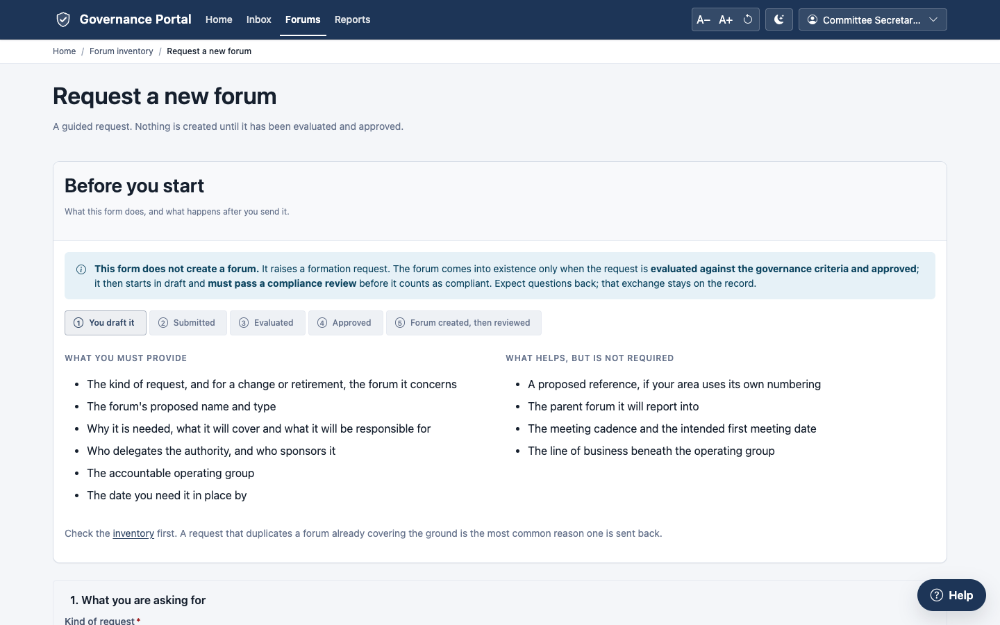

3. Fill in the four sections. Fields marked **\*** are required.

   | Section | Fields |
   |---|---|
   | **1. What you are asking for** | **Kind of request\*** (Create, Modify or Retire); **Forum this concerns** (for Modify and Retire); **Why it is needed\***, **Purpose and scope\*** and **Proposed responsibilities\***, at least 40 characters each |
   | **2. The forum** | **Proposed name\***, **Forum type\***, primary risk category, cadence, parent forum, proposed reference. As you type the name, the form warns you if the inventory already has a forum with a similar name. |
   | **3. Accountability** | **Owning operating group\***, owning line of business, **Delegating authority\***, **Sponsor\***, and a box to tick if the delegating authority has already agreed |
   | **4. Timing** | **Needed in place by\*** and the intended first meeting. Both must be in the future. |

   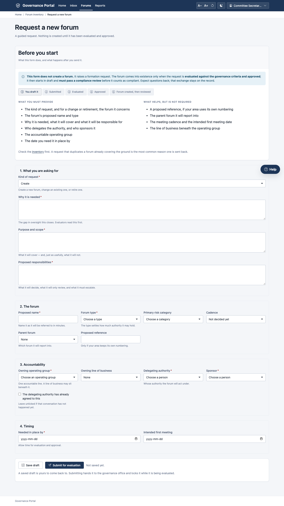

4. Click **Save draft** to keep your work and come back to it later. A draft
   needs the request's essentials, but not every field:

   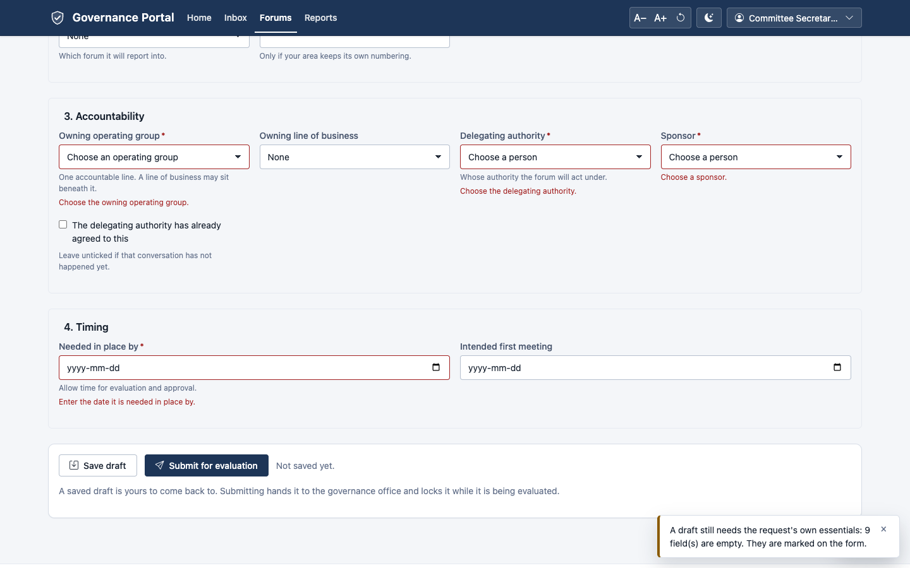

   Once saved, the page address includes the request's reference
   (`/create-forum?request=CFR-…`). Bookmark it to come back. Unsent changes
   are also kept in this browser. If you leave the page with unsaved changes,
   the browser asks you first.

5. When everything is complete, click **Submit for evaluation**. The request
   is handed to the governance office and **locked**: you can no longer change
   it unless the office returns it to you.

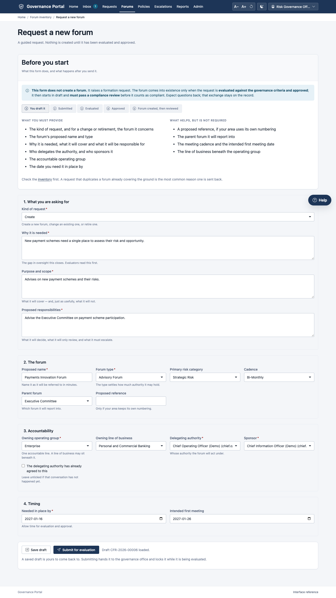

**What happens next.** On submission the system runs an **overlap check**
against existing forums of the same type and primary risk category, and
records the result. The request appears in the governance office's queue.

People who cannot raise requests (for example a Governance Viewer) see this
instead:

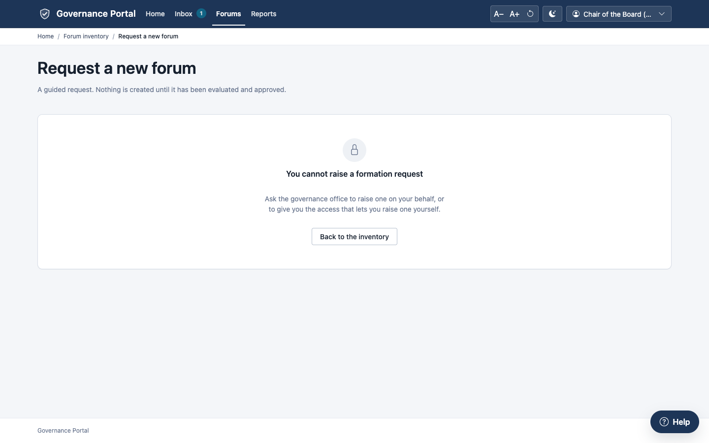

---

## 3.2 Following your request

Open the request from **Requests** (governance office) or from the link shown
after you submit (`/formation-request?name=CFR-…`).

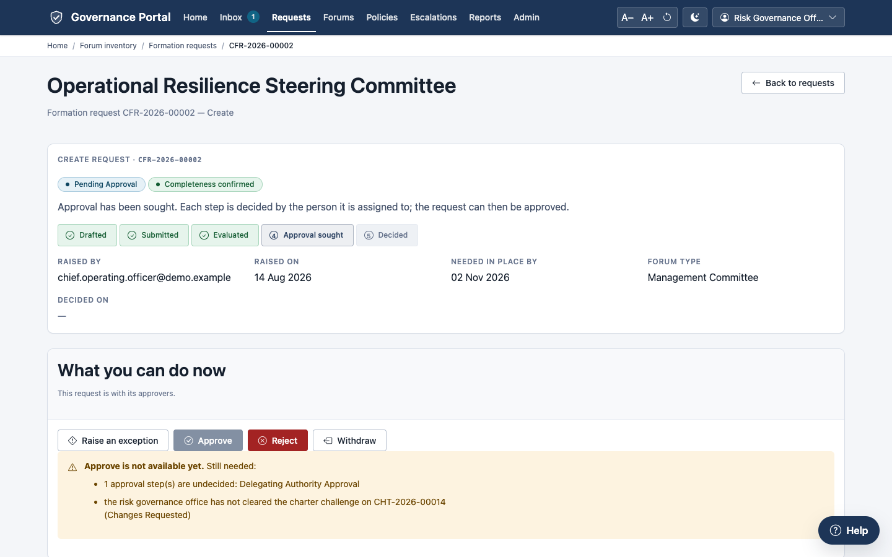

- **The summary** shows the kind of request, its state, its flags
  (**Completeness confirmed**, **Exception raised**, **You raised this**), a
  sentence saying where it stands, and a progress bar: **Drafted →
  Submitted → Evaluated → Approval sought → Decided**.
- **What you can do now** offers only the actions open to *you* at *this*
  stage. If there are none, it says "Nothing here is yours to do at this
  stage."
- **The tabs:**

  | Tab | What it shows |
  |---|---|
  | **Request** | The case for the forum, the forum asked for, accountability and timing. |
  | **Evaluation** | The overlap check, and the governance office's finding against each of the five criteria. |
  | **Questions** | The questions put to the originator, and the answers. |
  | **Approval** | What stands in the way of approval, the approval steps and who decided them, and any exceptions. |

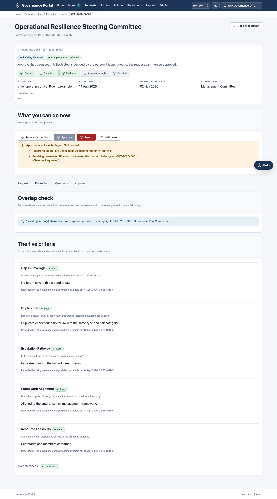

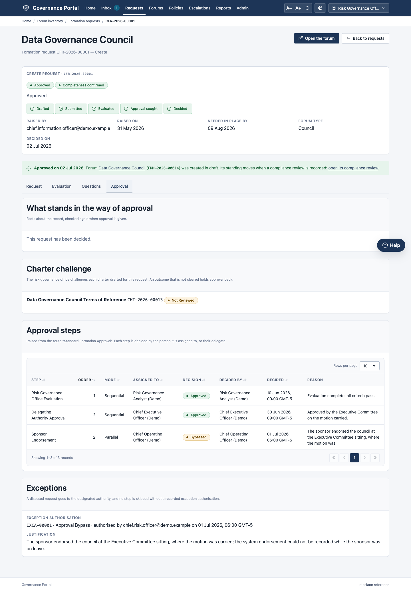

---

## 3.3 The governance office's queue

Open **Requests** in the top bar.

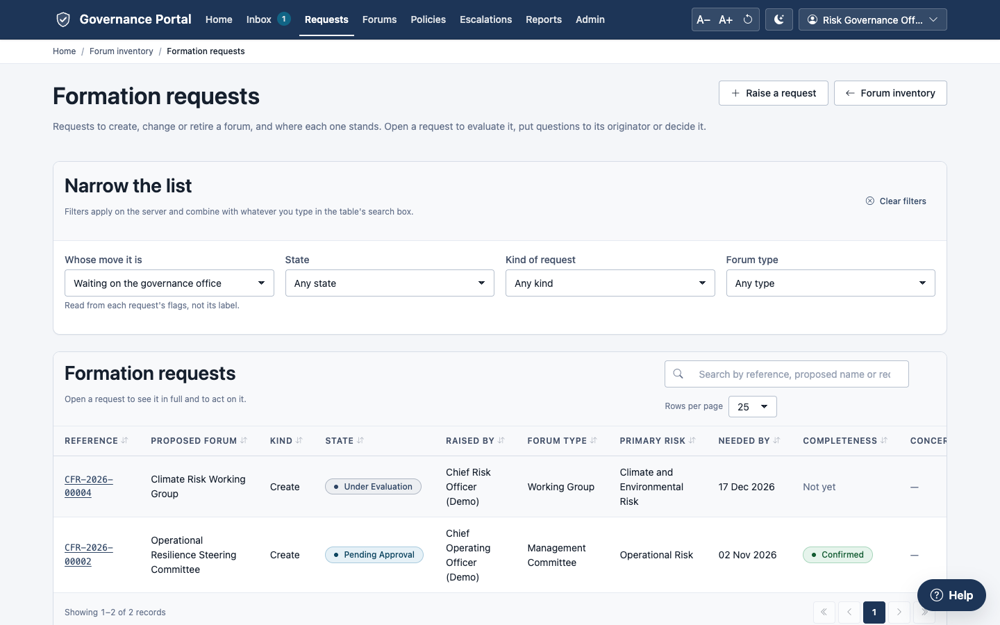

- **Whose move it is** filters the queue:
  - **Waiting on the governance office** (the default);
  - **With the originator (drafts and questions)**;
  - **Returned with questions**;
  - **Decided or closed**;
  - **Every request**.
- **State**, **Kind of request** and **Forum type** narrow it further.
- The **Needed by** column shows a **Passed** pill if the date has gone and the
  request is still open.
- Below the queue, **Forums awaiting a compliance review** lists the forums
  the compliance reviewers need to look at ([chapter 4](04-compliance-and-reviews.md)).

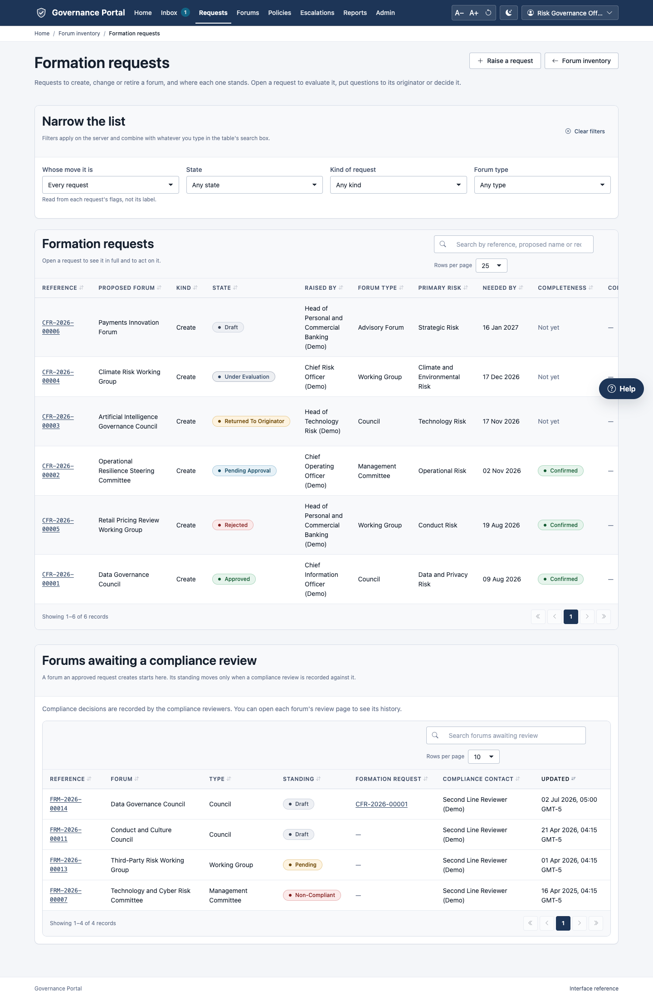

> **Tip.** The default view hides drafts and requests waiting on their
> originator. If you are looking for your own draft, choose **Every request**.

---

## 3.4 Evaluating a request (Risk Governance Office)

1. Open a **Submitted** request.
2. Click **Start evaluation**, read the confirmation, and click
   **Confirm: start evaluation**. The request moves to **Under
   Evaluation**. From now on its originator cannot change it, unless you
   return it.
3. Open the **Evaluation** tab. For each of the five criteria, choose a
   **Finding** (**Pass**, **Fail** or **Not Assessed**) and write a **Note**.
   A finding without a note is refused. The five criteria are:
   - **Gap In Coverage:** is there a real gap the forum fills?
   - **Duplication:** does an existing forum already cover it? (Use the
     overlap check shown above the criteria.)
   - **Escalation Pathway:** is it clear what the forum escalates, to whom,
     and when?
   - **Framework Alignment:** does it fit the governance framework and the
     forum hierarchy?
   - **Resource Feasibility:** can it be staffed and run?
4. Tick **The request is complete: everything the evaluation needs is on it**
   when it is.
5. Click **Save findings**. You can save as often as you like.

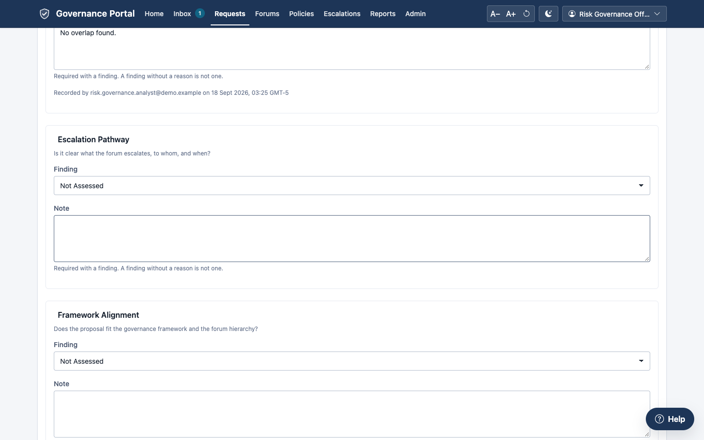

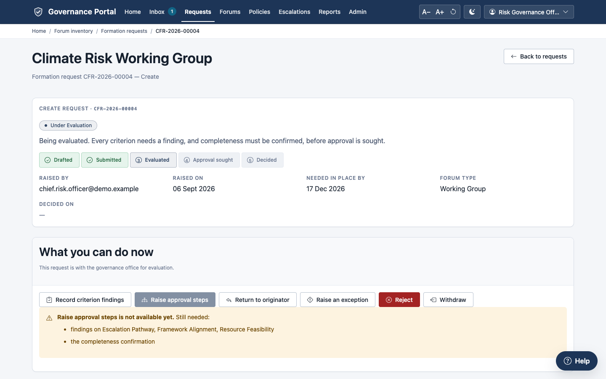

### Returning a request with questions

1. Click **Return to originator**.
2. Write your questions in **Questions for the originator**.
3. Click **Return the request**.

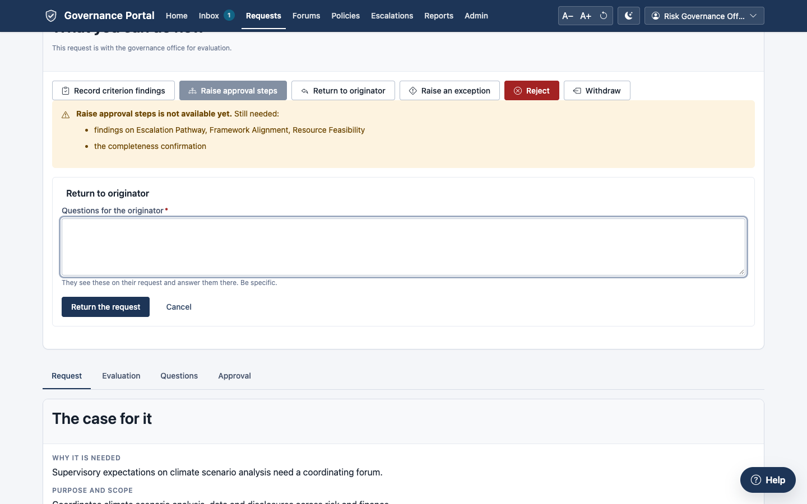

**What happens next.** The request moves to **Returned To Originator** and the
originator is told. They open the request, see your questions in **The
governance office has questions**, amend the request if needed, write their
answer and click **Send your answer**. The request comes back to **Under
Evaluation**, and the exchange is kept on the **Questions** tab.

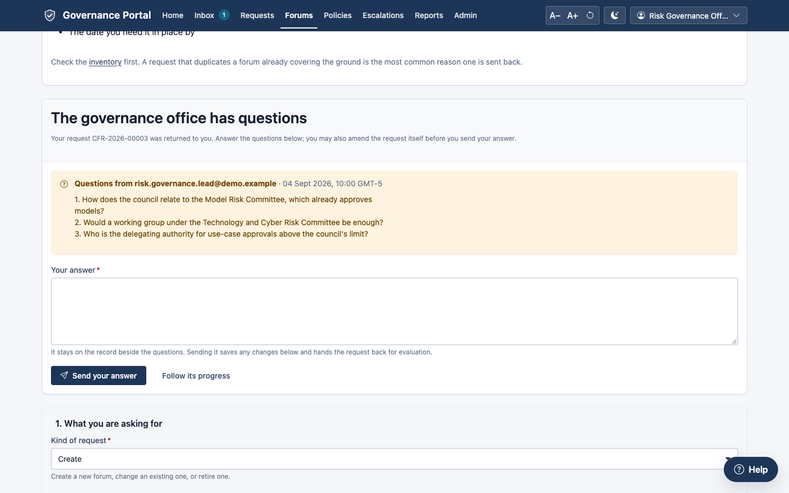

> **Answering needs a raising role.** The answer is given on the request form,
> which is open to the Committee Secretary and the Risk Governance Office. An
> originator who holds neither role can open and follow the request, and
> withdraw it, but cannot answer: the form says "You cannot raise a formation
> request". Until that changes, the governance office enters the originator's
> answer, or the originator is given the Committee Secretary role.

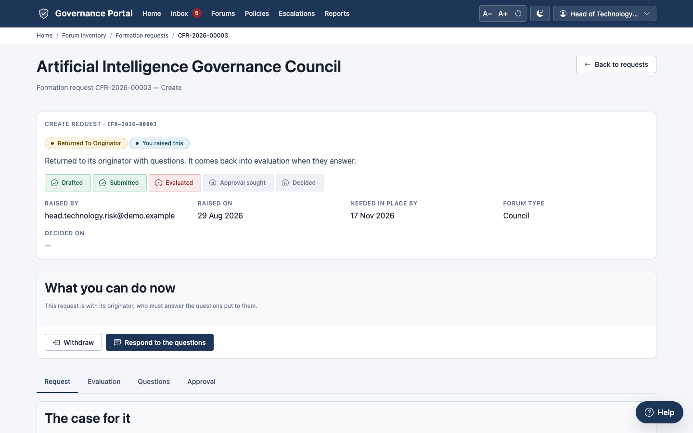

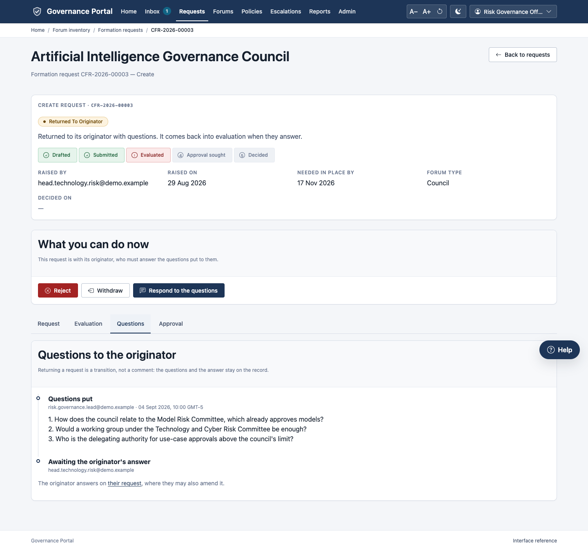

---

## 3.5 Seeking approval

1. When every criterion has a finding and completeness is confirmed, click
   **Raise approval steps**, then **Confirm**.
2. The system takes the steps from the configured **Formation Approval
   Route** ([chapter 11](11-configuring-workflows.md), section 11.5). It creates
   one approval step per route step and assigns each to its approver, who is
   told. The standard route has three steps:
   1. **Risk Governance Office Evaluation**, sent to the Risk Governance Office
      **queue**: every member is told, and whichever of them decides it takes
      it;
   2. **Delegating Authority Approval**, assigned to the request's delegating
      authority;
   3. **Sponsor Endorsement**, assigned to the request's sponsor.
3. The request moves to **Pending Approval**.

### Deciding your step (approvers)

Approvers find their step in their **Inbox** ([chapter 8](08-tasks-and-attestation.md))
under **Formation approval steps**, or by opening the request. The step shows
**Yours to decide**.

1. Open the request and go to the **Approval** tab.
2. Under **Your decision**, choose **Approved**, **Rejected**, **Changes
   Requested** or **Abstained**.
3. Write a **Reason**. It is required for anything other than Approved.
4. Click **Record decision**.

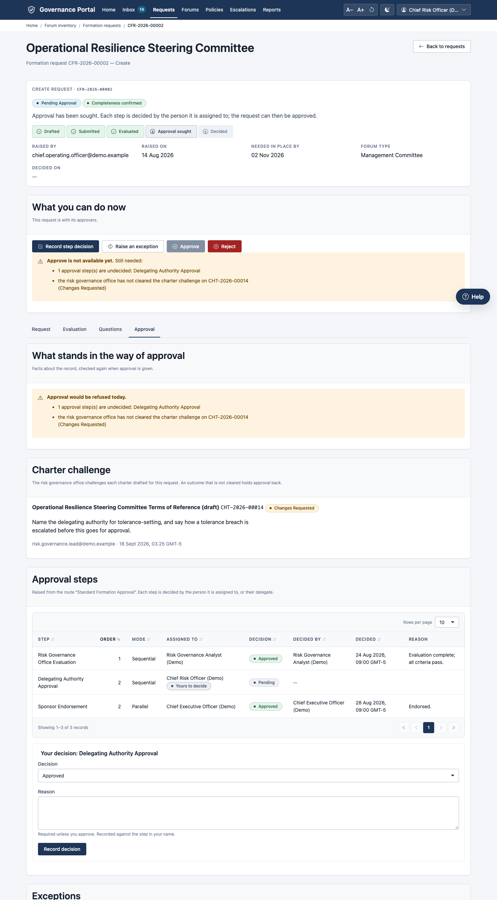

You do not need a governance role to decide a step; being assigned it is
enough. If you have delegated your approvals to someone for a period, they
can decide it for you, and the record shows "under delegation".

### Approving the request

When nothing stands in the way, the Risk Governance Office clicks **Approve**
and confirms. **Approve** stays disabled while anything is outstanding, and
the page lists what is missing:

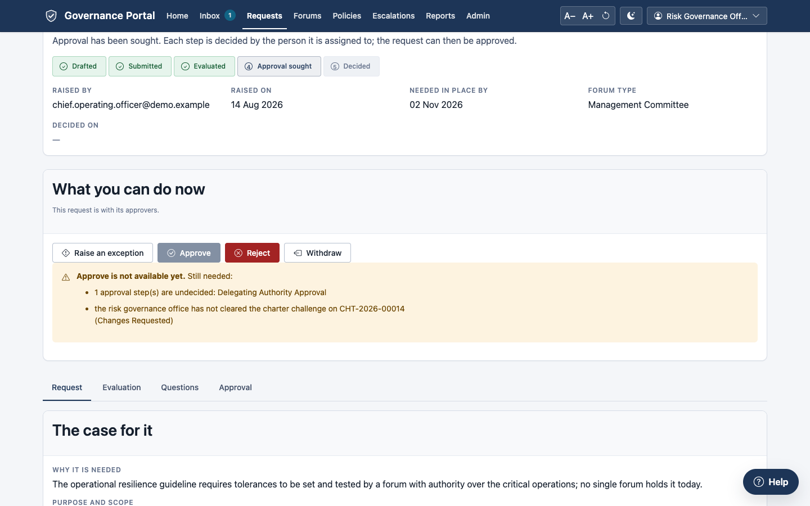

Anything in this list blocks approval:

- a criterion without a finding;
- the completeness confirmation not given;
- an undecided step, with no exception authorisation;
- a step that was rejected.
- a charter drafted for the request whose challenge is not **Cleared**
  ([chapter 5](05-meetings-votes-charters.md), section 5.5).

**What happens next.**

- **A Create request** creates the forum, **in Draft**, awaiting its first
  compliance review ([chapter 4](04-compliance-and-reviews.md)). The request
  links to it (**Open the forum**), and the forum links back to the request.
- **A Modify or Retire request** creates nothing new. The forum it concerns
  is sent for a compliance review (its status becomes **Pending**).
- The originator is told.

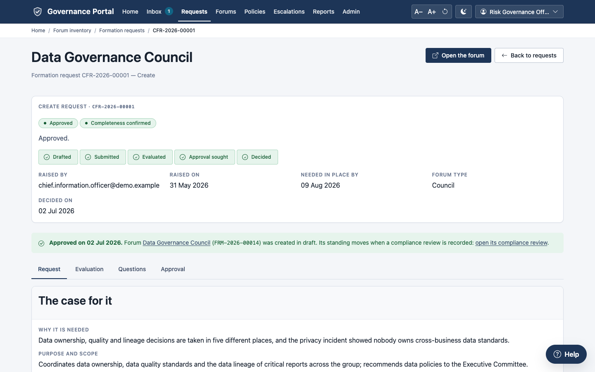

### Rejecting or withdrawing

- **Reject** (Risk Governance Office or Head of Risk Governance): write why,
  and click **Reject the request**. Rejection is final, and the originator is
  told the reason.
- **Withdraw** (the originator or the office): write why, and click
  **Withdraw the request**.

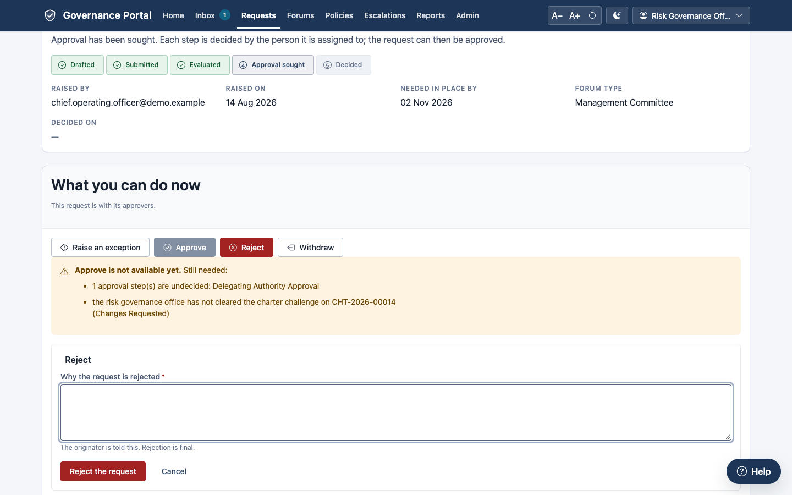

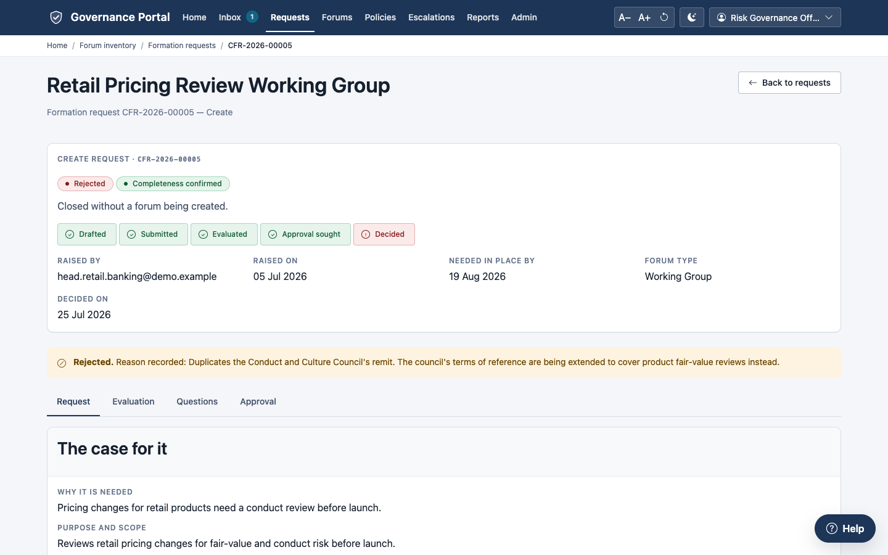

---

## 3.6 Exceptions and bypasses

Sometimes a step cannot be completed the normal way: the approver has left,
or the request is disputed.

**Raising an exception** (Risk Governance Office or Head of Risk Governance):

1. Click **Raise an exception**.
2. Explain why in **Why this is being raised as an exception**.
3. Click **Raise the exception**.

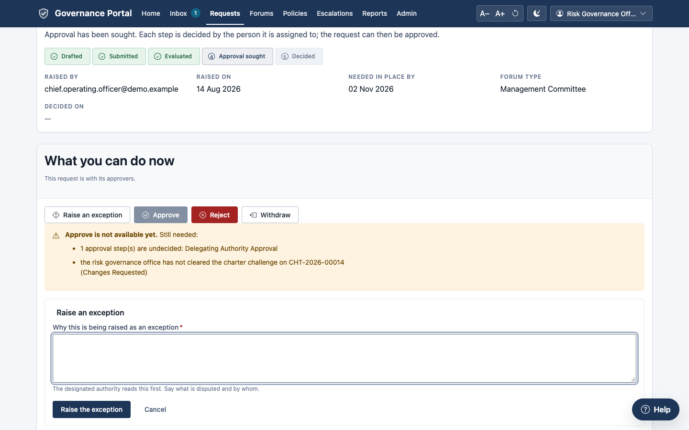

The request moves to **Exception Review**. An **Exception Resolution** step is
assigned to the Head of Risk Governance, who is told.

**Resolving the exception** (Head of Risk Governance): on the **Approval** tab,
choose **Approved** or **Rejected**, write the resolution, and click **Record
the resolution**. Either way the request returns to **Pending Approval**. A
rejected resolution then blocks approval.

**Authorising a bypass** (Head of Risk Governance): on the **Approval** tab,
under **Authorise a bypass**, choose the **Step to bypass**, write the
**Justification**, and click **Authorise the bypass**. This records a
permanent **Exception Authorisation** in your name. Auditors read it.

> **Caution.** Use bypasses sparingly and name the step precisely. A bypass
> excuses **only the step it names**: every other open step still has to be
> decided before the request can be approved. You cannot bypass a step that is
> yours to decide (as its assignee, as a delegate, or as a member of its role
> queue); ask another Head of Risk Governance.

---

## Common errors

| Message | What it means | What to do |
|---|---|---|
| "A draft still needs the request's own essentials: N field(s) are empty." | A draft needs a minimum set of fields. | Fill the fields marked in red. |
| "That date has passed. Choose one in the future." | Timing dates must be in the future. This also applies when you answer a returned request. | Move the date. |
| "Request … is not editable in its current state." | The request is with the governance office. | Wait for questions, or ask the office to return it. |
| "Request … has already been sent; it is …" | It was already submitted. | Follow it on its page. |
| "… may not take the action "…" on formation request …. It belongs to: …" | Your roles do not include this action. | The message names the role that can. |
| ""…" is not available while request … is …" | The action does not apply at this stage. | Check the progress bar. |
| "Every evaluation criterion needs a finding before approval is sought. Outstanding: …" | Criteria are unassessed. | Record the findings and save. |
| "The G-7 completeness confirmation gates progression. Confirm it first." | Completeness is not confirmed. | Tick the box on the Evaluation tab and save. |
| "Criterion … has a finding but no comment." | A finding needs its note. | Add the note. |
| "No active formation approval route is configured." | No route is active. | An administrator must activate a route (chapter 11). |
| "Approval step … has nobody to decide it." (*Step Unassigned*) | Nobody holds the step's role, or the request's delegating authority or sponsor is empty. | Give the role to an active person, or fill in the request. |
| "Request … cannot be approved: …" | Something still blocks approval; the message lists it. | Resolve each item. |
| "A rejection is recorded with its reason." / "A withdrawal is recorded with its reason." | The reason is required. | Write it. |
| "No Head of Risk Governance is available to resolve the exception." | Nobody active holds the role. | An administrator must assign it. |
| "You cannot raise a formation request" | You hold neither Committee Secretary nor Risk Governance Office. | Ask the governance office to raise it for you. |

## Tips

- **Write the three explanations for a reader who knows nothing** about the
  proposal. The governance office reads the rationale first.
- **Check the overlap result** on the Evaluation tab before you record the
  *Duplication* finding.
- **Approvers do not need to hunt for requests.** Their Inbox lists every
  step waiting on them.
- **A request cannot be deleted.** Withdraw it instead, with a reason.
