# 3. Governance: forums and committees

The **Governance** area is your organisation's single, living record of every
board, committee, council and working group (the platform calls them all
**forums**). For each one it records:

- what it's for and who sits on it;
- how it connects to other forums;
- what it decided;
- whether it's properly set up.

New forums are requested, evaluated and approved here, and old ones are
disbanded here. Nothing is ever deleted.

**In this chapter**

- 3.1 The forum inventory
- 3.2 The forum map
- 3.3 A forum's page, tab by tab
- 3.4 Requesting a new forum
- 3.5 Formation requests: evaluating and deciding (governance office)
- 3.6 Compliance reviews
- 3.7 The annual review
- 3.8 Meetings and minutes
- 3.9 Motions and voting
- 3.10 Charters and the challenge
- 3.11 Disbanding a forum

---

## 3.1 The forum inventory

Open **Governance → Forum inventory**.

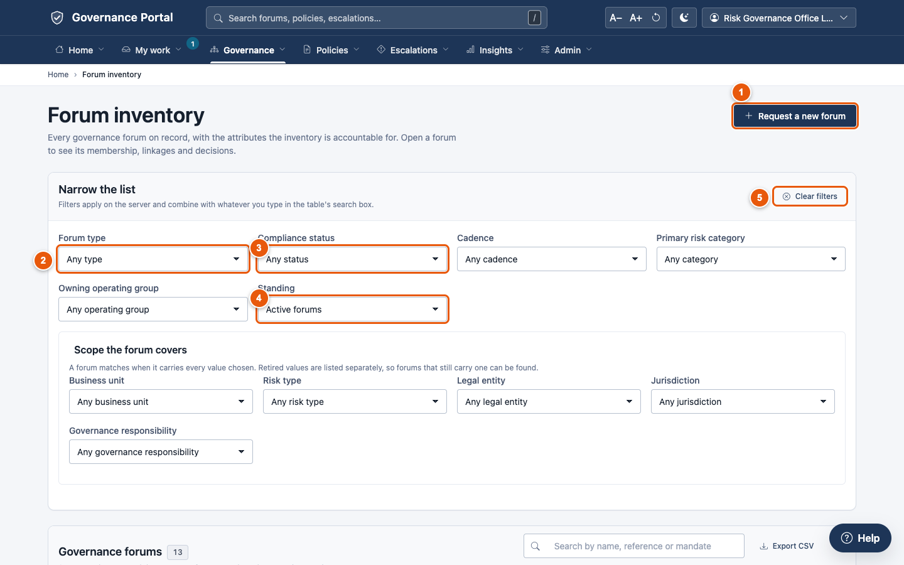

① **Request a new forum** starts a guided request (section 3.4).

② **Forum type**: board, board committee, executive committee, management
committee, council or working group.

③ **Compliance status**: Draft, Pending, Compliant, Non-Compliant, Not
Applicable or Disbanded.

④ **Standing** gives ready-made views: *Active forums* (the normal view),
*Active and disbanded*, *Disbanded only*, *Awaiting review*,
*Regulatory-required* and *Review overdue*.

⑤ **Clear filters** starts again.

Further filters narrow by cadence, primary risk category and owning operating
group. **Scope the forum covers** narrows by business unit, risk type, legal
entity, jurisdiction or governance responsibility. A forum shows only if it
covers every value you choose.

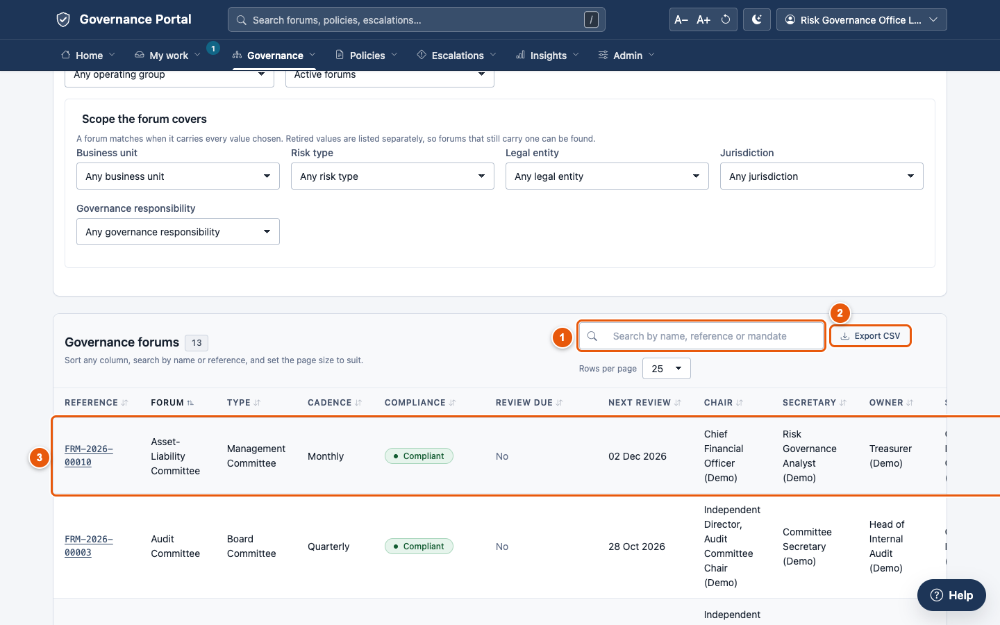

① **Search** by name, reference or mandate.

② **Export CSV** downloads the list as a spreadsheet.

③ **Click a forum** to open it. A red **Overdue** label means its review date
has passed.

---

## 3.2 The forum map

Open **Governance → Forum map** (or **Home → Forum map**) to see how every
forum reports to the others.

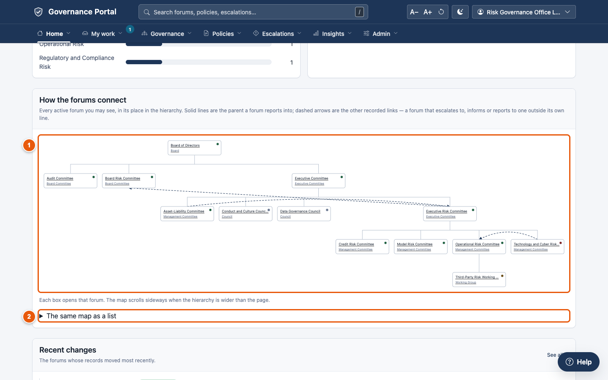

① **The map** draws the hierarchy, from the board down. Click any forum to
open it.

② **The same map as a list**, for printing or for anyone who prefers text.

---

## 3.3 A forum's page, tab by tab

Click a forum in the inventory, the map or search.

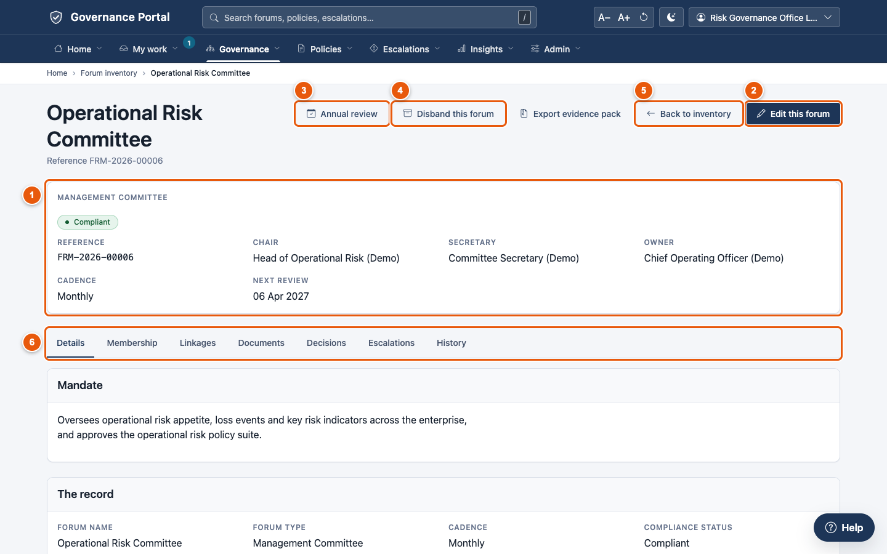

① **The summary** shows the forum's type and standing, then its reference,
chair, secretary, owner, how often it meets, and its next review date.

The buttons at the top depend on your role:

② **Edit this forum** changes the forum's details (owner, secretary and
governance office). Some details are protected (see *Good to know* below).

③ **Annual review** opens the forum's annual review (section 3.7).

④ **Disband this forum** starts taking the forum out of service (section
3.11). Approvers see **Disbandment: your decision is needed** instead.

⑤ **Back to inventory.**

⑥ **The tabs**, explained one by one below.

Compliance reviewers also see **Record a compliance review**:

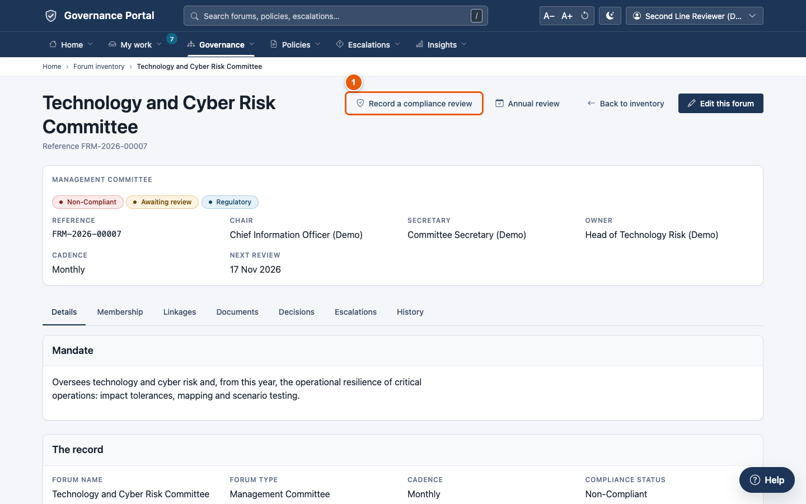

① **Record a compliance review** (section 3.6).

Auditors and administrators also see **Export evidence pack** (see the
History tab).

If you may only read a forum, a note says so and tells you who makes changes:

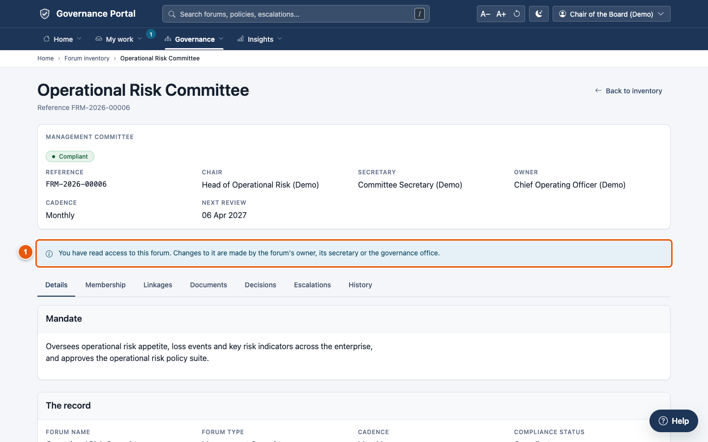

① The read-only note.

### Details

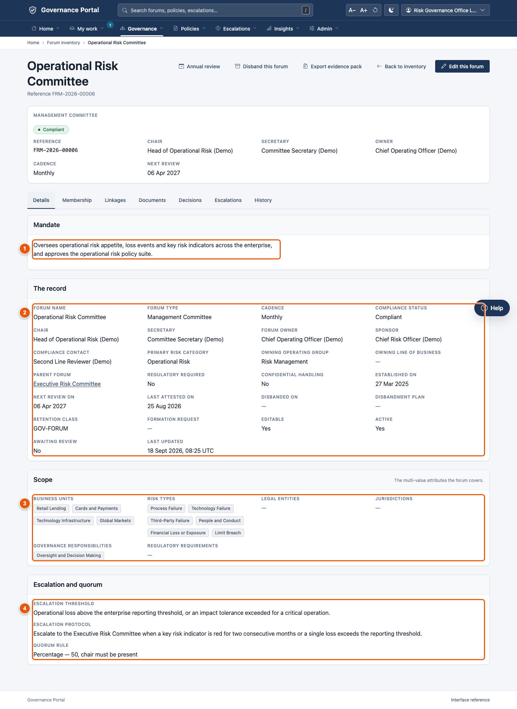

① **Mandate**: what the forum is responsible for.

② **The record**: every detail, including the formation request that created
the forum.

③ **Scope**: the business units, risk types, legal entities and
jurisdictions it covers.

④ **Escalation and quorum**: how it escalates, and the minimum participation
its decisions need.

### Membership

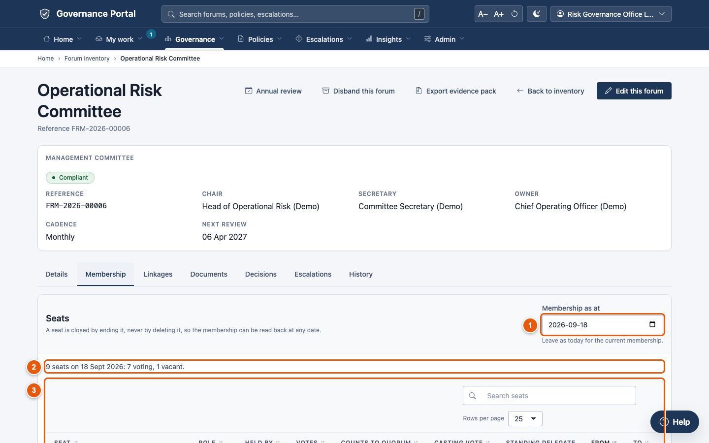

① **Membership as at** shows today's seats. Change the date to see who sat on
the forum on any past day.

② **The summary**, for example "9 seats on 18 Sept 2026: 7 voting".

③ **The seats**: who holds each one (a person, or a position such as "Chief
Risk Officer"), their role, whether they vote and count towards quorum, their
standing delegate, and when the seat started and ended.

To answer "who was on the committee when it decided X?", set the date to the
day of the decision:

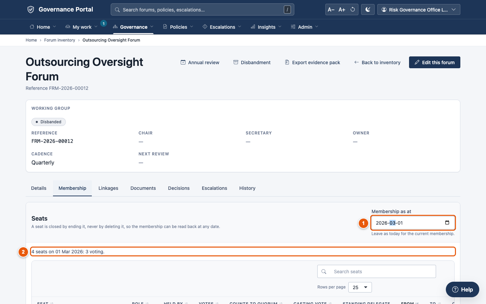

① The date chosen.

② The seats on that day, even for a forum that has since been disbanded.

Seats are ended, never deleted. They are maintained by the forum's secretary
and the governance office.

### Linkages

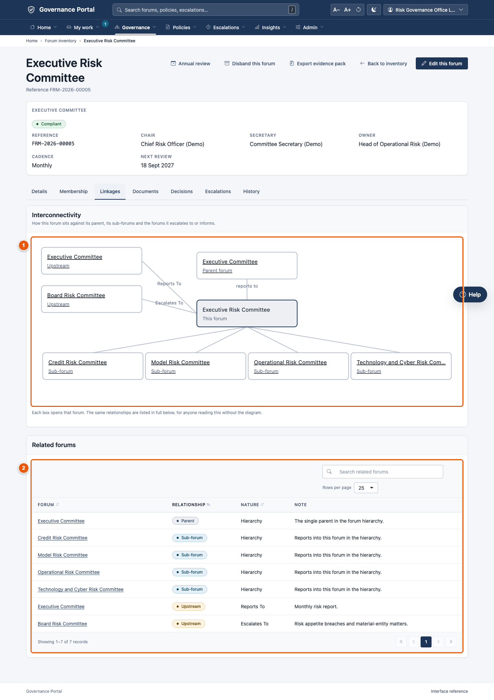

① **The map** shows the parent forum above, the forums this one reports or
escalates to on the left, the forums it informs on the right, and its
sub-forums below. Click any box to open that forum.

② **Related forums** lists every relationship in full, with its nature and a
note.

### Documents

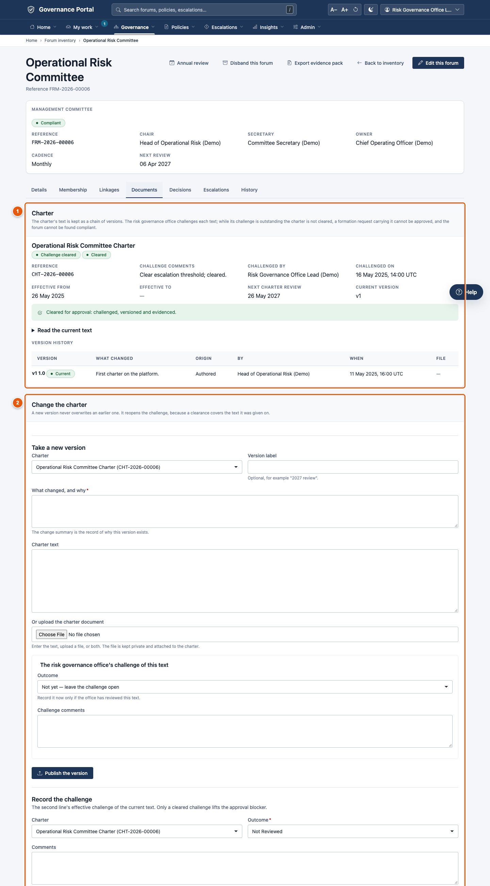

① **Charter**: the forum's founding document, its challenge status and its
versions (section 3.10).

② **Change the charter**: take a new version, or record the challenge.

Further down, **Documents this forum approves** lists the policies whose
approving forum this is.

### Decisions

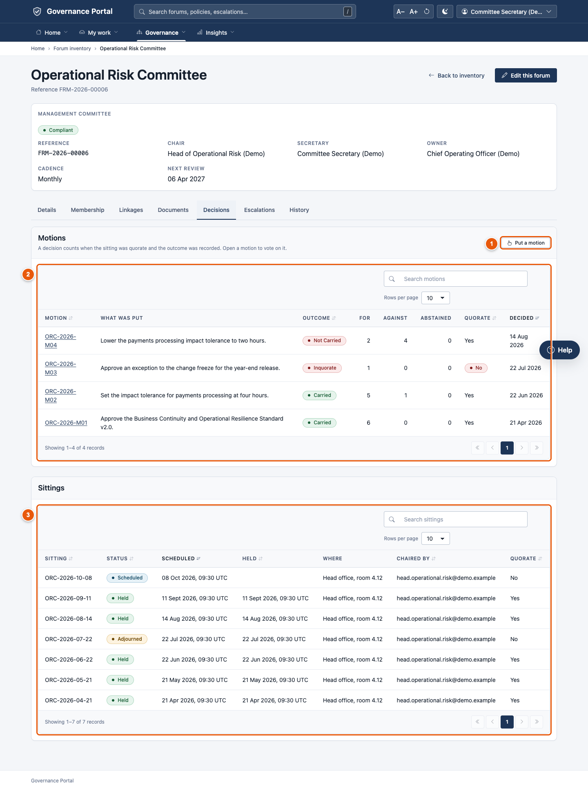

① **Put a motion** (the forum's secretary) starts a vote (section 3.9).

② **Motions**: what was put, the outcome (*Carried*, *Not Carried*,
*Deferred*, *Withdrawn* or *Inquorate*), the votes and whether the sitting was
quorate.

③ **Sittings**: each meeting, with its status, dates, place, chair and
whether it was quorate.

### Escalations

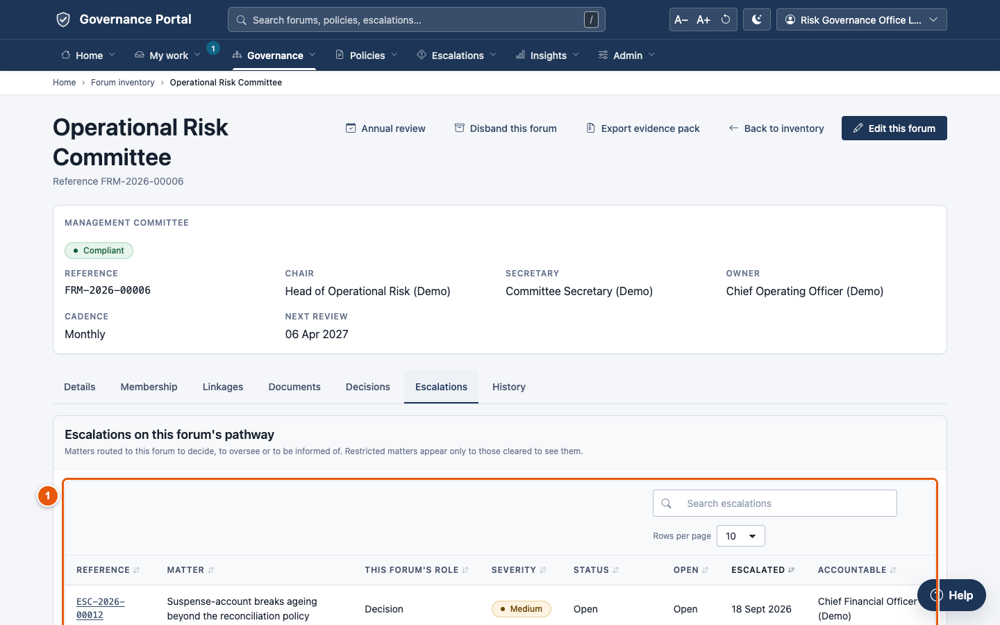

① Every escalation routed to this forum, and its role in each: to **decide**,
to **oversee**, or to be **informed**. Secretaries use this to prepare the
agenda. Sensitive matters appear only to people cleared to see them.

### History

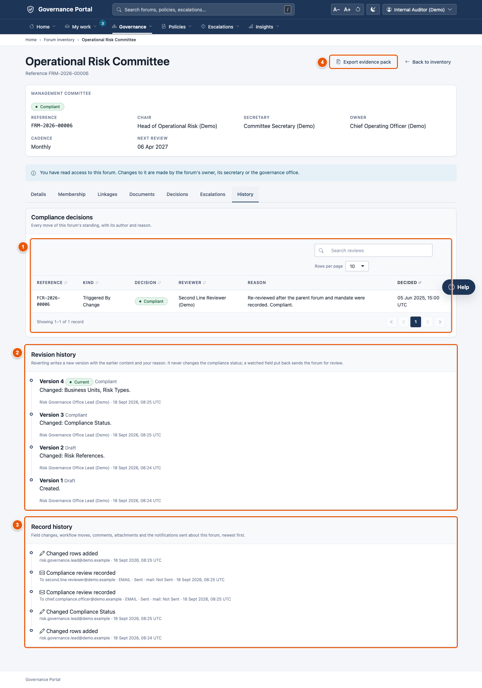

① **Compliance decisions**: every review of the forum's standing, with who
decided and why.

② **Revisions**: each saved version of the forum's details.

③ **Record history**: everything recorded against the forum, newest first:
changes, comments, attachments and every notification sent.

④ **Export evidence pack** (auditors and administrators) downloads the forum,
its history, approvals and attachments as one file, with a fingerprint for
every item so any tampering would show.

A disbanded forum stays readable, marked **Disbanded**:

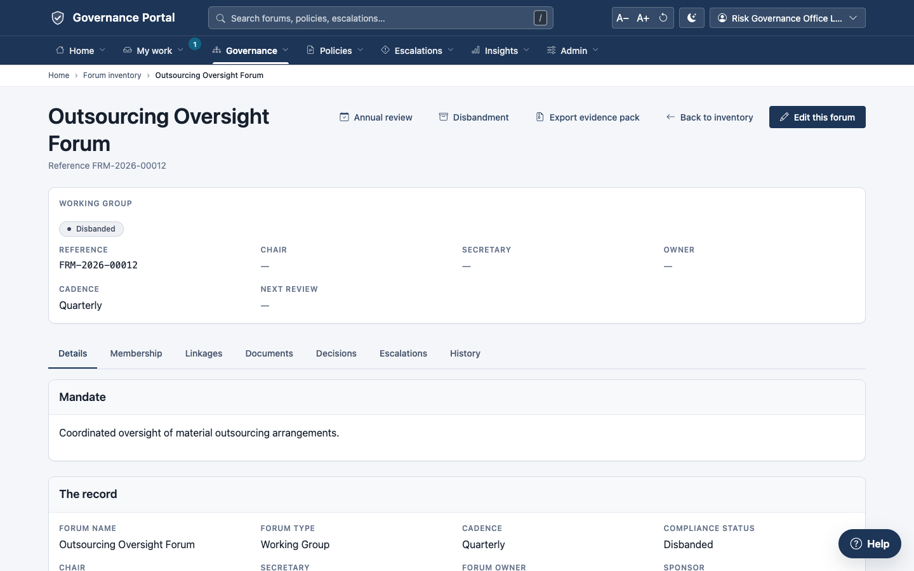

> **Good to know.**
> - **Chair, secretary and owner follow the seats.** To change the chair, the
>   secretary ends the old seat and opens a new one.
> - **Compliance status moves only through a review**, a change to a watched
>   detail, or a disbandment.
> - **Watched details** (such as the forum's type, mandate, chair, risk
>   category, parent or owning group) send the forum back for a compliance
>   review when changed. It is **locked** until the review is recorded.

---

## 3.4 Requesting a new forum

Every forum exists because someone asked for it and the request was approved.
The same route changes or retires a forum.

**Who:** Committee Secretaries and the risk governance office.

1. Choose **Governance → Request a new forum**.

   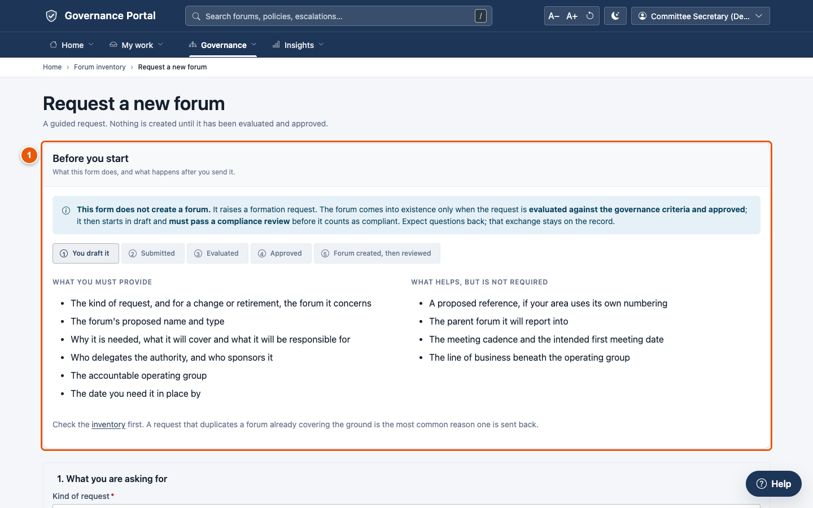

   ① **Before you start** lists what you'll need and shows the five stages
   ahead: *You draft it*, *Submitted*, *Evaluated*, *Approved*, *Forum created,
   then reviewed*.

2. **Search the inventory first.** The most common reason a request comes back
   is that a forum already covers the ground.
3. Fill in the four sections. Fields marked **\*** are required.
   - **1. What you are asking for**: create, change or retire; why it's
     needed; its purpose and scope; its responsibilities.
   - **2. The forum**: its name and type, primary risk category, how often it
     meets, and its parent. As you type the name, the form warns you about
     similar forums.
   - **3. Accountability**: the owning operating group, the delegating
     authority, and the sponsor.
   - **4. Timing**: when it's needed, and the intended first meeting.

   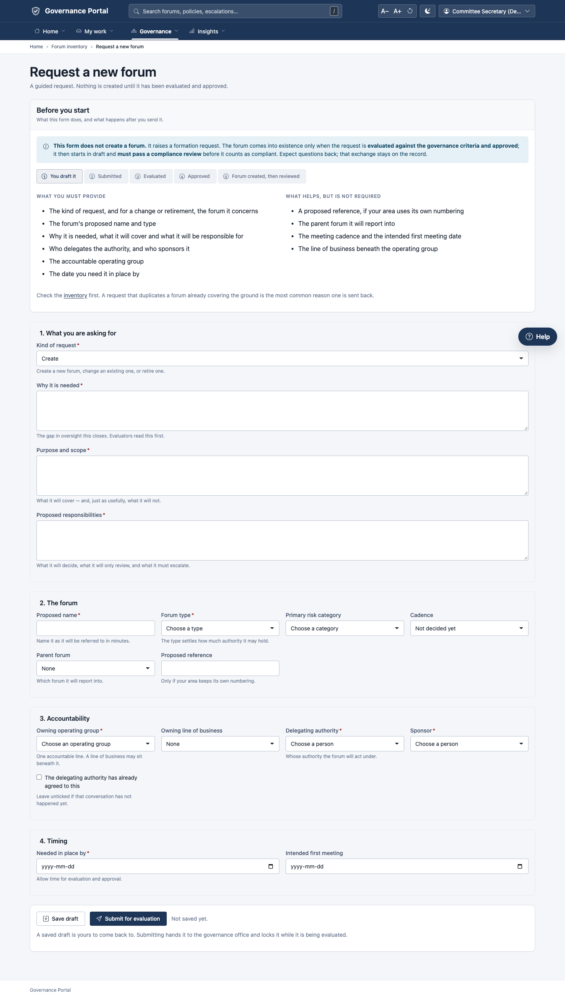

4. Save and submit:

   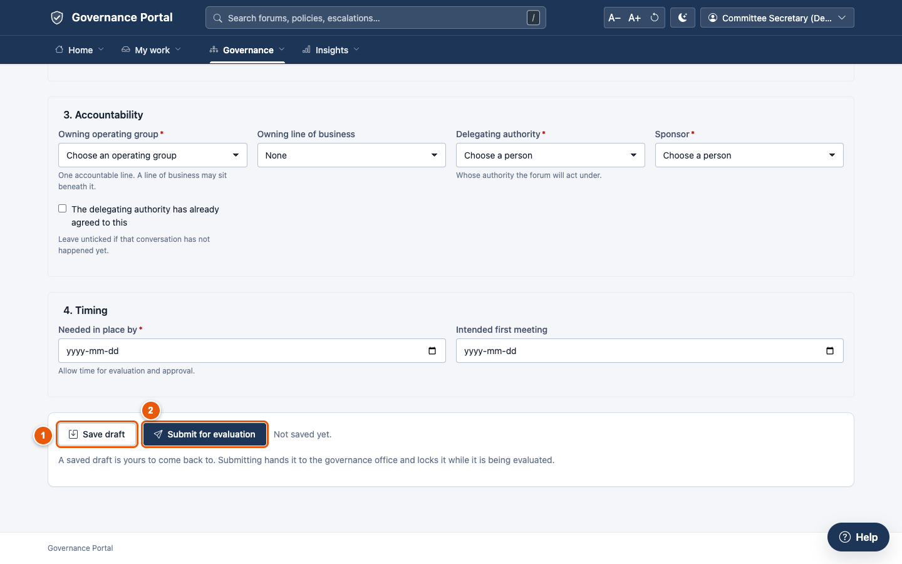

   ① **Save draft** keeps your work so you can come back to it. The address
   then includes the request's reference; bookmark it.

   ② **Submit for evaluation** hands it to the governance office. From then on
   you can't change it unless they return it to you with questions.

**What happens next.** The platform checks for overlapping forums and puts
your request in the governance office's queue. You can follow it from its
page. If the office has questions, it appears in your **My work** under
**Formation requests returned to you**.

**Answering the governance office's questions.** Open the request from **My
work**. You don't need a raising role to answer a request you raised:

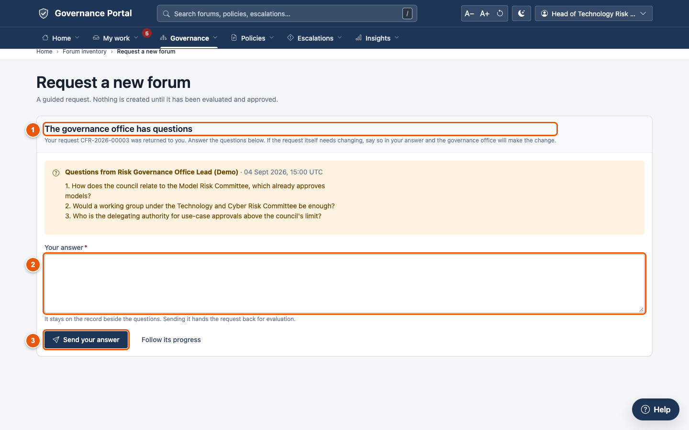

① **The governance office has questions**: who asked, when, and their
questions.

② **Your answer.** If the request itself needs changing, say so here and the
office makes the change.

③ **Send your answer.** The request goes back to the office for evaluation.

---

## 3.5 Formation requests: evaluating and deciding

*For the risk governance office, approvers and the Head of Risk Governance.*

### The queue

Open **Governance → Formation requests**.

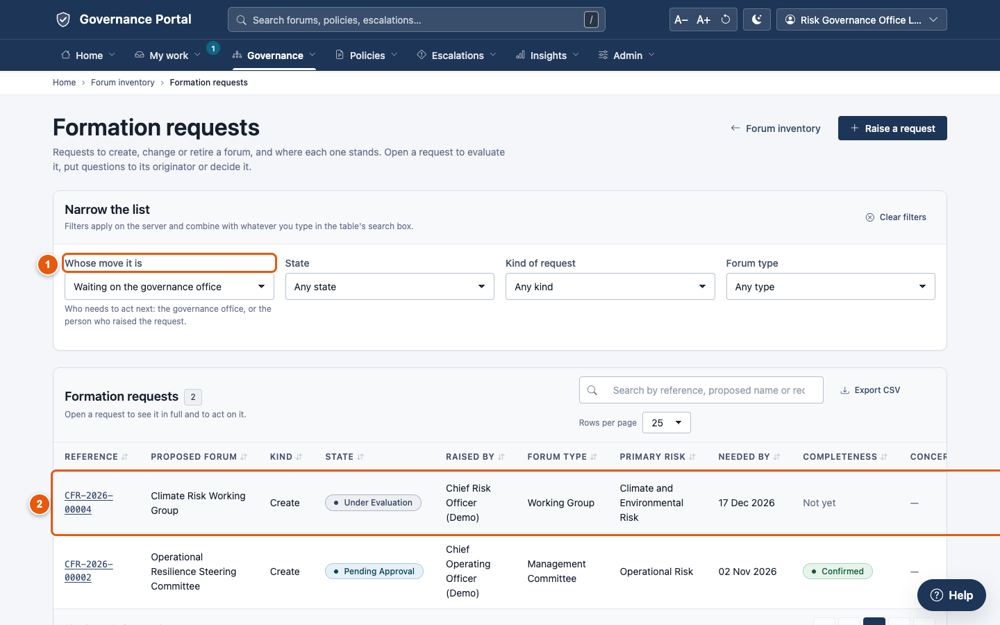

① **Whose move it is** filters the queue: *Waiting on the governance office*
(normal), *With the originator*, *Returned with questions*, *Decided or
closed*, or *Every request*.

② **Click a request** to open it. A **Passed** label under *Needed by* means the
date has gone.

Below the queue, **Forums awaiting a compliance review** lists the forums the
compliance reviewers need to look at.

### A request's page

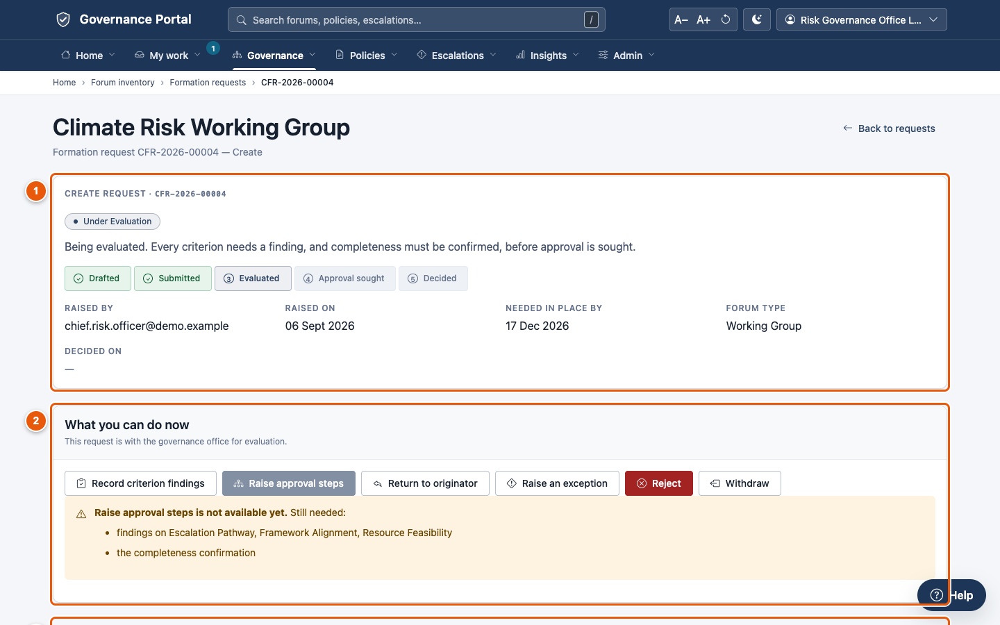

① **The summary** shows the kind of request, its state and the progress bar:
**Drafted → Submitted → Evaluated → Approval sought → Decided**.

② **What you can do now** offers only the actions open to you at this stage.

③ **The tabs**: **Request** (the case), **Evaluation** (the overlap check and
the findings), **Questions** (the exchange with the originator) and
**Approval** (the steps and who decided them).

### Evaluating

1. Click **Start evaluation** and confirm.
2. Open the **Evaluation** tab. For each of the five criteria (gap in
   coverage, duplication, escalation pathway, framework alignment, resource
   feasibility):

   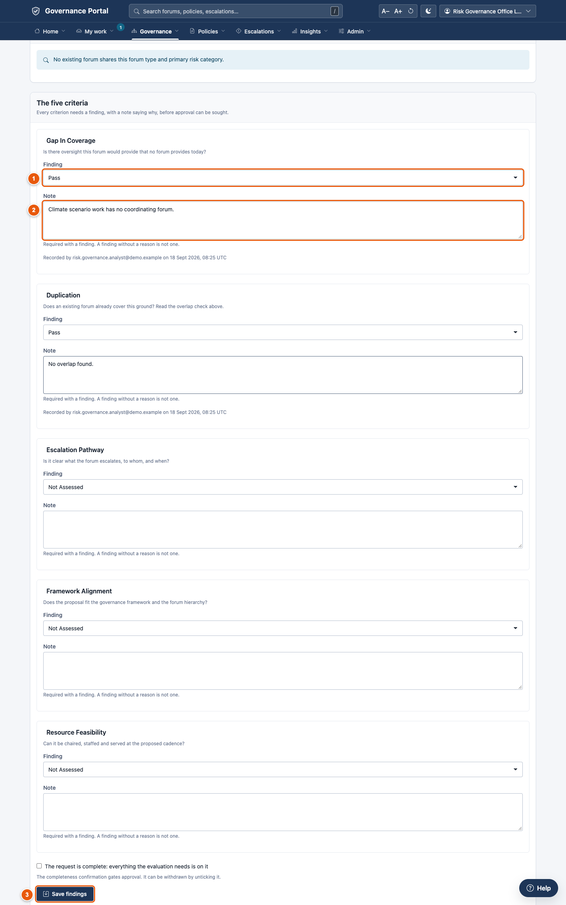

   ① Choose a **Finding**: *Pass*, *Fail* or *Not Assessed*.

   ② Write a **Note** saying why. A finding without a note isn't accepted.

   ③ Click **Save findings**. You can save as often as you like.

3. Tick **The request is complete** when it is.

**Returning it with questions.** Click **Return to originator**:

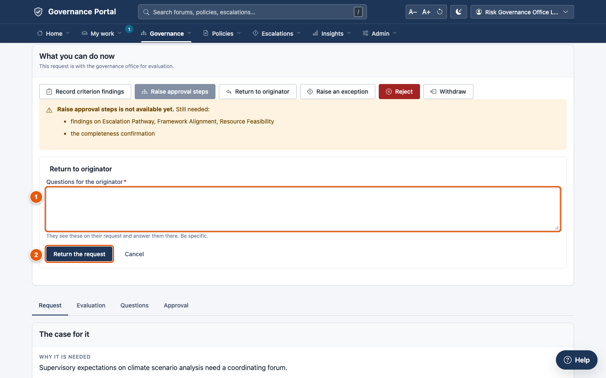

① Write your questions.

② Click **Return the request**. The originator is told and answers (section
3.4). It then comes back to you, and the exchange is kept on the
**Questions** tab.

### Seeking approval

When every criterion has a finding and completeness is confirmed, click
**Raise approval steps**. The approvers come from your organisation's
approval route. Typically they are:

- the governance office's own evaluation, which any member of the office can
  take;
- the delegating authority;
- the sponsor.

Each approver is told, and the request appears in their **My work**.

**Deciding a step (approvers):**

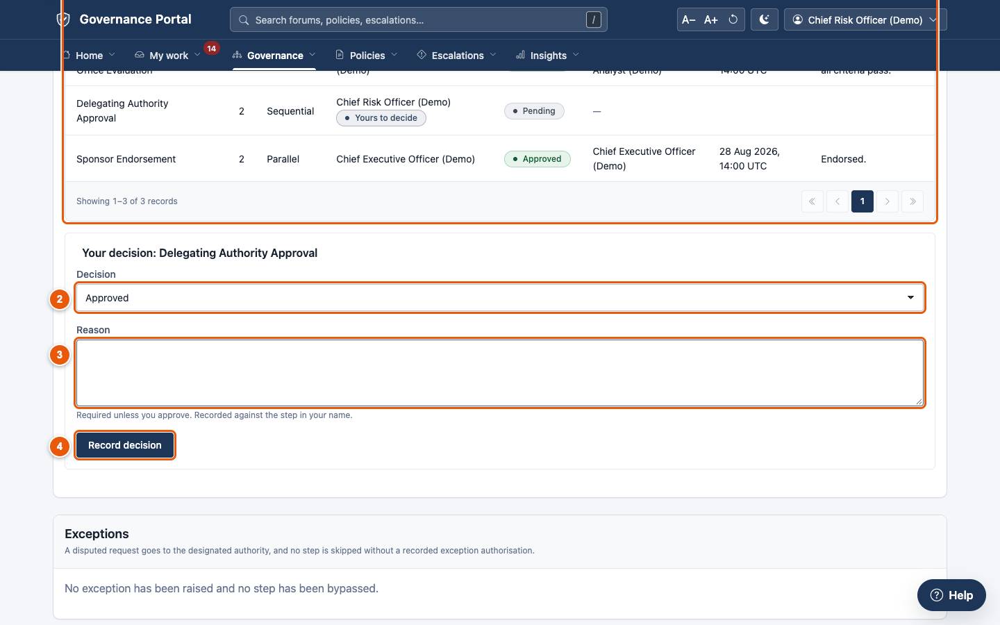

① **The approval steps**, their order, and who has decided. Your step is
marked **Yours to decide**.

② Choose your **Decision**: *Approved*, *Rejected*, *Changes Requested* or
*Abstained*.

③ Give a **Reason**. It's required unless you approve.

④ Click **Record decision**.

Steps marked *Sequential* are decided in order. A step waits until the one
before it is decided.

**Approving the request.** **Approve** stays greyed out while anything is
outstanding, and the page says what:

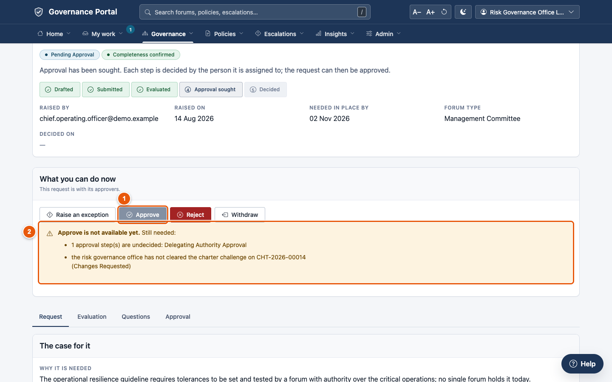

① **Approve**, greyed out.

② What's still needed, for example an undecided step, or a charter whose
challenge isn't cleared.

When nothing is outstanding, click **Approve** and confirm. For a new forum,
the platform creates it in *Draft*, ready for its first compliance review:

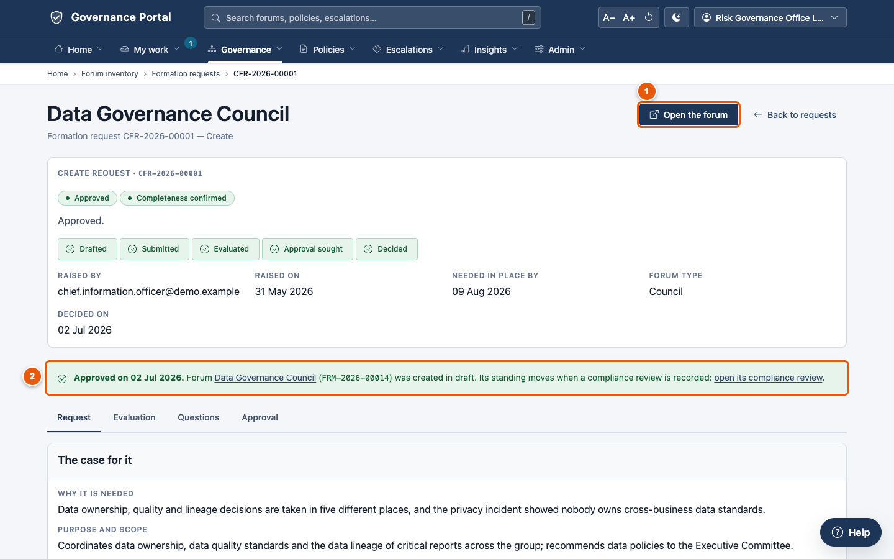

① **Open the forum** goes to the new forum.

② **The outcome** says when it was approved and what was created.

**Rejecting or withdrawing.** **Reject** (the governance office) and
**Withdraw** (the originator or the office) each ask for a reason, which is
sent to the originator.

**Exceptions.** If a step can't be completed normally (the approver has left,
or the request is disputed), the office clicks **Raise an exception**:

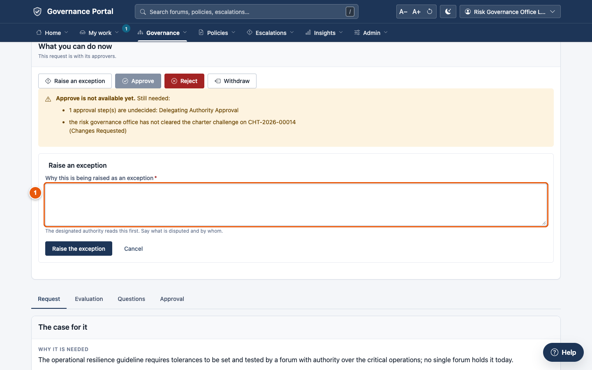

① Explain why, then click **Raise the exception**. The Head of Risk
Governance resolves it.

The Head of Risk Governance can also **Authorise a bypass** of one named step,
with a written justification. A bypass excuses only that step, and you can't
bypass a step that is yours to decide.

---

## 3.6 Compliance reviews

A **compliance review** decides whether a forum is properly set up. New
forums, and forums whose watched details changed, wait for one.

**Who:** Compliance Reviewers.

**Finding forums to review:**

- **My work → Reviews**;
- **Governance → Awaiting compliance review**;
- the figure on the home page.

1. Open the forum and click **Record a compliance review**.

   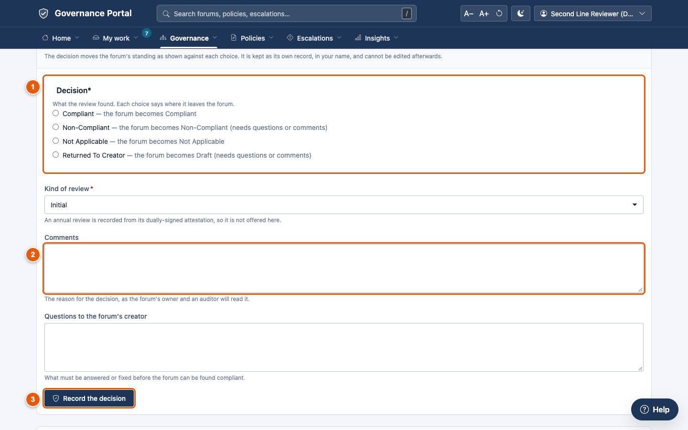

2. ① Choose the **Decision**. Each option says where it leaves the forum:
   - *Compliant*;
   - *Non-Compliant* (needs questions or comments);
   - *Not Applicable*;
   - *Returned To Creator* (back to Draft; needs questions or comments).
3. Choose the **Kind of review**: *Initial* or *Triggered By Change*.
4. ② Write your **Comments**: the reason, as the owner and an auditor will
   read it. For Non-Compliant or Returned To Creator, also write the
   **Questions to the forum's creator**.
5. ③ Click **Record the decision**.

The review is kept in your name and can't be edited afterwards. The forum's
standing moves at once, and the review appears on its **History** tab.

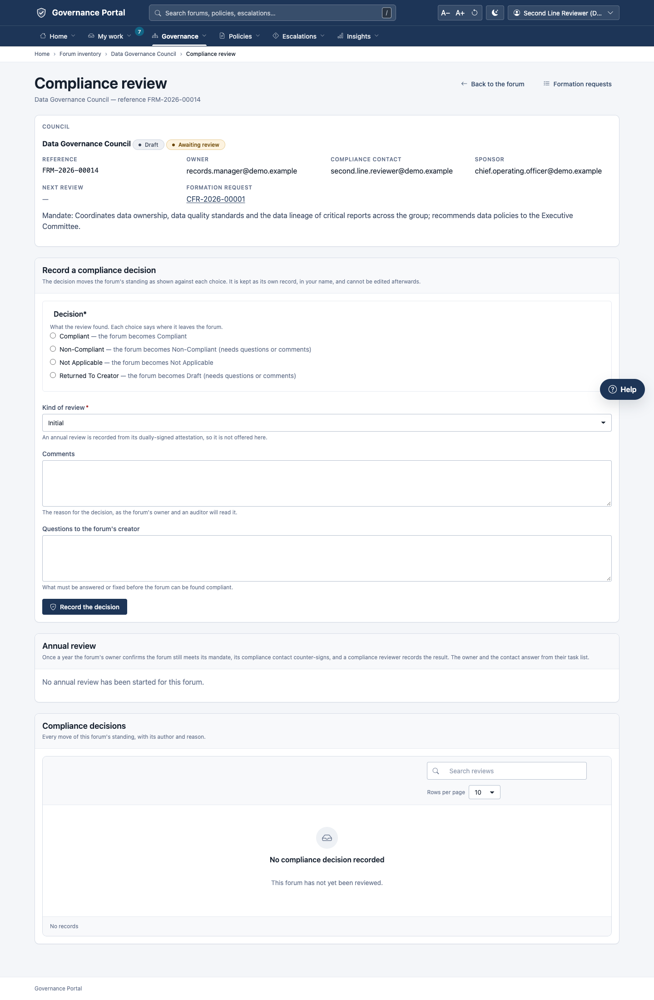

---

## 3.7 The annual review

Once a year, a forum's owner confirms the forum still meets its mandate, its
compliance contact counter-signs, and a compliance reviewer records the
result.

Open the forum and click **Annual review**.

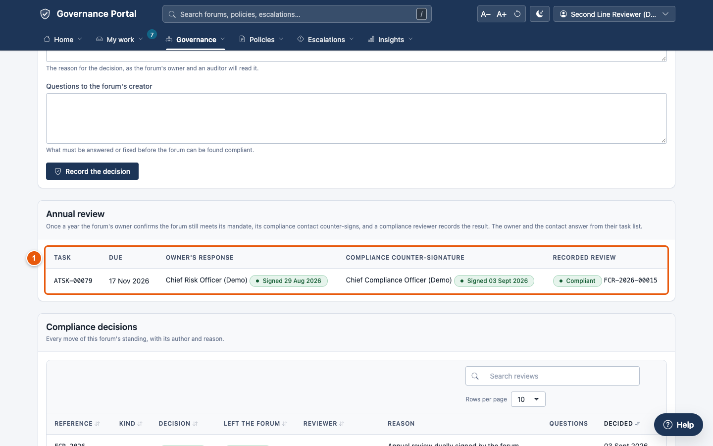

① **Each annual review** shows its due date, the owner's response, the
compliance counter-signature and the recorded review. A review signed by both
shows **Ready to record**.

**Starting it** (governance office): under **Start the annual review**, set the
due date and click **Start the review**. The owner and the compliance contact
are asked in their **My work**. The annual review can also be run for every
forum at once as a campaign (chapter 4, section 4.10).

**Recording it** (compliance reviewer): under **Record the annual review**,
choose the signed task and the **Decision**, add comments if the decision
sends the forum back, and click **Record the annual review**. The forum's
standing moves, and its next review date is set a year ahead.

---

## 3.8 Meetings and minutes

*For Committee Secretaries.*

Meetings are kept on the forum's record, in the full configuration screens.
Open a meeting from the forum's **Decisions** tab (**Sittings**).

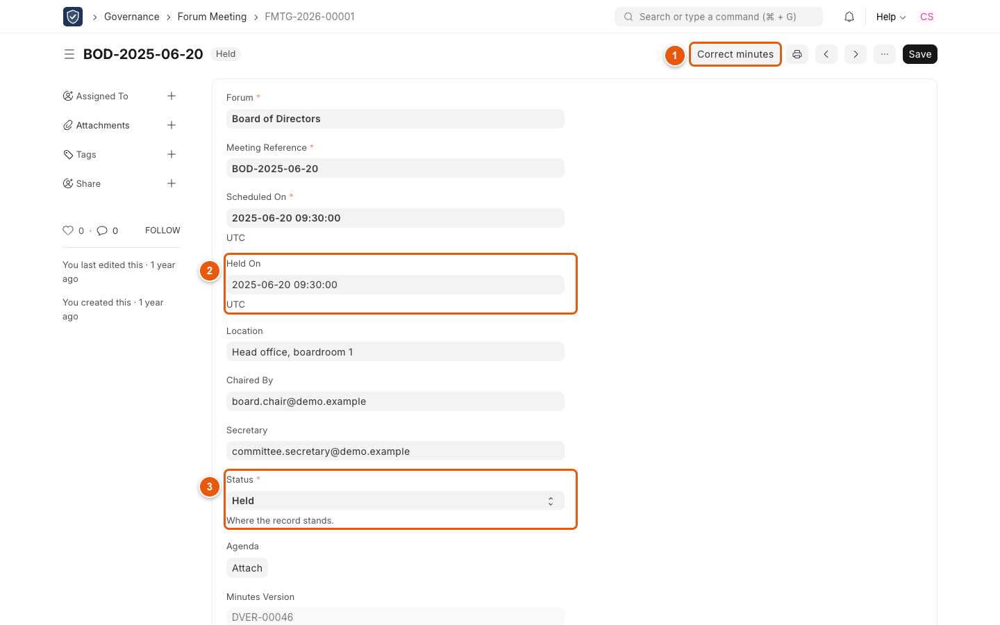

① **Record minutes**, or **Correct minutes** once minutes exist.

② **Held On**: when the meeting took place.

③ **Status**: *Scheduled*, *Held*, *Cancelled* or *Adjourned*. When you set
*Held*, the platform works out from the attendance whether the meeting was
quorate.

**Recording or correcting minutes:**

1. Click **Record minutes** (or **Correct minutes**).

   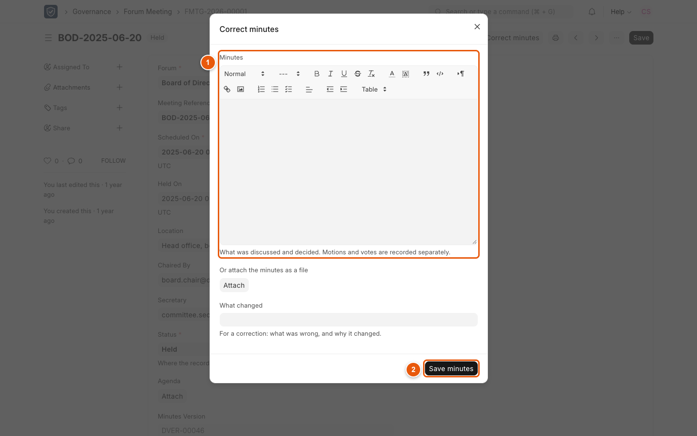

2. ① Type the minutes, or attach the minutes as a file. When correcting, say
   what changed.
3. ② Click **Save minutes**. "Minutes saved as version N."

Correcting minutes adds a new version and keeps the earlier one.

---

## 3.9 Motions and voting

A **motion** is a proposal put to the forum for a vote. When it's put, the
platform lists every seat entitled to vote on the decision date.

### Putting a motion (the secretary)

On the forum's **Decisions** tab, click **Put a motion**.

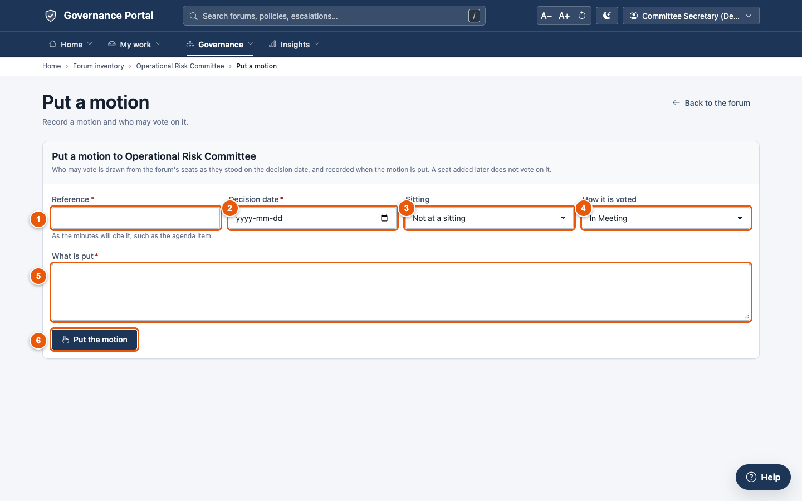

① **Reference**, as the minutes will cite it (for example the agenda item).

② **Decision date.**

③ **Sitting**: the meeting, or *Not at a sitting*.

④ **How it is voted**: *In Meeting*, *Written Resolution* or *Electronic*.

⑤ **What is put**: the wording of the motion.

⑥ **Put the motion.**

### Voting (each entitled member)

Open the motion from the forum's **Decisions** tab or from the link you were
sent.

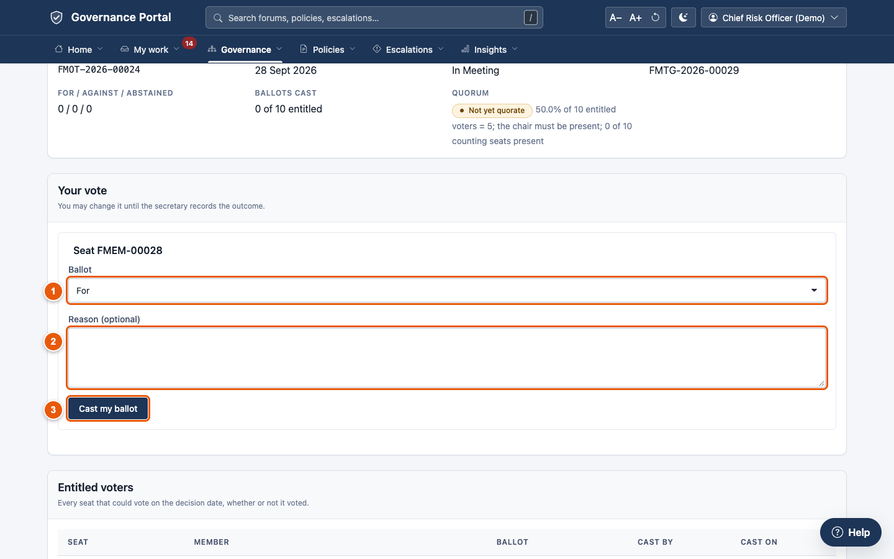

① Choose your **Ballot**: *For*, *Against*, *Abstain* or *Recused*.

② Optionally give a reason.

③ Click **Cast my ballot**. You can change it (**Change my ballot**) until the
outcome is recorded. A standing delegate may vote for a seat if the seat
allows it.

### Recording the outcome (the secretary)

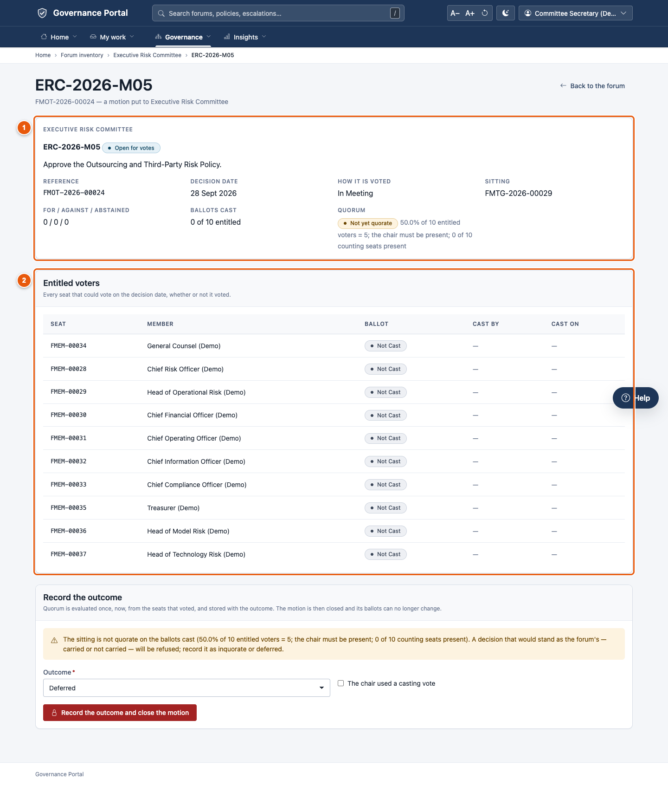

① **The summary** shows the tally and whether the motion is **Quorate so far**.

② **Entitled voters** lists every seat that could vote, and each ballot.

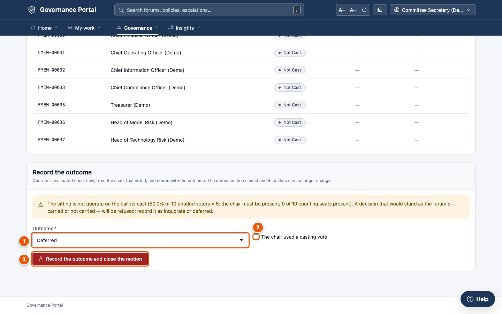

① Choose the outcome: *Carried*, *Not Carried*, *Deferred*, *Withdrawn* or
*Inquorate*.

② Tick **The chair used a casting vote** if so.

③ Click **Record the outcome and close the motion**.

Quorum is worked out once, at that moment. If the vote wasn't quorate,
*Carried* and *Not Carried* aren't allowed; record *Inquorate* or *Deferred*
instead. Once closed, ballots can't change.

---

## 3.10 Charters and the challenge

A forum's **charter** is its founding document. Each version is
**challenged** by the risk governance office, and a charter is cleared only
when its current version is challenged and cleared.

Open the forum's **Documents** tab.

**Starting a charter.** If the forum has none, give it a title and click
**Start the charter**.

**Taking a new version:**

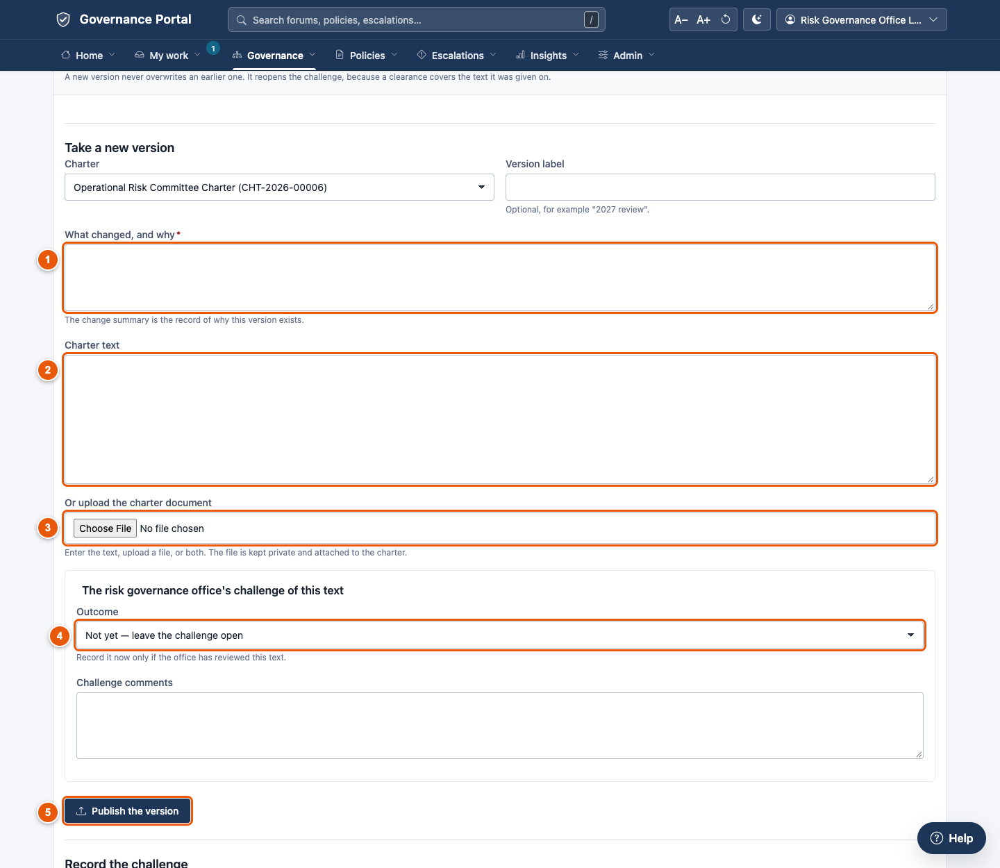

① **What changed, and why** (required).

② **Charter text**: type it here…

③ …or **upload the charter document**.

④ The governance office can record its challenge of this text at the same
time.

⑤ **Publish the version.** Earlier versions are kept. A new version reopens
the challenge.

**Recording the challenge (governance office):**

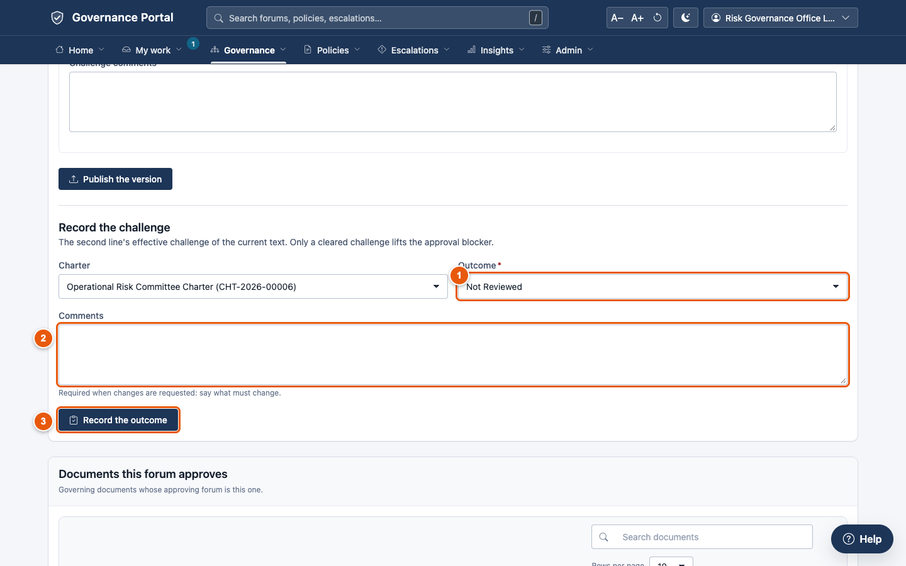

① **Outcome**: *Not Reviewed*, *Changes Requested* or *Cleared*.

② **Comments**. They're required when changes are requested: say what must
change.

③ **Record the outcome.**

A charter that isn't cleared holds things back. A formation request can't be
approved, and a forum can't be found *Compliant*. On a formation request, the
office records the challenge on the **Approval** tab:

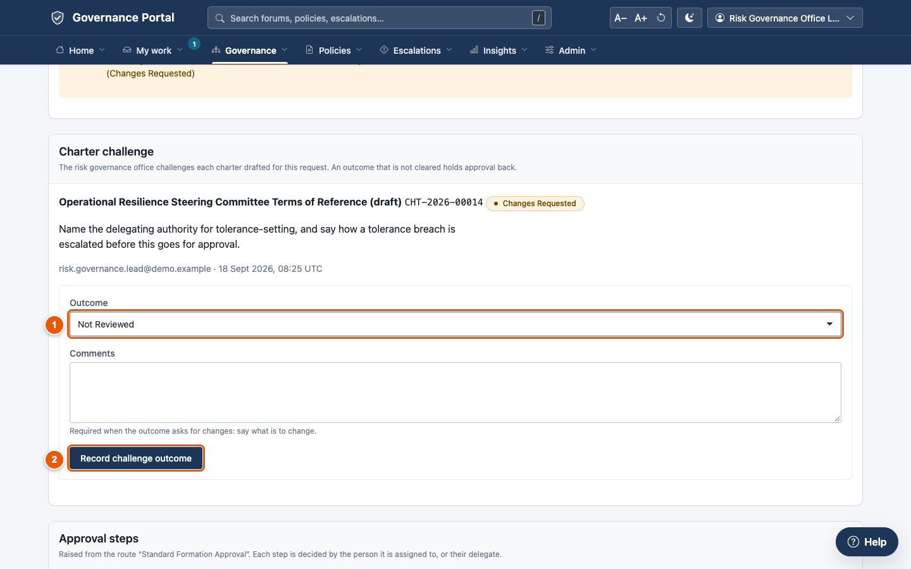

① The outcome.

② **Record challenge outcome.**

---

## 3.11 Disbanding a forum

A forum that is no longer needed is **disbanded**, never deleted. Its
records, membership history and decisions stay readable. A disbandment plan
is **In progress** until approved and executed, or **Refused** if an approver
rejects it.

### Raising a plan (governance office)

Open the forum and click **Disband this forum**.

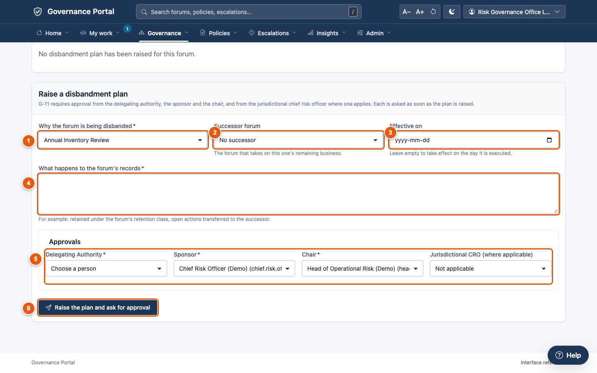

① **Why the forum is being disbanded**: *Annual Inventory Review*, *Self
Assessment*, *Charter Review*, *Mandate Complete* or *Other*.

② **Successor forum**: who takes on the remaining business, if anyone.

③ **Effective on**: leave empty to take effect when the plan is executed.

④ **What happens to the forum's records** (required).

⑤ **Approvals**: the delegating authority, the sponsor and the chair (filled
in where known), and a jurisdictional chief risk officer where one applies.

⑥ **Raise the plan and ask for approval.** Each approver is told.

### Deciding (approvers)

Approvers see **Disbandment: your decision is needed** on the forum's page,
and the approval in **My work**.

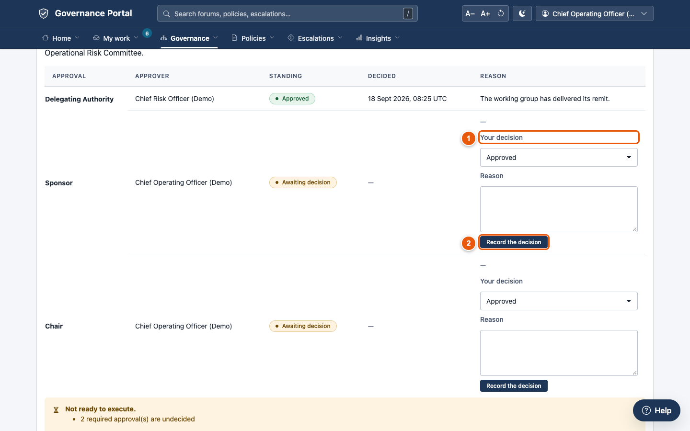

① **Your decision**: *Approved*, or *Rejected (with reason)*.

② **Record the decision.**

### Executing (governance office)

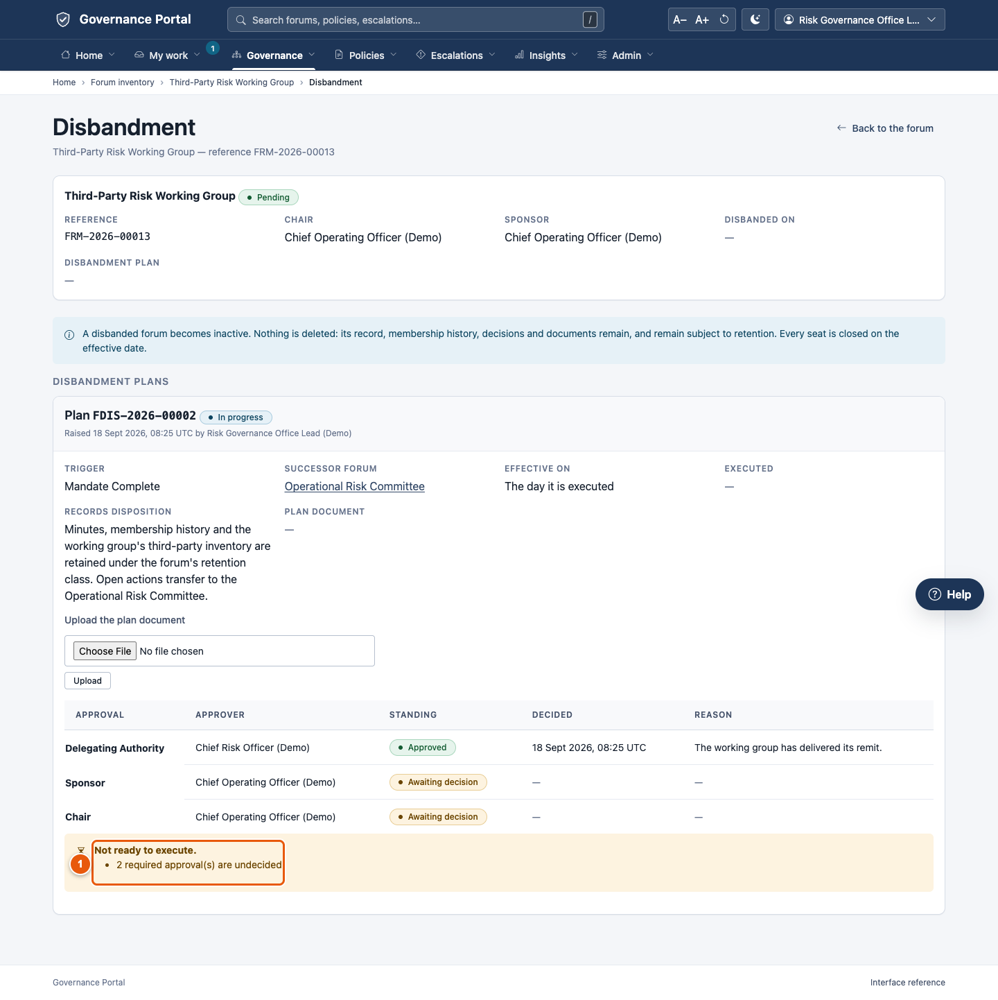

① **Not ready to execute** lists what's outstanding. When every approval is
in, tick **I understand the forum becomes inactive…** and click **Execute the
disbandment**. The forum becomes *Disbanded*, and every seat is closed on the
effective date.

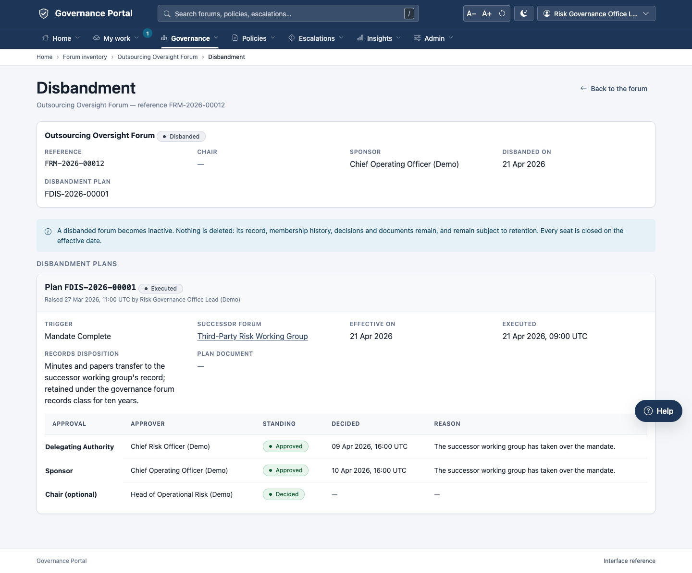

---

## Tips

- **Before a committee meets**, the secretary opens its **Escalations** tab
  for the matters it must consider, and its **Decisions** tab for open
  motions.
- **Bookmark Governance → Awaiting compliance review** if you're a compliance
  reviewer, and **Overdue reviews** if you're in the governance office.
- **Search the inventory before requesting a forum.** Duplication is the most
  common reason a request is returned.
