# 4. Compliance reviews, watched fields and disbandment

**Purpose.** A forum's **compliance standing** says whether the governance
office accepts it as properly constituted. This chapter covers how that
standing moves:

- by a **compliance review**;
- automatically, when a **watched field** changes;
- by the **annual review**, recorded from a dually-signed attestation;
- finally, by **disbandment**.

**The standings.**

| Standing | Meaning | Locked? |
|---|---|---|
| **Draft** | New (created by an approved request), or returned to its creator. Awaiting review. | No |
| **Pending** | Sent back for review, for example because a watched field changed. | **Yes**: nobody can edit the forum until it is reviewed. |
| **Compliant** | Reviewed and accepted. | No |
| **Non-Compliant** | Reviewed and not accepted. Awaiting a further review. | No |
| **Not Applicable** | Reviewed; the compliance standard does not apply to it. | No |
| **Disbanded** | Out of service. Final. | Yes |

**Who can do it.**

| To | You need |
|---|---|
| Record a compliance review | Compliance Reviewer |
| Configure watched fields | Consilium Administrator ([chapter 11](11-configuring-workflows.md), section 11.7) |
| Start an annual review, or open annual attestation campaigns | Risk Governance Office or Head of Risk Governance ([chapter 8](08-tasks-and-attestation.md)) |
| Record an annual review | Compliance Reviewer |
| Raise and execute a disbandment plan | Risk Governance Office |
| Decide a disbandment approval | The named approver (delegating authority, sponsor, chair, jurisdictional CRO) or their delegate |

---

## 4.1 Finding forums that need a review

Any of these routes finds them:

- **Inbox** → **Forums awaiting your compliance review**
  ([chapter 8](08-tasks-and-attestation.md));
- **Forums** → **Standing: Awaiting review**;
- the home page figure **Awaiting compliance review**;
- **Requests** → the card **Forums awaiting a compliance review** (governance
  office).

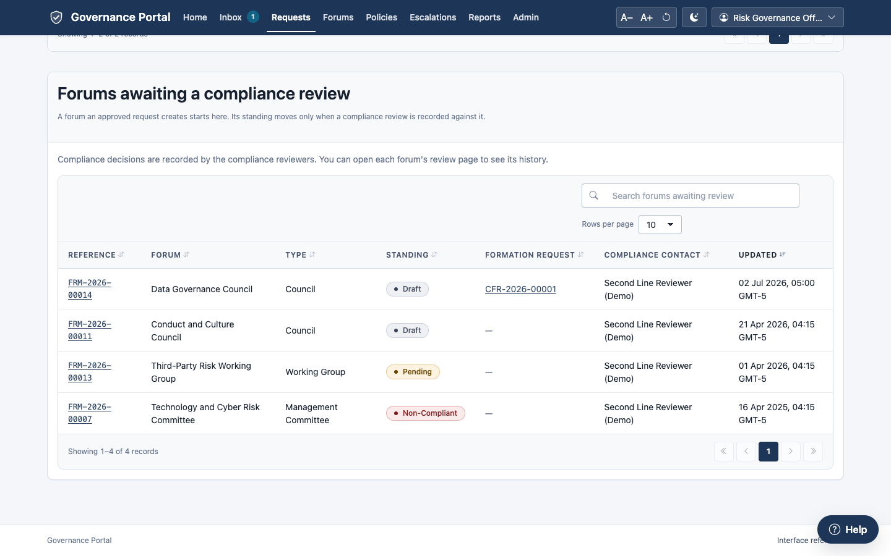

---

## 4.2 Recording a compliance review

1. Open the forum and click **Record a compliance review** (or click the forum
   in any of the lists above).
2. Read the summary: the forum's standing, owner, compliance contact,
   sponsor, next review, the formation request that created it, and its
   mandate.
3. Under **Decision\***, choose one. Each choice says where it leaves the
   forum:
   - **Compliant**: the forum becomes Compliant;
   - **Non-Compliant**: the forum becomes Non-Compliant (needs questions or
     comments);
   - **Not Applicable**: the forum becomes Not Applicable;
   - **Returned To Creator**: the forum becomes Draft (needs questions or
     comments).
4. Choose the **Kind of review**: **Initial** for the first review, or
   **Triggered By Change** after a watched field changed. The form preselects
   the likely one.
5. Write your **Comments**: the reason, as the owner and an auditor will read
   it.
6. For Non-Compliant or Returned To Creator, write the **Questions to the
   forum's creator**: what must be answered or fixed.
7. Click **Record the decision**.

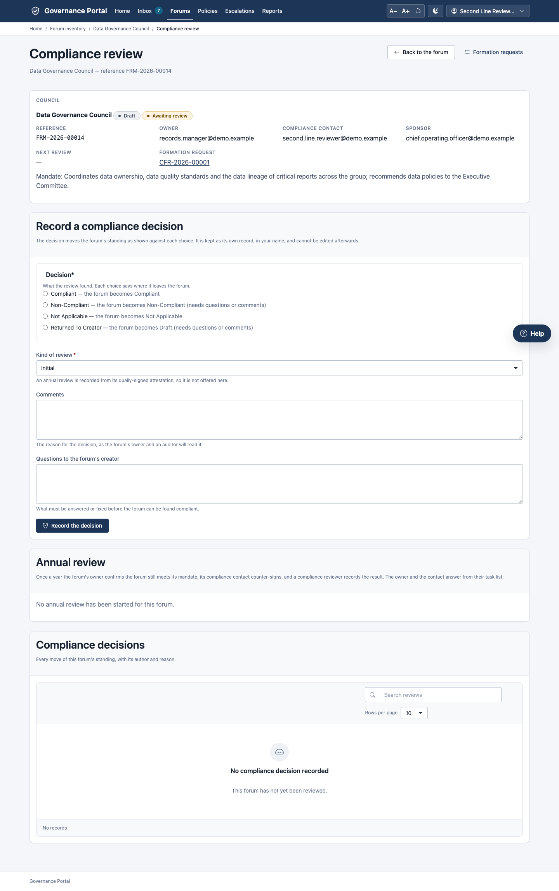

If something is missing, the form says so and records nothing:

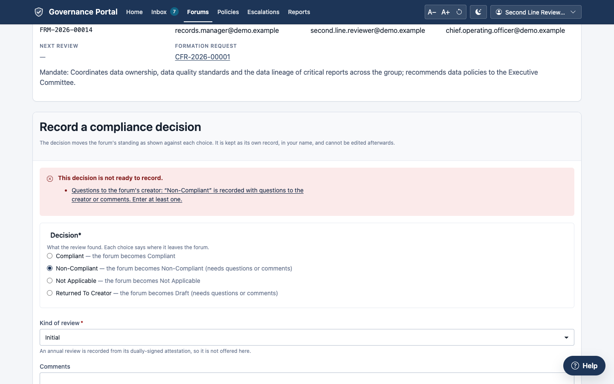

**What happens next.**

- The review is saved as its own record (FCR-…) in your name. **It cannot be
  edited afterwards.**
- The forum moves to the standing shown against your choice. Its flags follow:
  a Compliant or Not Applicable forum no longer shows **Awaiting review**.
- The compliance reviewers are notified.
- The review appears on the forum's **History** tab.

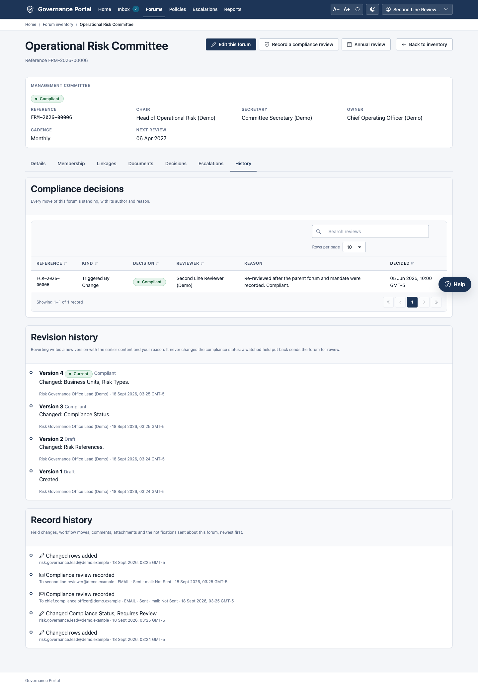

A disbanded forum cannot be reviewed:

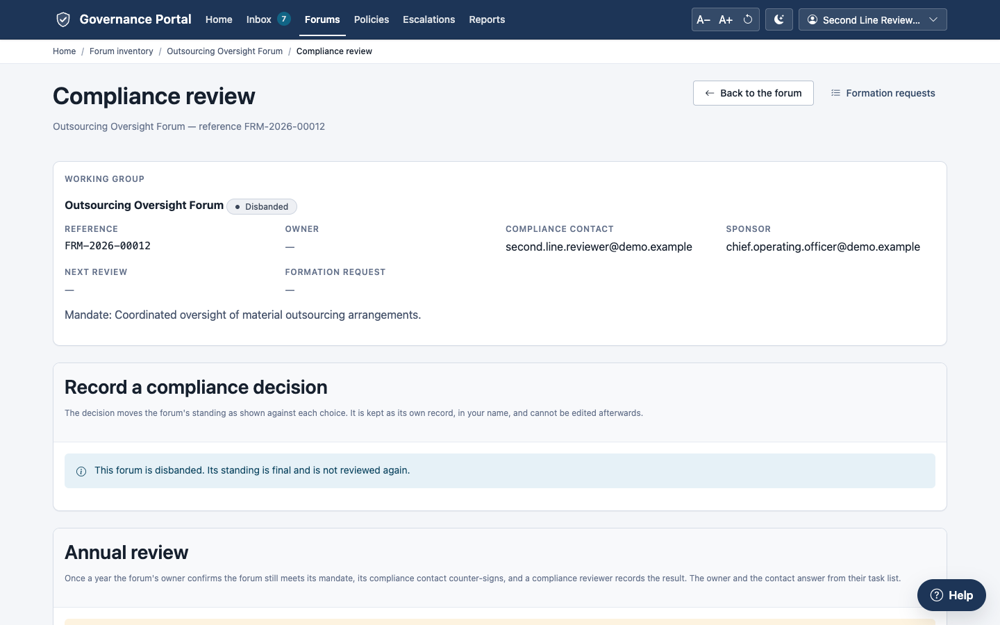

> **Note.** An **Annual** review is not offered in this form. It is recorded
> from the dually-signed annual attestation, in the **Annual review** panel on
> the same page (section 4.4).

---

## 4.3 Watched fields: automatic re-review

Some changes to a forum are material enough that its compliance standing must
be looked at again. These fields are **watched**. By default they are:

- forum type;
- mandate;
- committee chair;
- primary risk category;
- parent forum;
- regulatory required;
- owning operating group.

**When someone saves a change to a watched field:**

1. The forum's standing becomes **Pending**, and it is **locked** until a
   review is recorded.
2. A to-do is raised: "Forum … needs compliance re-review: … changed".
3. Every Compliance Reviewer is notified: "Forum returned for compliance
   review".
4. The forum appears under **Awaiting review**.

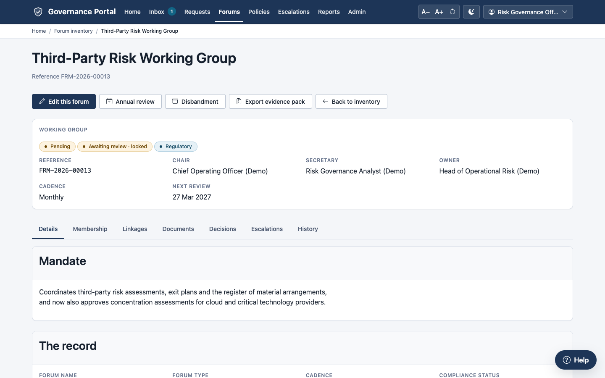

The list of watched fields, and what happens when one changes, is
configuration. It is not fixed. See [chapter 11, section 11.7](11-configuring-workflows.md).

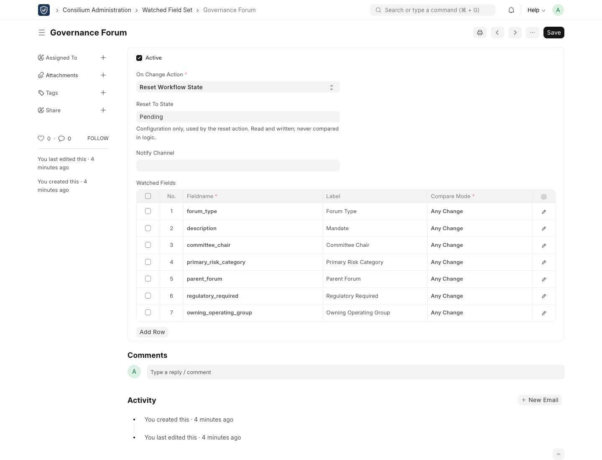

> **Known limitation.** A change of chair made by changing the *membership
> seat*, rather than the forum's own record, does not trigger a re-review.
> If the chair changes, ask a Compliance Reviewer to review the forum.

---

## 4.4 Annual review and attestation

Once a year, each forum's **owner** confirms that the forum still meets its
mandate. Its **compliance contact** counter-signs, and a **Compliance
Reviewer** records the result as the forum's **Annual** review. It runs as a
dual-signature attestation. It can be started for one forum from its review
page, or for every forum at once as a campaign
([chapter 8](08-tasks-and-attestation.md)).

| Campaign | Who is asked | Signatures |
|---|---|---|
| **Forum inventory attestation** | Every open seat whose role attests: chairs, secretaries, forum owners | One |
| **Forum owner and compliance review** | Each forum's owner, counter-signed by its compliance contact | Two (dual signature) |

**The Annual review panel.** Open the forum and click **Annual review** (or
open **Record a compliance review**). The **Annual review** card lists each
annual review task with:

- its due date;
- the **Owner's response** and the **Compliance counter-signature** (each
  **Signed** with its date, or **Awaiting**);
- the **Recorded review**.

A task signed by both shows **Ready to record**. One that was never answered
shows **Lapsed unanswered**.

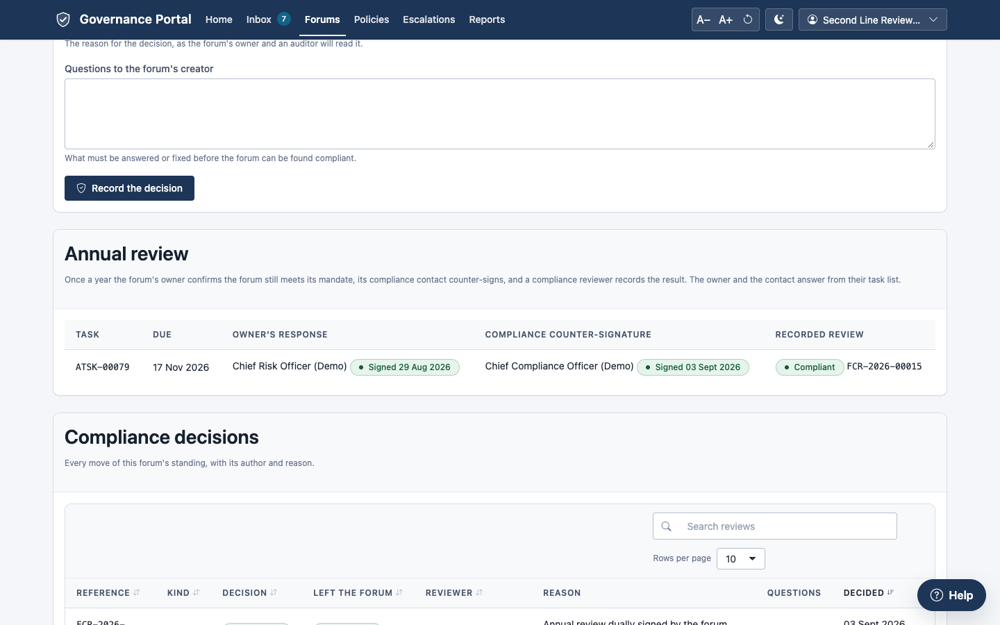

**Starting the annual review for one forum** (Risk Governance Office, Head of
Risk Governance, or a campaign administrator):

1. Under **Start the annual review**, set **Due on\*** (30 days ahead by
   default) and, optionally, the **Period** (left blank, it is the forum and
   the year).
2. Click **Start the review**. "The owner and the compliance contact have been
   asked."

It is refused while another annual review of the forum is under way. It also
cannot start until the forum has a forum owner and a compliance contact, who
must be different people; the panel says which is missing.

**Answering** (the owner, then the compliance contact): each answers the task
in their **Inbox** ([chapter 8](08-tasks-and-attestation.md), sections 8.2 and
8.3). The owner chooses **Attest**, **Attest with exceptions** or **Cannot
attest**; the compliance contact counter-signs.

**Recording the annual review** (Compliance Reviewer):

1. Under **Record the annual review**, choose the **Signed task**. Only tasks
   signed by both are listed.
2. Choose the **Decision\***. Each option says where it leaves the forum:
   **Compliant**, **Non-Compliant**, **Not Applicable**, or **Returned To
   Creator** (the forum becomes Draft).
3. Write **Comments**. They are required for a decision that sends the forum
   back.
4. Click **Record the annual review**. "Review FCR-… recorded."

**What happens next.** An **Annual** compliance review is recorded in your
name. The forum moves to the standing you chose, and its **next review date**
becomes a year from today. **Compliant** is refused while the forum's charter
challenge is still open ([chapter 5](05-meetings-votes-charters.md), section
5.5).

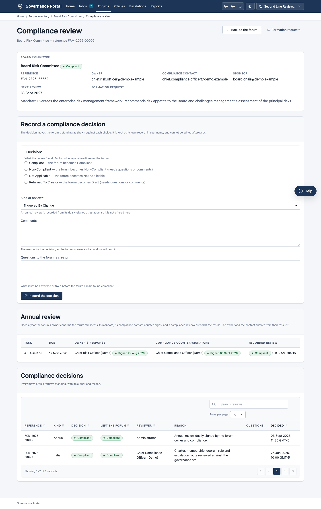

---

## 4.5 Disbanding a forum

A forum that is no longer needed is **disbanded**, never deleted. Its record,
membership history, decisions and documents remain, and remain subject to
retention. Every seat is closed on the effective date.

A **disbandment plan** goes through these stages:

- **In progress**: raised; approvals awaited;
- **Executed**: the forum is disbanded;
- **Refused**: an approver rejected it. The refused plan stays on the record,
  and a new plan may be raised.

### Raising a disbandment plan (Risk Governance Office)

1. Open the forum and click **Disband this forum**. The **Disbandment** page
   opens.
2. Under **Raise a disbandment plan**, fill in:
   - **Why the forum is being disbanded\***: *Annual Inventory Review*,
     *Self Assessment*, *Charter Review*, *Mandate Complete* or *Other*;
   - **Successor forum**: the forum that takes on the remaining business, or
     *No successor*;
   - **Effective on**: leave empty to take effect on the day the plan is
     executed;
   - **What happens to the forum's records\***, for example "retained under the
     forum's retention class, open actions transferred to the successor";
   - **Approvals**: the **Delegating Authority\***, **Sponsor\*** and
     **Chair\*** (filled in from the forum where known), and the
     **Jurisdictional CRO** where one applies.
3. Click **Raise the plan and ask for approval**. "Plan raised. Each approver
   has been asked for their decision."
4. Optionally, attach the plan document with **Upload the plan document**
   (until the plan is executed).

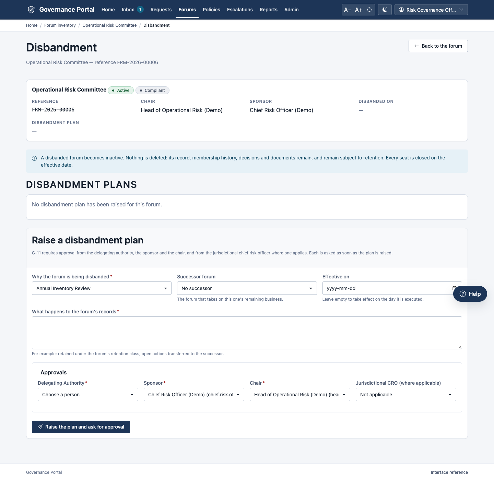

A plan is refused if the forum is already inactive, if another plan for it is
in progress, if the records note is empty, or if an approver is missing or is
not an active person.

### Deciding a disbandment approval (approvers)

Each approver is told "Forum disbandment awaits your approval". The forum's
page then shows them **Disbandment: your decision is needed**. So can someone
holding their live delegation. No governance role is needed.

1. Open the **Disbandment** page. Under **Your decision**, choose **Approved**
   or **Rejected (with reason)**.
2. Give a **Reason**. It is required for a rejection.
3. Click **Record the decision**.

Each approval row then shows **Awaiting decision**, **Approved** or
**Rejected**.

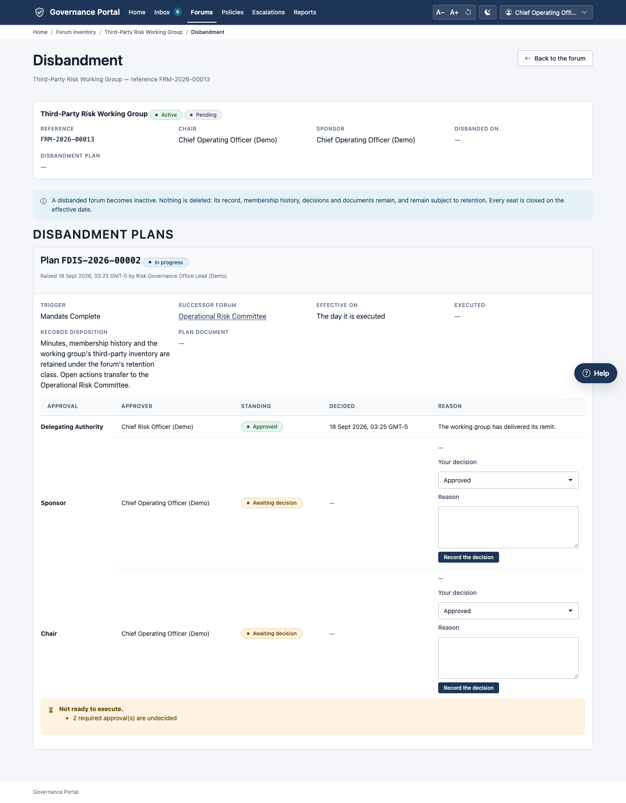

### Executing the plan (Risk Governance Office)

The plan's panel says **Not ready to execute.** and lists what is outstanding
(for example "1 required approval(s) are undecided"), until every required
approval is given. It then says "Every required approval is given. The plan can
be executed."

1. Tick **I understand the forum becomes inactive and every seat on it is
   closed. This is not undone from here.**
2. Click **Execute the disbandment**. "The forum is disbanded with effect from
   … N seat(s) closed."

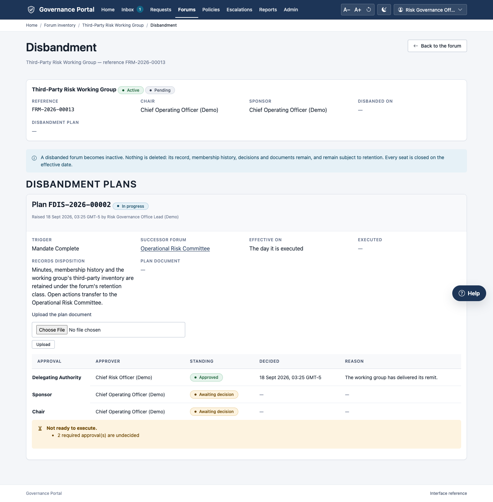

**What happens next.** The forum:

- becomes **Disbanded** and inactive, with its **Disbanded on** date and the
  plan's reference on its record;
- has every open seat closed with the reason "Forum Disbanded".

A disbandment notification is sent.

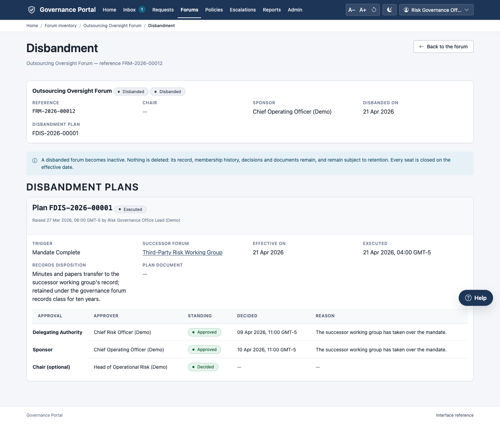

The plan record can also be read in the workspace:

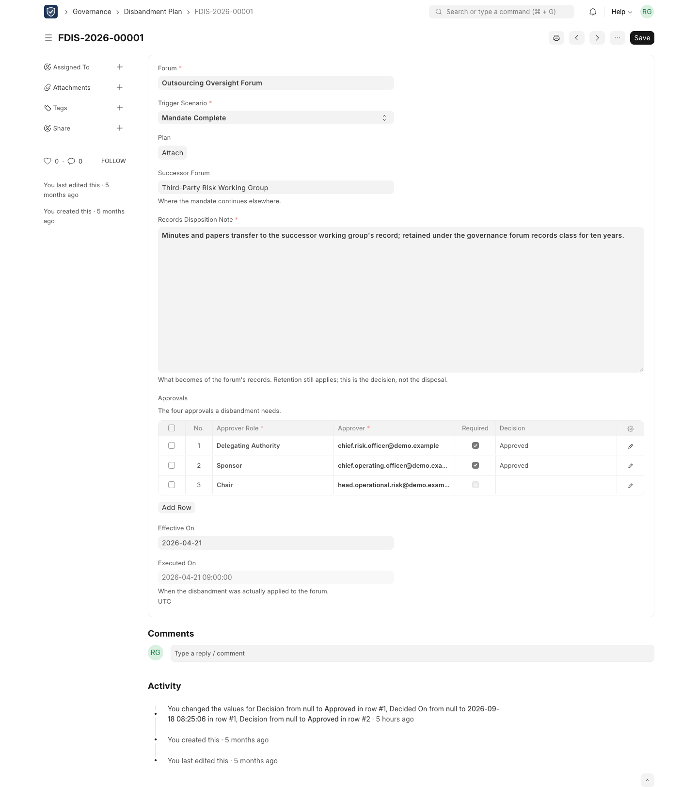

---

## Common errors

| Message | What it means | What to do |
|---|---|---|
| "… may not record a compliance review on forum …. Compliance decisions belong to the Compliance Reviewer role." | You do not hold Compliance Reviewer. | Ask a Compliance Reviewer. |
| "Forum … is disbanded. Its standing is final and is not reviewed again." | Disbanded forums are not reviewed. | None. |
| "A … review is recorded from its dually-signed attestation, not from here." | The ordinary review form does not record annual reviews. | Use the **Annual review** panel (section 4.4). |
| "… is not dually signed. The annual review needs both the forum owner's response and the compliance counter-signature." | The task is not signed by both. | Wait for the counter-signature. |
| "The annual review cannot be started until the forum has a forum owner … / a compliance contact …" | A signatory is missing. | Complete the forum's record. |
| "This decision cannot be recorded without written questions or comments." | Non-Compliant and Returned To Creator need an explanation. | Write questions or comments. |
| "Forum … is not editable while it is under compliance review." | The forum is Pending. | Record the review first. |
| "N required approval(s) are undecided" (Not ready to execute) | Not every approval is in. | Chase the approvers; their names are on the plan. |
| "… already has disbandment plan … in progress." | Only one live plan per forum. | Finish or refuse the existing plan. |
| "G-11 requires approval from the delegating authority, the sponsor and the chair. Missing: …" | An approver was not chosen. | Choose them. |
| "A forum cannot succeed itself." | The successor is the forum being disbanded. | Choose another forum, or none. |
| "A disbandment plan names the approvals it requires." | The approvals are missing. | Choose the approvers. |

## Tips

- **Write comments for the auditor.** A review cannot be edited later, and its
  comments are the permanent record of why the forum stands where it does.
- **Check the Escalations tab before disbanding.** Open matters routed to the
  forum need a new destination, usually the successor forum.
- **Watched fields are yours to choose.** If your organisation considers a
  change of cadence material, add *cadence* to the list (chapter 11).
