# 4. Policies

The **Policies** area holds every framework, policy, standard, procedure and
guideline (the platform calls them all **policies** or **documents**)
through its whole life:

- requesting a new policy or a change, and deciding whether it's major or
  minor;
- drafting, with every version kept;
- review and approval, in the right order;
- publication to the right audience;
- periodic review, horizon scanning and attestation;
- monitoring and violations;
- finally, retirement.

**The lifecycle**

| Stage | What it means | Who moves it on |
|---|---|---|
| **Draft** | Being written; open for editing | Policy owner: **Submit for Review** |
| **Review** | Being reviewed and approved | Policy reviewer: **Return to Drafting**. Policy office: **Record Approval**, once every approval is in |
| **Approved** | Approved, not yet published | Policy office: **Publish**, or **Return to Drafting** |
| **Published** | In force and sent to its audience | Policy owner: **Confirm Implementation**, or **Reopen for Change**. Policy office: **Retire** |
| **Implemented** | In force, implementation confirmed | Policy owner: **Reopen for Change**. Policy office: **Retire** |
| **Retired** | No longer in force, kept on record | Policy office: **Reinstate** |

Your organisation may add stages of its own, such as a legal review
([chapter 9](09-administration.md)).

**In this chapter**

- 4.1 The policy library
- 4.2 A policy's page, tab by tab
- 4.3 Moving a policy on
- 4.4 Approvals, in order
- 4.5 When a rule stops you: exceptions
- 4.6 Versions, the viewer and Doc AI
- 4.7 Publishing
- 4.8 Correcting details and assessing impact
- 4.9 Requesting a new policy or a change
- 4.10 Reviews, horizon scanning and attestation campaigns
- 4.11 Monitoring and violations
- 4.12 Regulatory updates and horizon scanning

---

## 4.1 The policy library

Open **Policies → Policy library**.

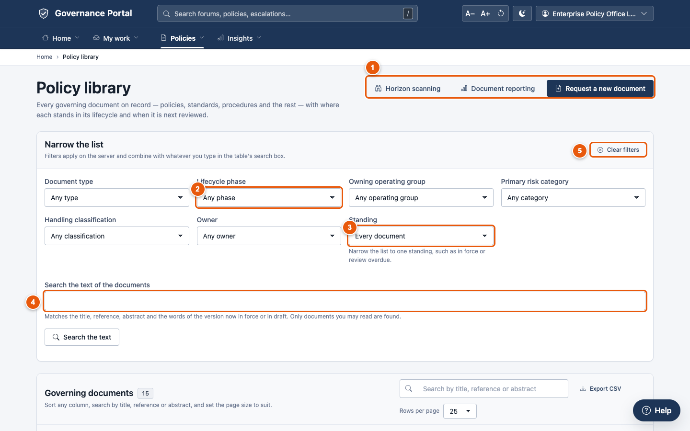

① **Page buttons:**
- **Horizon scanning** opens your horizon-scanning service;
- **New document (Advanced view)** creates a policy directly (administrators
  only; everyone else uses **Request a new document**);
- **Document reporting** opens the policy figures in Insights;
- **Request a new document** starts a formal request (section 4.9).

② **Lifecycle phase**: Draft, Review, Approved, Published, Implemented or
Retired.

③ **Standing** gives ready-made views: *Every document*, *In force*, *Open for
editing*, *Awaiting review*, *Review overdue*, *Review due within 90 days*, *No
review date set*, *Regulatory-required* and *Training required*.

④ **Search the text of the documents** looks inside the policies themselves
(their title, reference, summary and the words of the current version), not
just their names. Click **Search the text**.

⑤ **Clear filters** starts again.

Other filters narrow by type, owning group, risk category, handling (public,
internal, confidential, restricted) and owner.

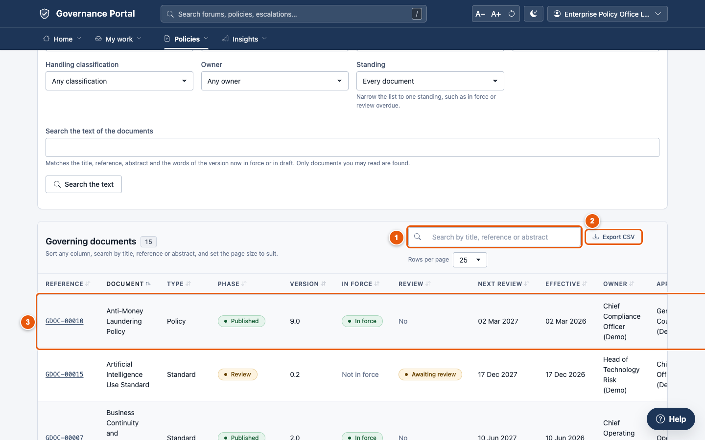

① **Search** by title, reference or summary.

② **Export CSV** downloads the list.

③ **Click a policy** to open it.

**Approvers** see a **Waiting on your decision** card at the top of the
library:

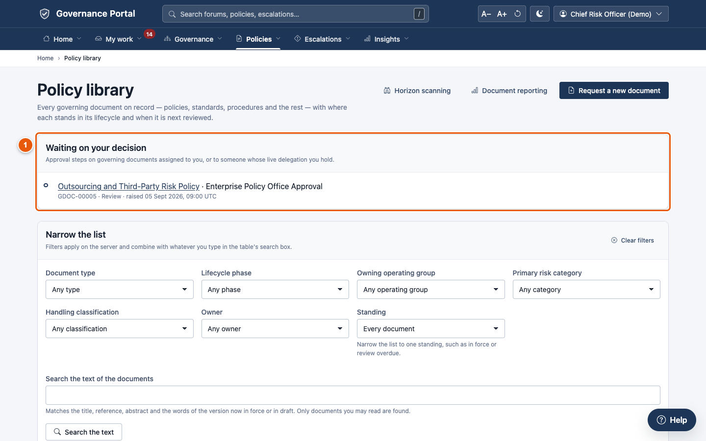

① Each policy approval waiting on you. Click it to decide.

**Confidential and restricted policies** are visible only to the policy office,
auditors, the people named on the policy and the audiences it was published
to.

---

## 4.2 A policy's page, tab by tab

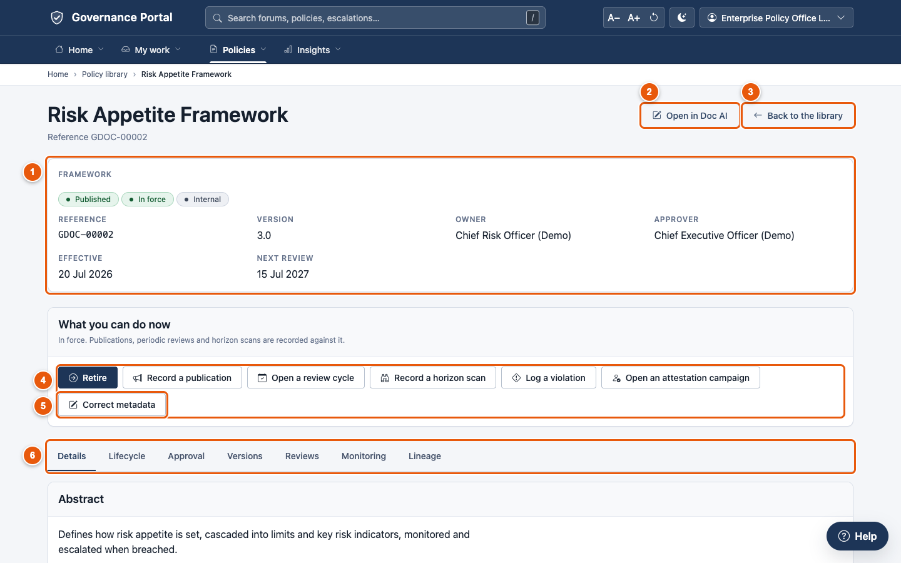

① **The summary**: the type, the stage and labels such as **In force**,
**Awaiting review**, **Open for editing**, **Review overdue**, **Regulatory** and
the handling. It also gives the reference, version, owner, approver, effective
date and next review date.

② **Open in Doc AI** opens the policy in your organisation's document editor
(section 4.6).

③ **Back to the library.**

④ **What you can do now**: the dark buttons move the policy through its
lifecycle; the light ones are shortcuts, such as **Record a publication**,
**Open a review cycle**, **Record a horizon scan**, **Log a violation** and
**Open an attestation campaign**. You see only what your role may do.

⑤ **Correct metadata** fixes a wrong detail without a new version (section
4.8).

⑥ **The tabs**, explained below.

Auditors also see **Export evidence pack**: the policy, its history, approvals
and attachments in one file. Administrators also see **Advanced view**, which
opens the full record in the configuration screens.

### Details

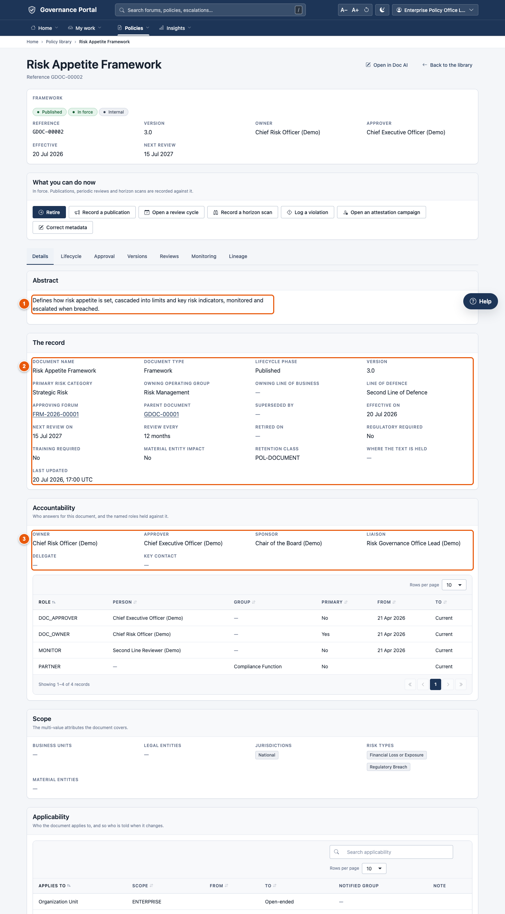

① **Abstract**: what the policy is about.

② **The record**: every detail, from its type and stage to its approving
forum, parent document, review frequency and retention.

③ **Accountability**: owner, approver, sponsor, liaison, delegate, key
contacts and monitors.

Further down are its scope, handling (classification, and whether download,
printing and sharing are allowed), regulatory references, the definitions in
force for it, the **Correct metadata** card and the **Impact** panel.

### Lifecycle

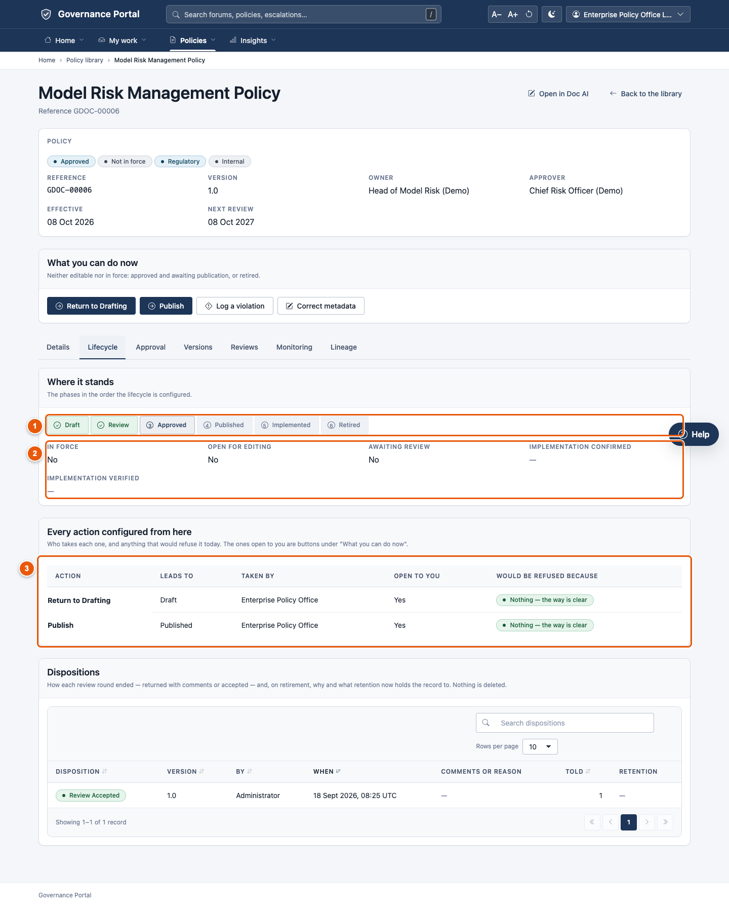

① **Where it stands**: the stages in order, with the current one marked.

② **Its labels**: in force, open for editing, awaiting review, and whether
implementation is confirmed.

③ **Every action from here**: who takes each one, whether it's open to you,
and **what would stop it today**. Read this before you act.

### Approval

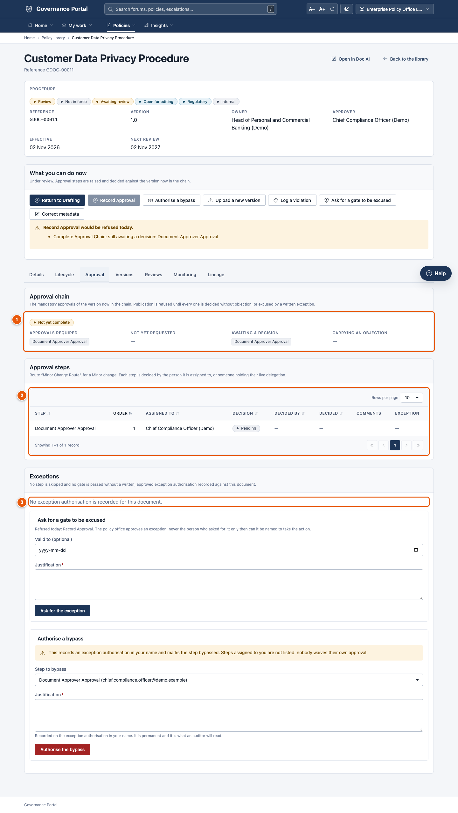

① **Approval chain**: complete or not.

② **Approval steps** for the current version: each step, its order, who it's
with and their decision.

③ **Exceptions**: any written permission to pass a rule (section 4.5).

### Versions

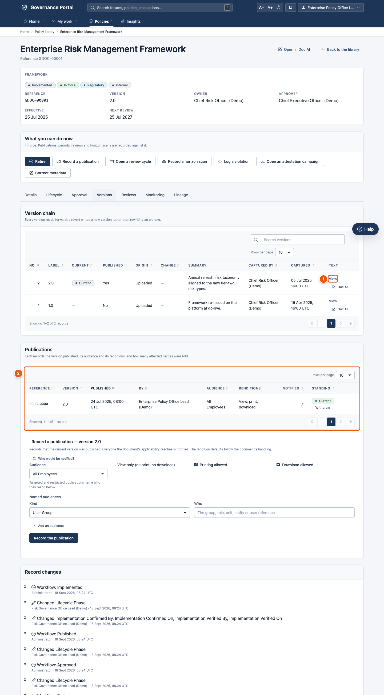

① **View** opens a version in the document viewer (section 4.6).

② **Publications**: each time the policy was published, to whom, and how
many people were told.

At the foot of the tab, **Record changes** lists every change to the policy's
details, for the policy office and administrators.

The upload, revert and publish forms are also on this tab (sections 4.6 and
4.7).

### Reviews

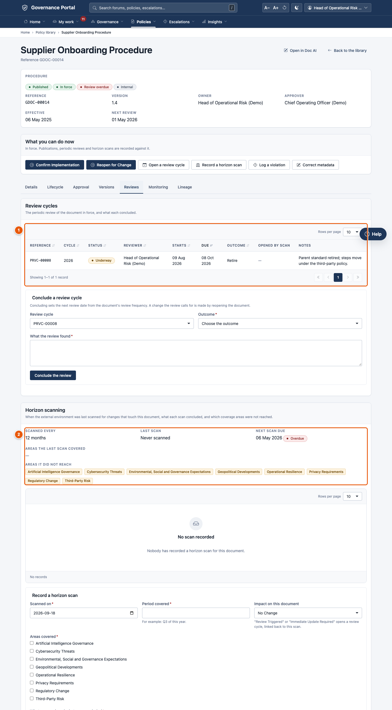

① **Review cycles**: each periodic review, its reviewer, dates and outcome.

② **Horizon scanning**: when the outside world was last scanned for changes
affecting this policy, and when the next scan is due.

### Monitoring

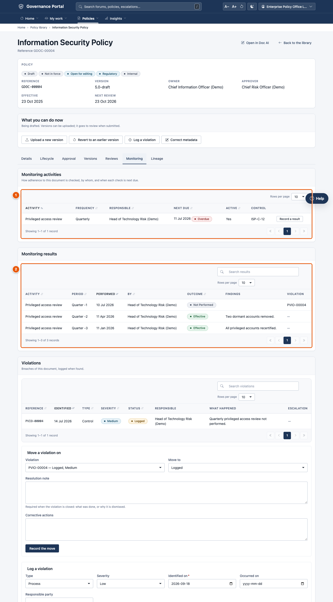

① **Monitoring activities**: the checks that the policy is working, how often
they run, and when each is next due.

② **Monitoring results**: what each check found.

Violations are listed here too (section 4.11).

### Lineage

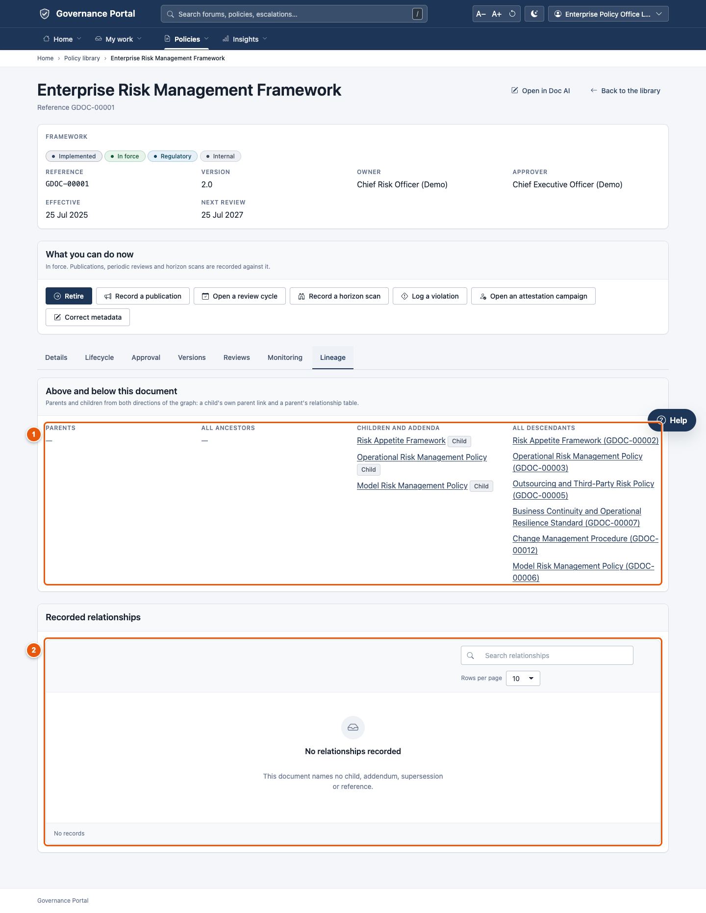

① **Above and below**: the policy's parent, and the standards and procedures
beneath it.

② **Relationships**: other links, such as documents it supersedes.

---

## 4.3 Moving a policy on

1. Under **What you can do now**, click the action, for example **Submit for
   Review** or **Publish**.

   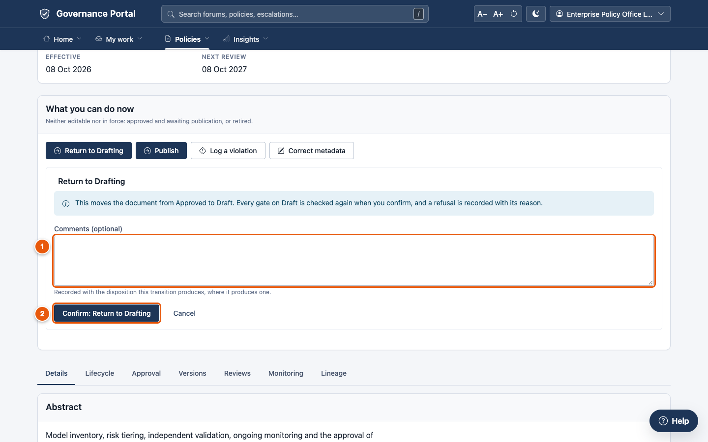

2. A panel explains the move and says that every rule is checked again when
   you confirm. ① Add comments if you wish.
3. ② Click **Confirm: …** (or **Cancel**).

**When a rule would stop the move**, the button is greyed out and the card says
why before you try:

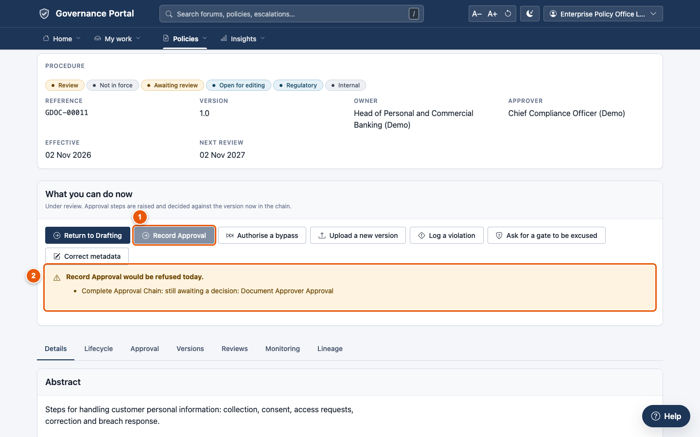

① **Record Approval**, greyed out.

② Why: here, the approval chain isn't complete (an approval step is still
waiting).

The rules your organisation has set (for example "complete approvals before
approval or publication", "record the publication before confirming
implementation") are checked every time. If a move truly needs to go ahead,
ask for an exception (section 4.5).

> **Publish, then record the publication.** **Publish** changes the stage.
> **Record a publication** tells the audience (section 4.7).

---

## 4.4 Approvals, in order

Approvals are given **against a version**. The approvers come from your
organisation's approval route, chosen by the policy's type, the size of the
change (major or minor), its risk category and its handling.

**Raising the steps** (policy owner or policy office, while the policy is in
review): on the **Approval** tab, click **Raise approval steps**. Each approver
is told, and the step appears in their **My work**.

**Deciding your step:**

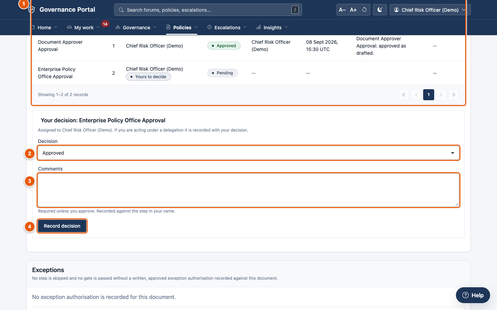

① **The steps**, in order. Yours is marked.

② Choose your **Decision**: *Approved*, *Rejected* or *Changes Requested*.

③ Give a **Reason**. It's required unless you approve.

④ Click **Record decision**. The owner is told.

- **Steps are taken in order.** A sequential step can be decided only after the
  steps before it.
- **Changes Requested** leaves the step open. **Rejected** blocks publication.
- **A new version restarts the approvals.** Raise the steps again for it.

**Bypassing a step** (policy office): when a step can't be decided normally,
use **Authorise a bypass**:

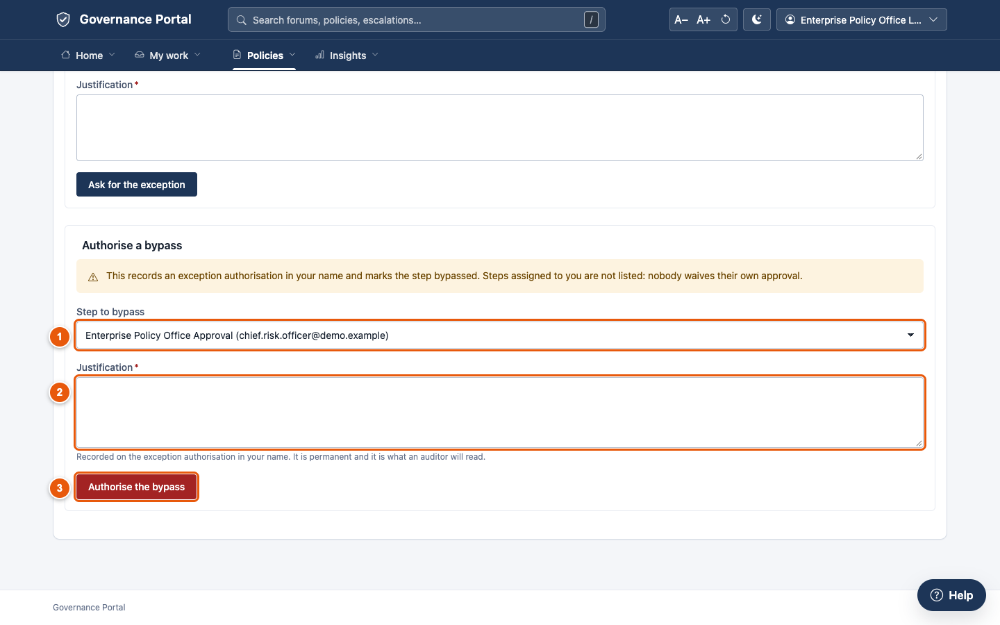

① Choose the **Step to bypass**.

② Write the **Justification**. It's kept in your name for auditors.

③ Click **Authorise the bypass**. You can't bypass a step that is yours.

---

## 4.5 When a rule stops you: exceptions

A move a rule refuses can still go ahead with a **written, approved
exception**. The person asking and the person approving must be different.

1. **Ask** (policy owner or policy office): on the **Approval** tab, under
   **Exceptions**:

   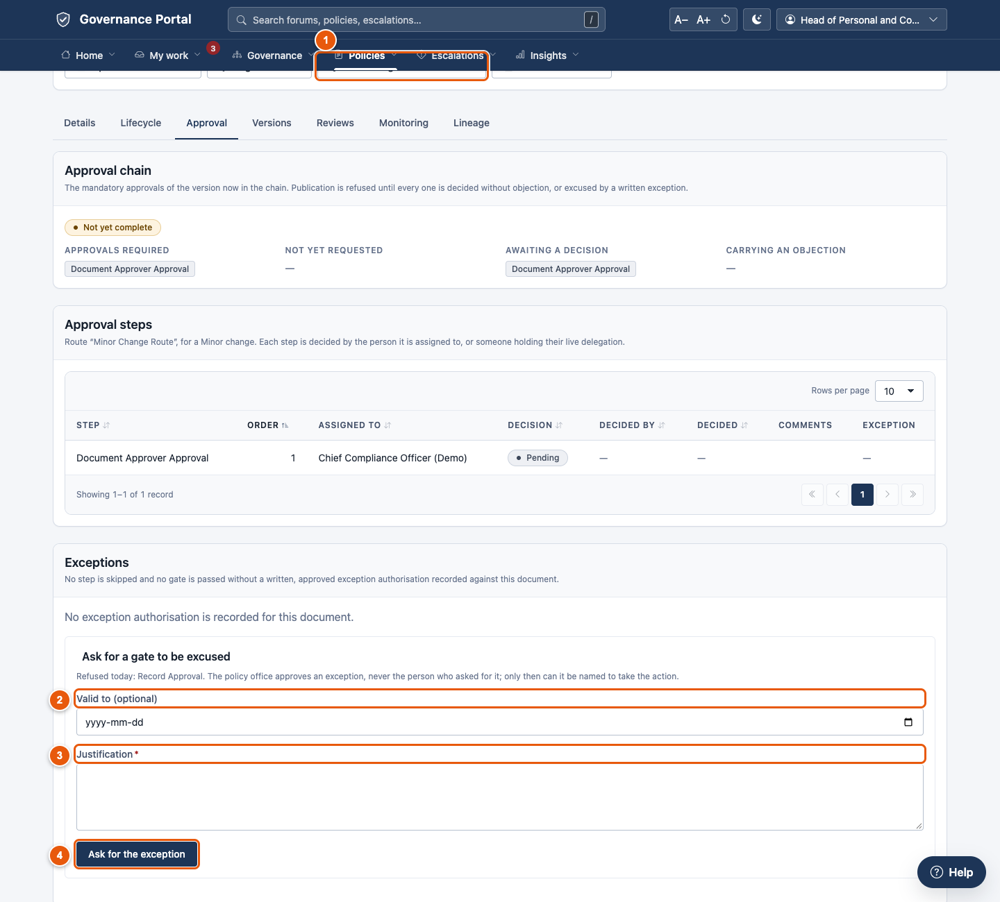

   ① **Ask for a gate to be excused** says what is refused today.

   ② **Valid to** (optional): when the exception ends.

   ③ **Justification**: why it should go ahead.

   ④ **Ask for the exception.** "Exception requested; the policy office
   approves it."

2. **Approve** (policy office, never the person who asked): under **Waiting for
   approval**, click **Approve this exception**. The requester is told.
3. **Use it:** the action's card now says an approved exception is recorded.
   In the confirmation panel, choose it under **Exception authorisation that
   excuses the refusal**, and confirm.

---

## 4.6 Versions, the viewer and Doc AI

Every version is kept. New text is added as a new version, never written over
the old.

**Uploading a new version** (policy owner or policy office, while the policy is
in Draft or Review), on the **Versions** tab:

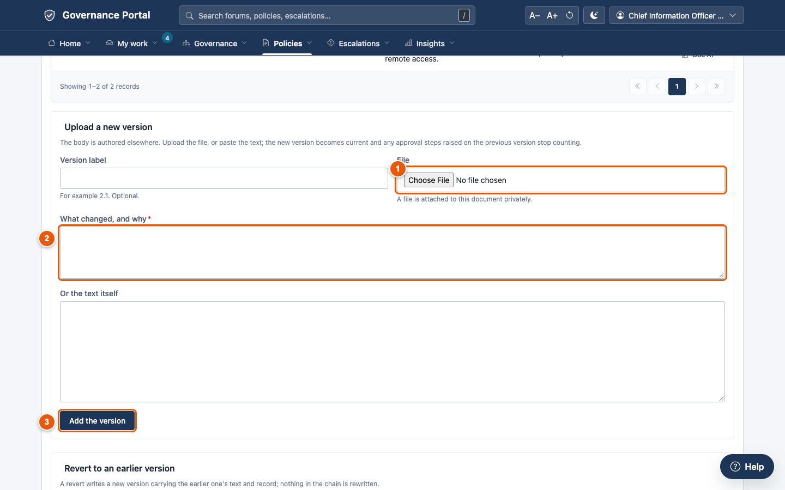

① Choose a **File**, or type the text itself further down.

② Write **What changed, and why** (required).

③ Click **Add the version**. An optional version label (for example "2.1") can
be given too.

**Going back to an earlier version:**

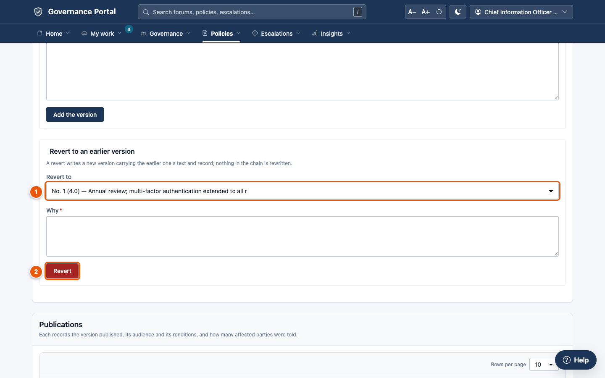

① Choose the version.

② Click **Revert**. This adds a new version carrying the old text. Nothing is
rewritten.

**The document viewer.** Click **View** on a version.

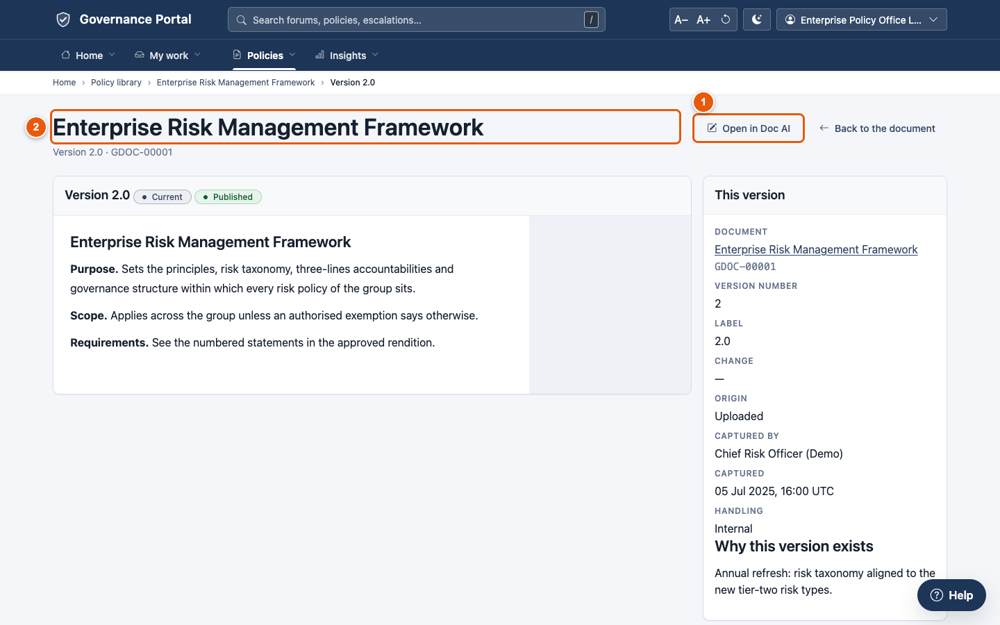

① **Open in Doc AI** hands the document to your organisation's document editor.

② The document, with its version details, the other versions, and the
meaning of glossary terms used in it.

**Confidential and restricted policies** are view-only: download and printing
aren't offered. Restricted ones carry a watermark with your name and the time,
and every view is recorded.

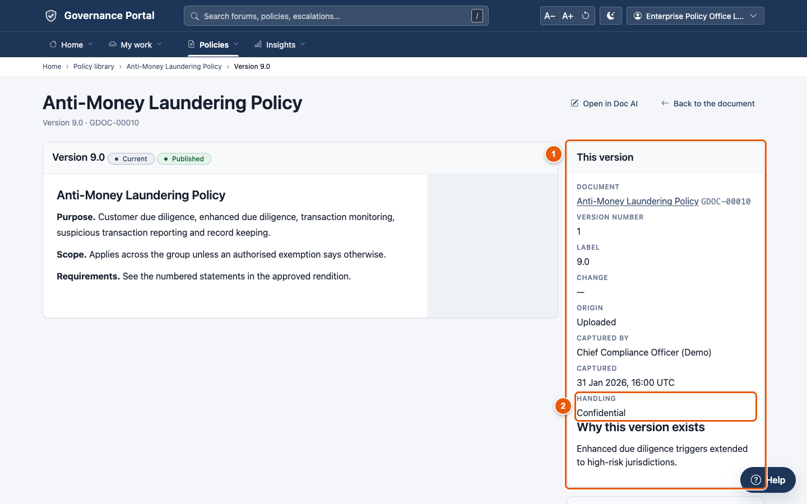

① **This version**: its details and why it exists.

② **Handling**: the classification.

**Doc AI.** **Open in Doc AI** appears on every policy, every version row and in
the viewer. It opens the document in your organisation's rich document editor.
Only the document's reference and title are passed, never its text. Until
your administrator connects Doc AI, the button explains that:

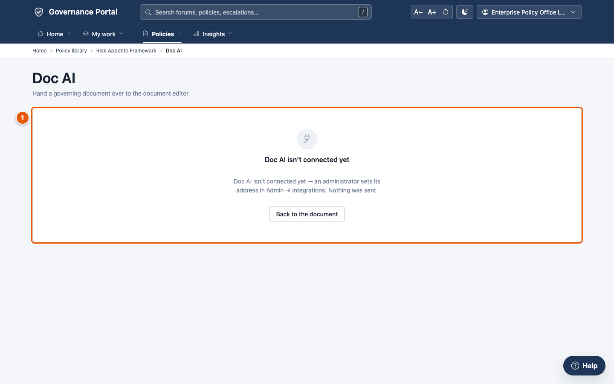

① The friendly message, with a way back to the document.

---

## 4.7 Publishing

After **Publish**, the policy office records the publication. This is what
tells the audience. On the **Versions** tab:

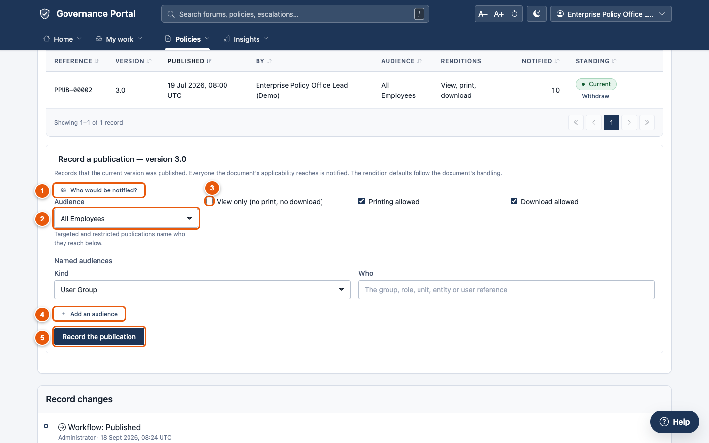

① **Who would be notified?** previews the audience: how many people, and any
exemptions.

② **Audience**: *All Employees*, *Restricted* or *Targeted Groups*.

③ **Rendition**: view only, printing allowed, download allowed.

④ **Add an audience** names a group, role, organisation unit, legal entity or
person.

⑤ **Record the publication.** Everyone in the audience is told, except those
with an approved exemption. A publication can later be **Withdrawn**.

---

## 4.8 Correcting details and assessing impact

### Correcting a wrong or missing detail

**Correct metadata** fixes a detail (for example a mistyped owner or a missing
risk category) **at any stage**, even on a published policy, without a new
version and without going back through approval.

**Who:** the policy owner or the policy office.

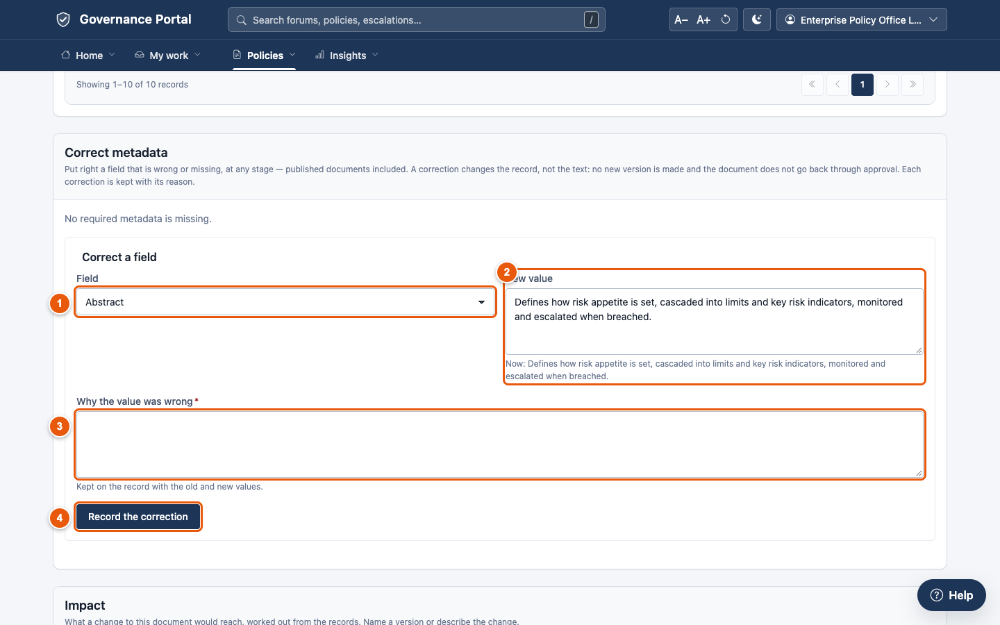

① **Field**: missing details are listed first, marked *(missing)*.

② **New value**: the current value is shown beneath.

③ **Why the value was wrong** (required).

④ **Record the correction.** "Correction recorded; no new version was made."
Earlier corrections are listed with their reasons.

### Assessing the impact of a change

The **Impact** panel, at the foot of the **Details** tab, shows what a change
would reach.

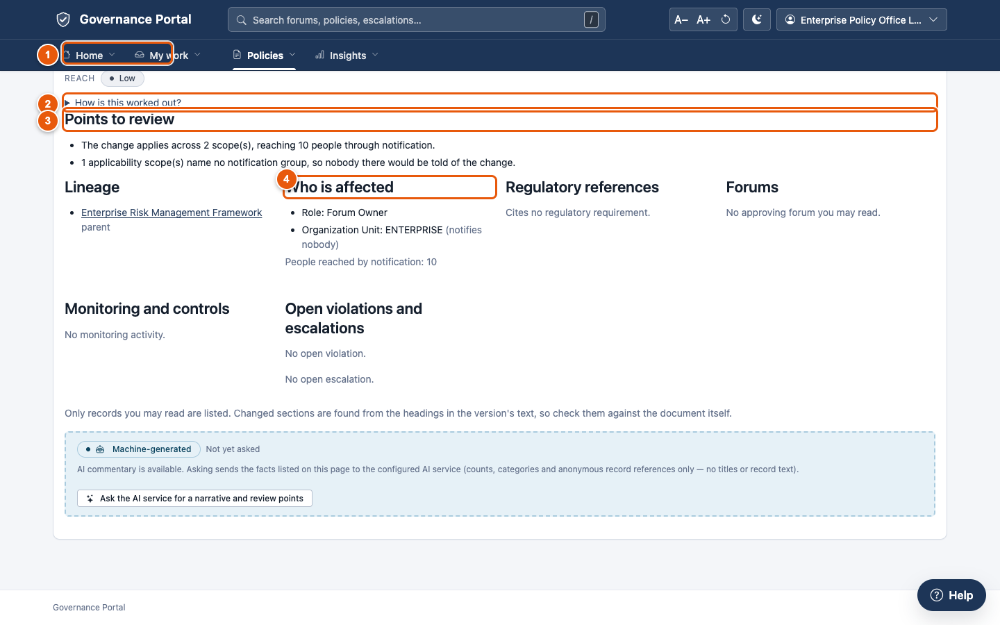

① Choose a proposed version or describe the change, then click **Assess the
impact**. The result shows its **reach** (low, medium or high).

② **How is this worked out?** opens the explanation of the reach score, if you
want it.

③ **Points to review**: what to check, worked out from the records.

④ **Who is affected**, with the regulations, forums, monitoring, open
violations and escalations linked to it.

If your organisation has switched on AI, **Ask the AI service for a narrative
and review points** adds a commentary, clearly labelled *Machine-generated*.

---

## 4.9 Requesting a new policy or a change

Every new policy, and every change to or retirement of one, can start as a
**request**. A few questions decide whether the change is **major** or
**minor**, which then decides who approves it and how long it may take.

1. Open **Policies → Request a policy or change**.

   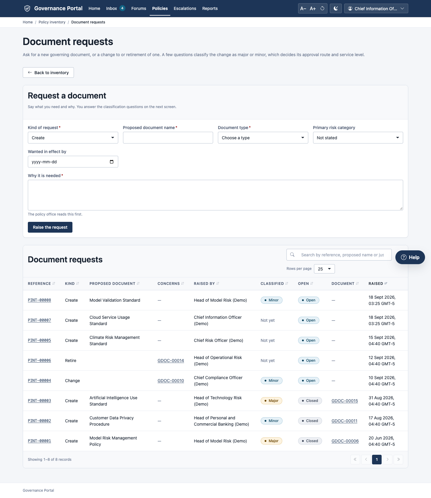

2. ① Choose the **Kind of request**: *Create*, *Change* or *Retire*. Then give
   the proposed name and type, or choose the policy it concerns.
3. ② Explain **Why it is needed**. The policy office reads this first.
4. ③ Click **Raise the request**.

**Classifying it.** Open the request, click **Answer the classification
questions**, answer each one, and click **Classify**.

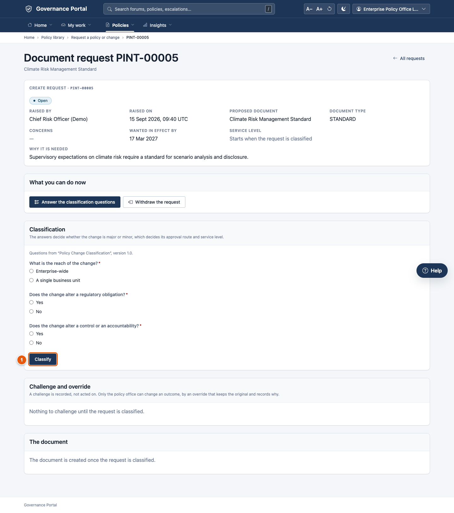

① **Classify.**

The result (**Major** or **Minor**) is shown with the rule that decided it:

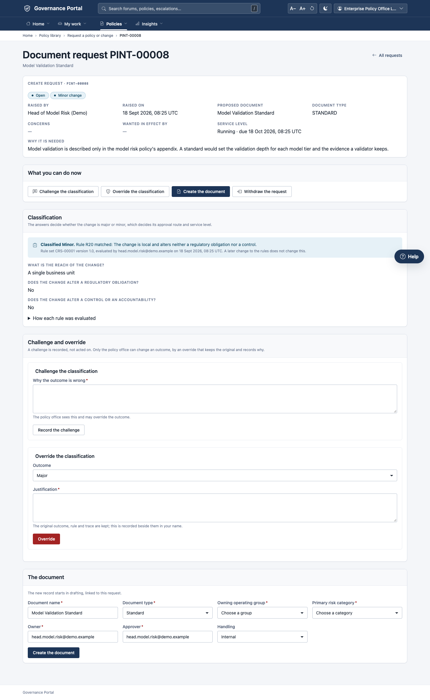

If the result looks wrong, the requester can **Challenge the classification**
and the policy office can **Override the classification**, each with a
reason. For a new policy, the policy office then clicks **Create the
document**; it starts in Draft.

---

## 4.10 Reviews, horizon scanning and attestation campaigns

### Periodic reviews

Each policy has a review frequency and a next review date. Policies due
appear in their owner's **My work** under **Policy reviews due**.

On the **Reviews** tab, **Open a review cycle** starts a review. To conclude
it:

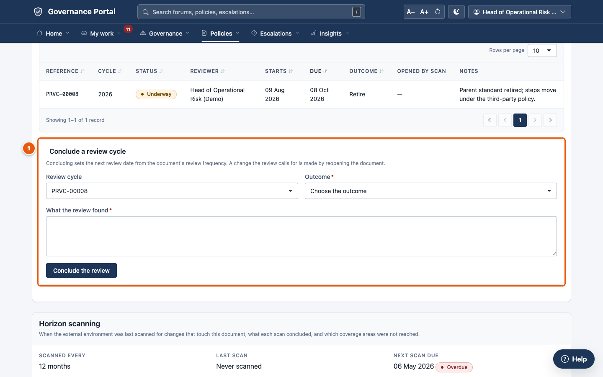

① Choose the review cycle and the **Outcome** (*No Change*, *Minor Update*,
*Major Update* or *Retire*), write what the review found, and click
**Conclude the review**. The next review date moves forward.

A review that calls for a change doesn't reopen the policy by itself. Use
**Reopen for Change**.

### Recording a horizon scan

A horizon scan records that the owner looked for coming changes (regulatory,
technological, operational and so on) that may affect the policy.

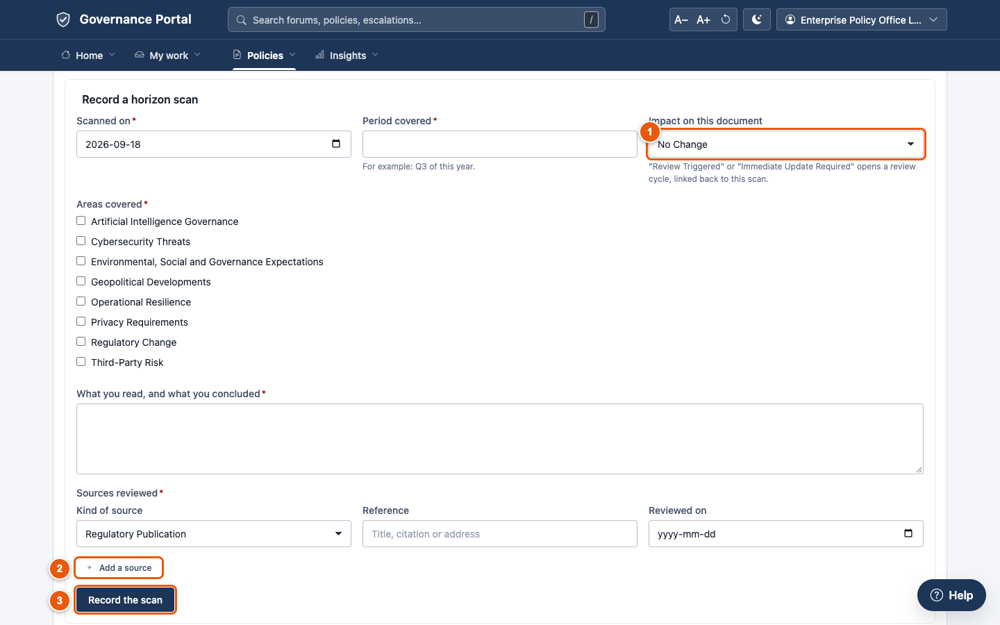

① **Impact on this document**: *No Change*, *Review Triggered* or *Immediate
Update Required*. The last two open a review automatically.

② **Add a source** for each thing you read (at least one).

③ **Record the scan.**

### Attestation campaigns

An **attestation campaign** asks many people at once to confirm their records
are accurate, for example every policy owner once a year. Open **Policies →
Attestation campaigns** (governance office and administrators).

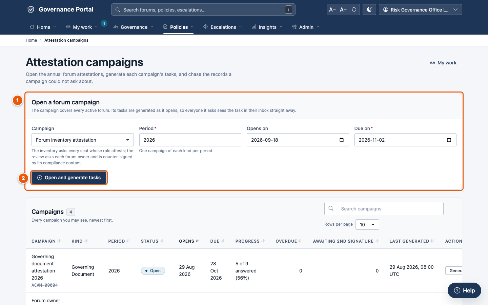

① **Open a forum campaign**: choose the campaign (*Forum inventory
attestation*, or *Forum owner and compliance review* with two signatures), the
period and the dates.

② **Open and generate tasks** opens it and asks everyone in scope. They answer
in **My work**.

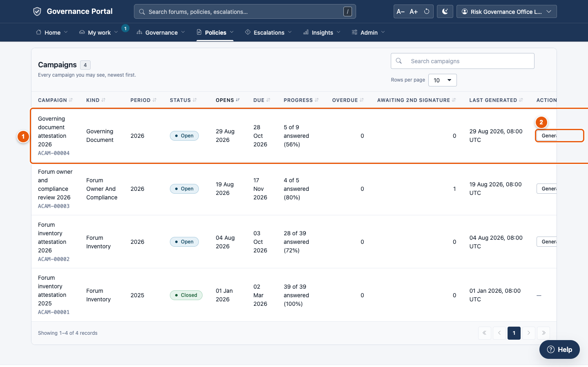

① **Each campaign** shows its progress (answered of asked), what's overdue,
and what's waiting for a second signature.

② **Generate tasks** asks anyone new, for example someone who joined a forum
after the campaign opened. Nobody is asked twice.

Reminders follow each campaign's reminder schedule. Campaigns over policies
can also be opened from a policy (**Open an attestation campaign**) or set up
by your administrator ([chapter 9](09-administration.md)).

---

## 4.11 Monitoring and violations

**Recording a monitoring result.** On the **Monitoring** tab, click **Record a
result** on the activity:

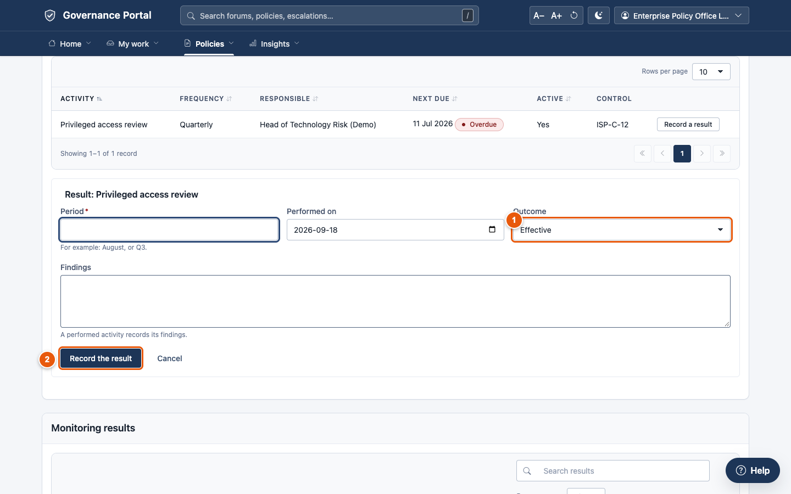

① Give the period, when it was performed, the **Outcome** (*Effective*,
*Partially Effective*, *Not Effective* or *Not Performed*) and the findings.

② **Record the result.**

**Logging a violation** (policy owner, reviewer or office): click **Log a
violation**.

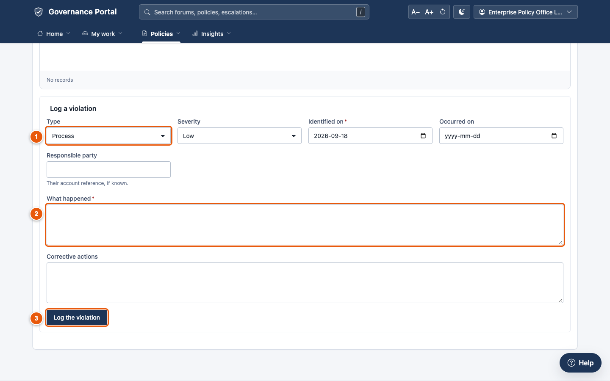

① The **Type** and **Severity**, the dates and the responsible party.

② **What happened**, and any corrective actions.

③ **Log the violation.** It starts as *Logged*, and is followed up to
*Resolved* or *Dismissed*.

---

## 4.12 Regulatory updates and horizon scanning

When a regulation changes, **Regulatory updates** (in the **Policies** and
**Insights** menus) shows everything it touches.

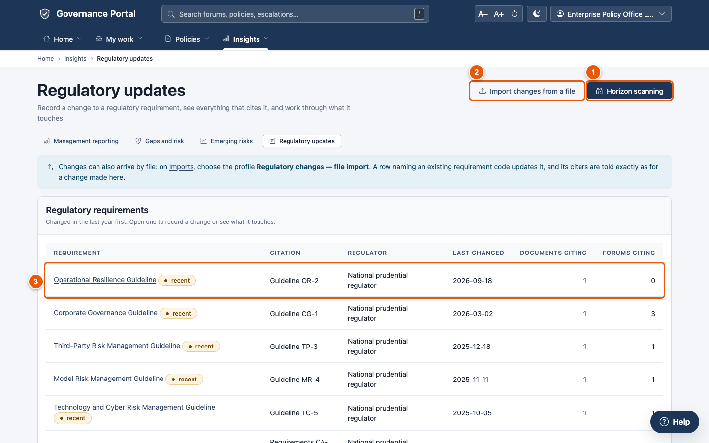

① **Horizon scanning** opens your horizon-scanning service.

② **Import changes from a file** loads a batch of regulatory changes from a
spreadsheet (administrators).

③ **Each requirement**, most recently changed first, with how many policies
and forums cite it. Click one to open it.

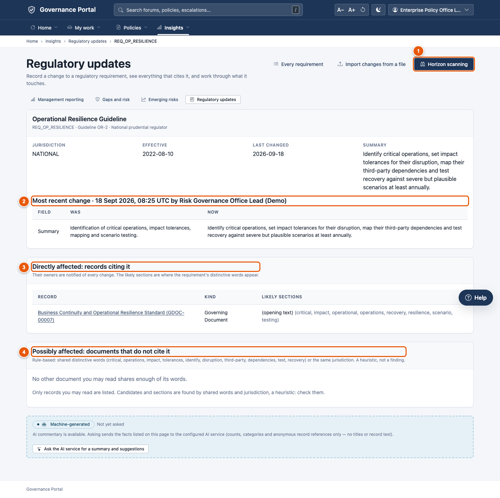

① **Horizon scanning.**

② **Most recent change**: each detail as it was and as it is now.

③ **Directly affected**: the policies and forums that cite it, and the
sections most likely to need changing. Their owners are told of every
change.

④ **Possibly affected**: policies that don't cite it but share its key words
or jurisdiction, as a prompt to check, not a finding.

**Recording a change** (people who maintain regulatory requirements): under
**Record a change**, edit the details and click **Save the change and notify
citers**.

**AI suggestions**, if switched on: **Ask the AI service for a summary and
suggestions** proposes a note for each citing policy. Nothing is written until
someone who may change that policy clicks **Accept and write** (or
**Reject**).

**Horizon scanning.** The **Horizon scanning** buttons and menu item open your
organisation's horizon-scanning service in a new tab. Until your
administrator connects it, you see:

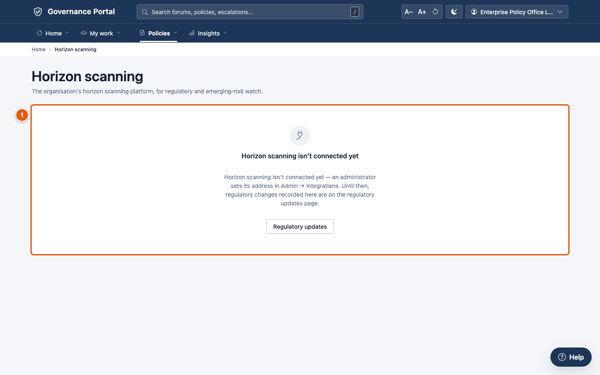

① The message, with a link to **Regulatory updates**.

---

## Tips

- **Read the Lifecycle tab before you act.** It shows every action, who takes
  it and what would stop it.
- **Raise approval steps as soon as a policy enters Review.** Steps are
  decided in order, so an early start saves time.
- **Use Search the text of the documents** to find every policy that mentions
  a topic, not just those with it in the title.
