# 5. Escalations

An **escalation** is a matter that needs attention at a higher level: an
incident, a limit breach, a regulatory matter, an emerging risk, a policy
breach. The platform takes it from being raised to being closed:

- it proposes how serious the matter is and which committees must see it;
- the matter gets an owner;
- the owner works it through action plans or a formal risk acceptance;
- the second line challenges it;
- it is closed against agreed criteria.

A time limit runs throughout.

**The stages**

| Stage | Meaning |
|---|---|
| **Open** | Raised, not yet started |
| **In Progress** | Being worked by the first line |
| **Under Review** / **Pending Review** | With the second line for challenge |
| **Closed** | Resolved, with its outcome recorded |
| **Closed — Tracked Externally** | Handed to another system, with its reference |

**In this chapter**

- 5.1 The escalation register
- 5.2 Raising an escalation
- 5.3 A matter's page, tab by tab
- 5.4 Taking ownership from a queue
- 5.5 Working a matter: status, action plans, pathway
- 5.6 Risk acceptance
- 5.7 Second-line review and challenge
- 5.8 Time in each status
- 5.9 Closing a matter
- 5.10 Sensitive and systemic matters

---

## 5.1 The escalation register

Open **Escalations → Escalation register**.

① **Raise an escalation** (section 5.2).

② **Waiting on you** lists risk acceptances for you to decide, matters
awaiting your review, and open matters you answer for.

③ **Open or closed** gives ready-made views: *Open matters* (normal), *Open
and closed*, *Closed only*, *Awaiting review*, *Open, time threshold
breached*, *Risk appetite breached*, *Raised automatically on a breach* and
*Material entity impact*.

④ **Severity**: High, Medium or Low.

You can also filter by status, type, organisational level and age.

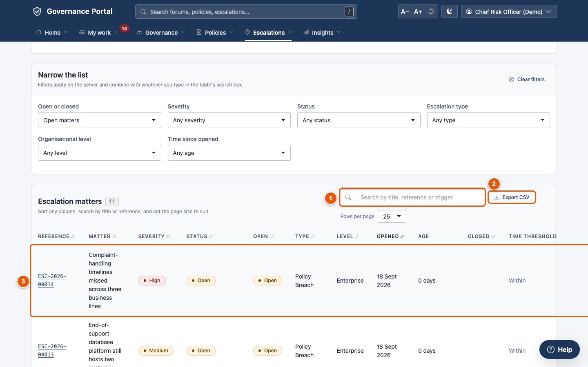

① **Search.**

② **Export CSV.**

③ **Click a matter** to open it. An open matter's age turns amber after 30
days and red after 90.

---

## 5.2 Raising an escalation

Choose **Escalations → Raise an escalation**.

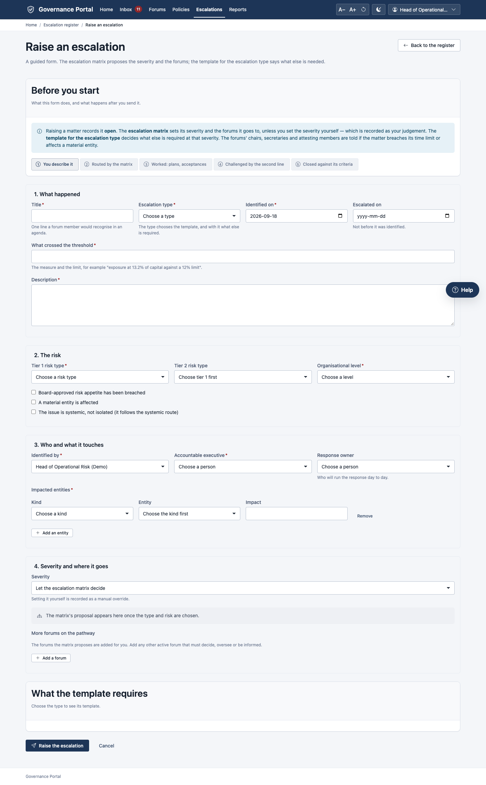

① **Before you start** explains the five stages: *You describe it*, *Routed by
the matrix*, *Worked*, *Challenged by the second line*, *Closed against its
criteria*.

Fill in the sections (fields marked **\*** are required):

1. **What happened**: a title, the type, when it was identified, what
   crossed the threshold, and a description.
2. **The risk**: the risk type (two levels), the organisational level, and
   whether the risk appetite was breached or a material entity is affected.
3. **Who and what it touches**: who identified it, the accountable executive,
   the response owner if known, and at least one impacted entity.
4. **Severity and where it goes.**
5. **Handling**: tick **Restricted handling** if the matter is sensitive
   (cleared staff only; section 5.10).

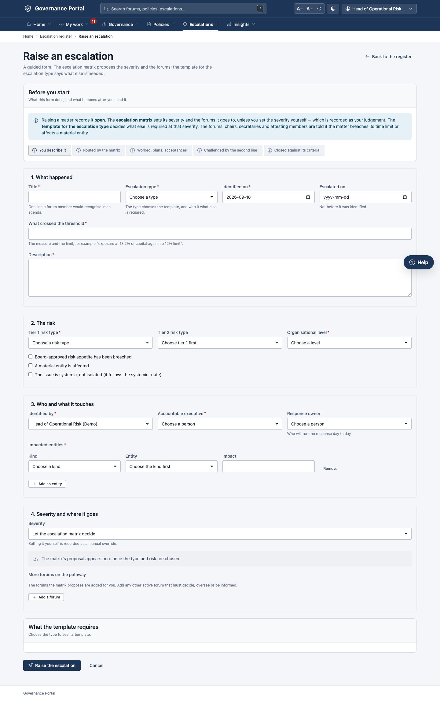

**The platform proposes the severity and the committees** as you fill in the
form:

① **Severity**: leave it on **Let the escalation matrix decide**. If you choose
one yourself, it's recorded as your override.

② **The proposal**: the rule that matched, the severity, the committees the
matter will go to (to decide, oversee or be informed), and the team that will
own it if you name no owner.

③ **What the template requires**: any extra details needed for this type and
severity.

**Systemic issues.** If the cause is shared rather than a one-off, tick the
box:

① **The issue is systemic, not isolated**. Your organisation may route
systemic matters differently.

Click **Raise the escalation**. If anything is missing, the form lists it and
saves nothing:

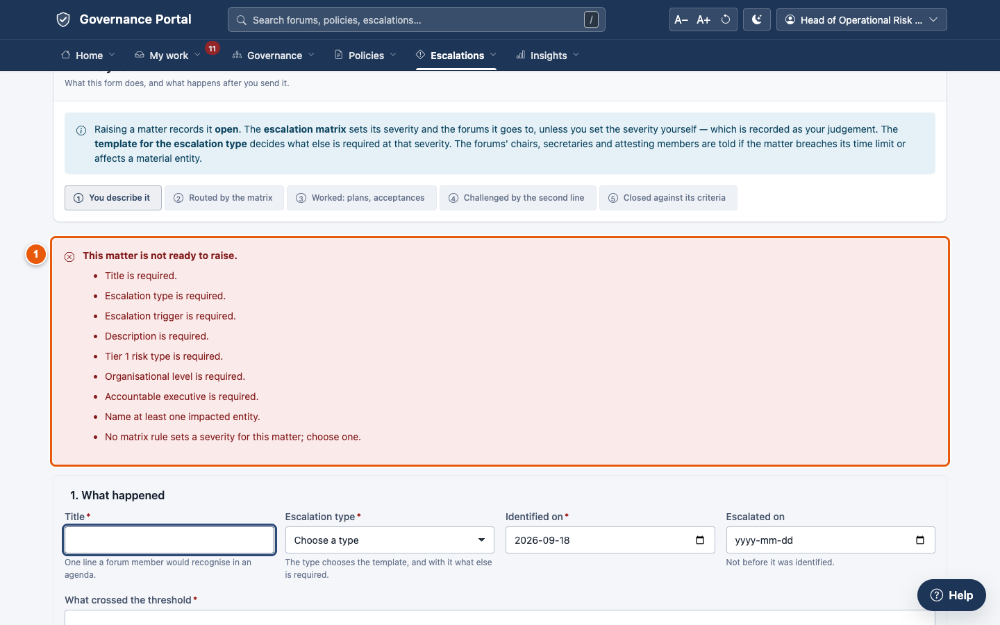

① What's missing.

**What happens next.** The matter is created and its time limit starts. If you
named no response owner, it waits in a queue for someone to take it (section
5.4). If a material entity is affected, the right people are told.

---

## 5.3 A matter's page, tab by tab

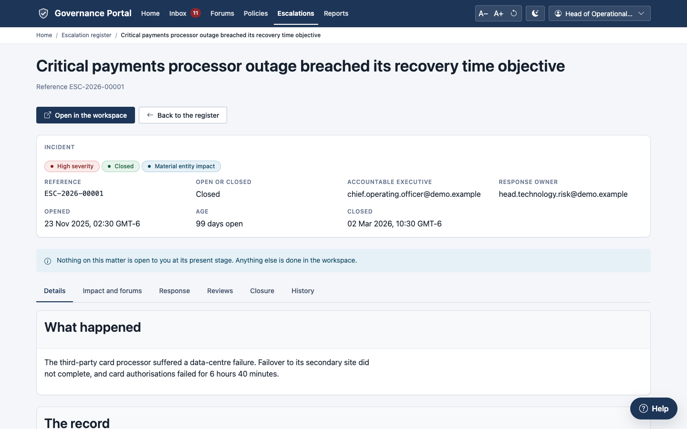

① **The summary**: type, severity, stage, labels such as **Time threshold
breached** or **Risk appetite breached**, the accountable executive, the
response owner, and its age.

② **What you can do now**: the actions open to you at this stage (sections
5.4 to 5.9).

③ **The tabs**, below.

Administrators also see **Advanced view**, the full record in the
configuration screens.

### Details

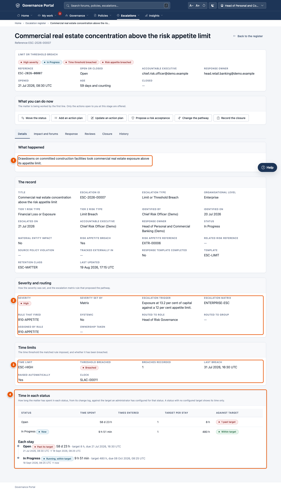

① **What happened.**

② **Severity and routing**: the severity, who set it, and the rule that
matched.

③ **Time limits**: the limit, whether it has been breached, and how often.

④ **Time in each status** (section 5.8).

### Impact and forums

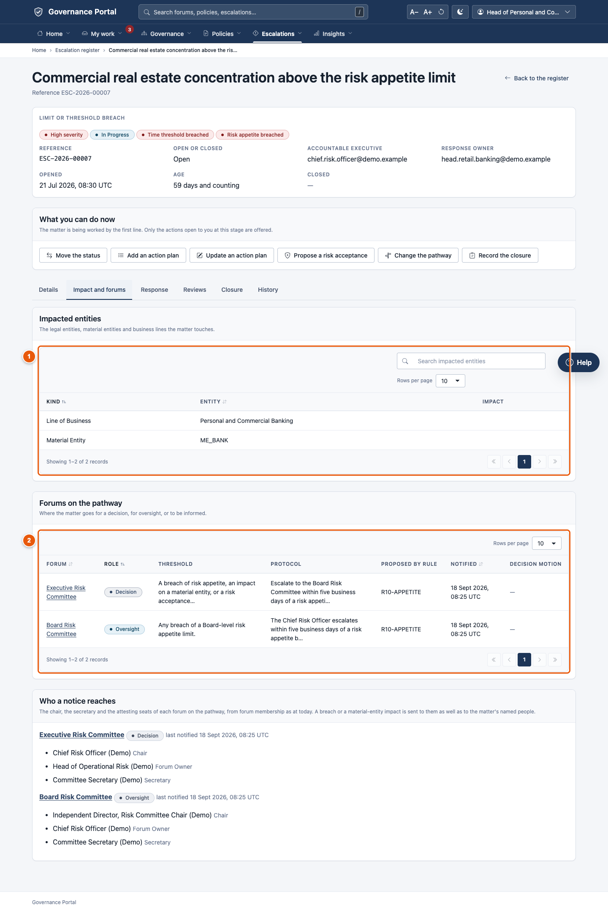

① **Impacted entities.**

② **Forums on the pathway**, and each one's role: to decide, to oversee, or to
be informed.

### Response

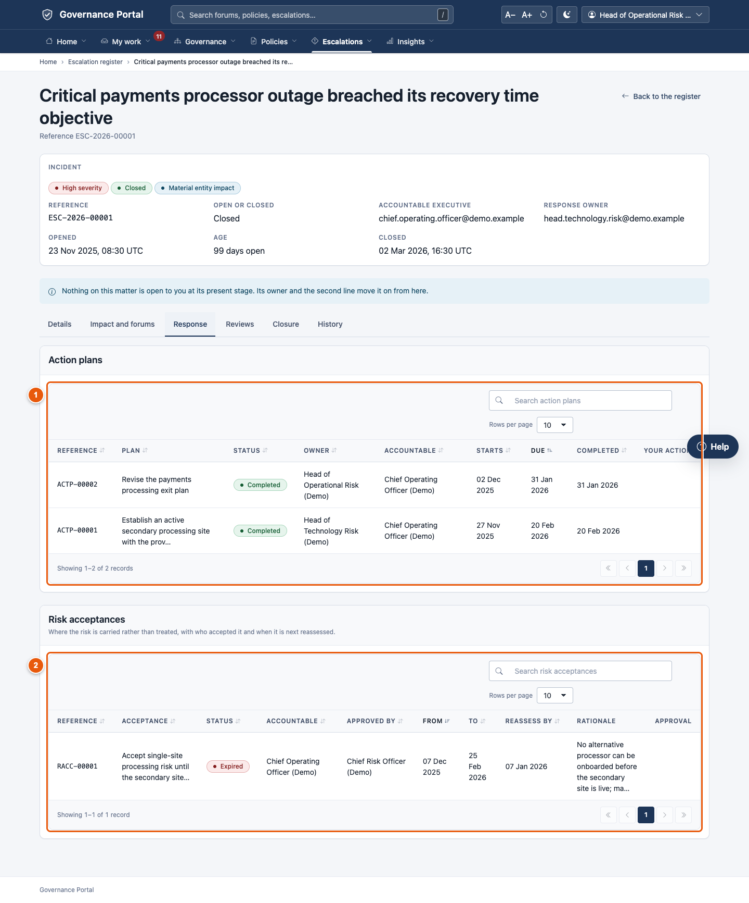

① **Action plans**, their owners, dates and status.

② **Risk acceptances**, their status and validity.

### Reviews

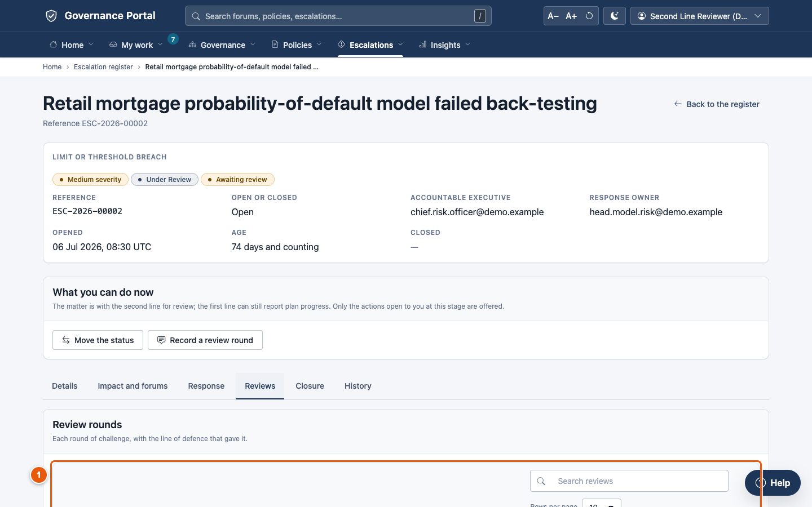

① Each second-line review round, its outcome and reasoning.

### Closure

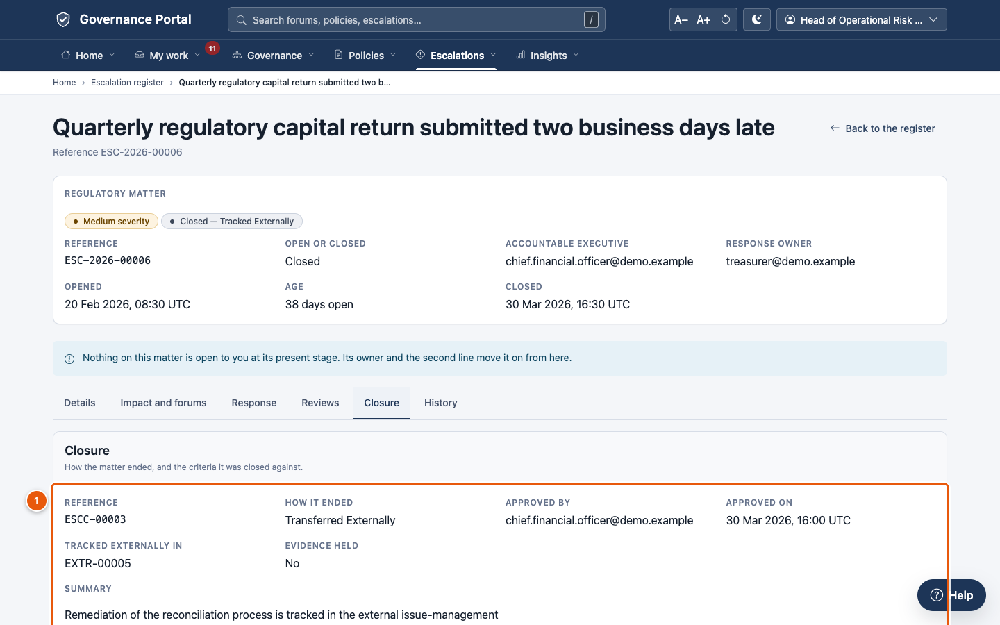

① How it ended, against which criteria, and any external reference.

### History

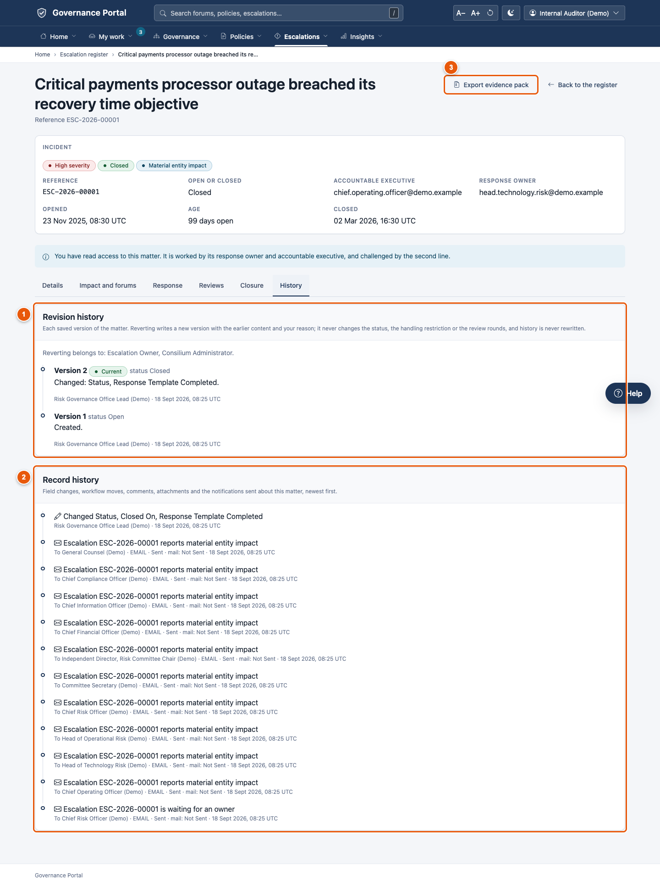

① **Revisions**: each saved version of the matter, with **Revert to this
version** for escalation owners (with a reason).

② **Record history**: every change, comment, attachment and notification.

③ **Export evidence pack** (auditors and administrators): the whole matter in
one file.

---

## 5.4 Taking ownership from a queue

A matter raised without an owner waits in a **queue**: a role or a team.
Everyone in it is told, and sees the matter under **My work → Escalations
waiting for an owner** ([chapter 2](02-my-work.md)).

① **Take ownership.** Confirm, and you become the response owner. It leaves
the queue for everyone else.

You can take a matter if you're in its queue and hold the escalation-owner
role. If a colleague takes it first, you're told who owns it now. If a matter
is later re-routed to a different queue, it waits there for a new owner.

---

## 5.5 Working a matter

These actions are for the response owner while the matter is open or in
progress. Each opens a small form; click its button to save, or **Cancel**.

**Move the status**, for example to *In Progress*, or to *Under Review* to hand
it to the second line:

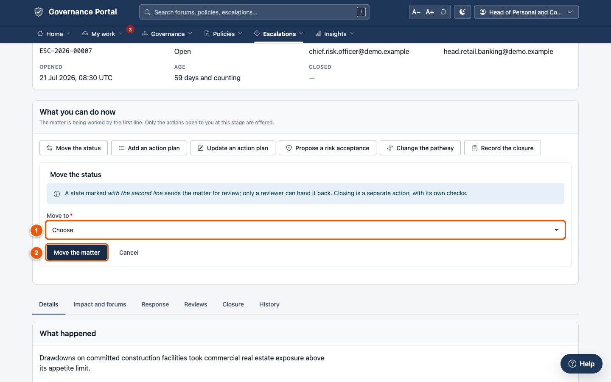

① **Move to.**

② **Move the matter.**

A matter can't simply be moved to *Closed*; it's closed through its closure
(section 5.9).

**Add an action plan:**

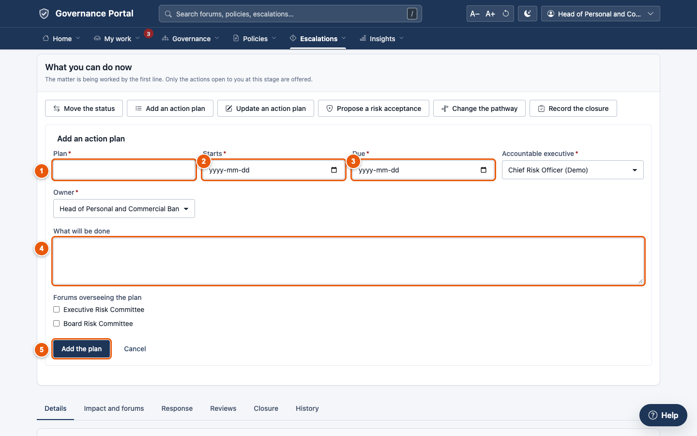

① **Plan**: a short name.

② **Starts** and ③ **Due.**

④ **What will be done.** Also choose the accountable executive, the owner and
the forums overseeing the plan.

⑤ **Add the plan.**

**Update an action plan** changes a plan, including its status (*Open*, *In
Progress*, *Completed*, *Cancelled*). A completed or cancelled plan can't be
changed again.

**Change the pathway**, the committees the matter goes to:

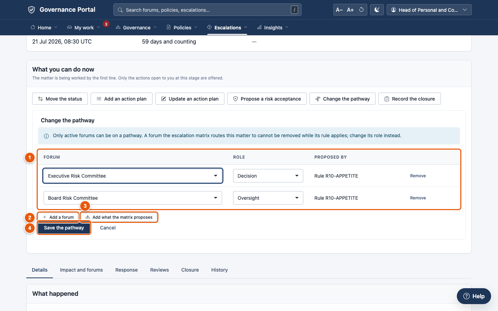

① **The forums** and each one's role.

② **Add a forum.**

③ **Add what the matrix proposes.**

④ **Save the pathway.** A forum the rules require can't be removed; change its
role instead.

---

## 5.6 Risk acceptance

Deciding to live with a risk rather than fix it is a **risk acceptance**. It
has no effect until it's approved.

**Proposing one** (response owner): click **Propose a risk acceptance**.

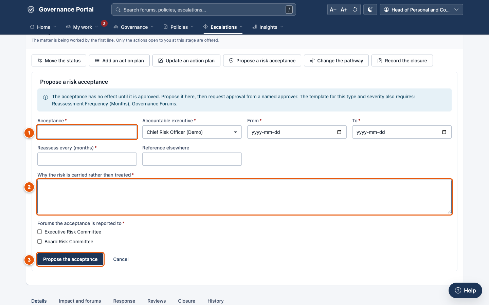

① **Acceptance**: a short name. Also give the accountable executive, the
period (from and to) and how often it's reassessed.

② **Why the risk is carried rather than treated.**

③ **Propose the acceptance.** It starts as a draft.

Then click **Request risk-acceptance approval** and choose the approver. It
must be a Head of Risk Governance other than you and the accountable
executive.

**Deciding one** (the approver): open the matter from **My work** or the
register's **Waiting on you**, and click **Decide a risk acceptance**.

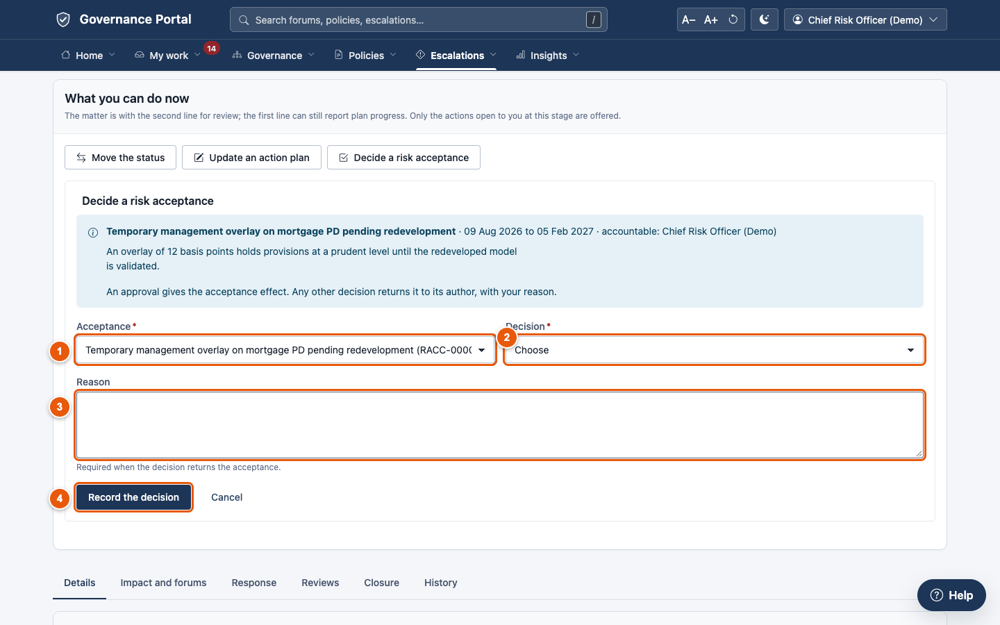

① **Acceptance**: which one.

② **Decision**: *Approved* or *Rejected*.

③ **Reason**. It's required for a rejection.

④ **Record the decision.** An approved acceptance takes effect, and the
accountable executive is reminded before each reassessment and before it
expires.

---

## 5.7 Second-line review and challenge

When the first line moves a matter to *Under Review*, the second line
challenges it.

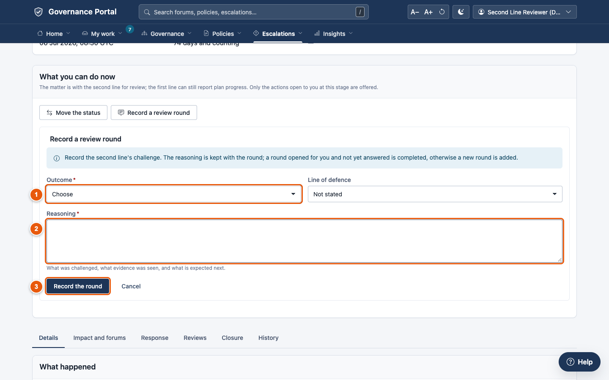

① **Outcome**: *Challenged*, *Accepted*, *Escalated* or *Returned*.

② **Reasoning.**

③ Save. The round appears on the **Reviews** tab. Then use **Move the status**
to hand the matter back if needed.

Nobody reviews a matter they answer for: an accountable executive or response
owner isn't offered **Record a review round** on their own matter.

---

## 5.8 Time in each status

The **Details** tab shows how long the matter has spent in each status, from
its history:

① For each status: the time spent, how many times the matter entered it, the
target per stay (if one is set), and how each stay compares: **Within
target**, **Near its target** or **Past its target**. The current status is
marked **Now**.

Every matter also has an overall time limit, set by the rule that matched it
(for example, High: 80 working hours). The owner and accountable executive
are warned as it approaches. When it's breached:

- the matter is marked **Time threshold breached**;
- its severity rises one step;
- the right people are told.

---

## 5.9 Closing a matter

Closing takes two steps, so no matter closes without its outcome.

**Step 1: Record the closure.** Click **Record the closure**.

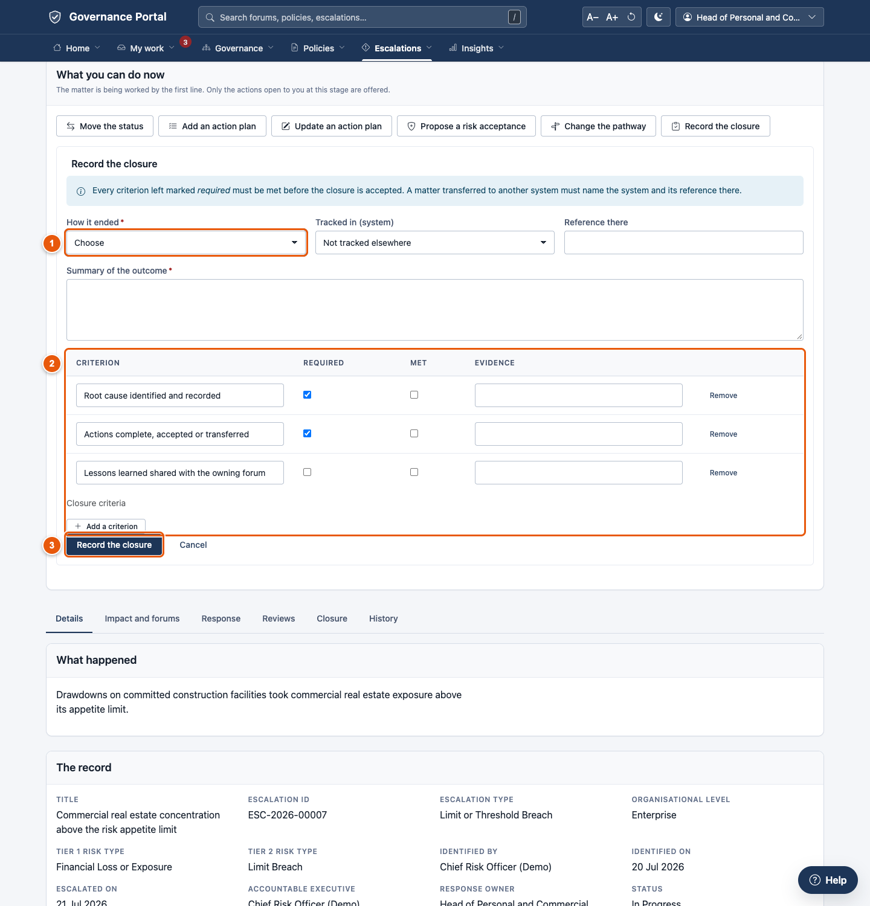

① **How it ended**: *Resolved*, *Risk Accepted*, *Transferred Externally* or
*No Action Required*. If tracking moves to another system, give its name and
reference. Write a summary of the outcome.

② **The criteria**: mark each **Met**, with its evidence. By default: root cause
identified; actions complete, accepted or transferred; lessons learned shared.

③ **Record the closure.**

**Step 2: Close the matter.** **Close the matter** appears once the closure is
recorded. Until then only **Record the closure** is offered; afterwards that
button becomes **Revise the closure**.

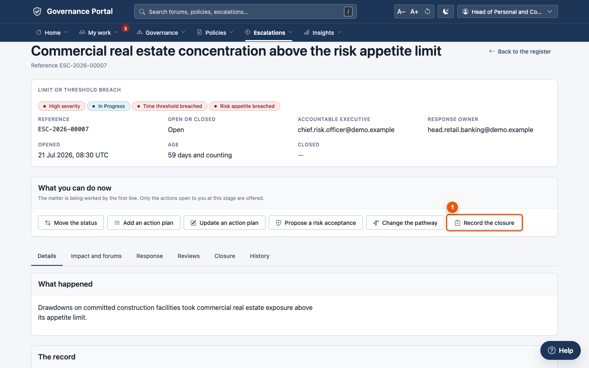

① Before the closure is recorded, the actions offer **Record the closure** and
not yet **Close the matter**.

With the closure recorded, click **Close the matter**, choose **Close as**
(*Closed*, or *Closed — Tracked Externally*), tick that the response template is
complete, and confirm with **Close the matter**. Your browser asks you to confirm. A closed matter can't be
reopened.

---

## 5.10 Sensitive and systemic matters

**Sensitive matters.** A matter with restricted handling is visible only to:

- the people it names: whoever raised it, identified it, answers for it or
  owns the response, and the team it's assigned to;
- staff cleared for sensitive matters.

For everyone else it doesn't exist: it's not in lists, counts, reports,
search or Help answers.

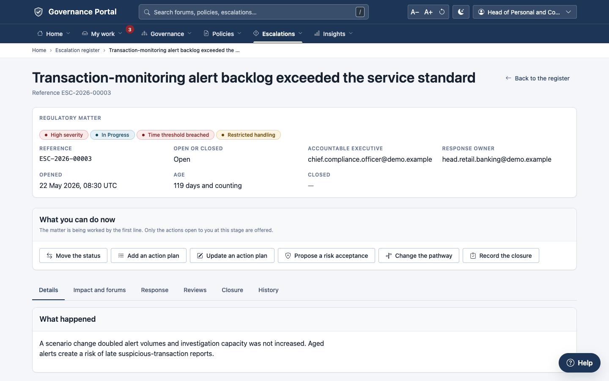

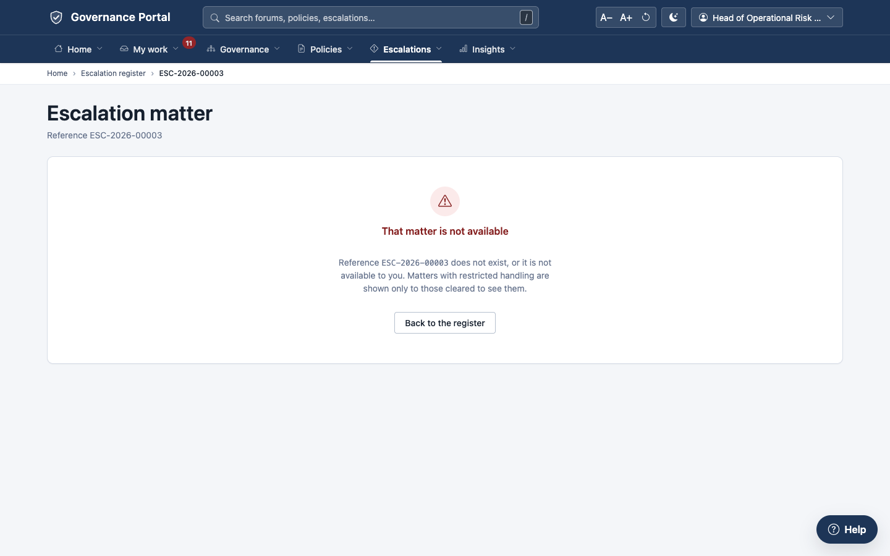

**Systemic matters** carry a **Systemic** label, and your organisation may give
them their own routing and time limits.

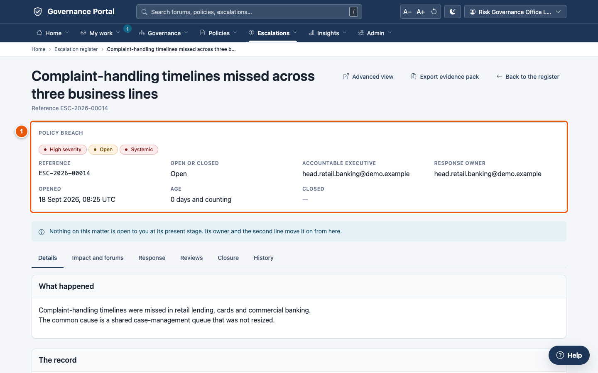

① The summary, with the **Systemic** label.

---

## Tips

- **Let the platform propose the severity** unless you have a reason not to.
- **Record the closure early** and update it as the matter progresses; closing
  is then one click.
- **Secretaries**: a forum's **Escalations** tab lists everything routed to that
  committee ([chapter 3](03-governance.md)).
