# 5. Meetings, minutes, motions, votes and charters

**Purpose.** A forum's work is recorded as:

- **seats** (who sits on it);
- **sittings** (its meetings, with attendance and quorum);
- **minutes** (versioned, never overwritten);
- **motions** (what was put to it);
- **votes** (one row per entitled voter);
- its **charter** (its mandate, versioned and challenged by the governance
  office).

This chapter explains each of them and where each is maintained.

**Who can do it.**

| To | You need |
|---|---|
| Read seats, sittings, motions, outcomes and the charter | Anyone who can read the forum |
| Maintain membership and meetings, record minutes | Committee Secretary or Risk Governance Office |
| Put motions and record their outcome | The forum's secretary (Committee Secretary, or the person named as its secretary) |
| Cast a ballot | The member holding an entitled seat, or its standing delegate |
| Start a charter and publish its versions | Anyone who may create or change charters (Committee Secretary, Risk Governance Office) |
| Record the governance office's challenge on a charter | Risk Governance Office |

**Where it happens.** On the portal, a forum's **Membership**, **Decisions**
and **Documents** tabs show all of this ([chapter 2](02-forums.md)). Motions
and votes are taken on the portal's motion page, and the charter is maintained
on the Documents tab. Seats, meetings and minutes are maintained in the
workspace, under **Governance** in the sidebar.

---

## 5.1 Seats (membership)

A **seat** is a dated record of someone's place on a forum. It is **ended,
never deleted**, so the membership on any past date can be read back exactly
(see [chapter 2, section 2.3](02-forums.md)).

**To add a seat:**

1. In the workspace, open **Governance → Forum Membership** and click
   **+ Add Forum Membership**.
2. Choose the **Forum**.
3. Choose the **Seat Type**:
   - **Person**: fill in **Member**;
   - **Position**: fill in the **Position Title**, for example "Chief Risk
     Officer". A position seat survives the person leaving; if nobody holds
     it, it shows as **Vacant**.
4. Choose the **Seat Role**: chair, secretary, voting member, non-voting
   member, observer, forum owner, risk owner…
5. The role sets whether the seat **Votes** and **Counts Toward Quorum**, and
   whether it is the voting chair. To change these for this seat only, tick
   **Set Voting Rights Manually** and set them.
6. Set the **Start Date**. To name someone who may act for the member, fill in
   **Delegate**, with **Delegate From**, **Delegate To** and **Delegate
   Votes** (and the **Authority Delegation** that authorises it, if one
   exists).
7. Click **Save**.

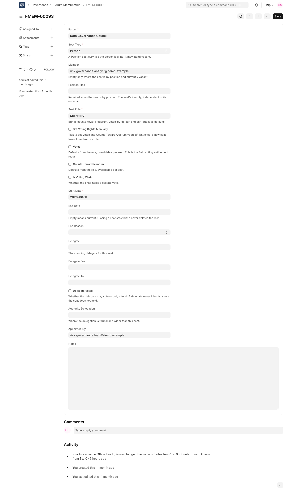

**To end a seat:** open it, set the **End Date** and the **End Reason**
(Term Ended, Left Organisation, Role Change, Forum Disbanded or Removed), and
click **Save**. Do not delete it.

**The forum's officers follow the seats.** The forum's **chair**,
**secretary** and **owner** fields are set from its open chair, secretary and
owner seats. To change the chair, end the old seat and open a new one.

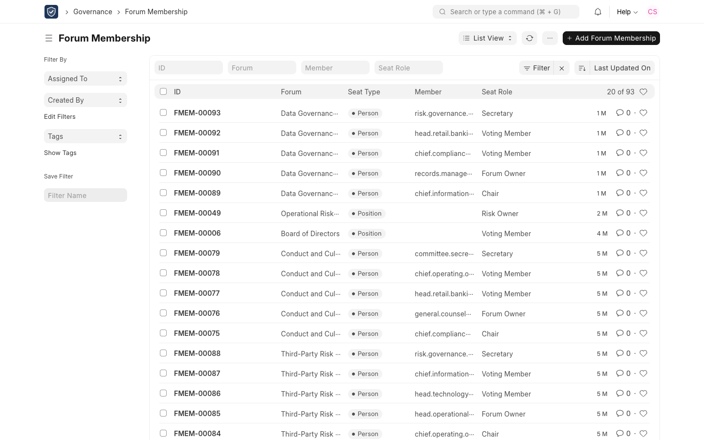

---

## 5.2 Meetings (sittings)

1. Open **Governance → Forum Meeting** and click **+ Add Forum Meeting**.
2. Fill in the **Forum**, a **Meeting Reference**, **Scheduled On**,
   **Location**, **Chaired By** and **Secretary**, and attach the **Agenda**.
3. Save it with the status **Scheduled**.
4. After the meeting, open it again, set **Held On**, fill in the
   **Attendance** table, and set the **Status** to **Held**. When a meeting is
   saved as **Held**, the system **works out whether it was quorate** from the
   attendance and the forum's quorum rule. It records the result in **Quorum
   Met**, with an explanation in **Quorum Evaluation Note**.
5. If the meeting did not take place, set **Cancelled** or **Adjourned**.

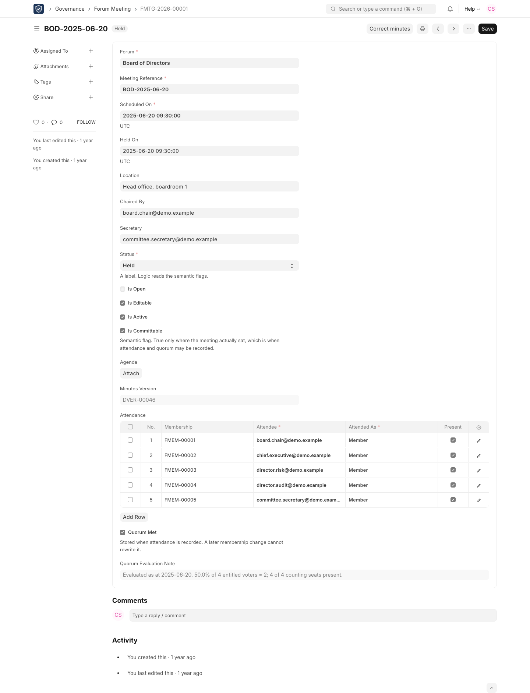

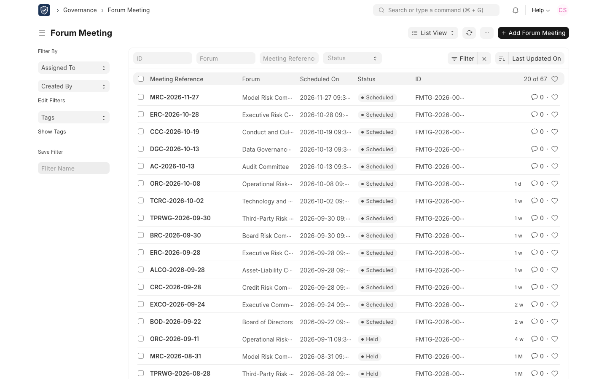

### Quorum

Each forum's **quorum rule** is on its record (**Details → Escalation and
quorum** on the portal). It is one of:

- a **count** of members;
- a **percentage** of voting members;
- **all** voting members;
- the **chair plus** a count.

Only seats marked **Counts Toward Quorum** count.

---

## 5.3 Minutes, with versions

Minutes are kept as **versions**. Correcting them adds a new version and
keeps the earlier one.

1. Open the meeting in the workspace.
2. Click **Record minutes**. (If minutes already exist, the button reads
   **Correct minutes**.)
3. Type the minutes in the editor, **or attach the minutes as a file**.
4. When correcting, say **What changed**.
5. Click **Save minutes**. The message "Minutes saved as version N" confirms
   it.

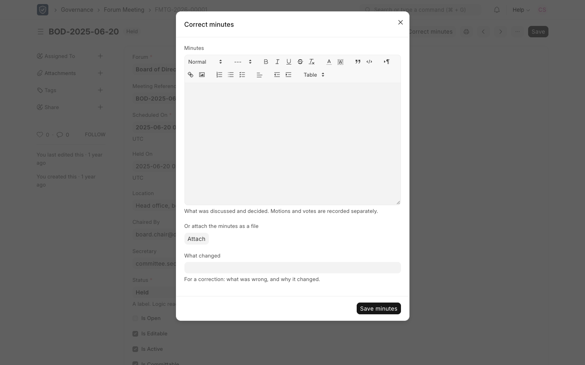

> **Note.** Minutes are not yet shown on the portal. Read them in the
> workspace, on the meeting's record.

---

## 5.4 Motions and votes

A **motion** is a proposition put to a forum. When it is put, the system
writes one **ballot** for every seat entitled to vote on the decision date,
whether or not that seat then votes. Entitlement is recorded as well as the
result. Motions are put, voted and closed on the portal's **motion page**.

### Putting a motion (the forum's secretary)

1. Open the forum, click the **Decisions** tab, and click **Put a motion**.

   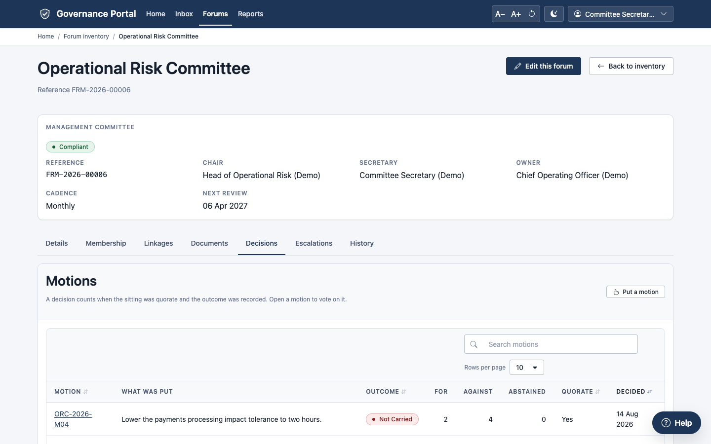

2. Fill in:
   - **Reference\***: as the minutes will cite it, such as the agenda item;
   - **Decision date\***;
   - **Sitting**: the meeting, or *Not at a sitting*;
   - **How it is voted**: *In Meeting*, *Written Resolution* or *Electronic*;
   - **What is put\***.
3. Click **Put the motion**.

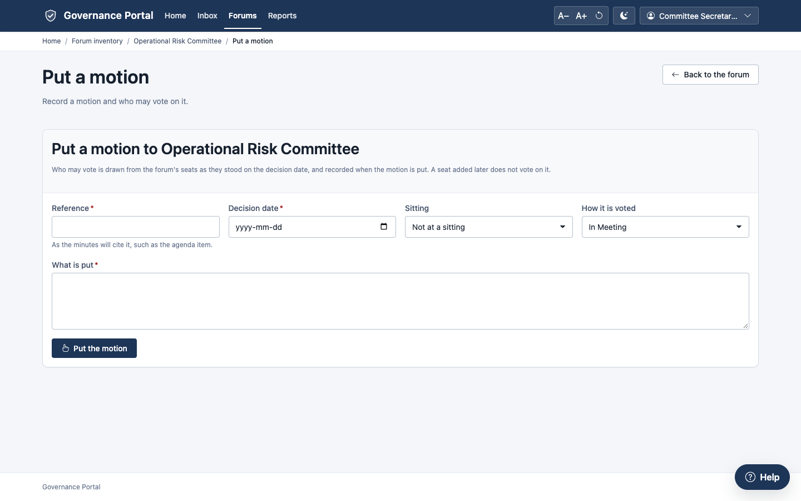

Motions are put by the forum's secretary: the Committee Secretary role, or the
person named as the forum's secretary. Anyone else sees "Motions are put by
the forum's secretary". The forum must be active.

### Voting (each entitled member)

1. Open the motion, from the forum's **Decisions** tab or your link.
2. Under **Your vote**, choose your **Ballot**: **For**, **Against**,
   **Abstain** or **Recused**. Optionally, give a **Reason**.
3. Click **Cast my ballot**. "Your ballot is recorded: …"

You may change your ballot (**Change my ballot**) until the secretary records
the outcome. A seat's standing delegate may vote for it, if the seat lets its
delegate vote and the delegation was active on the decision date.

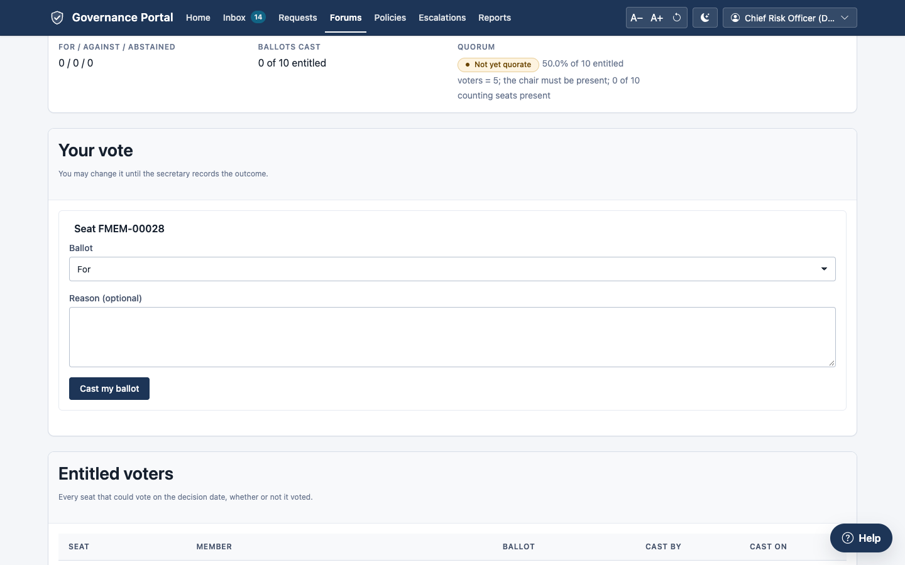

The **Entitled voters** table lists every seat that could vote on the decision
date, with its ballot, who cast it and when.

### Recording the outcome (the secretary)

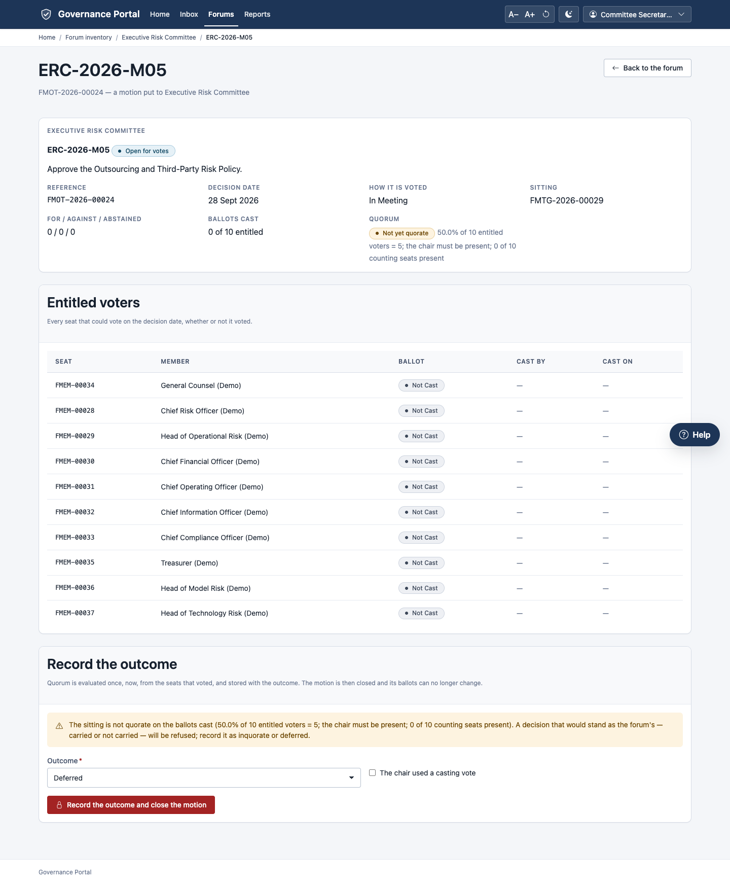

The summary shows the tally and whether the motion is **Quorate so far** or
**Not yet quorate**. Only seats that cast a ballot count as present, and the
chair must be among them if the forum's quorum rule requires it.

1. Under **Record the outcome**, choose **Carried**, **Not Carried**,
   **Deferred**, **Withdrawn** or **Inquorate**.
2. Tick **The chair used a casting vote** if so.
3. Click **Record the outcome and close the motion**. "The motion is closed as
   …"

Quorum is evaluated **once, at that moment**, and stored with its basis. If
the sitting is not quorate, **Carried** and **Not Carried** are marked "(needs
quorum)" and refused: record the motion as **Inquorate** or **Deferred**
instead.

**Once the outcome is recorded, the motion is closed** and its ballots can no
longer change.

> **Deferred motions.** Check a *Deferred* motion after recording it. At the
> time of writing the demonstration data keeps deferred motions open, so they
> may still accept ballots.

The forum's **Decisions** tab lists every motion with its outcome, tallies and
quorum, and every sitting:

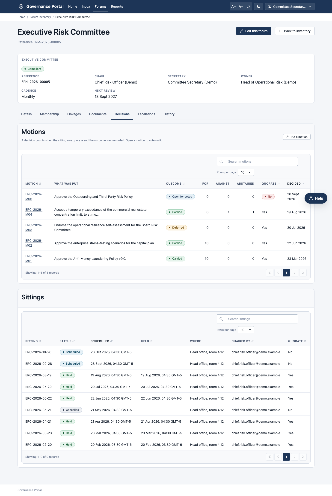

The same records can be read in the workspace, under *Governance → Forum Motion*
and *Forum Vote*:

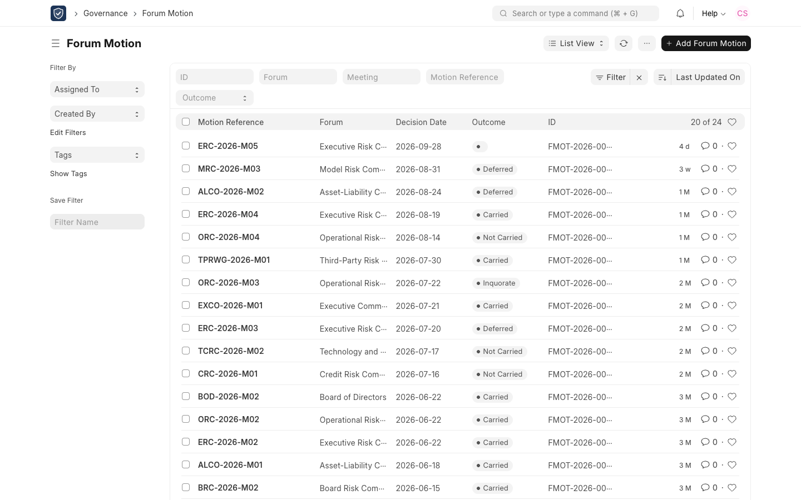

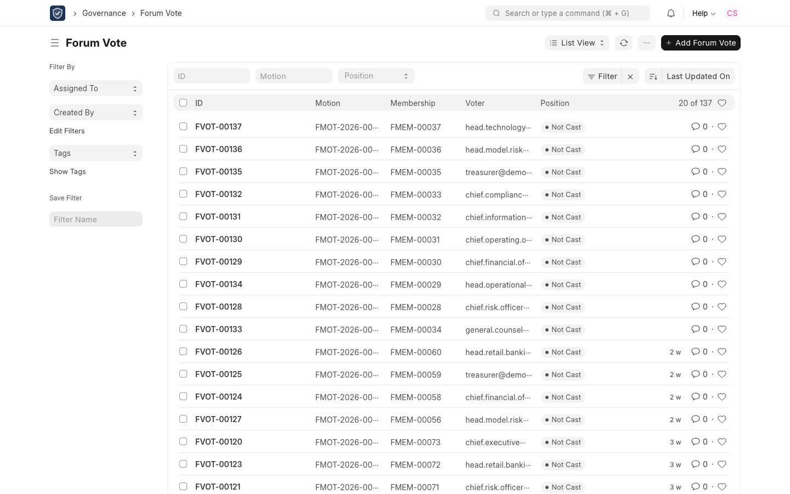

---

## 5.5 Charters

A forum's **charter** is its founding document: mandate, scope, membership,
decision rights and reporting lines. Like a governing document it is
**versioned**. The Risk Governance Office **challenges** each version, and a
charter is cleared for approval only when it is:

- challenged and **Cleared**;
- versioned;
- evidenced.

Open the forum and click the **Documents** tab. The **Charter** card shows:

- the challenge status (**Challenge outstanding** or **Challenge cleared**);
- whether the charter is "Cleared for approval: challenged, versioned and
  evidenced", or what still blocks it;
- **Read the current text**;
- the **Version history**.

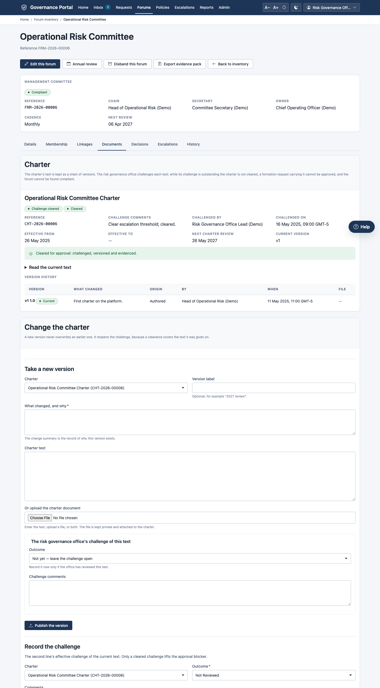

**Starting a charter** (anyone who may create charters, on an active forum):
if the forum has none, the **Change the charter** card says "This forum has no
charter yet." Give the **Charter title\***, then click **Start the charter**.
"Charter started. Take its first version below."

**Publishing a new version** (anyone who may change the charter):

1. Under **Take a new version**, choose the **Charter**, and give an optional
   **Version label** (for example "2027 review").
2. Write **What changed, and why\***.
3. Type the **Charter text**, **or upload the charter document**.
4. Risk Governance Office only: record the challenge of this text at the same
   time, under **The risk governance office's challenge of this text**, or
   leave it on *Not yet — leave the challenge open*.
5. Click **Publish the version**. "Version published on …"

A new version **reopens the challenge** (**Not Reviewed**), unless the office
records an outcome in the same step. Earlier versions are kept.

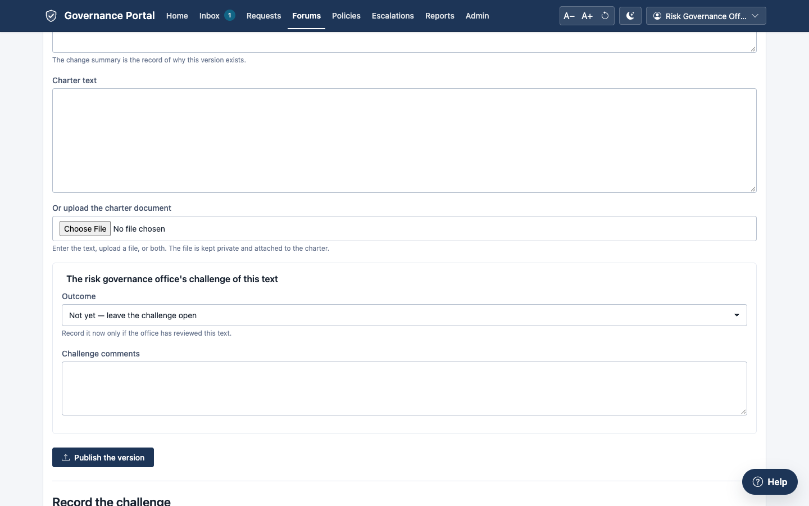

**Recording the challenge** (Risk Governance Office):

1. Under **Record the challenge**, choose the **Charter** and the **Outcome\***:
   - **Not Reviewed**;
   - **Changes Requested** (say what must change);
   - **Cleared**.
2. Write **Comments**. They are required when changes are requested.
3. Click **Record the outcome**. "Challenge recorded on …"

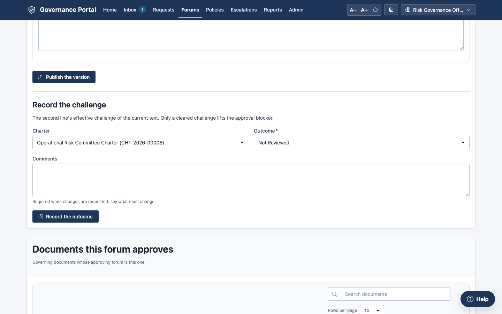

**Why the challenge matters.** An uncleared challenge holds approval back:

- a formation request whose charter is not cleared cannot be approved. The
  request's **Approval** tab has a **Charter challenge** card, where the office
  records the outcome (**Record challenge outcome**);
- a forum cannot be recorded **Compliant** while its charter challenge is open.

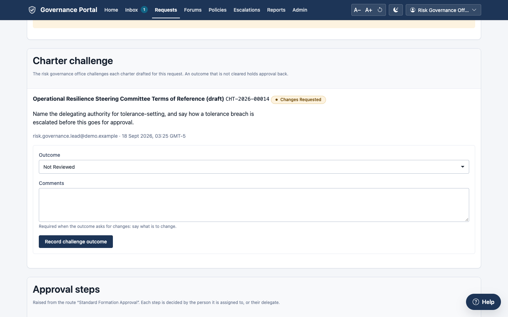

The charter's record can also be read in the workspace, under
**Governance → Committee Charter**:

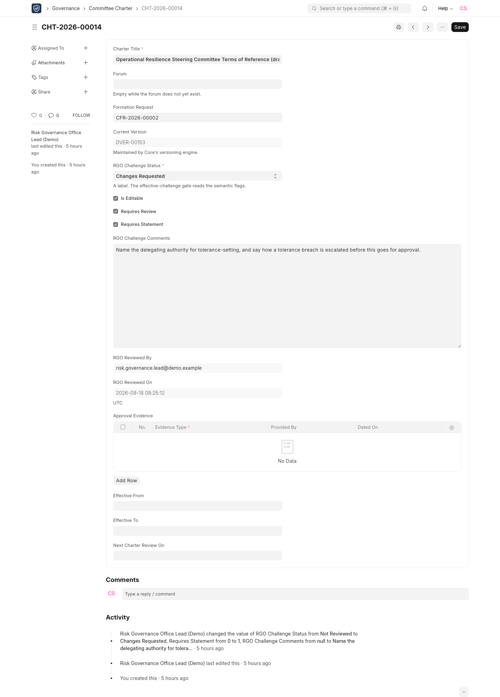

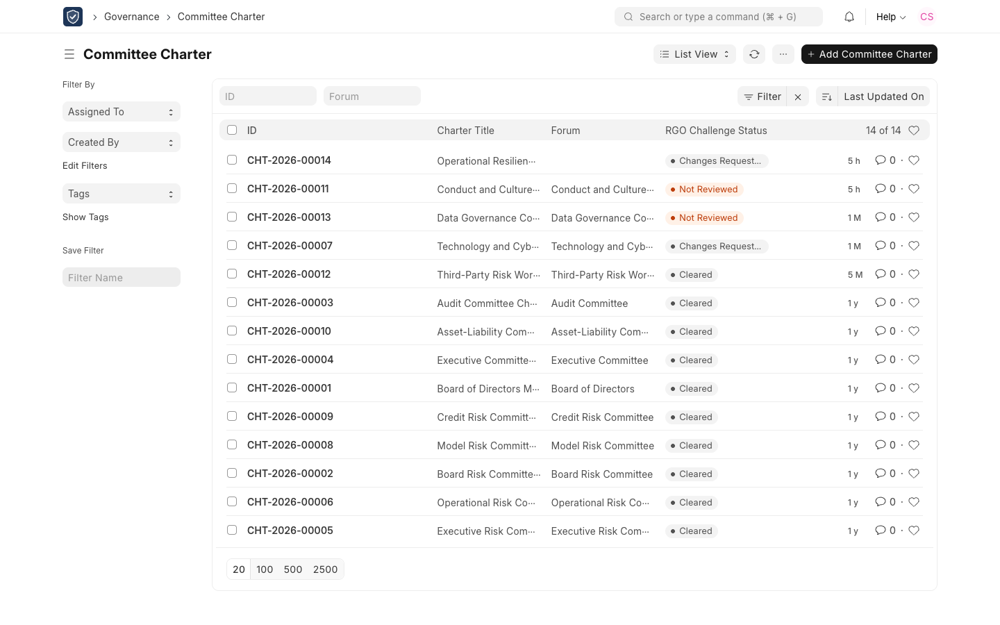

---

## Common errors

| Message | What it means | What to do |
|---|---|---|
| "A seat held by position needs the position's title" / "A seat held by a person needs the person" | The seat type and its details disagree. | Fill in the matching field. |
| "A seat cannot end before it starts." | The end date is before the start date. | Correct the dates. |
| "A member cannot be their own delegate." | The standing delegate is the member. | Choose someone else. |
| "A delegate cannot vote for a seat that holds no vote." | The seat is non-voting. | Remove the delegate's vote. |
| "Minutes need either their text or an attached file." | The minutes are empty. | Type them or attach a file. |
| "Seat … carries no vote." / "… does not hold seat …" | You hold no entitled seat on this motion. | Check the seat and the voter. |
| "Motion … has a recorded outcome; its votes can no longer change." | The motion is closed. | Put a new motion if the decision is revisited. |
| "… cannot be recorded as …: the sitting is not quorate… Record it as inquorate or deferred instead." | Too few entitled seats voted. | Record it as Inquorate or Deferred. |
| "Motions are put by the forum's secretary" | You are not the forum's secretary. | Ask the secretary. |
| "A challenge that requests changes says what changes." | *Changes Requested* needs comments. | Write the changes required. |
| "Charter … has no version to challenge yet." | Nothing to challenge. | Publish a first version. |
| "A charter cannot expire before it takes effect." | The dates are inverted. | Correct them. |
| "Forum … is disbanded." | A disbanded forum takes no new charter. | None. |

## Tips

- **Record meetings as Held on the day.** Quorum is worked out from the
  attendance snapshot taken when the meeting is saved as Held.
- **Use position seats for roles held ex officio** (for example "Chief Risk
  Officer"). They survive a change of person.
- **Correct minutes; never overwrite them.** The version history is what an
  auditor reads.
