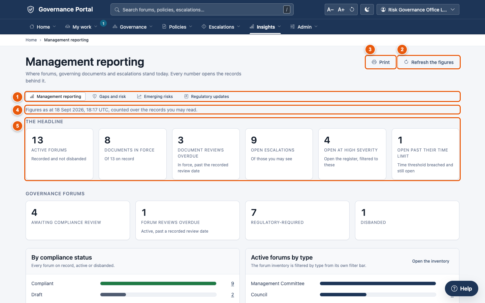
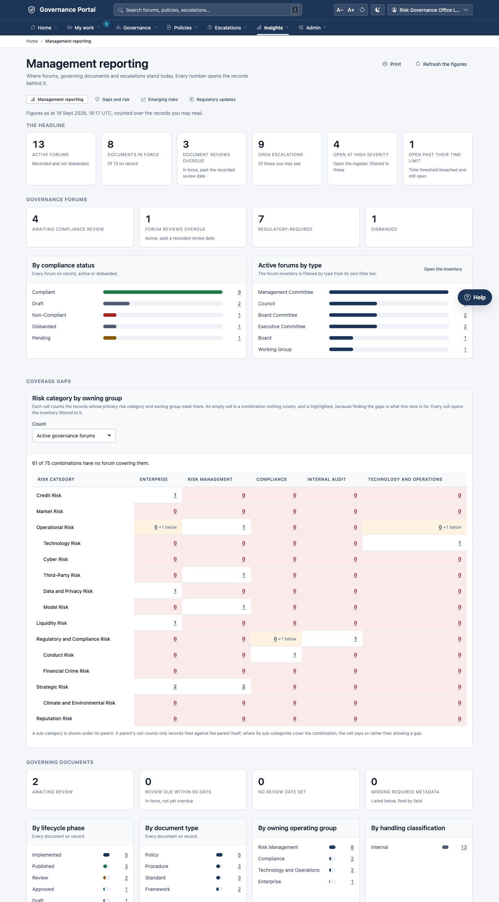
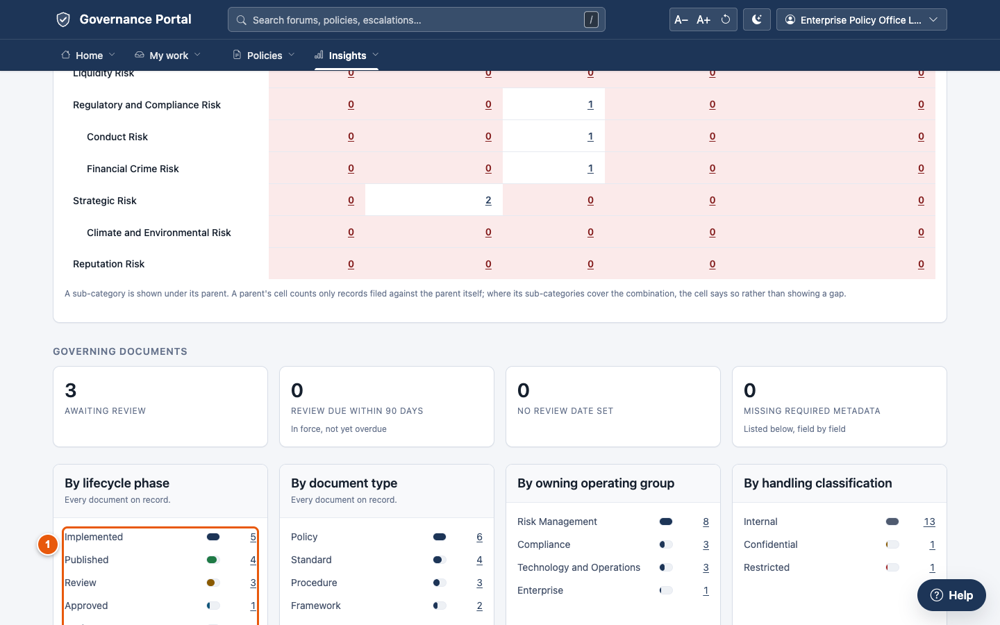
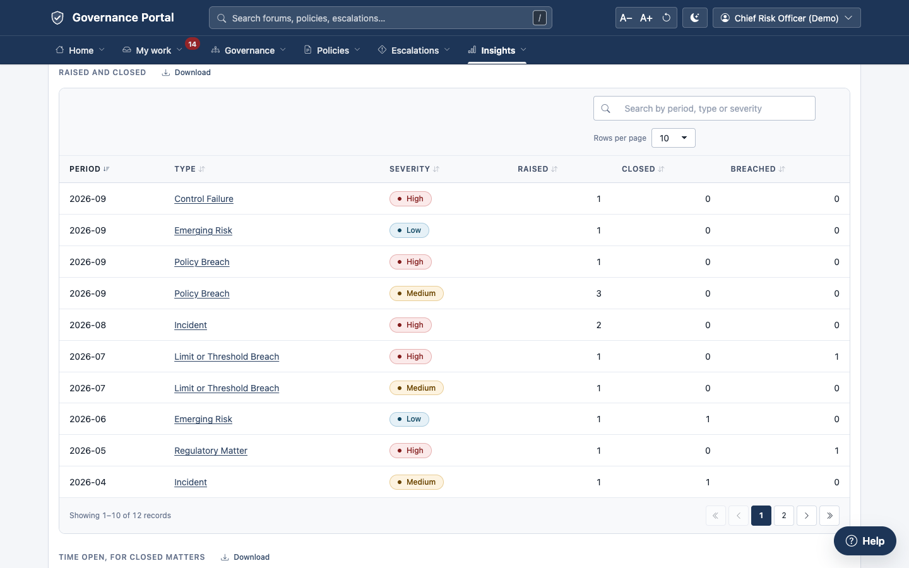
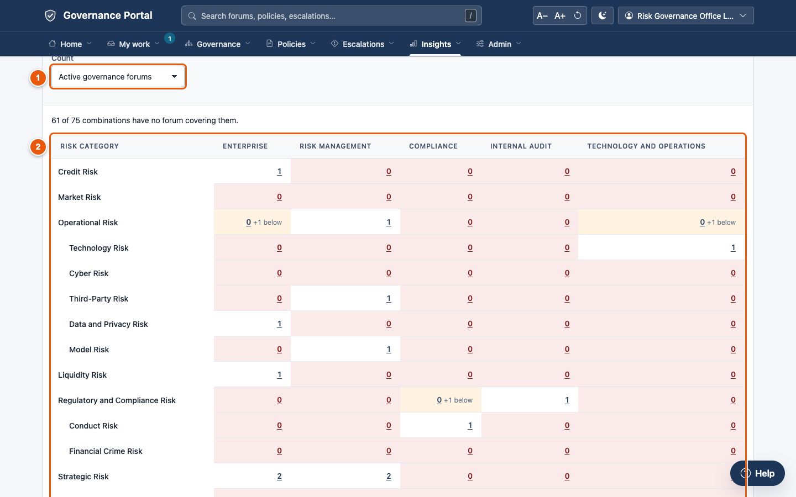
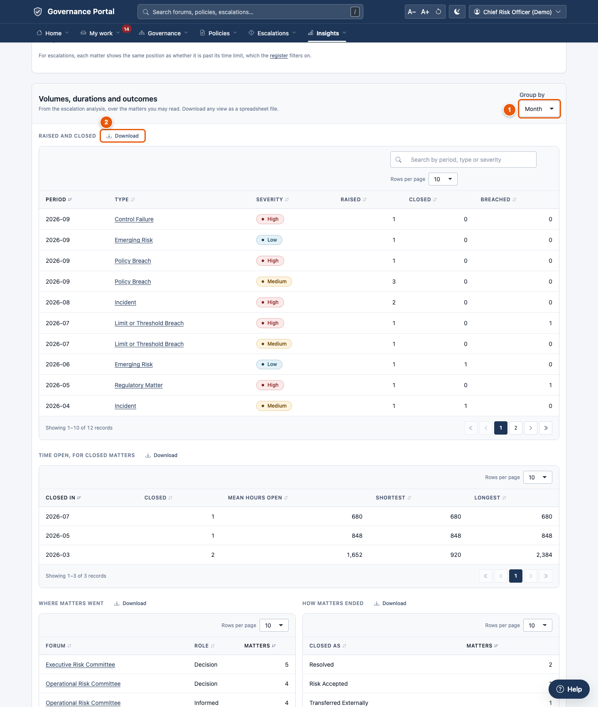
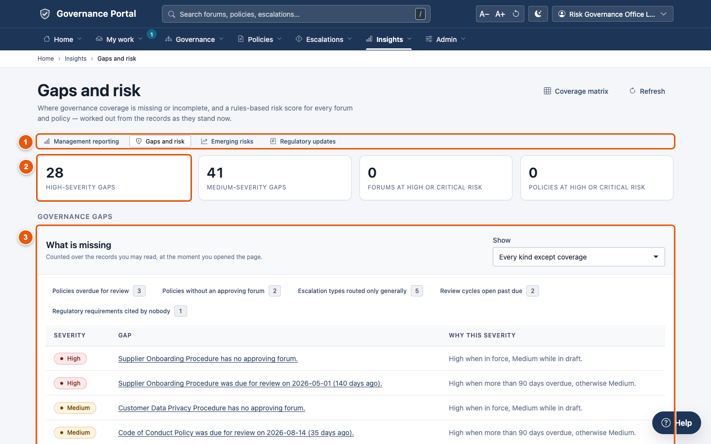
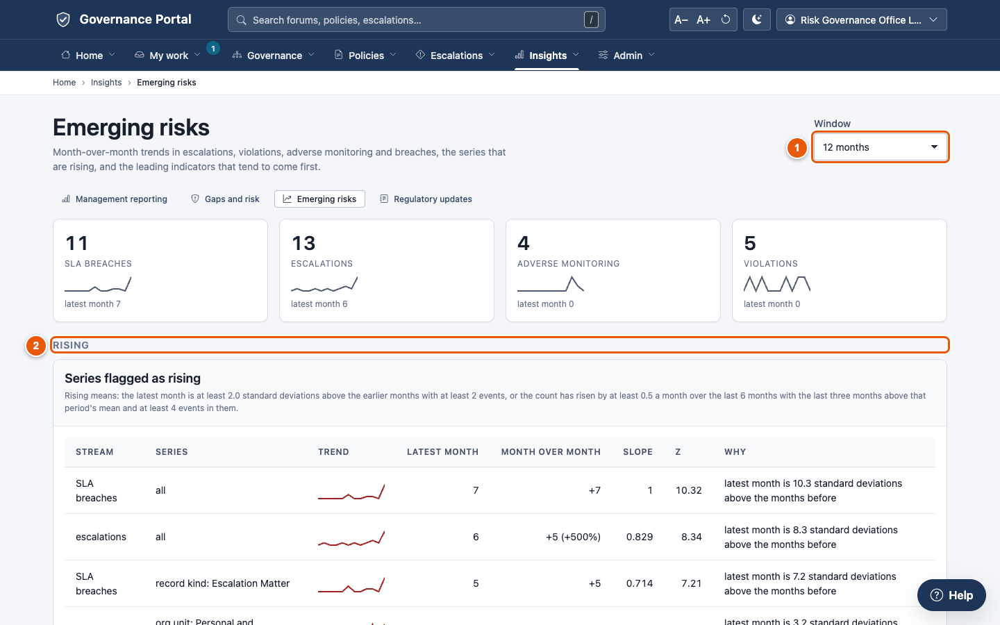
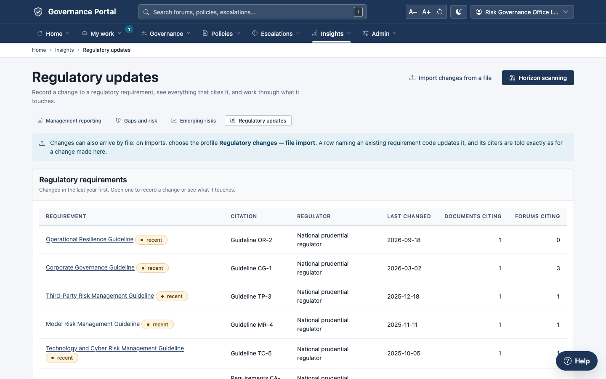
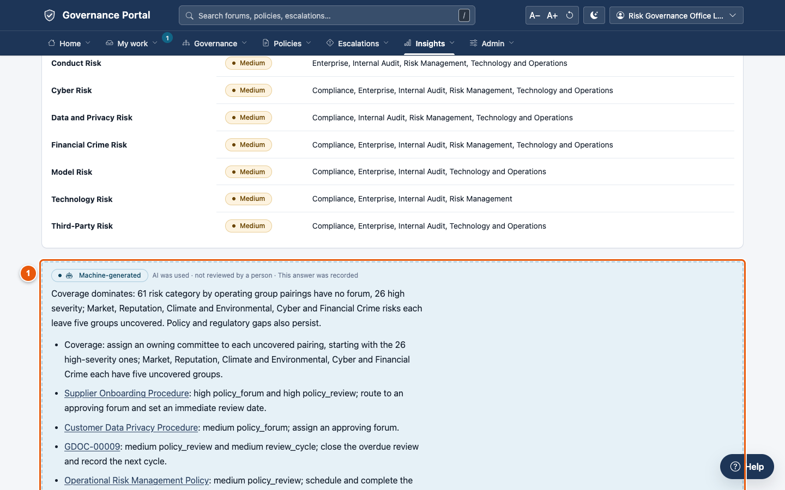

# 6. Insights

**Insights** is the management view across governance, policies and
escalations. It has four pages, linked from the **Insights** menu and from a
row of links at the top of each:

- **Management reporting**: where everything stands today;
- **Gaps and risk**: where coverage is missing, and a risk score for every
  forum and policy;
- **Emerging risks**: what is rising, and the early indicators;
- **Regulatory updates**: what a regulatory change touches.

**Every figure counts only the records you're allowed to see.** Two people
may see different totals, and sections your role can't read are left out
altogether. Sensitive escalations and restricted policies are
counted only for people cleared to see them.

---

## 6.1 Management reporting

Open **Insights → Management reporting**.

① **The link row** moves between the four Insights pages.

② **Refresh the figures** counts again.

③ **Print** gives a clean paper copy for a committee pack.

④ **When the figures were counted.**

⑤ **The headline**: active forums, policies in force, overdue reviews, open
escalations, how many are at high severity, and how many are past their time
limit.

**Every figure is a link.** Click it to open the list behind it, already
filtered.

The page continues with sections for forums, coverage, policies and
escalations:

| Section | What it shows |
|---|---|
| **Governance forums** | Awaiting compliance review, overdue reviews, regulatory-required, disbanded; forums by compliance status and by type |
| **Coverage gaps** | Risk categories against parts of the organisation (section 6.2) |
| **Governing documents** | Awaiting review, due within 90 days, no review date, missing details; policies by stage, type, owning group and handling |
| **Escalations** | Open more than 30 days, awaiting review, ever breached, risk appetite breached, closed; open matters by severity, age, type and level; volumes, durations and outcomes |

① **By lifecycle phase**: how many policies are at each stage. The other charts
break them down by type, owning group and handling.

---

## 6.2 The coverage matrix

Open **Insights → Coverage matrix**. It shows, for each risk category, which
parts of the organisation are covered by a forum or a policy.

① **Count**: active governance forums, or policies in force.

② **The matrix**: risk categories down the side, operating groups across the
top. An empty, highlighted cell is a **gap**: nothing covers that combination.
Click any number to open the records behind it.

---

## 6.3 Downloading escalation analysis

At the foot of the escalations section, **Volumes, durations and outcomes**
analyses escalations over time.

① **Group by**: month, quarter or year.

② **Download** saves a table as a spreadsheet file.

Every list in the platform also has **Export CSV** ([chapter 1](01-finding-your-way.md)).

---

## 6.4 Gaps and risk

Open **Insights → Gaps and risk**. It works out, from the records as they are
now, where governance is missing or incomplete.

① **The link row.**

② **The headline**: high- and medium-severity gaps, and the forums and
policies at high or critical risk.

③ **What is missing**: each gap, with its severity and why. For example:
- a forum without a charter;
- a policy without an approving forum;
- a review overdue;
- a regulation that nobody cites.

**Show** chooses the kinds of gap. Click a gap to open its record.

Further down, **Coverage: risk categories with no forum** lists the gaps by
category. The **Rules-based risk score** scores every forum and policy (tabs
**Forums**, **Policies** and **Weights**) and shows what drives each score.
**How is this worked out?** explains the scoring, if you want the detail.

---

## 6.5 Emerging risks

Open **Insights → Emerging risks**. It shows what is rising across
escalations, time-limit breaches, monitoring results and violations.

① **Window**: 6, 12 or 24 months.

② **Rising**: the series flagged as rising, with why. The headline tiles above
show the latest month for each stream, with a small trend line.

**Leading indicators** and **Every series** (monthly counts, by stream) are
further down.

---

## 6.6 Regulatory updates

**Insights → Regulatory updates** is the same page as in the **Policies** menu:
each regulatory requirement, what changed, and everything that cites it
([chapter 4](04-policies.md), section 4.12).

---

## 6.7 AI commentary

If your organisation has switched on AI, the analysis pages offer a
commentary:

- **Gaps and risk**: *Ask the AI service to prioritise these gaps* and *Ask
  the AI service to explain the highest scores*;
- **Emerging risks**: *Ask the AI service for emerging themes*;
- **Regulatory updates**: *Ask the AI service for a summary and suggestions*;
- a policy's **Impact** panel: *Ask the AI service for a narrative and review
  points*.

① **The commentary** is always labelled **Machine-generated**, with a
reminder that it may be wrong, and notes "This answer was recorded". The rule-based figures above it are the
authoritative ones. **Ask again** asks for a fresh commentary.

What the AI sees is limited to counts, category names and anonymous
references, never titles or text, unless your administrator allows more. It
never sees restricted or sensitive records. Every request is recorded.
Commentary is advice only: nothing is written to any record
([chapter 7](07-help-and-ai.md)).

---

## Tips

- **Before a committee meeting**, open **Management reporting** and **Print**
  it for the pack.
- **Before the annual inventory review**, open **Gaps and risk**. It lists
  forums without charters and policies without approving forums.
- **Bookmark the lists behind the figures** you check every week.
