# 6. Policies and other governing documents

**Purpose.** The platform holds every **governing document** (frameworks,
policies, standards, procedures and supporting documents) through its whole
life:

- a request to create, change or retire it, and the classification of the
  change as major or minor;
- drafting and versions;
- review and approval;
- publication to its audience;
- implementation;
- periodic review and horizon scanning;
- monitoring and violations;
- finally, retirement.

**The lifecycle** (as configured on the demonstration site; your
administrator can change it, see [chapter 11](11-configuring-workflows.md)):

```
Draft → Review → Approved → Published → Implemented
  ↑       │         │           │            │
  └───────┴─────────┴── Reopen / Return ─────┘        … → Retired → Reinstate → Draft
```

| From | Action | To | Who |
|---|---|---|---|
| Draft | **Submit for Review** | Review | Policy Owner |
| Review | **Return to Drafting** | Draft | Policy Reviewer |
| Review | **Record Approval** | Approved | Enterprise Policy Office |
| Approved | **Return to Drafting** | Draft | Enterprise Policy Office |
| Approved | **Publish** | Published | Enterprise Policy Office |
| Published | **Confirm Implementation** | Implemented | Policy Owner |
| Published / Implemented | **Reopen for Change** | Draft | Policy Owner |
| Published / Implemented | **Retire** | Retired | Enterprise Policy Office |
| Retired | **Reinstate** | Draft | Enterprise Policy Office |

**Lifecycle gates** can refuse a move until something is true. On the
demonstration site:

| Entering | Must be true |
|---|---|
| Approved | Required metadata is complete; the approval chain is complete |
| Published | The approval chain is complete; there is a current version; applicability is recorded |
| Implemented | A publication has been recorded |

**Who can do it.**

| To | You need |
|---|---|
| Read the register and a document | Any role that may read documents. **Confidential** and **Restricted** documents are visible only to the Enterprise Policy Office, Consilium Audit, the people named on the document, and the audiences it was published to. |
| Raise a document request; draft; upload versions; revert; raise approval steps; open review cycles; record horizon scans and monitoring results | Policy Owner (and the Enterprise Policy Office) |
| Return a document to drafting from Review; log violations | Policy Reviewer |
| Approve, publish, retire, reinstate; record and withdraw publications; authorise bypasses; override a classification; create the document from a request | Enterprise Policy Office |
| Decide an approval step | The person the step is assigned to, or their delegate |

---

## 6.1 The register

Open **Policies** in the top bar.

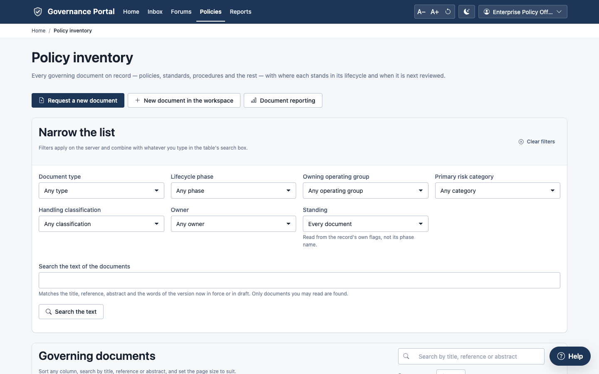

**Filters** (in **Narrow the list**): **Type**, **Lifecycle phase**, **Owning
operating group**, **Primary risk category**, **Handling** (Public,
Internal, Confidential, Restricted), and **Standing**:

| Standing | Shows |
|---|---|
| **Every document** | Everything you may read |
| **In force** | Published or implemented |
| **Open for editing** | Draft or in review |
| **Awaiting review** | In review |
| **Review overdue** | In force, past the next review date |
| **Review due within 90 days** | In force, due soon |
| **No review date set** | No next review date |
| **Regulatory-required** | Documents a regulation requires |
| **Training required** | Documents that carry a training obligation |


The table can be sorted and searched (**Search by title, reference or
abstract**), and it scrolls sideways to show every column. Click a row to open
the document.

**At the top of the register:**

- **Waiting on your decision** lists any approval steps assigned to you.
- **Request a new document** opens the request form (section 6.10).
- **New document in the workspace** (Policy Owners and the office) creates a
  document directly in the workspace.
- **Document reporting** opens the documents section of Reports.

> **Tip.** The filters are kept in the page address. Reloading, going back,
> bookmarking or sending the link shows the same filtered list, for example
> `/policies?standing=overdue` or `/policies?lifecycle_phase=Review`.

---

## 6.2 A document's page

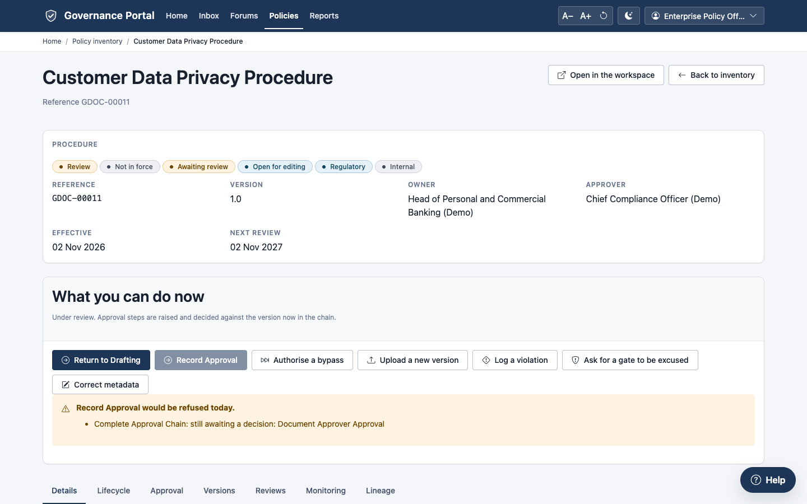

**The summary** shows the type, the phase, and flags: **In force**,
**Awaiting review**, **Open for editing**, **Review overdue**, **Regulatory**,
and the handling class. It also gives the reference, version, owner, approver,
effective date and next review date.

**At the top right:** **Open in the workspace**, **Back to inventory** and,
for Consilium Audit and administrators, **Export evidence pack** (section 6.14).

**What you can do now** has two kinds of button:

- **Lifecycle actions** (dark buttons, for example **Record Approval**), taken
  from the configured workflow. They are offered only to the role that takes
  them.
- **Shortcuts** (light buttons, for example **Upload a new version** or **Log a
  violation**). Each opens the tab where that form is.

If an action would be refused today, the card says so and names the gate. The
button is disabled.

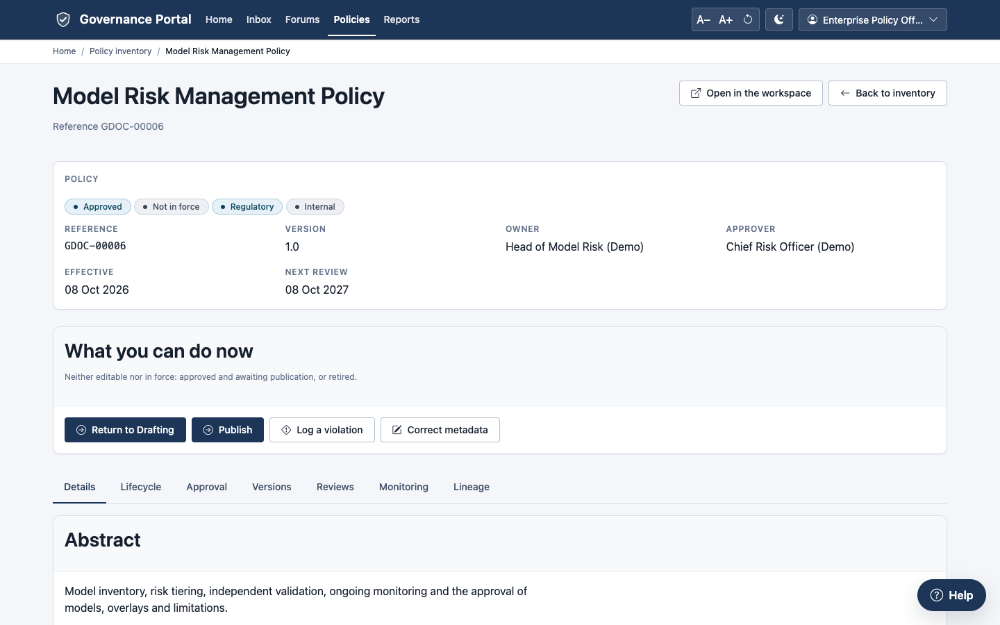

A reader with no part to play sees the same page, read only:

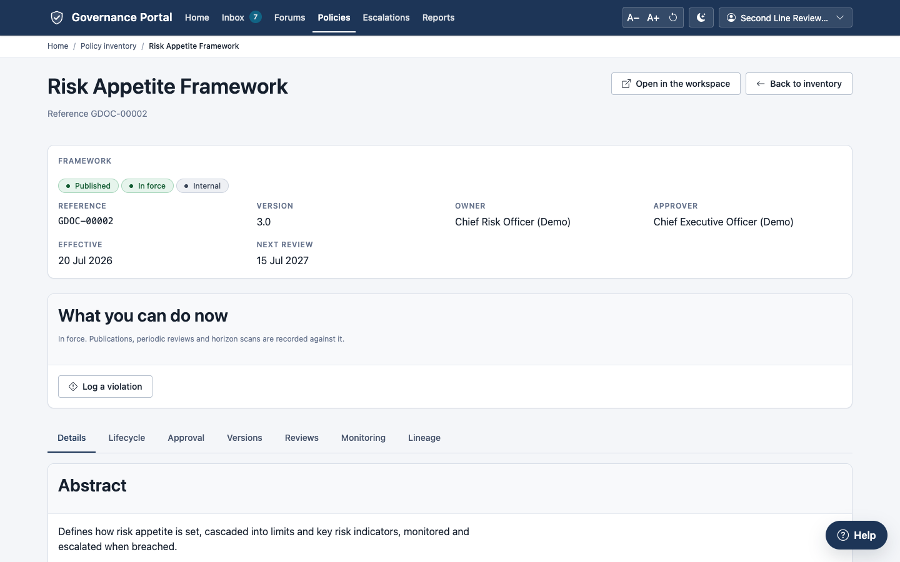

### The tabs

| Tab | What it shows |
|---|---|
| **Details** | Abstract; the record; accountability (owner, approver, sponsor, liaison, delegate, key contacts, monitors, partners); scope; applicability; regulatory references; handling (classification, and whether download, printing and sharing are allowed); definitions in force for the document; **Correct metadata** (section 6.13); and the **Impact** panel (section 6.11). |
| **Lifecycle** | Where it stands (the phases in configured order); its flags; **Every action configured from here**: who takes each action, whether it is open to you, and what would refuse it today. |
| **Approval** | The approval chain (complete or not), the approval steps for the current version, your decision form if a step is yours, earlier versions' decisions, and exceptions. |
| **Versions** | The version chain (with **View**); forms to upload a version and to revert; publications, and the form to record one; record changes. |
| **Reviews** | Review cycles and horizon scanning, with their forms. |
| **Monitoring** | Monitoring activities and results, and violations, with their forms. |
| **Lineage** | Parents, ancestors, children and addenda, descendants; relationships. |

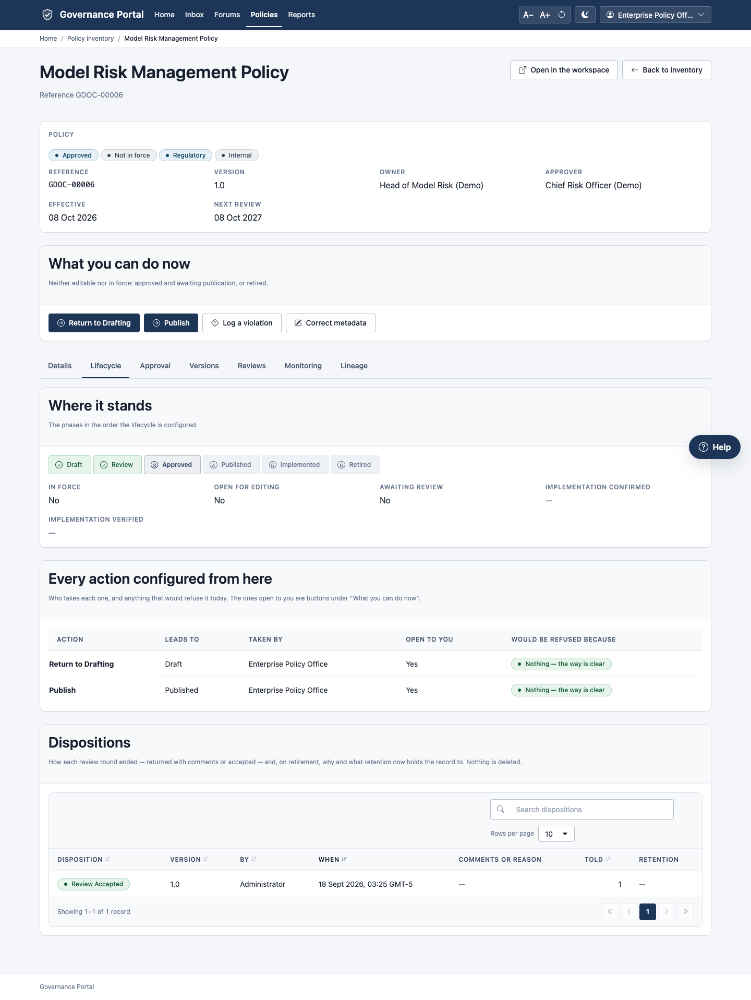

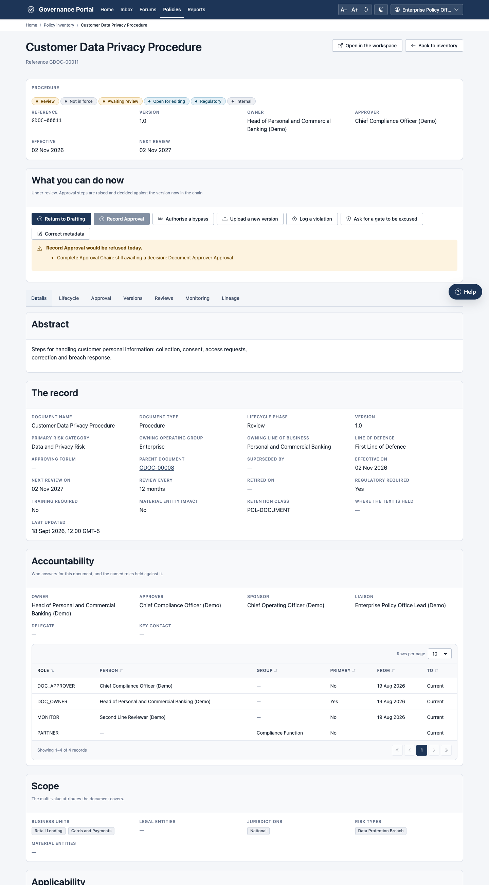

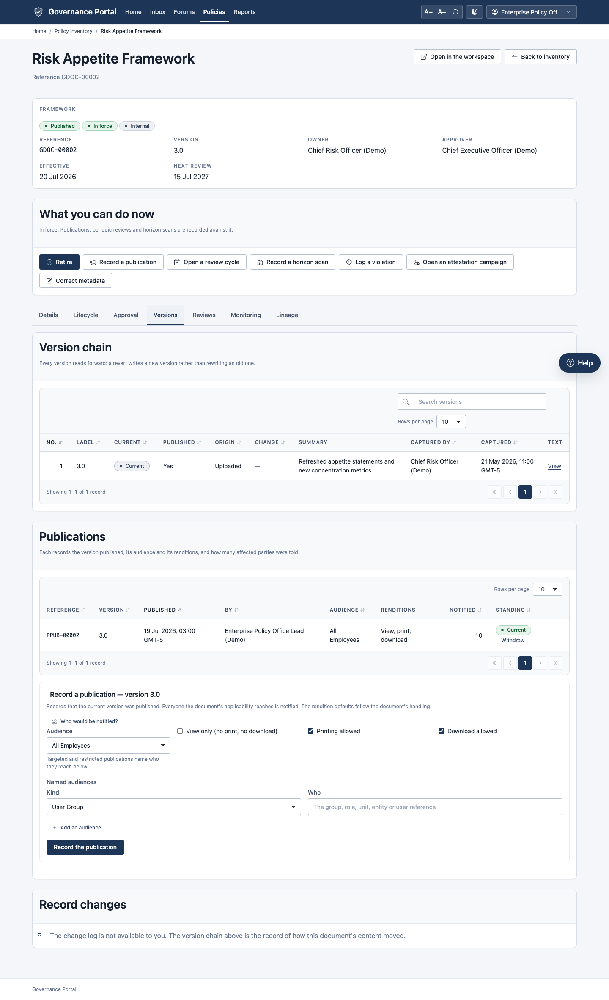

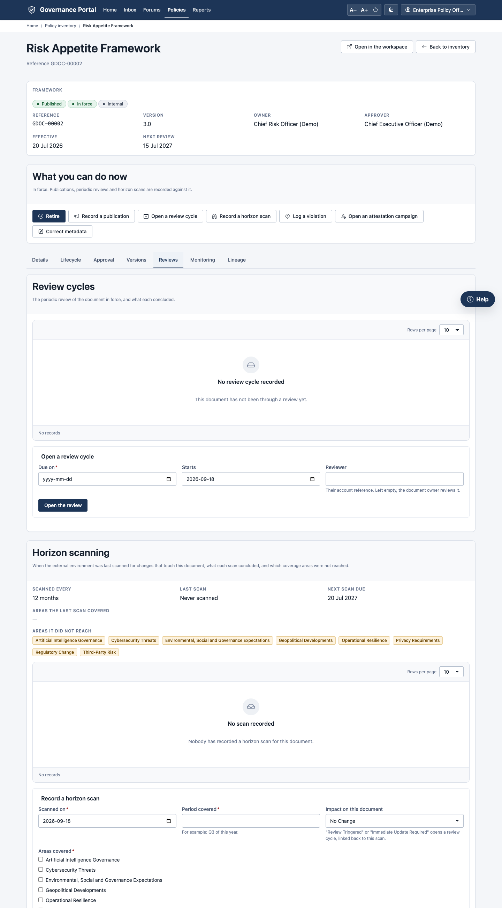

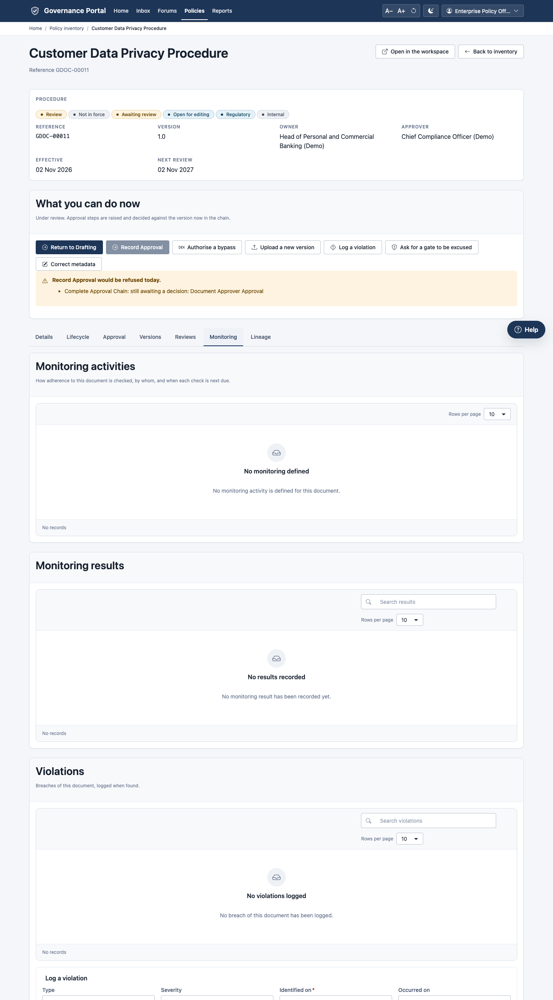

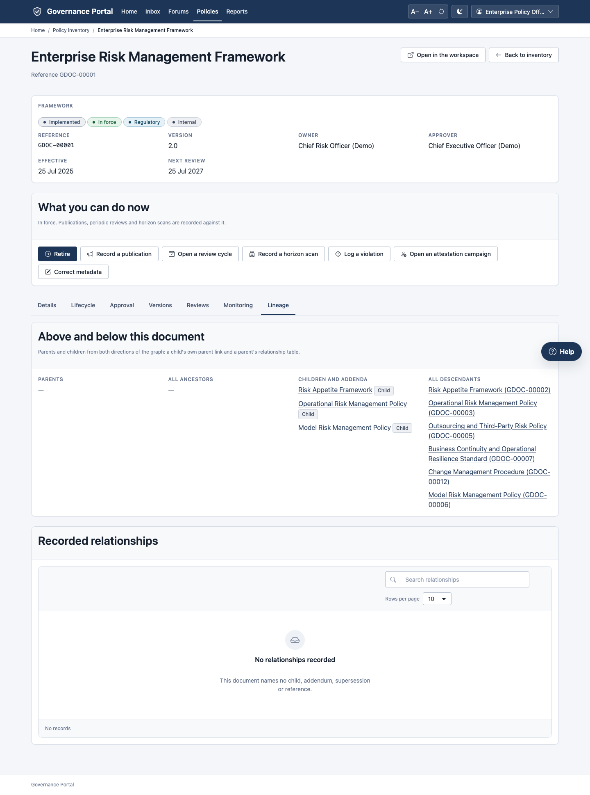

---

## 6.3 Taking a lifecycle action

1. Open the document. Under **What you can do now**, click the action, for
   example **Submit for Review** or **Record Approval**.
2. A panel explains the move ("This moves the document from Review to
   Approved…") and says that every gate is checked again when you confirm.
3. Click **Confirm: *action***, or **Cancel**.

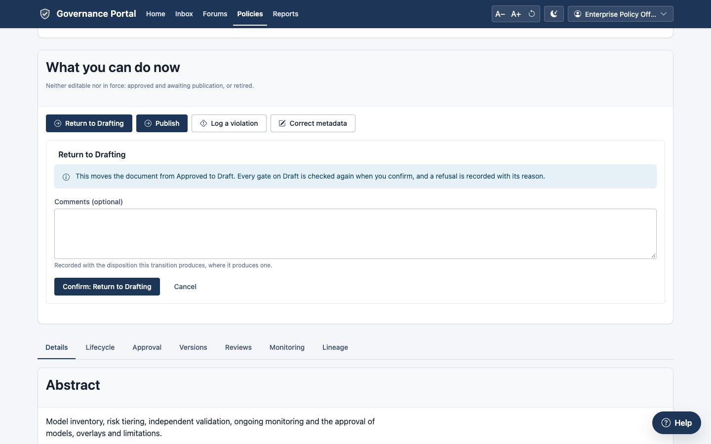

**What happens next.** The document moves to the new phase and its flags
change. For example, **In force** appears on publication, and **Open for
editing** disappears on approval. The move is recorded in its history. If a
gate refuses the move, the page shows **Not done** with the reason, and the
refusal is logged.

**When a gate would refuse the move**, the card says so before you try:
"*Action* would be refused today.", with each gate that fails. The button is
disabled. For example, **Record Approval** stays disabled until every
approval step for the current version has been decided (section 6.4):

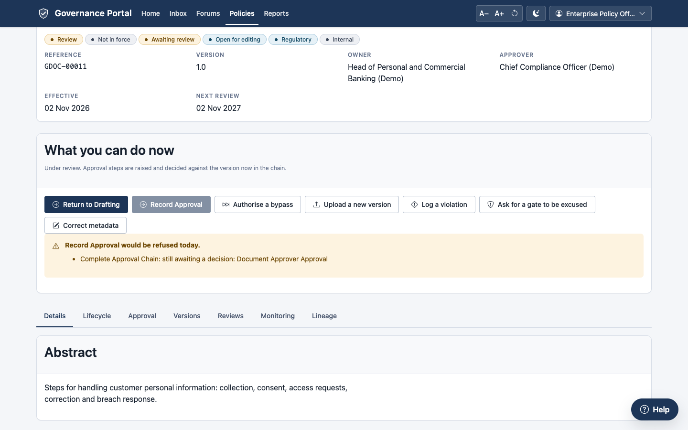

### Passing a gate by exception

A move that a gate refuses can still be made, **with a written, approved
exception**. The person asking and the person approving must be different
people.

1. **Ask** (Policy Owner or Enterprise Policy Office). On the **Approval** tab,
   the **Exceptions** card has **Ask for a gate to be excused**. It lists
   what is refused today. Write the **Justification\***, optionally a **Valid
   to** date, and click **Ask for the exception**. "Exception requested; the
   policy office approves it." This is offered only while a gate is failing.

   

2. **Approve** (Enterprise Policy Office, never the person who asked). Under
   **Waiting for approval**, click **Approve this exception**. The requester is
   told.
3. **Use it.** The action's card now says "An approved exception
   authorisation is recorded for this document; you may name it to proceed."
   In the confirmation panel, choose it under **Exception authorisation that
   excuses the refusal** (only approved, unexpired authorisations for this
   document are listed), and confirm. The move goes ahead, citing the
   exception.

The server checks the authorisation again when you confirm. It must be for
this document, approved, unexpired, and approved by an Enterprise Policy
Office member who is not the requester.

> **Publish does not notify anyone by itself.** After **Publish**, the Enterprise
> Policy Office records the publication, with its audience (section 6.6).
> **Confirm Implementation** is refused until a publication has been recorded.

---

## 6.4 Approvals

Approvals are given **against a version**. The steps come from the configured
**approval route** ([chapter 11](11-configuring-workflows.md), section 11.5).
The route is chosen by the document's type, its change classification (major
or minor, from its request), its risk category and its handling. The
demonstration site has three routes:

- **Major Change Route**: first line, second line and policy office approval;
- **Minor Change Route**: document approver only;
- **Default Route**: document approver and policy office.

### Raising the steps (Policy Owner or Enterprise Policy Office, in Review)

1. Open the **Approval** tab. The route and the steps not yet raised are
   listed.
2. Click **Raise approval steps**. Each step is assigned (to the document's
   approver, sponsor, liaison, the parent document's owner, or a named person),
   and each approver is told.

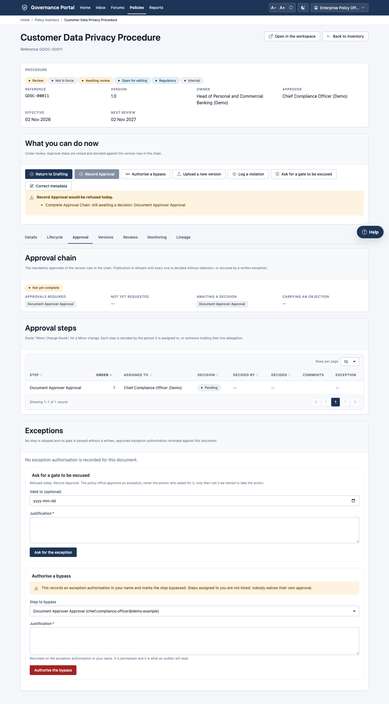

### Deciding a step (the approver)

1. Open the document from your Inbox or from **Waiting on your decision**.
2. On the **Approval** tab, under **Your decision**, choose **Approved**,
   **Rejected** or **Changes Requested**. A reason is required unless you
   approve.
3. Click **Record decision**. The owner is told.

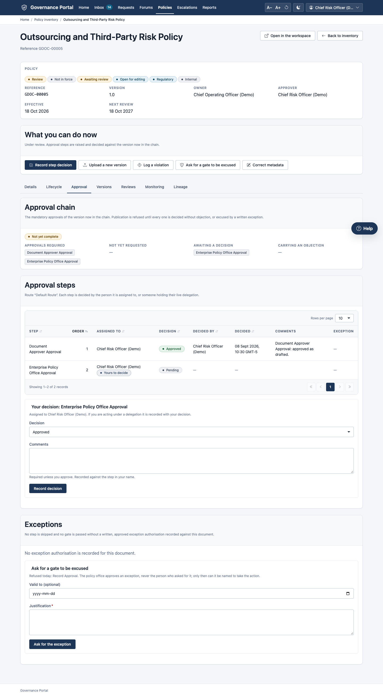

- A **sequential** step can be decided only after the steps ahead of it:
  "… is sequential and cannot be decided yet: … must be decided first."
- **Changes Requested** leaves the step open.
- **Rejected** closes it as an objection, which blocks publication.

### Bypassing a step (Enterprise Policy Office)

When a step cannot be decided normally:

1. Under **Authorise a bypass**, choose the step and write the
   **Justification**.
2. Click **Authorise the bypass**.

This records an Exception Authorisation in your name. You cannot bypass a
step assigned to yourself.

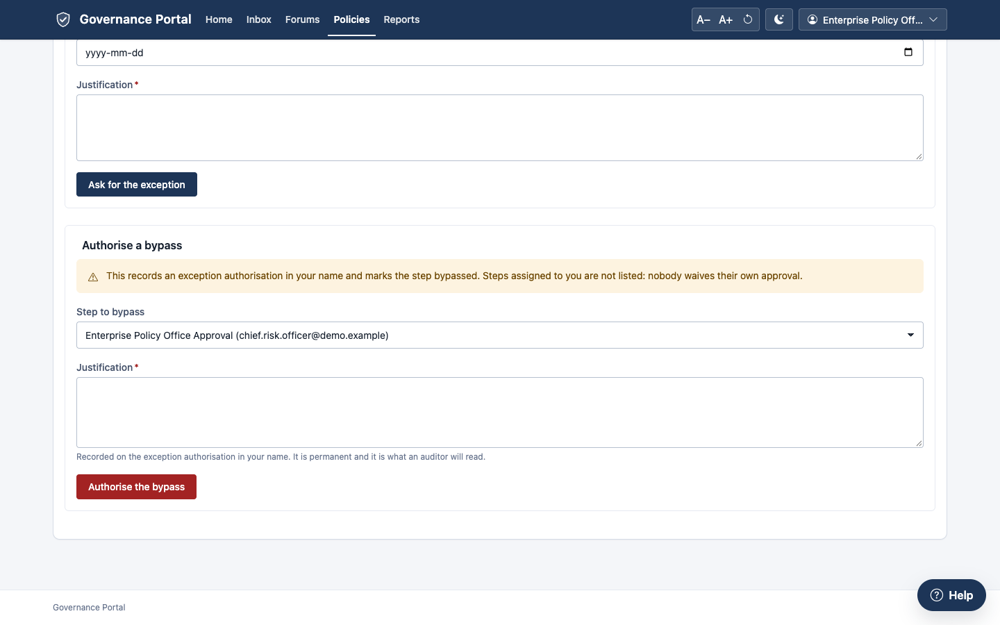

> **Upload a new version during Review and the approvals start again.** Steps
> raised on the previous version no longer count. Raise them again for the new
> version.

---

## 6.5 Versions and the document viewer

The **version chain** is the authoritative record of what the document said.
Versions are added, never overwritten.

**Uploading a new version** (Policy Owner or the office, while the document is
in Draft or Review):

1. Open the **Versions** tab. (Or click **Upload a new version**.)
2. Give a **Version label** (optional), then choose a **File**, **or** type the
   text itself.
3. Write **What changed, and why**. This is required.
4. Click **Add the version**.

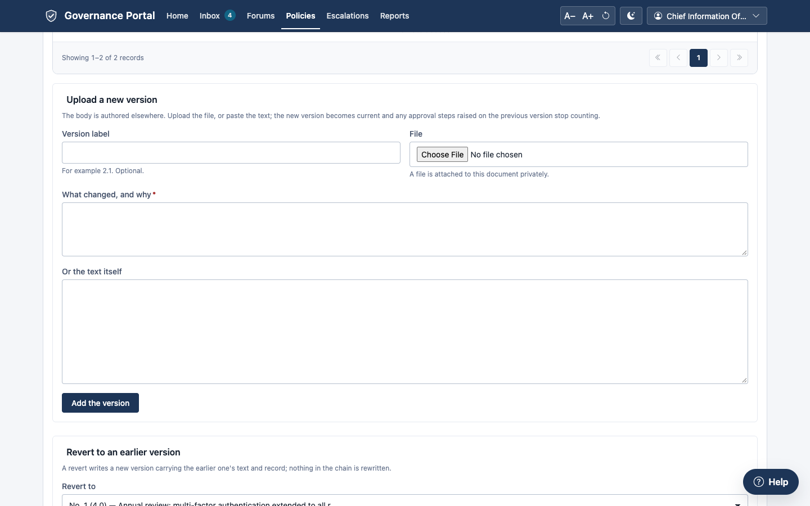

**Reverting to an earlier version:**

1. Under **Revert to an earlier version**, choose the version.
2. Write **Why**.
3. Click **Revert**.

A revert writes a *new* version carrying the old text; history is never
rewritten. A version captured in a different phase cannot be reverted to,
and the form says why.

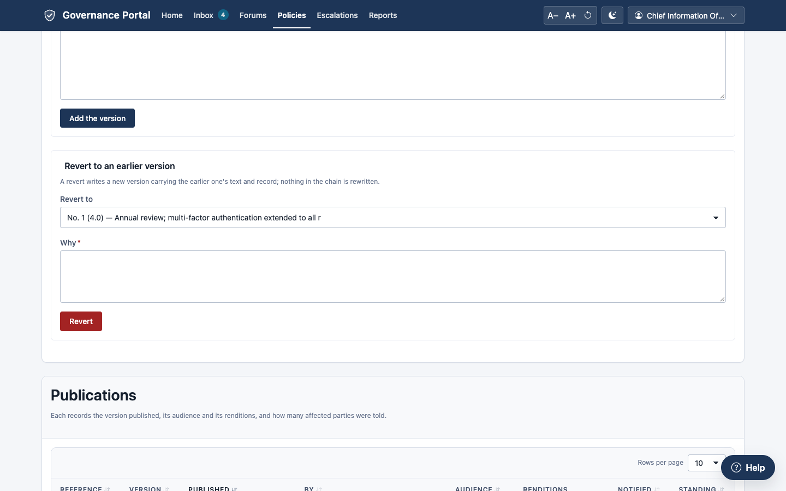

**Reading a version.** Click **View** in the version chain. The **document
viewer** shows the body (a PDF, image or text), the version's details, the
other versions, and the definitions of glossary terms used in it.

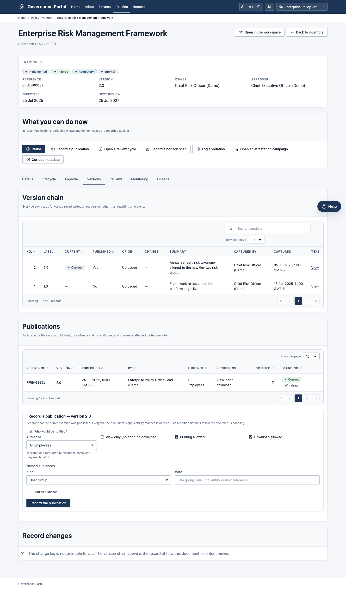

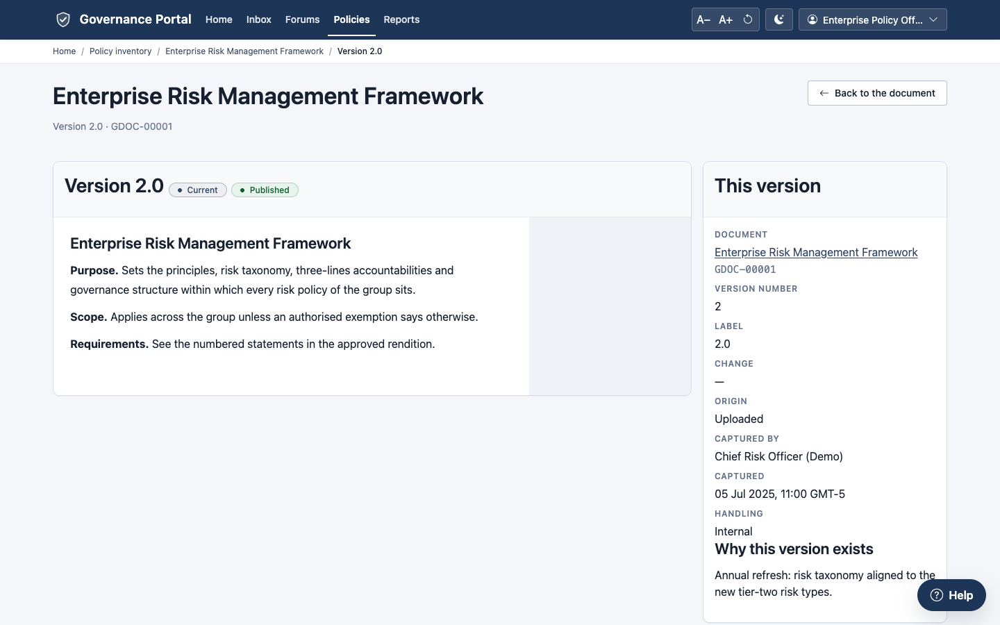

**Confidential and restricted documents.** The viewer shows the handling: for
example "View only: download and printing are not offered." Restricted
documents carry a watermark with your name and the time. Every view is
recorded.

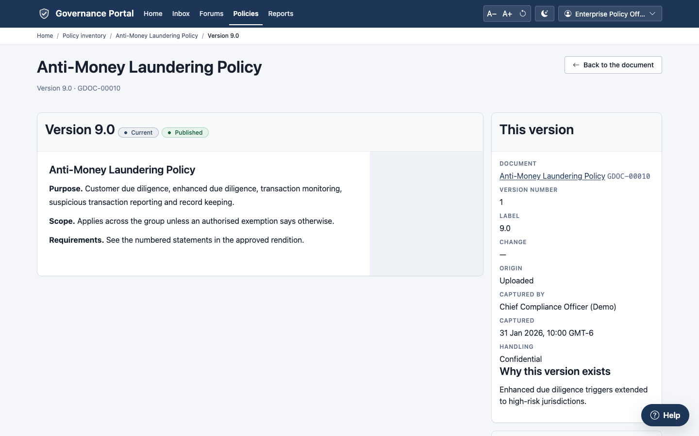

---

## 6.6 Publication

**Recording a publication** (Enterprise Policy Office, once the document is
Published or Implemented):

1. Open the **Versions** tab. Under **Record a publication**, click **Who
   would be notified?** to preview the audience: how many people, who they are,
   and any exemptions.
2. Choose the **Audience**: **All Employees**, **Restricted** or **Targeted
   Groups**.
3. Set the rendition: **View only (no print, no download)**, **Printing
   allowed**, **Download allowed**.
4. Add **Named audiences** if needed (a user group, role, organisation unit,
   legal entity or user).
5. Click **Record the publication**.

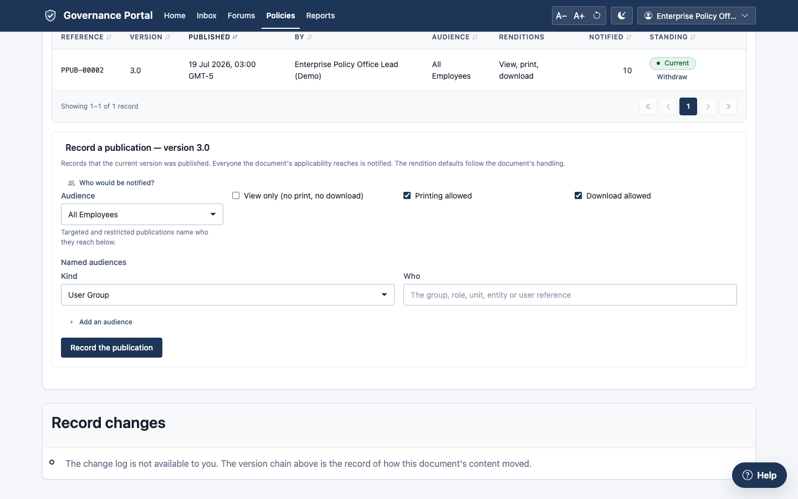

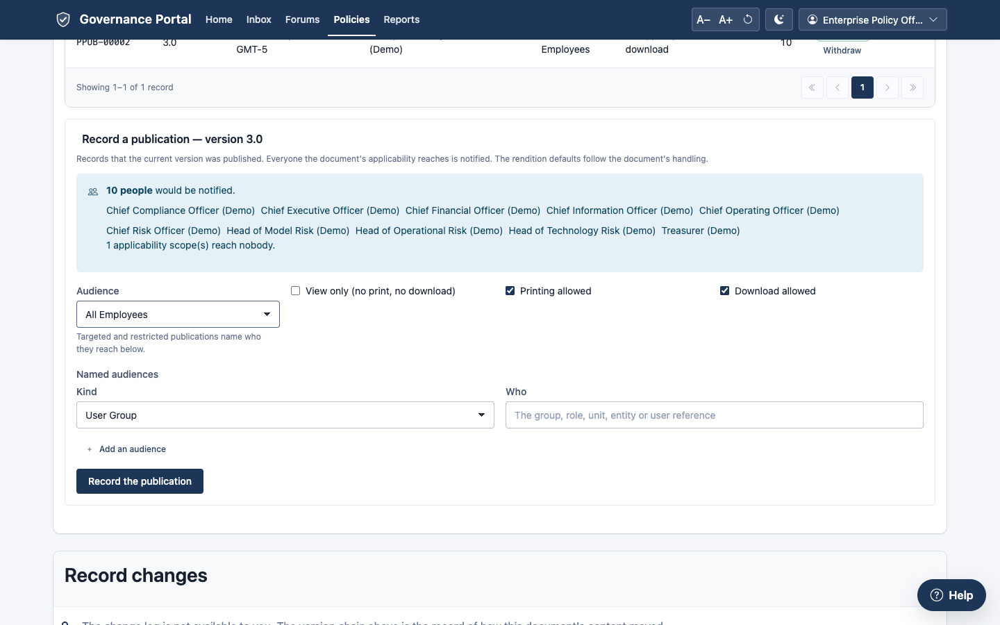

**What happens next.** The current version is marked published. Everyone
reached through the document's applicability is notified, except those under
an authorised exemption. The publication appears in the list, where it can be
**Withdrawn** later (it stays on the record, marked withdrawn).

---

## 6.7 Periodic review

Each document has a review frequency, and a **Next review** date derived from
it.

**Opening a review cycle** (Policy Owner or office, document in force, no
cycle already open): on the **Reviews** tab, give **Due on**, optionally
**Starts** and a **Reviewer**, and click **Open the review**.

**Concluding it:** choose the cycle, the **Outcome** (**No Change**, **Minor
Update**, **Major Update** or **Retire**), write **What the review found**,
and click **Conclude the review**. The next review date moves forward by the
review frequency.

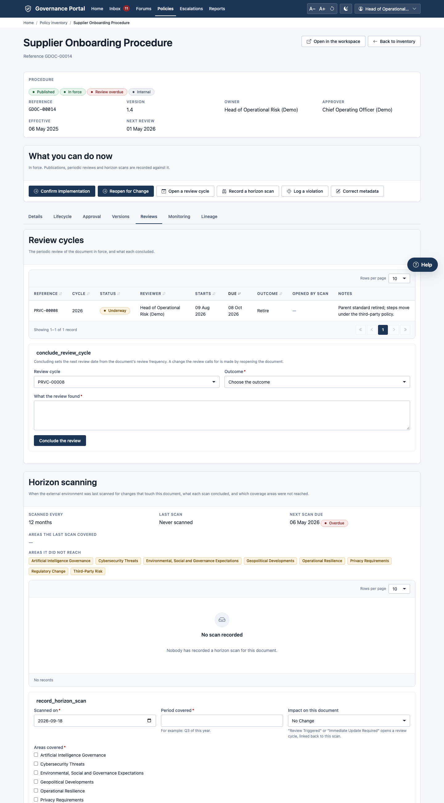

> A review that calls for a change does not reopen the document. Use **Reopen
> for Change** to do that.

---

## 6.8 Horizon scanning

The owner periodically looks for regulatory, technological, operational,
environmental and geopolitical change that may affect the document. The
**Reviews** tab shows the scanning cadence, the last scan, the next scan due,
and any areas not yet covered.

**Recording a scan** (Policy Owner or office, document in force):

1. Fill in **Scanned on**, **Period covered**, the **Impact on this document**
   (**No Change**, **Review Triggered**, **Immediate Update Required**) and
   the **Areas covered**.
2. Write **What you read, and what you concluded**.
3. Add at least one **Source reviewed** (kind, reference, date).
4. Click **Record the scan**.

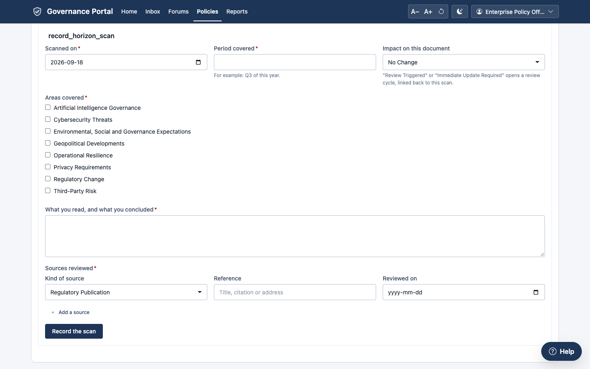

A scan whose impact is **Review Triggered** or **Immediate Update Required**
opens a review cycle automatically.

---

## 6.9 Monitoring and violations

**Monitoring activities** are defined in the workspace (*Policy → Monitoring
Activity*). The **Monitoring** tab lists them, with their results.

**Recording a monitoring result:** click **Record a result** on the activity
row. Give the **Period**, when it was **Performed on**, the **Outcome**
(**Effective**, **Partially Effective**, **Not Effective**, **Not
Performed**) and the **Findings**. Then click **Record the result**.

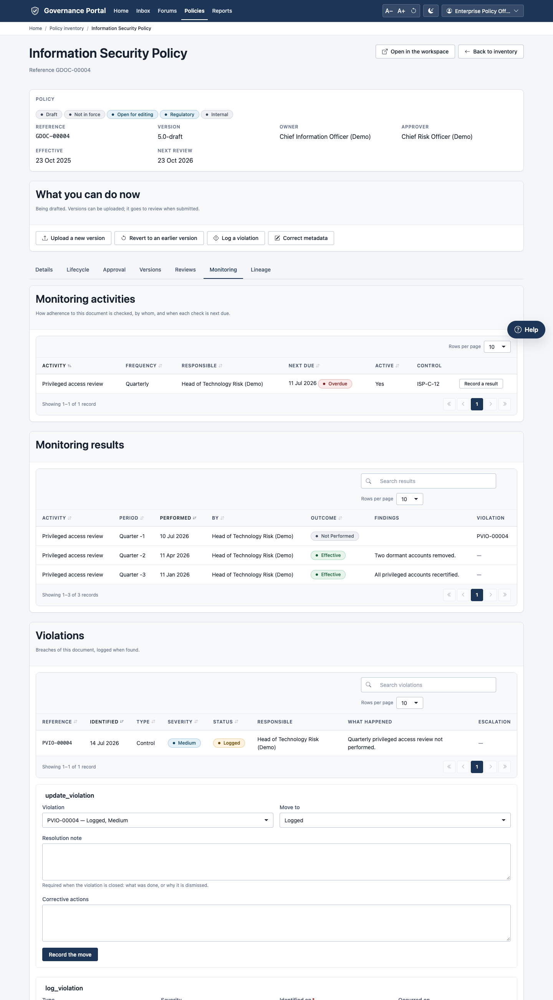

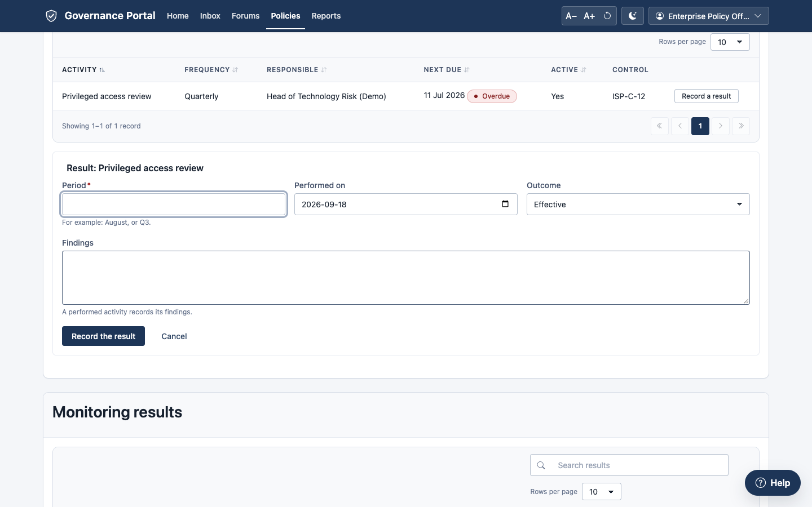

**Logging a violation** (Policy Owner, Policy Reviewer or office):

1. Click **Log a violation**, or open the **Monitoring** tab.
2. Choose the **Type** and **Severity**, the dates, and the **Responsible
   party**.
3. Describe **What happened** and any **Corrective actions**.
4. Click **Log the violation**.

The violation starts as **Logged**. Its later status changes (**Under
Investigation**, **Remediating**, **Resolved**, **Dismissed**) are made in the
workspace (*Policy → Policy Violation*).

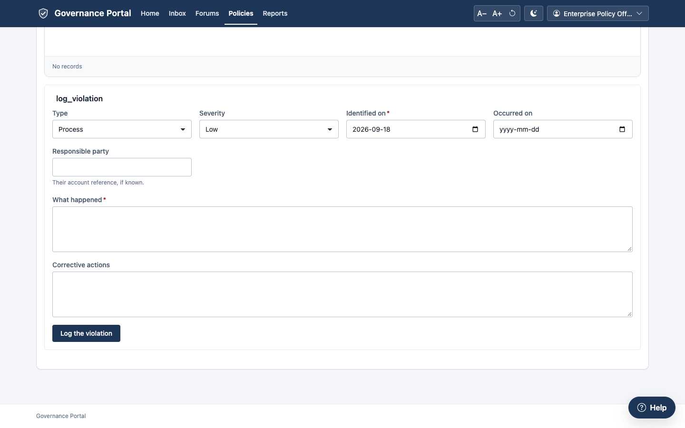

---

## 6.10 Document requests and classification (intake)

Every new document, and every change to or retirement of one, starts as a
**document request**. The request is **classified** as a **major** or
**minor** change by answering a short set of questions. The classification
then decides the approval route and the time limit.

**Raising a request** (Policy Owner or office):

1. Open **Policies → Request a new document** (or go to `/policy-intake`).
2. Choose the **Kind of request**: **Create**, **Change** or **Retire**.
3. For Create, give the **Proposed document name** and **Document type**. For
   Change or Retire, choose the **Document it concerns**.
4. Optionally choose a **Primary risk category** and **Wanted in effect by**.
5. Explain **Why it is needed**. The policy office reads this first.
6. Click **Raise the request**.

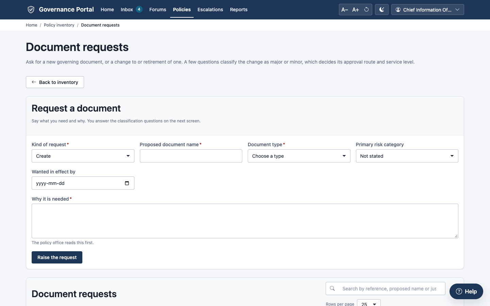

**Classifying it** (the requester or the office):

1. Open the request. Under **Classification**, answer each question. Some
   questions appear only when an earlier answer calls for them.
2. Click **Classify**.


**What happens next.** The outcome (**Major** or **Minor**) is recorded
together with the rule that fired and the rule set's version. **How each rule
was evaluated** shows the full trace. A time-limit clock starts. A later
change to the rules does not change this classification.

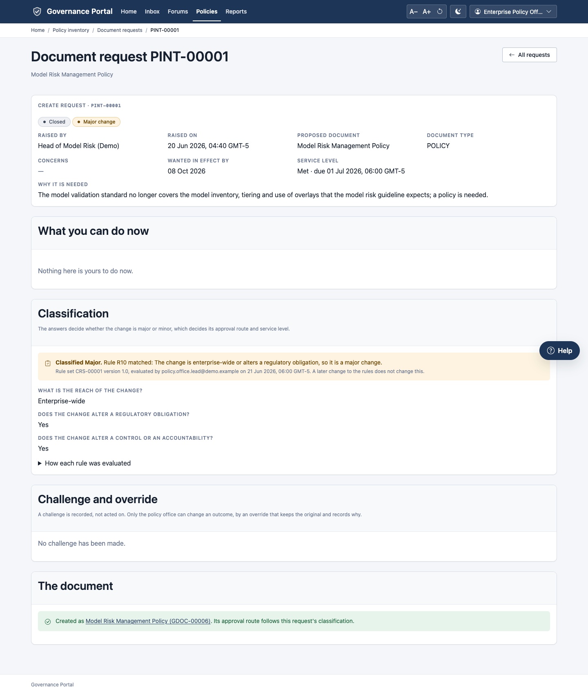

**Challenging and overriding.** If the outcome looks wrong:

- the requester or office can **Record the challenge** (once), with a
  statement;
- the Enterprise Policy Office can **Override** it, with a justification. The
  original outcome is kept alongside the override.


**Creating the document** (Enterprise Policy Office, for a classified Create
request): under **The document**, confirm the name, type, owning operating
group, primary risk category, owner, approver and handling. Then click
**Create the document**. It is created in **Draft**. Its approval route
follows the request's classification.

**Withdrawing:** the requester or the office can withdraw an open request,
with a reason.

---

## 6.11 Impact of a change, and regulatory updates

**Impact of a change.** The **Impact** panel at the foot of a document's
**Details** tab (also on its own page, `/policy-impact?name=…`) shows what a
change would reach:

- lineage;
- who is affected;
- regulatory references;
- approving forums;
- monitoring;
- open violations and escalations.

It also gives a reach score and rule-based review points. Choose a
**Proposed version**, or describe **The change, in a sentence**, and click
**Assess the impact**. Anyone who may read the document can use it. Only
records you may read are counted.

If your administrator has switched on AI assistance, **Ask the AI service for
a narrative and review points** adds a commentary. It is labelled
"Machine-generated", and nothing is written to any record.

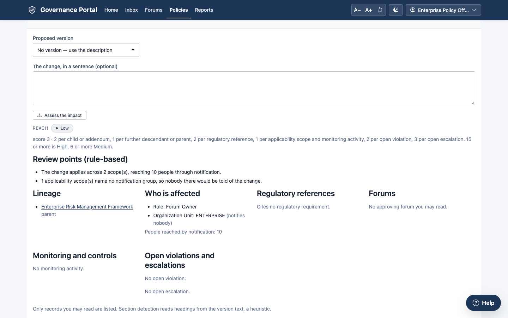

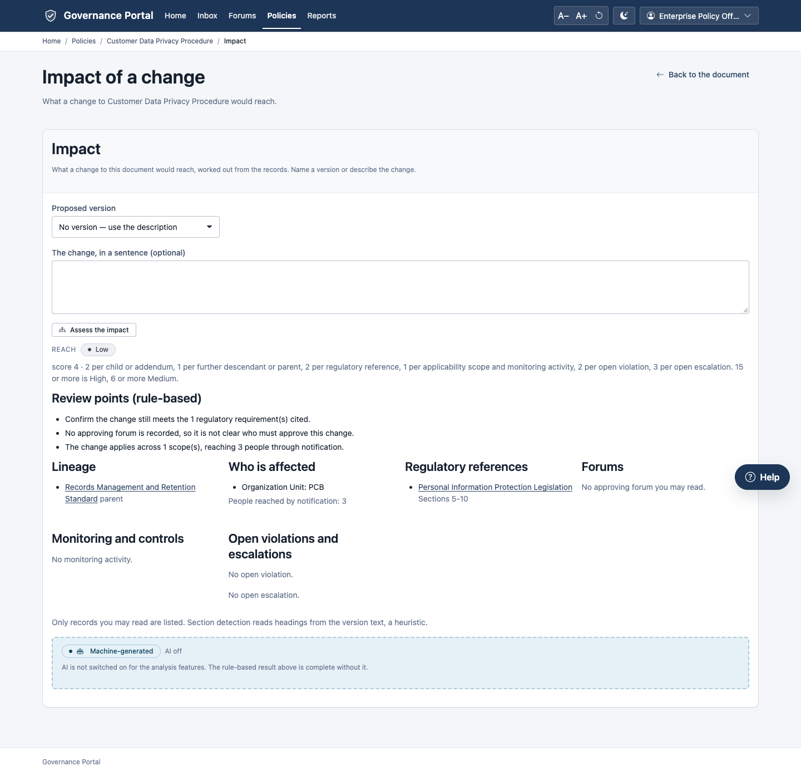

**Regulatory updates.** When a regulatory requirement changes, the owner of
every document and forum citing it is notified. The **Regulatory updates**
page lists requirements, records a change, and shows what is directly and
possibly affected. See [chapter 9](09-reports.md).

---

## 6.12 The glossary, templates, exemptions and approval routes

These are maintained in the workspace, under **Policy**:

| List | What it is |
|---|---|
| **Glossary Term** | Approved definitions, enterprise-wide or for one document. Terms are versioned. A term marked to enforce its usage causes a document using disallowed wording to be refused on save. |
| **Document Template** | Templates per document type and action. They carry the naming convention (for example "&lt;Subject&gt; Standard") and the required metadata. A document whose name does not follow its template's convention is refused. |
| **Applicability Exemption** | A formal, time-bounded release from a document for a named scope. It moves through Requested, Endorsed, Authorised, Refused, Withdrawn and Lapsed. |
| **Approval Route**, **Document Lifecycle Gate** | Configuration ([chapter 11](11-configuring-workflows.md)). |

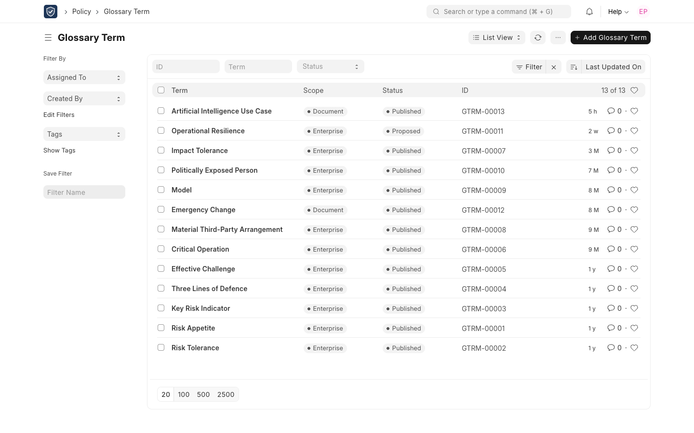

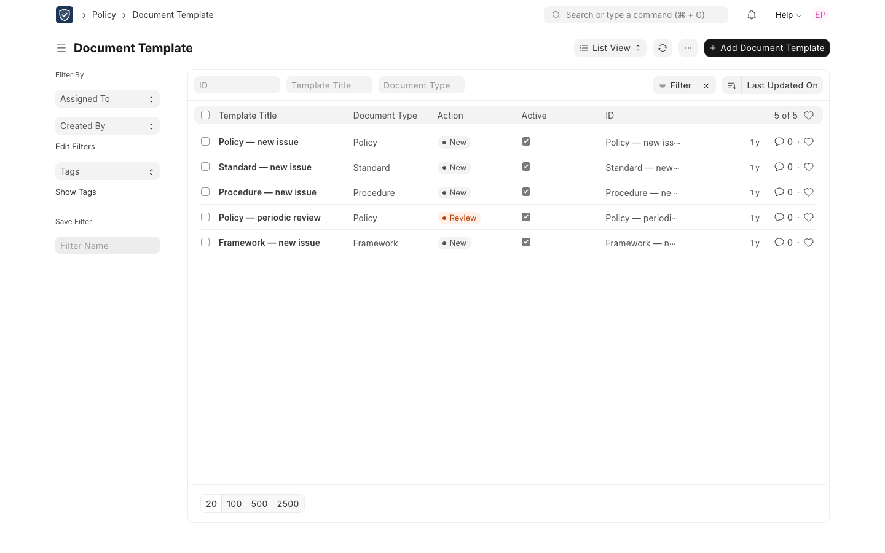

---

## 6.13 Correcting metadata

A field on a document's record may be wrong or missing, for example a mistyped
owner or a missing risk category. The **Correct metadata** card on the
**Details** tab (or the **Correct metadata** button under **What you can do
now**) puts it right **at any stage, including on a published document**.

**Who:** the Policy Owner or the Enterprise Policy Office. Everyone else sees
"Corrections are made by the owner of the document or the policy office."

1. Under **Correct a field**, choose the **Field**. Fields that are missing
   are listed first and marked **(missing)**; required ones are marked
   **(required)**.
2. Give the **New value**. The help beneath shows the current value ("Now:
   …"). Lists offer only active values, plus the current value marked
   **(retired)** if it has been retired.
3. Write **Why the value was wrong\***. It is kept on the record with the old
   and new values.
4. Click **Record the correction**. "Correction recorded; no new version was
   made."

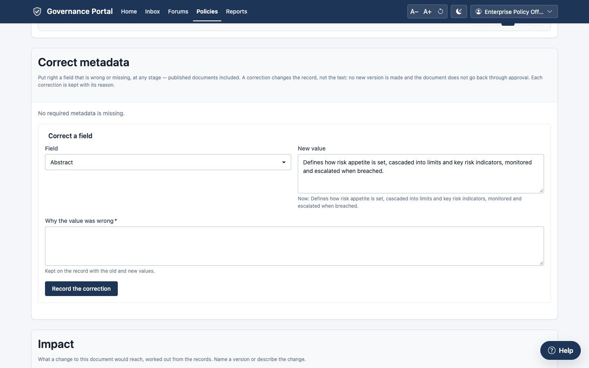

A correction changes the record, not the text. No new version is made, and the
document does **not** go back through approval. **Earlier corrections** lists
each one with its reason. The card also says whether any required metadata is
missing. Documents with missing required metadata are listed on **Reports →
Governing documents → Required metadata missing**. A document left pointing
at a retired value (for example a retired risk category) appears in its
owner's Inbox under **Metadata to correct**.

The phase, workflow state, flags, version, body text and implementation
sign-offs cannot be corrected here. They change only through the lifecycle.

---

## 6.14 Exporting an evidence pack

For an audit or a regulator, **Export evidence pack** (top right of a
document's page) downloads the whole record as one ZIP file,
`evidence-Governing Document-<reference>-<date>.zip`. It contains:

- the record itself (`record.json`);
- its history and its revisions;
- its approvals and exception authorisations;
- its refusals and notifications;
- its attachments. Files you may not read are left out and listed, and the
  total is capped at 200 MB.

A `manifest.json` gives a SHA-256 fingerprint for every file, so anyone can
check that the pack has not been altered. The button is shown to Consilium
Audit, Consilium Administrator and System Manager, and only for records they
may read. The same button is on forums and escalations.

---

## Common errors

| Message | What it means | What to do |
|---|---|---|
| "*Action* of GDOC-… is refused. *Gate*: *reason*" | A lifecycle gate refused the move. | Do what the gate asks (for example complete the approvals), or ask the office for an exception authorisation. |
| "Complete Approval Chain: no approval has been requested for: …" | Steps were not raised for the current version. | Raise approval steps (only possible in Review). |
| "Current Version Required: the document has no version in its chain" | No version was uploaded. | Upload one. |
| "Publication Record Required: no publication record exists" | You tried to confirm implementation before a publication was recorded. | The office records the publication. |
| "Required Metadata Complete: required metadata is missing: …" | The document's template requires fields that are empty. | Fill them in the workspace. |
| "… may not take the action "…" on GDOC-…. It belongs to: …" | Your roles do not include the action. | The message names the role. |
| ""…" is not available while GDOC-… is …" | Not at this stage. | Check the Lifecycle tab. |
| "… has no version in its chain. Approvals are given against a version, so upload one first." | No version to approve. | Upload a version. |
| "Every approval step for the current version … has already been raised." | Nothing left to raise. | Wait for the decisions. |
| "Approval step … was raised on an earlier version" | A new version was uploaded since. | Raise the steps again. |
| "A decision of "…" is recorded with its reason." | Rejected and Changes Requested need a reason. | Write one. |
| "A version needs a change summary" / "A version needs a body" | The upload form is incomplete. | Fill it in. |
| "… is not editable in its current state, so a new version cannot be taken." | Approved or in force. | Reopen for change first. |
| "… already has a review cycle open. Conclude it before opening another." | A cycle is open. | Conclude it. |
| "A scan records what was reviewed. Name at least one source." | No source given. | Add a source. |
| "The name "…" does not follow the naming convention for this document type. It should read …" | The template's naming convention. | Rename as the message shows. |
| "… uses wording the approved glossary does not allow: "x" …, use "y"." | An enforced glossary term. | Use the approved wording. |
| "Only the Enterprise Policy Office or an administrator may loosen the handling of a confidential or restricted document." | Handling can be tightened by the owner, not loosened. | Ask the office. |
| "No active classification rule set applies …" | Classification is not configured. | An administrator must activate a rule set (chapter 11). |

## Tips

- **Read the Lifecycle tab before you act.** Its table shows every action from
  the current phase, who takes it, and anything that would refuse it today.
- **Raise approval steps as soon as the document enters Review.** Both Record
  Approval and Publish require a complete approval chain, and sequential steps
  are decided one after another, so an early start saves time.
- **Publish, then record the publication.** The first changes the phase; the
  second tells the audience.
