# 7. Escalations

**Purpose.** An **escalation matter** is something that needs attention at a
defined level of authority: an incident, a limit breach, a regulatory matter,
an emerging risk, a policy breach. The platform covers its whole life:

- raising it, with its facts;
- setting its **severity** (from an approved **escalation matrix**, or by the
  person raising it);
- routing it to the forums that must decide, oversee or be informed;
- working it: action plans and risk acceptances;
- challenge by the second line;
- **closing** it against recorded criteria.

A time limit runs throughout.

**The statuses.**

| Status | Stage | Meaning |
|---|---|---|
| **Open** | Working | Raised; not yet started. |
| **In Progress** | Working | Being worked by the first line. |
| **Under Review** / **Pending Review** | In review | With the second line for challenge. The first line can still report progress on plans. |
| **Closed** | At rest | Resolved, with its outcome recorded. |
| **Closed — Tracked Externally** | At rest | Handed to another system, with that system's reference. |

**Who can do it.**

| To | You need |
|---|---|
| Read the register and a matter | Escalation Owner, Escalation Reviewer, Consilium Audit and others who may read escalations |
| Raise a matter; move its status while working; add and update action plans; propose risk acceptances and request their approval; change the pathway; record the closure; close | Escalation Owner |
| Move the status while in review; record a review round | Escalation Reviewer (not on a matter you are accountable for) |
| Decide a risk acceptance | The named approver (a Head of Risk Governance other than the requester and the accountable executive), or their delegate |
| Take ownership of a matter waiting in a queue | An Escalation Owner in the queue (holding its role, or a member of its group) |
| See sensitive matters | **Sensitive Escalation Access**, or being named on the matter |
| Configure the matrix, templates and time limits | Consilium Administrator ([chapter 11](11-configuring-workflows.md)) |

---

## 7.1 The register

Open **Escalations** in the top bar.

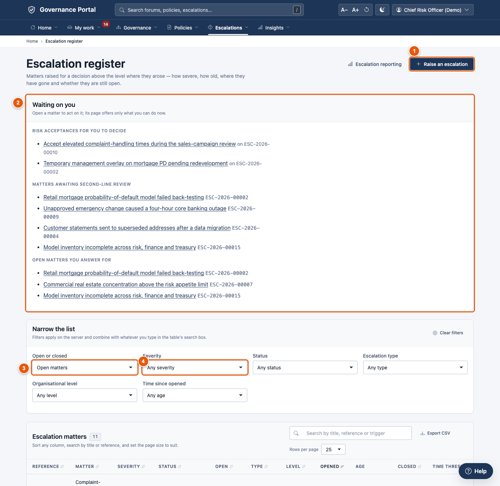

**Waiting on you** (at the top, when not empty) lists:

- risk acceptances for you to decide;
- matters awaiting your second-line review;
- open matters you answer for.

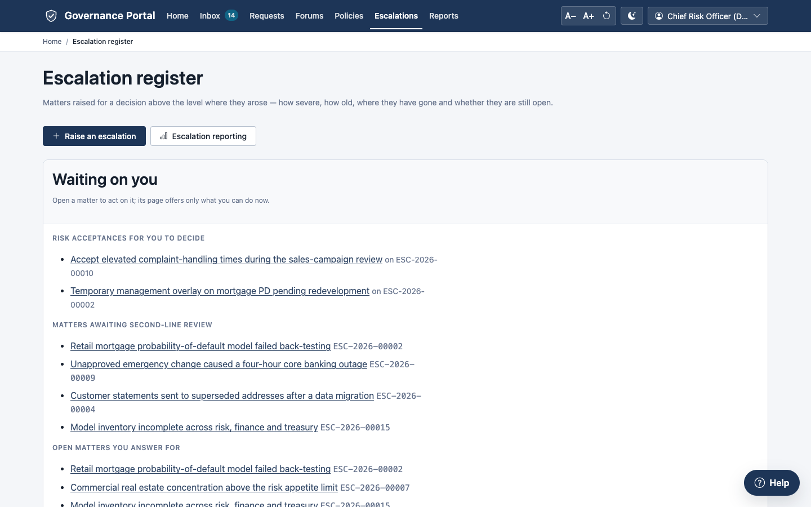

**Filters** (in **Narrow the list**):

| Filter | Choices |
|---|---|
| **Open or closed** | **Open matters** (default), **Open and closed**, **Closed only**, **Awaiting review**, **Open, time threshold breached**, **Time threshold breached, open or closed**, **Risk appetite breached**, **Raised automatically on a breach**, **Material entity impact** |
| **Severity** | High, Medium, Low |
| **Status** | The six statuses |
| **Escalation type** | Incident, limit breach, regulatory matter, emerging risk, policy breach… |
| **Organisational level** | Enterprise, operating group, line of business, business unit |
| **Time since opened** | 0–7, 8–30, 31–90, 91+ days |

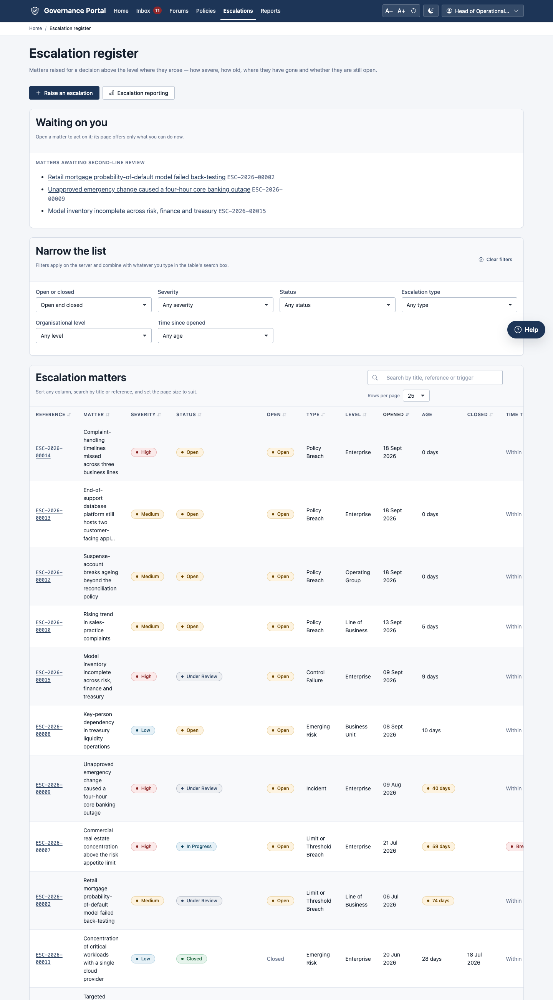

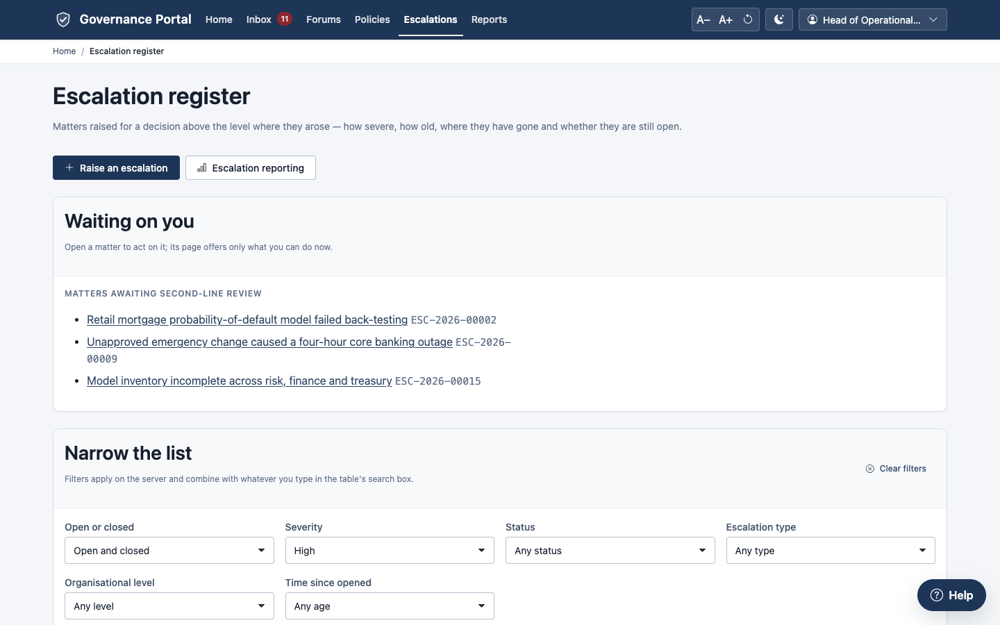

The table scrolls sideways to show every column. An open matter older than 30
days has an amber age, and one older than 90 days a red age. Click a row to
open the matter.

> **Tip.** The filters are kept in the page address, so a link such as
> `/escalations?severity=High&standing=all` opens the same filtered view, and
> reloading or going back keeps it.

---

## 7.2 Raising an escalation

1. On the register, click **Raise an escalation**.
2. Read **Before you start**. It explains the five stages (**You describe
   it → Routed by the matrix → Worked: plans, acceptances → Challenged by the
   second line → Closed against its criteria**).

   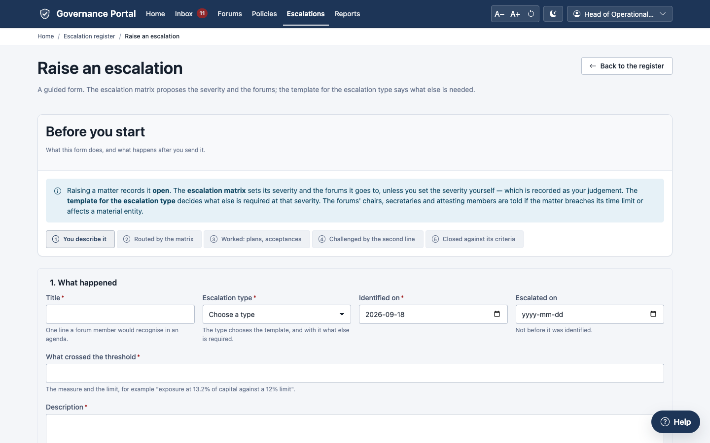

3. Fill in the sections. Fields marked **\*** are always required. Fields the
   **template** requires for this type and severity are marked as you go.

   | Section | Fields |
   |---|---|
   | **1. What happened** | **Title\***, **Escalation type\***, **Identified on\***, Escalated on, **What crossed the threshold\***, **Description\*** |
   | **2. The risk** | **Tier 1 risk type\***, Tier 2 risk type (filtered by tier 1), **Organisational level\***; tick if the board-approved **risk appetite has been breached**, if a **material entity is affected**, or if **the issue is systemic, not isolated** (section 7.12) |
   | **3. Who and what it touches** | **Identified by\***, **Accountable executive\***, Response owner, **Impacted entities\*** (at least one: kind, entity and impact) |
   | **4. Severity and where it goes** | **Severity**, and more forums on the pathway |
   | **5. Handling** | **Restricted handling** (only if you hold Sensitive Escalation Access) |

4. **Severity.** Leave it on **Let the escalation matrix decide**, and the
   box beneath shows what the matrix proposes as you fill in the form: the rule
   that matched, the severity, the forums the matter will be routed to, and
   the queue its ownership comes from. If you choose a severity yourself, it is
   recorded as a **manual override** and the matrix never changes it.

   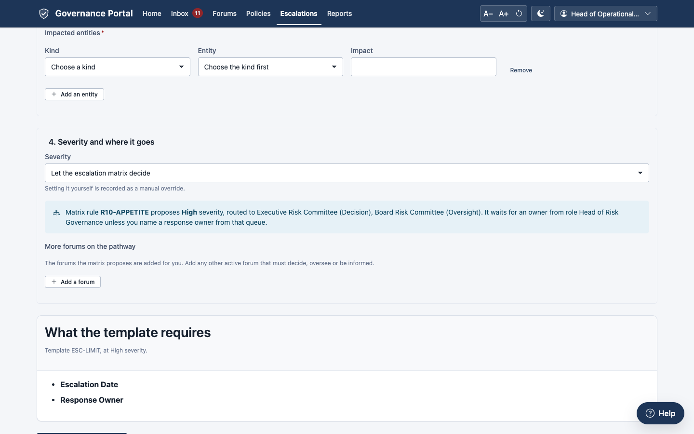

5. **What the template requires** lists the extra fields for this type and
   severity.
6. Click **Raise the escalation**. If anything is missing, the form lists it
   under "This matter is not ready to raise." and nothing is saved.

   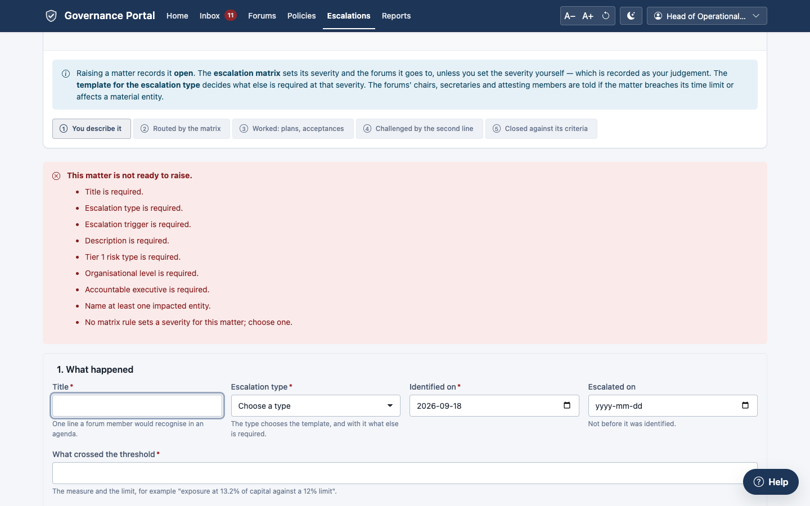

**What happens next.**

- The matter is created (ESC-…) with the status **Open**, and you are taken to
  its page.
- The matrix records the rule that fired, the severity, the time limit and the
  proposed forums.
- A **time-limit clock** starts from the date it was opened.
- **If you named no response owner**, the matter waits in the queue of the role
  the matrix names (for example Head of Risk Governance). Members of that role
  see it in their Inbox under **Escalations waiting for an owner**. Whoever
  takes it becomes its response owner (section 7.4, *Taking ownership*).
- If a material entity is affected, the named people, the pathway forums'
  chairs, secretaries and attesting members, and the rule's user groups are
  notified.

---

## 7.3 A matter's page

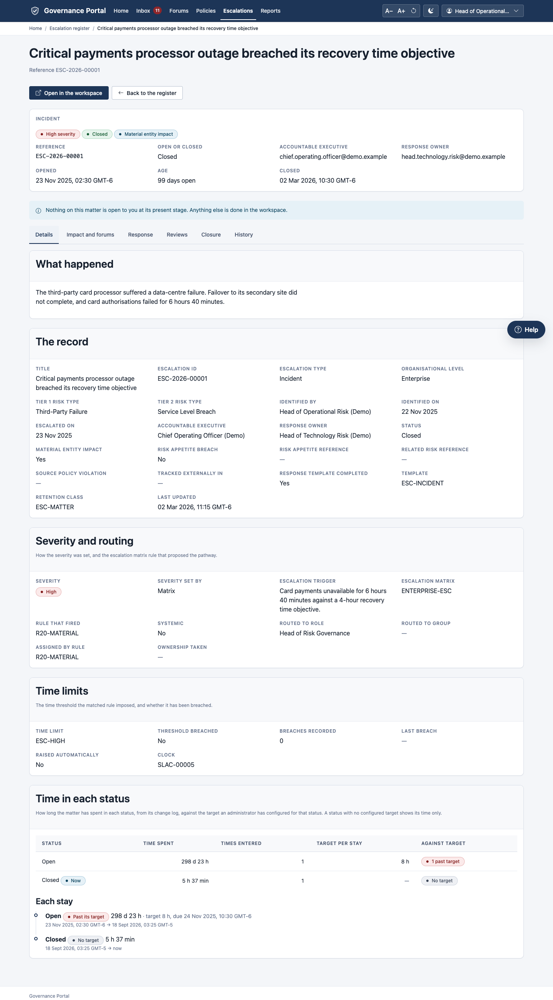

**The summary** shows the type, and pills for severity, status, **Awaiting
review**, **Time threshold breached**, **Risk appetite breached**,
**Material entity impact** and **Restricted handling**. It also gives the
reference, accountable executive, response owner, when it was opened, its age
and when it closed.

**What you can do now** offers only the actions open to you at the matter's
stage. The subtitle says whose stage it is.

| Tab | What it shows |
|---|---|
| **Details** | What happened; the full record; **Severity and routing** (severity, who set it, the matrix and the rule that fired); **Time limits** (the limit, whether it was breached, breaches recorded, the clock); **Time in each status** (section 7.9). |
| **Impact and forums** | Impacted entities; the forums on the pathway, their role, threshold and protocol; **Who a notice reaches**. |
| **Response** | Action plans and risk acceptances. |
| **Reviews** | Second-line review rounds and their outcomes. |
| **Closure** | How it ended, against which criteria. |
| **History** | Revisions (with **Revert to this version**), and the **Record history** (section 7.10). |

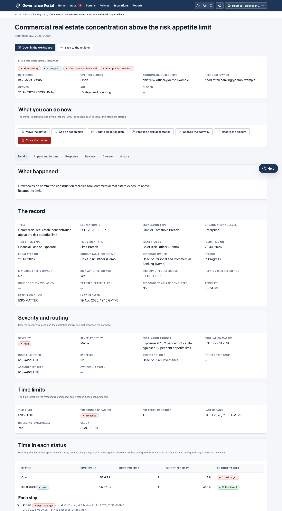

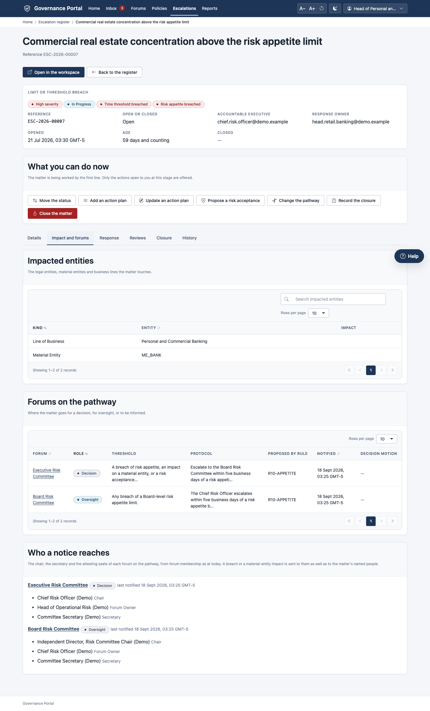

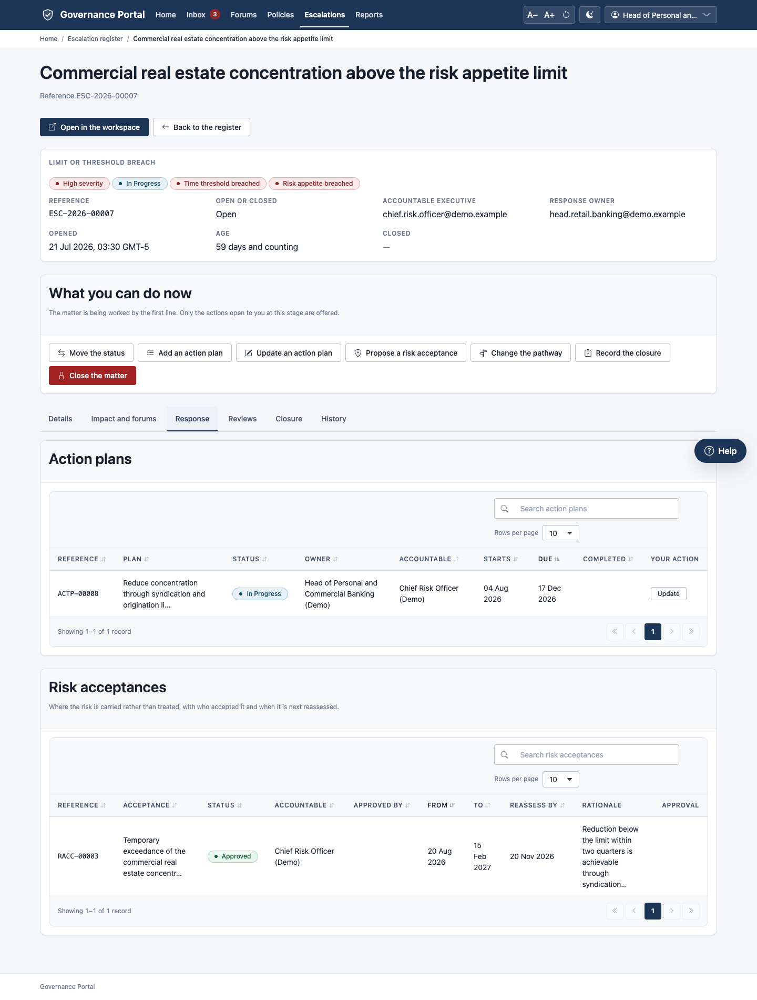

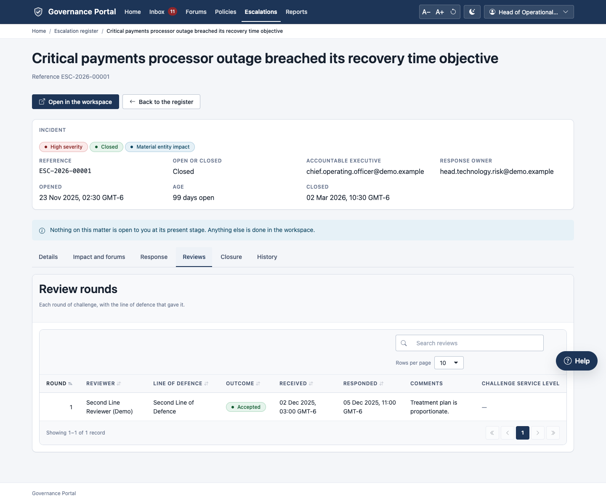

---

## 7.4 Working a matter (the first line)

### Taking ownership from a queue

A matter raised with no response owner waits in the **queue** the matrix
names: a role (such as Head of Risk Governance) or a user group (such as the
Risk Management Function). Everyone in the queue is told, and the matter
appears in their Inbox under **Escalations waiting for an owner**. Each entry
says where it was routed, its severity, and whether it is systemic.

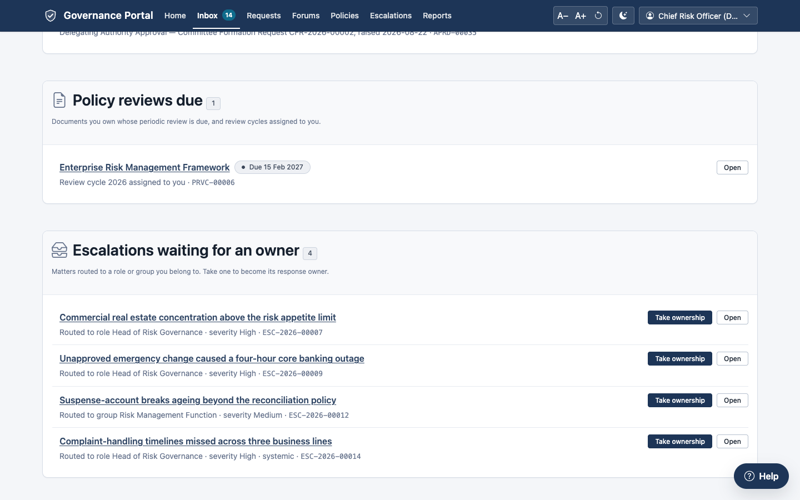

1. Click **Take ownership**, in the Inbox or on the matter's page.
2. Confirm: "Take ownership of this matter? You become its response owner and
   it leaves the queue."
3. "You now own the response to …"

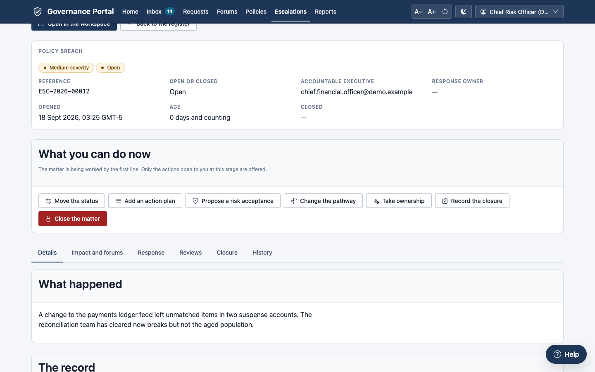

You can take a matter if you hold the Escalation Owner role, are in its queue
(you hold the role, or are a member of the group), and may change the matter.
The matter must be open and waiting. If two people try at once, only one
succeeds; the other sees "Escalation … is no longer waiting for an owner; …
owns the response."

If a matter is **re-routed** (for example when its severity changes) and its
owner is not in the new queue, it goes back into the new queue for someone
there to take.

### Working the matter

These actions are open to the Escalation Owner while the matter is **Open** or
**In Progress**. Each opens a form under **What you can do now**. Click the
form's button to save, or **Cancel**.

### Moving the status

**Move the status** → choose **Move to** (for example **In Progress**, or
**Under Review (with the second line)**) → **Move the matter**.

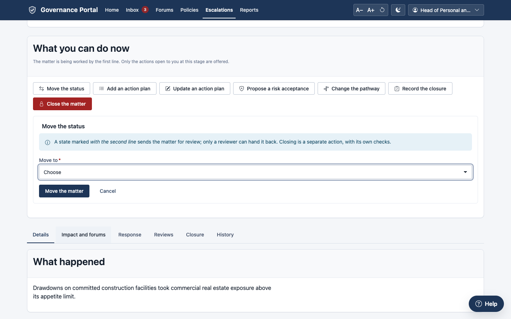

A matter cannot be *moved* to Closed. It comes to rest only through its
closure (section 7.7).

### Action plans

**Add an action plan** → **Plan\***, **Starts\***, **Due\***, **Accountable
executive\***, **Owner\***, **What will be done**, and the **Forums overseeing
the plan** → **Add the plan**.

**Update an action plan** → choose the plan → change it, including its
**Status** (Draft, Open, In Progress, Completed, Cancelled) → **Save the plan**.

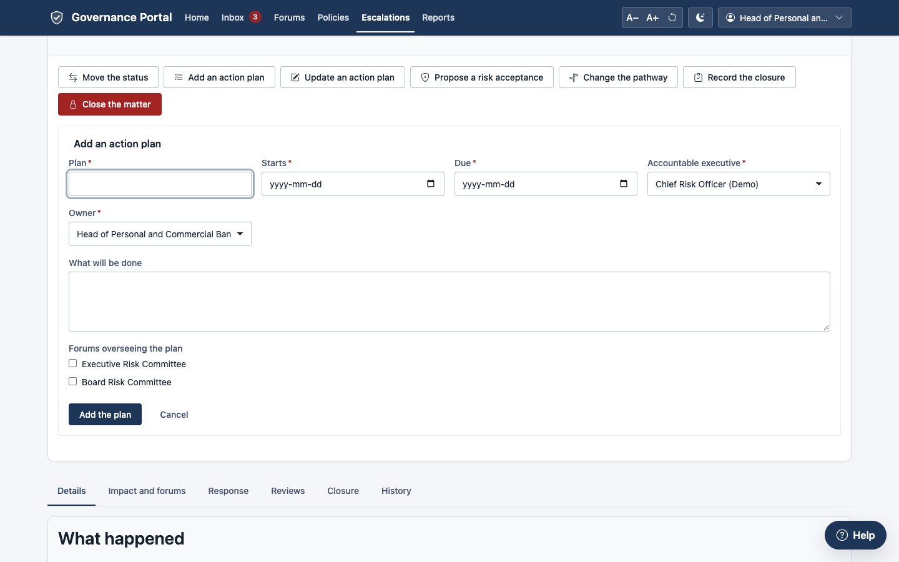

> A plan set to **Completed** or **Cancelled** can no longer be changed. Check
> before you save.

### Changing the pathway

**Change the pathway** → add forums (**Add a forum**, or **Add what the
matrix proposes**) and set each one's role: **Decision**, **Oversight** or
**Informed**. Then click **Save the pathway**. A forum the matrix requires
cannot be removed; change its role instead.

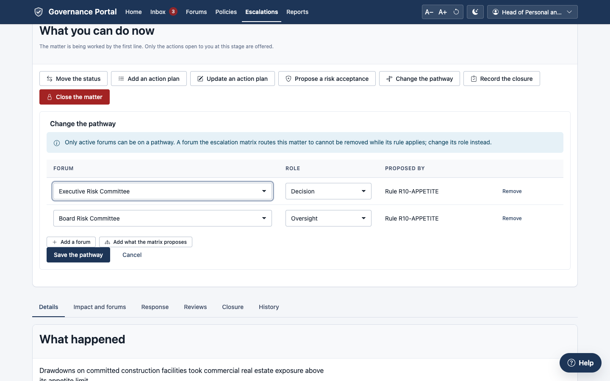

---

## 7.5 Risk acceptance

Deciding to **accept** a risk rather than remediate it is recorded as a
**risk acceptance**. It has no effect until it is explicitly approved.

1. **Propose a risk acceptance** → **Acceptance\***, **Accountable
   executive\***, **From\***, **To\***, **Reassess every** (months), a
   reference elsewhere, **Why the risk is carried rather than treated\***, and
   the forums it is reported to → **Propose the acceptance**. It is created
   as a **Draft**.

   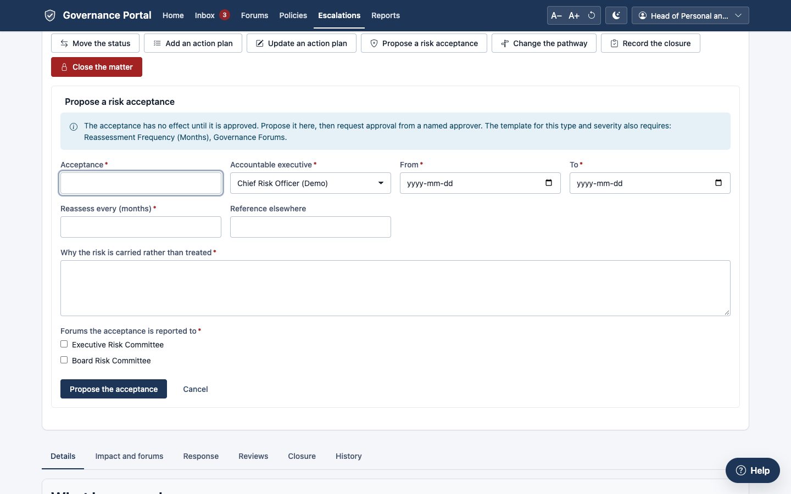

2. **Request risk-acceptance approval** → choose the acceptance and an
   **Approver**. Only a Head of Risk Governance who can see the matter, and who
   is neither you nor the accountable executive, can be chosen. The status
   becomes **Pending Approval**, and the approver finds it under **Waiting on
   you**.
3. The approver opens the matter and clicks **Decide a risk acceptance**. They
   choose **Approved** or **Rejected**, give a reason (required for a
   rejection), and save.

   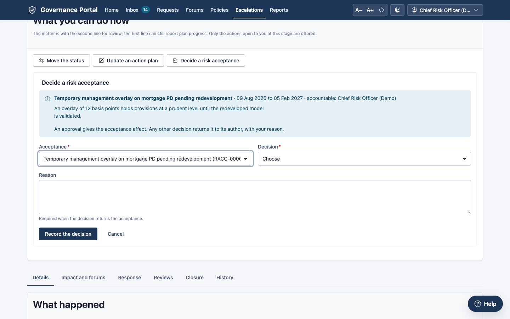

**What happens next.**

- **Approved** puts the acceptance in force, stamped with the approver and the
  date. The accountable executive is reminded before each reassessment is due
  and before the acceptance expires.
- **Rejected** returns it to **Draft**.

---

## 7.6 Second-line review

1. The first line moves the matter to **Under Review** (or **Pending
   Review**).
2. The Escalation Reviewer opens it and clicks **Record a review round** →
   **Outcome\*** (**Challenged**, **Accepted**, **Escalated** or
   **Returned**), **Line of defence**, **Reasoning\*** → save.
3. The round appears on the **Reviews** tab.
4. The reviewer then uses **Move the status** to hand the matter back to the
   first line (for example to **In Progress**). Recording a round does not
   change the status by itself.

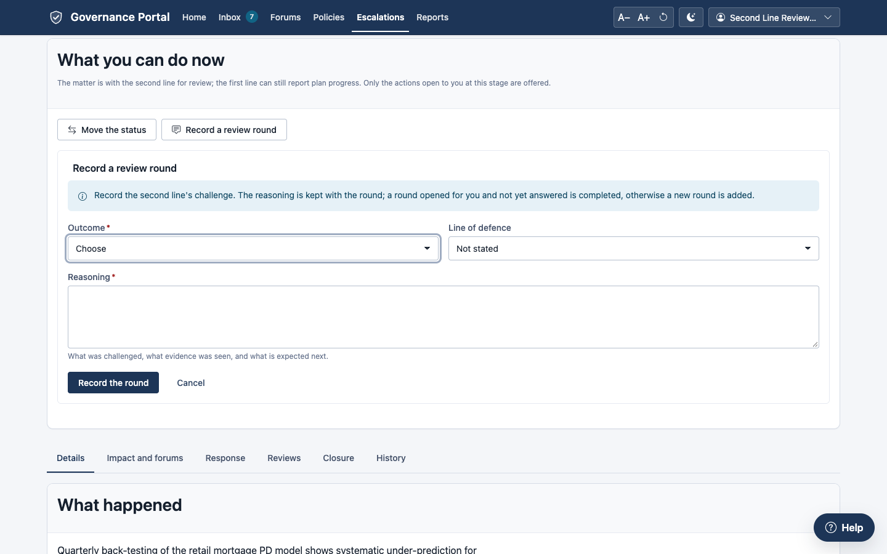

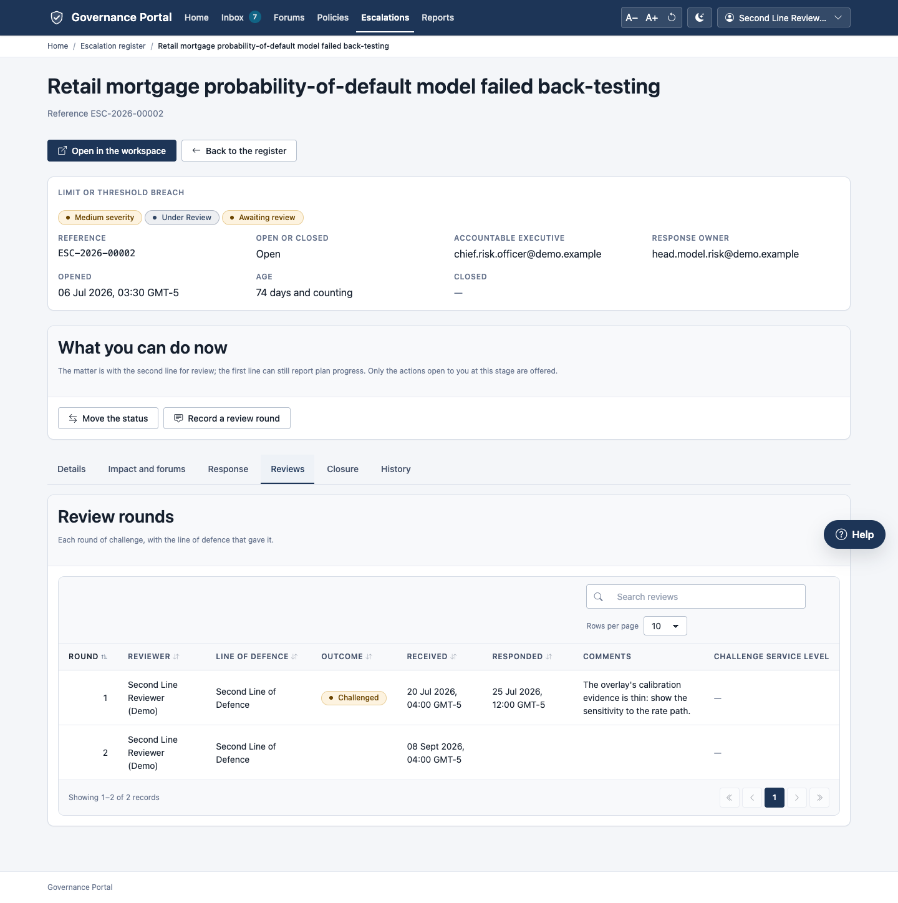

A reviewer who is the matter's accountable executive or response owner is not
offered **Record a review round**: nobody challenges their own matter.

---

## 7.7 Closing a matter

Closing takes **two** steps, because a matter must not close without its
outcome.

**Step 1: record the closure.**

1. Click **Record the closure**.
2. Choose **How it ended\***: **Resolved**, **Risk Accepted**, **Transferred
   Externally** or **No Action Required**.
3. If tracking moves to another system, fill in **Tracked in (system)** and
   **Reference there**.
4. Write the **Summary of the outcome\***.
5. Check the **criteria**, marking each **Met** with its evidence. By default
   they are:
   - root cause identified and recorded (required);
   - actions complete, accepted or transferred (required);
   - lessons learned shared with the owning forum (optional).
6. Click **Record the closure**.

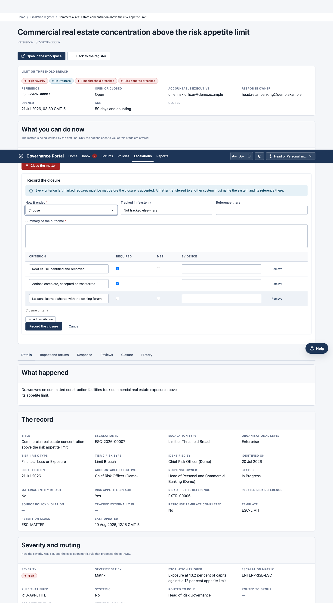

**Step 2: close the matter.**

1. Click **Close the matter** (the red button).
2. Choose **Close as**: **Closed**, or **Closed — Tracked Externally** (this
   needs the external reference from step 1).
3. Tick **The response template is complete**.
4. Click **Close the matter**.

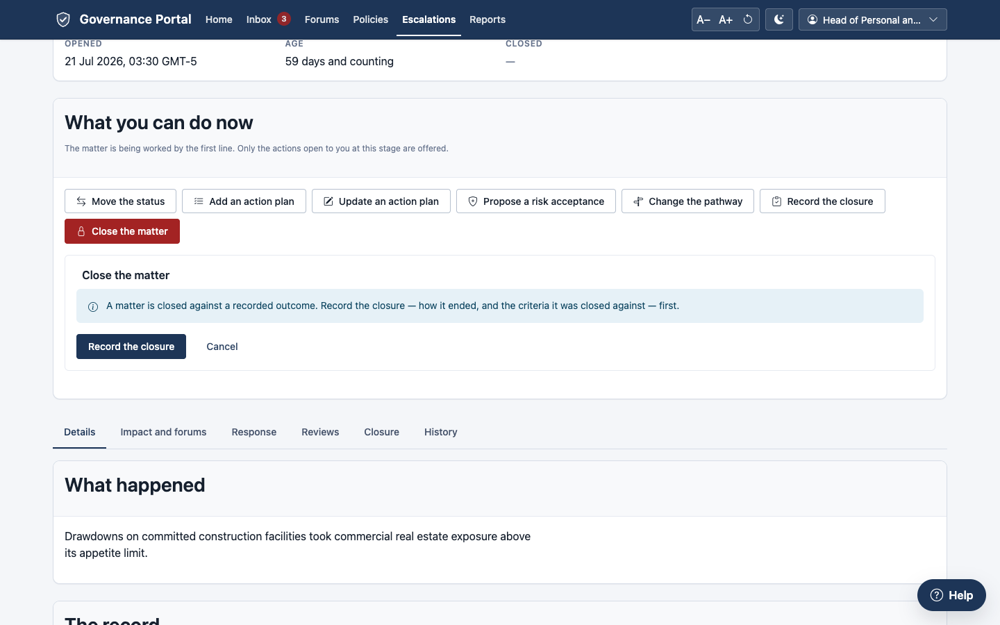

**What happens next.** The matter comes to rest. The closed date is stamped,
and the time-limit clock stops (**Met**, or **Breached** if it is past its
target). No portal actions remain.

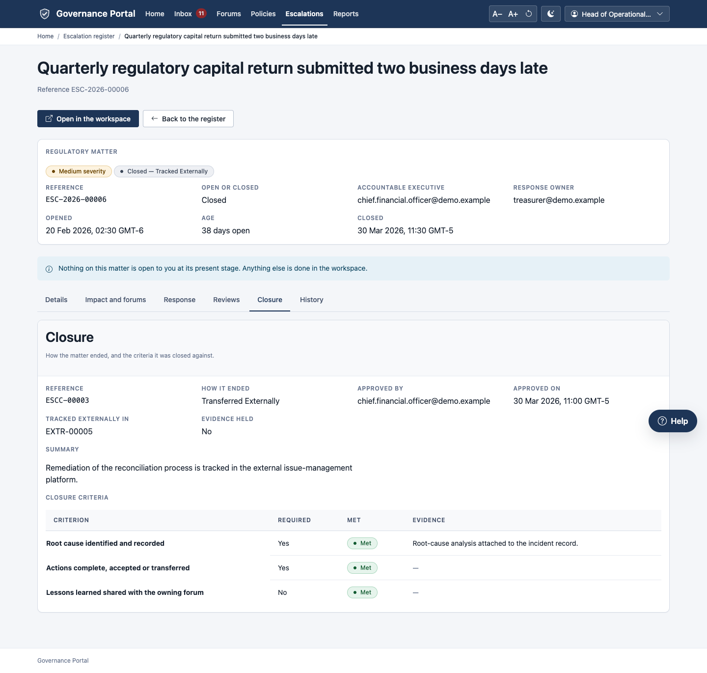

Before closing, the browser asks you to confirm: "Close … as …? A closed
matter can no longer be worked from this page, and you are recorded as
approving its outcome." A closed matter cannot be reopened from the portal.

---

## 7.8 Sensitive matters

A matter marked **sensitive** (restricted handling) is visible only to:

- people holding **Sensitive Escalation Access**; and
- **the people it names**: whoever raised it, the person recorded as having
  identified it, its accountable executive and its response owner, plus the
  members of the user group it is assigned to. Restricted handling keeps a
  matter from people with no part in it, not from those who raised it, answer
  for it or work it.

To everyone else it is hidden **everywhere**: lists, counts, reports, search,
the forum's Escalations tab and the help assistant. A sensitive matter waiting
in a *role* queue reaches only the role's holders who also have Sensitive
Escalation Access.

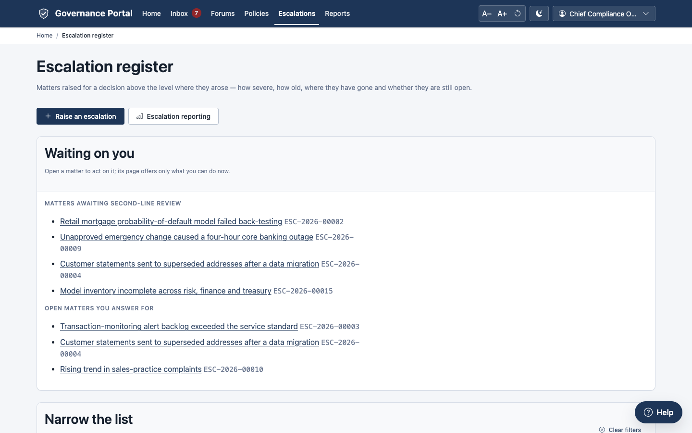

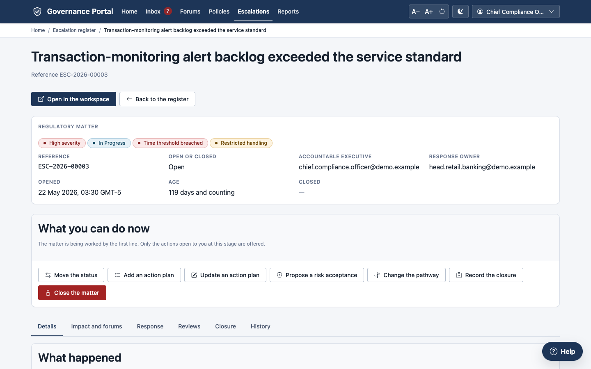

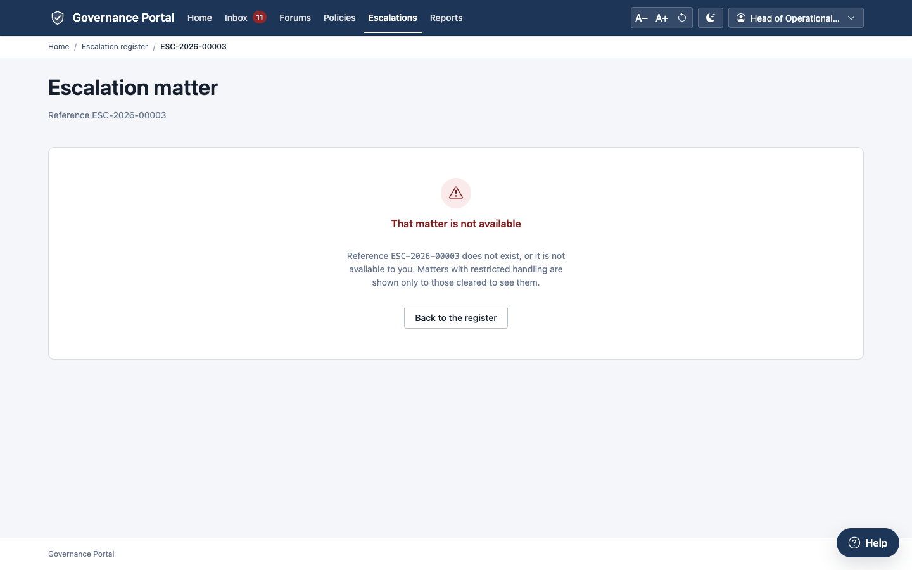

Only a holder of the role can raise a matter as sensitive. Grant the role
sparingly, and review who holds it ([chapter 10](10-administration.md)).

---

## 7.9 Time limits (SLAs)

Each matter carries a time limit, set from the matrix rule that matched it
(for example, High: 80 business hours). The clock:

- starts when the matter is opened;
- counts working hours only, if its definition uses a business calendar;
- warns the response owner and accountable executive when a set percentage of
  the time has passed;
- is marked **Breached** when the target passes.

**When a clock breaches:**

- the matter is marked **Time threshold breached**;
- its breach count goes up;
- its severity rises one step, even if it was set by hand;
- it is flagged **Raised automatically**;
- its routing is run again;
- the named people, the pathway forums' officers and the rule's user groups
  are notified.

Breaches are swept once a day.

### Time in each status

The **Details** tab's **Time in each status** table shows how long the matter
has spent in each status, from its change log:

- the time spent, and how many times the matter entered the status;
- the target per stay, where an administrator has configured one (an SLA
  definition measuring *Time In State*, [chapter 11](11-configuring-workflows.md)
  section 11.10);
- each stay against its target: **No target**, **Within target**, **Running,
  within target**, **Near its target** or **Past its target**. The current
  status is marked **Now**.

**Each stay** lists every stretch with its dates. **Other service levels on
this matter** includes the second-line challenge clock. Anyone who may read
the matter can see it.

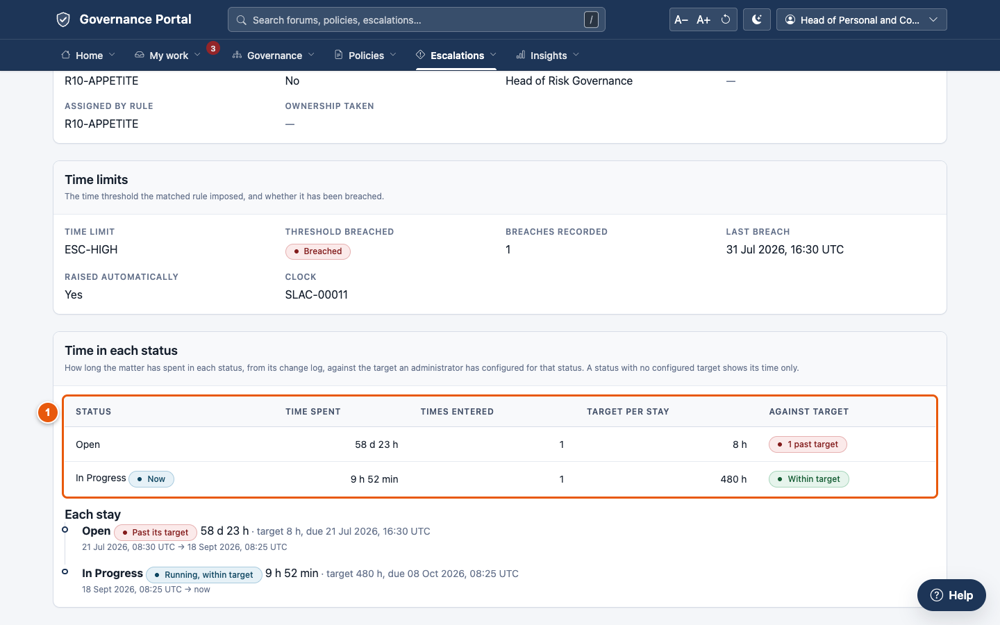

The clocks themselves are readable by administrators and auditors
(*Escalation → SLA Clock* in the workspace):

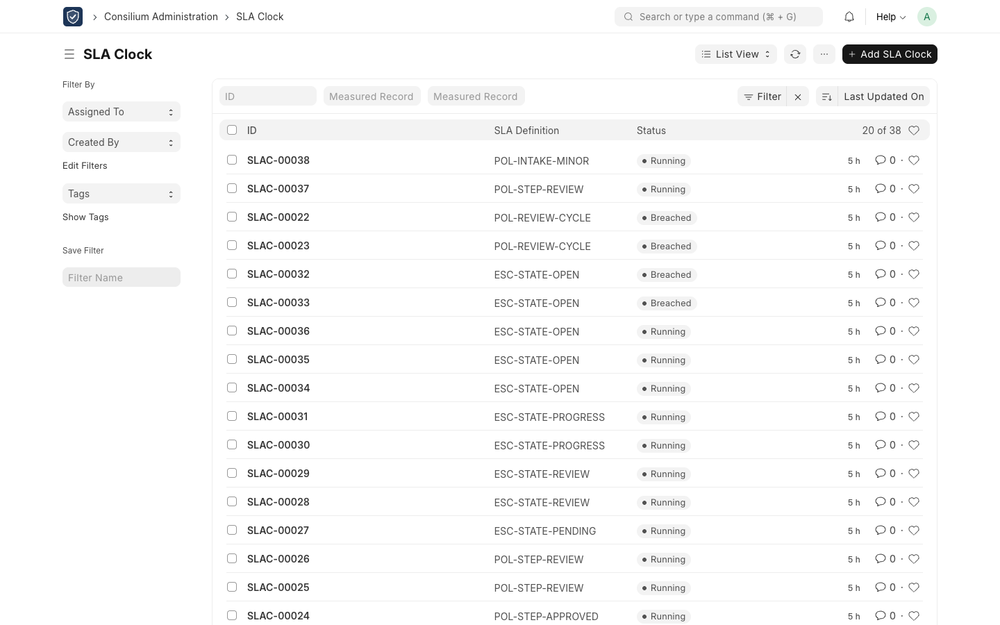

---

## 7.10 History and revert

The **History** tab lists every revision of the matter. An Escalation Owner
can **Revert to this version** with a reason. The revert writes a *new*
revision carrying the earlier content, and keeps the status, the sensitivity
and the review rounds. A closed matter cannot be reverted.

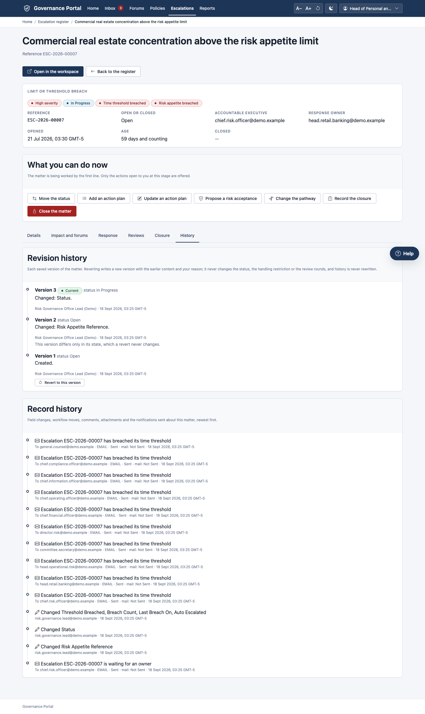

**Record history**, on the same tab, lists everything recorded against the
matter, newest first:

- field changes and status moves;
- comments and attachments;
- every notification, with its recipient, channel and whether it was sent.

Anyone who may read the matter can see it.

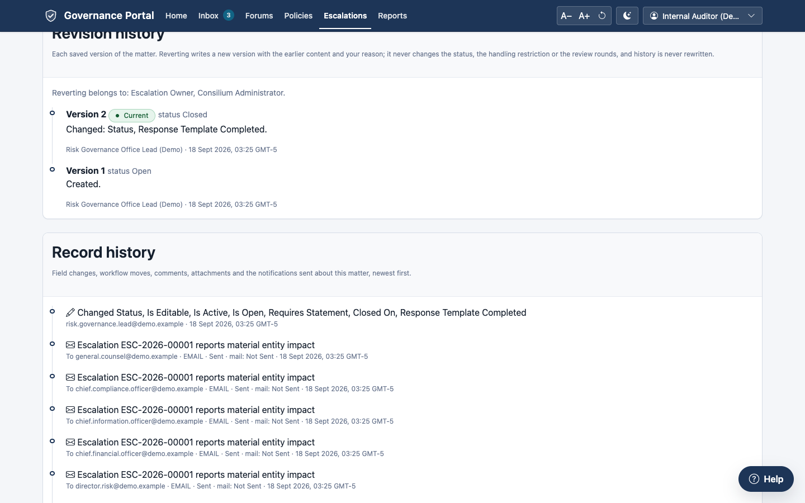

**Export evidence pack** (top right, for Consilium Audit and administrators)
downloads the matter, its history, revisions, approvals, refusals,
notifications and attachments as one fingerprinted ZIP file.
[Chapter 6](06-policies.md), section 6.14, lists its contents.

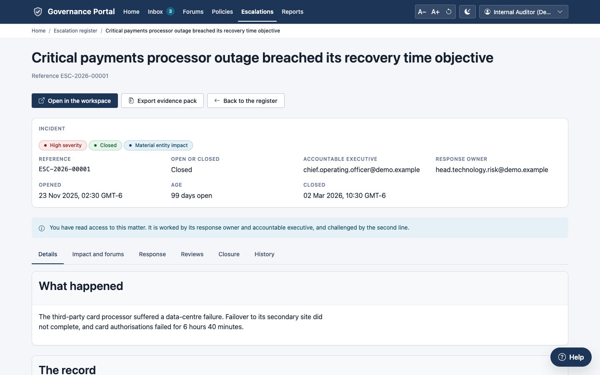

---

## 7.11 Periodic returns

Each quarter, a **periodic submission** (return) is created for the owner.
The owner is reminded before it is due, 15 days after the quarter ends. It
counts the matters identified in the period. A period with no matters must be
confirmed as a **nil return**. Returns are in the workspace, under
*Escalation → Periodic Submission*.

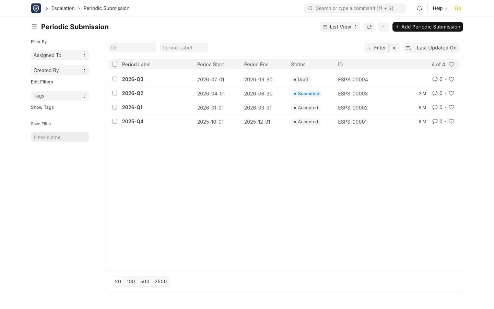

---

## 7.12 Systemic matters

Tick **The issue is systemic, not isolated (it follows the systemic route)**
when raising a matter whose cause is shared, for example one control failing
across several business lines. The matter then shows a **Systemic** badge.

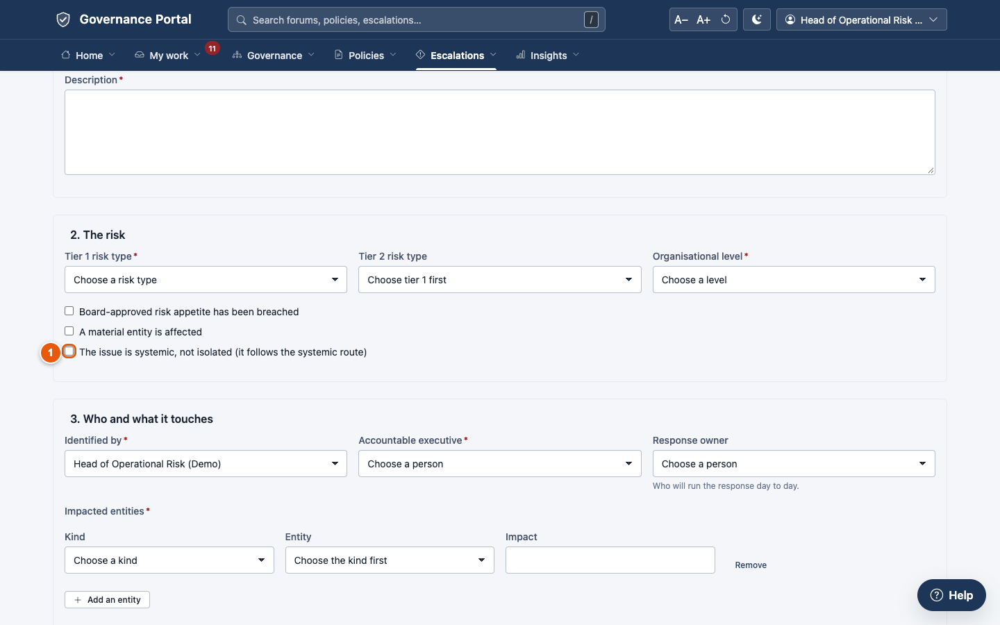

**Where it goes is configuration.** *Systemic* is one of the facts an
escalation matrix rule can test, with the condition `{"systemic": true}`
([chapter 11](11-configuring-workflows.md), section 11.9). Such a rule can
give systemic matters a higher severity, their own forums and their own
queue. A time limit can also be scoped to them (an SLA definition whose
**Applies When** is `{"systemic": 1}`). With no such rule, a systemic matter
is routed like any other.

The box is set when the matter is raised. On the portal the matter's page
only shows it; it can be changed in the workspace, where saving the matter
routes it again.

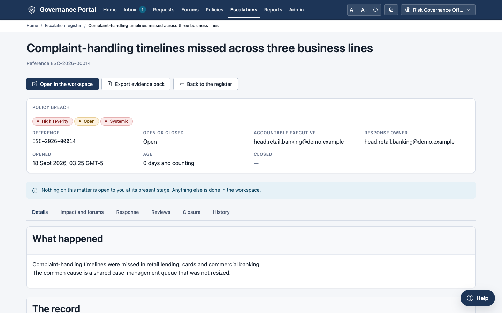

---

## Common errors

| Message | What it means | What to do |
|---|---|---|
| "No escalation matrix rule sets a severity for this matter. Choose the severity yourself." | No rule matches, for example because the tier 1 risk type is outside the matrix's scope. | Choose a severity (recorded as a manual override), or ask an administrator to extend the matrix. |
| "Template … requires: …" | The template for this type and severity needs more fields. | Fill them. If the form does not collect a field, raise the matter in the workspace. |
| "A matter cannot be escalated before it was identified." | The dates are inverted. | Correct them. |
| "… is not cleared for restricted handling and so cannot raise a matter as sensitive" | Only holders of Sensitive Escalation Access can mark matters sensitive. | Ask someone who holds it. |
| "… may not take the action "…" on escalation …. At this stage it belongs to: …" | Your role does not take this action at this stage. | The message names the role. |
| "… cannot be moved to … from here. A matter comes to rest only through its closure." | You tried to move it to Closed. | Record the closure, then close. |
| "… is accountable for escalation … and cannot also challenge it." | Reviewers cannot review their own matters. | Another reviewer must. |
| "…an approver must be independent of the person asking and of the accountable executive." | The four-eyes rule. | Choose another Head of Risk Governance. |
| "Action plan … is Completed and can no longer be changed." | Completed plans are frozen. | Add a new plan. |
| "… cannot be taken off the pathway: matrix rule … routes this matter there. Change its role instead." | The matrix requires the forum. | Change its role. |
| "Closure criteria not met: …" | A required criterion is not marked met. | Meet it, with evidence. |
| "Record the closure … before closing it." | Step 1 is missing. | Record the closure first. |
| "The response template must be completed before a matter is closed" | The box is not ticked. | Complete the template and tick the box. |
| "A matter tracked outside the platform must carry the external reference that identifies it there." | *Closed — Tracked Externally* without a reference. | Revise the closure with **Tracked in** and **Reference there**. |
| "Reference … does not exist, or it is not available to you" | Either wrong, or sensitive. | Check the reference; ask whoever sent it. |
| "Escalation … is no longer waiting for an owner; … owns the response." | Someone took it first. | Nothing; it is theirs. |

## Tips

- **Let the matrix decide severity** unless you have a reason not to. A
  manual override is recorded against your name and freezes the severity (a
  breach can still raise it).
- **Record the closure early** and revise it as the matter progresses.
  **Close the matter** is then one click.
- **Check the forum's Escalations tab** (chapter 2) to see everything routed
  to a committee before it meets.
