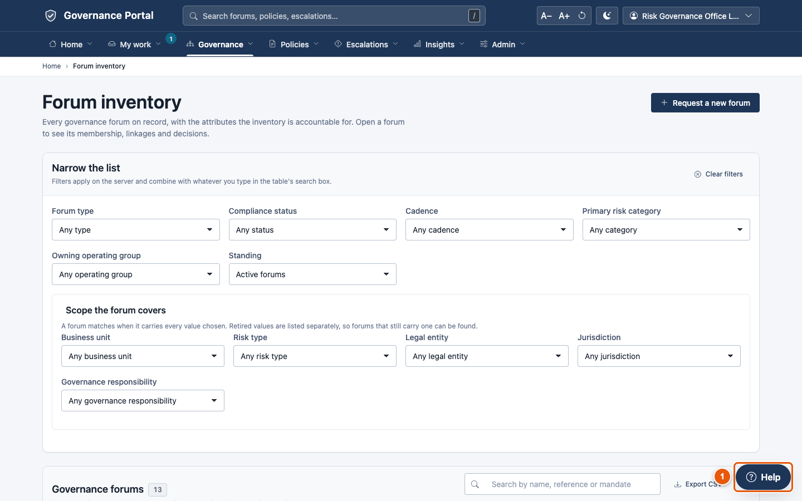
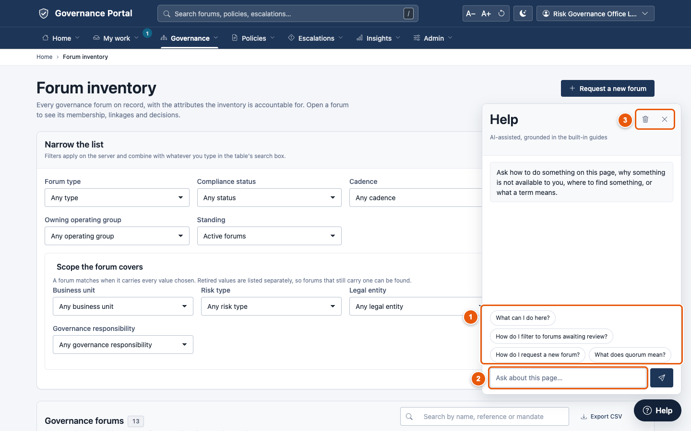
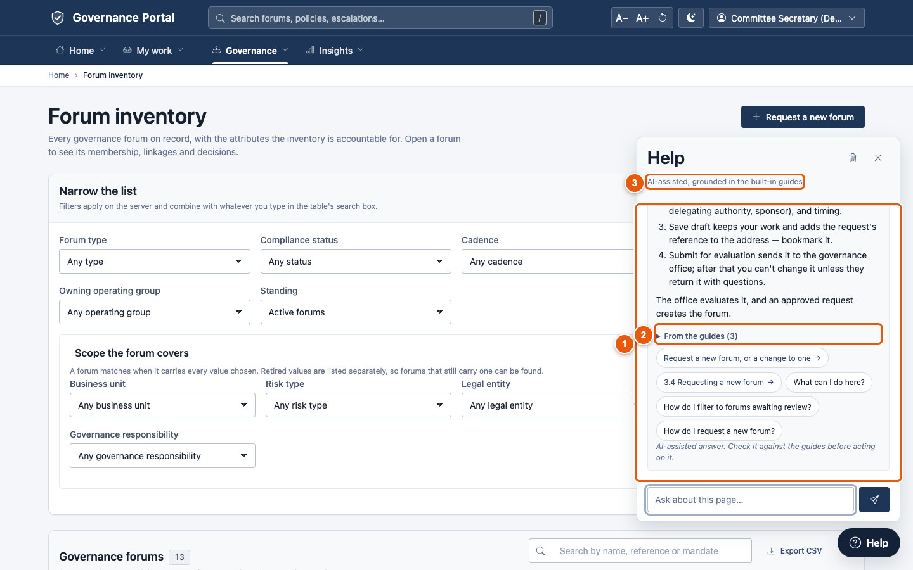
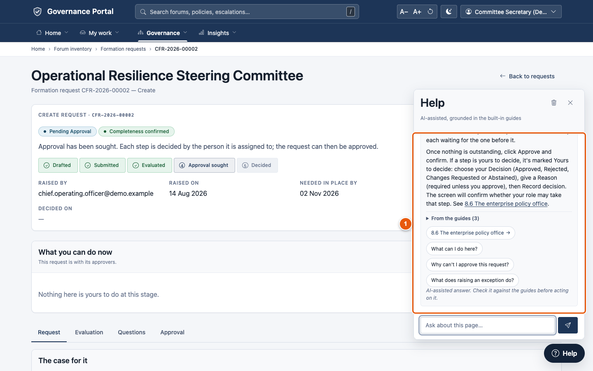

# 7. The Help assistant and AI

Every screen has a **Help** button in the bottom-right corner. It opens an
assistant you can ask in your own words about the screen you're on. It knows
your role, so its answers are about what **you** can do. It shows where each
answer came from.

---

## 7.1 Opening Help

① Click **Help**.

① **Suggested questions** for this screen. Click one to ask it.

② **Ask about this page…**: type your own question and press Enter.

③ **Clear** (the bin) starts a new conversation; **×** closes the panel (or
press Esc).

---

## 7.2 Asking a question

① **The answer**, in plain language, often as numbered steps with links to
the right screen.

② **From the guides** lists the sections of this guide the answer drew on.
Click to open them. The buttons beneath suggest what to ask or open next.

③ **The label** says how the answer was made: *AI-assisted, grounded in the
built-in guides*, or the built-in answer if AI is switched off.

**Questions that work well:**

| Ask… | For example | You get |
|---|---|---|
| **"What can I do here?"** | on any screen | What the screen is for, what you can and can't do, and where the record stands |
| **"How do I…?"** | "How do I record minutes?" | The steps, and a link to where you do it |
| **"Why can't I…?"** | "Why can't I approve this?" | Whether it's your role, the record's stage, or a step that must come first |
| **"Where do I find…?"** | "Where do I find overdue policy reviews?" | A link to the right screen |
| **"What does … mean?"** | "What does quorum mean?" | The plain-English definition |

① The answer explains what your role can do on this request, and what would
be needed.

---

## 7.3 What the AI can and can't see

When your organisation has connected an AI service, it phrases the answers
and writes commentary on the analysis pages. It is kept on a short leash:

- **It sees only what your administrator allows.** By default that is your
  question, the guide sections that match it, the kind of screen you're on,
  and your role names. It doesn't get your name or email address.
- **It never sees restricted records.** Confidential and restricted policies,
  and sensitive escalations, never go to the AI, whatever the settings.
- **Analysis commentary works from counts and categories**, with anonymous
  references rather than titles or text.
- **Everything is recorded.** Every question you ask, and every request to the
  AI service, is logged for audit. Nobody can edit the log. AI commentary on
  the analysis pages says "This answer was recorded".
- **It never changes anything.** Help only answers. Every action is taken by
  you, on the screen itself. AI commentary is labelled *Machine-generated*
  and is advice only.
- **It can be wrong.** If an answer looks odd, check the linked guide section,
  and tell your governance office.

If the AI service is slow or unavailable, the platform shows its own built-in
answer instead. Help always works.

**Your conversation** stays in this browser tab until you close it or click
the bin. You can ask up to 30 questions an hour (your administrator may set a
different limit).

---

## Tips

- **Ask "Why can't I…?" before asking a colleague.** It names the missing role
  or the step that must come first.
- **Ask on the screen in question.** Help reads the screen you're on, so "What
  can I do here?" on a policy gives you that policy's options.
