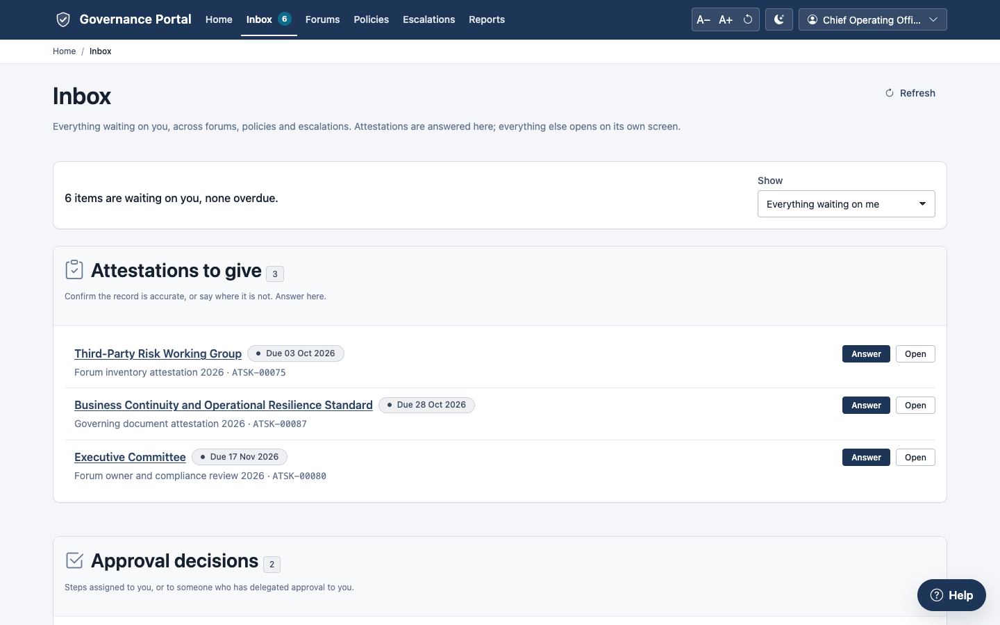
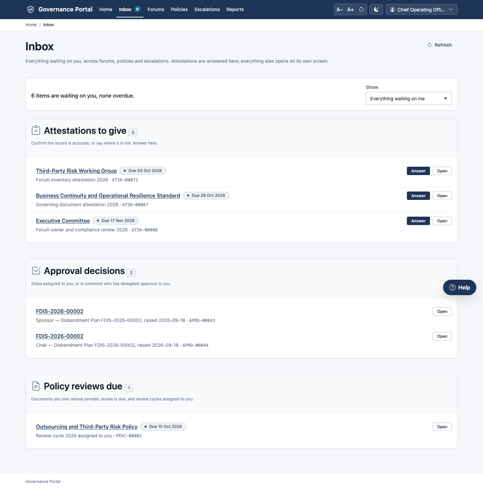
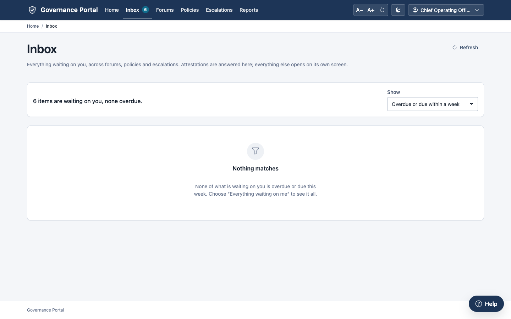
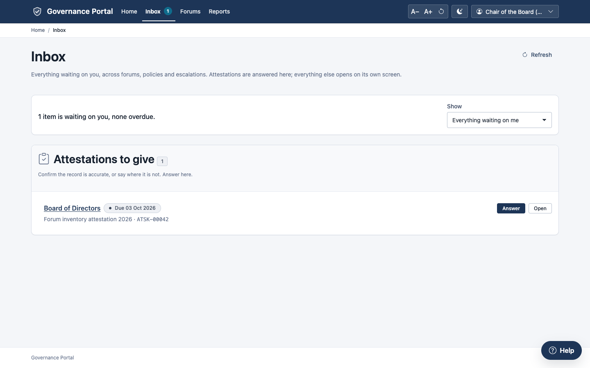
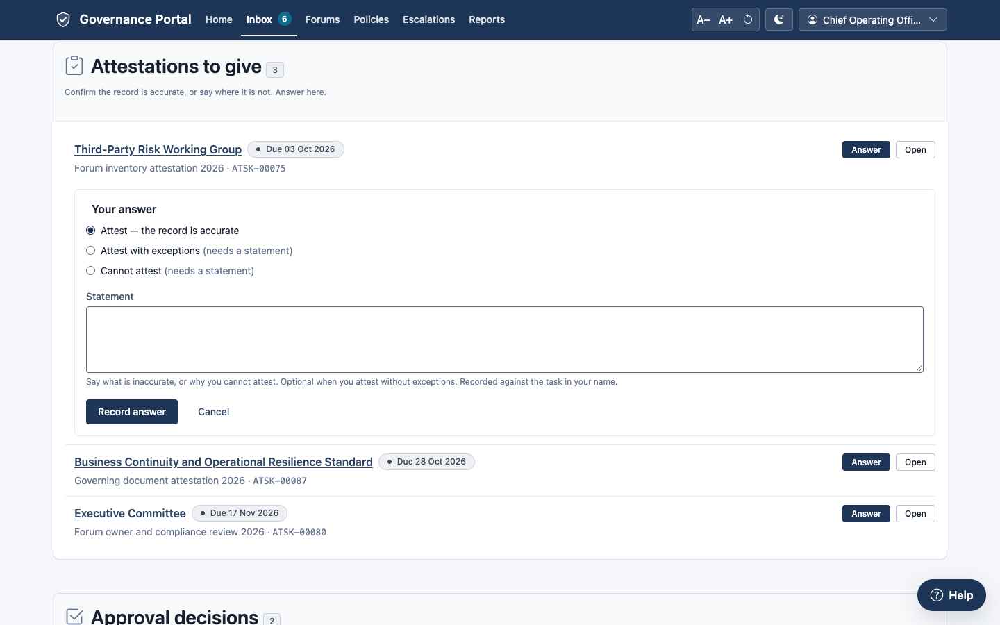
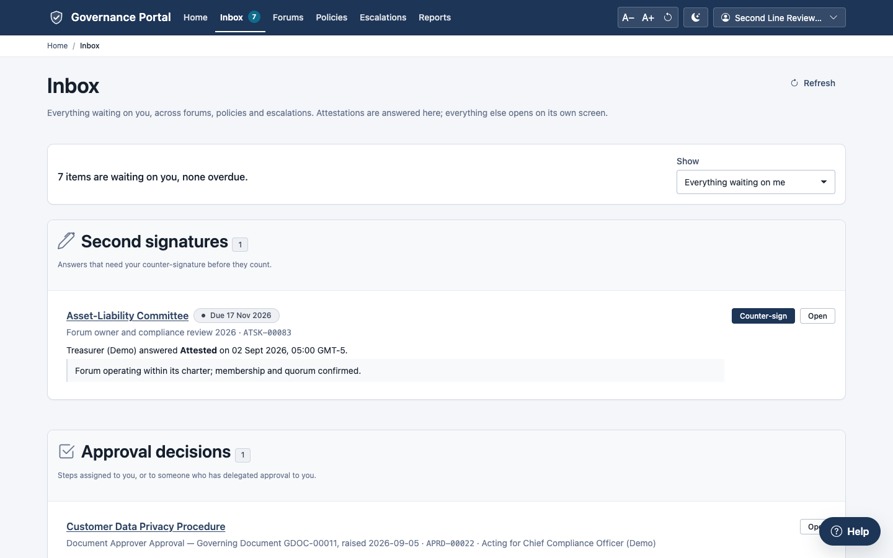
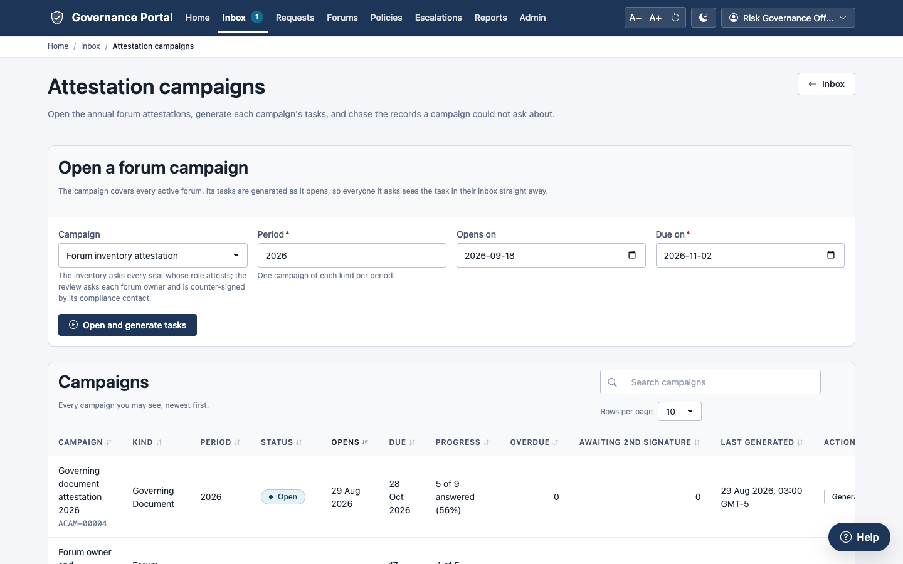
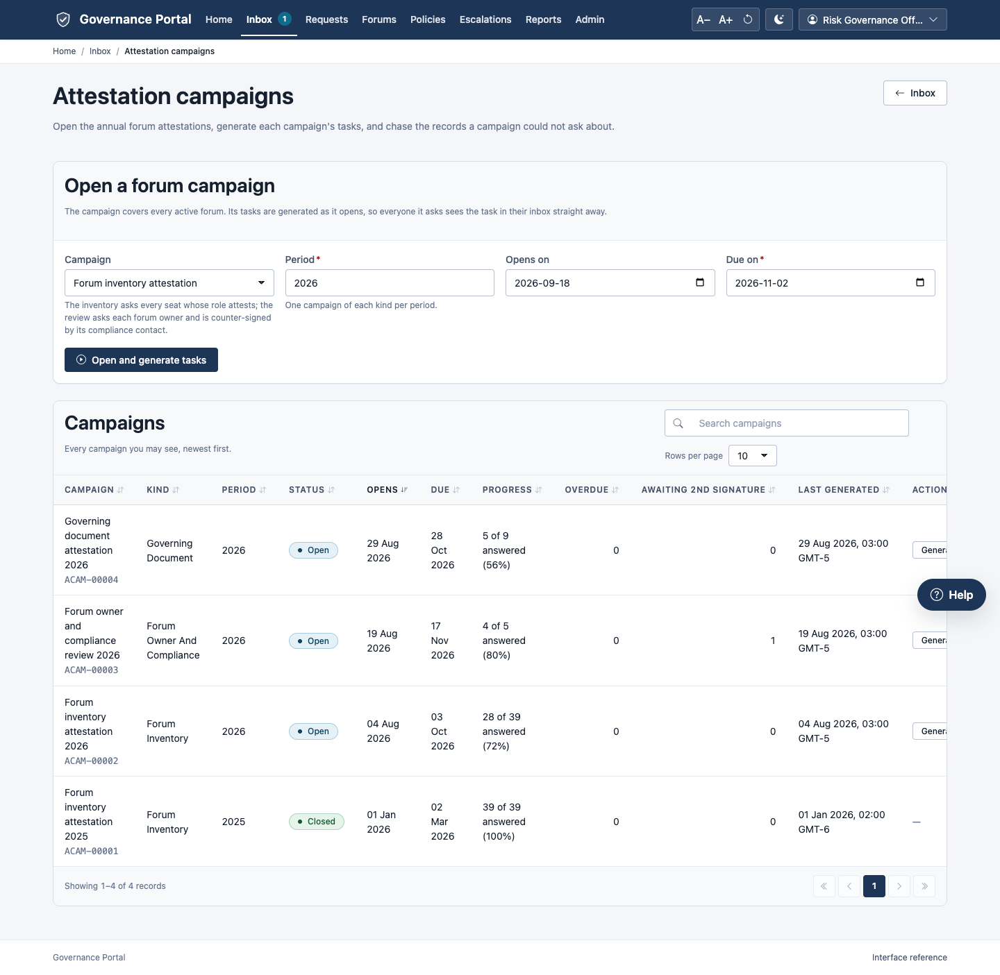
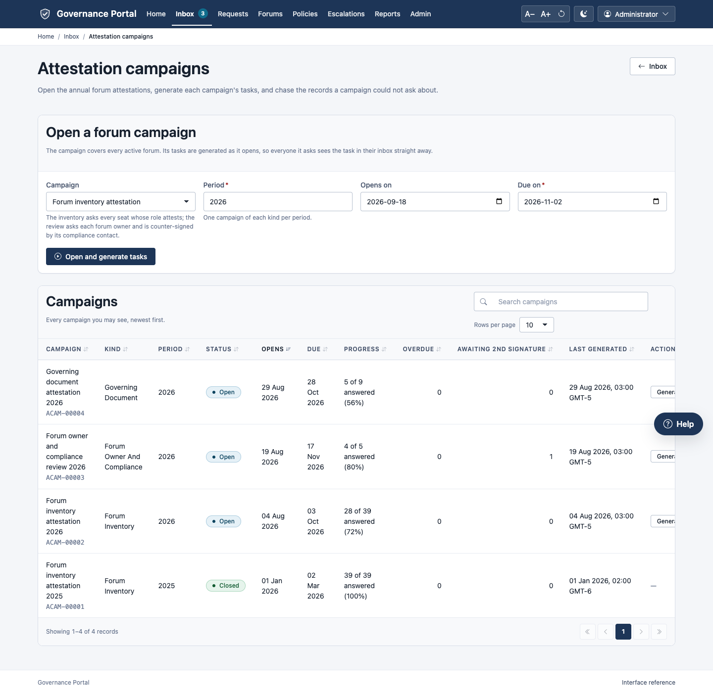
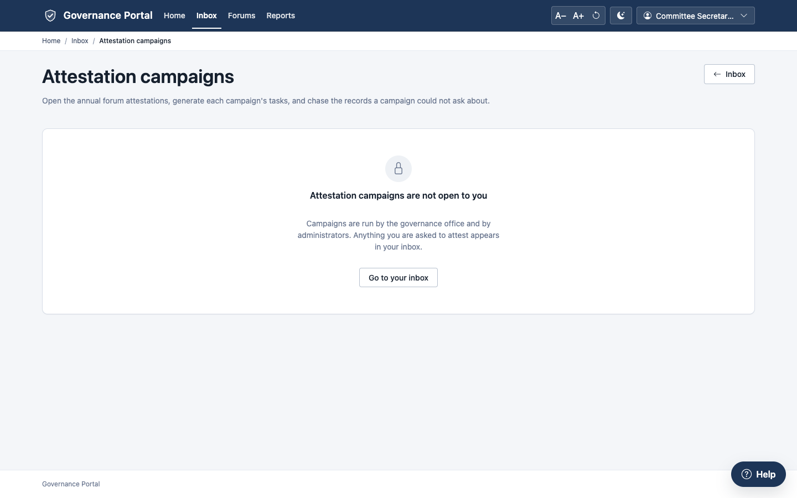

# 8. Your inbox and attestation

**Purpose.** The **Inbox** lists everything waiting on *you*, across forums,
policies and escalations. Attestations are answered and counter-signed in the
inbox itself; everything else opens on its own screen. **Attestation
campaigns** are how the governance office asks people, once a year, to
confirm that the records they are accountable for are accurate.

**Who can do it.**

| To | You need |
|---|---|
| Use your inbox | Everyone |
| Answer an attestation | The person asked, or someone holding their live delegation to attest |
| Counter-sign | The named second signatory. Delegation does not apply. |
| Open forum campaigns and generate their tasks | Risk Governance Office, Head of Risk Governance, or an administrator |
| Open any campaign (including governing document campaigns); generate any campaign's tasks | Consilium Administrator |
| Read campaigns | Also Consilium Audit |

---

## 8.1 The inbox

Click **Inbox** in the top bar. The number beside it is how many items are
waiting.

The summary line says how many items are waiting and how many are overdue.
**Show** narrows the list:

- **Everything waiting on me**;
- **Only what is overdue**;
- **Overdue or due within a week**.

The items are grouped:

| Group | Contains | Where you act |
|---|---|---|
| **Attestations to give** | Campaign tasks asking you to confirm a record is accurate | Here (section 8.2) |
| **Second signatures** | Answers that need your counter-signature before they count | Here (section 8.3) |
| **Approval decisions** | Approval steps assigned to you (or to someone who delegated approval to you) on documents and risk acceptances | The document or matter |
| **Formation approval steps** | Formation requests that need your decision | The request |
| **Formation requests returned to you** | Your requests with questions from the governance office | The request form |
| **Forums awaiting your compliance review** | Forums you are the compliance contact for, whose standing needs a decision | The review form |
| **Your forums awaiting review** | Forums you own that await a compliance decision, or whose review falls due | The forum |
| **Policy reviews due** | Documents you own whose periodic review is due, and review cycles assigned to you | The document |
| **Escalations waiting for an owner** | Matters routed to a role or group you belong to. Take one to become its response owner. | The matter |
| **Escalations under review** | Matters you are accountable for or respond to, awaiting review | The matter |
| **Action plans** | Open action plans you own | The matter |
| **Metadata to correct** | Records left pointing at something retired, disbanded or deactivated | The record |

Each item shows its due date: **Overdue since …** (red), **Due …** (amber,
within a week) or **Due …**. **Acting for …** means it came to you through a
delegation. **Open** takes you to the record.

Click **Refresh** to reload the list after acting elsewhere.

---

## 8.2 Answering an attestation

1. In **Attestations to give**, click **Answer** on the item.
2. Choose your answer:
   - **Attest — the record is accurate**;
   - **Attest with exceptions** (a statement is required);
   - **Cannot attest** (a statement is required).
3. Write the **Statement** if needed: what is wrong, or why you cannot attest.
4. Click **Record answer**.

**What happens next.** "Your answer is recorded." The item leaves your inbox.
On a dual-signature campaign, the second signatory now sees it under
**Second signatures**.

> **Answer before the due date.** An attestation not answered by its due date
> is marked **Expired** overnight, and can no longer be answered.

---

## 8.3 Counter-signing

1. In **Second signatures**, read the first signatory's answer and statement.
2. Click **Counter-sign**.
3. Confirm: "Counter-sign this answer? Your signature is recorded against the
   task in your name."

---

## 8.4 Running an attestation campaign

Open **Inbox → Attestation campaigns** (or go to `/attestation-campaigns`).

### Opening a forum campaign

1. Under **Open a forum campaign**, choose the **Campaign**:
   - **Forum inventory attestation** asks every chair, secretary and forum
     owner (every open seat whose role attests) to confirm their forum's
     record;
   - **Forum owner and compliance review (dual signature)** asks each forum's
     owner to attest, then its compliance contact to counter-sign.
2. Give the **Period** (for example the year), **Opens on** and **Due on**.
3. Click **Open and generate tasks**.

**What happens next.** The campaign is opened and a task is created for each
person in scope. The **Last run** card reports four figures:

- **Records in scope**;
- **Tasks created**;
- **Already asked** (not duplicated);
- **Could not be asked**: records with no second signatory, each linked so you
  can fix it.

### Following progress

The **Campaigns** table shows each campaign's status, dates, **Progress** (X
of Y answered), how many are overdue, how many await a second signature, and
when tasks were last generated.

**Generate tasks** on an open campaign re-reads the population and asks
anyone new, for example a member who joined a forum after the campaign
opened. It never asks the same person twice for the same record.

**Reminders follow the campaign's schedule.** A campaign's **Reminder
Schedule** (set in the workspace) lists points such as "14 days before the due
date" and "3 days before". At each point, the people a task is waiting on are
reminded once:

- the person asked, while the task is unanswered;
- the second signatory, once it is answered and until they counter-sign.

Reminders are sent by the daily reminders job. A day it did not run is caught
up the next day. Overdue tasks are chased separately, and expire overnight
after their due date.

### Governing document campaigns (administrators)

Campaigns over other records, such as the annual **governing document
attestation** by document owners, are set up in the workspace. See
[chapter 11, section 11.12](11-configuring-workflows.md). Once a campaign's
**Status** is **Open**, its tasks can be generated from this page.

People without a part in running campaigns see:

---

## Common errors

| Message | What it means | What to do |
|---|---|---|
| "This answer needs a (written) statement explaining it." | Attest with exceptions and Cannot attest need a statement. | Write it. |
| "Task … has already been answered or has lapsed" | Answered, or expired. | Nothing; ask the governance office if it expired. |
| "… may not answer attestation task …: … holds no live delegation of ATTEST from …" | It is someone else's task and you are not their delegate. | Ask them, or ask for a delegation. |
| "… is not the second signatory of attestation task …" | Only the named second signatory can counter-sign. | Nothing. |
| "Campaign … already covers … for period …" | A campaign for that period exists. | Use it; generate its tasks again if needed. |
| "A campaign cannot be due before it opens." | The dates are inverted. | Correct them. |
| "Campaign … is not open, so tasks cannot be generated." | The campaign is in Draft. | Set its status to Open (workspace). |
| "Forum campaigns are run by the governance office or an administrator." | Your roles do not include it. | Ask the governance office. |
| "Your inbox could not be read" | A server problem. | Reload. If it persists, tell your administrator. |

## Tips

- **Check your inbox first thing.** It is the one place that collects
  everything waiting on you.
- **If you will be away, delegate.** An **Authority Delegation**
  ([chapter 10](10-administration.md)) lets a colleague answer attestations
  and decide approvals for you, and their answers show "under delegation".
- **The Could not be asked list** usually means a forum has no compliance
  contact or owner. Fix the forum's record, then **Generate tasks** again.
