# 9. Administration without code

*For business administrators: the people who set the platform up for their
organisation and keep it that way.* Everything in this chapter is done on
screen, with no release and no help from IT. Where something needs your
platform team, the chapter says so in one line.

Open **Admin → Administration**. Some screens open in **Advanced
configuration** (also called the **Advanced view**), the full configuration
screens with a sidebar. They look a
little different from the rest of the platform, but work the same way: fill
in the fields and click **Save**.

**In this chapter**

- 9.1 Administration
- 9.2 People, roles and access
- 9.3 Reference lists
- 9.4 Importing from spreadsheets
- 9.5 Branding
- 9.6 Notification wording
- 9.7 Time limits and working hours
- 9.8 Escalation routing rules
- 9.9 Approval routes
- 9.10 Watched details
- 9.11 Adding a step to the policy lifecycle
- 9.12 Attestation campaigns
- 9.13 The home-page guidance
- 9.14 Integrations, card by card
- 9.15 When something is refused

---

## 9.1 Administration

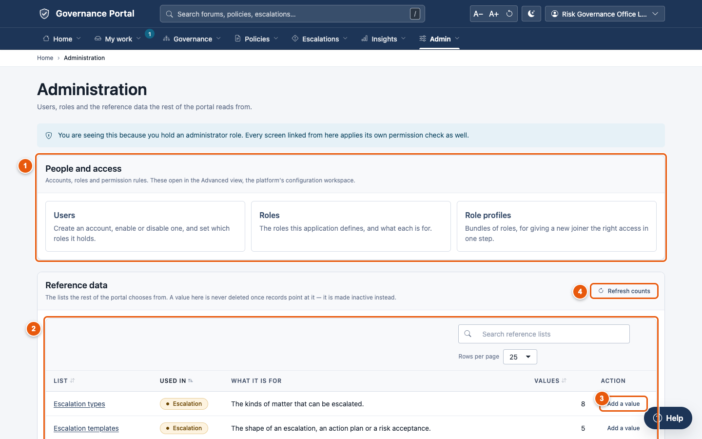

① **People and access**: **Users**, **Roles** and **Role profiles**.

② **Reference data**: every list the platform's drop-downs choose from, what
each is for, and how many values it holds. Click a list to open it.

③ **Add a value** adds to a list.

④ **Refresh counts** re-reads the numbers.

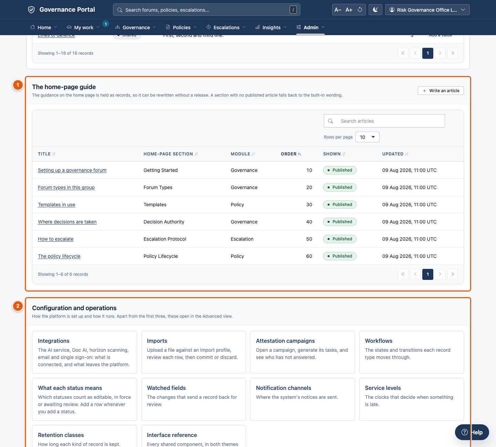

① **The home-page guide**: your guidance articles (section 9.13), with **Write
an article**.

② **Configuration and operations**: links to the other settings screens.

---

## 9.2 People, roles and access

**Adding a person.** **Users** → **+ Add User**. Enter their email, first and
last name, and save. Then give them roles on the **Roles** tab, or choose a
**Role Profile**.

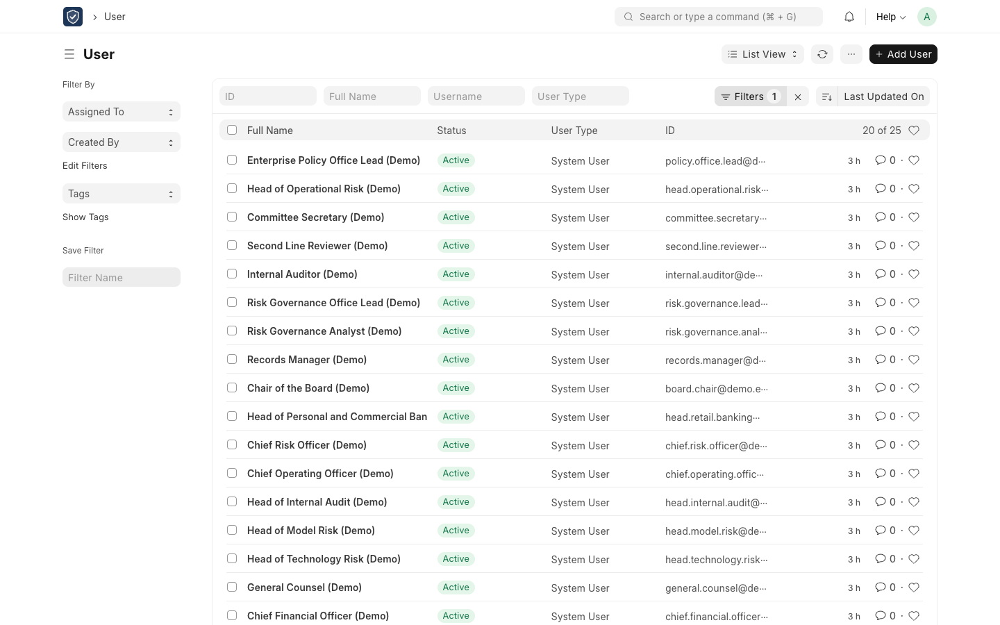

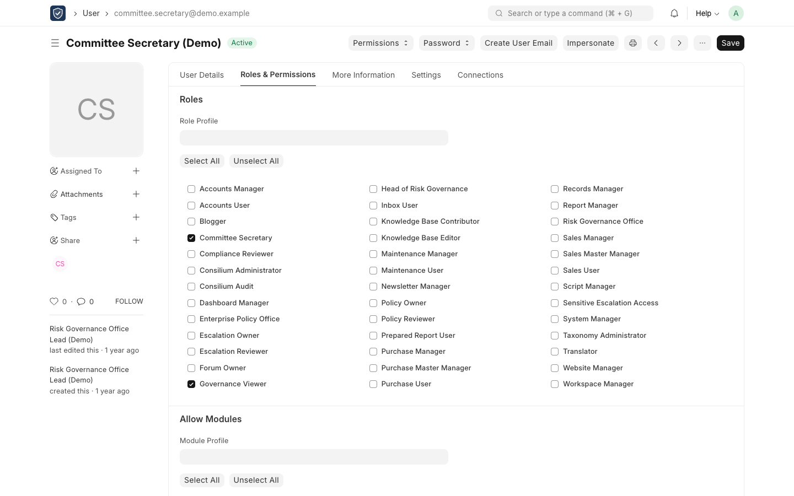

**Roles in plain terms.** A role decides what someone can see and do:

| Role | Can |
|---|---|
| Governance Viewer | Read forums, their members and decisions |
| Committee Secretary | Run the committees they support: meetings, minutes, motions, membership, charters; request new forums |
| Forum Owner | Look after the forums they own; attest to them |
| Risk Governance Office | Run the forum inventory: evaluate requests, compliance, campaigns, disbandments |
| Head of Risk Governance | All of the above, plus exceptions, bypasses and risk acceptances |
| Compliance Reviewer | Record compliance reviews |
| Policy Owner | Draft and look after policies; request changes |
| Policy Reviewer | Review policies; log violations |
| Enterprise Policy Office | Approve, publish and retire policies; exceptions; templates and routes |
| Escalation Owner | Raise and work escalations |
| Escalation Reviewer | Challenge escalations (the second line) |
| Sensitive Escalation Access | See sensitive escalations (grant sparingly) |
| Records Manager | Retention and legal holds |
| Taxonomy Administrator | Look after the reference lists |
| Consilium Audit | Read everything; change nothing |
| Consilium Administrator | Configure the platform |

**Role profiles** bundle roles for a job ("Committee Secretary", say), so a new
joiner gets the right access in one step. Change the profile, and everyone
with it changes too.

**Limiting someone to part of the organisation.** In **Advanced configuration**
→ **User Permission**, restrict a person to, for example, one organisation
unit or legal entity. It applies everywhere: lists, counts, reports, search
and Help.

**Seeing what a user sees.** To check "I can't see X", the system
administrator opens the person's record and clicks **Impersonate**, giving a
reason (the person is told). No password is involved, and the session is
recorded.

**Removing access.** Untick **Enabled** on the person. Never delete a person:
their name must stay on everything they did.

**Delegation.** When someone is away, an **Authority Delegation** (in
**Advanced configuration**) lets a colleague act for them between two dates.
Their actions are marked "under delegation".

**Demonstration logins.** On a demonstration or training site, the
demonstration users get their logins from your platform team, never by email.

---

## 9.3 Reference lists

Reference lists are what the drop-downs choose from: risk categories and
types, organisation units, legal entities, jurisdictions, regulatory
requirements, forum types, document types, escalation types and more.

**Adding a value:** on **Administration**, click **Add a value** beside
the list, fill it in, and save.

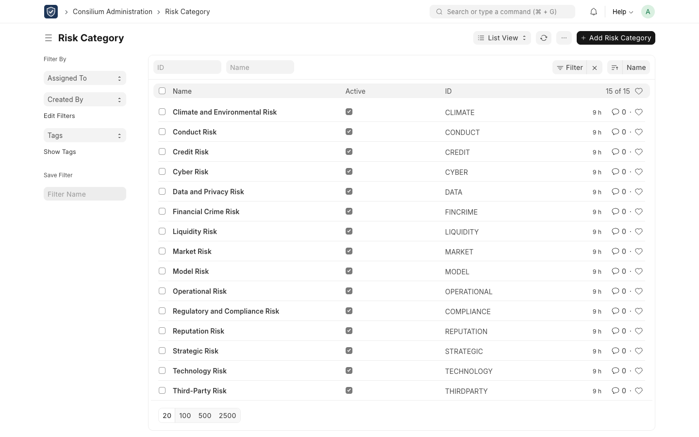

**Retiring a value.** Never delete a value that records use. Open it and
untick **Active**:

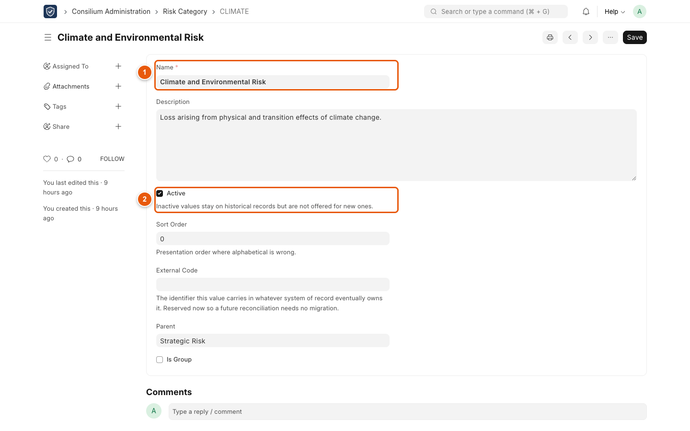

① **The name** can be changed freely.

② **Active**: untick to stop offering the value for new records. Records that
use it keep it, and filters still find them.

> **Codes never change.** Imports and connections to other systems match on
> the code, so keep a retired code retired rather than reusing it.

---

## 9.4 Importing from spreadsheets

**Admin → Imports** brings records in from a spreadsheet saved as CSV. You
review every row before anything is written.

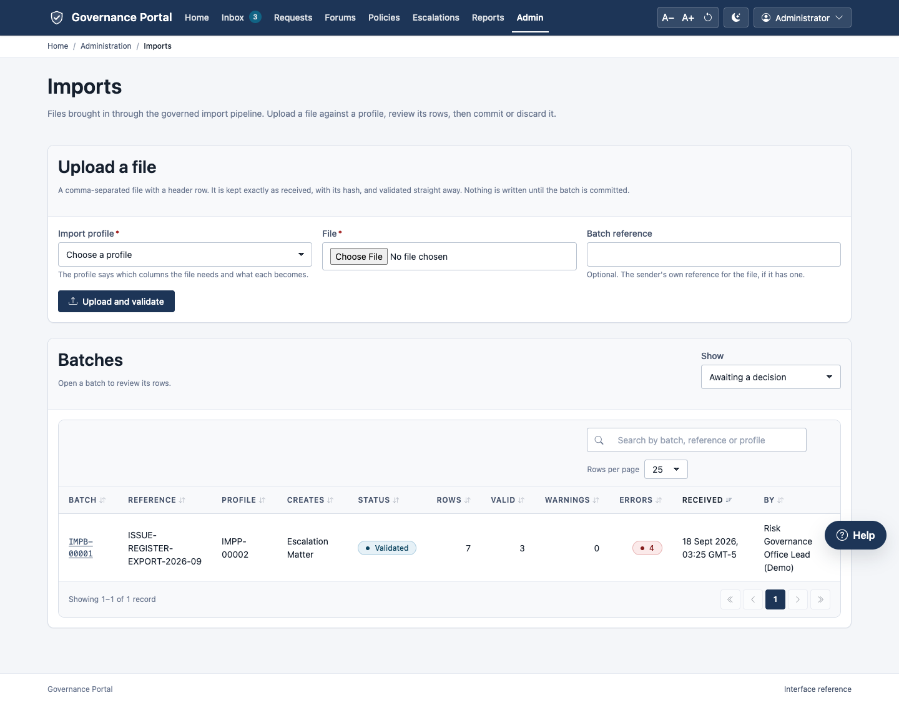

① **Import profile**: which system the file comes from and how its columns
map. **Columns this profile reads** lists them.

② **File**: your CSV file.

③ **Upload and validate.**

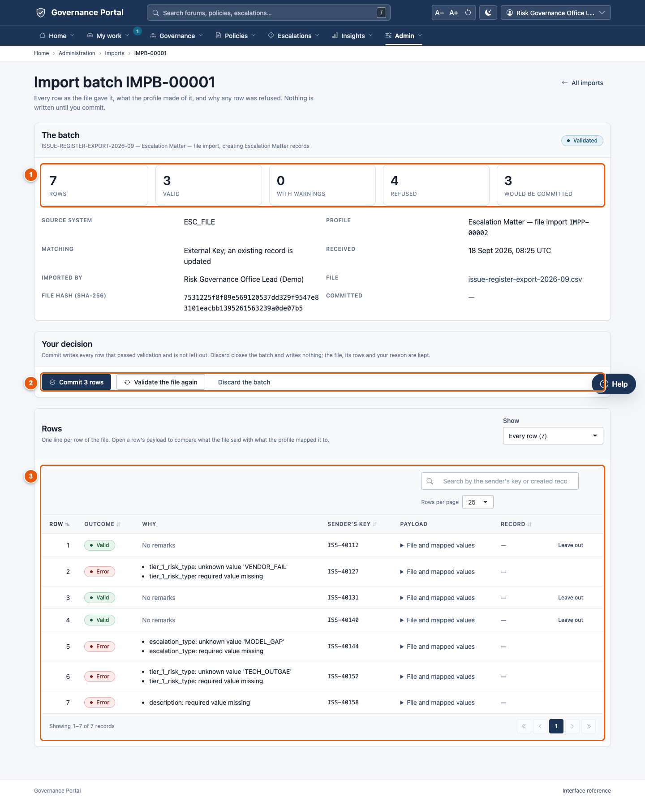

① **The counts**: rows, valid, with warnings, refused, and how many would be
committed.

② **Your decision**: **Commit** writes the valid rows; **Validate the file
again** re-checks it (for example after fixing a reference list); **Discard
the batch** throws it away, with a reason.

③ **Every row**, with its outcome and why. **Leave out** excludes one row.

Import profiles are set up once per source; ask your platform team for a new
one.

---

## 9.5 Branding

**Admin → Branding** (system administrator). One screen sets how the platform
looks:

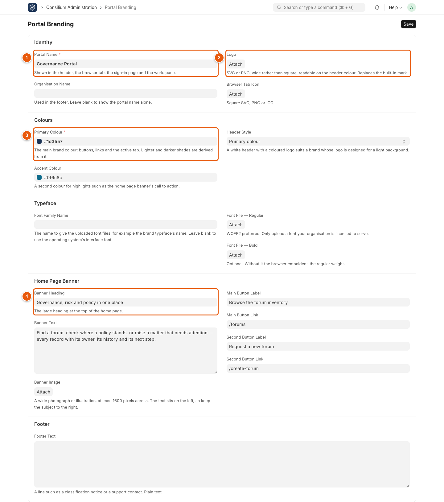

① **Portal name**: shown in the header, the browser tab and the sign-in page.

② **Logo**: SVG or PNG, wider than it is tall.

③ **Primary colour**: buttons, links and the header. Lighter and darker shades
are worked out for you.

④ **Home page banner**: its heading, text, picture and two buttons.

You can also set an accent colour, a browser-tab icon, a header style, a
typeface and the footer. Save, then reload the page. Only upload logos and
fonts your organisation is licensed to use.

---

## 9.6 Notification wording

Every notification the platform sends has a **template** you can reword:
subject and message. Open **Advanced configuration → Notification Template**.

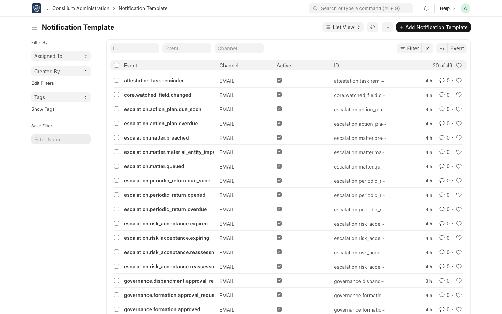

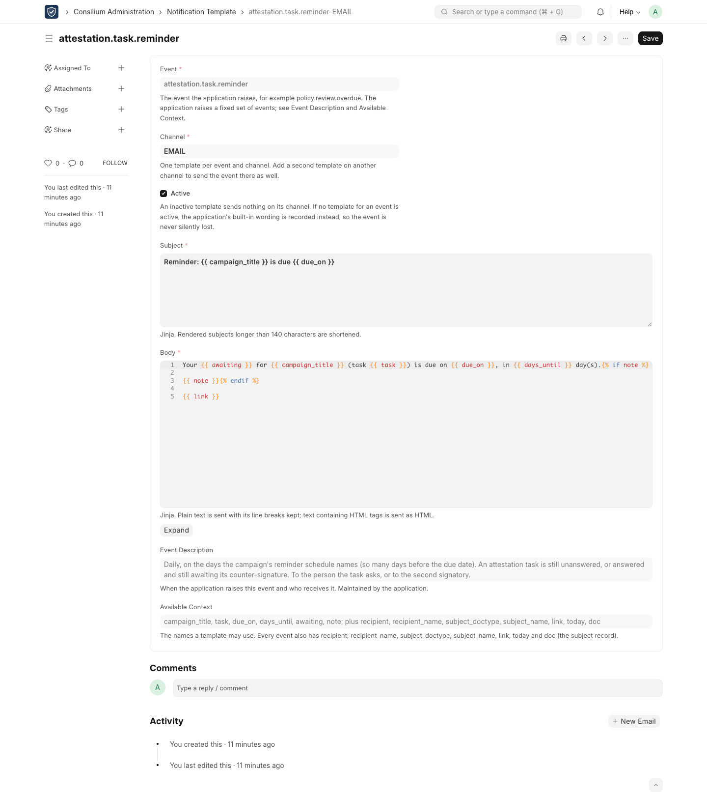

① **Active**: untick to stop sending this notification by this route.

② **Subject.**

③ **Body**: the message.

④ **Available details**: the details you can insert, such as the recipient's
name, the link to the record, the due date, or the policy's name. Copy the
placeholder exactly as shown.

If a template ever can't be used, the platform sends its built-in wording
instead, so nobody misses a notification.

---

## 9.7 Time limits and working hours

**Time limits** (for escalations, and for policy requests) are in **Advanced
configuration → SLA Definition**.

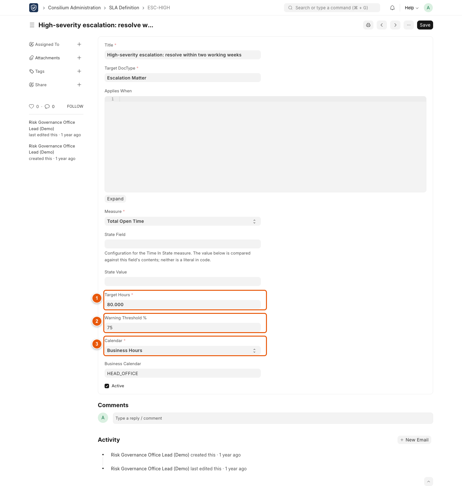

① **Target hours**: the limit.

② **Warning threshold %**: when to warn the owner (for example at 80%).

③ **Calendar**: count every hour, or only working hours (with a business
calendar).

**Working hours and holidays** are in **Business Calendar**:

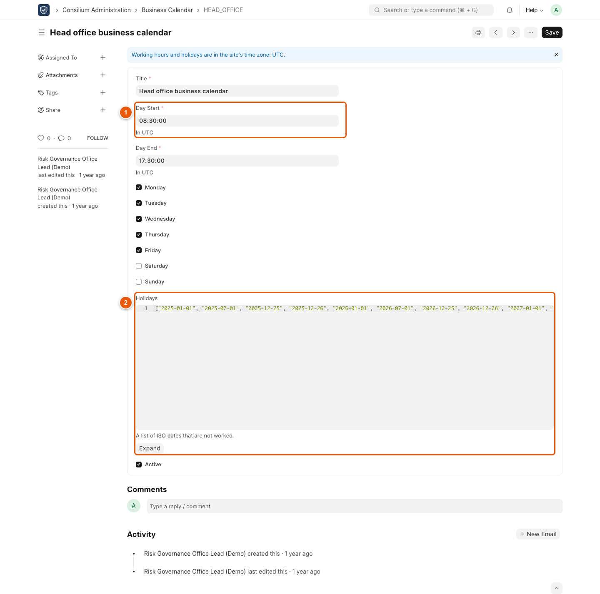

① **Day start** and day end, and the working days. The form says which time
zone they are in.

② **Holidays**: the dates that aren't worked.

**Reminders** for attestations follow each campaign's own schedule (section
9.12).

---

## 9.8 Escalation routing rules

The **escalation matrix** decides a new escalation's severity, the committees
it goes to, its time limit, and who is told. Open **Advanced configuration →
Escalation Matrix**.

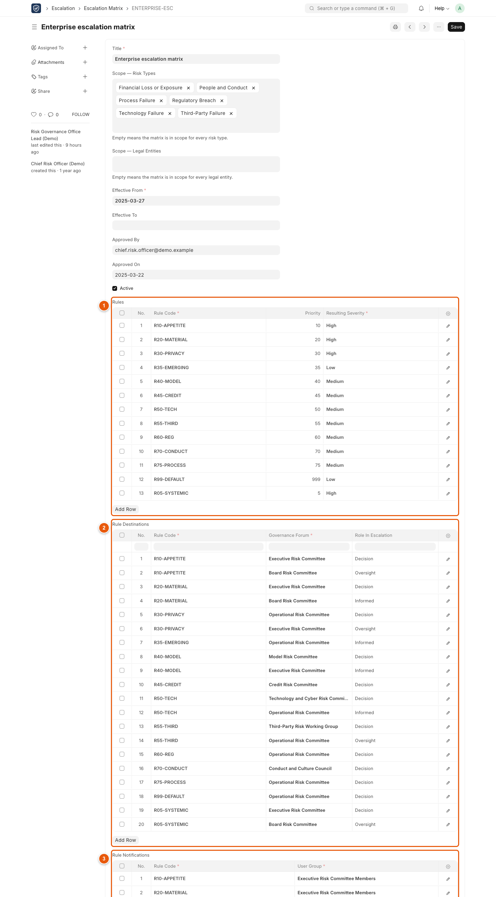

① **Rules**: each has a priority, a condition (for example "technology risk at
enterprise level" or "risk appetite breached"), the severity it sets, and the
time limit. The first matching rule wins, lowest priority number first.

② **Destinations**: for each rule, the committees and their role (decide,
oversee, be informed).

③ **Notifications**: for each rule, the groups to tell.

You can change the severity, time limit, destinations and notifications of an
existing rule yourself. Conditions are written in a structured format: **ask
your platform team to write a new condition** and they'll add the rule for you
to check. Test a change on **Raise an escalation**, where the proposal box
shows which rule matched.

---

## 9.9 Approval routes

**New forums.** **Advanced configuration → Formation Approval Route**:

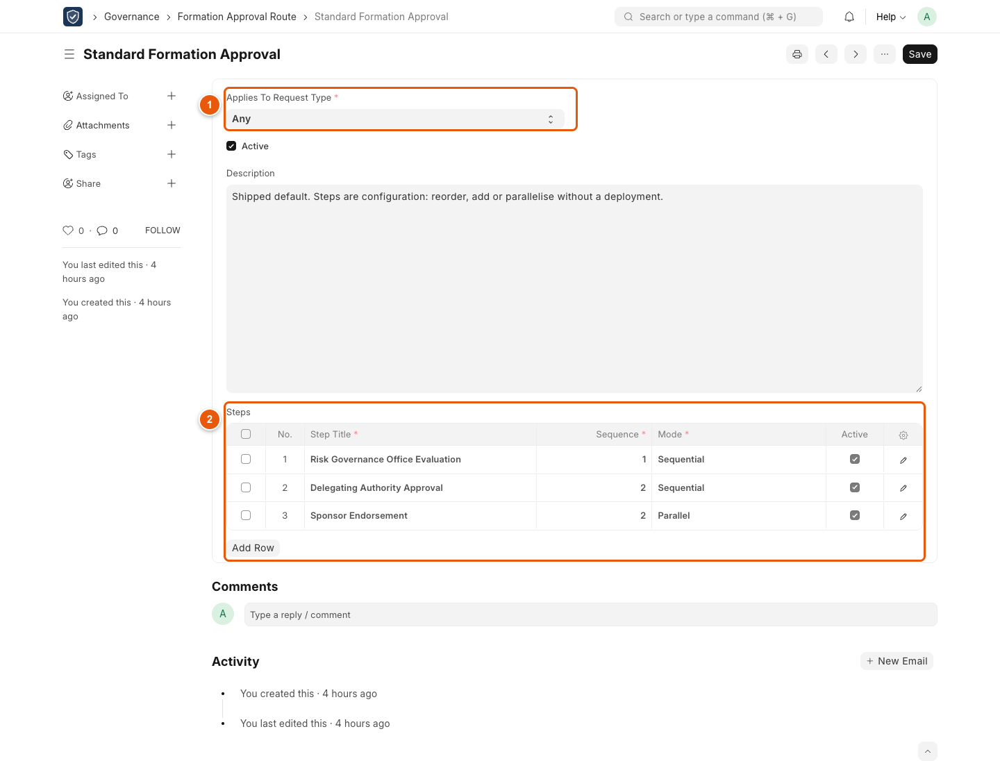

① **Applies To Request Type**: *Any*, or only *Create*, *Modify* or *Retire*.

② **Steps**: one row per approver. Each step names who decides (a named person,
a person named on the request such as the sponsor, or a role), its order,
and whether it's taken in sequence or in parallel. **Add Row** adds a step.

**Policies.** **Advanced configuration → Approval Route**:

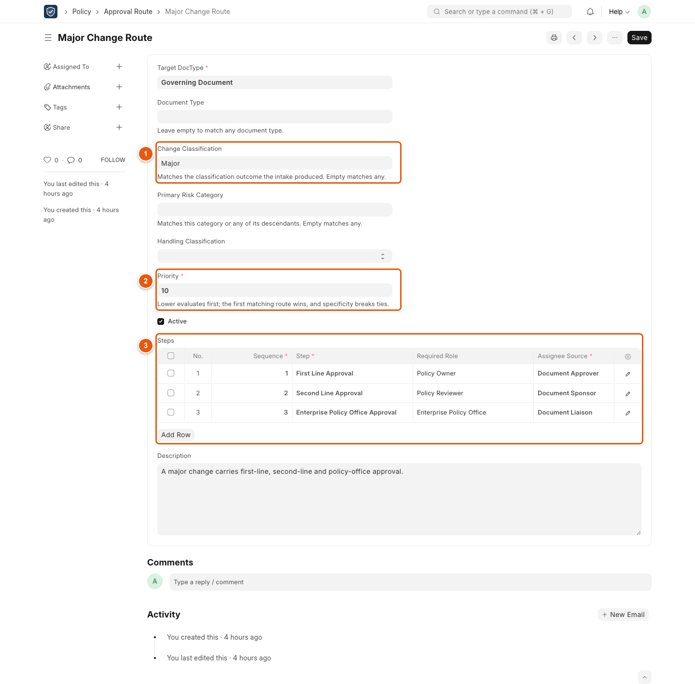

① **Change Classification**: which routes apply to major or minor changes. You
can also match on document type, risk category and handling.

② **Priority**: when several routes match, the lowest number wins.

③ **Steps**: each approver, in order.

Changes apply to approvals raised from now on. Approvals already under way
keep their steps.

---

## 9.10 Watched details

Some changes to a forum are important enough that it must be reviewed again.
Open **Advanced configuration → Watched Field Set → Governance Forum**.

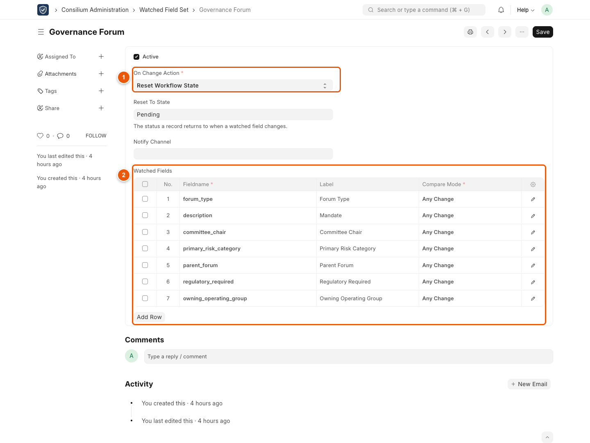

① **On Change Action**: what happens. Usually the forum goes back for a
compliance review and is locked until it's recorded.

② **Fields**: the details watched. Add a row to watch another, for example
how often the forum meets.

---

## 9.11 Adding a step to the policy lifecycle

You can add a stage to the policy lifecycle, for example a **Legal Review**
between Review and Approved, without any release.

> **Ask your platform team to switch on custom lifecycle steps first. This is
> done once.** After that, you add steps yourself.

Every step belongs to one of the six lifecycle stages (Draft, Review,
Approved, Published, Implemented, Retired). *Legal Review* belongs to
**Review**. So a policy in legal review counts as "in review" in every list
and report, and the same rules apply.

1. **Name the step and its button.** In **Advanced configuration**, add a
   **Workflow State** called *Legal Review* and a **Workflow Action Master**
   called *Refer to Legal Review*.
2. **Add it to the lifecycle.** Open **Workflow → Governing Document
   Lifecycle**.

   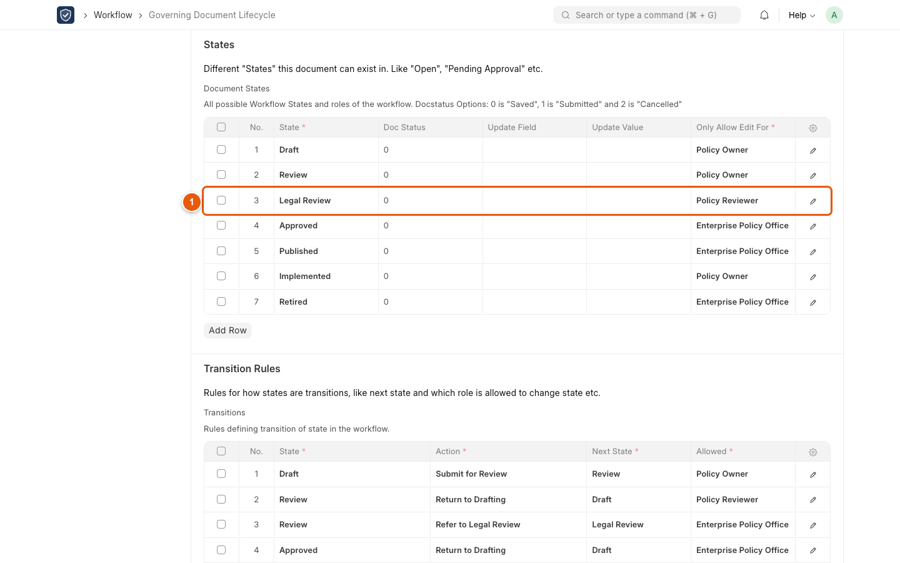

   ① Add a row under **States** for *Legal Review*, saying who may edit a
   policy while it's there.

   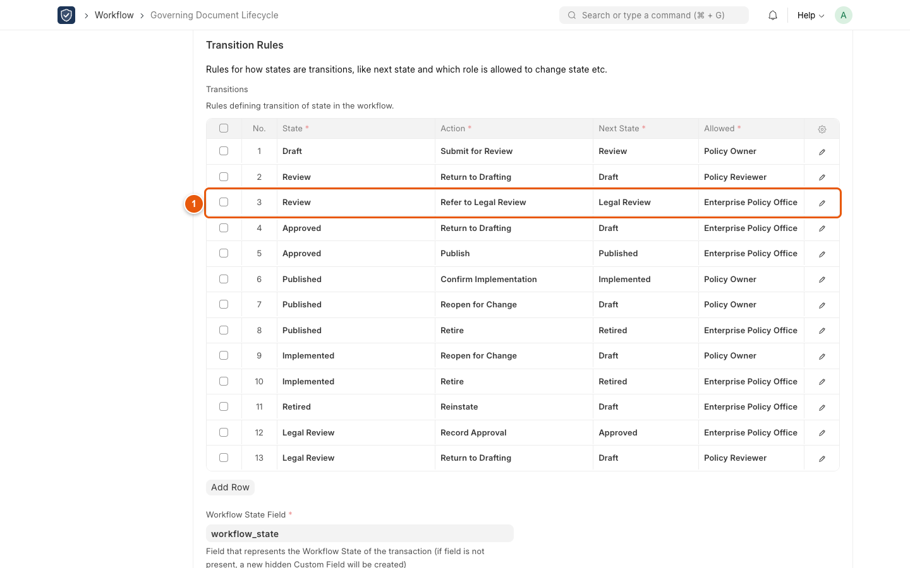

   ① Under **Transitions**, change *Review → Record Approval* to *Review →
   Refer to Legal Review → Legal Review*, and add *Legal Review → Record
   Approval → Approved* and *Legal Review → Return to Drafting → Draft*, each
   with the role allowed to press it. Save.

3. **Say what the step means.** In **Workflow State Flag**, add a row for
   *Legal Review*:

   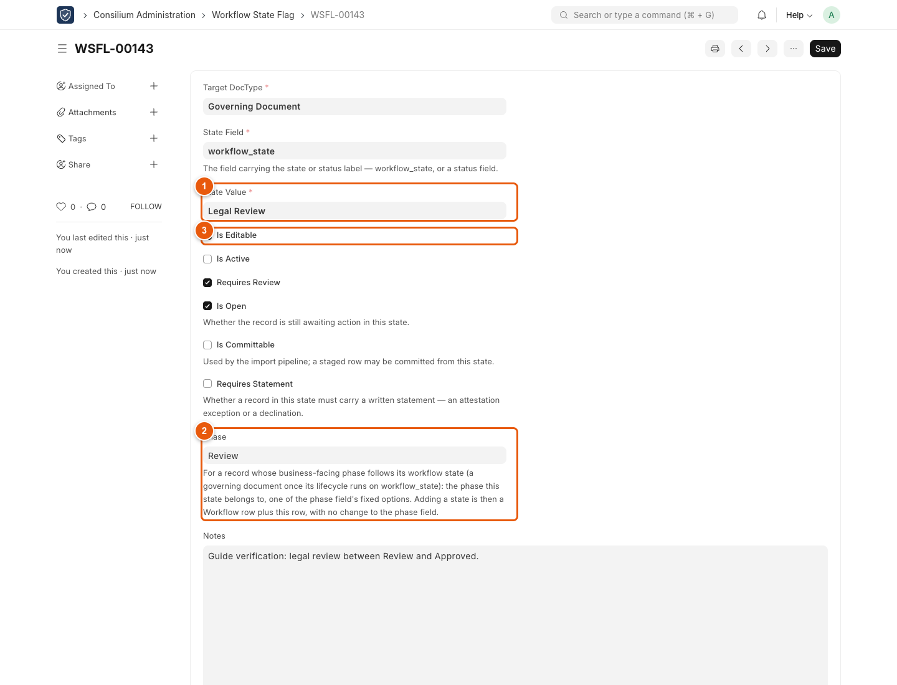

   At the top, **Target DocType** is *Governing Document*, and **State Field**
   is the value your platform team gives you when they switch on custom steps.

   ① **State Value**: *Legal Review*, spelled exactly as in the workflow.

   ② **Phase**: *Review*, one of the six stages, spelled exactly.

   ③ **The flags**: tick *Is Editable*, *Requires Review* and *Is Open*, the
   same as the Review stage.

4. **Test it.** Take a test policy to Review. The new button appears:

   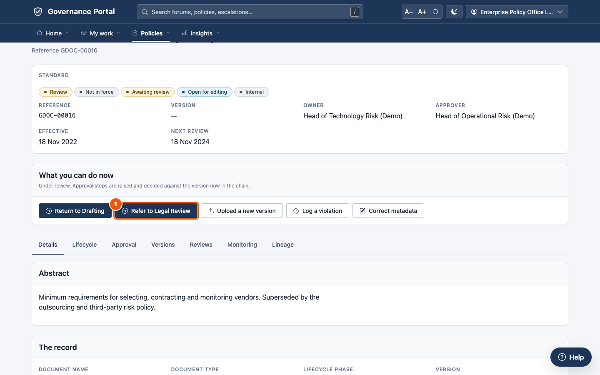

   ① **Refer to Legal Review.**

   Click it and confirm. The policy is now in legal review, and still counts
   as in review:

   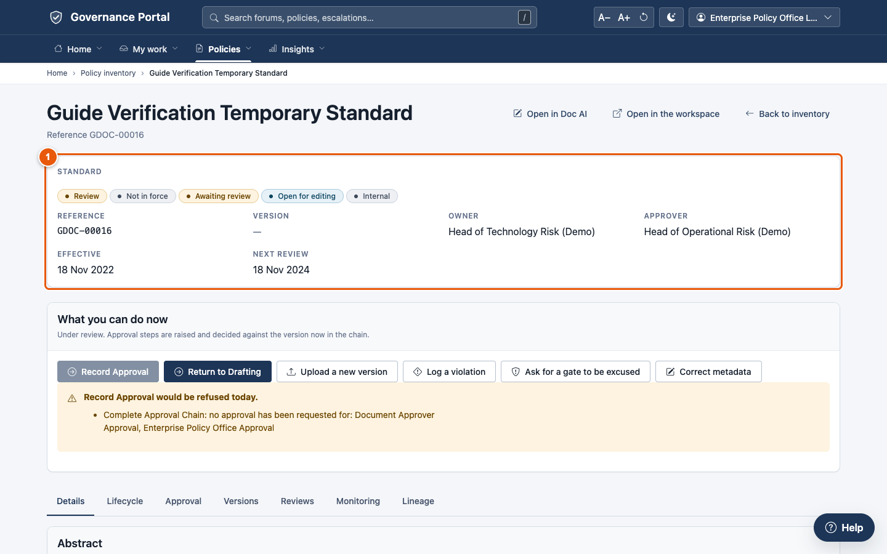

   ① The policy's summary.

If you forget step 3, the platform refuses to move a policy into the new step
and says what is missing. If you misspell the stage, the row isn't saved and
the message lists the six stages. Nothing breaks silently. **Renaming a step** is done the same way: add the new name, move the
policies across, then remove the old one. Ask your platform team if you
need help.

---

## 9.12 Attestation campaigns

Forum campaigns are opened from **Admin → Attestation campaigns** ([chapter
4](04-policies.md), section 4.10). Other campaigns, such as the annual policy
owner attestation, are set up in **Advanced configuration → Attestation
Campaign**:

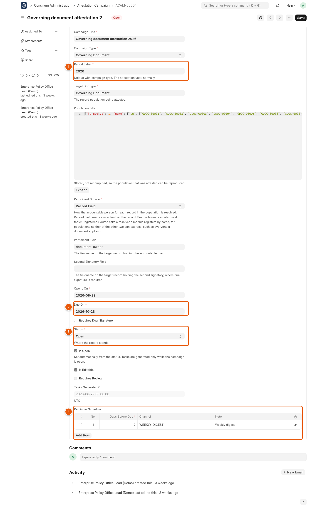

① **Period Label**: for example the year. One campaign per type and period.

② **Opens On** and **Due On.**

③ **Status**: *Draft* while you prepare it, *Open* to run it.

④ **Reminder Schedule**: when to remind people, in days before the due date
(for example 14 and 3). Each point reminds whoever the attestation is waiting
on, once.

Who is asked (for example "the owner of every policy in force") is set up
when the campaign is created; ask your platform team for a new kind of
campaign. When it's **Open**, click **Generate tasks** on the campaigns page.

---

## 9.13 The home-page guidance

The **How it works** section of the home page is yours to write. Click
**Write an article** on **Administration**.

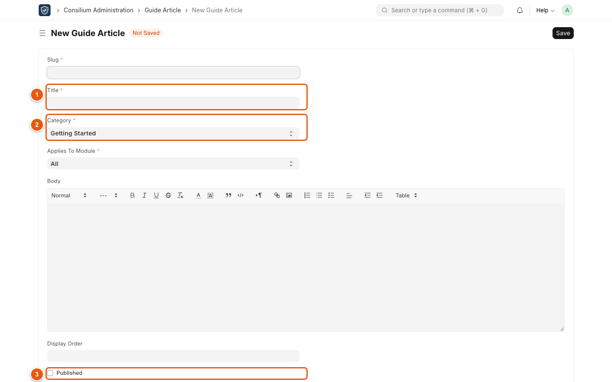

① **Title**: the heading people see.

② **Category**: which part of the home page it fills (*Getting Started*,
*Forum Types*, *Templates*, *Decision Authority*, *Escalation Protocol*). An
article in any other category, or a second one in a category, gets a card of
its own.

③ **Published**: tick to show it. Unpublished articles are drafts.

Published articles are also what the Help assistant quotes when it answers.

---

## 9.14 Integrations, card by card

**Admin → Integrations** connects the platform to your organisation's other
services. Each card says what it's for, what leaves the platform when it's
on, and whether it's working.

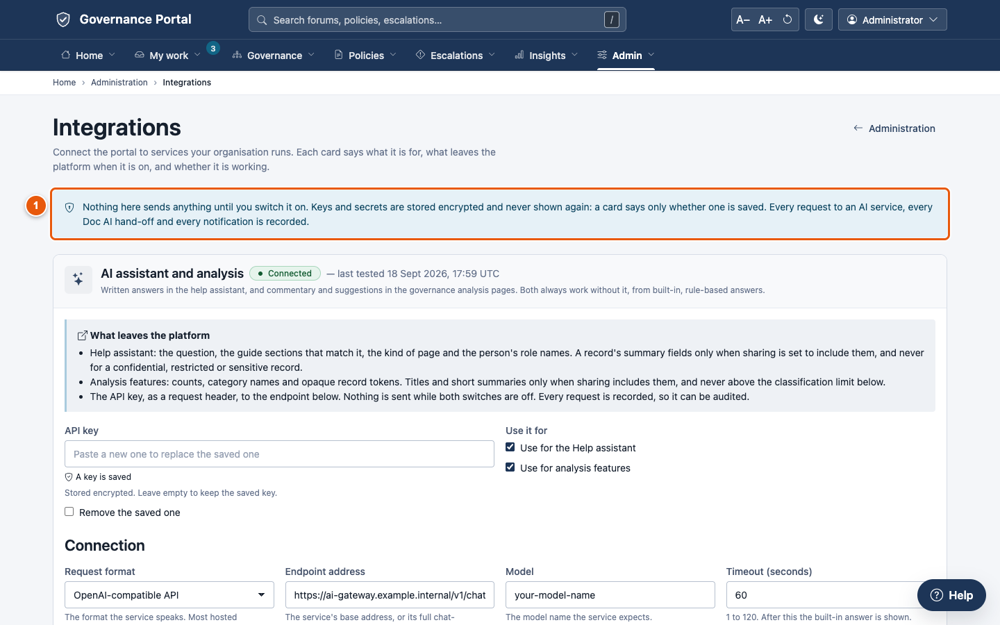

① Nothing is sent anywhere until you switch it on. Keys and secrets are
stored encrypted and never shown again.

### AI assistant and analysis

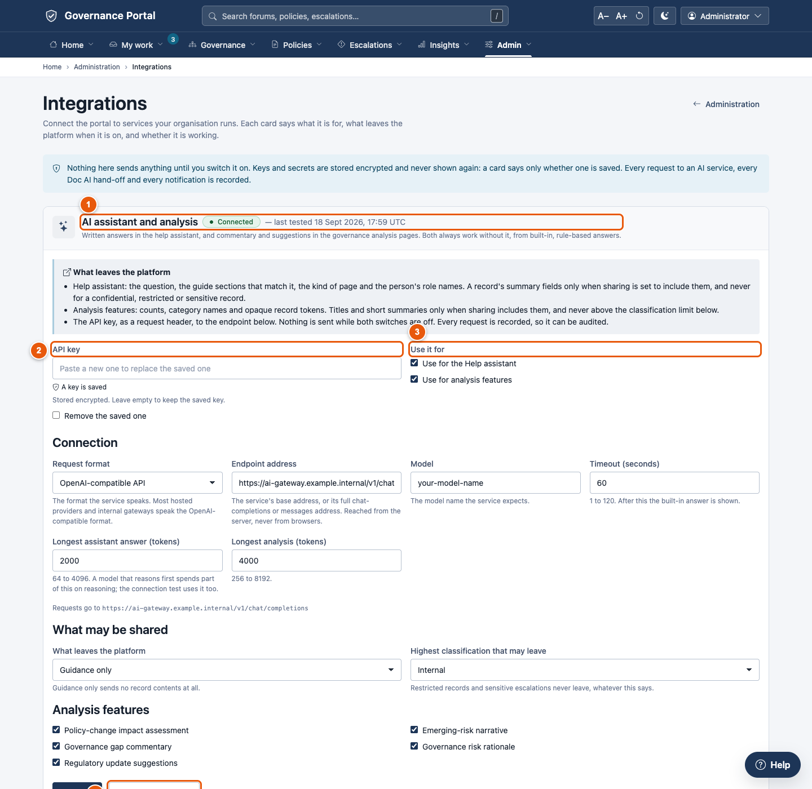

① **Status**: *Connected* (with when the connection was last tested),
*Not connected* or *Off*.

② **API key**: paste the key your AI provider gave you. It's never shown again;
the card just says "A key is saved".

③ **Use it for**: the Help assistant, the analysis commentary, or both.

④ **Test connection** sends one short request and shows whether it worked.

The connection details (request format, address, model name, time limit) come
from your AI provider; your platform team can help.

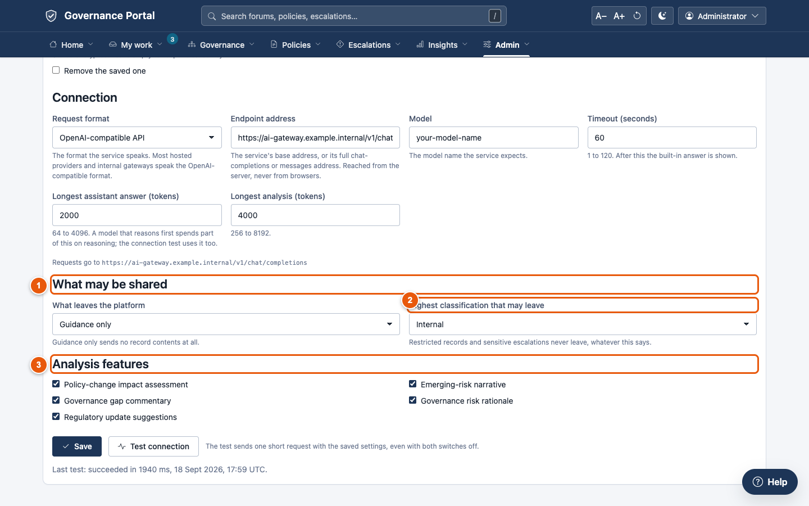

① **What leaves the platform**: *Guidance only* (the default: no record
contents at all), or also a summary of the record on screen.

② **Highest classification that may leave**, for example *Internal*.
Restricted records and sensitive escalations never leave, whatever this says.

③ **Analysis features**: which commentaries to offer.

### Doc AI

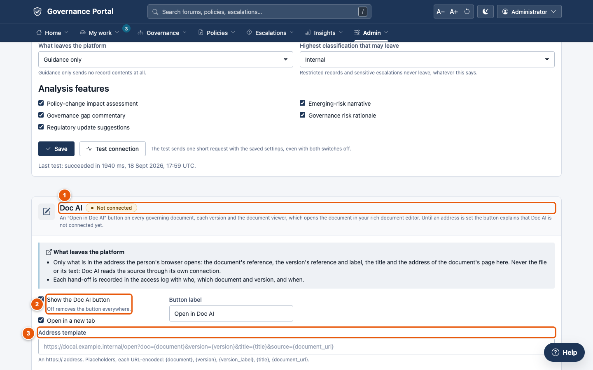

① **Status.**

② **Show the Doc AI button**: untick to remove it everywhere.

③ **Address template**: the address of your document editor, as given by its
supplier. You can also set the button's label, whether it opens in a new tab,
and which of the platform's roles see it. Only the document's reference and title are passed,
never its text.

### Horizon scanning

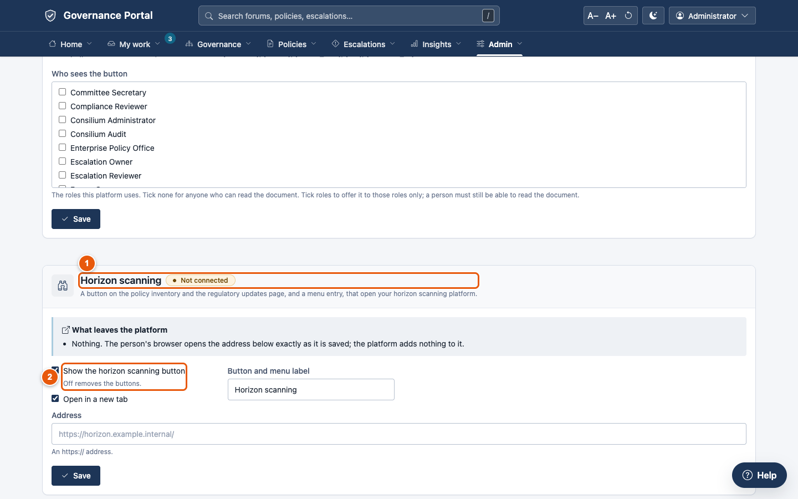

① **Status.**

② **Show the horizon scanning button**. Then set its label and the address of
your horizon-scanning service.

### Email

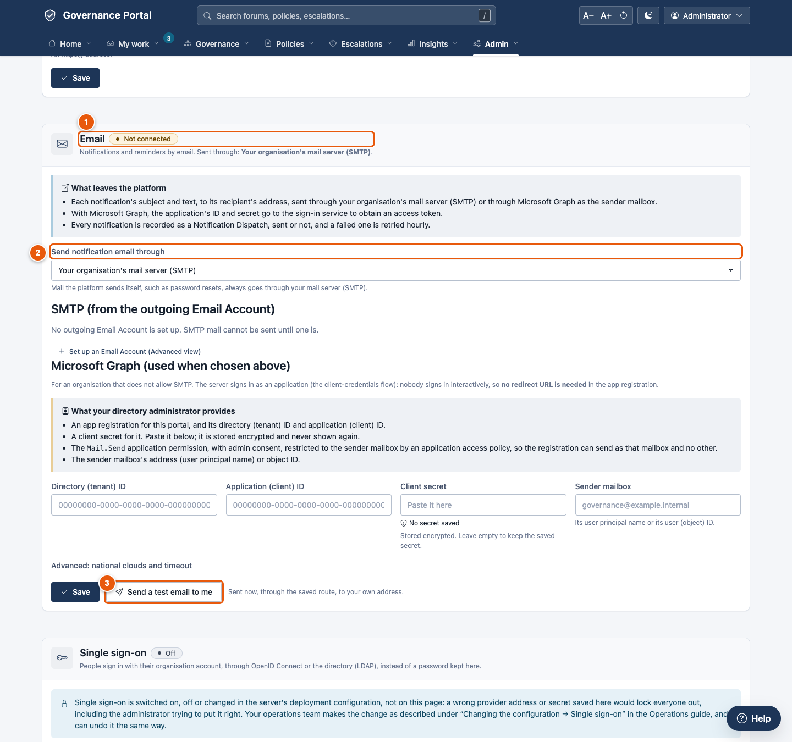

① **Status.**

② **Send notification email through**: your mail server, or Microsoft 365
(Graph). For Microsoft 365, your directory administrator gives you the
directory ID, application ID, client secret and sender mailbox, listed on the
card.

③ **Send a test email to me** checks it, sending to your own address.

### Single sign-on

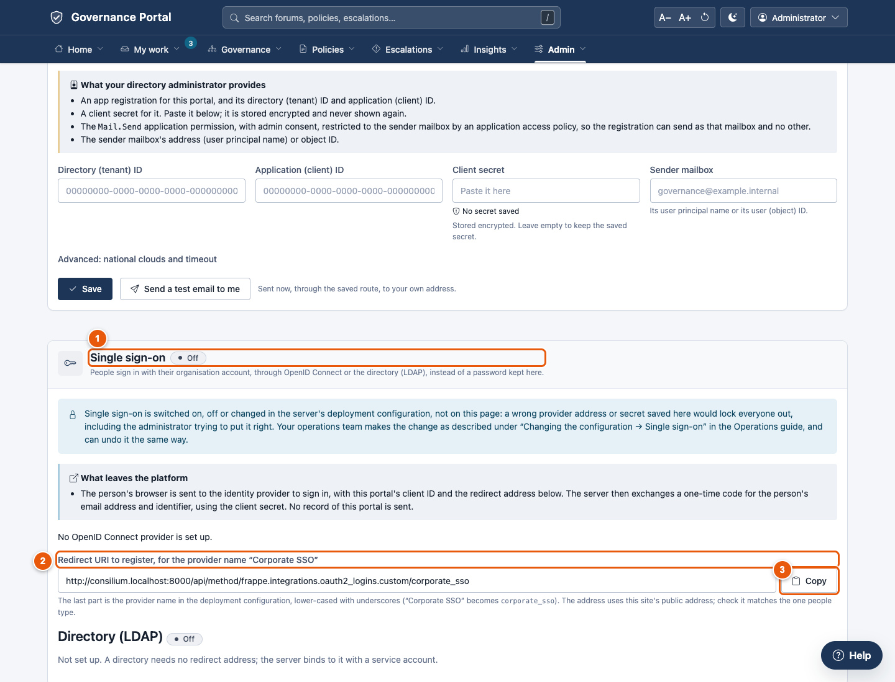

① **Status.** Single sign-on is switched on and off by your platform team,
because a mistake could lock everyone out.

② **Redirect URI to register**: the address your identity team needs.

③ **Copy** copies it, ready to send to them.

---

## 9.15 When something is refused

Every time a rule stops an action, the platform writes the reason to the
**Governance Refusal Log** (**Advanced configuration → Governance Refusal
Log**). After you change a setting, check it for refusals you didn't expect:
it tells you at once whether people are being stopped.

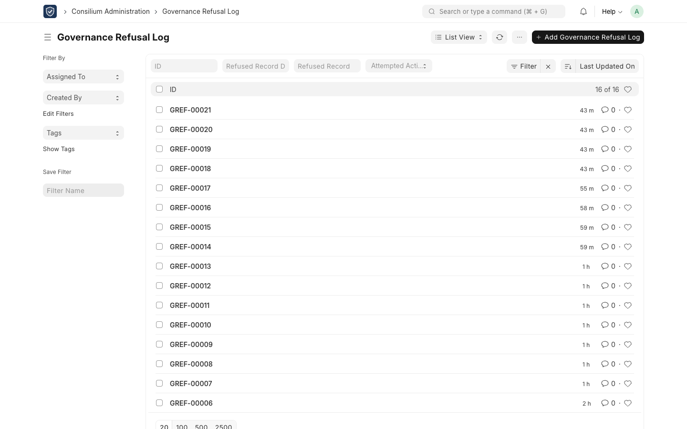

---

## Tips

- **Change one thing at a time**, then test it with a test record.
- **Retire, don't delete**: lists, people, routes and templates are all made
  inactive, never removed.
- **Write down why** in the record's notes or description when you change a
  setting.
