# 9. Reports

**Purpose.** **Reports** is the management view across forums, documents and
escalations: headline figures, breakdowns, coverage gaps, missing metadata,
time-limit clocks, and an escalation analysis you can download. Three analysis
pages sit beside it: **Gaps and risk**, **Emerging risks** and **Regulatory
updates**.

All four pages share a row of links at the top: **Management reporting**,
**Gaps and risk**, **Emerging risks** and **Regulatory updates**. They sit
under **Reports** in the top bar.

**Who can do it.** Everyone who is signed in. **Every figure counts only the
records you may read**, so two people can see different totals. Sensitive
escalations and restricted documents are counted only for people cleared to
see them.

---

## 9.1 Management reporting

Click **Reports** in the top bar.

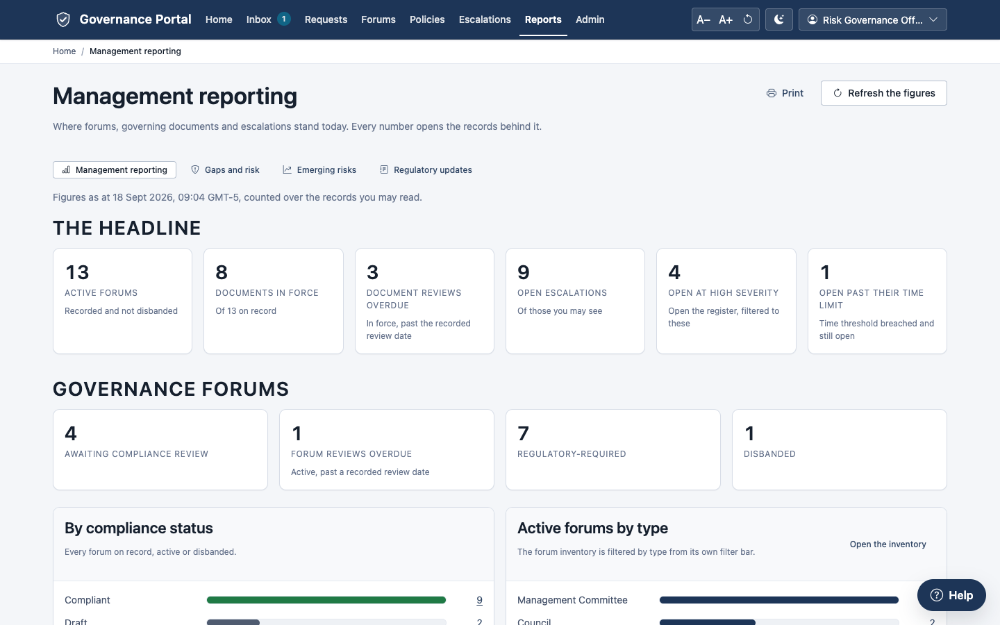

The line under the title says when the figures were counted ("Figures as at
…, counted over the records you may read"). **Refresh the figures** counts
again; **Print** prints the page.

**Every figure is a link.** Click it to open the matching list, already
filtered. For example, *Document reviews overdue* opens
`/policies?standing=overdue`.

| Section | What it shows |
|---|---|
| **The headline** | Active forums; documents in force; document reviews overdue; open escalations; open at high severity; open past their time limit. |
| **Governance forums** | Awaiting compliance review; forum reviews overdue; regulatory-required; disbanded; forums by compliance status and by type. |
| **Coverage gaps** | A matrix of risk categories against operating groups, counting active forums or documents in force. Empty cells (gaps) are highlighted. Choose what to count in **Count**. |
| **Governing documents** | Awaiting review; review due within 90 days; no review date; missing required metadata; documents by phase, type, operating group and handling; the table **Required metadata missing**. |
| **Escalations** | Open more than 30 days; awaiting review; time limit ever breached; risk appetite breached; closed; open matters by severity, age, type and level; **Time-limit clocks**; and **Volumes, durations and outcomes**. |

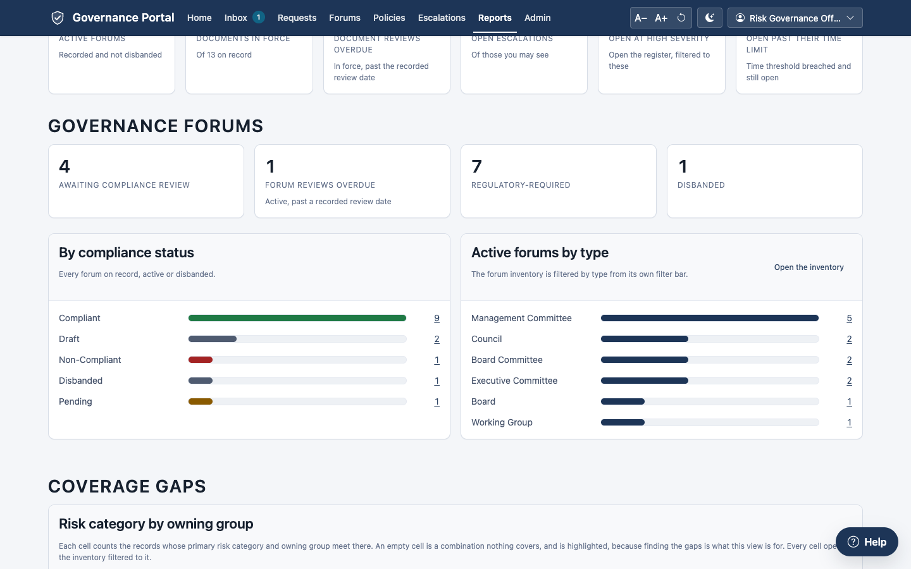

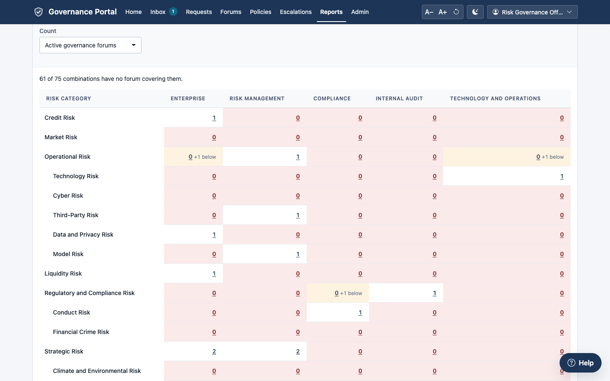

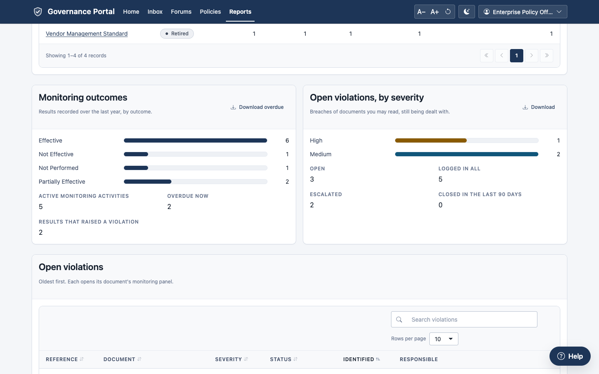

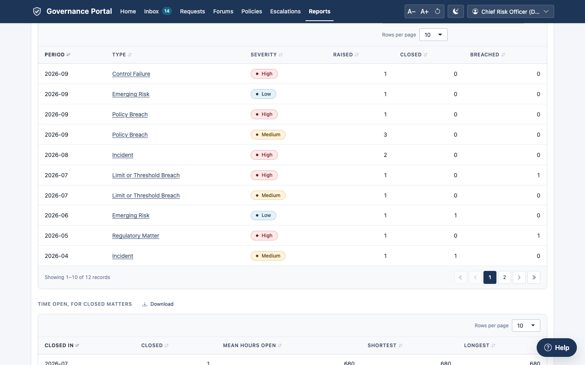

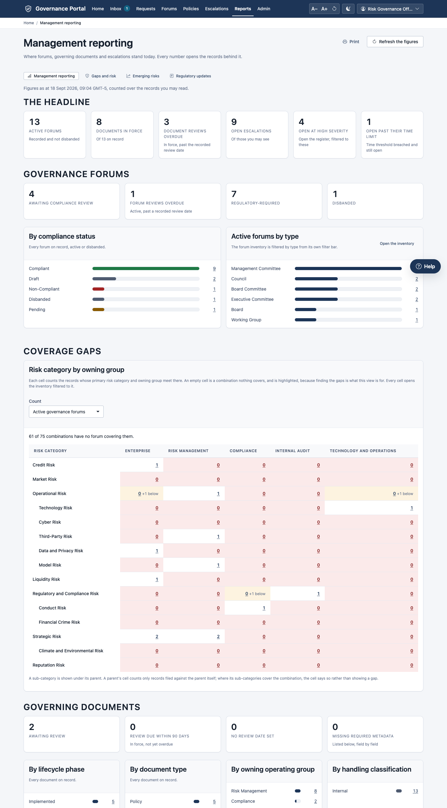

---

## 9.2 Downloading the escalation analysis

1. Scroll to **Escalations → Volumes, durations and outcomes**.
2. Choose **Group by**: **Month**, **Quarter** or **Year**.
3. Each table (**volumes**, **durations**, **destinations**, **outcomes**) has
   a **Download** button. Click it to save the table as a CSV file
   (`escalation-<view>-<date>.csv`), which opens in a spreadsheet.

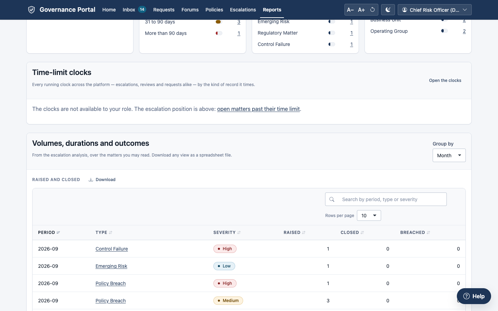

If a table is empty, the page says "There is nothing to download for this
view yet."

**Other exports.** Every list in the workspace can be exported with
**Menu → Export** (subject to your permissions).

---

## 9.3 Governance gaps and risk

Open **Reports → Gaps and risk** (or `/governance-gaps`). The page works out,
from the records as they stand, where governance coverage is missing or
incomplete.

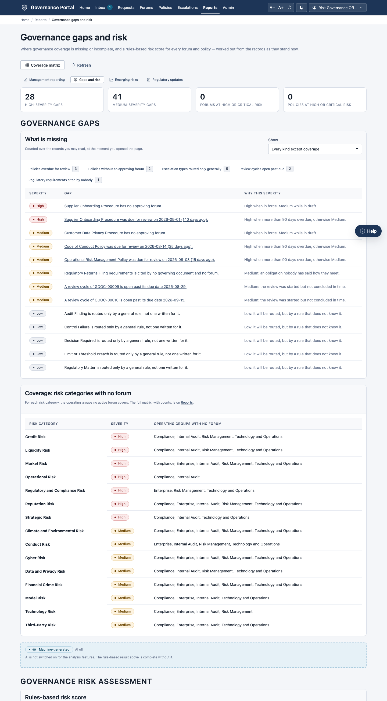

- **The headline:** high- and medium-severity gaps, and the forums and
  policies at high or critical risk.
- **What is missing:** each gap, with its severity and **why** it has that
  severity. For example:
  - a forum with no charter;
  - a policy with no approving forum;
  - a review overdue;
  - an escalation type routed only by a general matrix rule;
  - a regulatory requirement nobody cites.

  **Show** chooses the kinds of gap. Each gap links to its record.
- **Coverage: risk categories with no forum:** for each risk category, the
  operating groups that no active forum covers.
- **Rules-based risk score:** a score for every forum and policy (tabs
  **Forums**, **Policies** and **Weights**), with the reasons behind it.

The rules-based results are complete on their own. If your administrator has
switched on AI assistance, a **Machine-generated** box can add a commentary on
request. It is labelled, and never replaces the rule-based result.

---

## 9.4 Emerging risks

Open **Reports → Emerging risks** (or `/emerging-risks`). It shows trends and
leading indicators across escalations, violations and reviews over a chosen
**Window** (6, 12 or 24 months). It too counts only the records you may read.

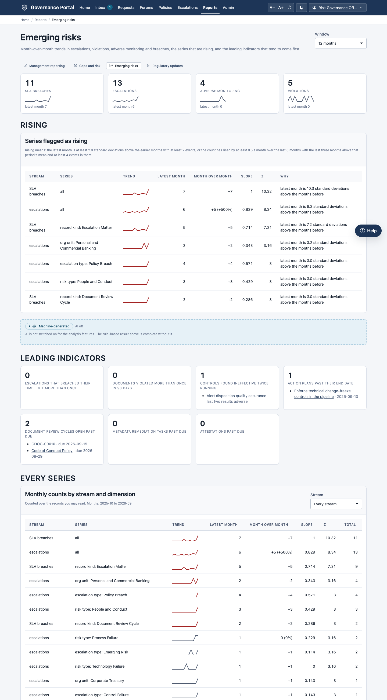

---

## 9.5 Regulatory updates

Open **Reports → Regulatory updates** (or `/regulatory-updates`). It lists the
regulatory requirements in the library. Open one to see:

- its details and **Most recent change** (each field as it was and as it is
  now);
- **Directly affected: records citing it**, with the likely sections. Their
  owners are notified of every change;
- **Possibly affected: documents that do not cite it**: documents that share
  its distinctive words or its jurisdiction. This is a heuristic, not a
  finding.

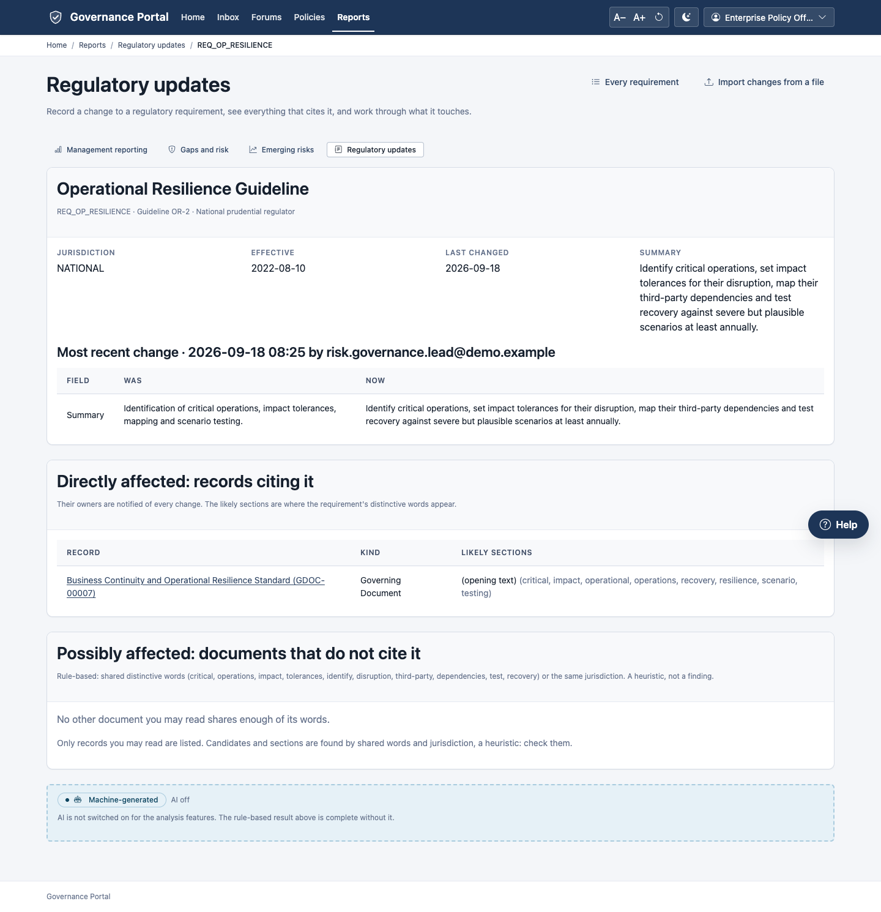

**The list** (**Regulatory requirements**) shows the requirements changed in
the last year first, with each one's citation, regulator, when it last
changed, and how many documents and forums cite it.

**Recording a change** (people who may edit regulatory requirements):

1. Open the requirement. Under **Record a change**, edit the **Name**,
   **Citation**, **Regulator**, **Effective date**, **Summary** or
   **Description**.
2. Click **Save the change and notify citers**. "Saved. The owners of N citing
   record(s) are being told." If nothing changed: "Nothing has changed."

Changes can also be loaded from a file: **Import changes from a file** opens
Imports ([chapter 10](10-administration.md)), with the *Regulatory changes*
profile.

**Suggestions for citing documents** (when AI assistance is switched on):

1. **Ask the AI service for a summary and suggestions**. Each suggestion appears
   in a card marked "Machine-generated": nothing in it is in any record until a
   person accepts it.
2. For each suggestion, edit the note if you wish, then click **Accept and
   write** (the note is added to that document's regulatory references) or
   **Reject**.

Only someone who may change the document can decide. Everyone else sees
"Awaiting a decision by someone who may change this document." Each
suggestion is decided once, and the decision is recorded.

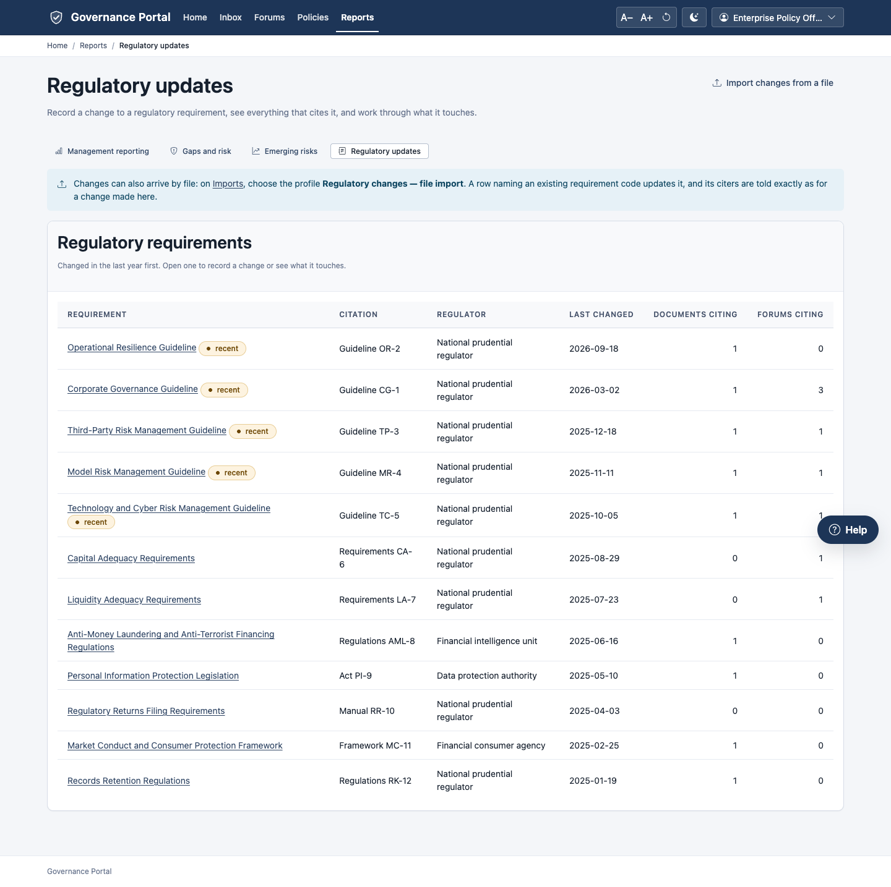

---

## Common problems

| What you see | What it means | What to do |
|---|---|---|
| "Some figures could not be counted." | A count failed, usually because of permissions on one list. | Refresh. If it persists, tell your administrator. |
| A figure is lower than a colleague's | You may read fewer records. | Expected: figures follow your access. |
| "The clocks are not available to your role." | Time-limit clocks are readable by administrators and auditors. | Ask them, or use the escalation register's breach filters. |
| "There is nothing to download for this view yet." | The table is empty for the period chosen. | Choose another grouping. |

## Tips

- **Bookmark the filtered lists** the figures open. They make good weekly
  checklists.
- **Print** produces a clean paper copy for a committee pack.
- **Use Gaps and risk before the annual inventory review.** It lists forums
  without charters and policies without approving forums.
