# 10. Administration

**Purpose.** Everyday administration, without an engineer:

- people and roles, role profiles, record-level restrictions and
  impersonation;
- the reference lists everything chooses from;
- importing records from files;
- branding, the time zone, and the help assistant;
- retention and legal holds;
- delegations;
- the logs to look at when something goes wrong.

Changing how the platform *behaves* (workflows, routes, gates, the matrix,
time limits, templates, notifications) is covered in
[chapter 11](11-configuring-workflows.md). Installation and first-run steps
are in [`../ADMIN-GUIDE.md`](../ADMIN-GUIDE.md).

**Who can do it.**

| To | You need |
|---|---|
| Open **Admin**, reference lists, guide articles, configuration links | Consilium Administrator or System Manager |
| Users, roles, permission rules, record-level restrictions, Portal Branding, System Settings | System Manager |
| Impersonate a user | The **Administrator** account only |
| Maintain reference lists | Taxonomy Administrator (and administrators) |
| Retention classes, legal holds, disposal | Records Manager |
| Upload and commit imports | Consilium Administrator or System Manager (Consilium Audit may read) |

---

## 10.1 The Admin page

Click **Admin** in the top bar (administrators only).

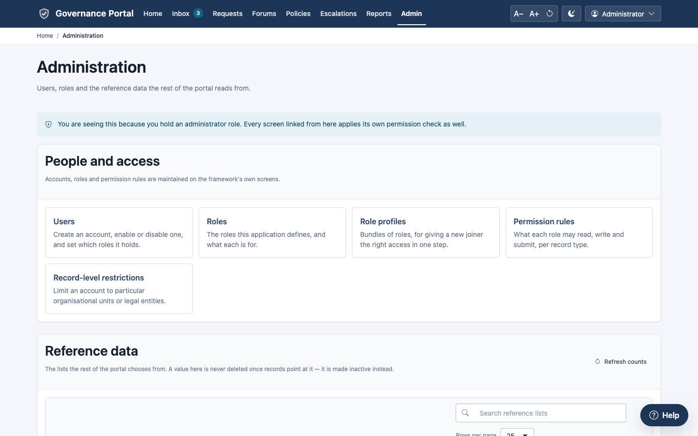

| Section | Contains |
|---|---|
| **People and access** | Users, Roles, Role profiles; for System Managers also **Permission rules** and **Record-level restrictions** |
| **Reference data** | Every reference list with its purpose, module and number of values, and **Add a value**. **Refresh counts** re-reads the numbers. |
| **The home-page guide** | The guide articles shown on the home page, and **Write an article** ([chapter 11](11-configuring-workflows.md), section 11.13) |
| **Configuration and operations** | Workflows, state flags, watched fields, notification channels, service levels, retention classes; for System Managers also scheduled jobs, the error log and system settings; and the interface reference |

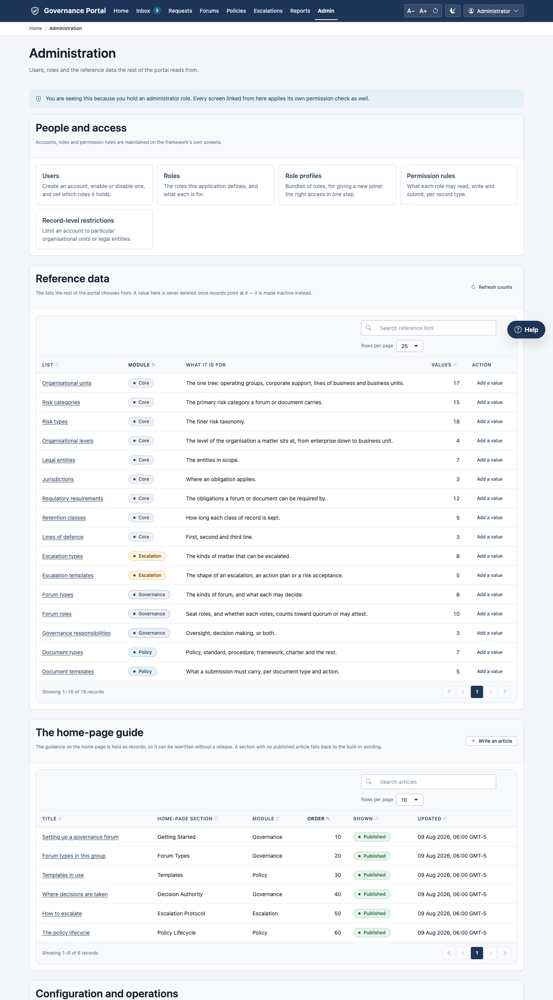

The workspace's **Consilium Administration** workspace links the rest,
including **Portal Branding**, **Legal Hold**, **Authority Delegation** and the
**Governance Refusal Log**.

---

## 10.2 People

### Adding a person

1. Open **Admin → Users** (or `/app/user`), then **+ Add User**.
2. Enter their **Email**, **First Name** and **Last Name**. Leave the user type
   as **System User** for anyone who works in the portal.
3. Save. Then open the **Roles & Permissions** section and tick their roles,
   or choose a **Role Profile** (below).
4. Save again.

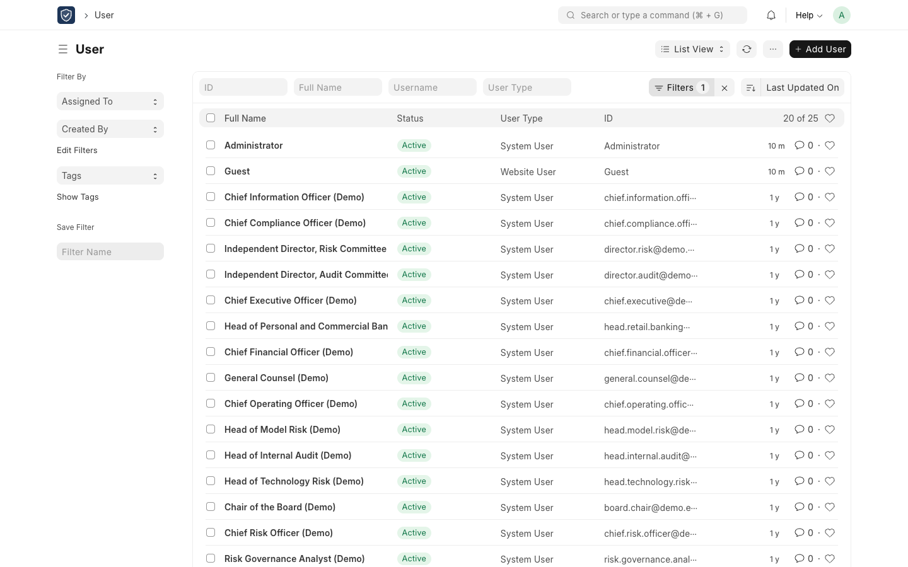

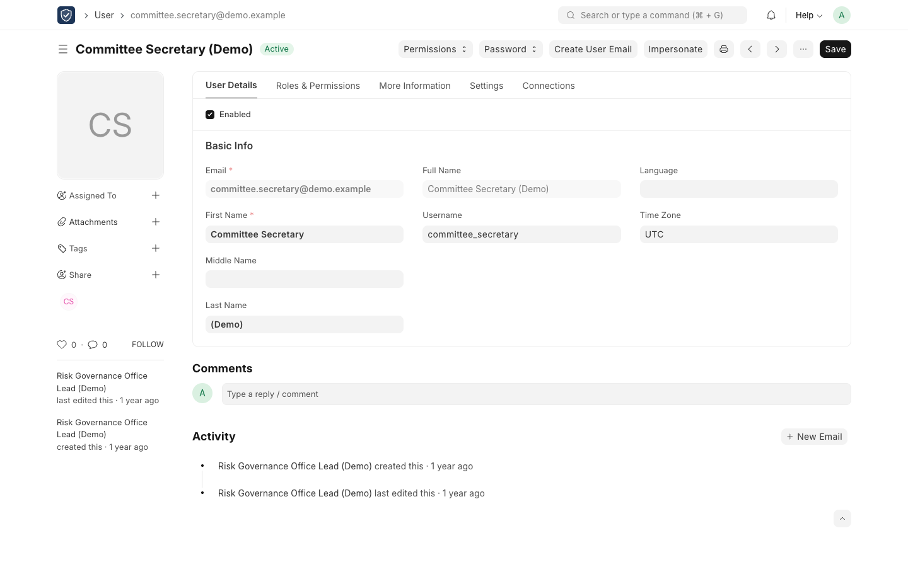

**Demonstration personas.** On a demonstration or training site, the
`…@demo.example` personas have no password until you run
`deploy/demo_logins.py`. It gives each of them a random password and writes
the list to a file **outside the repository** ([chapter 1](01-getting-started.md),
section 1.1). Never run it on a site with real users; it refuses unless forced.

> **Never delete a user.** Untick **Enabled** instead. Their name stays on
> everything they did, and they can no longer sign in.

### Role profiles

A **role profile** is a named set of roles for people who share a job, for
example "Committee Secretary". Choose it on the user to give them all its
roles in one step. Change the profile, and everyone with it changes too.
Profiles are under **Admin → Role profiles** (`/app/role-profile`).

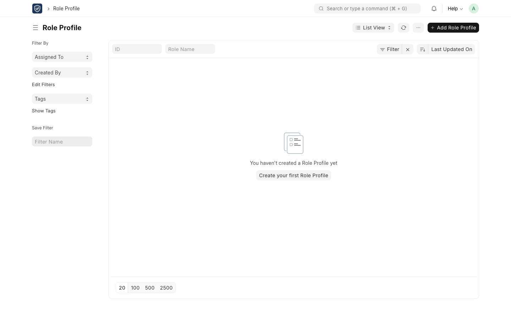

### What each role can do

The role table in [chapter 1](01-getting-started.md) summarises the roles.
The exact permissions per record type are in **Admin → Permission rules**
(`/app/permission-manager`). If your operating model differs, change them
there, and record why.

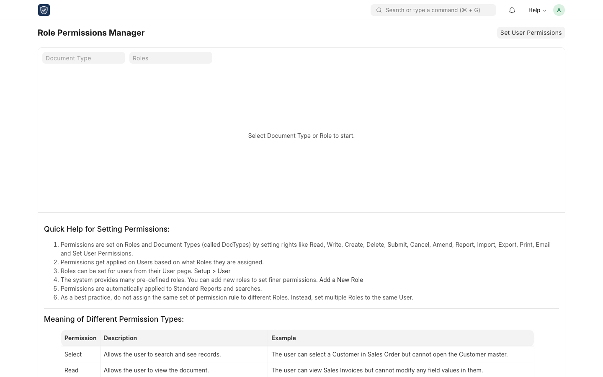

### Record-level restrictions

To limit someone to part of the organisation, for example one organisation
unit or legal entity:

1. Open **Admin → Record-level restrictions** (`/app/user-permission`),
   then **+ Add User Permission**.
2. Choose the **User**, **Allow** (the record type, for example *Organization
   Unit*) and **For Value** (the unit).
3. Save.

The restriction applies everywhere: lists, counts, reports, search, the API
and the help assistant.

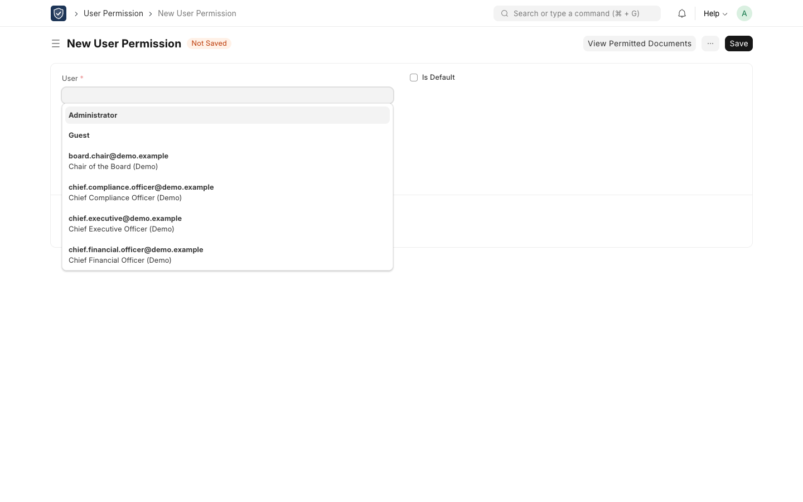

### Sensitive escalations

Matters marked sensitive are invisible to anyone without **Sensitive
Escalation Access**. Grant it sparingly, and include it in your access
reviews ([chapter 7](07-escalations.md), section 7.8).

---

## 10.3 Seeing what a user sees: impersonation

The right way to investigate "I can't see X" involves no password.

1. Sign in to the workspace as the **Administrator** account.
2. Open the user's record.
3. Click **Impersonate**.
4. Enter the **Reason for impersonating**. The user is told the reason.
5. Click **Confirm**. You are now signed in as them.
6. Sign out to end the impersonation.

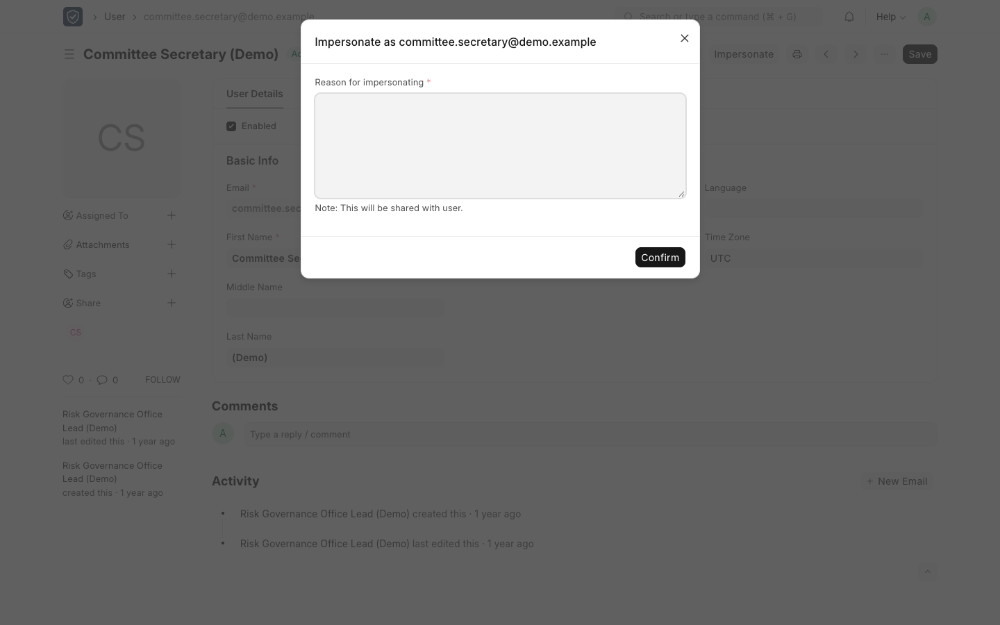

The session is logged. Only the Administrator account sees the
**Impersonate** button.

---

## 10.4 Delegation

When someone is away, an **Authority Delegation** lets a colleague act for
them for a period. They can then decide approval steps, answer attestations
and so on, and the record shows "under delegation".

1. Open *Consilium Administration → Authority Delegation* and click
   **+ Add**.
2. Choose the **Delegator** and the **Delegate**.
3. Set the scope: **All**, a record type, one record, or one forum.
4. Set **Valid From** and **Valid To**, and give the **Reason**.
5. Choose the **Delegated Actions** it transfers (for example *APPROVE*,
   *ATTEST*).
6. Save. The delegation is active between its dates, and is refreshed daily.

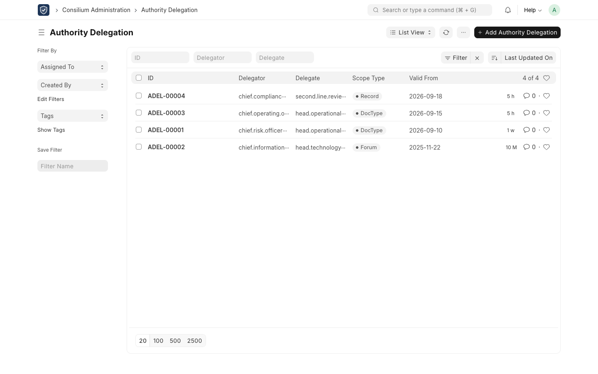

---

## 10.5 Reference data

The lists every form chooses from:

- forum types and roles;
- risk categories and two tiers of risk type;
- organisation units, organisational levels, legal entities and
  jurisdictions;
- regulatory requirements;
- document types and templates;
- escalation types and templates;
- retention classes and lines of defence.

**To add a value:** on **Admin → Reference data**, click **Add a value** on
the list. Fill in its code and name, and save.

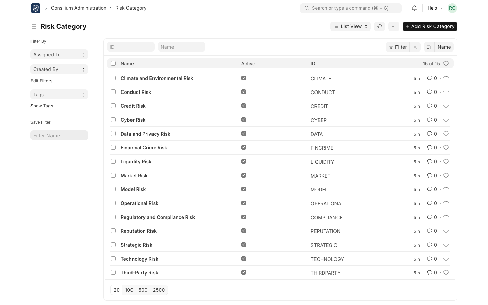

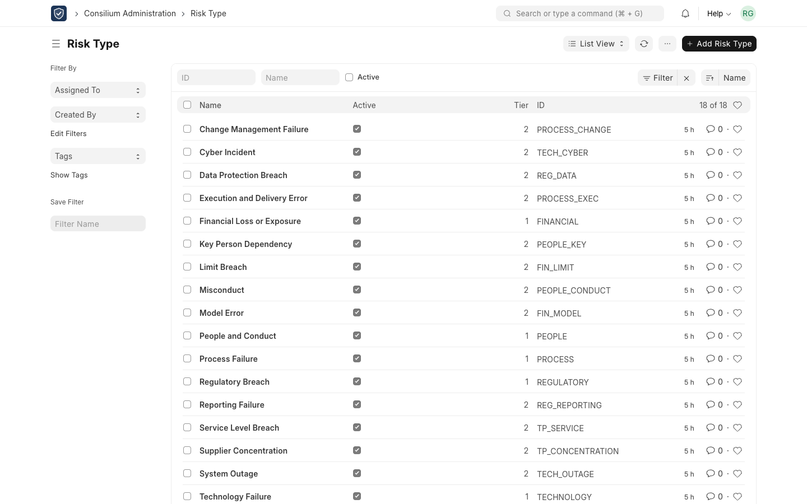

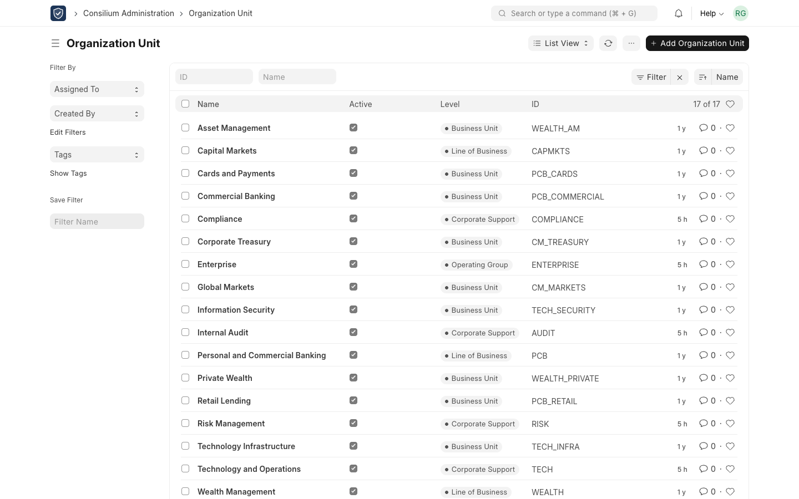

**Rules:**

- **Never delete a value that records use.** Untick **Active**. The value stays
  on historical records and is no longer offered for new ones.
- **Codes are permanent.** Imports and integrations match on the code. Rename
  the display name freely, but do not reuse a retired code.
- **Risk types have two tiers.** A tier 1 type has no parent; a tier 2 type
  must have one.
- **Bulk changes:** every list in the workspace has **Menu → Import** for a
  spreadsheet of values.

---

## 10.6 Imports

**Imports** loads records from a file through a governed pipeline:

1. upload;
2. validate;
3. review the rows;
4. commit or discard.

Nothing is written until someone commits.

Open **Admin → Imports** (or `/imports`).

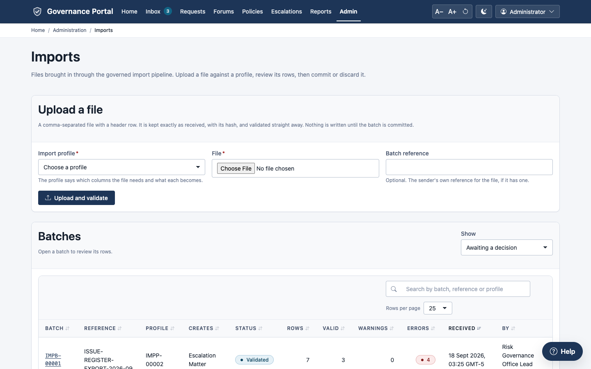

**Uploading a file:**

1. Choose the **Import profile**. The profile says which system the file comes
   from, what it creates, and how each column is mapped. **Columns this profile
   reads** lists them, with whether each is required.
2. Choose the **File** (a .csv, up to 5 MB).
3. Optionally give a **Batch reference**.
4. Click **Upload and validate**.

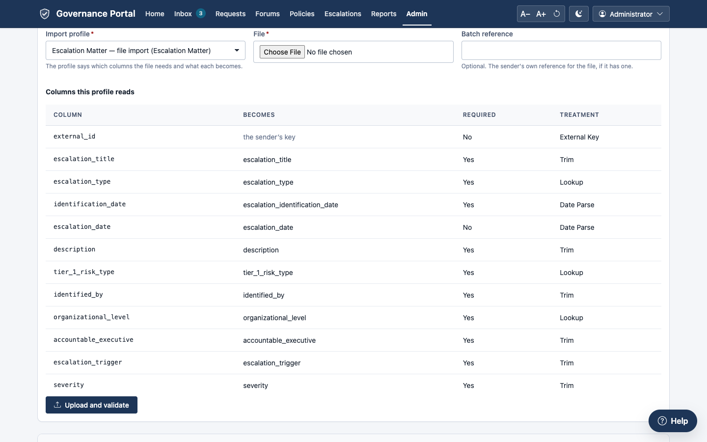

**Reviewing the batch.** The batch page shows:

- how many rows are valid, have warnings, or were refused;
- the file's details and fingerprint;
- every row: its outcome, why, and **File and mapped values**.

**Leave out** excludes a row from the commit.

**Deciding:**

- **Commit N rows** writes each committable row as a record and closes the
  batch;
- **Validate the file again** re-checks it, for example after fixing
  reference data;
- **Discard the batch**, with a reason.

**Import profiles** (the mapping and the handling rules: what to do with a
missing value, an unknown code or a duplicate key) are set up in the workspace,
under *Consilium Administration → Import Profile*.

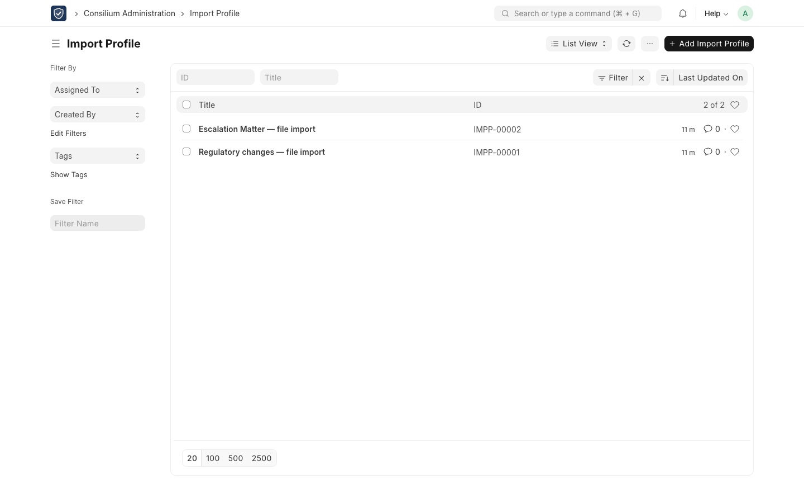

> **A batch that is rejected outright cannot be validated again.** Fix the
> file or the reference data and upload it again.

---

## 10.7 Making it look like your organisation

*Consilium Administration → Portal Branding* (System Manager). One record
controls:

- the portal's **name** and **organisation name**, **logo** and **browser-tab
  icon**;
- the **primary** and **accent colours**, and the **header style** (primary
  colour or white);
- the **typeface**;
- the **home page banner**: heading, text, image, and two buttons with their
  links;
- the **footer**.

Save, then reload the portal. No deployment is needed.
[`../ADMIN-GUIDE.md`](../ADMIN-GUIDE.md) section 5 gives practical advice on
logos, images and fonts.

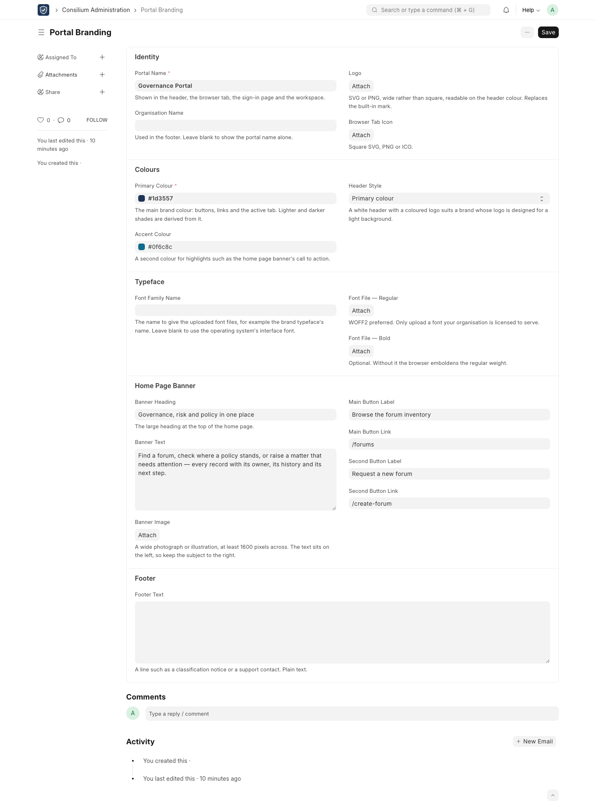

---

## 10.8 Time zone

Dates the server stamps (such as "decided on") use the organisation's time
zone.

1. Open **System Settings** (`/app/system-settings`).
2. Set **Time Zone**.
3. Save.

The installer leaves it at UTC. Each person's times are shown in their own
time zone, with the zone named.

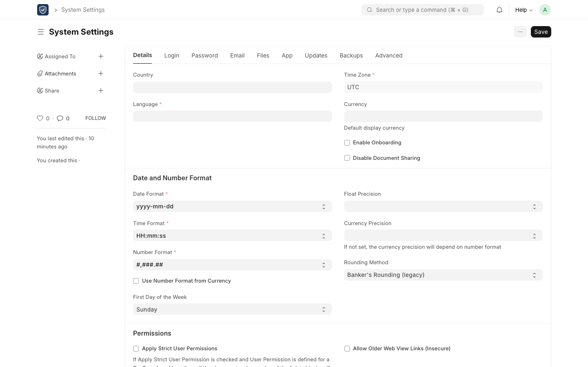

---

## 10.9 The help assistant

*Consilium Administration → Assistant Settings* (`/app/assistant-settings`)
sets:

- the **questions per person per hour**;
- whether an **AI endpoint** phrases the answers;
- what data may be sent to the AI endpoint (**What Leaves the Platform**).

Every question is logged as an **Assistant Interaction**. Each call to an AI
endpoint is logged as an **AI Service Request**. See
[`../ADMIN-GUIDE.md`](../ADMIN-GUIDE.md), section 11.

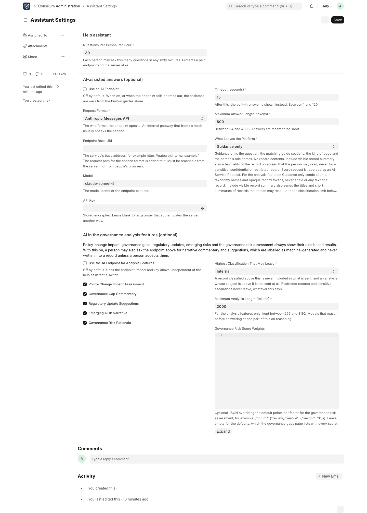

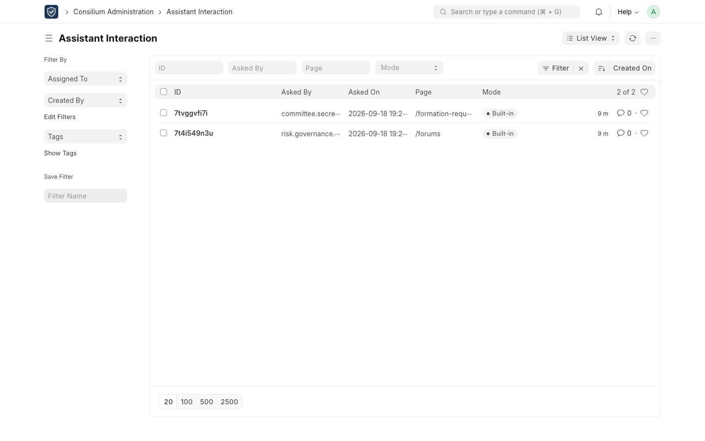

---

## 10.10 Retention and legal holds (Records Manager)

**Retention classes** (*Consilium Administration → Retention Class*) set how
long a kind of record is kept, from which trigger (creation, closure,
retirement, disbandment…), and what happens at the end: **Destroy**, **Archive
Permanently** or **Review**. A class can require **write-once** handling.
Retention **assignments** bind a class to a population of records.

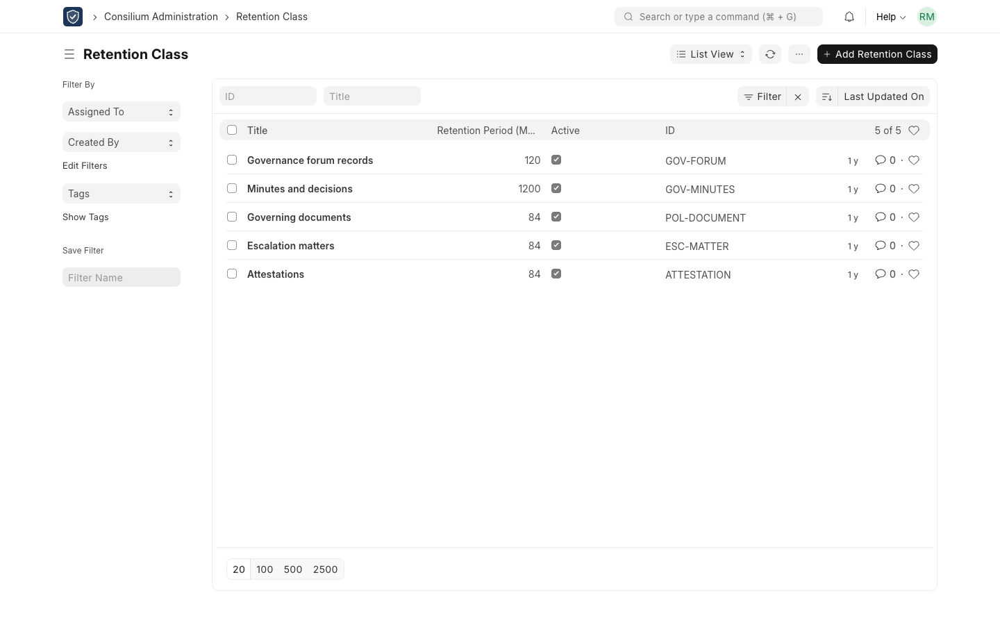

**Legal holds** (*Legal Hold*) suspend disposal for records matching a scope,
for litigation, investigation or regulatory reasons. They override retention
unconditionally.

1. Give a **Hold Reference**, a description, who **requested** and
   **approved** it, the **Placed On** date, and the **Scope DocType** and
   filter.
2. Save.
3. To release the hold, set **Released On**.

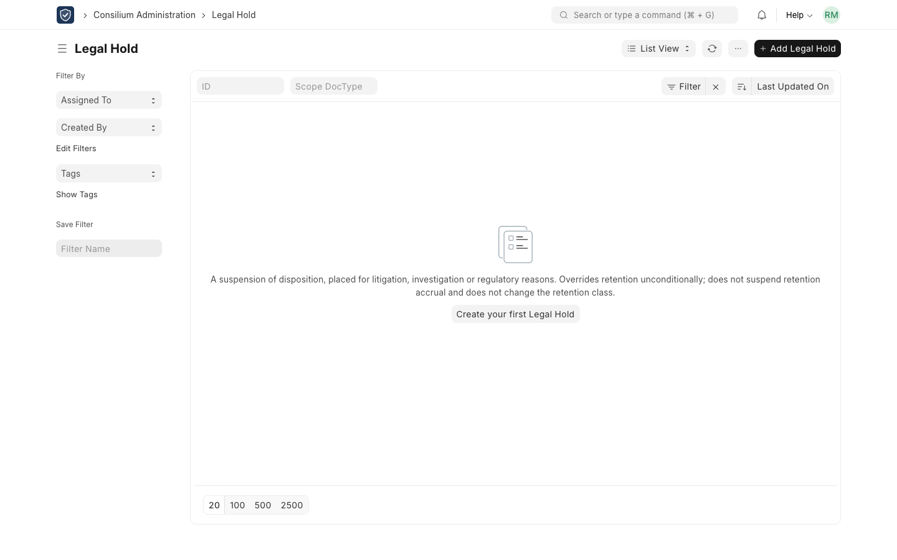

**How the rules work:**

- A record under an active hold, archived, or under a write-once retention
  class is **locked**. Edits and deletions are refused, and each refusal is
  logged.
- **Disposal is never automatic.** It goes Scheduled → Held (while a hold
  applies) → Approved → Executed.

---

## 10.11 Where to look when something goes wrong

| Log | What it holds | Where |
|---|---|---|
| **Governance Refusal Log** | Every action a control refused, and why, even though the action did not happen. Append-only. | *Consilium Administration → Governance Refusal Log* |
| **Error Log** | Server errors, with their technical detail | *Admin → Error log* |
| **Notification Dispatch** | Every notification: to whom, on which channel, sent or suppressed, and why | *Consilium Administration → Notification Dispatch* |
| **Scheduled jobs** | Background work and when it last ran | *Admin → Scheduled jobs* |

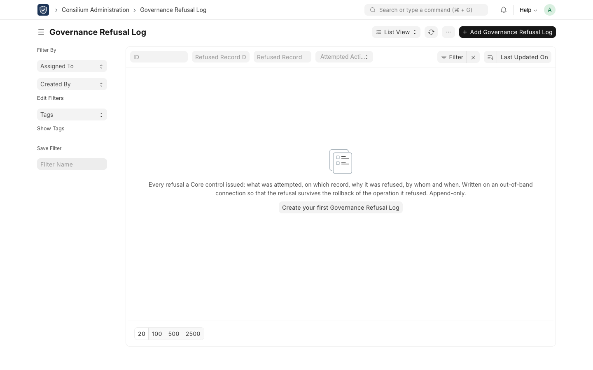

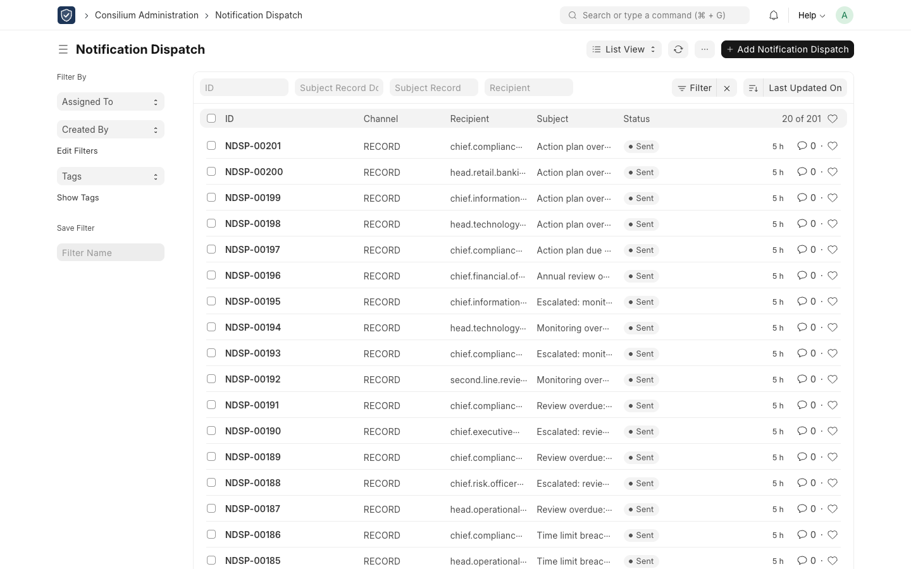

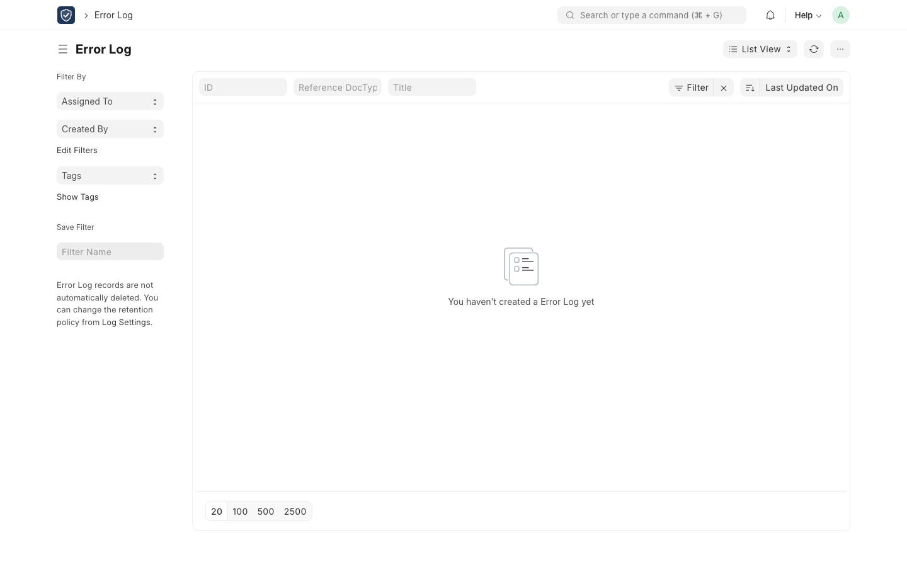

## Common errors

| Message | What it means | What to do |
|---|---|---|
| "This area is for administrators." | You do not hold an administrator role. | Ask your administrator. |
| "Value … cannot be deleted" / links refused | A reference value is in use. | Untick **Active** instead. |
| "You may not upload an import file." | Imports need Consilium Administrator. | Ask an administrator. |
| "Import profile … is not active." | The profile was switched off. | Activate it, or choose another. |
| "Batch … is closed — committed or discarded — and cannot be changed." | The batch is finished. | Upload the file again. |
| "You may not create … records, so you may not commit a batch that writes them." | You can review but not commit. | Ask someone who may create those records. |
| "A delegation needs two different people." / "A delegation cannot end before it starts." | The delegation is incomplete. | Correct it. |
| "… is under legal hold …" / "… is retained under retention class …" | The record is locked. | Nothing, until the hold is released or retention ends. |
| "There's IP restriction for this user, you can not impersonate as this user." | The user may only sign in from certain addresses. | Investigate another way. |

## Tips

- **Give roles through role profiles.** Access reviews are then a review of
  profiles, not of individual ticks.
- **Impersonate before you change permissions.** Most "I can't see it" problems
  are a record-level restriction or a sensitive record, not a missing role.
- **Read the refusal log weekly.** It shows where people are trying to do
  things the controls stop, which is often a sign of a missing role or a
  confusing screen.
