# 11. Configuring the platform your way

**Purpose.** Almost everything about *how* the platform behaves is
**configuration**: records you change in the workspace, with no release and
no engineer. This chapter gives a click-by-click procedure for each kind of
change:

| § | To change | You edit |
|---|---|---|
| 11.3 | Add a stage to a lifecycle (worked example: *Legal Review*) | Workflow, Workflow State Flag (with its Phase); optionally a Document Lifecycle Gate |
| 11.4 | Rename a stage safely | The same, in a set order |
| 11.5 | Give a record type a workflow of its own (and when not to) | Workflow |
| 11.6 | Who approves what | Formation Approval Route, Approval Route |
| 11.7 | What must be true before a document changes phase | Document Lifecycle Gate |
| 11.8 | Which changes send a record back for review | Watched Field Set |
| 11.9 | Escalation severity and routing | Escalation Matrix |
| 11.10 | Time limits and working hours | SLA Definition, Business Calendar |
| 11.11 | Fields required per escalation type and severity | Escalation Template |
| 11.12 | How a change is classified as major or minor | Classification Rule Set |
| 11.13 | The wording and channel of every notification | Notification Template, Notification Channel |
| 11.14 | Periodic attestations | Attestation Campaign |
| 11.15 | The guidance on the home page | Guide Article |

**Every procedure in this chapter was carried out on the demonstration site**
before it was written down. Section 11.16 records what was done, what the
system said, and how the change was reverted afterwards. The pictures marked
*verification* were taken while the worked examples were in place.

**Who can do it.**

| To change | You need |
|---|---|
| Workflows, workflow states and actions, the one-time lifecycle switch (section 11.3, step 0), Portal Branding | **System Manager** |
| Workflow State Flags, watched fields, approval routes, gates, the escalation matrix, SLA definitions, calendars, templates, rule sets, notification templates and channels, attestation campaigns, guide articles | **Consilium Administrator** (or System Manager) |
| Formation approval routes | Also the Risk Governance Office |
| Document lifecycle gates | Also the Enterprise Policy Office |

---

## 11.1 The design rules that make this safe

Four rules are built into the platform. Knowing them lets you change it with
confidence.

1. **States are configuration; logic reads flags.** No part of the platform
   compares a state's *name*. It reads the state's **flags**, recorded in a
   **Workflow State Flag** row for each state of each record type. Rename
   "Review" to "Under Review", or add "Legal Review", and every screen,
   report, inbox and control keeps working. What they read is whether the
   state is editable, in force, awaiting review, open, and so on.

   | Flag | Means | What reads it (examples) |
   |---|---|---|
   | **Is Editable** | The record may still be changed | Version upload and revert; locking |
   | **Is Active** | The record is in force or has effect | "In force" on documents; register filters; reports |
   | **Requires Review** | Awaiting second-line challenge or approval | The review stage; *Awaiting review* filters and inboxes |
   | **Is Open** | Still awaiting action in this state | Queues, reminders, "open" counts |
   | **Is Committable** | May be committed (imports); a meeting "sat"; tracked externally | Import commit; quorum; external closure |
   | **Requires Statement** | A written statement is required | Attestation answers; compliance decisions |
   | **Is Affirmative** | Positive consent (approval decisions) | Counting approvals; set by the platform, read only |
   | **Phase** | For governing documents whose lifecycle runs on its workflow state: the fixed phase this state belongs to | Registers, reports, gates and service levels (section 11.3) |

   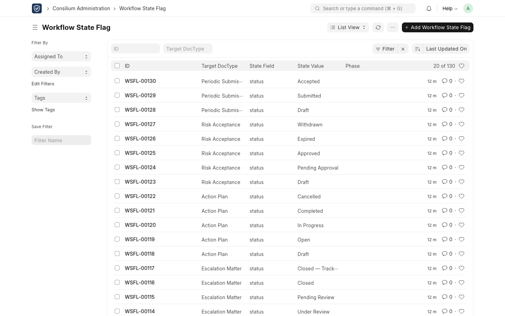

2. **A state with no flag row is refused, never guessed.** If a record is
   saved into a state that has no Workflow State Flag row, the save is refused:
   "No semantic state flags are configured for … Add a Workflow State Flag
   row". A missing row shows up the first time anyone uses the state. It
   never quietly removes a permission weeks later.
3. **Nothing is deleted.** Retire configuration rather than deleting it: untick
   **Active**, or set an end date. Several seeded rows (the standard flag rows,
   lifecycle gates, approval routes, the standard formation route) are
   **recreated automatically** on the next upgrade if they are deleted. Records
   keep their history, and a revert writes a new version.
4. **Every refusal is logged.** When a control refuses something, whether a
   gate, a role check or a sealed rule set, the refusal is written to the
   **Governance Refusal Log**, even though the action was rolled back. After a
   configuration change, the log shows at once whether people are being
   stopped.

---

## 11.2 Before you change anything

- **Change one thing at a time, and test it** with a test record before telling
  people. Each procedure below ends with a test.
- **Try it on a test site first** if you have one. The demonstration data
  loader can fill a test site with realistic records ([`../ADMIN-GUIDE.md`](../ADMIN-GUIDE.md)
  section 9).
- **Write down what you changed and why** in the record's **Notes** or
  **Description** field. Most configuration records keep their own change
  history too.
- **Afterwards, read the Governance Refusal Log** (*Consilium Administration
  → Governance Refusal Log*) for refusals you did not expect.

---

## 11.3 Adding a state to an existing workflow (worked example)

**The goal.** Governing documents should pass through a **Legal Review** stage
between **Review** and **Approved**. The policy office refers a document to
legal review; from there it can be approved or returned to drafting. The
direct route from Review to Approved is removed, so legal review becomes
mandatory.

**States and phases.** A governing document has two things that describe
where it stands:

- its **workflow state**: any stage you configure, such as *Legal Review*;
- its **phase**: one of six fixed values (**Draft**, **Review**, **Approved**,
  **Published**, **Implemented**, **Retired**).

Registers, filters, reports, gates and service levels read the **phase**.
Each state belongs to one phase, named on its Workflow State Flag row. A
new state is therefore a workflow row plus a flag row that names its phase.
The phase field itself never changes: **no Customize Form, no Property
Setter, no schema change.** *Legal Review* belongs to phase **Review**. The
document shows as "in review" everywhere while it is there, and it is gated
as Review.

**What you will change:**

| Step | Record | Why |
|---|---|---|
| 0 | *Once per site:* switch the lifecycle to run on its workflow state | So that states and phases can differ |
| 1 | Workflow State and Workflow Action Master | Give the new state and the new action a name |
| 2 | Workflow *Governing Document Lifecycle* | Add the state and its transitions |
| 3 | Workflow State Flag, with its **Phase** | Tell the platform what the state *means* and which phase it belongs to |
| 4 | Gates (optional) | Gates are set per phase; check the ones that now apply |
| 5 | A test document | Prove it works |

### Step 0 (once per site): run the lifecycle on its workflow state

A newly installed site runs the governing document lifecycle directly on the
phase field, where each state *is* a phase. To add states of your own, a
System Manager first switches it to run on the document's workflow state,
with the phase derived from it. This is done once, from the server's command
line:

```
bench --site <site> execute consilium.policy.lifecycle.derive_phase_from_state
```

In one step it:

1. sets every document's workflow state to its current phase, so no document
   moves;
2. copies each of the six phase flag rows onto the workflow state, with the
   same flags, each naming itself as its phase;
3. makes the workflow run on `workflow_state`.

It answers `{"switched": true, "flag_rows": 6}`. Running it again changes
nothing and answers `{"switched": false, "reason": "already derived"}`.

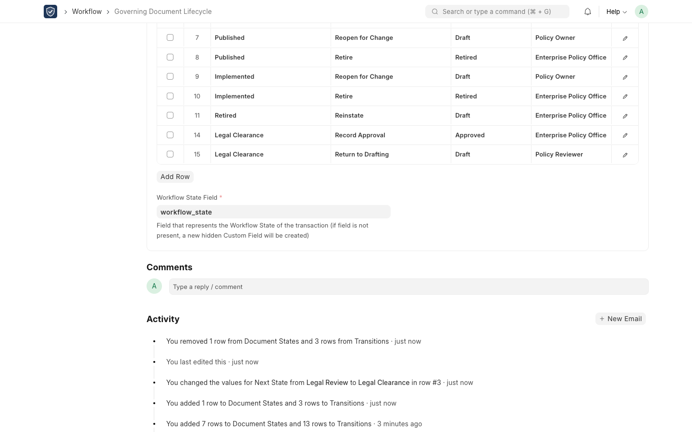

Nothing else changes for anyone. Gates, service levels, reports and lists
keep reading the phase, which the system now writes from the state. A phase
typed in directly, disagreeing with the state, is refused and logged.

### Step 1: name the state and the action

1. Open `/app/workflow-state/new`. Enter **Legal Review** as the name, choose a
   **Style** (for example *Warning*), and save.
2. Open `/app/workflow-action-master/new`. Enter **Refer to Legal Review**, and
   save.

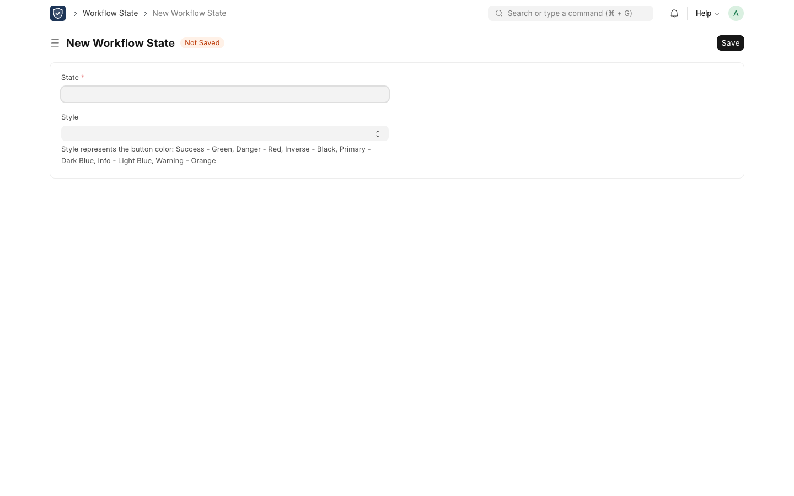

### Step 2: add the state and transitions to the workflow

1. Open *Admin → Workflows* (`/app/workflow`) and click **Governing Document
   Lifecycle**.

   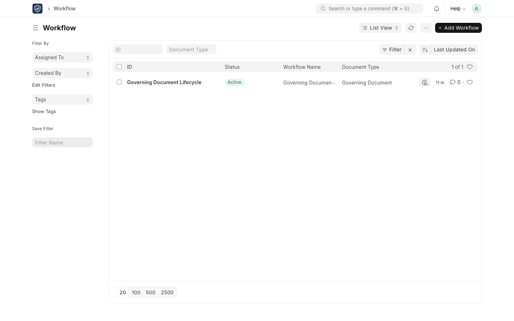

2. In **States**, click **Add Row**:
   - **State**: *Legal Review*;
   - **Doc Status**: *0*;
   - **Only Allow Edit For**: *Policy Reviewer*, the role that may edit the
     document's record in this state.

   Drag the row so that it sits after *Review*, to keep the table readable.

   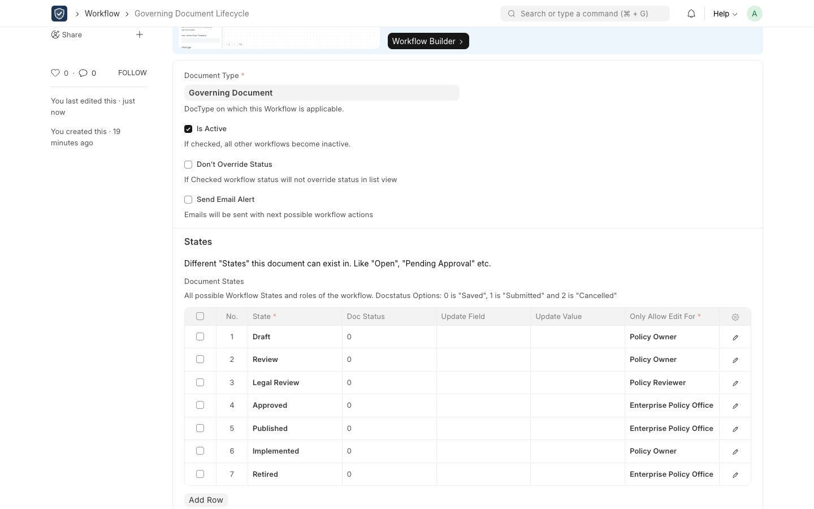

3. In **Transitions**:
   - change the row *Review → Record Approval → Approved* so that it reads
     *Review → **Refer to Legal Review** → **Legal Review***, allowed for
     *Enterprise Policy Office*. (Keep the original row, and add this one, if
     legal review should be optional rather than mandatory.)
   - add *Legal Review → Record Approval → Approved*, allowed for *Enterprise
     Policy Office*;
   - add *Legal Review → Return to Drafting → Draft*, allowed for *Policy
     Reviewer*.

   Tick **Allow Self Approval** on each row, as on the existing rows.

   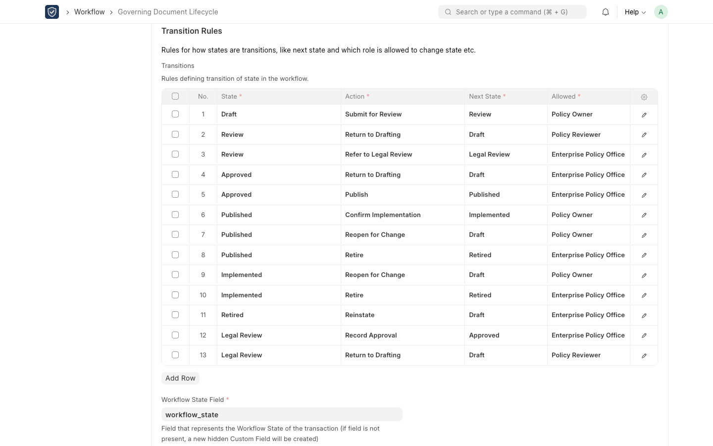

4. Click **Save**.

You can also edit the workflow visually: click **Workflow Builder** at the top
of the form. States are boxes; drag between them to add a transition.

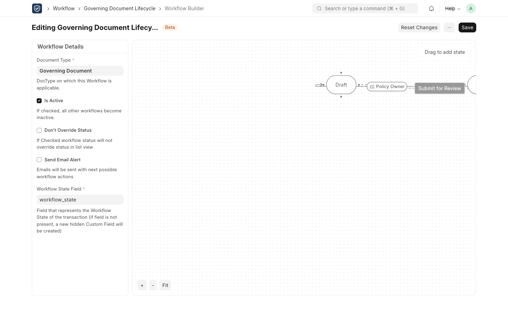

The new action now appears on documents in Review:

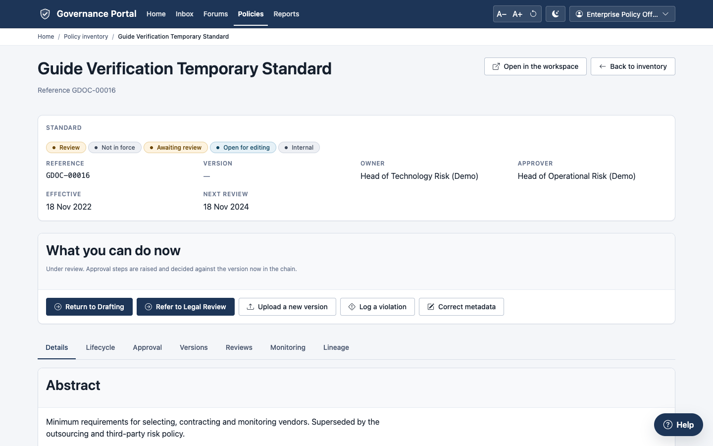

**If you stopped here**, taking it would be **refused** (rule 2), because the
state has no flag row and so no phase:

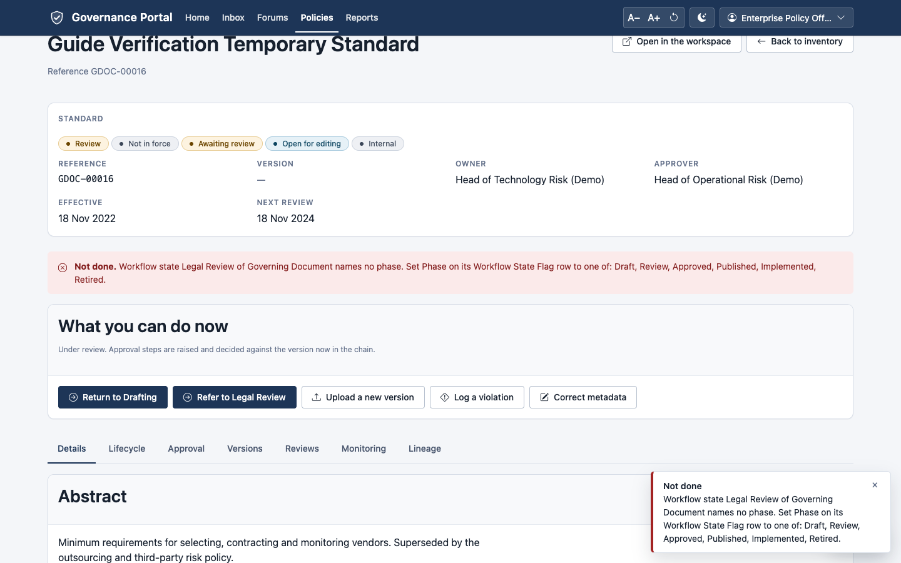

> "Workflow state Legal Review of Governing Document names no phase. Set Phase
> on its Workflow State Flag row to one of: Draft, Review, Approved, Published,
> Implemented, Retired."

A flag row saved without a **Phase** gets the same refusal.

### Step 3: say what the state means, and its phase (Workflow State Flag)

1. Open *Consilium Administration → Workflow State Flag* (`/app/workflow-state-flag`).
   Filter by **Target DocType** = *Governing Document* and **State Field** =
   *workflow_state*. You will see one row per state, each with its **Phase**.
   Use the flags of the state the new one most resembles.

   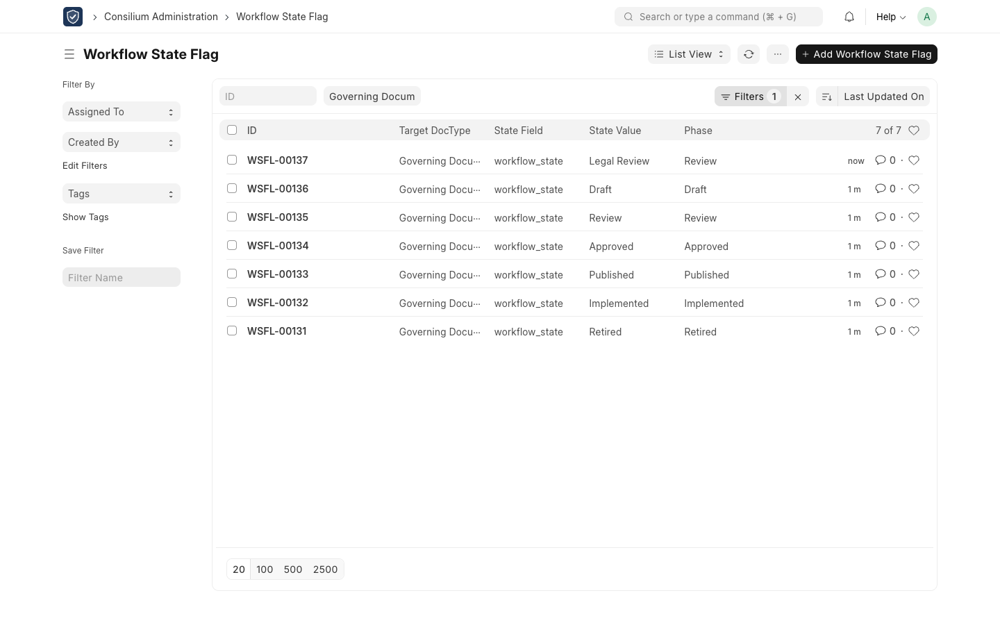

2. Click **+ Add Workflow State Flag** and fill in:

   | Field | Value | Why |
   |---|---|---|
   | **Target DocType** | Governing Document | |
   | **State Field** | workflow_state | The field the lifecycle now runs on |
   | **State Value** | Legal Review | Exactly as named in the workflow |
   | **Phase** | Review | One of Draft, Review, Approved, Published, Implemented, Retired, **spelled exactly** |
   | **Is Editable** | ✓ | Legal may ask for changes, so new versions can still be uploaded |
   | **Is Active** | ✗ | Not in force yet |
   | **Requires Review** | ✓ | It is a review stage: approval steps can be raised, and it counts as *Awaiting review* |
   | **Is Open** | ✓ | Still awaiting action |
   | **Is Committable**, **Requires Statement** | ✗ | Not used by documents |
   | **Notes** | Why the state exists | |

3. Save.

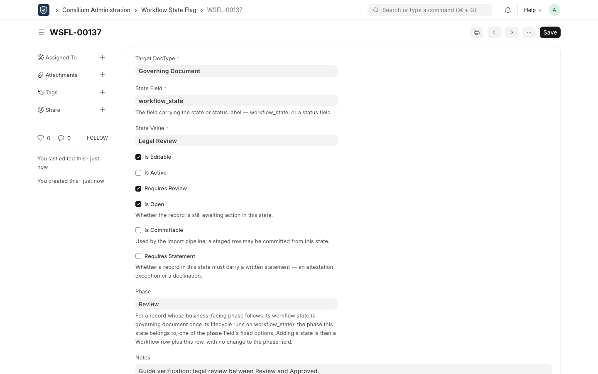

> **The phase must be one the record type already has.** Saving the row with
> anything else (for example "Legal") is refused with **Unknown Phase**, and
> the message lists the phases to choose from: Draft, Review, Approved,
> Published, Implemented or Retired.

### Step 4 (optional): check the gates

**Gates are configured per phase.** A state is gated as the phase it belongs
to. Entering *Legal Review* checks every gate on **Review**. Leaving it for
*Approved* checks every gate on **Approved**, including **Complete Approval
Chain**. A gate cannot be set on *Legal Review* alone, and any gate you add on
Review also applies to documents entering Review from Draft.

To require, for example, that a document has a version before it enters
review of any kind:

1. Open *Policy → Document Lifecycle Gate* and click **+ Add**.
2. Fill in:
   - **Target DocType**: *Governing Document*;
   - **State Field**: *lifecycle_phase*;
   - **State Value**: *Review* (the phase);
   - **Gate**: *Current Version Required*;
   - **Active**: ✓;
   - **Notes**: why.
3. Save.

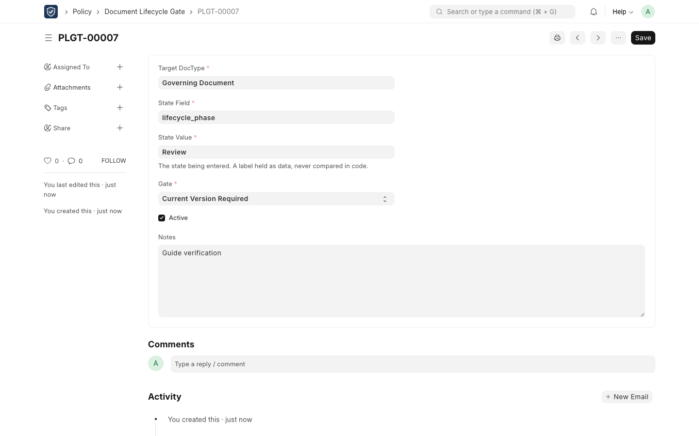

The portal now warns before anyone tries, and the Lifecycle tab names the
gate:

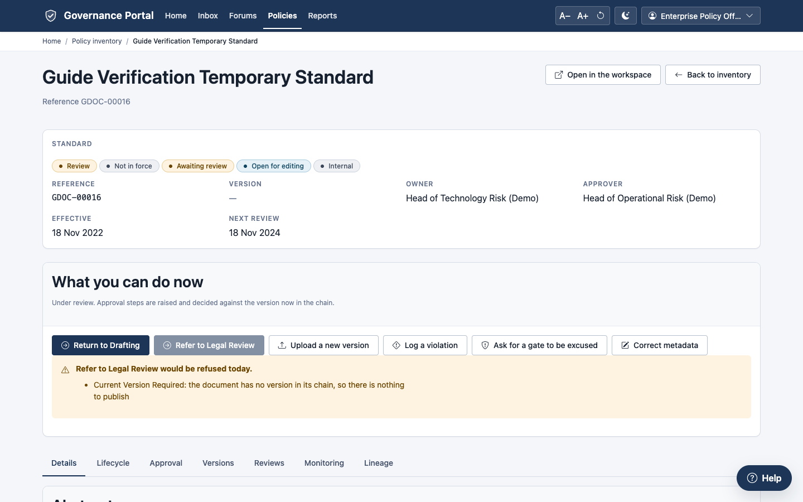

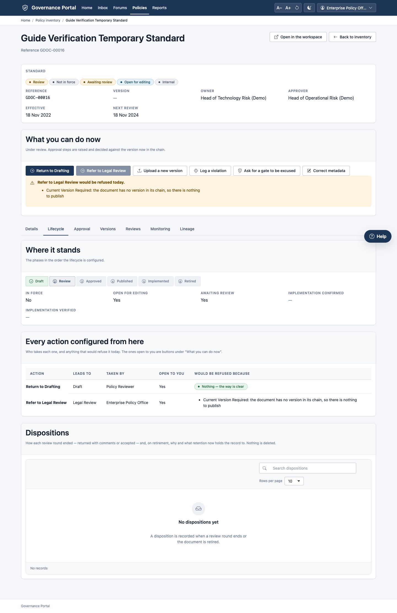

An attempt anyway is refused and written to the Governance Refusal Log.

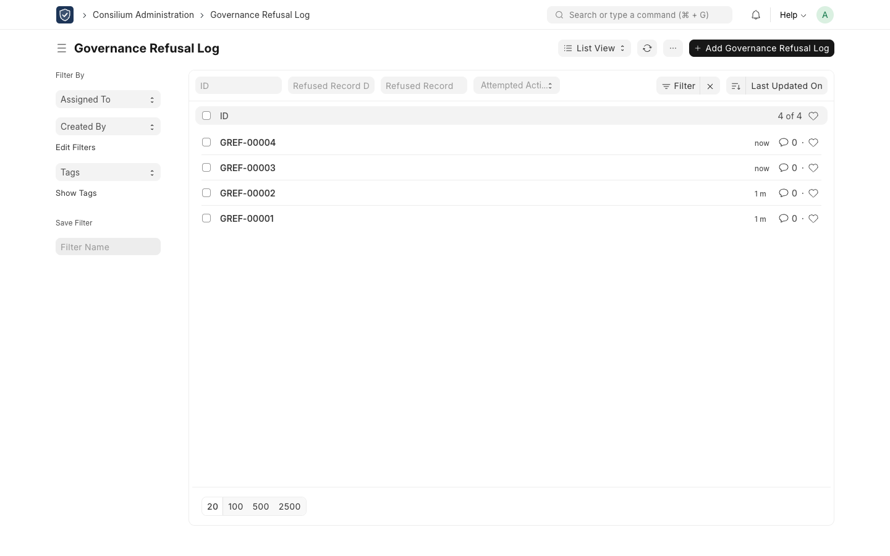

### Step 5: test it

1. Take a test document to **Review** (as its Policy Owner: **Submit for
   Review**), and upload a version if you added the gate.
2. As the Enterprise Policy Office, click **Refer to Legal Review** and
   confirm.

   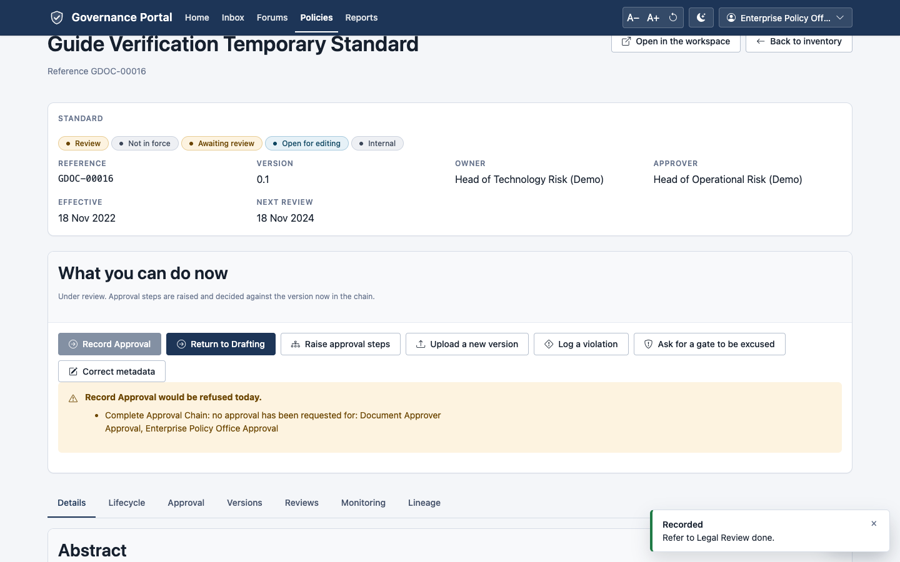

3. The document is now in state **Legal Review** and phase **Review**. It is
   flagged **Awaiting review** and **Open for editing**, from its flag row. In
   the register and in reports it counts as in review.

   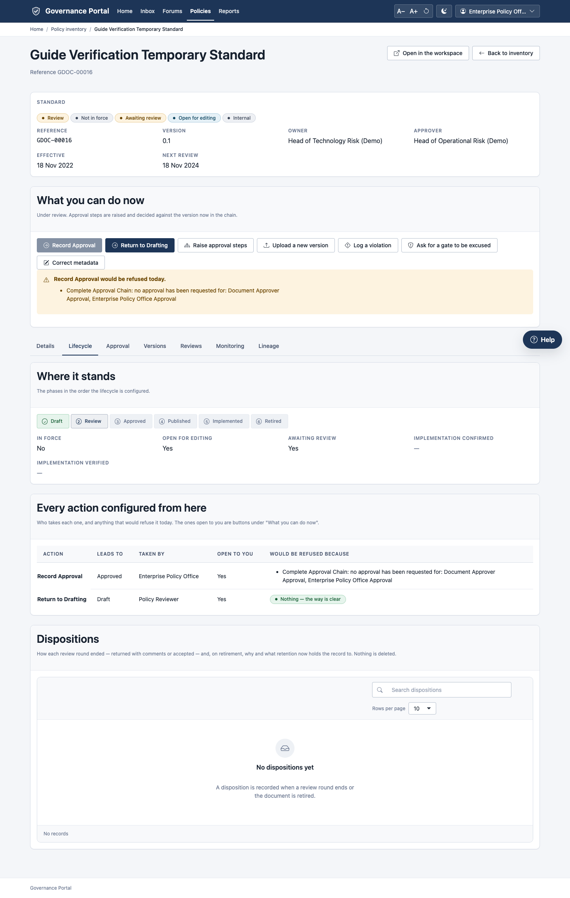

4. From Legal Review, **Record Approval** (Enterprise Policy Office) and
   **Return to Drafting** (Policy Reviewer, who must give comments for the
   owner) are offered. Record Approval is refused until the approval chain is
   complete. Raise the approval steps (they can be raised in Legal Review),
   have them decided, then approve.

**Also check** anything else that names the state:

- SLA definitions that measure *Time In State* (section 11.10);
- notification templates whose wording mentions the stage;
- your guide articles.

---

## 11.4 Renaming a state safely

A rename is **not** an edit of the state's name in place. Records already in
the old state would be left holding a value the workflow no longer knows, and
could not be saved. The safe way is **add the new name, move the records,
retire the old name**. Because the phase does not change, nothing outside the
workflow and its flag rows is touched. Here, *Legal Review* is renamed *Legal
Clearance* while a document is in it.

1. **Add the new name** as in section 11.3:
   - a Workflow State **Legal Clearance**;
   - a Workflow State Flag row on `workflow_state` with the **same flags and
     the same Phase** as the old state.
2. **In the workflow:**
   - add the state *Legal Clearance*;
   - point every transition that led **to** the old state at the new one;
   - copy every transition **from** the old state as a transition from the new
     one;
   - add a temporary transition **Legal Review → Move to Legal Clearance →
     Legal Clearance** for the Enterprise Policy Office (create the action
     name first).
3. **Move the records.** Each document still in the old state now offers
   **Move to Legal Clearance**. Take it on each one, from the portal. The
   phase stays **Review** throughout.

   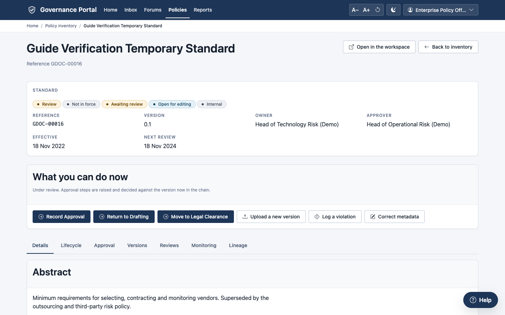

   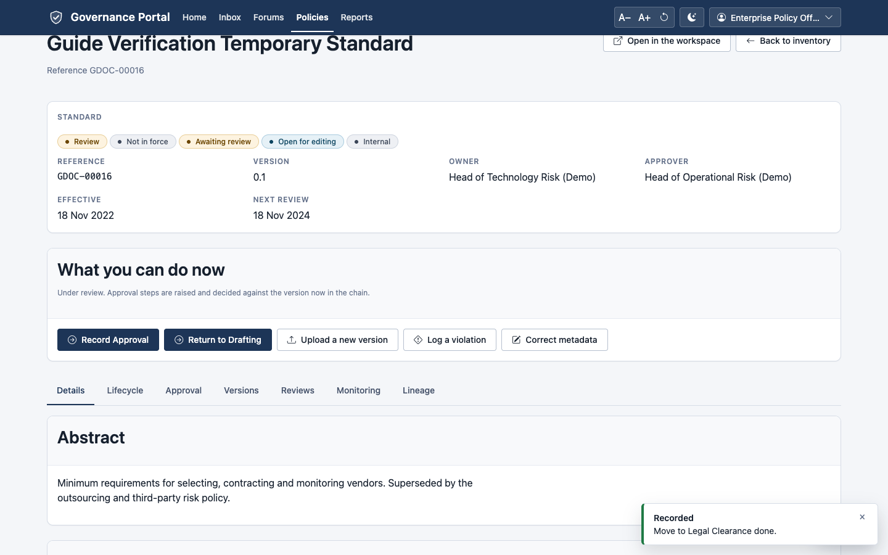

4. **Check nothing is left** in the old state: in the workspace, filter the
   Governing Document list by **Workflow State** = *Legal Review*. It must be
   empty.

   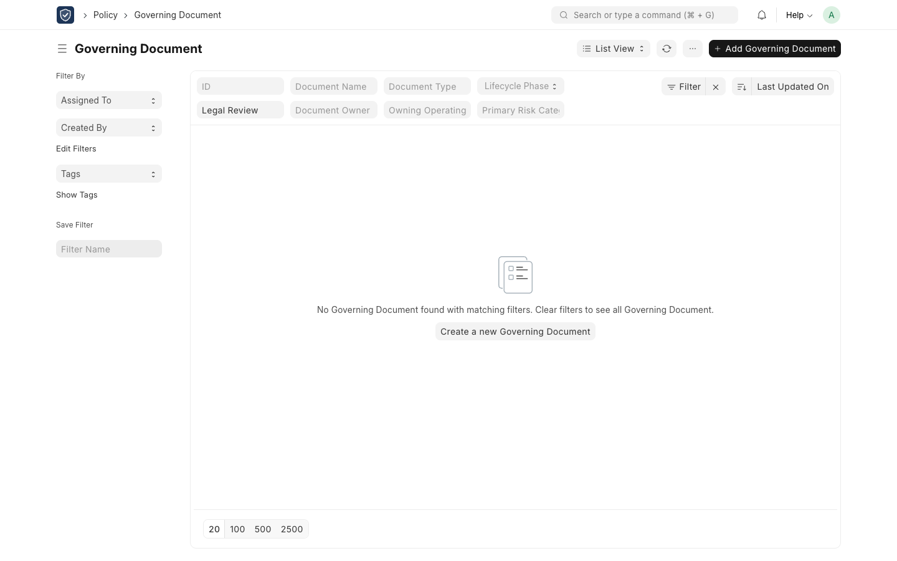

5. **Retire the old name:** remove the old state's row and its transitions
   (including the temporary one) from the workflow. Leave the old flag row; it
   is harmless.

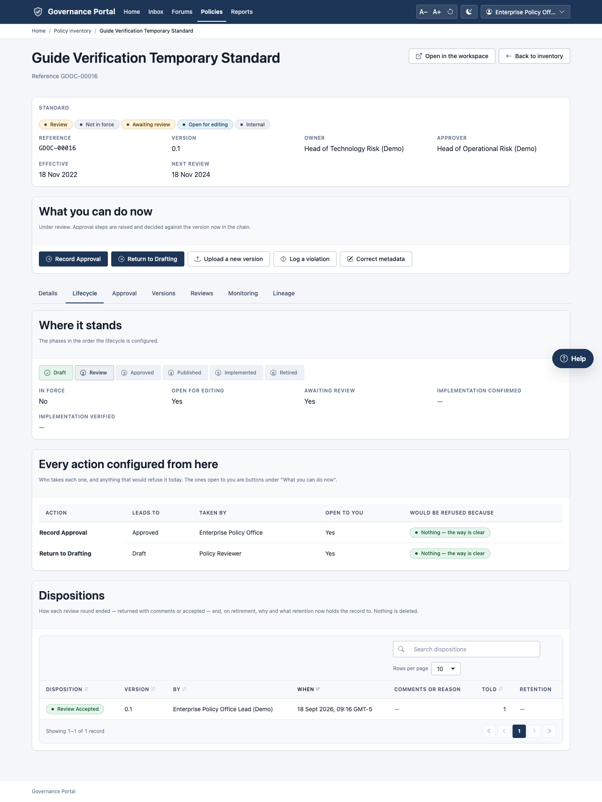

> **Which states can you rename this way?** The **governing document
> lifecycle**, because only the configured workflow moves documents between
> states. For other record types (formation requests, forums, escalations,
> attestation tasks, imports…) the platform itself writes some state names
> when it acts. Renaming those needs an engineer. You can still change what
> such a state *means* by editing its flag row.
>
> **The six phases cannot be renamed.** They are the fixed vocabulary that
> registers, reports, gates and service levels share. Rename *states* freely;
> choose the phase each one belongs to.

---

## 11.5 Creating a new workflow for a record type, and when not to

A workflow gives a record type named states, the actions between them, and
who may take each action. People then use the **Actions** menu on the record
in the workspace.

### When a new workflow is right

It is right when **people** move the record between states by editing it in
the workspace, and nothing in the platform moves it. **Policy Violation** is
an example. The portal only logs a violation (as *Logged*); every later status
change is made by hand. A workflow makes those changes controlled.

1. Check that each state already has a **Workflow State Flag** row for the
   record type and its state field. Policy Violation's are seeded: *Logged,
   Under Investigation, Remediating, Resolved, Dismissed* on
   `violation_status`. Add any that are missing (section 11.3, step 3).
2. Create the **Workflow Action Master** names you need, for example *Start
   Investigation*, *Start Remediation*, *Resolve*, *Dismiss*.
3. Open `/app/workflow/new` and fill in:
   - **Workflow Name**, e.g. *Policy Violation Handling*;
   - **Document Type**: *Policy Violation*;
   - **Workflow State Field**: *violation_status*;
   - **Is Active**: ✓.
4. **States:** one row per status, with **Only Allow Edit For** (e.g. *Policy
   Owner* while open, *Enterprise Policy Office* once resolved).
5. **Transitions:**

   | State | Action | Next State | Allowed |
   |---|---|---|---|
   | Logged | Start Investigation | Under Investigation | Policy Owner |
   | Under Investigation | Start Remediation | Remediating | Policy Owner |
   | Remediating | Resolve | Resolved | Enterprise Policy Office |
   | Logged | Dismiss | Dismissed | Enterprise Policy Office |
   | Under Investigation | Dismiss | Dismissed | Enterprise Policy Office |

6. Save, and test on a test record.

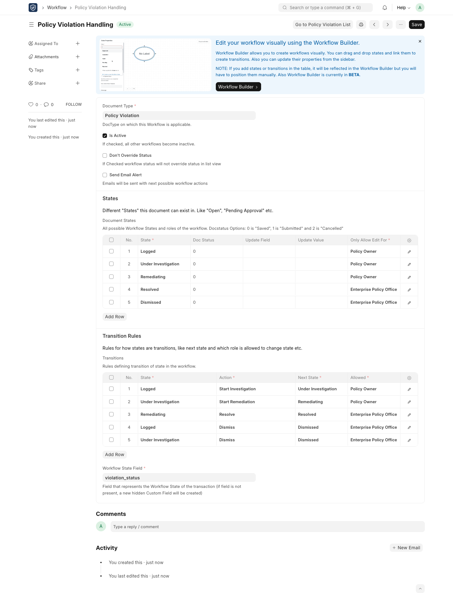

The record's form now has an **Actions** menu offering only the transitions
open to you from its current state:

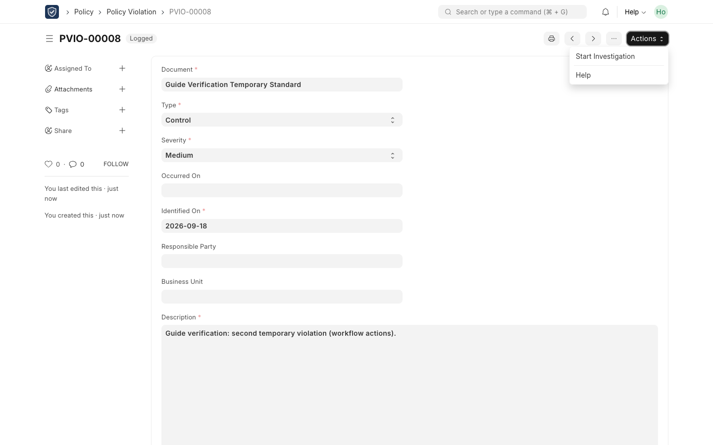

**Verified behaviour.**

- A violation logged from the portal starts in *Logged*.
- The Policy Owner is offered only *Start Investigation*.
- Its flags follow each move (for example *Dismissed* clears **Is Open**).
- **Resolve** from *Under Investigation* is refused ("Not a valid Workflow
  Action").
- Editing the status field directly is refused too: "Workflow State
  transition not allowed from Under Investigation to Resolved".

### When not to

**Do not add a workflow to a record type that the platform moves itself.**
This covers anything moved by a portal action button, the inbox or a
scheduled job:

- formation requests, forums and compliance reviews;
- governing document requests;
- escalation matters, action plans and risk acceptances;
- attestation campaigns and tasks;
- approval decisions;
- imports, notifications and time-limit clocks.

A workflow allows a state change only through its own transitions, and only
for the roles it names. The platform's own actions would then be refused.

**Verified:** with a test workflow on *Attestation Task* (added inside a
transaction that was then rolled back), a person answering their own
attestation was refused. Without the workflow, the same answer is accepted.

Each record type can have only **one** active workflow. Activating a new one
deactivates any other for the same record type.

---

## 11.6 Approval routes

### Formation approval routes (who approves a new forum)

*Governance → Formation Approval Route*. The standard route is **Standard
Formation Approval**.

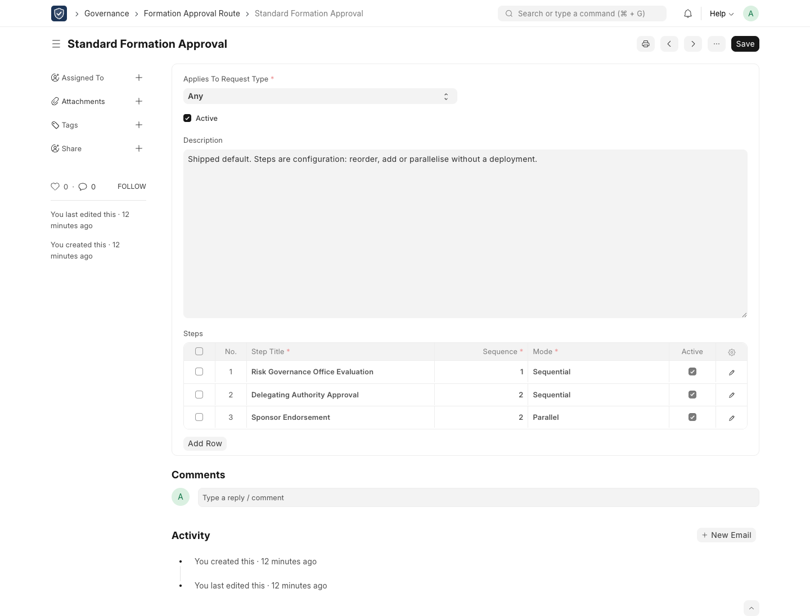

| Field | Meaning |
|---|---|
| **Route Title** | Its name |
| **Applies To Request Type** | *Any*, *Create*, *Modify* or *Retire*. A route for the request's own type is used before an *Any* route. |
| **Active** | Only active routes are used |
| **Steps** | One row per approval step: **Step Title**, **Sequence**, **Mode** (Sequential/Parallel), and who decides: **Assign To User** (a named person), or **Assign To Field** (a person named on the request, e.g. `delegating_authority`, `forum_sponsor`), or **Required Role** (the role's **queue**: any active holder of the role may take and decide it) |

**To add a step** (for example a compliance opinion on every request):

1. Open the route and click **Add Row** under **Steps**.
2. Enter **Step Title** *Compliance Opinion*, **Sequence** *3*, **Mode**
   *Sequential*, **Required Role** *Compliance Reviewer*, **Active** ✓.
3. Save.

Requests whose steps are raised after this include the new step. Requests
already in approval keep the steps they were given.

**To use a different route for one kind of request** (for example retirements):

1. Create a route with **Applies To Request Type** = *Retire* and its own steps.
2. Save.

Retire requests now use it; the others keep using the *Any* route.

**Verified:**

- The added step was raised on a request and assigned to a Compliance
  Reviewer.
- A *Retire* route was chosen for a Retire request, and the standard route for
  a Create request.
- A step whose role nobody holds was refused: "Approval step Nobody has
  nobody to decide it."

> **Good to know.**
> - If two active routes apply to the same kind of request, the **most
>   recently saved** one is used. Keep one route per kind of request active.
> - **Sequence** and **Mode** are enforced. All steps are raised together, but
>   a *Sequential* step cannot be decided until every step ahead of it is
>   decided ("… is sequential and cannot be decided yet: … must be decided
>   first."). *Parallel* steps at the same sequence number can be decided in
>   any order.
> - A role-based step goes to the role's **queue**: everyone who holds the role
>   is told, and whichever of them decides it takes it. One name is shown as
>   assignee: preferably a holder who sits on a forum of the request's owning
>   operating group, then one who has signed in before. Built-in accounts are
>   never chosen.

### Document approval routes (who approves a governing document)

*Policy → Approval Route*. A route applies when **every** criterion it sets
matches the document:

- **Document Type**;
- **Change Classification** (the Major/Minor outcome of the document's
  request);
- **Primary Risk Category** (or a category beneath it);
- **Handling Classification**.

Among the routes that apply, the lowest **Priority** number wins. The number
of criteria set only breaks ties.

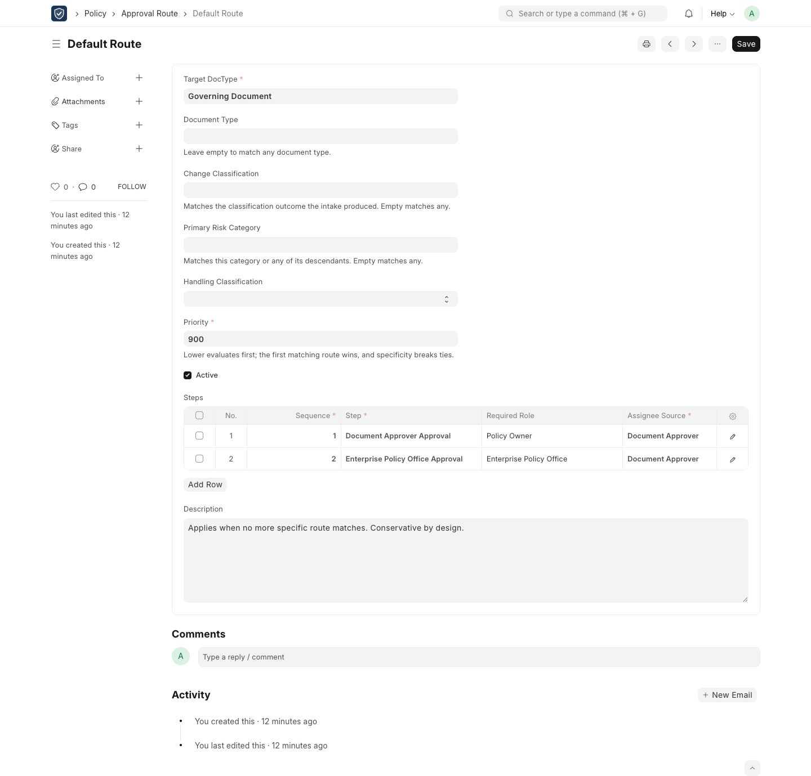

**To route confidential documents through legal as well:**

1. Click **+ Add Approval Route**. Give it a **Route** name (for example
   *Confidential Documents*), **Target DocType** *Governing Document*,
   **Handling Classification** *Confidential*, and **Priority** *5* (lower than
   the standard routes' 10, 20 and 900).
2. Add the **Steps**, each with its **Sequence**, **Step** name and **Assignee
   Source**:
   - *Document Approver Approval*, source *Document Approver*;
   - *General Counsel Approval*, source *Named User* (the general counsel).
3. Save.

**Verified:**

- The confidential demonstration document then selected *Confidential
  Documents*, and its preview listed both steps.
- An internal document still selected *Minor Change Route*.
- A route with no steps was refused: "A route with no steps approves
  nothing."

> **Step names must be unique within a route**, because a decision is matched
> to its step by name. Two steps cannot share a sequence number.

---

## 11.7 Lifecycle gates

*Policy → Document Lifecycle Gate*. A gate binds a **state** to a **check**.
Moving a document into that state is refused until the check passes: from the
portal, from the workspace's Actions menu, or by editing the field.

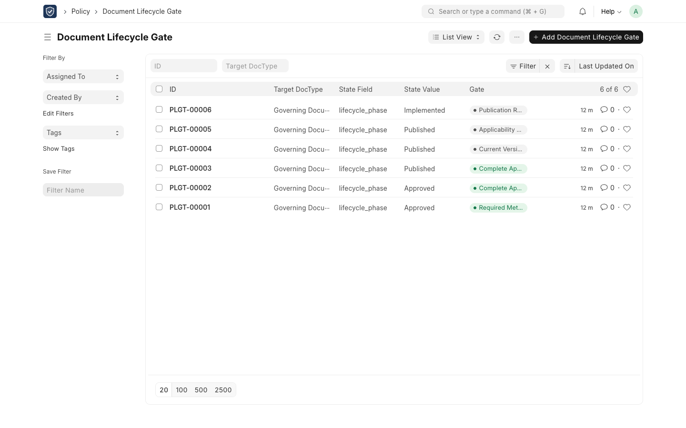

| Gate | Passes when |
|---|---|
| **Complete Approval Chain** | Every step of the route has been raised for the current version and decided, with no objection or unauthorised bypass |
| **Current Version Required** | The document has a version in its chain |
| **Publication Record Required** | A publication has been recorded |
| **Implementation Plan Required** | An implementation plan has been recorded |
| **Required Metadata Complete** | The fields the document's template requires are filled |
| **Applicability Recorded** | Applicability is recorded, so someone can be notified |

- **To add a gate:** click **+ Add**, choose the **State Value** (the phase
  being entered) and the **Gate**, tick **Active**, and save. Section 11.3,
  step 5 shows this, verified.
- **To stop using a gate:** untick **Active**. Do not delete it: seeded gates
  are recreated on upgrade.
- **Exceptions:** a move a gate refuses can still be made by citing an
  approved, unexpired **Exception Authorisation** for that document. The
  portal asks for it in the confirmation panel.

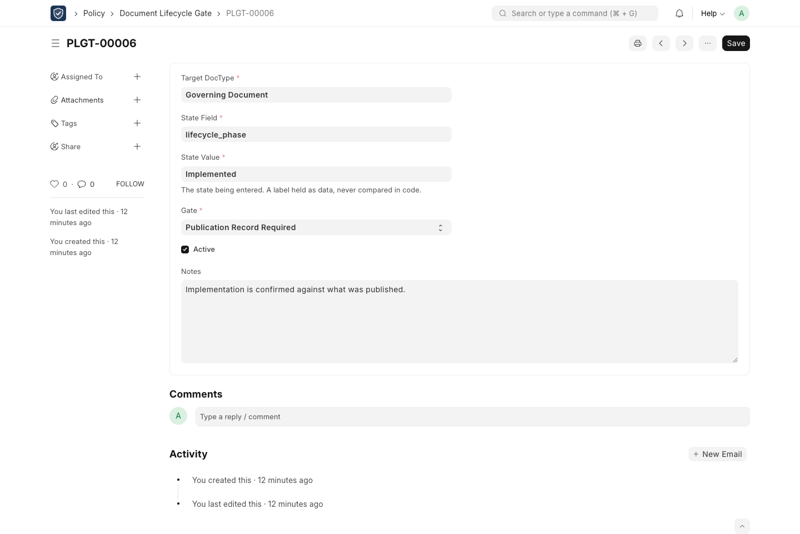

> The checks themselves are fixed; which states they guard is yours to choose.
> Choosing a gate that does not exist is refused: "… names no implemented
> check".

---

## 11.8 Watched fields

*Consilium Administration → Watched Field Set*. One set per record type.

| Field | Meaning |
|---|---|
| **Target DocType** | The record type watched |
| **Active** | On or off |
| **On Change Action** | **Reset Workflow State** (for forums: back to the **Reset To State**, e.g. *Pending*, and locked); **Raise Review Task** (marks the record as awaiting review and raises a to-do); **Notify Only** (sends a notification on the **Notify Channel**) |
| **Watched Fields** | One row per field: **Fieldname** and **Compare Mode** (**Any Change**, **Value Increase**, **Set To Empty**, **Set From Empty**) |

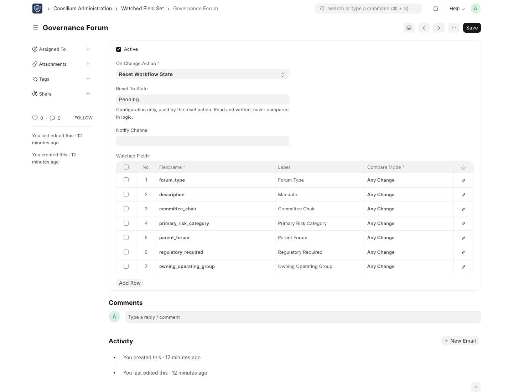

**To make a change of cadence send a forum back for review:**

1. Open the set **Governance Forum**.
2. Click **Add Row** under **Watched Fields**.
3. Enter **Fieldname** *cadence* and **Compare Mode** *Any Change*.
4. Save.

**Verified** (then rolled back): changing a Compliant forum's cadence moved it
to **Pending**, locked it, and raised the to-do "Forum FRM-… needs
compliance re-review: Cadence changed." A field that does not exist was
refused: "Governance Forum has no field no_such_field."

---

## 11.9 The escalation matrix

*Escalation → Escalation Matrix*. When a matter's severity is left to the
matrix, the matrix decides its severity, its time limit, the forums on its
pathway, and who is notified.


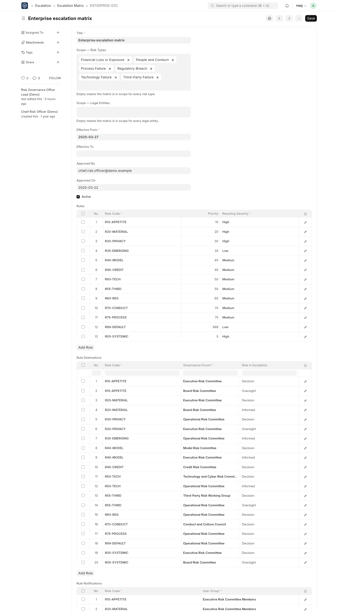

**How a rule is chosen:**

- Only **active** matrices whose effective dates include today are
  considered.
- A matrix whose **Scope — Risk Types** or **Scope — Legal Entities** excludes
  the matter is skipped entirely, including its catch-all rule.
- Within a matrix, rules are tried in **Priority** order (lowest first), and
  the **first matching active rule wins**.

**A rule** has:

- a **Rule Code**;
- a **Priority**;
- a **Condition**;
- the **Resulting Severity** (High, Medium or Low);
- the **SLA Definition** (time limit) to apply;
- optionally a **Route To Role**, whose members see unowned matters in their
  inbox.

**Rule Destinations** (forum and its role: Decision, Oversight or Informed) and
**Rule Notifications** (user groups) are tied to a rule by its code.

**Writing a condition.** A condition is a small JSON object. List only the
facts that matter; a fact left out matches anything. The facts you can use:

- `escalation_type`;
- `tier_1_risk_type`, `tier_2_risk_type`;
- `organizational_level`;
- `material_entity_impact`, `risk_appetite_breach`;
- `severity`.

```json
{"tier_1_risk_type": "TECHNOLOGY", "organizational_level": "ENTERPRISE"}
{"risk_appetite_breach": true}
{"tier_1_risk_type": "PEOPLE", "escalation_type": ["POLICY_BREACH", "INCIDENT"]}
{}
```

The values are the **codes** from the reference lists. A list means "any of
these". `{}` matches everything, which makes it a catch-all: give it the
highest priority number.

**To make enterprise-level technology matters High:**

1. Open the matrix and click **Add Row** under **Rules**.
2. Fill in:
   - **Rule Code**: *R05-TECH-ENT*;
   - **Priority**: *5*, lower than the existing *R50-TECH*;
   - **Condition**: `{"tier_1_risk_type": "TECHNOLOGY", "organizational_level": "ENTERPRISE"}`;
   - **Resulting Severity**: *High*;
   - **SLA Definition**: *ESC-HIGH*;
   - **Active**: ✓.
3. Under **Rule Destinations**, add *R05-TECH-ENT* → the Technology and Cyber
   Risk Committee → *Decision*.
4. Save.
5. Test on **Raise an escalation**: choose tier 1 *Technology* and level
   *Enterprise*. The proposal box names the new rule.

**Verified** (then rolled back):

- The proposal for such a matter changed from *R50-TECH / Medium* to
  *R05-TECH-ENT / High / ESC-HIGH*, routed to the committee.
- A matter whose tier 1 type lay outside the matrix's scope matched no rule.
- A condition using an unknown fact was refused: "colour is not a routable
  attribute. Routable attributes are: …".

---

## 11.10 Time limits and working hours

### SLA Definition

*Escalation → SLA Definition* (also used for document requests).

| Field | Meaning |
|---|---|
| **Code**, **Title** | Its name, e.g. *ESC-HIGH* |
| **Target DocType** | The record type timed |
| **Applies When** | Optional JSON filter on the record |
| **Measure** | **Total Open Time**, **Time To Close**, **Time In State** (needs **State Field** and **State Value**) or **Time To First Action** |
| **Target Hours** | The limit |
| **Warning Threshold %** | When to warn (e.g. 80); 0 for no warning |
| **Calendar** | **24x7**, or **Business Hours** with a **Business Calendar** |

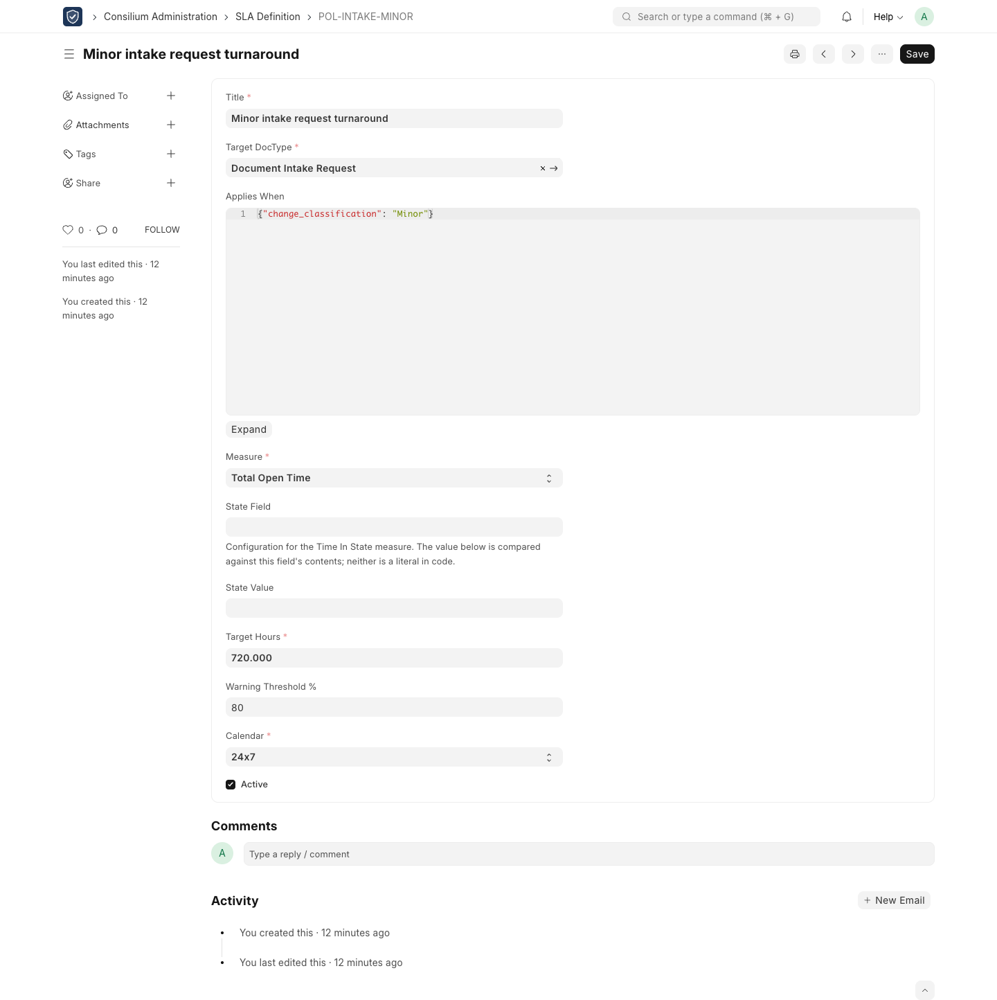

A matter gets its definition from the matrix rule that matched it
(section 11.9).

### Business Calendar

A business calendar gives the **Day Start** and **Day End**, which weekdays
are worked, and **Holidays** (a list of dates, e.g. `["2026-12-25",
"2026-12-26"]`).

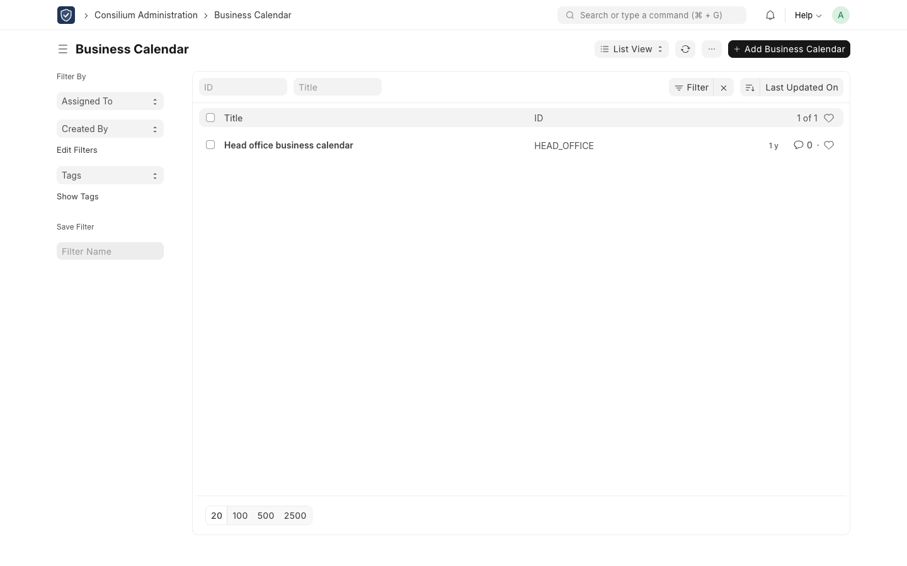

**Verified** (then rolled back), with a new calendar (09:00–17:00, Monday to
Friday, Monday 21 September a holiday) and a 16-hour business-hours
definition. A clock started Friday 18 September at 15:00 is due **Wednesday 23
September at 15:00**: 2 hours on Friday, 8 on Tuesday and 6 on Wednesday. The
same definition on 24x7 is due Saturday at 07:00. Validation refused a day
ending before it starts ("The working day has to end after it starts.") and a
*Time In State* measure without a state ("Time In State needs the state field
and the state value to measure.").

**To create a calendar:** *Escalation → Business Calendar* → **+ Add**. Give a
**Code** and **Title**, the **Day Start** and **Day End**, tick the working
days, and list the **Holidays**. Save it, then choose it on the SLA definitions
that count business hours.

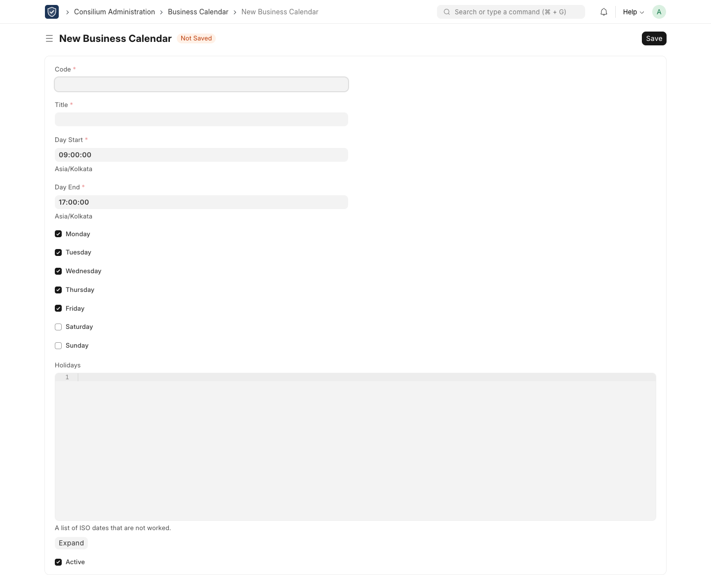

**To change a calendar**, open it from the list (*Escalation → Business
Calendar*), edit it, and save. (In earlier versions an existing calendar
opened as a blank page; that is fixed.)

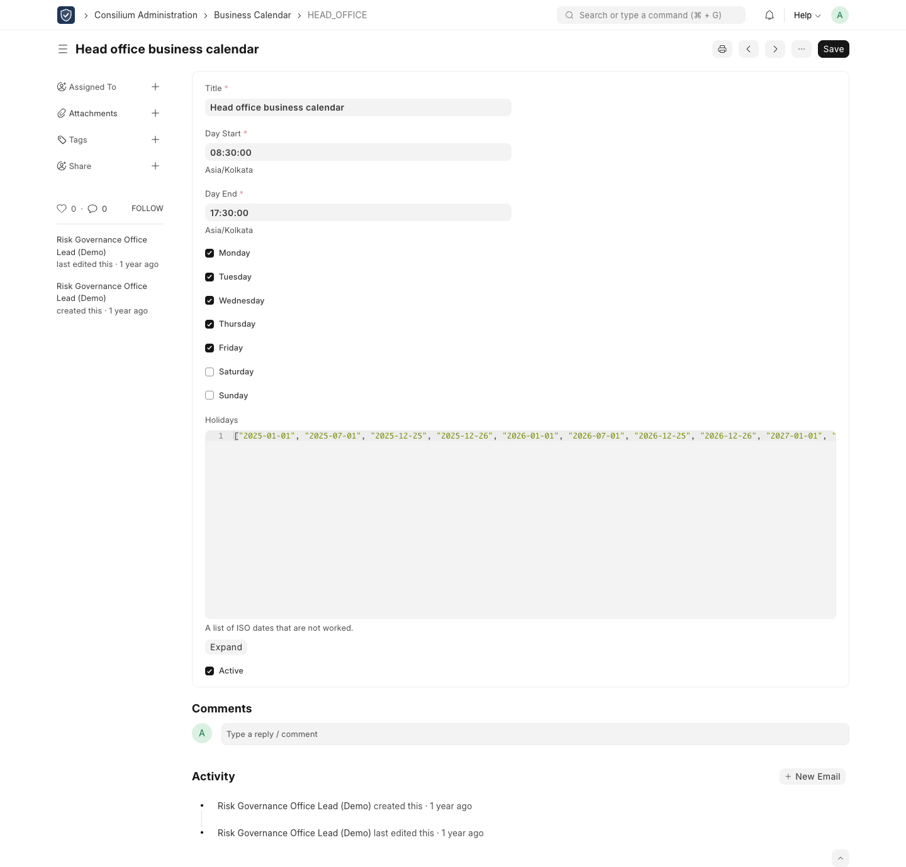

---

## 11.11 Escalation templates: required fields by type and severity

*Escalation → Escalation Template*. A template names, for one **Escalation
Type** and one **Scope** (the escalation itself, its action plans, or its risk
acceptances), the fields that must be filled.

| Field (in **Fields**) | Meaning |
|---|---|
| **Fieldname** | One of the record's standard fields |
| **Label** | As shown to people |
| **Required** | ✓ |
| **Required When Severity** | **Always**, **High**, or **High Or Medium** |
| **Guidance** | Shown with the field |

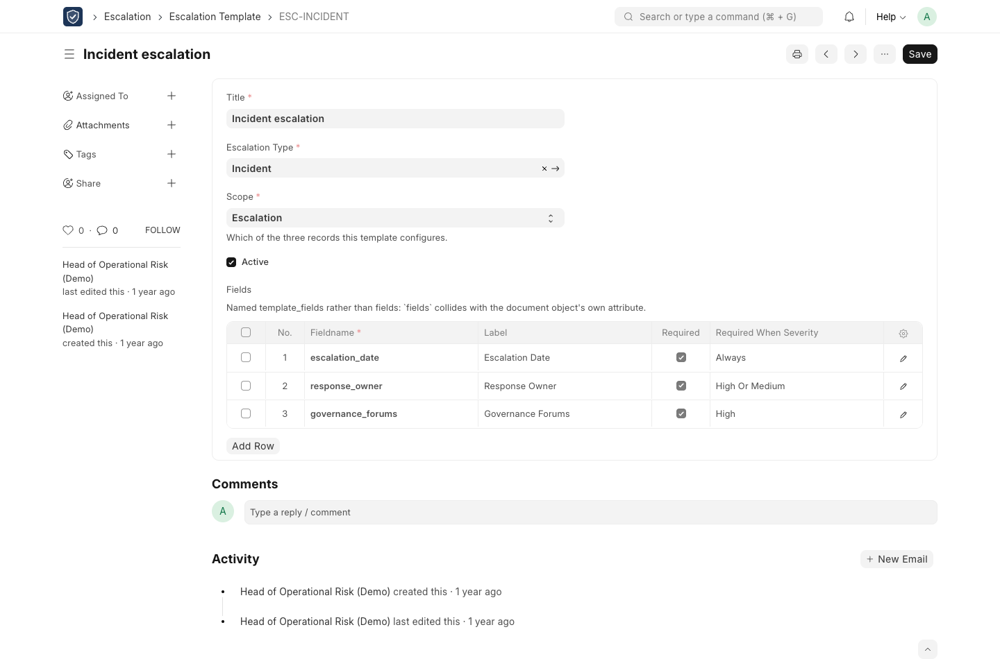

**To require a related risk reference on High incidents:**

1. Open the template *ESC-INCIDENT* and click **Add Row** under **Fields**.
2. Fill in:
   - **Fieldname**: *related_risk_reference*;
   - **Label**: *Related risk reference*;
   - **Required**: ✓;
   - **Required When Severity**: *High*;
   - **Guidance**: a sentence.
3. Save.

The **Raise an escalation** form now lists it under **What the template
requires** for High incidents.

**Verified** (then rolled back):

- The requirements for a High incident gained *related_risk_reference*; those
  for a Low incident did not.
- Saving a High incident without it was refused: "Template Incident escalation
  requires: Related risk reference."
- A non-standard field was refused: "favourite_colour is not a standard field
  of a Escalation record."

> If a template requires a field the portal's form does not collect, raise such
> matters in the workspace. The form says so.

---

## 11.12 Classification rule sets: publish a new version, never edit

*Consilium Administration → Classification Rule Set*. A rule set holds:

- the **questions** a document request answers;
- their **answer options**;
- the **rules** that turn the answers into an outcome (*Major* or *Minor*);
- the **default outcome** when no rule matches (keep it the conservative one,
  *Major*).

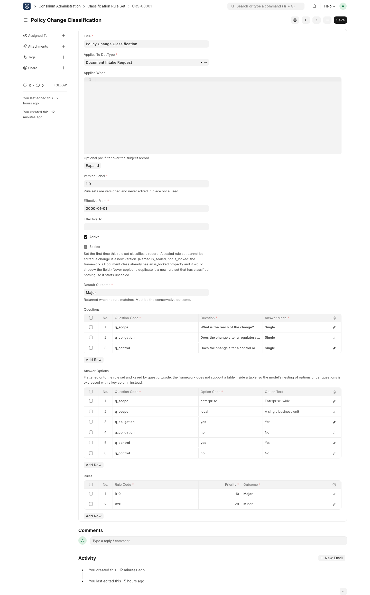

**Once a rule set has classified a request, it is sealed.** A past
classification must stay explicable against the rules that produced it. Any
change to a sealed set is refused and logged:

> "Rule set CRS-00001 has already classified records and is sealed. Publish a
> new version instead: a past classification must stay explicable against the
> rules that produced it."

**To change the rules, publish a new version:**

1. Open the set in force and choose **… → Duplicate**. The copy opens unsaved.
2. In the copy, **before you save it for the first time**:
   - set a new **Version Label** (e.g. *2.0*) and an **Effective From** date
     (today or later);
   - make **every** change to the questions, answer options and rules.
3. Save **once**.
4. Open the old set and set its **Effective To** to the day before the new set
   takes effect. This is allowed on a sealed set; so is unticking **Active**.

> **Why only one save?** The copy inherits the original's **Sealed** tick,
> which cannot be changed by hand. Its first save succeeds. Every later edit is
> refused as if it had already classified requests. If you need another change
> after saving, duplicate the original again and start over. Delete the
> unused copy only if nothing has used it.

The set in force is the active one with the latest **Effective From** that
has not ended.

**Writing a rule condition.** Conditions group tests with `all`, `any` or
`none`. A test names a `question` and an operator: `equals`, `not_equals`,
`in`, `not_in`, `includes`, `greater_than`, `less_than`, `is_set` or
`is_not_set`.

```json
{"any": [{"question": "q_scope", "equals": "enterprise"},
         {"question": "q_obligation", "equals": "yes"}]}
```

**Verified** (then rolled back):

- Editing the sealed set was refused with the message above.
- A duplicate carried the seal. Changed before its first save, it saved as
  version 2.0 and became the set in force. A second edit of the saved copy was
  refused with the sealed-set message.
- The old set accepted an **Effective To** date.

> **Why "before the first save"?** The copy inherits **Sealed** from the
> original, and a sealed set refuses every edit after it is first saved.

---

## 11.13 Notification templates and channels

Every notification the platform sends is an **event**, for example
`policy.review.overdue`, `sla.breached` or `governance.formation.approved`.
Each event has one **Notification Template** per channel.

*Consilium Administration → Notification Template* (`/app/notification-template`).

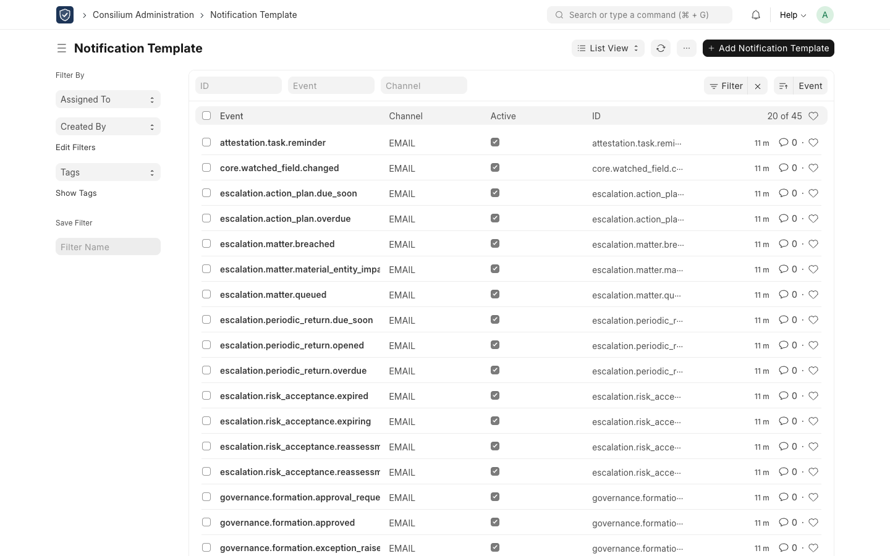

| Field | Meaning |
|---|---|
| **Event** | The event code (fixed) |
| **Channel** | Where it goes (e.g. *EMAIL*) |
| **Active** | Untick to stop sending on this channel. The event is still recorded. |
| **Subject**, **Body** | The wording, with placeholders |
| **Event Description**, **Available Context** | What the event is, and the placeholders it offers (read only) |


**Placeholders** are written `{{ name }}`. Every event offers:

- `recipient_name`;
- `link` (to the record);
- `today`;
- `subject_name`;
- `doc`: the record itself, for example `{{ doc.document_name }}`.

Each event adds its own, listed under **Available Context**, for example
`{{ due_on }}` or `{{ days_overdue }}`.

**To reword the overdue-review email:**

1. Open *policy.review.overdue-EMAIL*.
2. Change **Subject** to
   `Overdue: {{ doc.document_name }} was due {{ due_on }}`, and the **Body** as
   you wish.
3. Save.

**Verified** (then rolled back): the next notification for the Code of Conduct
was sent with the subject "Overdue: Code of Conduct was due 2026-08-14". A
template with a syntax error was refused: "Template syntax error on line 1:
…". If a template ever fails when it is used, the built-in wording is sent
instead, and the failure is logged.

**Channels** (*Notification Channel*):

- **RECORD** records the notification in the platform (in **Notification
  Dispatch**) without sending mail.
- **EMAIL** sends mail. It falls back to RECORD when mail cannot be sent. On the
  demonstration site no outgoing mail account is configured, so the verified
  notification above was delivered on RECORD.

To send mail, configure an outgoing **Email Account** (System Manager). Every
send, fallback and suppression is listed in **Notification Dispatch**
([chapter 10](10-administration.md)).

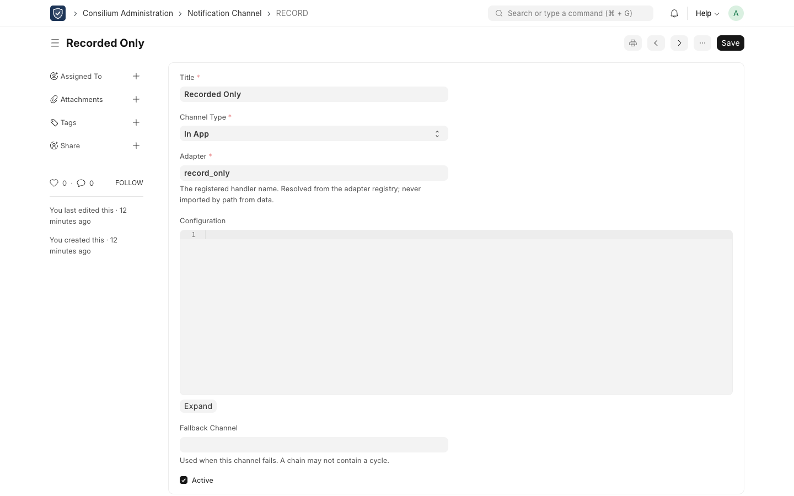

---

## 11.14 Attestation campaigns

Forum campaigns are opened from the portal ([chapter 8](08-tasks-and-attestation.md)).
Any other campaign is set up in the workspace. An example is the annual
attestation by governing document owners.

*Consilium Administration → Attestation Campaign* → **+ Add**:

| Field | Example (document owners) |
|---|---|
| **Campaign Title** | Governing document attestation 2027 |
| **Campaign Type** | Governing Document |
| **Period Label** | 2027 (unique per campaign type) |
| **Target DocType** | Governing Document |
| **Population Filter** | `{"is_active": 1}` (the documents in force) |
| **Participant Source** | Record Field |
| **Participant Field** | document_owner |
| **Requires Dual Signature** / **Second Signatory Field** | For two signatures, e.g. document_approver |
| **Opens On**, **Due On** | The window |
| **Reminder Schedule** | One row per reminder point, in days before the due date (e.g. 14 and 3); each point reminds whoever the task is waiting on, once |
| **Status** | Draft while you prepare it; **Open** to run it |

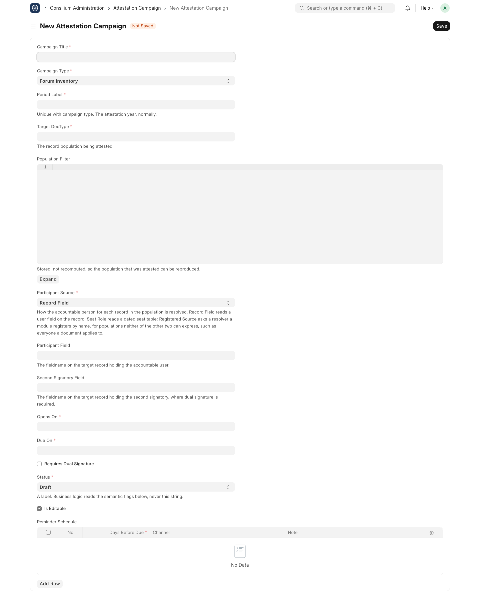

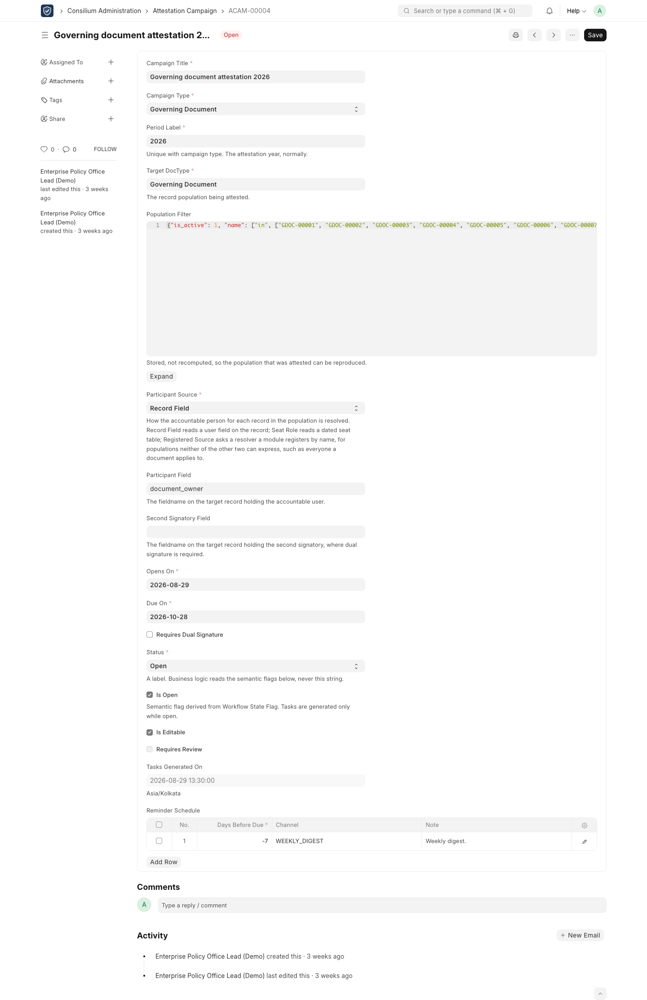

When the campaign is **Open**, click **Generate tasks** on the portal's
campaigns page.

**Verified** (then rolled back):

- Generating tasks while the campaign was a Draft was refused ("Campaign … is
  not open, so tasks cannot be generated.").
- Once it was Open, 8 tasks were created for 8 documents.
- A second run created none and skipped 8.
- A second campaign for the same type and period was refused ("Campaign …
  already covers Governing Document for period 2027.").

---

## 11.15 The home-page guidance

The **Using the system** section of the home page has five parts:

- *Getting Started*;
- *Forum Types*;
- *Templates*;
- *Decision Authority*;
- *Escalation Protocol*.

Each shows built-in wording until a published **Guide Article** of that
**Category** replaces it.

1. Open **Admin → The home-page guide → Write an article** (or
   `/app/guide-article/new`).
2. Fill in:
   - **Slug**: a unique id, e.g. *guide-getting-started-2027*;
   - **Title**: the heading shown;
   - **Category**: which part of the home page it replaces;
   - **Applies To Module**;
   - **Body**;
   - **Display Order**;
   - **Published** ✓.
3. Save, and reload the home page.

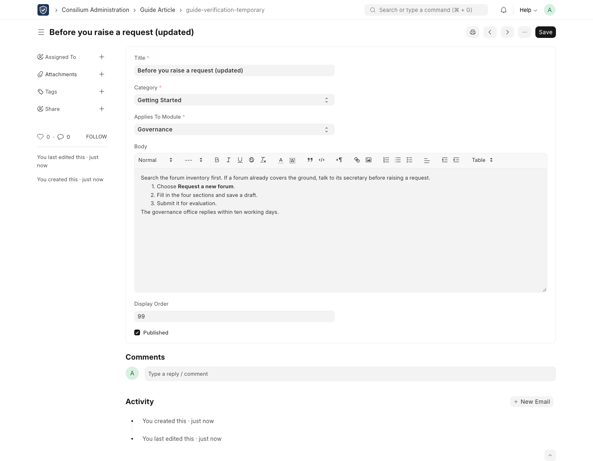

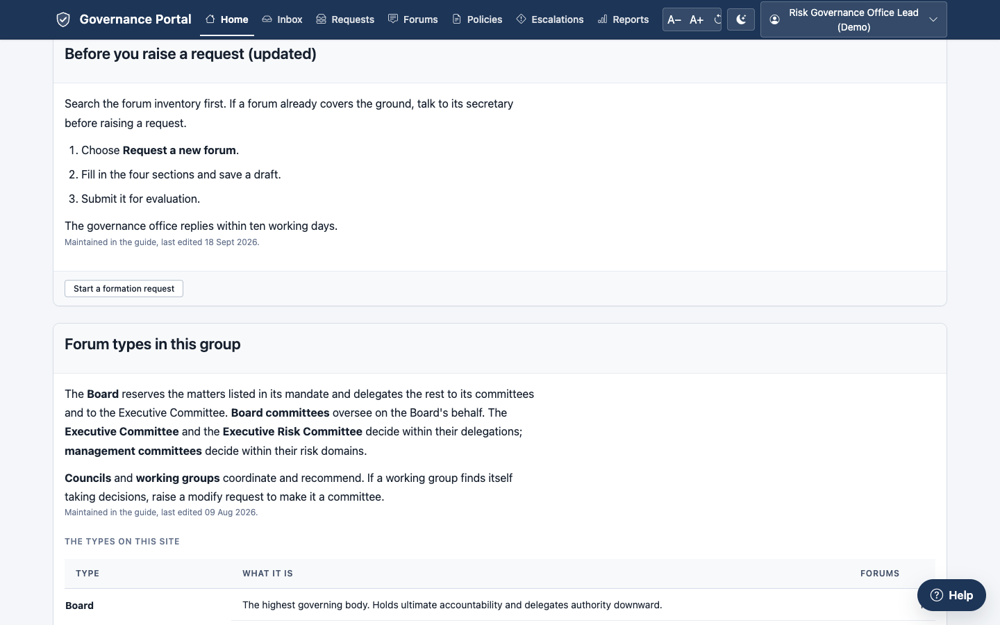

**Verified:** a published *Getting Started* article replaced the section's
heading and text, and noted "Maintained in the guide, last edited …". It was
then removed.

> **Good to know.**
> - The **Category** decides where an article appears, not the slug.
> - If several published articles share a category, the one with the
>   **lowest Display Order** fills that part of the page. **Every other
>   published article is shown too**, as its own card at the end of *Using the
>   system*.
> - Articles in a category with no part of its own on the home page (such as
>   *Policy Lifecycle*) are also shown there as their own cards.
> - Each article has its own link (`/#guide-<slug>`), which the help assistant
>   uses when it quotes the article.
> - Published articles are also what the help assistant quotes.

---

## 11.16 Verification record

Each procedure was performed on the demonstration site `consilium.localhost`,
as the Administrator or as the demonstration persona who would do it.
Everything added was removed afterwards.

- **(a), (c) and (e)** were verified again on 18 September 2026, on the site as
  rebuilt with the final code, using the supported procedure in section 11.3:
  the one-time switch, then a flag row with its Phase. They used a temporary
  document, *Guide Verification Temporary Standard*. Before starting, the
  lifecycle, its flag rows, gates, state and action names, every document's
  workflow state and the refusal log were snapshotted. Afterwards all of it
  was put back and compared equal, **including undoing the one-time switch**,
  so the demonstration site still runs on the phase field as delivered.
- **(b) and (m)** were performed on the site before it was rebuilt; their
  screens are unchanged.
- **(d) to (l)** ran inside a database transaction that was rolled back.

| Procedure | What was done | What the system did | Reverted |
|---|---|---|---|
| (a) Add a state | The one-time switch (answered `{"switched": true, "flag_rows": 6}`; a second run answered `already derived`); then Legal Review added: state, action, workflow rows, flag row with Phase *Review*; a test document moved through it from the portal | Refused with no flag row, and with a flag row that named no phase ("… names no phase …"); a misspelt phase was accepted on the row but the move was refused with "No semantic state flags … value Legal"; with Phase *Review* the document moved Review → Legal Review (phase stayed Review, flags from the new row); Record Approval was refused by the Approved phase's chain gate until the approval steps (raised in Legal Review) were decided in sequence, then succeeded | Workflow (state field, states, transitions), flag rows, gates, names, every document's workflow state and the refusal log compared equal to the snapshot; test document, its version, decisions, notifications and log entries deleted |
| (b) New workflow | *Policy Violation Handling* created; two violations logged on a test document | Transitions offered by role; invalid moves and direct edits refused | Workflow, names and violations deleted |
| (b) When not to | Workflow on Attestation Task, in a transaction | The platform's own answer was refused; without it, accepted | Rolled back |
| (c) Rename | Legal Review → Legal Clearance with a document in it | Document moved by the temporary action (phase unchanged); old state removed; the renamed state offered Record Approval and Return to Drafting (the latter asks for the reviewer's comments) | As (a) |
| (d) Routes | Step added to the formation route; Retire route; confidential document route | As described in 11.6 | Rolled back |
| (e) Gates | Gate *Current Version Required* on the Review phase | Entering Legal Review was warned about in advance, refused and logged; passed once a version was uploaded | Deleted with (a) |
| (f) Watched fields | *cadence* watched | Forum set to Pending with a to-do | Rolled back |
| (g) Matrix | Rule R05-TECH-ENT | New rule chosen; scope exclusion; bad condition refused | Rolled back |
| (h) SLA and calendar | New calendar and definition | Targets as in 11.10 | Rolled back |
| (i) Templates | Field required at High | Required at High only; save refused without it | Rolled back |
| (j) Rule sets | Edit of sealed set; new version | Edit refused (logged); new version in force | Rolled back; refusal-log entry removed |
| (k) Notifications | Subject reworded; syntax error | New subject used; error refused | Rolled back |
| (l) Campaigns | Document campaign for 2027 | Draft refused; 8 tasks; no duplicates; duplicate period refused | Rolled back |
| (m) Guide articles | Temporary Getting Started article | Replaced the home-page section | Deleted |

**Scripts used:** `scripts/capture_screenshots.py --area verification`
re-takes the verification pictures while an example is set up.
