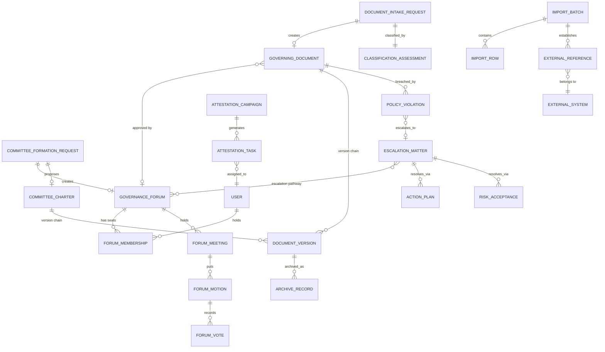
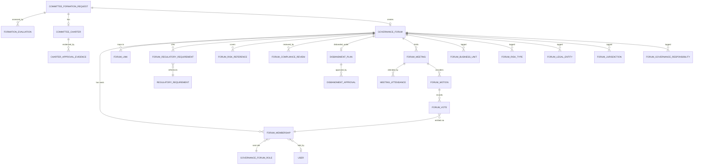
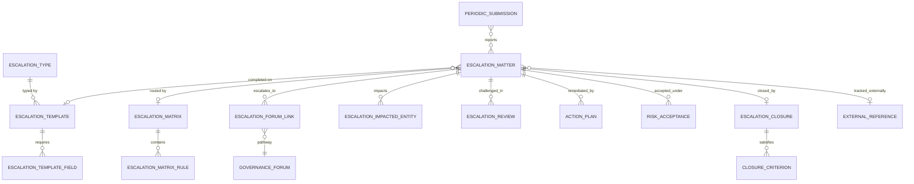

# Consilium — Logical Data Model

**Product:** Consilium, an enterprise Governance, Risk & Policy platform
**Document:** 02 of 07 — Logical Data Model
**Audience:** senior risk stakeholders reviewing the model; engineers building from it.
**Companion:** `03-schema.md` gives the physical PostgreSQL realisation of everything here.

---

## 1. How to read this document

### 1.1 Provenance marks

Every entity and every field carries a provenance mark. This matters more than
usual here, because the source corpus specified some records field-by-field and
left others entirely undescribed.

| Mark | Meaning |
|---|---|
| **[S]** | **Specified.** Named explicitly in a source requirement document or its verbatim appendix. |
| **[D]** | **Decided.** Settled by a stakeholder decision after the source documents were written. Binding. |
| **[I]** | **Inferred.** Not in any source and not decided. Proposed here because the requirement cannot be satisfied without it. **Every [I] item is a review point.** |

`[I]` items are additionally collected in `07-assumptions-and-gaps.md` with the
consequence of getting them wrong.

### 1.2 Naming conventions — fixed for the whole document set

| Thing | Convention | Example |
|---|---|---|
| Entity (DocType) | Title Case, singular, spaces | `Governance Forum` |
| Child entity | Parent noun + role noun | `Forum Membership`, `Escalation Matrix Rule` |
| Field | `snake_case` | `primary_risk_category` |
| Boolean field | positive sense, `is_` or a plain adjective | `is_active`, `regulatory_required` |
| Reference to a person | always a Link to `User`, never free text | `committee_chair` |
| Taxonomy entity | the singular thing being classified | `Risk Type`, not `Risk Types` |

These names are used identically in `03-schema.md`, `06-traceability.md` and the
architecture document. They are the build names.

### 1.3 Field type vocabulary

The logical types below map one-to-one onto framework field types and from there
onto PostgreSQL column types. `03-schema.md` §3 gives the full mapping table.

| Logical type | Meaning |
|---|---|
| `Data` | Short free text, bounded at 140 characters |
| `Text` / `Long Text` | Unbounded text |
| `Rich Text` | Unbounded text carrying markup |
| `Select` | Constrained choice from a fixed, code-level option list |
| `Link → X` | A reference to exactly one row of entity `X` |
| `Multi → X` | A reference to zero or more rows of entity `X`, held in a child table |
| `Table → X` | A composition: zero or more child rows of entity `X` owned by this record |
| `Check` | Boolean |
| `Int` / `Decimal` | Numeric |
| `Date` / `Datetime` | Temporal |
| `Attach` | A reference to a stored file |
| `JSON` | Structured payload, schema-on-read |

### 1.4 The seven standard fields

**Every** entity in this model — with no exceptions — additionally carries the
framework's standard fields. They are not repeated in the field tables below.

| Field | Type | Purpose |
|---|---|---|
| `name` | `Data` | Primary key. The row's identity. |
| `owner` | `Link → User` | Who created the row. |
| `creation` | `Datetime` | When it was created. |
| `modified` | `Datetime` | When it was last changed. |
| `modified_by` | `Link → User` | Who last changed it. |
| `docstatus` | `Int` | 0 draft, 1 submitted, 2 cancelled. |
| `idx` | `Int` | Ordinal position within a parent, for child rows. |

Child entities additionally carry `parent`, `parenttype` and `parentfield`.
See `03-schema.md` §2 for exactly how these appear in PostgreSQL.

---

## 2. Model overview

### 2.1 Layers

```
┌─────────────────────────────────────────────────────────────────────┐
│ CORE — built once, used by all three modules                        │
│  taxonomy · identity & delegation · attestation engine ·            │
│  classification rules engine · watched fields · document version    │
│  chain & revert · retention/WORM · import & export · notification · │
│  service levels · approval decisions · AI provenance                │
└─────────────────────────────────────────────────────────────────────┘
        ▲                      ▲                      ▲
┌───────┴────────┐   ┌─────────┴────────┐   ┌─────────┴────────┐
│ CGF            │   │ POL              │   │ ESC              │
│ forums,        │   │ governing docs,  │   │ escalation       │
│ formation,     │   │ intake, review,  │   │ matters, matrix, │
│ charters,      │   │ publication,     │   │ action plans,    │
│ membership,    │   │ monitoring,      │   │ risk acceptance, │
│ meetings,      │   │ glossary,        │   │ closure          │
│ motions, votes │   │ horizon scanning │   │                  │
└────────────────┘   └──────────────────┘   └──────────────────┘
```

### 2.2 Entity count

| Layer | Standalone entities | Child entities | Total |
|---|---|---|---|
| Core — taxonomy & reference (§3, plus `Delegable Action` and `Document Role`) | 19 | 0 | 19 |
| Core — identity & delegation (§4) | 1 | 0 | 1 |
| Core — shared services (§5) | 28 | 8 | 36 |
| CGF (§6) | 9 | 12 | 21 |
| POL (§7) | 14 | 10 | 24 |
| ESC (§8) | 7 | 6 | 13 |
| **Total entities defined by this model** | **78** | **36** | **114** |

Framework-supplied entities that this model **uses but does not define** —
`User`, `Role`, `User Group`, `File`, `Version`, `Comment`, `ToDo`, `Workflow`,
`Workflow Action`, `Notification`, `Email Queue`, `Report`, `DocShare`,
`User Permission` — are listed in §9 and are **not** counted above.

### 2.3 The four structural decisions that shape everything

| # | Decision | Consequence |
|---|---|---|
| **M-1** | **Membership is a standalone record, not a child table of the forum.** | Membership history survives independently of the forum record, so the composition of a forum at any past date can be reconstructed for audit. A child table would be rewritten in place on every membership change and the prior state would exist only as a version diff. |
| **M-2** | **The document body and its version chain are ours.** | `Document Version` is a first-class entity holding an immutable snapshot per version. Revert reads it and writes a **new** version. The external editor is a round-trip, not a system of record. |
| **M-3** | **Business units, risk types, legal entities and jurisdiction are multi-valued on a forum.** | Four child tables rather than four Link columns. Reversal from multi to single is a UI change; reversal from single to multi is a data migration. We start where reversal is cheap. Two carve-outs stay single because the requirement itself is singular — **primary** risk category, and owning organisation. |
| **M-4** | **Nothing keys off a workflow state string.** | Each workflow-bearing record carries semantic flags — `is_editable`, `is_active`, `requires_review` — that the workflow sets on transition. All business logic reads the flags. A state rename or an inserted approval step is then configuration. |

---

## 3. Core — taxonomy and reference entities

### 3.1 Common shape

Every taxonomy entity has the same shape. It is specified once here and not
repeated seventeen times.

| Field | Type | Required | Notes |
|---|---|---|---|
| `code` | `Data` | yes | The stable identifier. Also the primary key. |
| `title` | `Data` | yes | Display label. |
| `description` | `Text` | no | |
| `is_active` | `Check` | yes, default 1 | Deactivation, never deletion — historical rows must keep resolving. |
| `sort_order` | `Int` | no | Presentation order where alphabetical is wrong. |
| `parent_<self>` | `Link → self` | no | Present only on the hierarchical taxonomies, marked below. |
| `external_code` | `Data` | no | The identifier this value carries in whatever system of record eventually owns it. Reserved now so that a future reconciliation does not need a migration. **[I]** |

> **[D] Taxonomies are admin-maintained in this platform, with CSV import.**
> There is no external synchronisation in this phase. The source requirements
> (G-19, P-20, E-19) call for alignment to "taxonomies maintained by designated
> systems of record"; that obligation is met by controlled, auditable,
> admin-maintained tables plus a documented, logged import path. The
> `external_code` field is the seam where a future sync would attach.

### 3.2 The seventeen taxonomies

| # | Entity | Purpose | Hierarchical | Driven by | Prov. |
|---|---|---|---|---|---|
| T-1 | `Legal Entity` | Legal entities within the group. | yes | G-3, P-3, E-3 | [S] |
| T-2 | `Operating Group` | Top-level owning organisation. | yes | G-3, P-3, G-18 | [S] |
| T-3 | `Line of Business` | Owning organisation, second level. | yes | G-3, P-3, G-18 | [S] |
| T-4 | `Business Unit` | Owning organisation, third level. | yes | G-18, P-21, deck forum fields | [S] |
| T-5 | `Jurisdiction` | Provincial, federal, international. | yes | G-18, P-3, P-21 | [S] |
| T-6 | `Primary Risk Category` | The enterprise risk category set. | yes | G-3, P-3, E-3 | [S] |
| T-7 | `Risk Type` | Tiered risk taxonomy. `tier` (`Int`, 1 or 2) plus `parent_risk_type` gives the two tiers E-3 names without two tables. | yes | E-3, forum field list | [S] |
| T-8 | `Material Entity` | Entities designated material. Used as a Link and as a derived flag. | no | P-3, P-21, E-8 | [S] |
| T-9 | `Line of Defence` | First, second, third line. | no | P-3, E-9, E-16 | [S] |
| T-10 | `Organizational Level` | The level at which an escalation sits. | yes | E-3 | [S] |
| T-11 | `Governing Document Type` | Framework, Policy, Standard, Procedure, Supporting Document. | no | P-1, P-3, P-15 | [S] |
| T-12 | `Governance Forum Type` | Committee, council, oversight body, working group. | no | G-3, deck item 6 | [S] |
| T-13 | `Governance Forum Role` | Seat roles on a forum, with behavioural flags. **Expanded below — it is not a plain list.** | no | G-13, membership design | [D] |
| T-14 | `Governance Responsibility` | Oversight, Decision Making. | no | Forum field list | [S] |
| T-15 | `Escalation Type` | Escalation matter types; drives template selection. | no | E-3, E-6 | [S] |
| T-16 | `Horizon Scan Coverage Area` | Regulatory change, cybersecurity, AI governance, privacy, operational resilience, third-party risk, environmental and social expectations, geopolitical developments. | no | Horizon scanning annex | [S] |
| T-17 | `Regulatory Requirement` | A library of laws, rules, regulations and standards that both forums and governing documents reference. Shared so that a regulatory change is assessed **once** and fans out to every record that cites it. | no | G-4, P-6 | [I] |

> **[I] on T-17.** Neither G-4 nor P-6 says the regulatory references are a
> shared library; both read as free-text capture on the record. Modelling it
> shared is what makes P-6's "notify impacted policy owners when a regulatory
> change occurs" a one-hop query rather than a text search. If the review
> rejects this, both G-4 and P-6 degrade to free-text child rows and P-6's
> notification becomes unimplementable as written.

### 3.3 `Governance Forum Role` — expanded  **[D]**

This is a taxonomy with behaviour. It is admin-maintained, and its flags are
read by the quorum and voting logic. It is not a `Select` on the membership
record, precisely so that an administrator can add a seat role without a code
change.

| Field | Type | Required | Purpose |
|---|---|---|---|
| `code`, `title`, `description`, `is_active`, `sort_order` | — | — | Common taxonomy shape. |
| `counts_toward_quorum` | `Check` | yes, default 1 | Whether a holder of this seat is counted when quorum is evaluated. |
| `votes_by_default` | `Check` | yes, default 1 | Whether a holder of this seat is entitled to vote unless the membership row says otherwise. |
| `can_attest` | `Check` | yes, default 0 | Whether a holder of this seat receives an inventory attestation task. |
| `is_chair_role` | `Check` | yes, default 0 | Marks the presiding seat. At most one active holder per forum. |
| `is_secretary_role` | `Check` | yes, default 0 | Marks the administering seat. |
| `is_owner_role` | `Check` | yes, default 0 | Marks the accountable-owner seat, distinct from the chair. |
| `max_holders` | `Int` | no | Seat cardinality cap. Null means unlimited. |

Seeded values: Chair, Secretary, Forum Owner, Sponsor, Voting Member,
Non-Voting Member, Observer, Risk Owner, Escalator, Approver.

> The seeded set merges the three role vocabularies the corpus carries. It
> deliberately contains both *accountability* roles (Forum Owner, Risk Owner,
> Approver, Escalator) and *participation* roles (Voting Member, Observer),
> because the sources use both and a membership row has to be able to express
> either. Access roles are a **different axis** and live in the permission
> system — see §4.

---

## 4. Core — identity, access and delegation

### 4.1 Identity model  **[D]**

| Decision | Consequence for the model |
|---|---|
| **User records in this platform are the source of truth** for every person-shaped reference. | Every `Link → User` resolves locally. No record depends on an external directory being reachable. |
| **Single sign-on is a pluggable login method, enabled later.** | LDAP and OIDC are authentication methods bound to an existing local user record. They do not create the record's identity and they are not in the read path of any query. |
| The framework's `User`, `Role`, `User Group`, `User Permission` and `DocShare` entities are used as supplied. | We define no user table of our own. |

`User` carries `name` = the person's email address, which is therefore the value
stored in every `Link → User` column in this model. This is a framework
behaviour, not a choice — see `03-schema.md` §4.3, which also states the
consequence: **a person's email address cannot change without a key rename.**

### 4.2 Access roles versus accountability roles

The corpus carries three role vocabularies. They are not in conflict; they are
two different axes, and the model keeps them separate.

| Axis | What it controls | Where it lives | Examples from the sources |
|---|---|---|---|
| **Access role** | What a person may do to a *class* of record: read, write, create, delete, submit, cancel, amend, report, export, share, print, email. | Framework `Role`, granted per user, evaluated by the permission engine. | Administrator, Viewer, Reviewer, Approver, Committee Secretary, Forum Owner, Policy Owner, Escalator, Second Line of Defence, Risk Governance Office, Enterprise Policy Office, Compliance, Audit |
| **Accountability role** | Who is responsible for *this particular* record. | A field or a child row on the record itself. | Document Owner, Document Approver, Document Liaison, Document Delegate, Document Sponsor, Key Contact, Monitor, Partner, Accountable Executive, Response Owner, Risk Owner, Committee Chair, Forum Owner |

A person may hold the access role *Approver* and not be the accountable
approver of a given document; the permission engine grants the first, the
record grants the second, and both must hold for an approval to be valid.

### 4.3 `Authority Delegation`  **[D]** *(standalone)*

G-13, P-13 and E-9 each require delegation with accountability and auditability.
Delegation that is only a field on a record cannot answer "who was acting for
whom on the 14th", so it is its own record.

| Field | Type | Required | Notes |
|---|---|---|---|
| `delegator` | `Link → User` | yes | The accountable person. |
| `delegate` | `Link → User` | yes | The person acting. |
| `scope_type` | `Select` | yes | `All` / `DocType` / `Record` / `Forum` — how wide the delegation reaches. |
| `scope_doctype` | `Link → DocType` | conditional | Required when `scope_type = DocType`. |
| `scope_record` | `Dynamic Link` | conditional | Required when `scope_type = Record`. |
| `scope_forum` | `Link → Governance Forum` | conditional | Required when `scope_type = Forum`. |
| `delegated_actions` | `Multi → Delegable Action` | yes | Which actions transfer. Administrative tasks only, by default — G-13 restricts nomination of delegates to administrative tasks. |
| `valid_from` / `valid_to` | `Date` | yes / no | An open-ended delegation is permitted; a closed one is preferred. |
| `reason` | `Text` | no | |
| `is_active` | `Check` | yes | Derived from the dates by a scheduled job; stored so that queries do not have to compute it. |

`Delegable Action` **[I]** is a small taxonomy — Approve, Review, Attest,
Submit, Edit, Acknowledge — so that "delegate my approvals but not my
attestations" is expressible. No source document is this specific; the
distinction is inferred from P-13's "enforcing segregation of duties".

> **Deliberate exclusion.** Delegation does **not** grant framework-level
> permissions. It is evaluated by application logic at the point of action and
> recorded on the resulting `Approval Decision` or `Attestation Task`. Making
> delegation a permission grant would make it invisible to audit, which is the
> opposite of what P-13 asks for.

---

## 5. Core — shared services

### 5.1 Attestation engine  **[D]**

Three distinct attestation events, one engine. The three events are:

| Event | Cadence | Participants | Driven by |
|---|---|---|---|
| **Forum inventory attestation** | Annual, first quarter | Committee Chairs, Committee Secretaries, Forum Owners | G-10 |
| **Governing document attestation** | Annual | Document Owners | P-8 |
| **Forum owner and compliance review** | Annual | Forum Owner **and** Compliance — dual signature | Deck workflow step 7 |

#### `Attestation Campaign` *(standalone)*

| Field | Type | Required | Notes | Prov. |
|---|---|---|---|---|
| `campaign_title` | `Data` | yes | | [I] |
| `campaign_type` | `Select` | yes | `Forum Inventory` / `Governing Document` / `Forum Owner And Compliance` | [D] |
| `period_label` | `Data` | yes | e.g. the attestation year. Used for uniqueness with `campaign_type`. | [I] |
| `target_doctype` | `Link → DocType` | yes | Which record population is being attested. | [I] |
| `population_filter` | `JSON` | no | The stored filter that selects the population. Stored, not recomputed, so the population is reproducible. | [I] |
| `opens_on` / `due_on` | `Date` | yes | | [S] G-10 sets Q1 |
| `reminder_schedule` | `Table → Attestation Reminder` | no | Offsets at which reminders fire. | [I] |
| `requires_dual_signature` | `Check` | yes, default 0 | Set for the forum owner + compliance event. | [D] |
| `status` | `Select` | yes | `Draft` / `Open` / `Closed` / `Cancelled`. Semantic flags, not logic keys. | [I] |
| `generated_on` | `Datetime` | no | When tasks were materialised. | [I] |

#### `Attestation Task` *(standalone)*

One row per (campaign, participant, record). Standalone rather than child so
that a participant's task list is a first-class query and so tasks survive
campaign edits.

| Field | Type | Required | Notes | Prov. |
|---|---|---|---|---|
| `campaign` | `Link → Attestation Campaign` | yes | | [D] |
| `subject_doctype` / `subject_name` | `Link → DocType` / `Dynamic Link` | yes | The record being attested. | [I] |
| `assigned_to` | `Link → User` | yes | | [S] |
| `assigned_role` | `Link → Governance Forum Role` | no | Which seat made this person a participant. Null for document attestation. | [D] |
| `second_signatory` | `Link → User` | conditional | Required when the campaign requires dual signature. | [D] |
| `due_on` | `Date` | yes | Copied from the campaign so a per-task extension is possible. | [I] |
| `status` | `Select` | yes | `Pending` / `In Progress` / `Attested` / `Attested With Exceptions` / `Declined` / `Expired` | [I] |
| `responded_on` | `Datetime` | no | | [I] |
| `response_statement` | `Text` | conditional | Required when status is `Attested With Exceptions` or `Declined`. | [I] |
| `second_signed_on` | `Datetime` | conditional | | [D] |
| `items` | `Table → Attestation Task Item` | no | Line-by-line confirmation where the attestation is over a list. | [I] |
| `acting_delegation` | `Link → Authority Delegation` | no | Set when a delegate responded. Preserves who was actually accountable. | [D] |

`Attestation Task Item` **[I]**: `item_doctype`, `item_name`, `confirmed`
(`Check`), `exception_note` (`Text`).

> **Why a task, not a workflow state on the forum.** G-10's attestation is
> *about* the inventory but is not a *state of* the inventory: a forum can be
> simultaneously active, compliant and un-attested. Putting attestation on the
> forum's own workflow would conflate two independent lifecycles.

### 5.2 Classification rules engine  **[D]**

P-16's major/minor decision. The rules are not specified in any source and are
expected to change, so they are data.

```
Classification Rule Set ─┬─ Classification Question ─┬─ Classification Answer Option
                         └─ Classification Rule ──── (conditions over answers → outcome)

Classification Assessment ──┬── Classification Assessment Answer
                            └── (records which rule fired, and the full trace)
```

#### `Classification Rule Set` *(standalone)*

| Field | Type | Required | Notes |
|---|---|---|---|
| `rule_set_title` | `Data` | yes | |
| `applies_to_doctype` | `Link → DocType` | yes | Reusable beyond policy intake. |
| `applies_when` | `JSON` | no | Optional pre-filter, e.g. only for a given document type. |
| `version_label` | `Data` | yes | Rule sets are versioned, never edited in place once used. |
| `effective_from` / `effective_to` | `Date` | yes / no | |
| `is_active` | `Check` | yes | |
| `default_outcome` | `Data` | yes | What is returned when no rule matches. Must be the conservative outcome. |
| `questions` | `Table → Classification Question` | yes | |
| `rules` | `Table → Classification Rule` | yes | |

#### `Classification Question` *(child)*

`question_code` (`Data`, unique within the set), `question_text` (`Text`),
`answer_mode` (`Select`: `Single` / `Multiple` / `Boolean` / `Numeric`),
`is_required` (`Check`), `display_order` (`Int`),
`depends_on_question` (`Data`), `depends_on_answer` (`Data`) — dependent
questioning, which P-16 calls "a dynamic set of questions",
`options` (`Table → Classification Answer Option`).

#### `Classification Answer Option` *(child)*
`option_code`, `option_text`, `weight` (`Decimal`, optional — for scored rule
sets), `display_order`.

#### `Classification Rule` *(child)*

| Field | Type | Notes |
|---|---|---|
| `rule_code` | `Data` | |
| `priority` | `Int` | Rules evaluate in priority order; **first match wins**, and that is recorded. |
| `condition` | `JSON` | A structured expression over question codes and answer codes. Structured, not free-form code, so it can be validated, diffed and rendered back to an administrator. |
| `outcome` | `Data` | e.g. `Major`, `Minor`. Free text, not a `Select`, so new outcomes need no code change. |
| `outcome_rationale` | `Text` | Shown to the requester and stored on the assessment. |
| `is_active` | `Check` | |

#### `Classification Assessment` *(standalone)*

The immutable evaluation record. **This is the audit artefact P-16 demands** —
"a full audit trail of intake submissions, classification logic, and workflow
actions".

| Field | Type | Required | Notes |
|---|---|---|---|
| `subject_doctype` / `subject_name` | `Link → DocType` / `Dynamic Link` | yes | Usually a `Document Intake Request`. |
| `rule_set` | `Link → Classification Rule Set` | yes | |
| `rule_set_version_label` | `Data` | yes | Copied, not joined — the rule set may later be superseded. |
| `answers` | `Table → Classification Assessment Answer` | yes | |
| `matched_rule_code` | `Data` | no | Null when the default outcome applied. |
| `outcome` | `Data` | yes | |
| `outcome_rationale` | `Text` | yes | |
| `evaluation_trace` | `JSON` | yes | Every rule considered and why it did or did not match. |
| `evaluated_on` | `Datetime` | yes | |
| `evaluated_by` | `Link → User` | yes | |
| `overridden` | `Check` | yes, default 0 | |
| `override_outcome` | `Data` | conditional | |
| `override_justification` | `Text` | conditional | Required when overridden. |
| `override_approved_by` | `Link → User` | conditional | |

> **Why the trace is stored and not recomputed.** Rule sets change. A
> classification challenged two years later must be explicable against the rules
> that were live at the time, not against today's. Recomputation would silently
> give a different answer.

### 5.3 Watched fields  **[D]**

The "changes to certain fields trigger a compliance review" behaviour. An
admin-editable list, not a constant.

`Watched Field Set` *(standalone)*: `target_doctype` (`Link → DocType`),
`is_active` (`Check`), `on_change_action` (`Select`: `Reset Workflow State` /
`Raise Review Task` / `Notify Only`), `reset_to_state` (`Data`, used only by the
first action and read as configuration, never compared in logic),
`fields` (`Table → Watched Field`).

`Watched Field` *(child)*: `fieldname` (`Data`), `label` (`Data`, cached for
display), `compare_mode` (`Select`: `Any Change` / `Value Increase` /
`Set To Empty` / `Set From Empty`), `notes` (`Text`).

Shipped default for `Governance Forum` **[I]**: forum type, mandate/description,
chair, primary risk category, risk types, parent forum, regulatory-required
flag, owning organisation. Editable by Compliance in the UI on day one.

### 5.4 Document body, version chain and revert  **[D]**

This is the model consequence of holding the authoritative document. It applies
to `Governing Document`, `Committee Charter` and, for metadata snapshots,
`Governance Forum`.

#### `Document Version` *(standalone)*

Append-only. A row is never updated after insert and never deleted.

| Field | Type | Required | Notes |
|---|---|---|---|
| `subject_doctype` / `subject_name` | `Link → DocType` / `Dynamic Link` | yes | The record this is a version of. |
| `version_number` | `Int` | yes | Monotonic per subject. Gaps are not permitted. |
| `version_label` | `Data` | no | The business-facing label, e.g. `2.1`. Distinct from `version_number`, which is a counter. |
| `body_file` | `Attach` | conditional | The uploaded document rendition. Required where the subject has a document body. |
| `body_sha256` | `Data` | conditional | Content hash. Detects a silently swapped file. |
| `body_text` | `Long Text` | no | Extracted plain text, for search and for sending as AI context. Never authoritative. |
| `metadata_snapshot` | `JSON` | yes | The full field state of the subject at this version. This is what revert restores. |
| `change_summary` | `Text` | yes | Why this version exists. |
| `change_classification` | `Data` | no | `Major` / `Minor` / other, copied from the `Classification Assessment` that drove it. |
| `classification_assessment` | `Link → Classification Assessment` | no | |
| `superseded_by` | `Link → Document Version` | no | Set when the next version is created. |
| `is_current` | `Check` | yes | Exactly one true per subject. |
| `created_from_version` | `Link → Document Version` | no | The parent in the chain. |
| `origin` | `Select` | yes | `Authored` / `Uploaded` / `Reverted` / `Imported` / `Migrated` |
| `published` | `Check` | yes, default 0 | Whether this version was ever published. |
| `retention_class` | `Link → Retention Class` | no | Inherited from the subject at creation, then frozen. |

#### `Version Revert Log` *(standalone)*

| Field | Type | Required | Notes |
|---|---|---|---|
| `subject_doctype` / `subject_name` | | yes | |
| `from_version` | `Link → Document Version` | yes | The version that was current. |
| `target_version` | `Link → Document Version` | yes | The version whose content was restored. |
| `resulting_version` | `Link → Document Version` | yes | **The new version written.** Never the target. |
| `reverted_by` | `Link → User` | yes | |
| `reverted_on` | `Datetime` | yes | |
| `justification` | `Text` | yes | Mandatory. |
| `approved_by` | `Link → User` | no | Where the record's workflow requires approval to revert. |

> **The rule that makes revert auditable.** Revert never mutates or deletes a
> version row. It reads `target_version.metadata_snapshot` and `body_file`,
> writes them into a **new** `Document Version` with `origin = Reverted`, and
> records the act. The chain therefore always reads forward, and "what did this
> document say on a given date" has exactly one answer.

### 5.5 Retention, legal hold and immutable archive  **[D]**

Built here, not delegated. Five entities.

#### `Retention Class` *(standalone)*
`class_code`, `title`, `description`, `retention_period_months` (`Int`),
`trigger_event` (`Select`: `Creation` / `Last Modification` / `Effective Date` /
`Retirement` / `Closure` / `Disbandment`), `disposition_action` (`Select`:
`Destroy` / `Archive Permanently` / `Review`), `requires_worm` (`Check`),
`legal_basis` (`Text`), `is_active`.

#### `Retention Assignment` *(standalone)*
Binds a retention class to a record population, so that adding a class does not
require editing every record.
`target_doctype`, `filter` (`JSON`), `retention_class` (`Link`),
`priority` (`Int`), `is_active`. The most specific active assignment wins.

#### `Legal Hold` *(standalone)*
`hold_reference` (`Data`), `description` (`Text`), `requested_by` (`Link → User`),
`approved_by` (`Link → User`), `placed_on` (`Date`), `released_on` (`Date`),
`scope_doctype`, `scope_filter` (`JSON`), `is_active` (`Check`).
**A hold suspends disposition unconditionally.** It does not suspend retention
accrual and it does not change the retention class.

#### `Archive Record` *(standalone)* — the write-once artefact
| Field | Type | Notes |
|---|---|---|
| `subject_doctype` / `subject_name` | | |
| `document_version` | `Link → Document Version` | Null where the subject has no body. |
| `archived_on` | `Datetime` | |
| `retention_class` | `Link → Retention Class` | Frozen at archive time. |
| `disposition_due_on` | `Date` | Computed from the class and the trigger event. |
| `payload_file` | `Attach` | The immutable rendition — record fields, body, attachments, audit trail. |
| `payload_sha256` | `Data` | |
| `manifest` | `JSON` | Inventory of what the payload contains. |
| `previous_archive_hash` | `Data` | The hash of the preceding archive record. |
| `chain_hash` | `Data` | Hash over this record plus `previous_archive_hash`. |
| `verified_on` / `verification_result` | `Datetime` / `Select` | Set by a scheduled integrity sweep. |

> **What "write-once" means concretely here.** The platform cannot make a
> PostgreSQL row physically immutable — see `03-schema.md` §9. Immutability is
> delivered by three things together: (a) no application path updates or deletes
> an `Archive Record`; (b) the hash chain makes any out-of-band edit detectable;
> (c) the payload is written to storage that the deployment configures as
> immutable. (c) is an **infrastructure obligation, not a schema one**, and it is
> called out in `04-architecture.md` §8 and in `07-assumptions-and-gaps.md`.

#### `Disposition Event` *(standalone)*
`archive_record` (`Link`), `due_on`, `action` (`Select`), `status` (`Select`:
`Scheduled` / `Held` / `Approved` / `Executed` / `Cancelled`),
`held_by_legal_hold` (`Link → Legal Hold`), `approved_by`, `executed_on`,
`evidence` (`JSON`). Disposition is never automatic: it is scheduled, approved
and then executed, and the event survives the record it disposed of.

### 5.6 Import and export — the connector replacement  **[D]**

Four external systems were to be connectors; all four are now file-based. The
import path is designed once and reused.

```
file upload → Import Batch (staged) → Import Row (per record, validated)
            → handling rules applied → commit → target records + External Reference
```

#### `Import Batch` *(standalone)*
| Field | Type | Notes |
|---|---|---|
| `batch_reference` | `Data` | |
| `source_system` | `Link → External System` | Which system the file came from. |
| `import_profile` | `Link → Import Profile` | The mapping used. |
| `target_doctype` | `Link → DocType` | |
| `source_file` | `Attach` | The file exactly as received. Retained. |
| `source_file_sha256` | `Data` | |
| `received_on` / `imported_by` | `Datetime` / `Link → User` | |
| `status` | `Select` | `Uploaded` / `Validated` / `Partially Committed` / `Committed` / `Rejected` |
| `row_count`, `valid_count`, `error_count`, `warning_count` | `Int` | |
| `validation_report` | `JSON` | |
| `committed_on` | `Datetime` | |

#### `Import Profile` *(standalone)* + `Import Field Mapping` *(child)*
The field mapping, validation and handling rules that P-20, E-19 and G-19 all
require, expressed as configuration.
Profile: `profile_title`, `source_system`, `target_doctype`, `key_strategy`
(`Select`: `External Key` / `Natural Key` / `Always Insert`),
`on_missing_required` (`Select`: `Reject Row` / `Reject Batch` / `Default` /
`Warn And Continue`), `on_unknown_taxonomy` (`Select`: `Reject Row` /
`Create Inactive` / `Map To Default` / `Warn And Continue`),
`on_duplicate_key` (`Select`: `Update` / `Skip` / `Reject`),
`mappings` (`Table → Import Field Mapping`).
Mapping child: `source_column`, `target_fieldname`, `transform` (`Select`:
`None` / `Trim` / `Upper` / `Date Parse` / `Lookup`), `lookup_doctype`,
`lookup_field`, `is_required`, `default_value`.

#### `Import Row` *(standalone, high volume)*
`import_batch` (`Link`), `row_number` (`Int`), `raw_payload` (`JSON`),
`mapped_payload` (`JSON`), `status` (`Select`: `Valid` / `Warning` / `Error` /
`Committed` / `Skipped`), `messages` (`JSON`), `target_name` (`Data`),
`external_key` (`Data`).

#### `External System` *(standalone)* and `External Reference` *(standalone)*
`External System`: `system_code`, `title`, `description`, `is_active`,
`reference_url_pattern` (`Data`) — so a stored foreign key can be rendered as a
link without the platform calling anything.

`External Reference`: `subject_doctype` / `subject_name`,
`external_system` (`Link`), `external_key` (`Data`),
`external_type` (`Data`), `label` (`Data`), `last_seen_on` (`Date`),
`source_import_batch` (`Link`), `notes`.

> **`External Reference` is what replaces four connectors.** Wherever a source
> requirement says "link to the risk register / the GRC issue / the risk
> acceptance record / the risk appetite breach", the model stores an
> `External Reference`. It is a recorded, reportable, auditable foreign
> identifier with a known provenance batch — not a live call. When a connector
> is eventually built, it populates the same rows and nothing downstream changes.

#### `Export Batch` *(standalone)*
`export_profile`, `target_system`, `generated_on`, `generated_by`,
`record_count`, `output_file` (`Attach`), `output_sha256`, `filter` (`JSON`),
`status`. Satisfies the outbound halves of G-19, P-20 and E-19 and the
"integration activity shall be traceable" clause of P-20.

### 5.7 Notification  **[D]**

Native notification definitions carry the triggers and templates. Two entities
are added so that a channel can be introduced without touching them.

`Notification Channel` *(standalone)*: `channel_code`, `title`,
`channel_type` (`Select`: `Email` / `In App` / `Chat` / `Webhook` / `Digest`),
`adapter` (`Data` — the handler name), `configuration` (`JSON`),
`is_active`, `fallback_channel` (`Link → self`).

`Notification Dispatch` *(standalone, high volume)*: `notification_definition`,
`channel`, `recipient` (`Link → User`), `subject_doctype` / `subject_name`,
`rendered_subject` (`Data`), `rendered_body` (`Long Text`),
`queued_on` / `sent_on` (`Datetime`), `status` (`Select`: `Queued` / `Sent` /
`Failed` / `Suppressed`), `failure_reason`, `retry_count` (`Int`).

> Dispatch is recorded because several requirements — P-21, P-26, E-7, G-14 —
> require that a party *was notified*, and an email queue that prunes itself is
> not evidence.

### 5.8 Service levels  **[D]**

E-13 and P-7 require service-level tracking. The framework does not supply it.

`SLA Definition` *(standalone)*: `sla_code`, `target_doctype`,
`applies_when` (`JSON`), `measure` (`Select`: `Time In State` /
`Time To First Action` / `Total Open Time` / `Time To Close`),
`state_field` (`Data`), `state_value` (`Data`), `target_hours` (`Decimal`),
`warning_threshold_pct` (`Int`), `calendar` (`Select`: `24x7` / `Business Hours`),
`business_calendar` (`Link → Business Calendar` **[I]**), `is_active`.

`SLA Clock` *(standalone, one per record per definition)*: `sla_definition`,
`subject_doctype` / `subject_name`, `started_on`, `paused_seconds` (`Int`),
`stopped_on`, `elapsed_seconds` (`Int`), `target_on` (`Datetime`),
`status` (`Select`: `Running` / `Paused` / `Met` / `Breached` / `Cancelled`),
`breached_on`, `warning_sent_on`.

### 5.9 Approval decisions  **[D]**

The framework records a workflow action. Several requirements — P-25, G-8, E-9 —
need more than that: the approval's *basis*, whether a delegate acted, and
whether an exception was authorised.

`Approval Decision` *(standalone)*: `subject_doctype` / `subject_name`,
`approval_step` (`Data`), `step_sequence` (`Int`),
`mode` (`Select`: `Sequential` / `Parallel`),
`required_role` (`Link → Role`), `assigned_to` (`Link → User`),
`acting_delegation` (`Link → Authority Delegation`),
`decision` (`Select`: `Pending` / `Approved` / `Rejected` /
`Changes Requested` / `Abstained` / `Bypassed`),
`decided_on` (`Datetime`), `comments` (`Text`),
`classification_at_decision` (`Data` — the major/minor classification the
approval set was derived from, copied),
`based_on_version` (`Link → Document Version`),
`exception_authorisation` (`Link → Exception Authorisation`).

`Exception Authorisation` *(standalone)* **[I]** — P-25 forbids bypass "without
documented exception authorization", which implies the document exists:
`subject_doctype` / `subject_name`, `exception_type` (`Select`),
`justification` (`Text`), `requested_by`, `approved_by`, `approved_on`,
`valid_to` (`Date`), `conditions` (`Text`).

### 5.10 AI service provenance  **[D]**

The AI services platform is external and reached over an MCP interface. Nothing
about the model changes because of it except that two things are recorded.

`AI Service Request` *(standalone)*: `request_reference`, `capability` (`Data` —
the tool invoked), `subject_doctype` / `subject_name`,
`requested_by` (`Link → User`), `requested_on` (`Datetime`),
`context_sent` (`Long Text` — exactly what left the platform),
`context_classification` (`Select`: `Public` / `Internal` / `Confidential` /
`Restricted` — the highest classification in the payload),
`response_received_on`, `response_payload` (`Long Text`),
`status` (`Select`: `Sent` / `Succeeded` / `Failed` / `Refused` / `Timed Out`),
`error_detail` (`Text`), `duration_ms` (`Int`).

`AI Suggestion Acceptance` *(standalone)*: `ai_service_request` (`Link`),
`subject_doctype` / `subject_name`, `target_fieldname` (`Data`),
`suggested_value` (`Long Text`), `accepted_value` (`Long Text`),
`accepted_by` (`Link → User`), `accepted_on` (`Datetime`),
`edited_before_accept` (`Check`),
`applied_to_version` (`Link → Document Version`).

> **Why both.** `AI Service Request` answers "what data left the building", which
> is a data-boundary control. `AI Suggestion Acceptance` answers "is any part of
> this approved document machine-generated, and who took responsibility for it",
> which is an audit and accountability control. Neither is derivable from the
> other.

### 5.11 Guide content  **[D]**

`Guide Article` *(standalone)* — the home-page user guide is a stakeholder
requirement (`O-1`) and must be editable without a deployment.
`slug` (`Data`), `title`, `category` (`Select`: `Getting Started` /
`Forum Types` / `Templates` / `Decision Authority` / `Escalation Protocol` /
`Policy Lifecycle`), `body` (`Rich Text`), `display_order` (`Int`),
`attachments`, `is_published` (`Check`), `applies_to_module` (`Select`).

---

## 6. Module CGF — Committee & Governance Forum

### 6.1 Entity map

```
Committee Formation Request ──1:0..1──▶ Governance Forum        (approval creates the forum)
        │  └── Formation Evaluation (child)
        └──1:0..1──▶ Committee Charter ──1:n──▶ Document Version

Governance Forum ──1:n──▶ Forum Membership ──n:1──▶ User
                 ──1:n──▶ Forum Link (self-referencing, upstream/downstream)
                 ──1:n──▶ Forum Regulatory Requirement ──n:1──▶ Regulatory Requirement
                 ──1:n──▶ Forum Risk Reference ──▶ External Reference
                 ──1:n──▶ Forum Compliance Review
                 ──1:n──▶ Forum Meeting ──1:n──▶ Forum Motion ──1:n──▶ Forum Vote
                 ──1:0..1──▶ Disbandment Plan
                 ── multi ─▶ Business Unit · Risk Type · Legal Entity ·
                             Jurisdiction · Governance Responsibility
```

### 6.2 `Governance Forum` — the master record

The forum inventory. **[S]** except where marked.

| Field | Type | Required | Notes | Prov. |
|---|---|---|---|---|
| `forum_id` | `Data` | yes (auto) | Naming series. Primary key. | [S] |
| `forum_name` | `Data` | yes | | [S] |
| `forum_type` | `Link → Governance Forum Type` | yes | | [S] |
| `description` | `Text` | yes | The forum's mandate. A watched field. | [S] |
| `cadence` | `Select` | yes | Meeting frequency. | [S] |
| `committee_chair` | `Link → User` | yes | Denormalised from the active chair membership for query performance. Maintained by the membership hook, never edited directly. | [S] |
| `secretary` | `Link → User` | no | Same treatment. | [S] G-13 |
| `forum_owner` | `Link → User` | no | The accountable owner, distinct from the chair. Same treatment. | [D] |
| `sponsor` | `Link → User` | no | | [S] G-18 |
| `primary_risk_category` | `Link → Primary Risk Category` | yes | **Single** — "primary" is singular by definition. | [S]/[D] |
| `owning_operating_group` | `Link → Operating Group` | yes | **Single** — organisational ownership is one accountable line. | [S]/[D] |
| `owning_line_of_business` | `Link → Line of Business` | no | **Single**, same reason. | [S]/[D] |
| `business_units` | `Multi → Business Unit` | no | **Multi.** | [D] |
| `risk_types` | `Multi → Risk Type` | no | **Multi.** `primary_risk_category` should be consistent with this set; validated, not enforced by the database. | [D] |
| `legal_entities` | `Multi → Legal Entity` | no | **Multi.** | [D] |
| `jurisdictions` | `Multi → Jurisdiction` | no | **Multi.** | [D] |
| `governance_responsibilities` | `Multi → Governance Responsibility` | no | Oversight, Decision Making. | [S] |
| `regulatory_required` | `Check` | yes, default 0 | | [S] G-4 |
| `regulatory_requirements` | `Table → Forum Regulatory Requirement` | conditional | Required when `regulatory_required` is set. | [S] G-4 |
| `upstream_links` / `downstream_links` | `Table → Forum Link` | no | G-4 mapping and the interconnectivity view. | [S] |
| `parent_forum` | `Link → Governance Forum` | no | The single parent, for the hierarchy view. Distinct from the many-to-many `Forum Link`. | [S] |
| `escalation_protocol` | `Text` | no | What makes E-7's pathway meaningful. | [S] |
| `escalation_threshold` | `Text` | no | | [S] |
| `quorum_rule_type` | `Select` | yes | `Count` / `Percentage` / `All Voting Members` / `Chair Plus Count`. | [D] |
| `quorum_value` | `Decimal` | conditional | The count or the percentage. | [D] |
| `quorum_requires_chair` | `Check` | yes, default 0 | | [D] |
| `compliance_status` | `Select` | yes | `Draft` / `Pending` / `Compliant` / `Non-Compliant` / `Not Applicable`. **This is the forum's workflow state.** | [S]/[D] |
| `is_editable` | `Check` | yes | Semantic flag set by the workflow. **All logic reads this, never the state string.** | [D] |
| `is_active` | `Check` | yes | Semantic flag. False once disbanded. | [D] |
| `requires_review` | `Check` | yes | Semantic flag. Set by the watched-field hook. | [D] |
| `formation_request` | `Link → Committee Formation Request` | no | Back-link to intake. Null for forums loaded by migration. | [S] |
| `established_on` | `Date` | no | | [S] |
| `disbanded_on` | `Date` | no | | [S] G-11 |
| `disbandment_plan` | `Link → Disbandment Plan` | no | | [S] G-11 |
| `next_review_on` | `Date` | no | G-10 periodic review. | [S] |
| `last_attested_on` | `Date` | no | Denormalised from the latest completed attestation task. | [D] |
| `retention_class` | `Link → Retention Class` | no | Resolved from `Retention Assignment`; stored for reporting. | [D] |
| `confidential` | `Check` | yes, default 0 | Drives restricted handling. | [I] |

> **[I] on `confidential`.** No CGF requirement names a confidential forum;
> P-1 and E-16 name confidential documents and sensitive escalations. Forums that
> handle sensitive matters plainly exist. Cheap now, a migration later.

> **Denormalised officer fields.** `committee_chair`, `secretary` and
> `forum_owner` duplicate what `Forum Membership` already says. The duplication
> is deliberate: G-2, G-12 and E-7 all filter or report by chair, and resolving
> the current chair through a membership date range on every list query is the
> difference between an indexed lookup and a correlated subquery. The rule is
> that the membership record is authoritative and the forum fields are derived
> and read-only in the UI.

### 6.3 `Forum Membership` **[D]** *(standalone — see M-1)*

| Field | Type | Required | Notes |
|---|---|---|---|
| `forum` | `Link → Governance Forum` | yes | |
| `member` | `Link → User` | conditional | Null permitted **only** when the seat is by-position and currently vacant. |
| `seat_type` | `Select` | yes | `Person` / `Position`. |
| `position_title` | `Data` | conditional | Required when `seat_type = Position`. The seat survives the person leaving. |
| `forum_role` | `Link → Governance Forum Role` | yes | Brings `counts_toward_quorum`, `votes_by_default`, `can_attest`. |
| `votes` | `Check` | yes | Defaults from the role; overridable per seat. **This is the field quorum and voting read.** |
| `counts_toward_quorum` | `Check` | yes | Same treatment. |
| `is_voting_chair` | `Check` | yes, default 0 | Whether the chair holds a casting vote. |
| `start_date` | `Date` | yes | |
| `end_date` | `Date` | no | Null means current. **Membership is closed by setting this, never by deleting the row.** |
| `end_reason` | `Select` | no | `Term Ended` / `Left Organisation` / `Role Change` / `Forum Disbanded` / `Removed`. |
| `delegate` | `Link → User` | no | The standing delegate for this seat. |
| `delegate_from` / `delegate_to` | `Date` | no | The delegation window. |
| `delegate_votes` | `Check` | yes, default 0 | Whether the delegate may vote or only attend. |
| `authority_delegation` | `Link → Authority Delegation` | no | Where the delegation is formal and wider than this seat. |
| `appointed_by` | `Link → User` | no | |
| `notes` | `Text` | no | |

**Invariants** (application-enforced; the database cannot express them — see
`03-schema.md` §9):
1. No two active memberships for the same `(forum, member)` pair.
2. At most one active membership per forum whose role has `is_chair_role`.
3. `end_date >= start_date`.
4. A `Position` seat with no `member` is valid; a `Person` seat with no `member` is not.
5. Closing a membership never deletes the row.

> **Why not a child table.** A child table of the forum is rewritten on every
> save. Reconstructing "who sat on this forum in the third quarter of last year"
> would mean replaying version diffs of a JSON blob. G-9's audit obligation and
> G-10's attestation both need that query to be a simple date-range filter.

### 6.4 `Committee Formation Request` **[S]** *(the intake, G-17/G-18)*

Carries the multi-state formation and approval workflow.

| Field | Type | Required | Notes | Prov. |
|---|---|---|---|---|
| `request_id` | `Data` | yes (auto) | | [S] |
| `requester` | `Link → User` | yes, read-only | | [S] |
| `request_type` | `Select` | yes | `Create` / `Modify` / `Retire` — G-17 covers all three. | [S] |
| `subject_forum` | `Link → Governance Forum` | conditional | Required for Modify and Retire. | [I] |
| `is_new_committee` | `Check` | yes | The G-17 gating question. | [S] |
| `rationale` | `Text` | yes | | [S] |
| `purpose_scope` | `Text` | yes | | [S] |
| `proposed_responsibilities` | `Text` | yes | | [S] |
| `delegating_authority` | `Link → User` | yes | | [S] |
| `delegating_authority_approved` | `Check` | no | "Not required at this time" — explicitly optional at submission. | [S] |
| `proposed_timeline` | `Date` | yes | | [S] |
| `first_meeting_date` | `Date` | no | | [S] |
| **G-18 standardized fields** | | | **Committee-centric naming, per decision.** | [D] |
| `forum_name` | `Data` | yes | (source said "Document Name") | [D] |
| `forum_id_proposed` | `Data` | no | (source said "Document ID") | [D] |
| `forum_type` | `Link → Governance Forum Type` | yes | (source said "Document Type") | [D] |
| `jurisdictions` | `Multi → Jurisdiction` | no | | [S] |
| `parent_forum` | `Link → Governance Forum` | no | | [S] |
| `child_forums` | `Multi → Governance Forum` | no | | [S] |
| `owning_operating_group` | `Link → Operating Group` | yes | | [S] |
| `owning_line_of_business` | `Link → Line of Business` | no | | [S] |
| `owning_business_units` | `Multi → Business Unit` | no | | [S] |
| `forum_sponsor` | `Link → User` | yes | (source said "Document Sponsor") | [D] |
| **Evaluation and outcome** | | | | |
| `evaluations` | `Table → Formation Evaluation` | no | The G-5 criteria assessment. | [S] |
| `duplicate_check_result` | `Text` | no | Output of the G-7 overlap check against the inventory. | [S] |
| `charter` | `Link → Committee Charter` | no | | [S] |
| `workflow_state` | `Data` | yes | The nine-state formation flow. | [S] |
| `is_editable` / `is_active` | `Check` | yes | Semantic flags. | [D] |
| `exception_raised` | `Check` | yes, default 0 | The Head of Risk Governance path. | [S] |
| `exception_resolution` | `Text` | no | | [S] |
| `created_forum` | `Link → Governance Forum` | no | Set when approval creates the forum. | [D] |
| `decided_on` | `Date` | no | | [I] |

**`Formation Evaluation`** *(child)* **[S]** — one row per G-5 criterion, so the
criteria set is data:
`criterion` (`Select`: `Gap In Coverage` / `Duplication` / `Escalation Pathway` /
`Framework Alignment` / `Resource Feasibility`),
`assessment` (`Select`: `Pass` / `Fail` / `Not Assessed`),
`comments` (`Text`), `reviewed_by` (`Link → User`), `reviewed_on` (`Datetime`).
Plus, on the parent, `completeness_confirmed` (`Check`) — **the field that gates
workflow progression under G-7**.

### 6.5 `Committee Charter` **[S]**

| Field | Type | Required | Notes |
|---|---|---|---|
| `charter_id` | `Data` | yes (auto) | |
| `forum` | `Link → Governance Forum` | no | Null while the forum does not yet exist. |
| `formation_request` | `Link → Committee Formation Request` | no | |
| `current_version` | `Link → Document Version` | no | The body lives in the version chain (§5.4). |
| `rgo_challenge_status` | `Select` | yes | `Not Reviewed` / `Changes Requested` / `Cleared`. |
| `rgo_challenge_comments` | `Text` | no | |
| `rgo_reviewed_by` / `rgo_reviewed_on` | `Link → User` / `Datetime` | no | |
| `approval_evidence` | `Table → Charter Approval Evidence` | no | G-5 names email, meeting minutes and signed document as acceptable forms. |
| `effective_from` / `effective_to` | `Date` | no | |
| `next_charter_review_on` | `Date` | no | G-10. |

`Charter Approval Evidence` *(child)* **[S]**: `evidence_type` (`Select`:
`Email` / `Meeting Minutes` / `Signed Document` / `System Approval`),
`evidence_file` (`Attach`), `provided_by` (`Link → User`), `dated_on` (`Date`),
`description` (`Text`).

### 6.6 `Forum Compliance Review` **[D]** *(standalone)*

The compliance decision that moves a forum's status, kept as its own record so
that a history of compliance decisions exists.
`forum` (`Link`), `review_type` (`Select`: `Initial` / `Triggered By Change` /
`Annual`), `triggered_by_fields` (`JSON` — the watched fields that fired),
`reviewer` (`Link → User`), `decision` (`Select`: `Compliant` / `Non-Compliant` /
`Not Applicable` / `Returned To Creator`), `comments` (`Text`),
`returned_questions` (`Text`), `decided_on` (`Datetime`),
`attestation_task` (`Link → Attestation Task` — set for the annual dual-signed
review).

### 6.7 Meetings, motions and votes **[D]**

Voting is recorded. No source document models it; the decision to record votes
requires three entities.

#### `Forum Meeting` *(standalone)*
`forum` (`Link`), `meeting_reference` (`Data`), `scheduled_on` (`Datetime`),
`held_on` (`Datetime`), `location` (`Data`), `chaired_by` (`Link → User`),
`secretary` (`Link → User`), `status` (`Select`: `Scheduled` / `Held` /
`Cancelled` / `Adjourned`), `agenda_file` (`Attach`),
`minutes_version` (`Link → Document Version`),
`attendance` (`Table → Meeting Attendance`),
`quorum_met` (`Check`), `quorum_evaluated_note` (`Text`).

`Meeting Attendance` *(child)*: `membership` (`Link → Forum Membership`),
`attendee` (`Link → User`), `attended_as` (`Select`: `Member` / `Delegate` /
`Guest`), `present` (`Check`), `counts_toward_quorum` (`Check`, snapshotted).

#### `Forum Motion` *(standalone)*
`forum` (`Link`), `meeting` (`Link → Forum Meeting`, optional — motions may be
resolved outside a meeting), `motion_reference` (`Data`),
`motion_text` (`Text`), `subject_doctype` / `subject_name` — **the governing
document, charter or escalation being voted on**,
`based_on_version` (`Link → Document Version`),
`proposed_by` / `seconded_by` (`Link → User`),
`voting_mode` (`Select`: `In Meeting` / `Written Resolution` / `Electronic`),
`opened_on` / `closed_on` (`Datetime`),
`eligible_voter_count` / `votes_cast` / `votes_for` / `votes_against` /
`abstentions` (`Int`),
`quorum_required` (`Decimal`), `quorum_met` (`Check`),
`outcome` (`Select`: `Carried` / `Not Carried` / `Deferred` / `Withdrawn` /
`Inquorate`), `outcome_recorded_by` (`Link → User`),
`chair_casting_vote_used` (`Check`).

#### `Forum Vote` *(standalone — one row per entitled voter)*
| Field | Type | Required | Notes |
|---|---|---|---|
| `motion` | `Link → Forum Motion` | yes | |
| `membership` | `Link → Forum Membership` | yes | **Entitlement is recorded by creating the row**, whether or not a vote is cast. |
| `voter` | `Link → User` | yes | Snapshotted from the membership at motion open. |
| `voted_as` | `Select` | yes | `Member` / `Delegate`. |
| `acting_for` | `Link → User` | no | Set when `voted_as = Delegate`. |
| `position` | `Select` | yes | `Not Cast` / `For` / `Against` / `Abstain` / `Recused`. Default `Not Cast`. |
| `cast_on` | `Datetime` | no | |
| `rationale` | `Text` | no | |
| `weight` | `Decimal` | yes, default 1 | For weighted forums. |

> **This design answers the four questions the decision asked for in one query
> each.** Who was entitled: rows for the motion. Who voted: rows with
> `position != 'Not Cast'`. How: the `position` column. Whether quorum was met:
> the snapshotted counters on the motion, which are stored rather than derived
> so that a later membership change cannot retrospectively alter a recorded
> outcome.

### 6.8 Remaining CGF entities

| Entity | Kind | Purpose | Key fields | Prov. |
|---|---|---|---|---|
| `Forum Link` | child | G-4 upstream/downstream mapping. | `linked_forum` (`Link`), `direction` (`Select`: `Upstream` / `Downstream`), `relationship_type` (`Select`: `Reports To` / `Delegates To` / `Escalates To` / `Informs`), `notes` | [S] |
| `Forum Regulatory Requirement` | child | G-4 dependent capture. | `regulatory_requirement` (`Link → Regulatory Requirement`), `jurisdiction` (`Link`), `obligation_summary` (`Text`), `evidence` (`Attach`) | [S] |
| `Forum Risk Reference` | child | Links a forum to risks held in the external risk register. | `external_reference` (`Link → External Reference`), `risk_category` (`Link → Primary Risk Category`), `assessment_summary` (`Text`), `linked_on` (`Date`) | [S] deck |
| `Disbandment Plan` | standalone | G-11. | `forum` (`Link`), `trigger_scenario` (`Select`: `Annual Inventory Review` / `Self Assessment` / `Charter Review` / `Mandate Complete` / `Other`), `plan_file` (`Attach`), `successor_forum` (`Link → Governance Forum`), `records_disposition_note` (`Text`), `approvals` (`Table → Disbandment Approval`), `effective_on` (`Date`) | [S] |
| `Disbandment Approval` | child | G-11's four named approvers. | `approver_role` (`Select`: `Delegating Authority` / `Sponsor` / `Chair` / `Jurisdictional CRO`), `approver` (`Link → User`), `required` (`Check`), `decision` (`Select`), `decided_on` (`Datetime`), `evidence` (`Attach`) | [S] |
| `Forum Business Unit` · `Forum Risk Type` · `Forum Legal Entity` · `Forum Jurisdiction` · `Forum Governance Responsibility` | child (multi-select) | The four multi-valued taxonomy attachments plus responsibilities. | one `Link` column each | [D] |

---

## 7. Module POL — Policy Management

### 7.1 Entity map

```
Document Intake Request ──▶ Classification Assessment ──▶ Classification Rule Set
        └──creates──▶ Governing Document

Governing Document ──1:n──▶ Document Version ◀──── Version Revert Log
        ├──1:n──▶ Document Accountability Role
        ├──1:n──▶ Document Relationship (self-referencing: parent/child/addendum)
        ├──1:n──▶ Document Applicability ──▶ Applicability Exemption
        ├──1:n──▶ Document Regulatory Reference ──▶ Regulatory Requirement
        ├──1:n──▶ Document Review Cycle
        ├──1:n──▶ Monitoring Activity ──1:n──▶ Monitoring Result
        ├──1:n──▶ Policy Violation
        ├──1:n──▶ Horizon Scan ──1:n──▶ Horizon Scan Finding
        ├──1:n──▶ Implementation Plan ──1:n──▶ Implementation Task
        ├──1:n──▶ Document Publication ──1:n──▶ Publication Audience
        ├──n:1──▶ Governance Forum       (the approving forum)
        └──n:m──▶ Glossary Term via Glossary Term Link
```

### 7.2 `Governing Document` — the master record

Named `Governing Document`, not `Policy`, because P-1 and P-15 make the record
cover Frameworks, Policies, Standards, Procedures and Supporting Documents, and
naming it after one of its five types has caused confusion in the source corpus
already.

| Field | Type | Required | Notes | Prov. |
|---|---|---|---|---|
| `document_id` | `Data` | yes (auto) | Naming series. | [S] |
| `document_name` | `Data` | yes | | [S] |
| `document_type` | `Link → Governing Document Type` | yes | **"Directive" is not a value** — legacy, not modelled. | [S]/[D] |
| `lifecycle_phase` | `Select` | yes | `Draft` / `Review` / `Approved` / `Published` / `Implemented` / `Retired`. | [S] |
| `workflow_state` | `Data` | yes | Set by the configured workflow. | [S] |
| `is_editable` / `is_active` / `requires_review` | `Check` | yes | Semantic flags. | [D] |
| `current_version` | `Link → Document Version` | no | | [D] |
| `version_label` | `Data` | no | Denormalised from the current version for list display. | [D] |
| **Accountability** | | | Every one is a `Link → User`. | [S] P-3 |
| `document_owner` | `Link → User` | yes | | [S] |
| `document_approver` | `Link → User` | yes | | [S] |
| `document_liaison` | `Link → User` | no | | [S] |
| `document_delegate` | `Link → User` | no | Explicitly optional in P-3. | [S] |
| `document_sponsor` | `Link → User` | no | | [S] |
| `key_contact` | `Link → User` | no | | [S] |
| `accountability_roles` | `Table → Document Accountability Role` | no | The remaining deck roles — Monitor, Partner, Reviewer — which are many-per-document and therefore cannot be single fields. | [D] |
| **Organisational alignment** | | | | |
| `owning_operating_group` | `Link → Operating Group` | yes | | [S] |
| `owning_line_of_business` | `Link → Line of Business` | no | | [S] |
| `owning_business_units` | `Multi → Business Unit` | no | | [S] P-21 |
| `legal_entities` | `Multi → Legal Entity` | no | P-3 lists Legal Entity twice, which reads as an editing artefact; modelled multi for consistency with the forum. | [S]/[I] |
| `jurisdictions` | `Multi → Jurisdiction` | no | | [S] |
| `line_of_defence` | `Link → Line of Defence` | no | | [S] |
| **Risk classification** | | | | |
| `primary_risk_category` | `Link → Primary Risk Category` | yes | Single. | [S] |
| `risk_types` | `Multi → Risk Type` | no | | [I] |
| `material_entity_impact` | `Check` | yes, default 0 | P-3's "Material Entity (Y/N)". | [S] |
| `material_entities` | `Multi → Material Entity` | conditional | Required when the flag is set. | [S] |
| **Relationships** | | | | |
| `parent_document` | `Link → Governing Document` | no | P-4. **A required parent that is retired triggers P-23.** | [S] |
| `relationships` | `Table → Document Relationship` | no | Children and addenda. | [S] |
| `approving_forum` | `Link → Governance Forum` | no | In-database, not an integration. | [S] P-5 / [D] |
| `direct_document_link` | `Data` | no | | [S] |
| **Regulatory** | | | | |
| `regulatory_required` | `Check` | yes, default 0 | | [S] P-6 |
| `regulatory_references` | `Table → Document Regulatory Reference` | conditional | Required when the flag is set. | [S] |
| **Control and handling** | | | | |
| `confidential` | `Check` | yes, default 0 | **Drives the P-1/P-13 restricted-handling rule.** | [S] |
| `handling_classification` | `Select` | yes | `Public` / `Internal` / `Confidential` / `Restricted`. | [I] |
| `allow_download` / `allow_print` / `allow_share` | `Check` | yes | The three actions P-1 and P-13 name. Defaults derived from `handling_classification`, overridable by an administrator. | [D] |
| `training_required` | `Check` | yes, default 0 | | [S] |
| **Dates** | | | | |
| `effective_on` | `Date` | no | | [S] |
| `next_review_on` | `Date` | no | P-10. | [S] |
| `review_frequency_months` | `Int` | no | | [I] |
| `retired_on` | `Date` | no | | [S] |
| `superseded_by` | `Link → Governing Document` | no | | [I] |
| `implementation_confirmed_by` / `_on` | `Link → User` / `Date` | no | The distinct "Implemented" act. | [S] deck |
| `implementation_verified_by` / `_on` | `Link → User` / `Date` | no | The **post-implementation verification** the deck names separately from confirmation. | [S] deck |
| `retention_class` | `Link → Retention Class` | no | | [D] |

### 7.3 The document lifecycle **[S]**

The state machine comes from the business-requirements deck, which is the only
source that carries it.

| Sequence | State | Actor | Semantic flags set |
|---|---|---|---|
| intake | *(no document yet)* | First line / business unit raises a `Document Intake Request` | — |
| 1 | **Draft** | Assigned drafter | `is_editable=1`, `is_active=0` |
| 2 | *(review rounds)* | Reviewers, then second line for regulatory alignment, risk mitigation and oversight | `is_editable=1` |
| 3 | **Review** | Enterprise policy office — consistency and terminology | `is_editable=0` |
| 4 | **Approved** | First line **and** second line approvals | `is_editable=0` |
| 5 | **Published** | Enterprise policy office publishes and notifies | `is_editable=0`, `is_active=1` |
| 6 | **Implemented** | Front line confirms implementation | `is_active=1` |
| ongoing | *(monitored)* | Risk and compliance monitor; audit assesses | — |
| re-entry | back to **Draft** | Triggered by reassessment, feedback, regulatory change or operational need | `is_editable=1` |
| terminal | **Retired** | Enterprise policy office | `is_active=0`, retention clock starts |

> **Correction on the record.** An earlier working model had the terminal state
> as `Retired` directly after `Published`. The deck is explicit that
> **Implemented** is a distinct act performed by the front line *after*
> publication, and that retirement is a separate lifecycle concern rather than
> the end of the approval flow. The model above follows the deck.

### 7.4 POL supporting entities

| Entity | Kind | Purpose | Key fields | Prov. |
|---|---|---|---|---|
| `Document Accountability Role` | child | The many-per-document roles. | `role` (`Link → Document Role` taxonomy: Owner, Approver, Monitor, Partner, Reviewer, Delegate), `user` (`Link → User`), `user_group` (`Link → User Group`), `from_date`, `to_date`, `is_primary` (`Check`) | [D] |
| `Document Relationship` | child | P-4 lineage. | `related_document` (`Link`), `relationship_type` (`Select`: `Child` / `Addendum` / `Supersedes` / `References`), `owner_approval_required` (`Check` — P-8's parent-owner approval), `notes` | [S] |
| `Document Applicability` | child | P-21. | `scope_type` (`Select`: `Business Unit` / `Legal Entity` / `Material Entity` / `Jurisdiction` / `Role` / `Function`), `scope_value` (`Dynamic Link`), `applies_from`, `applies_to`, `notification_group` (`Link → User Group`) | [S] |
| `Applicability Exemption` | standalone | P-21's "formal exemptions and deviations with approvals". Standalone because an exemption has its own approval and expiry. | `document` (`Link`), `scope_type` / `scope_value`, `exemption_type` (`Select`: `Exemption` / `Deviation`), `justification` (`Text`), `requested_by`, `approved_by`, `approved_on`, `valid_from`, `valid_to`, `conditions` (`Text`), `status` (`Select`) | [S] |
| `Document Regulatory Reference` | child | P-6 dependent capture. | `regulatory_requirement` (`Link`), `citation` (`Data`), `jurisdiction` (`Link`), `effective_from`, `obligation_summary` (`Text`), `last_verified_on` (`Date`) | [S] |
| `Document Intake Request` | standalone | P-16. | `request_type` (`Select`: `Create` / `Change` / `Retire`), `subject_document` (`Link`, conditional), `proposed_document_type` (`Link`), `requester`, `business_justification` (`Text`), `proposed_effective_date` (`Date`), `parties_to_engage` (`Multi → User`), `classification_assessment` (`Link`), `change_classification` (`Data`), `workflow_state`, `created_document` (`Link`) | [S] |
| `Document Template` | standalone | P-15. | `template_title`, `document_type` (`Link`), `action` (`Select`: `New` / `Edit` / `Retire` / `Review`), `template_file` (`Attach`), `required_fields` (`JSON`), `naming_convention_pattern` (`Data`), `sections` (`Table → Template Section`), `is_active` | [S] |
| `Template Section` | child | P-15 predefined sections. | `section_title`, `sequence` (`Int`), `guidance` (`Text`), `is_mandatory` (`Check`) | [S] |
| `Document Review Cycle` | standalone | P-10 periodic review. | `document` (`Link`), `cycle_year` (`Data`), `scheduled_start` / `due_on` (`Date`), `status` (`Select`), `reviewer` (`Link → User`), `outcome` (`Select`: `No Change` / `Minor Update` / `Major Update` / `Retire`), `outcome_notes` (`Text`), `resulting_intake_request` (`Link`), `sla_clock` (`Link → SLA Clock`) | [S] |
| `Monitoring Activity` | standalone | P-11. | `document` (`Link`), `activity_title`, `description` (`Text`), `frequency` (`Select`), `responsible` (`Link → User`), `next_due_on` (`Date`), `is_active`, `control_reference` (`Data`) | [S] |
| `Monitoring Result` | standalone | P-11 logging. | `monitoring_activity` (`Link`), `period_label`, `performed_by`, `performed_on`, `outcome` (`Select`: `Effective` / `Partially Effective` / `Not Effective` / `Not Performed`), `findings` (`Text`), `evidence` (`Attach`), `resulting_violation` (`Link → Policy Violation`) | [S] |
| `Policy Violation` | standalone | P-22. | `document` (`Link`), `violation_type` (`Select`), `occurred_on` / `identified_on` (`Date`), `responsible_party` (`Link → User`), `business_unit` (`Link`), `description` (`Text`), `severity` (`Select`), `corrective_actions` (`Text`), `external_reference` (`Link → External Reference`), `status` (`Select`), `resulting_escalation` (`Link → Escalation Matter`) | [S] |
| `Glossary Term` | standalone | P-24. | `term` (`Data`, the key), `definition` (`Text`), `scope_level` (`Select`: `Enterprise` / `Document Family` / `Document`), `scope_document` (`Link`, conditional), `status` (`Select`: `Draft` / `Approved` / `Deprecated`), `approved_by`, `approved_on`, `synonyms` (`Multi → Glossary Synonym`), `enforce_usage` (`Check`), `superseded_by` (`Link → self`) | [S] |
| `Glossary Term Link` | child | Term-to-document linkage for contextual help. | `glossary_term` (`Link`), `context_note` (`Text`) | [S] |
| `Horizon Scan` | standalone | P-8 / lifecycle stage 1. A periodic obligation on the owner, not a data feed. | `document` (`Link`), `scanned_by` (`Link → User`), `scan_date` (`Date`), `period_covered` (`Data`), `coverage_areas` (`Multi → Horizon Scan Coverage Area`), `sources` (`Table → Horizon Scan Source`), `summary` (`Text`), `impact_assessment` (`Select`: `No Change` / `Review Triggered` / `Immediate Update Required`), `resulting_review_cycle` (`Link`), `attestation_task` (`Link`) | [S] |
| `Horizon Scan Source` | child | | `source_type` (`Select`: `Regulatory Publication` / `Consultation` / `Industry Report` / `Technology` / `Geopolitical` / `Peer Forum` / `Subject Matter Expert`), `reference` (`Data`), `reviewed_on` (`Date`), `notes` | [S] |
| `Horizon Scan Finding` | standalone | A finding that may touch several documents. Standalone rather than child so one finding can fan out. | `horizon_scan` (`Link`), `finding_title`, `description` (`Text`), `coverage_area` (`Link`), `regulatory_requirement` (`Link`), `impacted_documents` (`Multi → Governing Document`), `assessed_impact` (`Select`), `action_taken` (`Select`), `owner` (`Link → User`), `due_on` (`Date`), `status` (`Select`) | [S]/[I] |
| `Implementation Plan` | standalone | Lifecycle stage 4 — "store implementation plans in the centralized system of record". | `document` (`Link`), `plan_title`, `owner` (`Link → User`), `impact_people` / `impact_process` / `impact_technology` / `impact_data` (`Text`), `impact_sizing` (`Select`: `Low` / `Medium` / `High`), `training_required` (`Check`), `working_groups` (`Multi → User Group`), `impacted_processes` / `impacted_controls` / `impacted_risks` (`Multi → External Reference`), `target_completion` (`Date`), `status` (`Select`), `tasks` (`Table → Implementation Task`), `verified_by` / `verified_on` | [S] deck |
| `Implementation Task` | child | | `task_title`, `assigned_to` (`Link → User`), `due_on`, `status` (`Select`), `completed_on`, `evidence` (`Attach`) | [I] |
| `Document Publication` | standalone | P-19. | `document` (`Link`), `document_version` (`Link`), `published_on` (`Datetime`), `published_by` (`Link → User`), `audience_type` (`Select`: `All Employees` / `Restricted` / `Targeted Groups`), `audiences` (`Table → Publication Audience`), `rendition_view_only` / `rendition_print` / `rendition_download` (`Check`), `notification_dispatched` (`Check`), `withdrawn_on` (`Date`) | [S] |
| `Publication Audience` | child | | `audience_kind` (`Select`: `User Group` / `Role` / `Business Unit` / `Legal Entity` / `User`), `audience_value` (`Dynamic Link`) | [S] |
| `Metadata Remediation Task` | standalone | P-23. Raised when a lifecycle event invalidates a required field on a **different** record. | `subject_doctype` / `subject_name`, `trigger_doctype` / `trigger_name`, `trigger_event` (`Select`: `Parent Retired` / `Owner Deactivated` / `Taxonomy Deactivated` / `Forum Disbanded`), `invalid_fieldname` (`Data`), `assigned_to` (`Link → User`), `due_on`, `status` (`Select`), `resolved_on`, `resolution_note` (`Text`) | [S] |

> **`Metadata Remediation Task` is generic on purpose.** P-23 names only the
> retired-parent case, but the same shape covers a deactivated owner, a
> deactivated taxonomy value and a disbanded forum still named as an approving
> body. One entity, four triggers, rather than four special cases.

---

## 8. Module ESC — Escalation Management

### 8.1 Entity map

```
Escalation Matrix ──1:n──▶ Escalation Matrix Rule ──(resolves severity + pathway)
                                     │
Escalation Template ──1:n──▶ Escalation Template Field
                                     │
                                     ▼
Escalation Matter ──1:n──▶ Escalation Forum Link ──n:1──▶ Governance Forum
        ├──1:n──▶ Escalation Impacted Entity
        ├──1:n──▶ Escalation Review          (2LOD challenge rounds)
        ├──1:n──▶ Action Plan
        ├──1:n──▶ Risk Acceptance
        ├──1:0..1─▶ Escalation Closure
        ├──n:1──▶ External Reference         (issue management, risk register)
        └──n:1──▶ Governing Document         (where a policy breach drove it)
```

### 8.2 `Escalation Matter` — the master record

| Field | Type | Required | Notes | Prov. |
|---|---|---|---|---|
| `escalation_id` | `Data` | yes (auto) | | [S] |
| `escalation_title` | `Data` | yes | | [S] |
| `escalation_type` | `Link → Escalation Type` | yes | Drives template and required-field selection. | [S] |
| `escalation_template` | `Link → Escalation Template` | yes | Resolved from the type; overridable. | [S] |
| `escalation_identification_date` | `Date` | yes | When the matter was identified. | [S] |
| `escalation_date` | `Date` | no | **When it was escalated.** A separate field, per the template appendix. | [S] |
| `description` | `Text` | yes | | [S] |
| `tier_1_risk_type` | `Link → Risk Type` | yes | | [S] |
| `tier_2_risk_type` | `Link → Risk Type` | no | | [S] |
| `impacted_entities` | `Table → Escalation Impacted Entity` | yes | **Plural**, per the template appendix. | [S] |
| `identified_by` | `Link → User` | yes | "Escalation Matter Identifier (person)". | [S] |
| `organizational_level` | `Link → Organizational Level` | yes | | [S] |
| `accountable_executive` | `Link → User` | yes | | [S] |
| `response_owner` | `Link → User` | no | E-16 names the role. | [S] |
| `escalation_trigger` | `Data` | yes | | [S] |
| `severity` | `Select` | yes | `High` / `Medium` / `Low`. | [S] |
| `severity_source` | `Select` | yes | `Matrix` / `Manual Override`. | [I] |
| `escalation_matrix` | `Link → Escalation Matrix` | no | Which matrix resolved the routing. | [S] |
| `matched_matrix_rule` | `Data` | no | The rule code that fired. Stored, like the classification trace. | [D] |
| `governance_forums` | `Table → Escalation Forum Link` | no | **Plural**, per the template appendix. | [S] |
| `material_entity_impact` | `Check` | yes, default 0 | Setting it fires the E-8 forum notification. | [S] |
| `risk_appetite_breach` | `Check` | yes, default 0 | Setting it puts the matter on the breach path. | [S] |
| `risk_appetite_reference` | `Link → External Reference` | no | The breach as recorded in the risk appetite system — an imported reference. | [D] |
| `related_risk_reference` | `Link → External Reference` | no | E-19's "Risk ID". | [D] |
| `source_policy_violation` | `Link → Policy Violation` | no | In-database, where a policy breach drove the escalation. | [D] |
| `sensitive` | `Check` | yes, default 0 | **E-16 restricted visibility.** | [S] |
| `status` | `Select` | yes | `Open` / `In Progress` / `Under Review` / `Pending Review` / `Closed` / `Closed — Tracked Externally`. | [S] |
| `workflow_state` | `Data` | yes | | [S] |
| `is_editable` / `is_active` / `requires_review` | `Check` | yes | Semantic flags. | [D] |
| `external_reference` | `Link → External Reference` | no | The issue-management record for the externally-tracked closure. | [D] |
| `opened_on` / `closed_on` | `Datetime` | yes / no | Drives E-13's total-time-open. | [S] |
| `response_template_completed` | `Check` | yes, default 0 | **E-9 makes this mandatory for every escalation, including externally-tracked ones.** | [S] |
| `retention_class` | `Link → Retention Class` | no | | [D] |

### 8.3 ESC supporting entities

| Entity | Kind | Purpose | Key fields | Prov. |
|---|---|---|---|---|
| `Escalation Matrix` | standalone | E-4. The approved matrix. | `matrix_code`, `title`, `scope_risk_types` (`Multi → Risk Type`), `scope_legal_entities` (`Multi → Legal Entity`), `effective_from` / `effective_to`, `approved_by`, `is_active`, `rules` (`Table → Escalation Matrix Rule`) | [S] |
| `Escalation Matrix Rule` | child | E-4 routing. | `rule_code`, `priority` (`Int`), `condition` (`JSON` — over type, risk type, organisational level, material-entity flag, appetite-breach flag), `resulting_severity` (`Select`), `route_to_forums` (`Multi → Governance Forum`), `route_to_role` (`Link → Role`), `notify_groups` (`Multi → User Group`), `sla_definition` (`Link`), `is_active` | [S]/[I] |
| `Escalation Template` | standalone | E-6. | `template_code`, `title`, `escalation_type` (`Link`), `is_active`, `fields` (`Table → Escalation Template Field`) | [S] |
| `Escalation Template Field` | child | E-5's "required fields vary by type and severity". | `fieldname` (`Data`), `label`, `is_required` (`Check`), `required_when_severity` (`Select`: `Always` / `High` / `High Or Medium`), `display_order` (`Int`), `guidance` (`Text`) | [S] |
| `Escalation Forum Link` | child | E-7 pathway. | `governance_forum` (`Link`), `role_in_escalation` (`Select`: `Decision` / `Oversight` / `Informed`), `notified_on` (`Datetime`), `decision_motion` (`Link → Forum Motion`) | [S] |
| `Escalation Impacted Entity` | child | | `entity_type` (`Select`: `Legal Entity` / `Material Entity` / `Business Unit` / `Line of Business`), `entity_value` (`Dynamic Link`), `impact_note` (`Text`) | [S] |
| `Escalation Review` | child | E-9 challenge rounds. | `round` (`Int`), `reviewer` (`Link → User`), `review_line` (`Link → Line of Defence`), `received_on` / `responded_on` (`Datetime`), `outcome` (`Select`: `Challenged` / `Accepted` / `Escalated` / `Returned`), `comments` (`Text`), `sla_clock` (`Link`) | [S] |
| `Action Plan` | standalone | E-6 / E-8. Standalone because it has its own owner, dates and lifecycle. | `escalation_matter` (`Link`), `action_plan_name`, `start_date`, `end_date`, `accountable_executive` (`Link → User`), `owner_user` (`Link → User`), `status` (`Select`), `governance_forums` (`Multi → Governance Forum`), `description` (`Text`), `completion_evidence` (`Attach`), `external_reference` (`Link`) | [S] |
| `Risk Acceptance` | standalone | E-6 / E-9. | `escalation_matter` (`Link`), `risk_acceptance_name`, `external_acceptance_id` (`Data` — "if available", i.e. it may originate elsewhere), `start_date`, `end_date`, `accountable_executive` (`Link → User`), `status` (`Select`), `governance_forums` (`Multi → Governance Forum`), `rationale` (`Text`), `next_reassessment_on` (`Date`), `reassessment_frequency_months` (`Int`), `approval_motion` (`Link → Forum Motion`), `external_reference` (`Link`) | [S] + [I] on reassessment fields |
| `Escalation Closure` | standalone | E-10. | `escalation_matter` (`Link`), `closure_type` (`Select`: `Resolved` / `Risk Accepted` / `Transferred Externally` / `No Action Required`), `criteria_met` (`Table → Closure Criterion`), `closure_summary` (`Text`), `evidence` (`Attach`), `approved_by`, `approved_on`, `external_reference` (`Link`) | [S] |
| `Closure Criterion` | child | E-10 "enforce closure criteria". | `criterion` (`Data`), `required` (`Check`), `met` (`Check`), `evidence_note` (`Text`) | [I] |
| `Periodic Submission` | standalone | E-11. | `period_label`, `period_start` / `period_end` (`Date`), `scope_filter` (`JSON`), `submitted_by`, `submitted_on`, `matter_count` (`Int`), `nil_return` (`Check` — the "no activity" confirmation), `report_file` (`Attach`), `status` (`Select`) | [S] |

> **[I] on `Closure Criterion`.** E-10 requires closure criteria to be
> *enforced* but names none. Modelling them as rows means the criteria are
> configurable per closure type rather than hard-coded, which is consistent with
> how P-16 and E-4 were resolved.

---

## 9. Framework entities this model uses but does not define

These carry requirements without any schema work of ours. They are listed so
that a reviewer does not look for them above and conclude they were missed.

| Entity | What it satisfies | Note |
|---|---|---|
| `User` | Every person reference; G-19/P-20/E-19 identity alignment | Primary key is the email address |
| `Role`, `Has Role`, `Role Profile`, `User Group` | G-13, P-13, E-16 access roles and groupings | |
| `DocPerm` / `Custom DocPerm` | Role-based create/read/write/submit/cancel/export/print/share per entity and per permission level | |
| `User Permission` | Row-level restriction — e.g. a user sees only their line of business | |
| `DocShare` | Explicit per-record sharing | |
| `Version` | G-9, P-9, E-12 field-level change history | **Metadata only.** The document body chain is ours — §5.4 |
| `Comment` | Comment threads, including the deck's "submit comments as part of workflow" | |
| `File` | G-15, P-17 attachments | Private/public split matters — see `03-schema.md` §8 |
| `ToDo` | Assignment and the personal task list | |
| `Workflow`, `Workflow State`, `Workflow Transition`, `Workflow Action` | G-6, G-8, P-7, P-25, E-8, E-9 configurable workflow; the action row is the immutable who-approved-what | |
| `Notification`, `Email Template`, `Email Queue` | G-14, P-14, E-17 triggers and templates | Dispatch evidence is ours — §5.7 |
| `Assignment Rule` | E-8, E-9 routing | |
| `Report`, `Dashboard Chart`, `Number Card`, `Workspace` | G-12, P-12, E-15 on administrative surfaces | |
| `Data Import` | The CSV path for taxonomy maintenance | The governed import path is ours — §5.6 |
| `Transaction Log` | A hash-chained append-only log; the pattern `Archive Record` follows | |
| `Scheduled Job Type`, `Scheduled Job Log` | Every scheduled obligation: attestation generation, review due dates, service-level breach sweeps, reassessment, disposition | |

---

## 10. Entity-relationship diagrams

Five diagrams rather than one. A single diagram over every entity in this model is not a
review artefact.

### 10.1 Cross-module overview



### 10.2 Core — shared services

```mermaid
erDiagram
    ATTESTATION_CAMPAIGN ||--o{ ATTESTATION_TASK : generates
    ATTESTATION_TASK ||--o{ ATTESTATION_TASK_ITEM : itemises
    ATTESTATION_TASK }o--o| AUTHORITY_DELEGATION : "responded under"

    CLASSIFICATION_RULE_SET ||--o{ CLASSIFICATION_QUESTION : asks
    CLASSIFICATION_QUESTION ||--o{ CLASSIFICATION_ANSWER_OPTION : offers
    CLASSIFICATION_RULE_SET ||--o{ CLASSIFICATION_RULE : evaluates
    CLASSIFICATION_RULE_SET ||--o{ CLASSIFICATION_ASSESSMENT : "was applied in"
    CLASSIFICATION_ASSESSMENT ||--o{ CLASSIFICATION_ASSESSMENT_ANSWER : captures

    WATCHED_FIELD_SET ||--o{ WATCHED_FIELD : lists

    DOCUMENT_VERSION ||--o| DOCUMENT_VERSION : supersedes
    VERSION_REVERT_LOG }o--|| DOCUMENT_VERSION : "target"
    VERSION_REVERT_LOG }o--|| DOCUMENT_VERSION : "resulting"

    RETENTION_CLASS ||--o{ RETENTION_ASSIGNMENT : "applied by"
    RETENTION_CLASS ||--o{ ARCHIVE_RECORD : governs
    ARCHIVE_RECORD ||--o| DISPOSITION_EVENT : scheduled_for
    LEGAL_HOLD ||--o{ DISPOSITION_EVENT : suspends

    EXTERNAL_SYSTEM ||--o{ IMPORT_PROFILE : "source for"
    IMPORT_PROFILE ||--o{ IMPORT_FIELD_MAPPING : maps
    IMPORT_PROFILE ||--o{ IMPORT_BATCH : "used by"
    IMPORT_BATCH ||--o{ IMPORT_ROW : contains

    SLA_DEFINITION ||--o{ SLA_CLOCK : instantiates
    NOTIFICATION_CHANNEL ||--o{ NOTIFICATION_DISPATCH : delivers
    AI_SERVICE_REQUEST ||--o{ AI_SUGGESTION_ACCEPTANCE : "accepted from"
    APPROVAL_DECISION }o--o| EXCEPTION_AUTHORISATION : "bypassed under"
```



### 10.3 CGF module



### 10.4 POL module

```mermaid
erDiagram
    DOCUMENT_INTAKE_REQUEST ||--o| GOVERNING_DOCUMENT : creates
    DOCUMENT_INTAKE_REQUEST }o--|| CLASSIFICATION_ASSESSMENT : classified_by

    GOVERNING_DOCUMENT ||--o{ DOCUMENT_VERSION : "version chain"
    GOVERNING_DOCUMENT ||--o{ DOCUMENT_ACCOUNTABILITY_ROLE : assigns
    GOVERNING_DOCUMENT ||--o{ DOCUMENT_RELATIONSHIP : "related to"
    GOVERNING_DOCUMENT ||--o{ DOCUMENT_APPLICABILITY : applies_to
    GOVERNING_DOCUMENT ||--o{ APPLICABILITY_EXEMPTION : exempts
    GOVERNING_DOCUMENT ||--o{ DOCUMENT_REGULATORY_REFERENCE : cites
    GOVERNING_DOCUMENT ||--o{ DOCUMENT_REVIEW_CYCLE : reviewed_in
    GOVERNING_DOCUMENT ||--o{ MONITORING_ACTIVITY : monitored_by
    MONITORING_ACTIVITY ||--o{ MONITORING_RESULT : produces
    GOVERNING_DOCUMENT ||--o{ POLICY_VIOLATION : breached_by
    GOVERNING_DOCUMENT ||--o{ HORIZON_SCAN : scanned_by
    HORIZON_SCAN ||--o{ HORIZON_SCAN_SOURCE : reviewed
    HORIZON_SCAN ||--o{ HORIZON_SCAN_FINDING : yields
    GOVERNING_DOCUMENT ||--o{ IMPLEMENTATION_PLAN : implemented_via
    IMPLEMENTATION_PLAN ||--o{ IMPLEMENTATION_TASK : contains
    GOVERNING_DOCUMENT ||--o{ DOCUMENT_PUBLICATION : published_as
    DOCUMENT_PUBLICATION ||--o{ PUBLICATION_AUDIENCE : targets
    GOVERNING_DOCUMENT ||--o{ GLOSSARY_TERM_LINK : uses
    GLOSSARY_TERM_LINK }o--|| GLOSSARY_TERM : defines
    GOVERNING_DOCUMENT ||--o| GOVERNING_DOCUMENT : parent_of
    DOCUMENT_TEMPLATE ||--o{ TEMPLATE_SECTION : structures
```



### 10.5 ESC module



---

## 11. Everything marked inferred, in one place

A reviewer who reads only this section sees every place the model went beyond
what was specified or decided.

| # | Entity / field | Why it exists | If rejected |
|---|---|---|---|
| I-1 | `Regulatory Requirement` as a **shared library** (T-17) | Makes P-6's "notify impacted owners on regulatory change" a one-hop query. | Both G-4 and P-6 degrade to free-text rows; P-6's notification becomes a text search and is effectively unimplementable. |
| I-2 | `external_code` on every taxonomy | A seam for future reconciliation with a system of record. | Adding it later is a migration on seventeen tables. Cost of keeping it: one nullable column each. |
| I-3 | `Delegable Action` taxonomy | Lets a delegation transfer approvals but not attestations. | Delegation becomes all-or-nothing, which conflicts with P-13's segregation-of-duties language. |
| I-4 | `Attestation Campaign` field set (`population_filter`, `reminder_schedule`, `status`) | No source describes the campaign object at all; only the event. | The three attestation events become three bespoke jobs. |
| I-5 | `Attestation Task Item` | Attesting a *list* (the forum inventory) needs line-level confirmation to be meaningful. | Attestation becomes a single yes/no over an unbounded population — weak evidence. |
| I-6 | `Exception Authorisation` | P-25 forbids bypass "without documented exception authorization", implying the document. | Bypass is recorded only as a comment. |
| I-7 | `confidential` on `Governance Forum` | Forums handling sensitive matters exist; no CGF requirement names them. | Later migration; restricted forums cannot be marked. |
| I-8 | Denormalised `committee_chair` / `secretary` / `forum_owner` on the forum | Query performance on the register and on E-7's participant resolution. | Every list query resolving the current chair becomes a date-ranged correlated subquery. |
| I-9 | `Closure Criterion` rows | E-10 requires enforcement but names no criteria. | Criteria get hard-coded, which the platform's own configuration principle forbids. |
| I-10 | `Risk Acceptance.next_reassessment_on` and frequency | E-9 requires periodic reassessment; the E-6 template omits the fields. | Reassessment cannot be scheduled. |
| I-11 | `Escalation Matter.severity_source` | Distinguishes a matrix-derived severity from a manual override. | An override is indistinguishable from a matrix result in reporting. |
| I-12 | `Horizon Scan Finding` as **standalone** rather than child | One finding may impact several documents. | A finding must be duplicated per impacted document. |
| I-13 | `Metadata Remediation Task` generalised beyond P-23's single case | Four triggers share one shape. | Four special cases. |
| I-14 | `handling_classification` and the three rendition flags on `Governing Document` | P-1/P-13 name view, download, print and share as separately controllable. | The distinction cannot be expressed and the requirement is unimplementable as written. |
| I-15 | `Business Calendar` for service-level calculation | "Business hours" service levels need a calendar. | All service levels become 24x7, which will misreport. |
| I-16 | `Implementation Task` child rows | The deck requires plans be "tracked"; tracking needs tasks. | The plan is a document, not a tracked artefact. |
| I-17 | `risk_types` (multi) on `Governing Document` | Consistency with the forum; P-3 names only primary risk category. | Documents can carry only one risk classification. |
| I-18 | `review_frequency_months`, `superseded_by` on `Governing Document` | P-10 scheduling and P-19 retention of superseded documents. | Review dates are set manually each cycle. |
