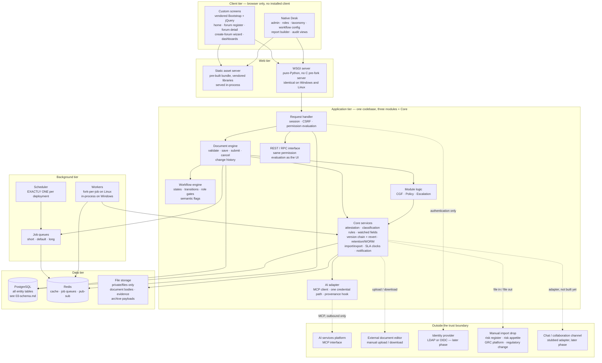
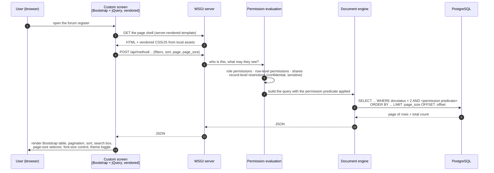
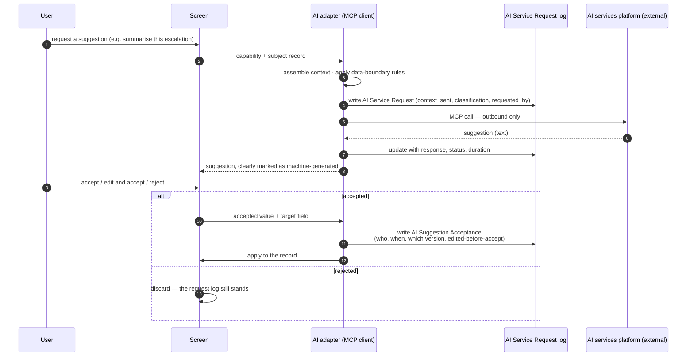
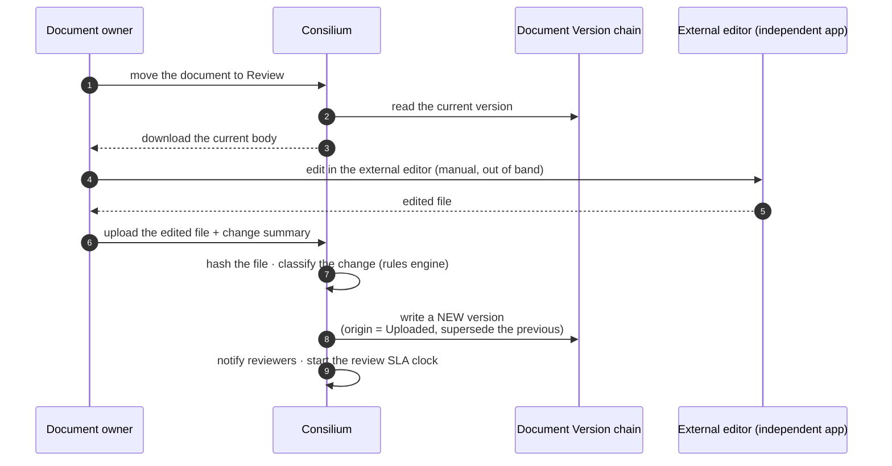
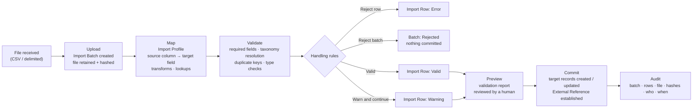
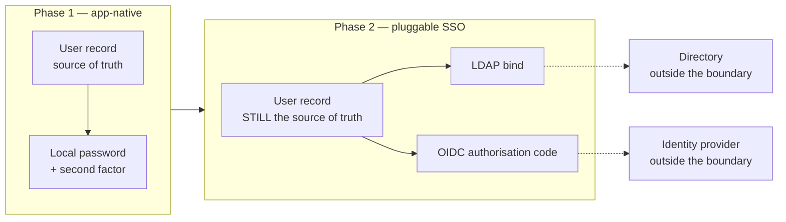
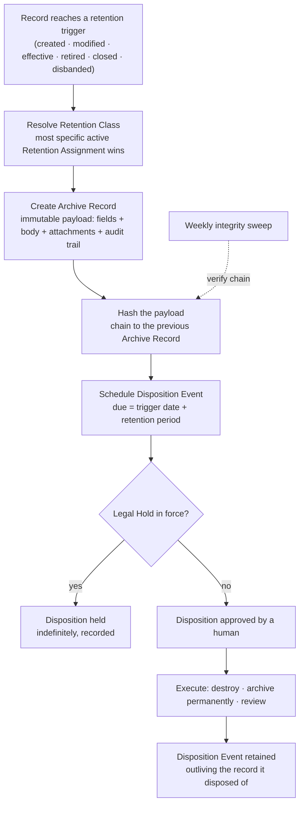
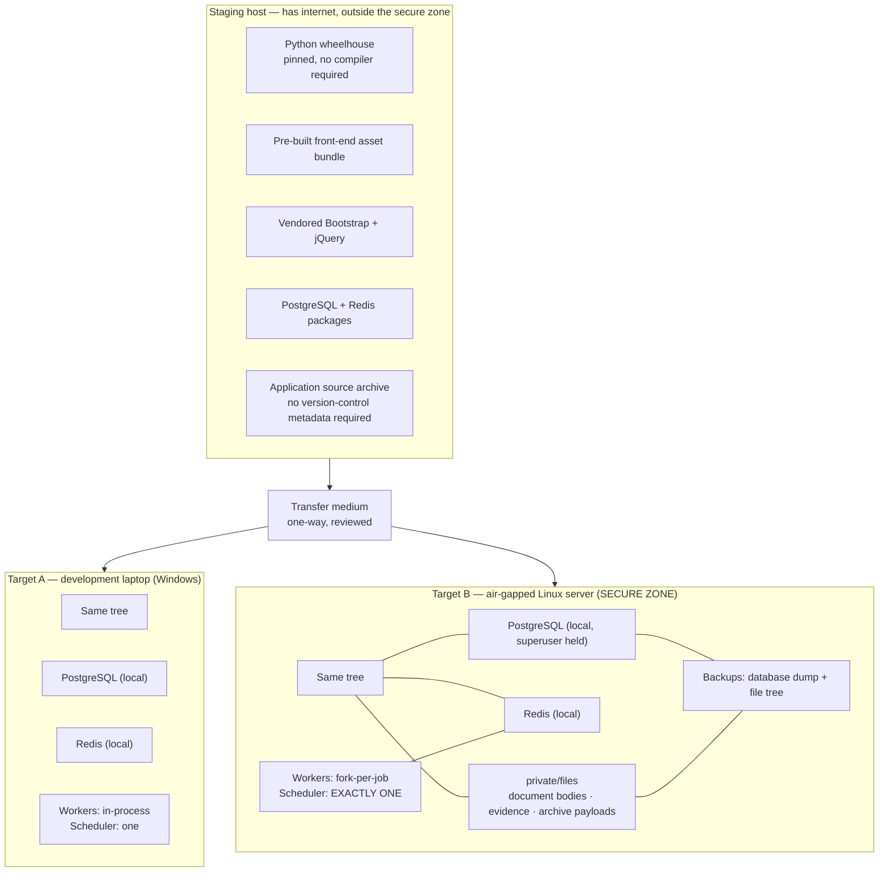

# Consilium — Architecture

**Product:** Consilium, an enterprise Governance, Risk & Policy platform
**Document:** 04 of 07 — Architecture
**Companions:** `02-data-model.md` (entities), `03-schema.md` (physical schema)

---

## 1. Architectural position in one page

| Decision | Position | Why |
|---|---|---|
| **Platform** | **Frappe Framework v15**, a metadata-driven application framework, on PostgreSQL. | It ships the governance primitives — configurable workflow, role and row-level permissions, immutable workflow-action records, field-level change history, assignment routing, notifications, report builder, REST interface — that would otherwise be the majority of the build. |
| **Database** | PostgreSQL, self-installed, superuser held by the delivery team. | Site creation needs `CREATE DATABASE` and `CREATE ROLE`. Holding superuser also makes the extensions in `03-schema.md` §7.4 available. |
| **Deployment targets** | (1) a Windows laptop for local development and demonstration; (2) an **air-gapped Linux server** for the real deployment. | Both run the **same tree**. The cross-platform toolchain built in phase one replaces the framework's POSIX-only orchestration layer with a portable one, and every compatibility patch is a no-op on Linux. |
| **Network** | **No internet at install time and none at run time.** | Everything is pre-staged: Python wheels, the built front-end asset bundle, vendored front-end libraries. No package manager fetch, no content delivery network, no remote font, no telemetry. |
| **UI** | **Hybrid.** Custom vendored Bootstrap + jQuery screens for the pages users see daily; native Desk for administration. | The custom screens are the ones that are demonstrated and used; the administrative screens are the ones that are expensive to rebuild and that nobody demonstrates. |
| **AI** | External. Reached over an MCP interface. | We call it. We do not build, host or train it. |
| **Document editing** | External and independent. Documents are uploaded manually. | **We hold the authoritative body and its version chain.** |
| **Connectors** | None in this phase. Manual and file-based import and export. | Removes four undiscovered external systems from the critical path. |
| **Retention and immutability** | Built here. | No longer an outbound hook. |

---

## 2. Component architecture

### 2.1 Component diagram

### 2.2 What each component is, concretely

| Component | What it actually is | Notes for this build |
|---|---|---|
| **Static asset server** | The framework's own in-process static handler. | There is **no reverse proxy** in the reference deployment. The orchestration layer built in phase one serves `/assets` and `/files` in-process precisely because nginx is not available on the target. A deployment that puts a proxy in front must also take over static serving; a half-measure produces a page that loads its HTML and then fails every asset request. That exact failure was hit and fixed in phase one. |
| **WSGI server** | A pure-Python WSGI server. | Chosen because the conventional pre-fork server cannot run on Windows at all, and the objective is one tree for both targets. |
| **Request handler** | Session resolution, CSRF, and **permission evaluation**. | Permission evaluation happens here, server-side, for **every** path — the custom screens, the Desk, the REST interface and the report builder. This is why the hybrid UI is safe: a custom screen cannot widen access, because it asks the same API the Desk asks. |
| **Document engine** | Validate, save, submit, cancel; writes change history. | All application-level integrity from `03-schema.md` §9.2 lives here. |
| **Workflow engine** | States, transitions and role gates held as configuration records. | Transitions set the **semantic flags** (`is_editable`, `is_active`, `requires_review`). No application code compares a state string. |
| **Core services** | The ten shared services of `02-data-model.md` §5. | Built once, used by all three modules. This is the concrete meaning of "one platform, not three systems". |
| **AI adapter** | An MCP client: one connection, one credential path, one audit hook. | Every AI capability in the programme goes through it. It writes `AI Service Request` before the call and `AI Suggestion Acceptance` when a user accepts. |
| **Job queues and workers** | Redis-backed queues with three priority tiers and a per-tier timeout. | On Linux, fork-per-job with hard timeouts. On Windows, in-process execution without crash isolation — a Windows-only limitation, mitigated by running several supervised workers. The air-gapped Linux server is unaffected. |
| **Scheduler** | The cron-equivalent that enqueues time-based work. | **Exactly one scheduler process across the whole deployment.** There is no leader election. Two schedulers means every attestation campaign is generated twice, every reminder fires twice, and every service-level breach is raised twice. |
| **Redis** | Cache, job queues, and pub-sub for realtime. | Installed locally from staged packages. Not a shared enterprise instance. |
| **File storage** | The site's `private/files` directory. | Everything is private; nothing in this platform may be served unauthenticated. See `03-schema.md` §10. |

### 2.3 Scheduled work — the obligations that make the platform run

Every one of these is a requirement, not an optimisation. They are listed here
because the scheduler is a single point of failure and this is what it carries.

| Schedule | Job | Requirement |
|---|---|---|
| Daily | Generate attestation tasks for campaigns whose open date has arrived | G-10, P-8 |
| Daily | Attestation reminders at configured offsets | G-14, P-8 |
| Daily | Periodic review due and overdue detection | P-10, G-10 |
| Daily | Monitoring activity due detection | P-11 |
| Daily | Horizon scan due notification | P-8 |
| Daily | Risk acceptance reassessment due | E-9 |
| Hourly | Service-level breach and warning sweep | E-13, P-7 |
| Daily | Retention evaluation; archive creation for newly eligible records | G-16, P-18, E-18 |
| Daily | Disposition due detection; legal-hold suppression | G-16, P-18, E-18 |
| Weekly | Archive hash-chain integrity verification | G-16, P-18, E-18 |
| Daily | Metadata remediation detection — retired parents, deactivated owners and taxonomy values, disbanded approving forums | P-23 |
| Daily | Membership expiry and delegation window expiry | G-13 |
| Quarterly | Periodic submission reminders and nil-return prompts | E-11 |
| Nightly | Search index refresh | G-2, P-2, E-2 |

---

## 3. The hybrid UI split

### 3.1 Which surface serves which screen

| Screen | Surface | Why |
|---|---|---|
| Home page with the user guide | **Custom** | It is the first thing anyone sees, and the guide content is a stated requirement. |
| Forum register — the main table | **Custom** | The most-used screen. Pagination, sort, search and configurable page size, hand-built. |
| Forum detail, including the interconnectivity view | **Custom** | Demonstrated constantly; the flow-chart view has no native equivalent. |
| Create-forum wizard | **Custom** | A guided multi-step flow with inline guidance, which a generic form cannot express. |
| Dashboards | **Custom** | Layout is specified; native dashboard layout is not configurable to it. |
| Policy register and detail, escalation register and detail | **Custom** | Same reasoning as the forum screens. Built after the CGF screens. |
| Personal task and attestation inbox | **Custom** | Cross-module; no native screen aggregates it. |
| Role and permission administration | **Desk** | Rebuilding the permission administration screen is how audit findings happen. |
| Taxonomy maintenance and CSV import | **Desk** | Native list, form and import tooling, for free. |
| Workflow configuration | **Desk** | The workflow is a configuration record; the native editor is the point. |
| Report builder, query reports, export | **Desk** | Substantial functionality, zero demonstration value, high rebuild cost. |
| Change-history and audit views | **Desk** | Native rendering of the change trail. |
| Notification template administration | **Desk** | |
| Data import and error inspection | **Desk + custom** | Native tooling for taxonomy CSV; a custom screen for the governed `Import Batch` path, because it has its own validation report. |

### 3.2 How a custom screen talks to the backend

**The three rules that make this safe and keep it cheap:**

1. **The custom screen never queries the database.** It calls the same
   permission-evaluated API the Desk calls. A screen cannot widen access,
   because it is not the thing that decides access.
2. **Paging happens in SQL, not in the browser.** `LIMIT`/`OFFSET` with a
   separate count. A screen that fetches everything and paginates client-side
   will work on a demonstration dataset and fail on the real forum inventory.
3. **The vendored libraries are checked into the repository and served from
   local assets.** No content delivery network reference exists anywhere. On the
   air-gapped server a CDN reference does not degrade — it simply fails, so this
   is not a style preference.

### 3.3 The cross-cutting UI obligations

Present on **every** custom page, with no exceptions:

| Obligation | Implementation |
|---|---|
| Table pagination, sort, search, configurable page size | One shared table component, server-side paging. **No table plugin.** |
| Font-size control | A dropdown that sets a root font-size scale, persisted per user. |
| Light and dark theme, switchable in the UI | CSS custom properties with two token sets; a persisted preference. The dark theme uses a dark-blue background. |
| Permission-aware rendering | Actions are hidden when the API says the user lacks the permission, and the API refuses them regardless. **Hiding is presentation; the refusal is the control.** |

---

## 4. The external AI services boundary

### 4.1 What crosses it

### 4.2 The boundary rules

| Rule | Reason |
|---|---|
| **Outbound only.** The AI platform never calls into Consilium. | An inbound path would be a second authentication surface and a second permission model. There is no requirement for one. |
| **One adapter, one credential path, one audit hook.** | Fourteen AI use cases across the programme, one integration. The alternative is fourteen places where a credential and a data-boundary rule can be got wrong. |
| **Every request is logged before it is sent**, including the exact context. | This is the data-boundary control. "What left the building" must be answerable without asking the external platform. |
| **Every acceptance is logged against a specific record version.** | This answers "is any part of this approved document machine-generated, and who signed for it". |
| **Confidential and restricted content is gated** by `context_classification` against a configured policy. | P-1 and E-16 restrict who may see such content; sending it to an external service is a disclosure. |
| **The platform degrades cleanly when the AI service is unreachable.** | It is unreachable by design on an air-gapped server unless a path is explicitly opened. Every AI action is an optional assist on a workflow that completes without it. **No requirement among the 64 depends on the AI platform being available.** |

---

## 5. The external document editor boundary

### 5.1 What we hold and what we do not

| Held here | Held there |
|---|---|
| The authoritative document body for every version | The editing session |
| The version chain, version numbers and labels | Inline comments during editing |
| Content hashes | Revision suggestions during editing |
| Change summaries and classification | Real-time collaboration |
| Revert | — |
| Retention of prior versions | — |
| Publication and audience | — |
| The audit trail of who did what | — |

### 5.2 The round trip

**Why manual upload is architecturally acceptable, and where it is weak.**

It is acceptable because the version chain — the thing the audit requirements
actually turn on — is ours and is unbroken. Every upload produces a version with
an author, a timestamp, a hash and a summary.

It is weak in one specific place: **between download and upload, the platform
does not know what happened.** If two people download and both upload, the
second upload supersedes the first silently. The mitigation is a **checkout
flag** on the document — soft-locked to one editor at a time, with the lock
visible and releasable by an administrator. This is a small build and it is
recorded in `07-assumptions-and-gaps.md` as an item to confirm rather than
assumed away.

---

## 6. The manual import path that replaces connectors

### 6.1 Why this shape

Four external systems were to be connectors: the enterprise risk register, the
risk appetite system, the GRC platform and the regulatory-change feed. All four
are now file-based. Rather than four bespoke importers, there is **one governed
import pipeline** with per-source configuration.

The requirements those connectors were to satisfy — field mapping, validation,
handling rules for missing and invalid data, traceability for audit — are
**preserved in full** and satisfied by the pipeline. What is lost is timeliness,
not control.

### 6.2 The pipeline

**Properties that matter:**

| Property | How |
|---|---|
| **Nothing commits without review.** | The batch stops at the validation report. A human commits it. |
| **Idempotent.** | `External Reference (external_system, external_key)` is the idempotency key. Re-importing the same file updates rather than duplicates. |
| **Fully traceable.** | The file as received is retained and hashed; every row keeps its raw and mapped payload; the batch records who committed it and when. This is P-20's "integration activity and data exchanges shall be traceable to support audit". |
| **Reversible in practice.** | A bad batch is identifiable by its batch reference, so the affected records can be found. **Note honestly: there is no automatic rollback.** Committed records are ordinary records. Reversal is a corrective import or a manual correction, both audited. |
| **Forward-compatible.** | When a real connector is eventually built, it populates the same `Import Batch` and `External Reference` rows. Nothing downstream changes. |

### 6.3 Export

The mirror image, and simpler. `Export Batch` records what was generated, from
what filter, by whom, with a hash of the output. It satisfies the outbound
halves of G-19, P-20 and E-19 and gives the same audit trail as the import side.

---

## 7. Identity and single sign-on

### 7.1 The position

| Point | Detail |
|---|---|
| **The user record is the source of truth**, in both phases. | Every person-shaped reference in the data model resolves locally. No record depends on an external directory being reachable — which matters on an air-gapped server. |
| **Single sign-on is an authentication method**, bound to an existing local record. | It answers "is this really them", not "who exists". |
| **LDAP and OIDC are both supported by the framework.** | LDAP has first-class configuration including group mapping. OIDC is configured as a social-login provider. |
| **SAML is not present in the framework.** | Verified: there is no SAML implementation in the framework source. If SAML is mandated rather than OIDC, it is an **additional build or an additional component**, not a configuration. This is flagged in `07-assumptions-and-gaps.md`. |
| **Group-to-role mapping is optional and deliberate.** | The framework can map directory groups to roles. Whether to do so is a governance decision: it makes provisioning automatic and it makes role assignment invisible to this platform's own audit trail. **Recommendation: map groups to a small set of coarse roles only, and keep record-level accountability roles under local control.** |

---

## 8. Retention, immutability and disposition

### 8.1 The flow

### 8.2 What "write-once" means here — stated precisely

The platform **cannot** make a PostgreSQL row physically immutable. Immutability
is delivered by four mechanisms, and a reviewer should see all four:

| # | Mechanism | Layer | Strength |
|---|---|---|---|
| 1 | No application code path updates or deletes an `Archive Record`; the entity is submittable and `cancel`/`amend` are revoked from every role. | Application | Strong against normal use, silent against direct SQL. |
| 2 | `REVOKE UPDATE, DELETE` on the archive table from the application's database role. | Database | Strong against the application and against anything using its credentials. |
| 3 | The hash chain: each archive record hashes its own payload plus the previous record's chain hash, verified weekly. | Data | Makes any out-of-band modification **detectable**, not preventable. |
| 4 | Payload files written to storage the deployment configures as immutable. | Infrastructure | **Not decided.** Depends on the filesystem and backup product for the air-gapped server. |

> **Mechanism 4 is an infrastructure obligation this document cannot discharge.**
> The honest position: mechanisms 1–3 give strong tamper *evidence* and good
> tamper *resistance*; genuine write-once media requires a storage decision that
> has not been taken. It is recorded in `07-assumptions-and-gaps.md` as an open
> item with a named owner requirement.

---

## 9. Air-gapped deployment topology

### 9.1 The two targets

### 9.2 What crosses which boundary

This is the table a security reviewer will read first.

| Boundary | Direction | What crosses | When | Control |
|---|---|---|---|---|
| Staging host → secure zone | **In, one-way** | Python wheels, asset bundle, vendored libraries, database and cache packages, application source archive | At install and at each release | Reviewed transfer medium. Nothing is fetched at install time. Every artefact is pinned and hashed. |
| Browser → web tier | Both | HTTPS requests and responses | Continuous | Session authentication, CSRF, server-side permission evaluation on every request |
| Web tier → application tier | Both | In-process | Continuous | Same process; not a trust boundary |
| Application tier → PostgreSQL | Both | SQL | Continuous | Local connection, dedicated role, not superuser at run time |
| Application tier → Redis | Both | Cache and queue traffic | Continuous | Local, bound to loopback |
| Application tier → file storage | Both | Document bodies, evidence, archive payloads | Continuous | Local filesystem; nothing served unauthenticated |
| **Application tier → AI services platform** | **Out only** | The context assembled for one request, and nothing else | Only on an explicit user action | `AI Service Request` written **before** the call; data-boundary classification gate; **requires an explicitly opened egress path, which by default does not exist** |
| **User ↔ external document editor** | Both, **manual** | A document body downloaded, an edited body uploaded | On demand | Not a network path at all. A human moves the file. |
| **Manual import drop → application** | **In only** | Delimited files from the risk register, risk appetite system, GRC platform and regulatory-change source | On a business cadence | File retained and hashed; validated; committed only after human review |
| **Application → export drop** | **Out only** | Generated delimited files | On demand or on a schedule | `Export Batch` records filter, count, hash, who and when |
| Application tier → identity provider | Out only, **later phase** | Authentication traffic only | At login | Not present in phase one |
| Application tier → chat channel | Out only, **later phase** | Notification payloads | On notification | Adapter stubbed; not built |

**The point a reviewer should take away:** in the delivered phase-one
configuration, the secure zone has **no outbound network dependency of any
kind**. The AI platform, the identity provider and the chat channel are all
later-phase additions, each requiring an explicitly opened path, and **not one
of the 64 requirements depends on any of them.**

### 9.3 Deployment constraints carried forward from the platform work

| Constraint | Detail | Consequence if broken |
|---|---|---|
| **Exactly one scheduler** | The scheduler does not elect a leader. | Every attestation task, reminder, retention evaluation and service-level breach fires twice. |
| **No package-manager step at build or run time** | The front-end bundle is pre-built and committed. | An install that reaches for a package registry fails on the air-gapped server, at the worst moment. |
| **No content delivery network reference anywhere** | Bootstrap and jQuery are vendored. | The page renders unstyled and non-functional in the secure zone. |
| **Static assets must be served** | There is no reverse proxy by default; the in-process handler does it. | HTML loads, every asset 404s, blank page. This exact failure occurred once already. |
| **Windows workers have no crash isolation** | No process fork available. | A job that crashes takes its worker down. Mitigate with several supervised workers. **Applies to the laptop only; the Linux server keeps fork-per-job.** |
| **Document rendering to a fixed-layout format needs a staged binary** | The rendering engine is an external binary. | Export to a fixed-layout format fails. It must be staged with everything else and is listed as unproven. |
| **Do not fork the framework** | Every compatibility change is a runtime patch, a no-op on Linux, with a test. | A fork means owning security patching forever. The index-naming issue in `03-schema.md` §7.2 should be fixed with a patch, not a fork. |

### 9.4 Backup and recovery

Two things must be backed up together and restored together, because neither is
complete alone:

1. The **database** — a native dump. The toolchain already restores without
   requiring an archive utility on the host, which matters on a minimal server.
2. The **file tree** under `private/files` — document bodies, evidence and
   archive payloads.

A database restored without its files leaves every document body dangling; a
file tree restored without its database has no index into it. **The hashes on
`Document Version` and `Archive Record` are the mechanism for verifying that a
restored pair is consistent** — which is a second reason they exist.

Ownership of backups and their retention has not been settled. Recorded in
`07-assumptions-and-gaps.md`.

---

## 10. Non-functional positions

| Concern | Position | Basis |
|---|---|---|
| **Availability** | Single-node. No clustering in this phase. | No requirement specifies availability. The scheduler's single-instance constraint means horizontal scaling needs a deliberate design, not a copy of the node. |
| **Scale** | Comfortable. The largest entity population is in the low thousands; the largest tables are the change log and the notification dispatch log. | `03-schema.md` §12. |
| **Performance** | Determined almost entirely by the indexes in `03-schema.md` §7. | The default framework behaviour on PostgreSQL leaves out two whole index families. |
| **Security** | Server-side permission evaluation on every path, including the REST interface and the report builder. Restricted-record handling is an explicit build, not a native feature. | P-1, P-13, E-16. |
| **Auditability** | Native change history plus workflow-action records, plus the platform's own additions: approval decisions, attestation responses, AI provenance, import batches, revert log, archive chain. | G-9, P-9, E-12 and the retention requirements. |
| **Disaster recovery** | Restore the database and the file tree together; verify with the stored hashes. | §9.4. |
| **Observability** | Scheduled-job logs, error logs, and the platform's own dispatch and batch logs. **No external telemetry, and none possible in the secure zone.** | Air-gapped constraint. |
